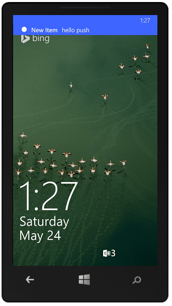

 <properties
	pageTitle="向移动服务应用 (Xamarin.Forms) 添加推送通知 - 移动服务"
	description="了解如何借助 Azure 移动服务在 Xamarin.Forms 应用中使用推送通知。"
	documentationCenter="xamarin"
	authors="wesmc7777"
	manager="dwrede"
	services="mobile-services"
	editor=""/>

<tags
	ms.service="mobile-services"
	ms.date="06/10/2015"
	wacn.date="10/22/2015"/>

# 向 Xamarin.Forms 应用添加推送通知
[AZURE.INCLUDE [mobile-services-selector-get-started-push](../includes/mobile-services-selector-get-started-push.md)]

##概述

本教程演示如何使用 Azure 移动服务将推送通知发送到 Xamarin.Forms 解决方案的 iOS、Android 和 Windows Phone 应用。首先，创建移动服务。然后，将下载初学者示例、注册到相应的推送通知服务，并将代码添加到解决方案以从这些新服务接收通知。

你完成本教程后，每当用户向其中一个应用添加任务时，你的移动服务都会发送推送通知。你可以在此处找到已完成的示例：[已完成的 Xamarin.Forms Azure 推送通知示例]。

本教程需要的内容如下：

+ IOS 8 设备（无法在 iOS 模拟器中测试推送通知）
+ iOS 开发人员计划成员身份
+ [Xamarin.iOS Studio]
+ [Azure 移动服务组件]
+ 有效的 Google 帐户
+ [Google Cloud Messaging 客户端组件]。在学习本教程的过程中，你将要添加此组件。

本主题内容：

1. [创建新的移动服务](#create-service)
2. [下载并配置初学者示例](#download-starter-sample)
4. [向 Xamarin.Forms.iOS 应用添加推送通知](#iOS)
5. [向 Xamarin.Forms.Android 应用添加推送通知](#Android)
6. [向 Xamarin.Forms.Windows 应用添加推送通知](#Windows)
7. [更新 Azure 表插入脚本将推送通知发送到所有应用](#all-apps)

## 创建新的移动服务

[AZURE.INCLUDE [mobile-services-create-new-service-data](../includes/mobile-services-create-new-service-data.md)]

为了能够在新移动服务中存储应用程序数据，必须先创建一个新表。

1. 在管理门户中单击“移动服务”，然后单击你刚刚创建的移动服务。

2. 单击“数据”选项卡，然后单击“+创建”。

    ![][123]

   	此时将显示“创建新表”对话框。

3. 在“表名”中键入 _TodoItem_，然后单击勾选按钮。

    ![][124]

  	这将创建一个新的设置了默认权限的存储表 **TodoItem**，这意味着任何应用程序用户均可访问和更改该表中的数据。

    > [AZURE.NOTE]移动服务快速入门中使用了相同的表名。但是，每个表是在特定于给定移动服务的架构中创建的。这是为了防止当多个移动服务使用同一数据库时发生数据冲突。

4. 单击新的 **TodoItem** 表，然后验证是否不存在任何数据行。

5. 单击“列”选项卡，并验证是否只有一个“ID”列，该列是自动为你创建的。

  	这是对移动服务中的表的最低要求。

    > [AZURE.NOTE]如果在移动服务中启用了动态架构，则通过插入或更新操作向移动服务发送 JSON 对象时，将自动创建新列。

现在，您可以将新移动服务用作应用的数据存储。

## 下载并配置初学者示例
我们将向现有示例添加推送通知。
  
1. 下载以下示例：[Xamarin.Forms Azure 推送通知初学者示例]。

2. 在管理门户中单击“移动服务”，然后单击移动服务。单击“仪表板”选项卡，并记下“站点 URL”。然后单击“管理密钥”，并记下“应用程序密钥”。从应用代码访问移动服务时，你需要使用这些值。

3. 在解决方案的 **ToDoAzure(Portable)** 项目中，打开 **Constants.cs** 文件，将 `ApplicationURL` 和 `ApplicationKey` 替换为你在上一步中获得的站点 URL 和应用程序密钥。

## 向 Xamarin.Forms.iOS 应用添加推送通知

你将使用 Apple 推送通知服务 (APNS) 向 iOS 应用添加推送通知。你将需要有效的 Google 帐户和 [Google Cloud Messaging 客户端组件]。

>[AZURE.IMPORTANT]由于 Apple 推送通知服务 (APNS) 要求，你必须在支持 iOS 的设备（iPhone 或 iPad），而不是在模拟器上部署和测试推送通知。

APNS 使用证书对你的移动服务进行身份验证。按照以下说明创建必要的证书并将其上载到你的移动服务。有关正式的 APNS 功能文档，请参阅 [Apple 推送通知服务]。

### 生成证书签名请求文件

首先，你必须生成证书签名请求 (CSR) 文件，Apple 将使用该文件生成签名证书。

1. 从“Utilities”（实用工具）中，运行 **Keychain Access** 工具。

2. 单击“Keychain Access”，展开“Certificate Assistant”（证书助理），然后单击“Request a Certificate from a Certificate Authority...”（从证书颁发机构请求证书...）。

    ![][5]

3. 输入你的“User Email Address”（用户电子邮件地址），键入“Common Name”（公用名）值，确保已选择“Saved to disk”（保存到磁盘），然后单击“Continue”（继续）。

    ![][6]

4. 在“Save As”（另存为）中为证书签名请求 (CSR) 文件键入一个名称，在“Where”（位置）中选择一个位置，然后单击“Save”（保存）。

    ![][7]

    请记住你选择的位置。

接下来，你将要向 Apple 注册你的应用程序、启用推送通知并上载这个导出的 CSR 以创建一个推送证书。

### 为推送通知注册应用程序

若要将推送通知从移动服务发送到 iOS 应用程序，你必须向 Apple 注册应用程序，并注册推送通知。

1. 如果你尚未注册应用程序，请导航到 Apple 开发人员中心的 <a href="http://go.microsoft.com/fwlink/p/?LinkId=272456" target="_blank">iOS 设置门户</a>，使用 Apple ID 登录，单击“Identifiers”（标识符），然后单击“App IDs”（应用程序 ID），最后单击“+”符号创建应用程序的应用程序 ID。

    ![][102]

2. 在“Description”（说明）中为应用程序键入一个名称，记住唯一的“Bundle Identifier”（捆绑标识符），在“App Services”（应用程序服务）部分中选中“Push Notifications”（推送通知）选项，然后单击“Continue”（继续）。此示例将使用 ID **MobileServices.Quickstart**，但你不可以重用这个 ID，因为应用程序 ID 在所有用户之间必须唯一。因此，建议在应用程序名称的后面附加完整名称或首字母。

    ![][103]

    此时将会生成你的应用程序 ID 并请求你**提交**该信息。单击“提交”。

    ![][104]

    单击“Submit”（提交）后，你将会看到如下所示的“Registration complete”（注册已完成）屏幕。单击“Done”（完成）。

    ![][105]

3. 找到你刚刚创建的应用程序 ID，然后单击其行。

    ![][106]

    单击应用程序 ID 会显示有关应用程序和应用程序 ID 的详细信息。单击“设置”按钮。

    ![][107]

4. 滚动到屏幕底部并单击“Development Push SSL Certificate”（开发推送 SSL 证书 ）部分下的“Create Certificate...”（创建证书...）按钮。

    ![][108]

    将显示“Add iOS Certificate”（添加 iOS 证书）助手。

    注意：本教程使用开发证书。注册生产证书时使用相同的过程。将证书上载至移动服务时，只需确保设置了相同的证书类型即可。

5. 单击“Choose File”（选择文件），浏览到前面保存 CSR 文件的位置，然后单击“Generate”（生成）。

    ![][110]

6. 门户创建证书之后，请单击“Download”（下载）按钮，然后单击“Done”（完成）。

    ![][111]

    随后将会下载签名证书并将其保存到计算机上的 Downloads 文件夹。

    ![][9]

    注意：默认情况下，下载的文件（开发证书）名为 <strong>aps\_development.cer</strong>。

7. 双击下载的推送证书 **aps\_development.cer**。

    将在 Keychain 中安装新证书，如下所示：

    ![][10]

    注意：证书中的名称可能不同，但将以 <strong>Apple Development iOS Push Notification Services:</strong> 作为前缀。

稍后，你将要使用此证书生成一个 .p12 文件，并将其上载到移动服务以使用 APNS 启用身份验证。

### 为应用程序创建配置文件

1. 返回 <a href="http://go.microsoft.com/fwlink/p/?LinkId=272456" target="_blank">iOS 设置门户</a>，选择“Provisioning Profiles”（设置配置文件），选择“All”（全部），然后单击“+”按钮创建一个新的配置文件。此时会启动“Add iOS Provisiong Profile”（添加 iOS 设置配置文件）向导。

    ![][112]

2. 选择“Development”（开发）下的“iOS App Development”（iOS 应用程序开发）作为设置配置文件类型，然后单击“Continue”（继续）。

3. 接下来，从“App ID”（应用程序 ID）下拉列表中选择移动服务快速入门应用程序的应用程序 ID，然后单击“Continue”（继续）。

    ![][113]

4. 在“Select certificates”（选择证书）屏幕中，选择前面创建的证书，然后单击“Continue”（继续）。

    ![][114]

5. 接下来，选择要用于测试的“Devices”（设备），然后单击“Continue”（继续）。

    ![][115]

6. 最后，在“Profile Name”（配置文件名称）中为配置文件选取一个名称，单击“Generate”（生成），然后单击“Done”（完成）。

    ![][116]

    此操作可创建新的配置文件。

    ![][117]

7. 在 Xcode 中，打开“Organizer”（组织程序）并选择“Devices”（设备）视图，在左窗格的“Library”（库）部分选择“Provisioning Profiles”（预配配置文件），然后单击中间窗格底部的“刷新”按钮。

### 配置移动服务以发送推送请求

将应用注册到 APNS 并配置项目后，接下来必须配置移动服务以便与 APNS 集成。

1. 在 Keychain Access 中，右键单击新证书，单击“Export”（导出），为文件命名，选择 **.p12** 格式，然后单击“Save”（保存）。

    ![][28]

    记下文件名和导出的证书的位置。

2. 登录到 [Azure 管理门户]，单击“移动服务”，然后单击你的应用。

    ![][18]

3. 单击“推送”选项卡，单击“Apple 推送通知设置”下的“上载”。

    ![][19]

    此时将显示“上载证书”对话框。

4. 单击“文件”，选择导出的 .p12 证书文件，输入密码，确保已选择正确的“模式”，单击勾选图标，然后单击“保存”。

    ![][20]

现在，你的移动服务已配置为使用 APNS。

### 配置 Xamarin.iOS 应用程序

1. 在 Xamarin.Studio 或 Visual Studio 中，打开 **Info.plist**，然后使用前面创建的 ID 更新“捆绑标识符”。

    ![][121]

2. 向下滚动到“Background Modes”（后台模式）并选中“Enable Background Modes”（启用后台模式）框和“Remote notifications”（远程通知）框。

    ![][122]

3. 在解决方案面板中双击你的项目以打开“Project Options”（项目选项）。

4.  在“Build”（生成）下面选择“iOS Bundle Signing”（iOS 捆绑签名），并选择你刚刚为此项目设置的“Identity”（标识）和“Provisioning profile”（设置配置文件）。

    ![][120]

    这可以确保 Xamarin 项目使用新配置文件进行代码签名。有关正式的 Xamarin 设备设置文档，请参阅 [Xamarin 设备设置]。

### 向应用程序添加推送通知

1. 在 Xamarin.Studio 或 Visual Studio 中，展开 **ToDoAzure.iOS** 项目，打开 **AppDelegate** 类，然后将 **FinishedLaunching** 事件替换为以下代码：

        public override bool FinishedLaunching(UIApplication app, NSDictionary options)
        {
             // registers for push for iOS8
            var settings = UIUserNotificationSettings.GetSettingsForTypes(
                UIUserNotificationType.Alert
                | UIUserNotificationType.Badge
                | UIUserNotificationType.Sound,
                new NSSet());

            global::Xamarin.Forms.Forms.Init();
            instance = this;
            CurrentPlatform.Init();
            
            todoItemManager = new ToDoItemManager();
            App.SetTodoItemManager(todoItemManager);

            UIApplication.SharedApplication.RegisterUserNotificationSettings(settings);
            UIApplication.SharedApplication.RegisterForRemoteNotifications();
            
            LoadApplication(new App());
            return base.FinishedLaunching(app, options);
        }

2. 在 **AppDelegate** 中，重写 **RegisteredForRemoteNotifications** 事件：

        public override void RegisteredForRemoteNotifications(UIApplication application, NSData deviceToken)
        {
            // Modify device token
            string _deviceToken = deviceToken.Description;
            _deviceToken = _deviceToken.Trim('<', '>').Replace(" ", "");

            // Get Mobile Services client
            MobileServiceClient client = todoItemManager.GetClient;

            // Register for push with Mobile Services
            IEnumerable<string> tag = new List<string>() { "uniqueTag" };
            
            const string template = "{"aps":{"alert":"$(message)"}}";

            var expiryDate = DateTime.Now.AddDays(90).ToString
                (System.Globalization.CultureInfo.CreateSpecificCulture("zh-CN"));

            var push = client.GetPush();

            push.RegisterTemplateAsync(_deviceToken, template, expiryDate, "myTemplate", tag)
        }

3. 在 **AppDelegate** 中，重写 **ReceivedRemoteNotification** 事件：

        public override void ReceivedRemoteNotification(UIApplication application, NSDictionary userInfo)
        {
            NSObject inAppMessage;

            bool success = userInfo.TryGetValue(new NSString("inAppMessage"), out inAppMessage);

            if (success)
            {
                var alert = new UIAlertView("Got push notification", inAppMessage.ToString(), null, "OK", null);
                alert.Show();
            }
        }

你的应用现已更新，可支持推送通知。

### 在管理门户中更新已注册的插入脚本

1. 在管理门户中，单击“数据”选项卡，然后单击“TodoItem”表。

    ![][21]

2. 在 **todoitem** 中，单击“脚本”选项卡，然后选择“插入”。

    ![][22]

    将显示当 **TodoItem** 表中发生插入时所调用的函数。

3. 将 insert 函数替换为以下代码，然后单击“保存”：

          function insert(item, user, request) {
          // Execute the request and send notifications.
             request.execute({
             success: function() {                      
              // Create a template-based payload.
              var payload = '{ "message" : "New item added: ' + item.text + '" }';            

              // Write the default response and send a notification
              // to all platforms.            
              push.send(null, payload, {               
                  success: function(pushResponse){
                  console.log("Sent push:", pushResponse);
                  // Send the default response.
                  request.respond();
                  },              
                  error: function (pushResponse) {
                      console.log("Error Sending push:", pushResponse);
                       // Send the an error response.
                      request.respond(500, { error: pushResponse });
                      }           
               });                 
              }
           });   
          }

    这将会注册一个新的插入脚本，该脚本将推送通知（插入的文本）发送到插入请求中提供的设备。

   >[AZURE.NOTE]此脚本将延迟发送通知，使你有足够的时间关闭应用程序以接收 toast 通知。

### 在应用程序中测试推送通知

1. 在支持 iOS 的设备中按“运行”按钮以生成项目并启动应用程序，然后单击“确定”接受推送通知

   >[AZURE.NOTE]你必须显式接受来自应用程序的推送通知。此请求只会在首次运行应用程序时出现。

2. 在应用中，单击“添加”按钮，添加任务标题，然后单击“保存”按钮。 

3. 检查是否已收到通知，然后单击“确定”以取消通知。

你已成功完成本教程。

## 向 Xamarin.Forms.Android 应用添加推送通知

你将使用 Google Cloud Messaging (GCM) 服务向 Android 应用添加推送通知。你将需要有效的 Google 帐户和 [Google Cloud Messaging 客户端组件]。

###启用 Google Cloud Messaging

[AZURE.INCLUDE [mobile-services-enable-Google-cloud-messaging](../includes/mobile-services-enable-google-cloud-messaging.md)]

###配置移动服务以发送推送请求

[AZURE.INCLUDE [mobile-services-android-configure-push](../includes/mobile-services-android-configure-push.md)]

###更新已注册的插入脚本以发送通知

>[AZURE.NOTE]以下步骤说明了如何在 Azure 管理门户中，更新已注册到 TodoItem 表上的插入操作的脚本。你也可以在 Visual Studio 的“服务器资源管理器”的“Azure”节点中直接访问和编辑此移动服务脚本。

1. 在管理门户中，单击“数据”选项卡，然后单击“TodoItem”表。

	![][21]

2. 在 **todoitem** 中，单击“脚本”选项卡，然后选择“插入”。

	![][22]

    This displays the function that is invoked when an insert occurs in the **TodoItem** table.

3. 将 insert 函数替换为以下代码，然后单击“保存”：

          function insert(item, user, request) {
          // Execute the request and send notifications.
             request.execute({
             success: function() {                      
              // Create a template-based payload.
              var payload = '{ "message" : "New item added: ' + item.text + '" }';            

              // Write the default response and send a notification
              // to all platforms.            
              push.send(null, payload, {               
                  success: function(pushResponse){
                  console.log("Sent push:", pushResponse);
                  // Send the default response.
                  request.respond();
                  },              
                  error: function (pushResponse) {
                      console.log("Error Sending push:", pushResponse);
                       // Send the an error response.
                      request.respond(500, { error: pushResponse });
                      }           
               });                 
              }
           });   
          }

    这将会注册一个新的插入脚本，该脚本将推送通知（插入的文本）发送到插入请求中提供的设备。

   >[AZURE.NOTE]此脚本将延迟发送通知，使你有足够的时间关闭应用程序以接收 toast 通知。

###为推送通知配置现有项目

1. 在“解决方案”视图中，展开 Xamarin.Android 应用中的 **Components** 文件夹，确保 Azure 移动服务包已安装。 

2. 右键单击 **Components** 文件夹，单击“获取更多组件...”，搜索 **Google Cloud Messaging 客户端**组件，并将其添加到项目中。

3. 打开 MainActivity.cs 项目文件，将以下 using 语句添加到该类：

		using Gcm.Client;

4.	在 **MainActivity** 类中，将以下代码添加到 **OnCreate** 方法中调用 **LoadApplication** 方法的后面：
            
            try
            {
                // Check to ensure everything's setup right
                GcmClient.CheckDevice(this);
                GcmClient.CheckManifest(this);

                // Register for push notifications
                System.Diagnostics.Debug.WriteLine("Registering...");
                GcmClient.Register(this, PushHandlerBroadcastReceiver.SENDER_IDS);
            }
            catch (Java.Net.MalformedURLException)
            {
                CreateAndShowDialog(new Exception("There was an error creating the Mobile Service. Verify the URL"), "Error");
            }
            catch (Exception e)
            {
                CreateAndShowDialog(e, "Error");
            }

你的 **MainActivity** 现已准备就绪，可以添加推送通知了。

###向应用程序添加推送通知代码

1. 在 ToDoAzure.Droid 项目中，创建一个名为 `GcmService` 的新类。

2. 将以下 using 语句添加到 **GcmService** 类：

		using Gcm.Client;
		using Microsoft.WindowsAzure.MobileServices;

3. 在 **using** 语句和 **namespace** 声明之间添加以下权限请求：

		[assembly: Permission(Name = "@PACKAGE_NAME@.permission.C2D_MESSAGE")]
        [assembly: UsesPermission(Name = "@PACKAGE_NAME@.permission.C2D_MESSAGE")]
        [assembly: UsesPermission(Name = "com.google.android.c2dm.permission.RECEIVE")]

        //GET_ACCOUNTS is only needed for android versions 4.0.3 and below
        [assembly: UsesPermission(Name = "android.permission.GET_ACCOUNTS")]
        [assembly: UsesPermission(Name = "android.permission.INTERNET")]
        [assembly: UsesPermission(Name = "android.permission.WAKE_LOCK")]

4. 在 **GcmService.cs** 项目文件中，添加以下类：
 
        [BroadcastReceiver(Permission = Gcm.Client.Constants.PERMISSION_GCM_INTENTS)]
        [IntentFilter(new string[] { Gcm.Client.Constants.INTENT_FROM_GCM_MESSAGE }, Categories = new string[] { "@PACKAGE_NAME@" })]
        [IntentFilter(new string[] { Gcm.Client.Constants.INTENT_FROM_GCM_REGISTRATION_CALLBACK }, Categories = new string[] { "@PACKAGE_NAME@" })]
        [IntentFilter(new string[] { Gcm.Client.Constants.INTENT_FROM_GCM_LIBRARY_RETRY }, Categories = new string[] { "@PACKAGE_NAME@" })]

        public class PushHandlerBroadcastReceiver : GcmBroadcastReceiverBase<GcmService>
        {
        
            public static string[] SENDER_IDS = new string[] { "<PROJECT_NUMBER>" };

        }

	在上述代码中，你必须将 _`<PROJECT_NUMBER>`_ 替换为你在 Google 开发人员门户中预配应用时 Google 分配的项目编号。

5. 在 GcmService.cs 项目文件中，添加定义 **GcmService** 类的以下代码：
 
         [Service]
         public class GcmService : GcmServiceBase
         {
             public static string RegistrationID { get; private set; }

             public GcmService()
                 : base(PushHandlerBroadcastReceiver.SENDER_IDS){}
         }

	请注意，此类派生自 **GcmServiceBase**，**Service** 属性必须应用于此类。

	>[AZURE.NOTE]**GcmServiceBase** 类实现 **OnRegistered()**、**OnUnRegistered()**、**OnMessage()** 和 **OnError()** 方法。必须在 **GcmService** 类中重写这些方法。

6. 将以下代码添加到 **GcmService** 类，以便重写 **OnRegistered** 事件处理程序。

        protected override void OnRegistered(Context context, string registrationId)
        {
            Log.Verbose(PushHandlerBroadcastReceiver.TAG, "GCM Registered: " + registrationId);
            RegistrationID = registrationId;

            createNotification("GcmService Registered...", "The device has been Registered, Tap to View!");

            MobileServiceClient client =  MainActivity.DefaultService.todoItemManager.GetClient;
            
            var push = client.GetPush();

            MainActivity.DefaultService.RunOnUiThread(() => Register(push, null));

        }
        public async void Register(Microsoft.WindowsAzure.MobileServices.Push push, IEnumerable<string> tags)
        {
            try
            {
                const string template = "{"data":{"message":"$(message)"}}";

                await push.RegisterTemplateAsync(RegistrationID, template, "mytemplate", tags);
            }
            catch (Exception ex)
            {
                System.Diagnostics.Debug.WriteLine(ex.Message);
                Debugger.Break();
            }
        }

	此方法使用返回的 GCM 注册 ID 向 Azure 注册以获取推送通知。

7. 在 **GcmService** 中使用以下代码重写 **OnMessage** 方法：

        protected override void OnMessage(Context context, Intent intent)
        {
            Log.Info(PushHandlerBroadcastReceiver.TAG, "GCM Message Received!");

            var msg = new StringBuilder();

            if (intent != null && intent.Extras != null)
            {
                foreach (var key in intent.Extras.KeySet())
                    msg.AppendLine(key + "=" + intent.Extras.Get(key).ToString());
            }

            //Store the message
            var prefs = GetSharedPreferences(context.PackageName, FileCreationMode.Private);
            var edit = prefs.Edit();
            edit.PutString("last_msg", msg.ToString());
            edit.Commit();

            string message = intent.Extras.GetString("message");
            if (!string.IsNullOrEmpty(message))
            {
                createNotification("New todo item!", "Todo item: " + message);
                return;
            }

            string msg2 = intent.Extras.GetString("msg");
            if (!string.IsNullOrEmpty(msg2))
            {
                createNotification("New hub message!", msg2);
                return;
            }

            createNotification("Unknown message details", msg.ToString());
        }

        void createNotification(string title, string desc)
        {
            //Create notification
            var notificationManager = GetSystemService(Context.NotificationService) as NotificationManager;

            //Create an intent to show ui
            var uiIntent = new Intent(this, typeof(MainActivity));

            //Create the notification
            var notification = new Notification(Android.Resource.Drawable.SymActionEmail, title);

            //Auto cancel will remove the notification once the user touches it
            notification.Flags = NotificationFlags.AutoCancel;

            //Set the notification info
            //we use the pending intent, passing our ui intent over which will get called
            //when the notification is tapped.
            notification.SetLatestEventInfo(this, title, desc, PendingIntent.GetActivity(this, 0, uiIntent, 0));

            //Show the notification
            notificationManager.Notify(1, notification);
        }

8. 为项目编译所需的 **OnUnRegistered()** 和 **OnError()** 添加以下方法重写。

        protected override void OnError(Context context, string errorId)
        {
              Log.Error(PushHandlerBroadcastReceiver.TAG, "GCM Error: " + errorId);
        }

###在应用程序中测试推送通知

你可以通过以下方式测试应用程序：使用 USB 电缆直接连接 Android 手机，或者在模拟器中使用虚拟设备。

当你在模拟器中运行此应用程序时，请确保使用支持 Google API 的 Android 虚拟设备 (AVD)。

> [AZURE.IMPORTANT]为了接收推送通知，你必须在 Android 虚拟设备上设置 Google 帐户（方法如下：在模拟器中，导航到“设置”，然后单击“添加帐户”）。此外，请确保模拟器已连接到 Internet。

1. 从“工具”中，单击“打开 Android 模拟器管理器”，选择你的设备，然后单击“编辑”。
    
    ![][125]

2. 在“目标”中选择“Google API”，然后单击“确定”。
    
    ![][126]

3. 在顶部工具栏中，单击“运行”，然后选择你的应用。这将启动模拟器并运行该应用程序。

  应用将从 GCM 检索 *registrationId* 并注册到通知中心。

4. 在应用中，添加新的任务。

5. 从屏幕顶部向下轻扫，打开设备的通知中心以查看通知。

	![][127]

## 向 Xamarin.Forms.Windows 应用添加推送通知

本节演示如何使用 Azure 移动服务将推送通知发送到 Xamarin.Forms 解决方案包含的 Windows Phone Silverlight 应用。

###更新应用程序以注册通知

只有在你注册通知通道后，你的应用程序才能接收推送通知。

1. 在 Visual Studio 中，打开文件 App.xaml.cs 并添加以下 `using` 语句：

        using Microsoft.Phone.Notification;

2. 将以下代码添加到 App.xaml.cs：
	
        public static HttpNotificationChannel CurrentChannel { get; private set; }

        private void AcquirePushChannel()
        {
            CurrentChannel = HttpNotificationChannel.Find("MyPushChannel");

            if (CurrentChannel == null)
            {
                CurrentChannel = new HttpNotificationChannel("MyPushChannel");
                CurrentChannel.Open();
                CurrentChannel.BindToShellToast();
            }

            CurrentChannel.ChannelUriUpdated +=
                new EventHandler<NotificationChannelUriEventArgs>(async (o, args) =>
                {

                   // Register for notifications using the new channel
                    const string template =
                    "<?xml version="1.0" encoding="utf-8"?><wp:Notification " +
                    "xmlns:wp="WPNotification"><wp:Toast><wp:Text1>$(message)</wp:Text1></wp:Toast></wp:Notification>";

                    await client.GetPush()
                        .RegisterTemplateAsync(CurrentChannel.ChannelUri.ToString(), template, "mytemplate");
                });
        }

    此代码检索 ChannelURI 以查找来自 Microsoft 推送通知服务 (MPNS) （由 Windows Phone 8.x "Silverlight" 使用）的应用程序， 然后注册该 ChannelURI 以支持推送通知。

	>[AZURE.NOTE]在本教程中，移动服务将向设备发送一条 toast 通知。而当你发送磁贴通知时，必须在通道上调用 **BindToShellTile** 方法。

3. 在 App.xaml.cs 中 **Application\_Launching** 事件处理程序的顶部，添加对新的 **AcquirePushChannel** 方法的以下调用：

        AcquirePushChannel();

	这可以确保每次加载页时都会请求注册。在应用程序中，你可能只需要定期执行此注册以确保注册是最新的。

4. 按 **F5** 键以运行应用。将显示包含注册密钥的弹出式对话框。
  
5.	在解决方案资源管理器中，展开“属性”，打开 WMAppManifest.xml 文件，单击“功能”选项卡并确保选中 **ID\_\_\_CAP\_\_\_PUSH\_NOTIFICATION** 功能。

   	

   	这可以确保你的应用程序能够引发 toast 通知。

###更新服务器脚本以发送推送通知

最后，您必须更新注册到 TodoItem 表上的插入操作的脚本，以便发送通知。

1. 在管理门户中，单击“数据”选项卡，然后单击“TodoItem”表。

    ![][21]

2. 在 **todoitem** 中，单击“脚本”选项卡，然后选择“插入”。

    ![][22]

    将显示当 **TodoItem** 表中发生插入时所调用的函数。

3. 将 insert 函数替换为以下代码，然后单击“保存”：
          
          function insert(item, user, request) {
          // Execute the request and send notifications.
             request.execute({
             success: function() {                      
              // Create a template-based payload.
              var payload = '{ "message" : "New item added: ' + item.text + '" }';            

              // Write the default response and send a notification
              // to all platforms.            
              push.send(null, payload, {               
                  success: function(pushResponse){
                  console.log("Sent push:", pushResponse);
                  // Send the default response.
                  request.respond();
                  },              
                  error: function (pushResponse) {
                      console.log("Error Sending push:", pushResponse);
                       // Send the an error response.
                      request.respond(500, { error: pushResponse });
                      }           
               });                 
              }
           });   
          }

    这将会注册一个新的插入脚本，该脚本将推送通知（插入的文本）发送到插入请求中提供的设备。

4. 单击“推送”选项卡，选中“启用未经身份验证的推送通知”，然后单击“保存”。

	这样，移动服务便可以连接到处于未经身份验证模式的 MPNS 以发送推送通知。

	>[AZURE.NOTE]本教程使用未经身份验证模式下的 MPNS。在此模式下，MPNS 将限制可发送到某个设备通道的通知数。若要解除此限制，必须生成一个证书，然后通过单击“上载”并选择该证书来上载该证书。有关生成证书的详细信息，请参阅 [设置已经过身份验证的 Web 服务以便为 Windows Phone 发送推送通知]。

###在应用程序中测试推送通知

1. 在 Visual Studio 中，按 F5 键运行应用程序。

    >[AZURE.NOTE]在 Windows Phone 模拟器测试时，你可能会遇到 401 错误“未授权的 RegistrationAuthorizationException”。由于 Windows Phone 模拟器时钟与主机电脑时钟的同步问题，在调用 `RegisterNativeAsync()` 期间可能会出现此错误。这可能会导致安全令牌被拒绝。若要解决此问题，只需在模拟器中手动设置时钟，然后再开始测试。

2. 在应用中，创建具有标题 **Hello push** 的新任务，然后立即单击“开始”按钮，或者单击“后退”按钮以退出应用。

  	此时会将一个插入请求发送到移动服务，以存储添加的项。可以看到，设备收到了一条包含 **hello push** 字样的 toast 通知。

	

	>[AZURE.NOTE]如果你仍未退出应用程序，则不会收到该通知。若要在应用处于活动状态时接收 toast 通知，你必须处理 [ShellToastNotificationReceived](http://msdn.microsoft.com/zh-cn/library/windowsphone/develop/microsoft.phone.notification.httpnotificationchannel.shelltoastnotificationreceived(v=vs.105).aspx) 事件。
   
<!-- Anchors. -->
[Generate the certificate signing request]: #certificates
[Register your app and enable push notifications]: #register
[Create a provisioning profile for the app]: #profile
[Configure Mobile Services]: #configure-mobileServices
[Configure the Xamarin.iOS App]: #configure-app
[Update scripts to send push notifications]: #update-scripts
[Add push notifications to the app]: #add-push
[Insert data to receive notifications]: #test

<!-- Images. -->

[5]: ./media/partner-xamarin-mobile-services-xamarin-forms-get-started-push/mobile-services-ios-push-step5.png
[6]: ./media/partner-xamarin-mobile-services-xamarin-forms-get-started-push/mobile-services-ios-push-step6.png
[7]: ./media/partner-xamarin-mobile-services-xamarin-forms-get-started-push/mobile-services-ios-push-step7.png

[9]: ./media/partner-xamarin-mobile-services-xamarin-forms-get-started-push/mobile-services-ios-push-step9.png
[10]: ./media/partner-xamarin-mobile-services-xamarin-forms-get-started-push/mobile-services-ios-push-step10.png

[17]: ./media/partner-xamarin-mobile-services-xamarin-forms-get-started-push/mobile-services-ios-push-step17.png
[18]: ./media/partner-xamarin-mobile-services-xamarin-forms-get-started-push/mobile-services-selection.png
[19]: ./media/partner-xamarin-mobile-services-xamarin-forms-get-started-push/mobile-push-tab-ios.png
[20]: ./media/partner-xamarin-mobile-services-xamarin-forms-get-started-push/mobile-push-tab-ios-upload.png
[21]: ./media/partner-xamarin-mobile-services-xamarin-forms-get-started-push/mobile-portal-data-tables.png
[22]: ./media/partner-xamarin-mobile-services-xamarin-forms-get-started-push/mobile-insert-script-push2.png
[23]: ./media/partner-xamarin-mobile-services-xamarin-forms-get-started-push/mobile-quickstart-push1-ios.png
[24]: ./media/partner-xamarin-mobile-services-xamarin-forms-get-started-push/mobile-quickstart-push2-ios.png
[25]: ./media/partner-xamarin-mobile-services-xamarin-forms-get-started-push/mobile-quickstart-push3-ios.png
[26]: ./media/partner-xamarin-mobile-services-xamarin-forms-get-started-push/mobile-quickstart-push4-ios.png
[28]: ./media/partner-xamarin-mobile-services-xamarin-forms-get-started-push/mobile-services-ios-push-step18.png

[101]: ./media/partner-xamarin-mobile-services-xamarin-forms-get-started-push/mobile-services-ios-push-01.png
[102]: ./media/partner-xamarin-mobile-services-xamarin-forms-get-started-push/mobile-services-ios-push-02.png
[103]: ./media/partner-xamarin-mobile-services-xamarin-forms-get-started-push/mobile-services-ios-push-03.png
[104]: ./media/partner-xamarin-mobile-services-xamarin-forms-get-started-push/mobile-services-ios-push-04.png
[105]: ./media/partner-xamarin-mobile-services-xamarin-forms-get-started-push/mobile-services-ios-push-05.png
[106]: ./media/partner-xamarin-mobile-services-xamarin-forms-get-started-push/mobile-services-ios-push-06.png
[107]: ./media/partner-xamarin-mobile-services-xamarin-forms-get-started-push/mobile-services-ios-push-07.png
[108]: ./media/partner-xamarin-mobile-services-xamarin-forms-get-started-push/mobile-services-ios-push-08.png

[110]: ./media/partner-xamarin-mobile-services-xamarin-forms-get-started-push/mobile-services-ios-push-10.png
[111]: ./media/partner-xamarin-mobile-services-xamarin-forms-get-started-push/mobile-services-ios-push-11.png
[112]: ./media/partner-xamarin-mobile-services-xamarin-forms-get-started-push/mobile-services-ios-push-12.png
[113]: ./media/partner-xamarin-mobile-services-xamarin-forms-get-started-push/mobile-services-ios-push-13.png
[114]: ./media/partner-xamarin-mobile-services-xamarin-forms-get-started-push/mobile-services-ios-push-14.png
[115]: ./media/partner-xamarin-mobile-services-xamarin-forms-get-started-push/mobile-services-ios-push-15.png
[116]: ./media/partner-xamarin-mobile-services-xamarin-forms-get-started-push/mobile-services-ios-push-16.png
[117]: ./media/partner-xamarin-mobile-services-xamarin-forms-get-started-push/mobile-services-ios-push-17.png

[120]: ./media/partner-xamarin-mobile-services-xamarin-forms-get-started-push/mobile-services-ios-push-20.png
[121]: ./media/partner-xamarin-mobile-services-xamarin-forms-get-started-push/mobile-services-ios-push-21.png
[122]: ./media/partner-xamarin-mobile-services-xamarin-forms-get-started-push/mobile-services-ios-push-22.png
[123]: ./media/partner-xamarin-mobile-services-xamarin-forms-get-started-push/mobile-data-tab-empty.png
[124]: ./media/partner-xamarin-mobile-services-xamarin-forms-get-started-push/mobile-create-todoitem-table.png
[125]: ./media/partner-xamarin-mobile-services-xamarin-forms-get-started-push/notification-hub-create-android-app7.png
[126]: ./media/partner-xamarin-mobile-services-xamarin-forms-get-started-push/notification-hub-create-android-app8.png
[127]: ./media/partner-xamarin-mobile-services-xamarin-forms-get-started-push/notification-area-received.png

[Xamarin.iOS Studio]: http://xamarin.com/platform
[Install Xcode]: https://go.microsoft.com/fwLink/p/?LinkID=266532
[iOS Provisioning Portal]: http://go.microsoft.com/fwlink/p/?LinkId=272456
[Mobile Services iOS SDK]: https://go.microsoft.com/fwLink/p/?LinkID=266533
[Apple 推送通知服务]: http://go.microsoft.com/fwlink/p/?LinkId=272584
[Get started with Mobile Services]: /documentation/articles/mobile-services-ios-get-started

[Xamarin 设备设置]: http://developer.xamarin.com/guides/ios/getting_started/installation/device_provisioning/

[Azure 管理门户]: https://manage.windowsazure.cn/
[apns object]: http://go.microsoft.com/fwlink/p/?LinkId=272333
[Azure 移动服务组件]: http://components.xamarin.com/view/azure-mobile-services/
[completed example project]: http://go.microsoft.com/fwlink/p/?LinkId=331303
[Xamarin.iOS]: http://xamarin.com/download
[Google Cloud Messaging 客户端组件]: http://components.xamarin.com/view/GCMClient/
[Xamarin.Forms Azure 推送通知初学者示例]: https://github.com/Azure/mobile-services-samples/tree/master/TodoListXamarinForms
[已完成的 Xamarin.Forms Azure 推送通知示例]: https://github.com/Azure/mobile-services-samples/tree/master/GettingStartedWithPushXamarinForms
 

<!---HONumber=74-->