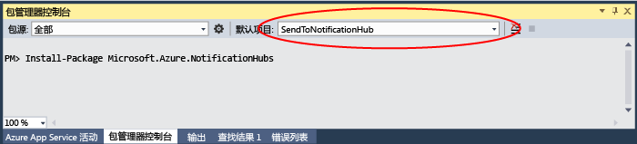

<properties
	pageTitle="使用通知中心针对 Xamarin 应用发送 iOS 推送通知 | Azure"
	description="在本教程中，你将了解如何使用 Azure 通知中心将推送通知发送到 Xamarin iOS 应用程序。"
	services="notification-hubs"
        keywords="ios 推送通知, 推送消息, 推送通知, 推送消息"
	documentationCenter="xamarin"
	authors="ysxu"
	manager="dwrede"
	editor=""/>

<tags
	ms.service="notification-hubs"
	ms.date="02/15/2016"
	wacn.date="05/31/2016"/>

# 使用通知中心针对 Xamarin 应用发送 iOS 推送通知

[AZURE.INCLUDE [notification-hubs-selector-get-started](../includes/notification-hubs-selector-get-started.md)]

##概述
> [AZURE.IMPORTANT] 若要完成本教程，你必须有一个有效的 Azure 帐户。如果你没有帐户，只需花费几分钟就能创建一个免费试用帐户。有关详细信息，请参阅 [Azure 免费试用](/pricing/free-trial/)。

本教程演示如何使用 Azure 通知中心将推送通知发送到 iOS 应用程序。
你将创建一个空白 Xamarin.iOS 应用，它使用 [Apple Push Notification 服务 (APNs)](https://developer.apple.com/library/ios/documentation/NetworkingInternet/Conceptual/RemoteNotificationsPG/Chapters/ApplePushService.html) 接收推送通知。完成后，你将能够使用通知中心将推送通知广播到运行你的应用的所有设备。[NotificationHubs][GitHub] 应用程序示例中提供了完成的代码。

本教程演示使用通知中心的简单推送消息广播方案。

##先决条件

本教程需要的内容如下：

+ [Xcode 6.0][Install Xcode]
+ iOS 7.0（或更高版本）兼容设备
+ iOS 开发人员计划成员身份
+ [Xamarin Studio]

   > [AZURE.NOTE] 由于 iOS 推送通知配置要求，你必须在物理 iOS 设备（iPhone 或 iPad）而不是在模拟器上部署和测试示例应用程序。

只有在完成本教程后，才能完成有关 Xamarin iOS 应用的所有其他通知中心教程。

[AZURE.INCLUDE [通知中心：启用 Apple 推送通知](../includes/notification-hubs-enable-apple-push-notifications.md)]

##将你的应用连接到通知中心

#### 创建新项目

1. 在 Xamarin Studio 中，创建新的 iOS 项目，然后选择“统一 API”>“单视图应用程序”模板。

   	![Xamarin Studio - 选择应用程序类型][31]

2. 添加对 Azure 消息传送组件的引用。在“解决方案”视图中，右键单击你项目的“Components”文件夹，然后选择“获取更多组件”。搜索“Azure 消息传送”组件，并向你的项目添加该组件。

3. 在 **AppDelegate.cs** 中，添加以下 using 语句：

    	using WindowsAzure.Messaging;

4. 声明 **SBNotificationHub** 的实例：

		private SBNotificationHub Hub { get; set; }

5. 使用以下变量创建 **Constants.cs** 类：

        // Azure app-specific connection string and hub path
        public const string ConnectionString = "<Azure connection string>";
        public const string NotificationHubPath = "<Azure hub path>";

6. 在 **AppDelegate.cs** 中，更新 **FinishedLaunching()** 以匹配以下内容：

        public override bool FinishedLaunching(UIApplication application, NSDictionary launchOptions)
        {
            if (UIDevice.CurrentDevice.CheckSystemVersion (8, 0)) {
    			var pushSettings = UIUserNotificationSettings.GetSettingsForTypes (
                       UIUserNotificationType.Alert | UIUserNotificationType.Badge | UIUserNotificationType.Sound,
                       new NSSet ());

			    UIApplication.SharedApplication.RegisterUserNotificationSettings (pushSettings);
			    UIApplication.SharedApplication.RegisterForRemoteNotifications ();
			} else {
			    UIRemoteNotificationType notificationTypes = UIRemoteNotificationType.Alert | UIRemoteNotificationType.Badge | UIRemoteNotificationType.Sound;
			    UIApplication.SharedApplication.RegisterForRemoteNotificationTypes (notificationTypes);
			}

            return true;
        }

7. 重写 **AppDelegate.cs** 中的 **RegisteredForRemoteNotifications()** 方法：

        public override void RegisteredForRemoteNotifications(UIApplication application, NSData deviceToken)
        {
            Hub = new SBNotificationHub(Constants.ConnectionString, Constants.NotificationHubPath);

            Hub.UnregisterAllAsync (deviceToken, (error) => {
                if (error != null)
                {
                    Console.WriteLine("Error calling Unregister: {0}", error.ToString());
                    return;
                }

                NSSet tags = null; // create tags if you want
                Hub.RegisterNativeAsync(deviceToken, tags, (errorCallback) => {
                    if (errorCallback != null)
                        Console.WriteLine("RegisterNativeAsync error: " + errorCallback.ToString());
                });
            });
        }

8. 重写 **AppDelegate.cs** 中的 **ReceivedRemoteNotification()** 方法：

        public override void ReceivedRemoteNotification(UIApplication application, NSDictionary userInfo)
        {
            ProcessNotification(userInfo, false);
        }

9. 在 **AppDelegate.cs** 中创建以下 **ProcessNotification()** 方法：

        void ProcessNotification(NSDictionary options, bool fromFinishedLaunching)
        {
            // Check to see if the dictionary has the aps key.  This is the notification payload you would have sent
            if (null != options && options.ContainsKey(new NSString("aps")))
            {
                //Get the aps dictionary
                NSDictionary aps = options.ObjectForKey(new NSString("aps")) as NSDictionary;

                string alert = string.Empty;

                //Extract the alert text
                // NOTE: If you're using the simple alert by just specifying
                // "  aps:{alert:"alert msg here"}  ", this will work fine.
                // But if you're using a complex alert with Localization keys, etc.,
                // your "alert" object from the aps dictionary will be another NSDictionary.
                // Basically the JSON gets dumped right into a NSDictionary,
                // so keep that in mind.
                if (aps.ContainsKey(new NSString("alert")))
                    alert = (aps [new NSString("alert")] as NSString).ToString();

                //If this came from the ReceivedRemoteNotification while the app was running,
                // we of course need to manually process things like the sound, badge, and alert.
                if (!fromFinishedLaunching)
                {
                    //Manually show an alert
                    if (!string.IsNullOrEmpty(alert))
                    {
                        UIAlertView avAlert = new UIAlertView("Notification", alert, null, "OK", null);
                        avAlert.Show();
                    }
                }
            }
        }

    > [AZURE.NOTE] 你可以选择覆盖 **FailedToRegisterForRemoteNotifications()** 以处理无网络连接等情况。如果用户可能会在脱机模式下（例如飞行模式）下启动你的应用程序，并且你想要处理应用特定的推送消息方案，则此操作特别重要。

10. 在你的设备上运行应用程序。

<!--## 发送推送通知

在 [Azure 门户] 中通过“通知中心”页面上“故障排除”工具集中的“测试发送”功能来发送通知，可以在应用中测试推送通知的接收情况，如以下屏幕中所示。

通常，推送通知通过后端服务（例如移动服务或者使用兼容库的 ASP.NET）进行发送。如果你的方案中没有可用的库，则你也可以使用 REST API 直接发送推送消息。

在本教程中，为了保持内容的简单性，我们只会演示如何在控制台应用程序（而不是后端服务）中，使用通知中心的 .NET SDK 发送通知，以此测试你的客户端应用。建议你接下来学习[使用通知中心向用户推送通知](/documentation/articles/notification-hubs-aspnet-backend-ios-notify-users/)教程，以了解如何从 ASP.NET 后端发送通知。不过，可以使用以下方法来发送通知：

* **REST 接口**：可以使用 [REST 接口](http://msdn.microsoft.com/library/windowsazure/dn223264.aspx)在任何后端平台上支持推送通知。

* **Microsoft Azure 通知中心 .NET SDK**：在 Visual Studio 的 Nuget 包管理器中，运行 [Install-Package Microsoft.Azure.NotificationHubs](https://www.nuget.org/packages/Microsoft.Azure.NotificationHubs/)。

* **Node.js**：[如何通过 Node.js 使用通知中心](/documentation/articles/notification-hubs-nodejs-how-to-use-notification-hubs/)。

* **Azure 移动服务**：有关如何从与通知中心集成的 Azure 移动服务后端发送通知的示例，请参阅“移动服务中的推送通知入门”（[.NET 后端](/documentation/articles/mobile-services-javascript-backend-windows-universal-dotnet-get-started-push/) | [JavaScript 后端](/documentation/articles/mobile-services-javascript-backend-windows-universal-dotnet-get-started-push/)）。

* **Java/PHP**：有关如何使用 REST API 发送通知的示例，请参阅“如何通过 Java/PHP 使用通知中心”([Java](/documentation/articles/notification-hubs-java-backend-how-to/) | [PHP](/documentation/articles/notification-hubs-php-backend-how-to/))。

-->
####（可选）通过 .NET 控制台应用发送推送通知

在本部分，你将使用简单的 .NET 控制台应用发送推送通知。为了演示本示例，我们将切换到已安装 Visual Studio 的 Windows 开发环境。

1. 在 Visual Studio 中创建新的 Visual C# 控制台应用程序：

   	![Visual Studio - 新建控制台应用程序][213]

2. 在 Visual Studio 中，依次单击“工具”、“NuGet 包管理器”和“包管理器控制台”。

	包管理器控制台应显示在 Visual Studio 工作区的底部。

3. 在“包管理器控制台”窗口中，将“默认项目”设置为新的控制台应用程序项目，然后在控制台窗口中执行以下命令：

        Install-Package Microsoft.Azure.NotificationHubs

	这将使用 <a href="http://www.nuget.org/packages/Microsoft.Azure.NotificationHubs/">Microsoft.Azure.Notification Hubs NuGet 包</a>添加对 Azure 通知中心 SDK 的引用。

	

4. 打开 `Program.cs` 文件，并添加以下 `using` 语句，确保我们可以使用 Azure 类和你主类中的函数：

        using Microsoft.Azure.NotificationHubs;

3. 在你的 `Program` 类中，添加以下方法（不要忘了替换**连接字符串**和**中心名称**）：

        private static async void SendNotificationAsync()
        {
            NotificationHubClient hub = NotificationHubClient.CreateClientFromConnectionString("<connection string with full access>", "<hub name>");
            var alert = "{"aps":{"alert":"Hello from .NET!"}}";
            await hub.SendAppleNativeNotificationAsync(alert);
        }

4. 在 `Main` 方法中添加以下行：

         SendNotificationAsync();
		 Console.ReadLine();

5. 按 F5 键以运行应用。数秒内，你应在设备上看到一条推送通知。无论你使用 Wi-Fi 或移动电话数据网络，确保设备上存在可用的 Internet 连接。

可以在 Apple [本地和推送通知编程指南]中找到所有可能的负载。

####（可选）从移动服务发送通知

在本部分，我们将使用移动服务通过节点脚本来发送推送通知。

若要使用移动服务发送通知，请按[移动服务入门]中的说明操作，然后：

1. 登录到 [Azure 经典门户] 并选择你的移动服务。

2. 选择顶部的“计划程序”选项卡。

   	![Azure 经典门户 - 计划程序][215]

3. 创建新的计划作业，插入名称，然后选择“按需”。

   	![Azure 经典门户 - 新建作业][216]

4. 创建作业时，单击该作业名称。然后单击顶部栏上的“脚本”选项卡。

5. 在你的计划程序函数中插入以下脚本。确保将占位符替换为你先前获取的通知中心名称和 *DefaultFullSharedAccessSignature* 的连接字符串。单击“保存”。

		var azure = require('azure');
		var notificationHubService = azure.createNotificationHubService('<Hubname>', '<SAS Full access >');
		notificationHubService.apns.send(
	    	null,
    		{"aps":
        		{
          		"alert": "Hello from Mobile Services!"
        		}
    		},
    		function (error)
    		{
	        	if (!error) {
    	        	console.warn("Notification successful");
        		}
    		}
		);

6. 单击底部栏上的“运行一次”。你应在设备上收到警报。

## 后续步骤

在这个简单的示例中，你已将推送通知广播到所有 iOS 设备。若要针对特定客户，请参考教程[使用通知中心将通知推送到用户]。如果要按兴趣组划分用户，可以阅读[使用通知中心发送突发新闻]。请在[通知中心指南]和[适用于 iOS 的通知中心操作方法指南]中了解有关如何使用通知中心的详细信息。

<!-- Images. -->

[213]: ./media/partner-xamarin-notification-hubs-ios-get-started/notification-hub-create-console-app.png

[215]: ./media/partner-xamarin-notification-hubs-ios-get-started/notification-hub-scheduler1.png
[216]: ./media/partner-xamarin-notification-hubs-ios-get-started/notification-hub-scheduler2.png

[31]: ./media/partner-xamarin-notification-hubs-ios-get-started/notification-hub-create-ios-app.png

<!-- URLs. -->
[移动服务入门]: /documentation/articles/mobile-services-javascript-backend-windows-store-dotnet-push-notifications-app-users/
[ Azure 管理门户]: https://manage.windowsazure.cn/
[通知中心指南]: http://msdn.microsoft.com/zh-cn/library/jj927170.aspx
[适用于 iOS 的通知中心操作方法指南]: http://msdn.microsoft.com/zh-cn/library/jj927168.aspx
[Install Xcode]: https://go.microsoft.com/fwLink/p/?LinkID=266532
[使用通知中心将通知推送到用户]: /documentation/articles/notification-hubs-aspnet-backend-windows-dotnet-notify-users/
[使用通知中心发送突发新闻]: /documentation/articles/notification-hubs-windows-store-dotnet-send-breaking-news/

[本地和推送通知编程指南]: http://developer.apple.com/library/mac/#documentation/NetworkingInternet/Conceptual/RemoteNotificationsPG/Chapters/ApplePushService.html#//apple_ref/doc/uid/TP40008194-CH100-SW1
[Apple 推送通知服务]: http://go.microsoft.com/fwlink/p/?LinkId=272584

[Azure 移动服务组件]: http://components.xamarin.com/view/azure-mobile-services/
[GitHub]: http://go.microsoft.com/fwlink/p/?LinkId=331329
[Xamarin.iOS]: http://xamarin.com/download
[WindowsAzure.Messaging]: https://github.com/infosupport/WindowsAzure.Messaging.iOS

<!---HONumber=Mooncake_0523_2016-->