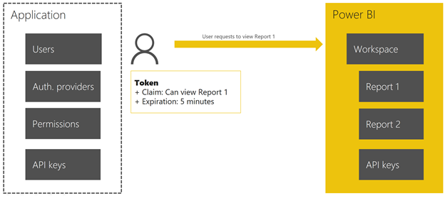

<properties
   pageTitle="通过 Power BI Embedded 进行身份验证和授权"
   description="通过 Power BI Embedded 进行身份验证和授权"
   services="power-bi-embedded"
   documentationCenter=""
   authors="mgblythe"
   manager="NA"
   editor=""
   tags=""/>

<tags
   ms.service="power-bi-embedded"
   ms.devlang="NA"
   ms.topic="article"
   ms.tgt_pltfrm="NA"
   ms.workload="powerbi"
   ms.date="07/26/2016"
   ms.author="mblythe"
   wacn.date="01/13/2017"/>  

# 通过 Power BI Embedded 进行身份验证和授权

Power BI Embedded 服务使用**密钥**和**应用令牌**进行身份验证和授权，而不是使用显式的最终用户身份验证。在此模型中，应用程序管理最终用户的身份验证和授权。如有必要，应用将创建并发送应用令牌，以指示服务来呈现所请求的报表。此设计不要求应用使用 Azure Active Directory 进行用户身份验证和授权，但仍然可以这样做。

## 进行身份验证的两种方式

**密钥** - 对于所有 Power BI Embedded REST API 调用，可以使用密钥。在 **Azure 门户预览**中，可以通过依次单击“所有设置”和“访问密钥”来找到密钥。请始终像对待密码一样对待密钥。这些密钥有权在特定的工作区集合上执行任何 REST API 调用。

若要在 REST 调用中使用密钥，请添加以下授权标头：

    Authorization: AppKey {your key}

**应用令牌** - 应用令牌用于所有嵌入请求。它们被设计为运行客户端，因此被限制到单个报表，并且最好设置一个过期时间。

应用令牌是由某个密钥签名的 JWT（JSON Web 令牌）。

应用令牌可以包含下列声明：

| 声明 | 说明 |
|--------------|------------|
| **ver** | 应用令牌的版本。当前版本为 0.2.0。 |
| **aud** | 令牌的目标接收方。对于 Power BI Embedded，请使用：“https://analysis.chinacloudapi.cn/powerbi/api”。 |
| **iss** | 一个字符串，指示颁发了令牌的应用程序。 |
| **type** | 要创建的应用令牌的类型。当前唯一支持的类型是 **embed**。 |
| **wcn** | 要为其颁发令牌的工作区集合名称。 |
| **wid** | 要为其颁发令牌的工作区 ID。 |
| **rid** | 要为其颁发令牌的报表 ID。 |
| **username**（可选） | 与 RLS 一起使用，这是一个字符串，可以在应用 RLS 规则时帮助标识用户。 |
| **roles**（可选） | 一个字符串，包含当应用行级别安全性规则时可选择的角色。如果传递多个角色，则应当以字符串数组形式传递它们。 |
| **exp**（可选） | 指示令牌将过期的时间。它们应当作为 Unix 时间戳传入。 |
| **nbf**（可选） | 指示令牌开始生效的时间。它们应当作为 Unix 时间戳传入。 |

示例应用令牌将如下所示：

  

当解码后，它将如下所示：

  

## 下面是流的工作原理

1. 将 API 密钥复制到应用程序中。可以在 **Azure 门户预览**中获取密钥。

      

2. 令牌将发布声明，并且有过期时间。

      

3. 令牌使用 API 访问密钥获得签名。

      

4. 用户请求查看报表。

      

5.	使用 API 访问密钥验证令牌。

      

6.	Power BI Embedded 向用户发送报表。

      

**Power BI Embedded** 向用户发送报表后，用户可以在自定义应用中查看报表。例如，如果导入了 [Analyzing Sales Data PBIX sample](http://download.microsoft.com/download/1/4/E/14EDED28-6C58-4055-A65C-23B4DA81C4DE/Analyzing_Sales_Data.pbix)（分析销售数据 PBIX 示例），该示例 Web 应用将如下所示：

  

## 另请参阅
- [Power BI Embedded 示例入门](/documentation/articles/power-bi-embedded-get-started-sample/)
- [常见 Power BI Embedded 方案](/documentation/articles/power-bi-embedded-scenarios/)
- [Power BI Embedded 入门](/documentation/articles/power-bi-embedded-get-started/)

<!---HONumber=Mooncake_1010_2016-->
