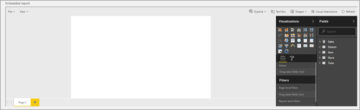
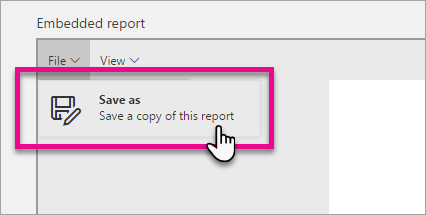

<properties
    pageTitle="在 Azure Power BI Embedded 中基于数据集创建新报表 | Microsoft 文档"
    description="现在，可以基于自有应用程序中的数据集创建 Power BI Embedded 报表。"
    services="power-bi-embedded"
    documentationcenter=""
    author="guyinacube"
    manager="erikre"
    editor=""
    tags=""
    translationtype="Human Translation" />
<tags
    ms.assetid=""
    ms.service="power-bi-embedded"
    ms.devlang="NA"
    ms.topic="article"
    ms.tgt_pltfrm="NA"
    ms.workload="powerbi"
    ms.date="03/11/2017"
    wacn.date="04/28/2017"
    ms.author="asaxton"
    ms.sourcegitcommit="a114d832e9c5320e9a109c9020fcaa2f2fdd43a9"
    ms.openlocfilehash="018846f965d37f42c9551b0db7e7fe818f2a8180"
    ms.lasthandoff="04/14/2017" />

# 在 Power BI Embedded 中基于数据集创建新报表

现在，可以基于自有应用程序中的数据集创建 Power BI Embedded 报表。 

身份验证方法类似于报表嵌入。 该方法基于特定于数据集的访问令牌。 用于 PowerBI.com 的令牌由 Azure Active Directory (AAD) 颁发，Power BI Embedded 令牌由你自己的服务颁发。

创建嵌入报表时，颁发的令牌用于特定的数据集。 令牌应与同一元素上的嵌入 URL 相关联，确保每个元素都有一个的唯一令牌。 若要创建嵌入式报表，必须在访问令牌中提供 *Dataset.Read 和 Workspace.Report.Create* 作用域。

## 创建所需的访问令牌用于创建新报表

Power BI Embedded 使用嵌入令牌，即经过 HMAC 签名的 JSON Web 令牌。 令牌已使用 Azure Power BI Embedded 工作区集合中的访问密钥签名。 默认情况下，嵌入令牌用于提供对要嵌入应用程序的报表的只读访问权限。 嵌入令牌是针对特定报表颁发的，应该与嵌入 URL 相关联。

应在服务器上创建访问令牌，因为要使用访问密钥对令牌进行签名/加密。 有关如何创建访问令牌的信息，请参阅[通过 Power BI Embedded 进行身份验证和授权](/documentation/articles/power-bi-embedded-app-token-flow/)。 此外，还可以查看 [CreateReportEmbedToken](https://docs.microsoft.com/dotnet/api/microsoft.powerbi.security.powerbitoken?redirectedfrom=MSDN#methods_) 方法。 以下示例演示了如何使用用于 Power BI 的 .NET SDK。

在本示例中，已提供用于创建新报表的数据集 ID。 还需要添加 *Dataset.Read 和 Workspace.Report.Create* 的作用域。

*PowerBIToken 类*要求安装 [Power BI Core NuGut 包](https://www.nuget.org/packages/Microsoft.PowerBI.Core/)。

**安装 NuGet 包**

    Install-Package Microsoft.PowerBI.Core

**C# 代码**

    using Microsoft.PowerBI.Security;

    // rlsUsername and roles are optional
    string scopes = "Dataset.Read Workspace.Report.Create";
    PowerBIToken embedToken = PowerBIToken.CreateReportEmbedTokenForCreation(workspaceCollectionName, workspaceId, datasetId, null, null, scopes);

    var token = embedToken.Generate("{access key}");

## 创建新的空白报表

若要创建新报表，应提供 create 配置。 此配置应包含访问令牌、embedURL，以及用于创建报表的 datasetID。 这就需要安装 [Power BI JavaScript NuGet 包](https://www.nuget.org/packages/Microsoft.PowerBI.JavaScript/)。 https://embedded.powerbi.cn/appTokenReportEmbed 即为 embedUrl。

> [AZURE.NOTE]
> 可以使用 [JavaScript 报表嵌入示例](https://microsoft.github.io/PowerBI-JavaScript/demo/)测试功能。 我们还提供了适用于不同操作的代码示例。

**安装 NuGet 包**

    Install-Package Microsoft.PowerBI.JavaScript

**JavaScript 代码**

    

  
    var embedCreateConfiguration = {
            accessToken: 'eyJ0eXAiO...Qron7qYpY9MI',
            embedUrl: 'https://embedded.powerbi.cn/appTokenReportEmbed',
            datasetId: '5dac7a4a-4452-46b3-99f6-a25915e0fe55',
        };
    
        // Grab the reference to the div HTML element that will host the report
        var reportContainer = $('#reportContainer')[0];

        // Create report
        var report = powerbi.createReport(reportContainer, embedCreateConfiguration);

调用 *powerbi.createReport()* 将在 *div* 元素中创建一个以编辑模式显示的空白画布。

## 保存新报表

在调用“另存为”操作之前，不会实际创建报表。 可以通过文件菜单或 JavaScript 完成此操作。

     // Get a reference to the embedded report.
        report = powerbi.get(reportContainer);
    
        var saveAsParameters = {
            name: "newReport"
        };

        // SaveAs report
        report.saveAs(saveAsParameters);

> [AZURE.IMPORTANT]
> 只有在调用“另存为”之后，才创建新报表。 保存后，画布仍以编辑模式而不是报表模式显示数据集。 需要重新加载新报表，就像使用其他任何报表时一样。

## 加载新报表

若要与新报表交互，需要像应用程序嵌入常规报表一样来嵌入新报表，这意味着，必须专门针对新报表颁发新令牌，然后调用 embed 方法。

    

  
    var embedConfiguration = {
            accessToken: 'eyJ0eXAiO...Qron7qYpY9MJ',
            embedUrl: 'https://embedded.powerbi.cn/appTokenReportEmbed',
            reportId: '5dac7a4a-4452-46b3-99f6-a25915e0fe54',
        };
    
        // Grab the reference to the div HTML element that will host the report
        var reportContainer = $('#reportContainer')[0];

        // Embed report
        var report = powerbi.embed(reportContainer, embedConfiguration);

## 使用“saved”事件自动保存和加载新报表

若要自动执行“另存为”过程，然后加载新报表，可以使用“saved”事件。 当保存操作已完成并返回包含新 reportId、报表名称、旧 reportId（如果有）的 Json 对象，并且操作是 saveAs 或 save 时，将激发此事件。

    {
      "reportObjectId": "5dac7a4a-4452-46b3-99f6-a25915e0fe54",
      "reportName": "newReport",
      "saveAs": true,
      "originalReportObjectId": null
    }

若要自动执行该过程，可以侦听“saved”事件，提取新的 reportId，创建新令牌，然后使用新令牌嵌入新报表。

    

  
    var embedCreateConfiguration = {
            accessToken: 'eyJ0eXAiO...Qron7qYpY9MI',
            embedUrl: 'https://embedded.powerbi.cn/appTokenReportEmbed',
            datasetId: '5dac7a4a-4452-46b3-99f6-a25915e0fe55',
        };
    
        // Grab the reference to the div HTML element that will host the report
        var reportContainer = $('#reportContainer')[0];

        // Create report
        var report = powerbi.createReport(reportContainer, embedCreateConfiguration);

       var saveAsParameters = {
            name: "newReport"
        };

        // SaveAs report
        report.saveAs(saveAsParameters);

        // report.on will add an event handler which prints to Log window.
        report.on("saved", function(event) {
        
             // get new Token
             var newReportId =  event.detail.reportObjectId;

            // create new Token. This is a function that the application should provide
            var newToken = createAccessToken(newReportId,scopes /*provide the wanted scopes*/);
        
        
        var embedConfiguration = {
            accessToken: newToken ,
            embedUrl: 'https://embedded.powerbi.cn/appTokenReportEmbed',
            reportId: newReportId,
        };

        // Embed report
        var report = powerbi.embed(reportContainer, embedConfiguration);
       
       // report.off removes a given event handler if it exists.
       report.off("saved");
        });

## 另请参阅

[示例入门](/documentation/articles/power-bi-embedded-get-started-sample/)  
[保存报表](/documentation/articles/power-bi-embedded-save-reports/)  
[嵌入报表](/documentation/articles/power-bi-embedded-embed-report/)  
[在 Power BI Embedded 中进行身份验证和授权](/documentation/articles/power-bi-embedded-app-token-flow/)  
[Power BI Desktop](https://powerbi.microsoft.com/documentation/powerbi-desktop-get-the-desktop/)  
[JavaScript 嵌入示例](https://microsoft.github.io/PowerBI-JavaScript/demo/)  
[Power BI Core NuGut 包](https://www.nuget.org/packages/Microsoft.PowerBI.Core/)  
[Power BI JavaScript 包](https://www.nuget.org/packages/Microsoft.PowerBI.JavaScript/)  
有更多问题？ [试用 Power BI 社区](http://community.powerbi.com/)

