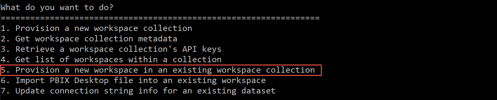
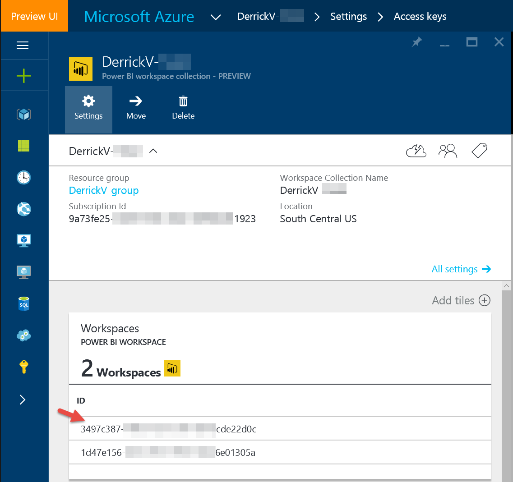
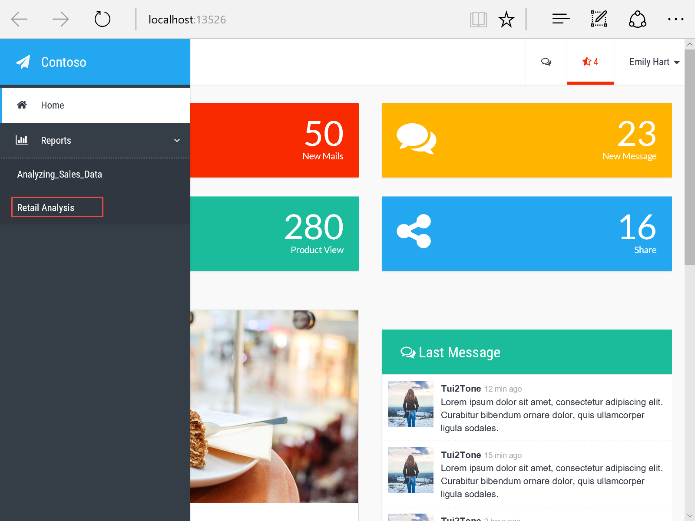
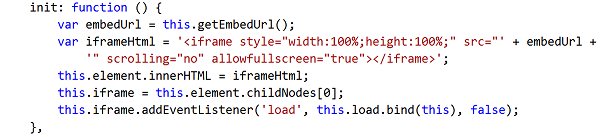

<properties
   pageTitle="示例入门"
   description="Power BI Embedded，使用 SDK 将交互式 Power BI 报表添加到商业智能应用程序"
   services="power-bi-embedded"
   documentationCenter=""
   authors="mgblythe"
   manager="NA"
   editor=""
   tags=""/>
<tags
   ms.service="power-bi-embedded"
   ms.devlang="NA"
   ms.topic="article"
   ms.tgt_pltfrm="NA"
   ms.workload="powerbi"
   ms.date="07/14/2016"
   ms.author="mblythe"
   wacn.date="01/13/2017"/>  


# Power BI Embedded 示例入门

通过 **Microsoft Power BI Embedded**，可以将 Power BI 报表集成到 web 或移动应用程序。本文介绍了 **Power BI Embedded** 入门示例。

在继续之前，可能需要保存以下资源。在将 Power BI 报表集成到示例应用和自己的应用中时，这些资源都可以提供帮助。

 -	[Power BI Embedded API 参考](https://msdn.microsoft.com/zh-cn/library/mt711493.aspx)
 -	[Power BI Embedded .NET SDK](https://www.nuget.org/profiles/powerbi)（通过 NuGet 提供）


> [AZURE.NOTE] 需要先在 Azure 订阅中创建至少一个**工作区集合**才能配置和运行 Power BI Embedded 入门示例。若要了解如何在 Azure 门户中创建**工作区集合**，请参阅 [Power BI Embedded 入门](/documentation/articles/power-bi-embedded-get-started/)。

## 配置示例应用

下面将引导完成 Visual Studio 开发环境的设置，以便访问运行示例应用时所需的组件。

1. 下载并解压缩 GitHub 上的[Power BI Embedded - Integrate a report into a web app](http://go.microsoft.com/fwlink/?LinkId=761493)（Power BI Embedded - 将报表集成到 Web 应用中）示例。

2. 在 Visual Studio 中打开“PowerBI embedded.sln”。可能需要在 NuGET 程序包管理器控制台中执行“Update-Package”命令来更新此解决方案中使用的程序包。

3. 生成解决方案。

4. 运行“ProvisionSample”控制台应用。在示例控制台应用中，预配一个工作区并导入 PBIX 文件。

5. 要预配新的**工作区**，请选择选项 5“在现有工作区集合中预配新的工作区”。

      


6. 输入**工作区集合**名称和**访问密钥**。可以通过 **Azure 门户**获取这些信息。若要了解有关如何获取**访问密钥**的信息，请参阅“Microsoft Power BI Embedded 入门”中的[查看 Power BI API 访问密钥](/documentation/articles/power-bi-embedded-get-started-sample/#view-access-keys/)。

      


7. 复制并保存新创建的**工作区 ID** 以便在本文后面部分使用。创建**工作区 ID** 之后，可以在 **Azure 门户**中找到该数据。

      


8. 若要将 PBIX 文件导入到**工作区**，请选择选项 6“将 PBIX 文件导入到现有工作区”。如果没有现有的 PBIX 文件，则可以下载 [Retail Analysis Sample PBIX](http://go.microsoft.com/fwlink/?LinkID=780547)（零售分析示例 PBIX）。

9. 如果出现提示，请为**数据集**输入一个易记的名称。

应该会看到如下所示的响应：


	Checking import state... Publishing
	Checking import state... Succeeded


> [AZURE.NOTE] 如果 PBIX 文件包含任何直接查询连接，请选择选项 7 以更新连接字符串。

此时，**工作区**中已导入了一个 Power BI PBIX 报表。接下来将演示如何运行 **Power BI Embedded** 入门示例 Web 应用。

## 运行示例 Web 应用

Web 应用示例是一个示例仪表板，用于呈现**工作区**中导入的报表。下面介绍了如何配置 Web 应用示例。

1. 在 **PowerBI Embedded** Visual Studio 解决方案中，右键单击 **EmbedSample** Web 应用，然后选择“设为启动项目”。
2. 在 **web.config** 的 **EmbedSample** Web 应用程序中，编辑 **appSettings** 中的 **AccessKey** 和 **WorkspaceCollection** 名称，以及 **WorkspaceId**。

    ```
    <appSettings>
        <add key="powerbi:AccessKey" value="" />
        <add key="powerbi:ApiUrl" value="https://api.powerbi.com" />
        <add key="powerbi:WorkspaceCollection" value="" />
        <add key="powerbi:WorkspaceId" value="" />
    </appSettings>
    ```
3. 运行 **EmbedSample** Web 应用程序。

运行 **EmbedSample** Web 应用程序后，左侧的导航面板应包含“报表”菜单。若要查看导入的报表，请展开“报表”，然后单击任一报表。如果已导入了 [Retail Analysis Sample PBIX](http://go.microsoft.com/fwlink/?LinkID=780547)（零售分析示例 PBIX），则示例 Web 应用将如下所示：

  


单击某个报表后，**EmbedSample** Web 应用程序应类似于以下内容：

  


## 探索示例代码
**Microsoft Power BI Embedded** 示例是一个 Web 应用示例仪表板，演示了如何将 **Power BI** 报表集成到应用中。它采用模型-视图-控制器 (MVC) 设计模式来演示最佳做法。本节重点介绍了可以在 **PowerBI Embedded** Web 应用解决方案中浏览的示例代码。模型-视图-控制器 (MVC) 模式根据用户输入的三个单独的类（模型、视图和控件）对域、演示文稿和操作分开进行建模。若要了解关于 MVC 的详细信息，请参阅 [Learn About ASP.NET](http://www.asp.net/mvc)（了解 ASP.NET）。

**Microsoft Power BI Embedded** 示例代码分隔方式如下所示。每个部分在 PowerBI embedded.sln 解决方案中都包括了文件名称，以便轻松查找示例中的代码。

> [AZURE.NOTE] 本节总结了演示如何编写代码的示例代码。若要查看完整的示例，请加载 Visual Studio 中的 PowerBI embedded.sln 解决方案。

### 模型
此示例具有 **ReportsViewModel** 和 **ReportViewModel**。

**ReportsViewModel.cs**：表示多个 Power BI 报表。

    public class ReportsViewModel
    {
        public List<Report> Reports { get; set; }
    }

**ReportViewModel.cs**：表示一个 Power BI 报表。

    public classReportViewModel
    {
        public IReport Report { get; set; }

        public string AccessToken { get; set; }
    }

### 连接字符串
连接字符串必须采用以下格式：


	Data Source=tcp:MyServer.database.chinacloudapi.cn,1433;Initial Catalog=MyDatabase


使用一般的服务器和数据库属性将会失败。例如：Server=tcp:MyServer.database.chinacloudapi.cn,1433;Database=MyDatabase。

### 视图
**视图**用于管理多个 Power BI **报表**或一个 Power BI **报表**的显示情况。

**Reports.cshtml**：循环访问 **Model.Reports** 以创建 **ActionLink**。**ActionLink** 包含以下内容：

|部分|说明
|---|---
|标题| 报表的名称。
|QueryString| 指向报表 ID 的链接。

    <div id="reports-nav" class="panel-collapse collapse">
        <div class="panel-body">
            <ul class="nav navbar-nav">
                @foreach (var report in Model.Reports)
                {
                    var reportClass = Request.QueryString["reportId"] == report.Id ? "active" : "";
                    <li class="@reportClass">
                        @Html.ActionLink(report.Name, "Report", new { reportId = report.Id })
                    </li>
                }
            </ul>
        </div>
    </div>

Report.cshtml：为 **PowerBIReportFor** 设置 **Model.AccessToken** 和 Lambda 表达式。

    @model ReportViewModel

    ...

    <div class="side-body padding-top">
        @Html.PowerBIAccessToken(Model.AccessToken)
        @Html.PowerBIReportFor(m => m.Report, new { style = "height:85vh" })
    </div>

### 控制器

**DashboardController.cs**：创建用于传递**应用令牌** 的 PowerBIClient。JSON Web 令牌 (JWT) 是基于**签名密钥**生成的，用于获取**凭据**。**凭据**用于创建 **PowerBIClient** 实例。拥有 **PowerBIClient** 实例后，可以调用 GetReports() 和 GetReportsAsync()。

	CreatePowerBIClient()

	    private IPowerBIClient CreatePowerBIClient()
	    {
	        var credentials = new TokenCredentials(accessKey, "AppKey");
	        var client = new PowerBIClient(credentials)
	        {
	            BaseUri = new Uri(apiUrl)
	        };

	        return client;
	    }

	ActionResult Reports()

	    public ActionResult Reports()
	    {
	        using (var client = this.CreatePowerBIClient())
	        {
	            var reportsResponse = client.Reports.GetReports(this.workspaceCollection, this.workspaceId);

	            var viewModel = new ReportsViewModel
	            {
	                Reports = reportsResponse.Value.ToList()
	            };

	            return PartialView(viewModel);
	        }
	    }


	Task<ActionResult> Report(string reportId)

	    public async Task<ActionResult> Report(string reportId)
	    {
	        using (var client = this.CreatePowerBIClient())
	        {
	            var reportsResponse = await client.Reports.GetReportsAsync(this.workspaceCollection, this.workspaceId);
	            var report = reportsResponse.Value.FirstOrDefault(r => r.Id == reportId);
	            var embedToken = PowerBIToken.CreateReportEmbedToken(this.workspaceCollection, this.workspaceId, report.Id);

	            var viewModel = new ReportViewModel
	            {
	                Report = report,
	                AccessToken = embedToken.Generate(this.accessKey)
	            };

	            return View(viewModel);
	        }
	    }

### 将报表集成到应用中

拥有**报表**后，可以使用 **IFrame** 嵌入 Power BI **报表**。以下是来自 **Microsoft Power BI Embedded** 示例中的 powerbi.js 代码片段。

  


## 筛选应用程序中嵌入的报表

可以使用 URL 语法筛选嵌入的报表。要进行筛选，可以使用指定的筛选器将带运算符 **eq** 的 **$filter** 查询字符串参数添加到 iFrame src url。以下为筛选查询语法：


	https://app.powerbi.com/reportEmbed
	?reportId=d2a0ea38-...-9673-ee9655d54a4a&
	$filter={tableName/fieldName}%20eq%20'{fieldValue}'


> [AZURE.NOTE] {tableName/fieldName} 不能包含空格或特殊字符。{fieldValue} 接受单个分类值。


## 另请参阅

- [常见 Microsoft Power BI Embedded 方案](/documentation/articles/power-bi-embedded-scenarios/)
- [在 Power BI Embedded 中进行身份验证和授权](/documentation/articles/power-bi-embedded-app-token-flow/)

<!---HONumber=Mooncake_1010_2016-->

<!---Update_Description: remove a link because its content is still under test.-->
