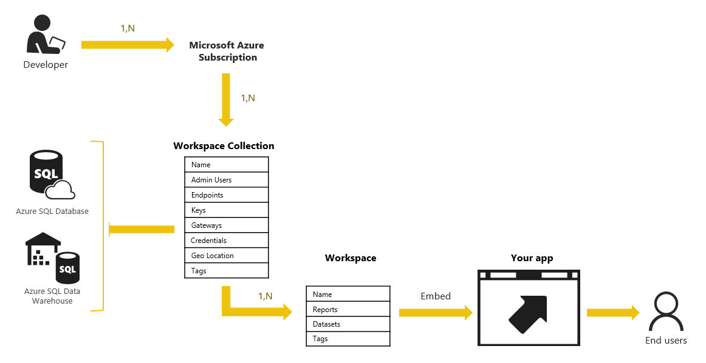
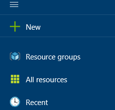
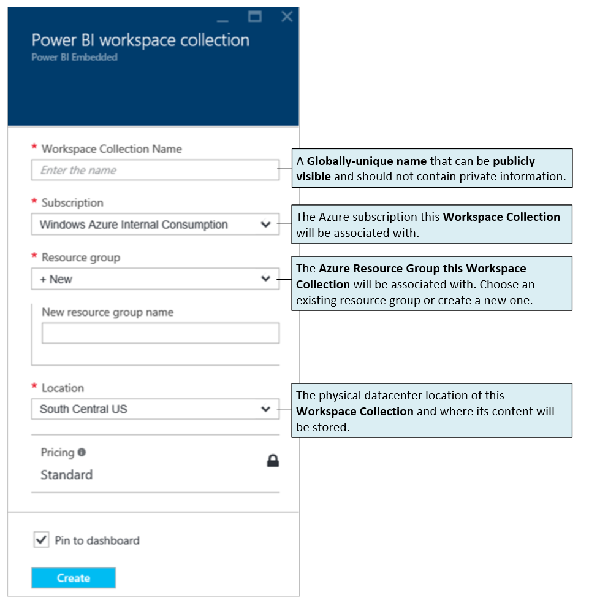
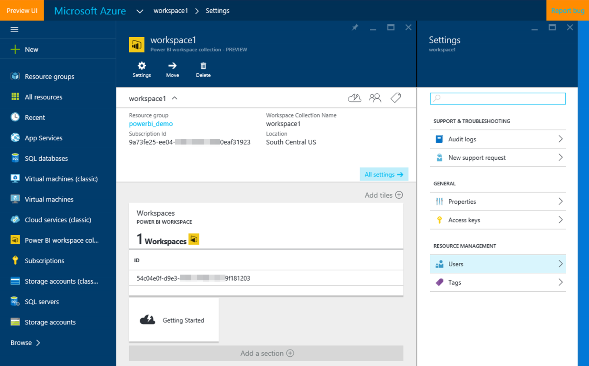
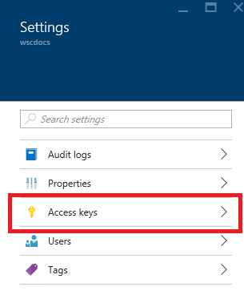

<properties
    pageTitle="Power BI Embedded 入门"
    description="Power BI Embedded，将交互式 Power BI 报表添加到商业智能应用程序"
    services="power-bi-embedded"
    documentationcenter=""
    author="guyinacube"
    manager="erikre"
    editor=""
    tags=""
    translationtype="Human Translation" />
<tags
    ms.assetid="4787cf44-5d1c-4bc3-b3fd-bf396e5c1176"
    ms.service="power-bi-embedded"
    ms.devlang="NA"
    ms.topic="hero-article"
    ms.tgt_pltfrm="NA"
    ms.workload="powerbi"
    ms.date="03/11/2017"
    wacn.date="04/24/2017"
    ms.author="asaxton"
    ms.sourcegitcommit="a114d832e9c5320e9a109c9020fcaa2f2fdd43a9"
    ms.openlocfilehash="395ad0ef70b954aed4cf8f864952acd2be2290e4"
    ms.lasthandoff="04/14/2017" />

# Power BI Embedded 入门

**Power BI Embedded** 是一项 Azure 服务，应用程序开发人员可通过它将交互式 Power BI 报表添加到自己的应用程序中。 **Power BI Embedded** 可以用于现有应用程序，不需要重新设计或更改用户的登录方式。

**Power BI Embedded** 的资源是通过 [Azure ARM API](https://msdn.microsoft.com/zh-cn/library/mt712306.aspx) 进行预配的。 在此示例中，预配的资源是一个 **Power BI 工作区集合**。

## 创建工作区集合

**工作区集合** 是顶层的 Azure 资源，是要嵌入到应用程序中的内容的容器。 可采用两种方式创建 **工作区集合** ：

- 使用 Azure 门户手动创建
- 使用 Azure资源管理器(ARM) API 以编程方式创建

接下来将完成使用 Azure 门户构建 **工作区集合** 的步骤。

1. 打开并登录到 **Azure 门户**： [http://portal.azure.cn](http://portal.azure.cn)。
2. 在顶部面板上单击“+ 新建”  。
   
	
3. 在“数据 + 分析”下单击“Power BI Embedded”。
4. 在“工作区集合”边栏选项卡上输入所需的信息。 有关 **定价**信息，请参阅 [Power BI Embedded 定价](/pricing/details/power-bi-embedded/)。
   
	
5. 单击“创建” 。

**工作区集合** 将花费一些时间进行预配。 完成后将转到“工作区集合”边栏选项卡 。

“ **创建** ”边栏选项卡包含调用创建工作区并向其部署内容的 API 所需的信息。

## <a name="view-access-keys"/>查看 Power BI API 访问密钥

调用 Power BI REST API 所需的最重要信息之一是 **访问密钥**。 这些访问密钥用于生成对 API 请求进行身份验证的 **应用程序令牌** 。 要查看**访问密钥**，请单击“设置”边栏选项卡上的“访问密钥”。 有关 **应用令牌**的详细信息，请参阅 [通过 Power BI Embedded 进行身份验证和授权](/documentation/articles/power-bi-embedded-app-token-flow/)。

   

你会发现会有两个密钥。

   

复制这两个密钥并将它们安全存储在你的应用程序中。 像对待密码一样对待这些密钥很重要，因为它们可以提供 **工作区集合**中所有内容的访问权限。

虽然列出了两个密钥，但是一次只需要一个密钥。 提供第二个密钥以便定期重新生成密钥，且无需中断对服务的访问。

现在，应用程序具有一个 Power BI 实例和 **访问密钥**，可以将报表导入自己的应用程序中。 在了解如何导入报表之前，下一节介绍了如何创建要嵌入到应用程序中的 Power BI 数据集和报表。

## 使用工作区

创建工作区集合后，需要创建一个用于容装报表和数据集的工作区。 若要创建工作区，需使用 [Post Worksapce REST API](https://msdn.microsoft.com/zh-cn/library/azure/mt711503.aspx)。

## 使用 Power BI Desktop 创建要嵌入到应用程序中的 Power BI 数据集和报表

至此，你已创建应用程序的 Power BI 实例，并具有了 **访问密钥**，接下来你需要创建要嵌入的 Power BI 数据集和报表。 可以使用 **Power BI Desktop**创建数据集和报表。 可以下载 [Power BI Desktop](https://go.microsoft.com/fwlink/?LinkId=521662)进行试用。 或者，若要快速开始使用，可以下载 [零售分析示例 PBIX](http://go.microsoft.com/fwlink/?LinkID=780547)。

> [AZURE.NOTE]
> 若要了解有关如何使用 **Power BI Desktop**的详细信息，请参阅 [Power BI Desktop 入门](https://powerbi.microsoft.com/guided-learning/powerbi-learning-0-2-get-started-power-bi-desktop)。

在 **Power BI Desktop** 中，可以通过将数据的副本导入 **Power BI Desktop** 来连接数据源，或者使用 **DirectQuery** 直接连接数据源。

以下是使用**导入**和 **DirectQuery** 之间的区别。

| 导入 | DirectQuery |
| --- | --- |
| 将表、列和数据  导入或复制到 **Power BI Desktop**。 当使用可视化效果时， **Power BI Desktop** 将查询数据的副本。 若要查看对基础数据所做的更改，必须刷新，或重新导入完整的当前数据集。 |仅将表和列  导入或复制到 **Power BI Desktop**。 当使用可视化效果时， **Power BI Desktop** 将查询基础数据源，这意味着始终可以查看当前数据。 |

有关连接到数据源的详细信息，请参阅 [连接到数据源](/documentation/articles/power-bi-embedded-connect-datasource/)。

在 **Power BI Desktop**中保存工作后，将创建一个 PBIX 文件。 此文件包含你的报表。 此外，如果导入数据，则 PBIX 包含完整数据集；而如果使用 **DirectQuery**，PBIX 只包含数据集架构。 使用 [Power BI 导入 API](https://msdn.microsoft.com/zh-cn/library/mt711504.aspx)以编程方式将 PBIX 部署到工作区。

> [AZURE.NOTE]
> **Power BI Embedded** 具有其他一些 API，用于更改数据集所指向的服务器和数据库，以及设置数据集将用于连接数据库的服务帐户凭据。 请参阅 [Post SetAllConnections（发布 SetAllConnections）](https://msdn.microsoft.com/zh-cn/library/mt711505.aspx)和 [Patch Gateway Datasource（修补网关数据源）](https://msdn.microsoft.com/zh-cn/library/mt711498.aspx)。

## 使用 API 创建 Power BI 数据集和报表

### 数据集

可以使用 REST API 在 Power BI Embedded 中创建数据集。 然后即可将数据推送到数据集中。 这样即可在不需要 Power BI Desktop 的情况下处理数据。 有关详细信息，请参阅 [Post Datasets](https://msdn.microsoft.com/zh-cn/library/azure/mt778875.aspx)（发布数据集）。

### 报告

可以通过 JavaScript API 直接在应用程序中基于数据集创建报表。 有关详细信息，请参阅[在 Power BI Embedded 中基于数据集创建新报表](/documentation/articles/power-bi-embedded-create-report-from-dataset/)。

## 另请参阅

- [示例入门](/documentation/articles/power-bi-embedded-get-started-sample/)  
- [在 Power BI Embedded 中进行身份验证和授权](/documentation/articles/power-bi-embedded-app-token-flow/)  
- [嵌入报表](/documentation/articles/power-bi-embedded-embed-report/)  
- [在 Power BI Embedded 中基于数据集创建新报表](/documentation/articles/power-bi-embedded-create-report-from-dataset/)
- [保存报表](/documentation/articles/power-bi-embedded-save-reports/)  
- [Power BI Desktop](https://powerbi.microsoft.com/documentation/powerbi-desktop-get-the-desktop/)  
- [JavaScript 嵌入示例](https://microsoft.github.io/PowerBI-JavaScript/demo/)  
- 有更多问题？ [试用 Power BI 社区](http://community.powerbi.com/)

<!--Update_Description: wording update-->