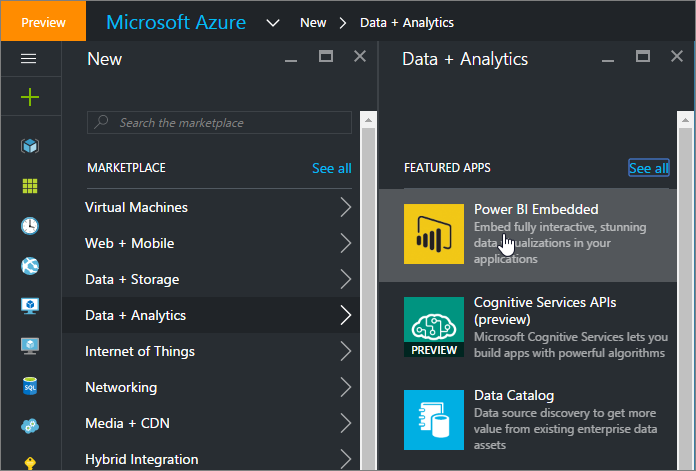
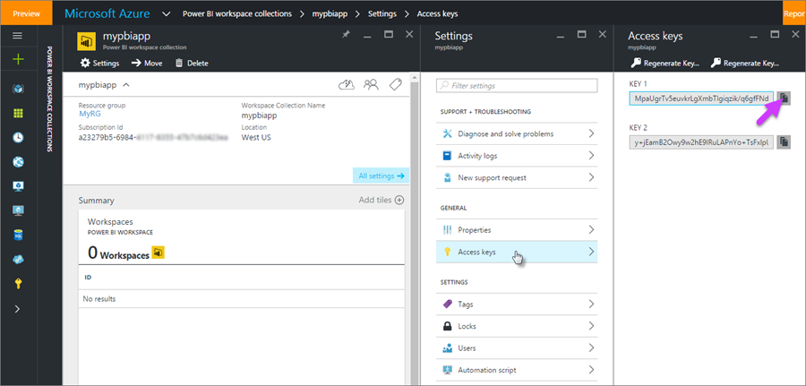
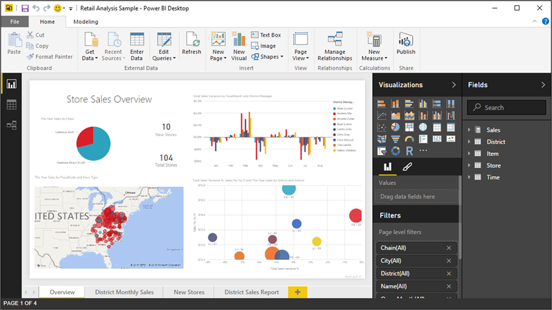
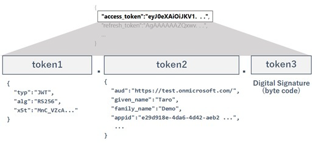
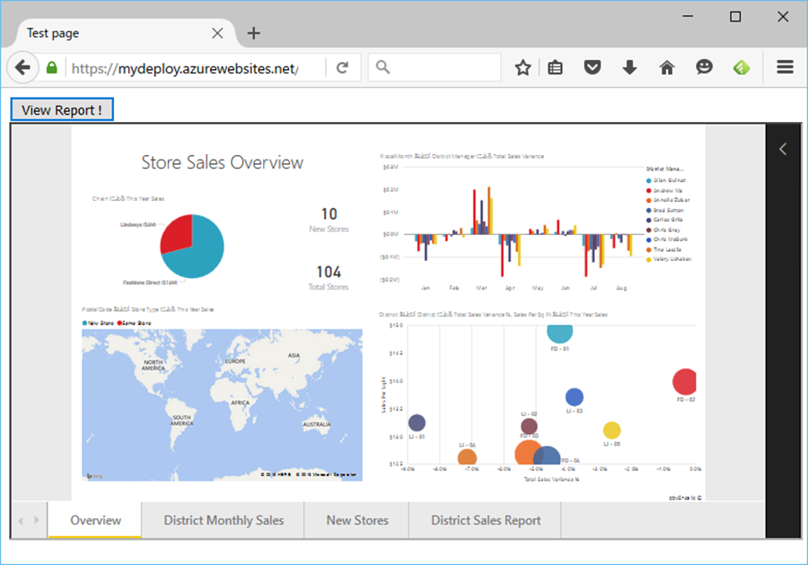

<properties
   pageTitle="如何将 Power BI Embedded 与 REST 配合使用 | Azure"
   description="了解如何将 Power BI Embedded 与 REST 配合使用 "
   services="power-bi-embedded"
   documentationCenter=""
   authors="mgblythe"
   manager="NA"
   editor=""
   tags=""/>
<tags
   ms.service="power-bi-embedded"
   ms.devlang="NA"
   ms.topic="article"
   ms.tgt_pltfrm="NA"
   ms.workload="powerbi"
   ms.date="08/02/2016"
   ms.author="mblythe"
   wacn.date="01/13/2017"/>  

# 如何将 Power BI Embedded 与 REST 配合使用

## Power BI Embedded：简介与用途
尽管官方 [Power BI Embedded 站点](/home/features/power-bi-embedded/)中已概述了 Power BI Embedded，但在详细了解如何将它与 REST 配合使用之前，先让我们对它有一个简单的了解。

它其实是个相当简单的程序。ISV 通常要在其自身的应用程序中使用 [Power BI](https://powerbi.microsoft.com) 的动态数据可视化作为 UI 构建块。

但我们知道，将 Power BI 报表或磁贴嵌入网页不再需要使用 Power BI Embedded Azure 服务，而可以使用 **Power BI API**。想要在同一家组织中共享报表时，可以配合 Azure AD 身份验证来嵌入报表。查看报表的用户必须使用其自己的 Azure AD 帐户登录。想要与所有用户（包括外部用户）共享报表时，只需使用匿名访问嵌入。

但可以发现，这种简单的嵌入解决方案并不完全符合 ISV 应用程序的需求。大多数的 ISV 应用程序需要为其自身的客户传递数据，而这些客户不一定是应用程序自身组织中的用户。例如，如果要同时为公司 A 和 公司 B 提供某些服务，公司 A 中的用户应该只看到他们公司本身的数据。也就是说，需要通过多租户进行传递。

ISV 应用程序也可以提供自身的身份验证方法，例如窗体身份验证、基本身份验证，等等。然后，嵌入解决方案必须与现有的身份验证方法安全协作。此外，用户必须可以使用那些 ISV 应用程序，而不需要另外购买 Power BI 订阅或其许可证。

 **Power BI Embedded** 正是针对此类 ISV 方案而设计。看完这些简介之后，让我们更详细地了解这个程序

可以配合 Power BI Embedded，使用 .NET (C#) 或 Node.js SDK 轻松构建应用程序。但是，本文将不使用 SDK 来解释 Power BI 的 HTTP 流（包括 AuthN）。了解此流后，可以**使用任何编程语言**构建应用程序，详细了解 Power BI Embedded 的本质。

## 创建 Power BI 工作区集合并获取访问密钥（预配）
Power BI Embedded 是一项 Azure 服务。只有使用 Azure 门户预览的 ISV 需要支付使用费（根据每小时用户会话计费），查看报表的用户不需要付费，甚至不需要 Azure 订阅。在开始开发应用程序之前，必须使用 Azure 门户预览创建 **Power BI 工作区集合**。

Power BI Embedded 的每个工作区是每位客户（租户）的工作区，可以在每个工作区集合中添加多个工作区。每个工作区集合使用相同的访问密钥。实际上，工作区集合是 Power BI Embedded 的安全边界。

  

创建完工作区集合之后，请从 Azure 门户预览复制访问密钥。

  

> [AZURE.NOTE] 也可以预配工作区集合，然后通过 REST API 获取访问密钥。有关详细信息，请参阅 [Power BI Resource Provider APIs](https://msdn.microsoft.com/zh-cn/library/azure/mt712306.aspx)（Power BI 资源提供程序 API）。

## 使用 Power BI Desktop 创建 .pbix 文件
接下来，必须创建数据连接以及要嵌入的报表。此任务不需要编程或编写代码，只需使用 Power BI Desktop。本文不会深入探讨如何使用 Power BI Desktop。如需帮助，请参阅 [Getting started with Power BI Desktop](https://powerbi.microsoft.com/documentation/powerbi-desktop-getting-started/)（Power BI Desktop 入门）。本示例只使用[零售分析示例](https://powerbi.microsoft.com/documentation/powerbi-sample-datasets/)。

  

## 创建 Power BI 工作区

现已完成所有预配，接下来可以通过 REST API 开始在工作区集合中创建客户工作区。以下 HTTP POST 请求 (REST) 将在现有的工作区集合中创建新工作区。在本示例中，工作区集合名称为 **mypbiapp**。只需将前面复制的访问密钥设置为 **AppKey**。这是非常简单的身份验证！

**HTTP 请求**

	POST https://api.powerbi.com/v1.0/collections/mypbiapp/workspaces
	Authorization: AppKey MpaUgrTv5e...

**HTTP 响应**

	HTTP/1.1 201 Created
	Content-Type: application/json; odata.metadata=minimal; odata.streaming=true
	Location: https://wabi-us-east2-redirect.analysis.chinacloudapi.cn/v1.0/collections/mypbiapp/workspaces
	RequestId: 4220d385-2fb3-406b-8901-4ebe11a5f6da

	{
	  "@odata.context": "http://wabi-us-east2-redirect.analysis.chinacloudapi.cn/v1.0/collections/mypbiapp/$metadata#workspaces/$entity",
	  "workspaceId": "32960a09-6366-4208-a8bb-9e0678cdbb9d",
	  "workspaceCollectionName": "mypbiapp"
	}

返回的 **workspaceId** 用于后续 API 调用。应用程序必须保留此值。

## 将 .pbix 文件导入工作区
每个工作区可以托管单个 Power BI Desktop 文件，其中包含数据集（包括数据源设置）和报表。可以将 .pbix 文件导入工作区，如以下代码所示。可以使用 http 中的 MIME multipart 上载 .pbix 文件的二进制数据。

URI 片段 **32960a09-6366-4208-a8bb-9e0678cdbb9d** 是 workspaceId，查询参数 **datasetDisplayName** 是要创建的数据集名称。创建的数据集保存 .pbix 文件中所有与数据相关的项目，例如导入的数据、指向数据源的指针，等等。

	POST https://api.powerbi.com/v1.0/collections/mypbiapp/workspaces/32960a09-6366-4208-a8bb-9e0678cdbb9d/imports?datasetDisplayName=mydataset01
	Authorization: AppKey MpaUgrTv5e...
	Content-Type: multipart/form-data; boundary="A300testx"

	--A300testx
	Content-Disposition: form-data

	{the content (binary) of .pbix file}
	--A300testx--

此导入任务可能会运行一段时间。完成后，应用程序可以使用导入 ID 来请求任务状态。在本示例中，导入 ID 为 **4eec64dd-533b-47c3-a72c-6508ad854659**。

	HTTP/1.1 202 Accepted
	Content-Type: application/json; charset=utf-8
	Location: https://wabi-us-east2-redirect.analysis.chinacloudapi.cn/v1.0/collections/mypbiapp/workspaces/32960a09-6366-4208-a8bb-9e0678cdbb9d/imports/4eec64dd-533b-47c3-a72c-6508ad854659?tenantId=myorg
	RequestId: 658bd6b4-b68d-4ec3-8818-2a94266dc220

	{"id":"4eec64dd-533b-47c3-a72c-6508ad854659"}

以下内容显示正在使用此导入 ID 请求状态：

	GET https://api.powerbi.com/v1.0/collections/mypbiapp/workspaces/32960a09-6366-4208-a8bb-9e0678cdbb9d/imports/4eec64dd-533b-47c3-a72c-6508ad854659
	Authorization: AppKey MpaUgrTv5e...

如果任务未完成，HTTP 响应可能类似于下面：

	HTTP/1.1 200 OK
	Content-Type: application/json; charset=utf-8
	RequestId: 614a13a5-4de7-43e8-83c9-9cd225535136

	{
	  "id": "4eec64dd-533b-47c3-a72c-6508ad854659",
	  "importState": "Publishing",
	  "createdDateTime": "2016-07-19T07:36:06.227",
	  "updatedDateTime": "2016-07-19T07:36:06.227",
	  "name": "mydataset01"
	}

如果任务已完成，HTTP 响应可能类似于下面：

	HTTP/1.1 200 OK
	Content-Type: application/json; charset=utf-8
	RequestId: eb2c5a85-4d7d-4cc2-b0aa-0bafee4b1606

	{
	  "id": "4eec64dd-533b-47c3-a72c-6508ad854659",
	  "importState": "Succeeded",
	  "createdDateTime": "2016-07-19T07:36:06.227",
	  "updatedDateTime": "2016-07-19T07:36:06.227",
	  "reports": [
	    {
	      "id": "2027efc6-a308-4632-a775-b9a9186f087c",
	      "name": "mydataset01",
	      "webUrl": "https://app.powerbi.com/reports/2027efc6-a308-4632-a775-b9a9186f087c",
	      "embedUrl": "https://app.powerbi.com/appTokenReportEmbed?reportId=2027efc6-a308-4632-a775-b9a9186f087c"
	    }
	  ],
	  "datasets": [
	    {
	      "id": "458e0451-7215-4029-80b3-9627bf3417b0",
	      "name": "mydataset01",
	      "tables": [
	      ],
	      "webUrl": "https://app.powerbi.com/datasets/458e0451-7215-4029-80b3-9627bf3417b0"
	    }
	  ],
	  "name": "mydataset01"
	}

## 数据源连接（及数据多租户）
尽管 .pbix 文件中几乎所有的项目都已导入工作区，但却不包含数据源的凭据。因此，使用 **DirectQuery 模式**时，嵌入的报表无法正常显示。但是，使用**导入模式**时，可以使用现有的导入数据查看报表。在这种情况下，必须使用以下步骤，通过 REST 调用来设置凭据。

首先必须获取网关数据源。我们知道数据集 **ID** 是前面返回的 ID。

**HTTP 请求**

	GET https://api.powerbi.com/v1.0/collections/mypbiapp/workspaces/32960a09-6366-4208-a8bb-9e0678cdbb9d/datasets/458e0451-7215-4029-80b3-9627bf3417b0/Default.GetBoundGatewayDatasources
	Authorization: AppKey MpaUgrTv5e...

**HTTP 响应**

	GET HTTP/1.1 200 OK
	Content-Type: application/json; odata.metadata=minimal; odata.streaming=true
	RequestId: 574b0b18-a6fa-46a6-826c-e65840cf6e15

	{
	  "@odata.context": "http://wabi-us-east2-redirect.analysis.chinacloudapi.cn/v1.0/collections/mypbiapp/workspaces/32960a09-6366-4208-a8bb-9e0678cdbb9d/$metadata#gatewayDatasources",
	  "value": [
	    {
	      "id": "5f7ee2e7-4851-44a1-8b75-3eb01309d0ea",
	      "gatewayId": "ca17e77f-1b51-429b-b059-6b3e3e9685d1",
	      "datasourceType": "Sql",
	      "connectionDetails": "{\"server\":\"testserver.database.chinacloudapi.cn\",\"database\":\"testdb01\"}"
	    }
	  ]
	}

使用返回的网关 ID 和数据源 ID（参阅前面的 **gatewayId** 和所返回结果的 **ID**）可以更改此数据源的凭据，如下所示：

**HTTP 请求**

	PATCH https://api.powerbi.com/v1.0/collections/mypbiapp/workspaces/32960a09-6366-4208-a8bb-9e0678cdbb9d/gateways/ca17e77f-1b51-429b-b059-6b3e3e9685d1/datasources/5f7ee2e7-4851-44a1-8b75-3eb01309d0ea
	Authorization: AppKey MpaUgrTv5e...
	Content-Type: application/json; charset=utf-8

	{
	  "credentialType": "Basic",
	  "basicCredentials": {
	    "username": "demouser",
	    "password": "P@ssw0rd"
	  }
	}

**HTTP 响应**

	HTTP/1.1 200 OK
	Content-Type: application/octet-stream
	RequestId: 0e533c13-266a-4a9d-8718-fdad90391099

在生产环境中，也可以使用 REST API 针对每个工作区设置不同的连接字符串。（也就是说，可以隔离每个客户的数据库。）

然后通过 REST 更改数据源的连接字符串。

	POST https://api.powerbi.com/v1.0/collections/mypbiapp/workspaces/32960a09-6366-4208-a8bb-9e0678cdbb9d/datasets/458e0451-7215-4029-80b3-9627bf3417b0/Default.SetAllConnections
	Authorization: AppKey MpaUgrTv5e...
	Content-Type: application/json; charset=utf-8

	{
	  "connectionString": "data source=testserver02.database.chinacloudapi.cn;initial catalog=testdb02;persist security info=True;encrypt=True;trustservercertificate=False"
	}

或者，可以使用 Power BI Embedded 中的行级别安全性，在一个报表中隔离每个用户的数据。这样，就可以使用相同的 .pbix（UI 等）和不同的数据源来预配每份客户报表。

> [AZURE.NOTE] 如果使用**导入模式**而不是 **DirectQuery 模式**，则无法通过 API 刷新模型。此外，Power BI Embedded 尚不支持通过 Power BI 网关访问本地数据源。建议随时关注 [Power BI 博客](https://powerbi.microsoft.com/blog/)，了解最新消息和将来版本中推出的新功能。

## 在网页中进行身份验证和托管（嵌入）报表

在前面的 REST API 中，可以使用访问密钥 **AppKey** 本身作为授权标头。由于此类调用可以在后端服务器端处理，因此非常安全。

但是，在网页中嵌入报表时，应使用 JavaScript（前端）处理此类安全信息。然后必须保护授权标头值。如果访问密钥被恶意用户或恶意代码发现，他们就可以使用此密钥调用任何操作。

在网页中嵌入报表时，必须改用经过计算的令牌，而不要使用访问密钥 **AppKey**。应用程序必须创建 OAuth Json Web 令牌 (JWT)，它由声明和经过计算的数字签名组成。此 OAuth JWT 是点分隔的编码字符串令牌，如下图所示。

  

首先，必须准备好输入值，稍后要为此值签名。此值是以下 json 的 base64 url 编码 (rfc4648) 字符串，以点 (.) 字符分隔。稍后将会说明如何获取报表 ID。

> [AZURE.NOTE] 如果想要使用 Power BI Embedded 的行级别安全性 (RLS)，则还必须在声明中指定 **username** 和 **roles**。

	{
	  "typ":"JWT",
	  "alg":"HS256"
	}

	{
	  "wid":"{workspace id}",
	  "rid":"{report id}",
	  "wcn":"{workspace collection name}",
	  "iss":"PowerBISDK",
	  "ver":"0.2.0",
	  "aud":"https://analysis.chinacloudapi.cn/powerbi/api",
	  "nbf":{start time of token expiration},
	  "exp":{end time of token expiration}
	}

接下来，必须使用 SHA256 算法创建 HMAC（签名）的 base64 编码字符串。这个经过签名的输入值是前面获取的字符串。

最后，必须使用句点 (.) 字符来合并输入值与签名字符串。完成的字符串是用于嵌入报表的应用令牌。即使该应用令牌被恶意用户发现，他们也无法获取原始访问密钥。此应用令牌很快就会过期。

下面是这些步骤的 PHP 示例：

	<?php
	// 1. power bi access key
	$accesskey = "MpaUgrTv5e...";

	// 2. construct input value
	$token1 = "{" .
	  "\"typ\":\"JWT\"," .
	  "\"alg\":\"HS256\"" .
	  "}";
	$token2 = "{" .
	  "\"wid\":\"32960a09-6366-4208-a8bb-9e0678cdbb9d\"," . // workspace id
	  "\"rid\":\"2027efc6-a308-4632-a775-b9a9186f087c\"," . // report id
	  "\"wcn\":\"mypbiapp\"," . // workspace collection name
	  "\"iss\":\"PowerBISDK\"," .
	  "\"ver\":\"0.2.0\"," .
	  "\"aud\":\"https://analysis.chinacloudapi.cn/powerbi/api\"," .
	  "\"nbf\":" . date("U") . "," .
	  "\"exp\":" . date("U" , strtotime("+1 hour")) .
	  "}";
	$inputval = rfc4648_base64_encode($token1) .
	  "." .
	  rfc4648_base64_encode($token2);

	// 3. get encoded signature
	$hash = hash_hmac("sha256",
		$inputval,
		$accesskey,
		true);
	$sig = rfc4648_base64_encode($hash);

	// 4. show result (which is the apptoken)
	$apptoken = $inputval . "." . $sig;
	echo($apptoken);

	// helper functions
	function rfc4648_base64_encode($arg) {
	  $res = $arg;
	  $res = base64_encode($res);
	  $res = str_replace("/", "_", $res);
	  $res = str_replace("+", "-", $res);
	  $res = rtrim($res, "=");
	  return $res;
	}
	?>

## 最后，将报表嵌入网页

若要嵌入报表，必须使用以下 REST API 获取嵌入 URL 和报表 **ID**。

**HTTP 请求**

	GET https://api.powerbi.com/v1.0/collections/mypbiapp/workspaces/32960a09-6366-4208-a8bb-9e0678cdbb9d/reports
	Authorization: AppKey MpaUgrTv5e...

**HTTP 响应**

	HTTP/1.1 200 OK
	Content-Type: application/json; odata.metadata=minimal; odata.streaming=true
	RequestId: d4099022-405b-49d3-b3b7-3c60cf675958

	{
	  "@odata.context": "http://wabi-us-east2-redirect.analysis.chinacloudapi.cn/v1.0/collections/mypbiapp/workspaces/32960a09-6366-4208-a8bb-9e0678cdbb9d/$metadata#reports",
	  "value": [
	    {
	      "id": "2027efc6-a308-4632-a775-b9a9186f087c",
	      "name": "mydataset01",
	      "webUrl": "https://app.powerbi.com/reports/2027efc6-a308-4632-a775-b9a9186f087c",
	      "embedUrl": "https://embedded.powerbi.com/appTokenReportEmbed?reportId=2027efc6-a308-4632-a775-b9a9186f087c",
	      "isFromPbix": false
	    }
	  ]
	}

可以使用前面的应用令牌在 Web 应用中嵌入报表。在下一个示例代码中，可以发现前半部与前面的示例相同。在后半部中，本示例在 iframe 中显示 **embedUrl**（请参阅前面的结果），将应用令牌发布到 iframe 中。

> [AZURE.NOTE] 需要将报表 ID 值更改为自己的值。此外，由于内容管理系统中的 bug，代码示例中的 iframe 标记以文本形式显示。如果复制并粘贴本示例代码，请删除标记中的大写文本。

	    <?php
	    // 1. power bi access key
	    $accesskey = "MpaUgrTv5e...";

	    // 2. construct input value
	    $token1 = "{" .
	      "\"typ\":\"JWT\"," .
	      "\"alg\":\"HS256\"" .
	      "}";
	    $token2 = "{" .
	      "\"wid\":\"32960a09-6366-4208-a8bb-9e0678cdbb9d\"," . // workspace id
	      "\"rid\":\"2027efc6-a308-4632-a775-b9a9186f087c\"," . // report id
	      "\"wcn\":\"mypbiapp\"," . // workspace collection name
	      "\"iss\":\"PowerBISDK\"," .
	      "\"ver\":\"0.2.0\"," .
	      "\"aud\":\"https://analysis.chinacloudapi.cn/powerbi/api\"," .
	      "\"nbf\":" . date("U") . "," .
	      "\"exp\":" . date("U" , strtotime("+1 hour")) .
	      "}";
	    $inputval = rfc4648_base64_encode($token1) .
	      "." .
	      rfc4648_base64_encode($token2);

	    // 3. get encoded signature value
	    $hash = hash_hmac("sha256",
	    	$inputval,
	    	$accesskey,
	    	true);
	    $sig = rfc4648_base64_encode($hash);

	    // 4. get apptoken
	    $apptoken = $inputval . "." . $sig;

	    // helper functions
	    function rfc4648_base64_encode($arg) {
	      $res = $arg;
	      $res = base64_encode($res);
	      $res = str_replace("/", "_", $res);
	      $res = str_replace("+", "-", $res);
	      $res = rtrim($res, "=");
	      return $res;
	    }
	    ?>
	    <!DOCTYPE html>
	    <html>
	    <head>
	      <meta charset="utf-8" />
	      <meta http-equiv="X-UA-Compatible" content="IE=edge">
	      <title>Test page</title>
	      <meta name="viewport" content="width=device-width, initial-scale=1">
	    </head>
	    <body>
	      <button id="btnView">View Report !</button>
	      

	        <**REMOVE THIS CAPPED TEXT IF COPIED** iframe id="ifrTile" width="100%" height="400"></iframe>
	      

	      
	    </body>

结果如下：

  

现在，Power BI Embedded 仅在 iframe 中显示报表。不过，还请持续关注 [Power BI 博客]()。将来的增强功能可能使用新的客户端 API，使我们能够将信息发送到 iframe，以及从中获取信息。那将是振奋人心的一刻！

## 另请参阅
- [Authenticating and authorizing in Power BI Embedded](/documentation/articles/power-bi-embedded-app-token-flow/)（在 Power BI Embedded 中进行身份验证和授权）

<!---HONumber=Mooncake_1010_2016-->
