<properties
   pageTitle="Power BI Embedded 的行级别安全性"
   description="有关 Power BI Embedded 的行级别安全性的详细信息"
   services="power-bi-embedded"
   documentationCenter=""
   authors="mgblythe"
   manager="NA"
   editor=""
   tags=""/>
<tags
   ms.service="power-bi-embedded"
   ms.devlang="NA"
   ms.topic="article"
   ms.tgt_pltfrm="NA"
   ms.workload="powerbi"
   ms.date="07/05/2016"
   ms.author="mblythe"
   wacn.date="12/29/2016"/>  

# Power BI Embedded 的行级别安全性

行级别安全性 (RLS) 可用于限制用户对报表或数据集内特定数据的访问，使多个不同的用户在查看不同数据的同时，能够使用相同的报表。Power BI Embedded 现在支持使用 RLS 配置的数据集。

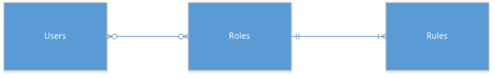  

若要利用 RLS，必须了解三个重要概念：用户、角色和规则。下面更详细地讲解每个概念：

**用户** – 查看报表的实际最终用户。在 Power BI Embedded 中，用户按应用令牌中的用户名属性标识。

**角色** – 用户属于角色。角色是规则的容器，可命名为类似于“销售经理”或“销售代表”的名称。在 Power BI Embedded 中，用户按应用令牌中的角色属性标识。

**规则** – 角色具有规则，这些规则是要应用到数据的实际筛选器。规则可以像“Country = USA”一样简单，也可以是更动态的对象。

### 示例

本文的余下部分将提供编写 RLS，然后在嵌入式应用程序中使用 RLS 的示例。该本例使用[零售分析示例](http://go.microsoft.com/fwlink/?LinkID=780547) PBIX 文件。

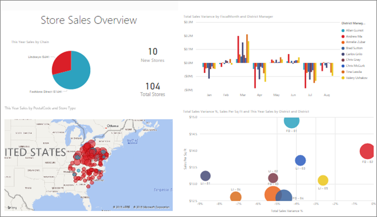  

零售分析示例显示特定零售链中所有商店的销售额。如果不使用 RLS，无论哪个区域的经理在登录后查看报表时，都会看到相同的数据。高级管理层决定只允许每个区域经理查看他们所管理的商店的销售额。为实现此目的，可以使用 RLS。

RLS 是在 Power BI Desktop 中编写的。打开数据集和报表时，可以切换到图示视图来查看架构：

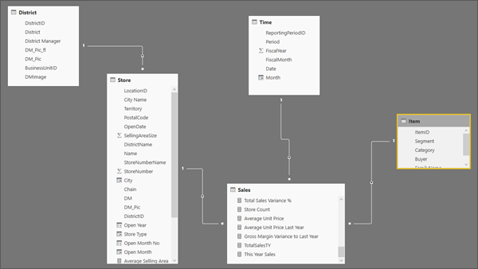  

下面是此架构的一些注意事项：

-	所有度量值，例如“总销售额”，存储在“销售”事实表中。
-	有四个附加的相关维度表：“项”、“时间”、“商店”和“区域”。
-	关系线的箭头表示筛选器可以从一个表流向另一个表的方向。例如，如果筛选器是针对当前架构中的 **Time[Date]** 设置的，则它只向下筛选“销售”表中的值。其他表不受此筛选器的影响，因为关系线的所有箭头都指向销售表，未指向其他方向。
-	“区域”表指明谁是每个区域的经理：

    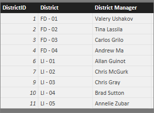  

根据此架构，如果将筛选器应用到“区域”表中的“区域经理”列，并且该筛选器与查看报表的用户匹配，则该筛选器也向下筛选“商店”和“销售”表，只显示该特定区域经理的数据。

方法如下：

1.	在“建模”选项卡中，单击“管理角色”。
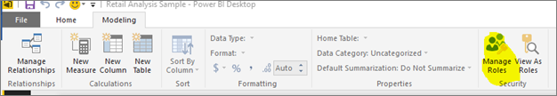

2.	创建名为“管理员”的新角色。
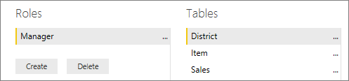

3.	在“区域”表中输入以下 DAX 表达式：**[District Manager] = USERNAME()**
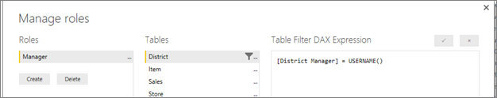

4.	为确保规则正常运行，请在“建模”选项卡中单击“以角色身份查看”，然后输入以下内容：
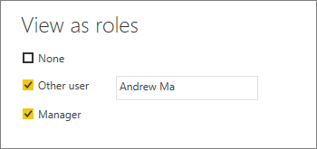

    报表随即会显示数据，与使用 **Andrew Ma** 登录时的情况一样。

如前所述应用筛选器可向下筛选“区域”、“商店”和“销售”表中的所有记录。但是，由于对“销售”与“时间”之间的关系应用了筛选方向，因此，“销售”和“项”，以及“项”和“时间”表不会向下筛选。

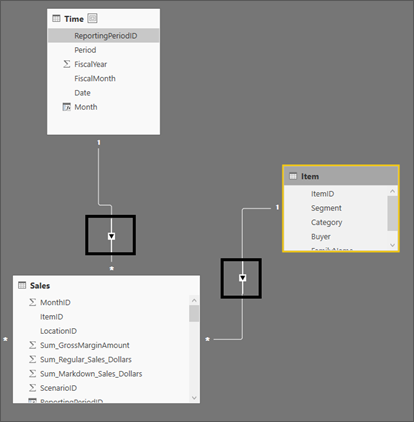  

这种模式也许能够满足某种要求，但如果不希望经理查看他们没有任何销售的项，则可以针对关系启用双向交叉筛选，使安全筛选器同时流向两个方向。为此，可以编辑“销售”与“项”之间的关系，如下所示：

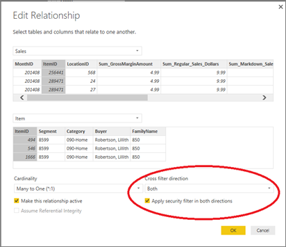  

现在，筛选器可以从“销售”表流向“项”表：

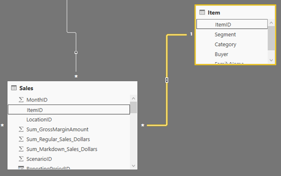  

**注意：**如果针对数据使用 DirectQuery 模式，必须选择以下两个选项来启用双向交叉筛选：

1.	“文件”->“选项和设置”->“预览功能”->“为 DirectQuery 启用两个方向的交叉筛选”。
2.	“文件”->“选项和设置”->“DirectQuery”->“允许 DirectQuery 模式下不受限制的度量”。

若要了解有关双向交叉筛选的详细信息，请下载 [Bidirectional cross-filtering in SQL Server Analysis Services 2016 and Power BI Desktop]（SQL Server Analysis Services 2016 和 Power BI Desktop 中的双向交叉筛选）白皮书 (http://download.microsoft.com/download/2/7/8/2782DF95-3E0D-40CD-BFC8-749A2882E109/Bidirectional cross-filtering in Analysis Services 2016 and Power BI.docx)。

这就是需要在 Power BI Desktop 中完成的所有工作，但要使定义的 RLS 规则能够在 Power BI Embedded 中正常运行，还有一个小问题需要解决。用户由应用程序进行身份验证和授权，应用令牌用于授予用户对特定 Power BI Embedded 报表的访问权限。Power BI Embedded 并不具体地知道谁是用户。要使 RLS 正常运行，需要将一些附加上下文作为应用令牌的一部分传递：
-	**username**（可选）- 与 RLS 一起使用，这是一个字符串，可以在应用 RLS 规则时帮助标识用户。请参阅“Using Row Level Security with Power BI Embedded”（在 Power BI Embedded 中使用行级别安全性）
-	**roles** – 一个字符串，包含当应用行级别安全性规则时可选择的角色。如果传递多个角色，则应当以字符串数组形式传递它们。

如果提供 username 属性，则也必须在角色中至少传递一个值。

完整的应用令牌如下所示：

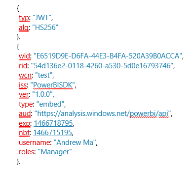  

现已组合所有信息片段，当某人登录应用程序查看此报表时，只能根据行级别安全性的定义，看到他们有权查看的数据。

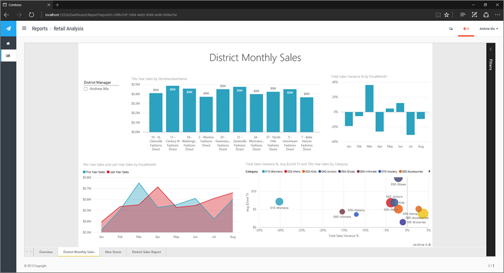  

## 另请参阅
[Row-level security (RLS) with Power](https://powerbi.microsoft.com/zh-CN/documentation/powerbi-admin-rls/)（Power 的行级别安全性 (RLS)）

<!---HONumber=Mooncake_1010_2016-->