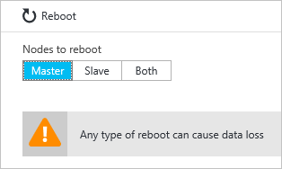
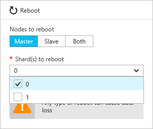
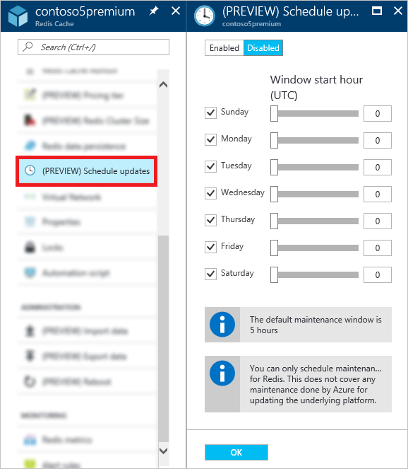

<properties 
	pageTitle="如何管理 Azure Redis 缓存 | Azure"
	description="了解如何执行管理任务，如重新启动 Azure Redis 缓存和为 Azure Redis 缓存计划更新"
	services="redis-cache"
	documentationCenter="na"
	authors="steved0x"
	manager="douge"
	editor="tysonn" />
<tags
	ms.service="cache"
	ms.date="07/13/2016"
	wacn.date="09/12/2016"/>

# 如何管理 Azure Redis 缓存

本主题介绍如何执行管理任务，如重新启动 Azure Redis 缓存实例和为 Azure Redis 缓存实例计划更新。

>[AZURE.IMPORTANT] 本文中所述的设置和功能仅适用于高级层缓存。

## 管理设置

用户可通过 Azure Redis 缓存“管理”设置对高级缓存执行以下管理任务。若要访问管理设置，请单击“Redis 缓存”边栏选项卡中的“设置”或“所有设置”，然后滚动到“设置”边栏选项卡中的“管理”部分。

  

-	[重新启动](#reboot)
-	[计划更新](#schedule-updates)

## 重新启动

你可以通过“重新启动”边栏选项卡重新启动缓存的一个或多个节点。这可以测试应用程序在故障时的还原能力。

  

如果高级缓存启用了群集功能，则可选择要重新启动的缓存分片。

若要重新启动缓存的一个或多个节点，请选择所需节点，然后单击“重新启动”。如果高级缓存启用了群集功能，请选择要重新启动的分片，然后单击“重新启动”。几分钟后，所选节点将重新启动，再过几分钟后，又会回到联机状态。

对客户端应用程序的影响因用户重新启动的节点而有所不同。

-	**主** - 重新启动主节点时，Azure Redis 缓存将故障转移到副本节点，并将其提升为主节点。在此故障转移期间，可能会有一个较短的时间间隔无法连接到缓存。
-	**从属** - 重新启动从属节点时，通常不会影响缓存客户端。
-	**主和从属** - 同时重新启动这两个缓存节点时，缓存中的所有数据将丢失，并且无法连接到缓存，直到主节点重新联机。如果已配置[数据持久性](/documentation/articles/cache-how-to-premium-persistence/)，则在缓存重新联机时，将还原最新备份。请注意，在最新备份后进行的所有缓存写入将丢失。
-	**已启用群集的高级缓存的节点** - 重新启动已启用群集的高级缓存的节点时，其行为与重新启动非群集缓存节点时相同。

>[AZURE.IMPORTANT] 重新启动仅适用于高级层缓存。

## 重新启动常见问题

-	[测试我的应用程序时，应重新启动哪个节点？](#which-node-should-i-reboot-to-test-my-application)
-	[能否通过重新启动缓存来清除客户端连接？](#can-i-reboot-the-cache-to-clear-client-connections)
-	[如果我执行重新启动，是否会丢失缓存中的数据？](#will-i-lose-data-from-my-cache-if-i-do-a-reboot)
-	[能否使用 PowerShell、CLI 或其他管理工具重新启动缓存？](#can-i-reboot-my-cache-using-powershell-cli-or-other-management-tools)
-	[哪些定价层可以使用重新启动功能？](#what-pricing-tiers-can-use-the-reboot-functionality)

### 测试我的应用程序时，应重新启动哪个节点？

若要针对缓存的主节点故障测试应用程序的复原能力，请重新启动**主**节点。若要针对辅助节点的故障测试应用程序的复原能力，请重新启动**从属**节点。若要针对缓存的总故障测试应用程序的复原能力，请同时重新启动这**两个**节点。

### 能否通过重新启动缓存来清除客户端连接？

能，如果重新启动缓存，将清除所有客户端连接。当所有客户端连接均已用完（例如，由于客户端应用程序中的逻辑错误或 bug）时，这很有用。每个定价层对于不同大小都有不同的[客户端连接数限制](/documentation/articles/cache-configure/#default-redis-server-configuration)，达到这些限制后，将不再接受客户端连接。通过重新启动缓存可以清除所有客户端连接。

>[AZURE.IMPORTANT] 如果由于客户端代码中的逻辑错误或 bug 客户端连接已用完，请注意在 Redis 节点重新联机后，StackExchange.Redis 自动将重新连接。如果未解决这一基本问题，客户端连接将继续用完。

### 如果我执行重新启动，是否会丢失缓存中的数据？

如果同时重新启动**主**节点和**从属**节点，则缓存中或该分片中（如果用户使用的是已启用群集的高级缓存）的所有数据都会丢失。如果已配置[数据持久性](/documentation/articles/cache-how-to-premium-persistence/)，则在缓存重新联机时，将还原最新备份。请注意，在进行该备份后进行的所有缓存写入将丢失。

如果只重新启动其中一个节点，数据通常不会丢失，但仍可能会丢失。例如，如果重新启动主节点时正在进行缓存写入，则缓存写入的数据将丢失。发生数据丢失的另一种情况是，当你重新启动一个节点时，另一个节点恰巧因故障而关闭。有关数据丢失的可能原因的详细信息，请参阅[我在 Redis 中的数据发生了什么情况？](https://gist.github.com/JonCole/b6354d92a2d51c141490f10142884ea4#file-whathappenedtomydatainredis-md)。

### 能否使用 PowerShell、CLI 或其他管理工具重新启动缓存？

能，有关 PowerShell 说明，请参阅[重新启动 Redis 缓存](/documentation/articles/cache-howto-manage-redis-cache-powershell/#to-reboot-a-redis-cache)。

### 哪些定价层可以使用重新启动功能？

重新启动仅在高级定价层中可用。

## 计划更新

使用“计划更新”边栏选项卡可以为缓存指定维护时段。指定维护时段后，将在此时段内进行任何 Redis 服务器更新。请注意，维护时段仅适用于 Redis 服务器更新，不适用于任何 Azure 更新或托管缓存的 VM 的操作系统更新。

  

若要指定维护时段，请勾选合适的日期，然后指定每天的维护时段开始时间，最后再单击“确定”。请注意，维护时段使用 UTC 时间。

## 计划更新常见问题

-	[如果我不使用计划更新功能，何时进行更新？](#when-do-updates-occur-if-i-dont-use-the-schedule-updates-feature)
-	[在计划的维护时段进行哪种类型的更新？](#what-type-of-updates-are-made-during-the-scheduled-maintenance-window)
-	[哪些定价层可以使用计划更新功能？](#what-pricing-tiers-can-use-the-schedule-updates-functionality)

### 如果我不使用计划更新功能，何时进行更新？

如果未指定维护时段，可以随时进行更新。

### 在计划的维护时段进行哪种类型的更新？

仅在计划的维护时段进行 Redis 服务器更新。维护时段不适用于 Azure 更新或 VM 操作系统更新。

### 哪些定价层可以使用计划更新功能？

计划更新仅在高级定价层中可用。

## 后续步骤

-	了解更多 [Azure Redis 缓存高级层](/documentation/articles/cache-premium-tier-intro/)功能。

<!---HONumber=Mooncake_0905_2016-->