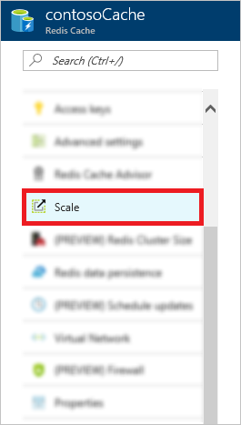

<properties
    pageTitle="如何缩放 Azure Redis 缓存 | Azure"
    description="了解如何缩放你的 Azure Redis 缓存实例"
    services="redis-cache"
    documentationcenter=""
    author="steved0x"
    manager="douge"
    editor=""
    translationtype="Human Translation" />
<tags
    ms.assetid="350db214-3b7c-4877-bd43-fef6df2db96c"
    ms.service="cache"
    ms.workload="tbd"
    ms.tgt_pltfrm="cache-redis"
    ms.devlang="na"
    ms.topic="article"
    ms.date="04/11/2017"
    wacn.date="05/02/2017"
    ms.author="sdanie"
    ms.sourcegitcommit="78da854d58905bc82228bcbff1de0fcfbc12d5ac"
    ms.openlocfilehash="e40debc19d6f478e4f380a4820116fd189a7fa8d"
    ms.lasthandoff="04/22/2017" />

# 如何缩放 Azure Redis 缓存
Azure Redis 缓存具有不同的缓存产品/服务，使缓存大小和功能的选择更加灵活。 创建缓存后，如果应用程序的要求发生更改，可以缩放缓存的大小和定价层。 本文介绍如何通过 Azure 门户和各种工具（例如 Azure PowerShell 和 Azure CLI）缩放缓存。

## 何时缩放
可以使用 Azure Redis 缓存的[监视](/documentation/articles/cache-how-to-monitor/)功能来监视缓存的运行状况和性能，并确定何时缩放缓存。 

你可以监视以下指标以帮助确定是否需要进行缩放。

* Redis 服务器负载
* 内存用量
* 网络带宽
* CPU 使用率

如果确定缓存不再满足应用程序的要求，可以缩放到适合应用程序的更大或更小缓存定价层。 有关确定应使用哪个缓存定价层的详细信息，请参阅[我应当使用哪些 Redis 缓存产品/服务和大小](/documentation/articles/cache-faq/#what-redis-cache-offering-and-size-should-i-use)。

## 缩放缓存
若要缩放缓存，请在 [Azure 门户](https://portal.azure.cn)中[浏览到缓存](/documentation/articles/cache-configure/#configure-redis-cache-settings)，然后在“资源”菜单中单击“缩放”。

从“选择定价层”边栏选项卡选择所需的定价层，然后单击“选择”。

![定价层][redis-cache-pricing-tier-blade]

你可以缩放到其他定价层，但有以下限制：

* 不能从较高的定价层缩放到较低的定价层。
  * 不能从**高级**缓存向下缩放到**标准**或**基本**缓存。
  * 不能从**标准**缓存向下缩放到**基本**缓存。
* 可从**基本**缓存缩放到**标准**缓存，但不能同时更改大小。 如果你需要不同大小，则可以执行后续缩放操作以缩放为所需大小。
* 不能从**基本**缓存直接缩放到**高级**缓存。 必须在一个缩放操作中从**基本**缩放到**标准**，然后在后续的缩放操作中从**标准**缩放到**高级**。
* 不能从较大的大小减小为 **C0 (250 MB)**。

当缓存缩放到新的定价层，将在“Redis 缓存”边栏选项卡中显示**缩放**状态。

![扩展][redis-cache-scaling]

缩放完成后，状态将从**正在缩放**更改为**正在运行**。

##  如何自动执行缩放操作
除了在 Azure 门户中缩放缓存实例以外，还可以使用 PowerShell cmdlet、Azure CLI 和 Azure 管理库 (MAML) 进行缩放。 

* [使用 PowerShell 进行缩放](#scale-using-powershell)
* [使用 Azure CLI 进行缩放](#scale-using-azure-cli)
* [使用 MAML 进行缩放](#scale-using-maml)

###  使用 PowerShell 进行缩放
修改 `Size`、`Sku` 或 `ShardCount` 属性后，可以在 PowerShell 中使用 [Set-AzureRmRedisCache](https://msdn.microsoft.com/zh-cn/library/azure/mt634518.aspx) cmdlet 缩放 Azure Redis 缓存实例。 以下示例演示了如何将名为 `myCache` 的缓存缩放为 2.5 GB 缓存。 

    Set-AzureRmRedisCache -ResourceGroupName myGroup -Name myCache -Size 2.5GB

有关使用 PowerShell 进行缩放的详细信息，请参阅[使用 PowerShell 缩放 Redis 缓存](/documentation/articles/cache-howto-manage-redis-cache-powershell/#scale)。

###  使用 Azure CLI 进行缩放
若要使用 Azure CLI 缩放 Azure Redis 缓存实例，请调用 `azure rediscache set` 命令并传入所需的配置更改，包括新大小、sku 或群集大小，具体取决于所需的缩放操作。

有关使用 Azure CLI 进行缩放的详细信息，请参阅[更改现有 Redis 缓存的设置](/documentation/articles/cache-manage-cli/#scale)。

###  使用 MAML 进行缩放
若要使用 [Azure 管理库 (MAML)](http://azure.microsoft.com/updates/management-libraries-for-net-release-announcement/) 缩放 Azure Redis 缓存实例，请调用 `IRedisOperations.CreateOrUpdate` 方法并传入 `RedisProperties.SKU.Capacity` 的新大小。

    static void Main(string[] args)
    {
        // For instructions on getting the access token, see
        // https://www.azure.cn/documentation/articles/cache-configure/#access-keys
        string token = GetAuthorizationHeader();

        TokenCloudCredentials creds = new TokenCloudCredentials(subscriptionId,token);

        RedisManagementClient client = new RedisManagementClient(creds);
        var redisProperties = new RedisProperties();

        // To scale, set a new size for the redisSKUCapacity parameter.
        redisProperties.Sku = new Sku(redisSKUName,redisSKUFamily,redisSKUCapacity);
        redisProperties.RedisVersion = redisVersion;
        var redisParams = new RedisCreateOrUpdateParameters(redisProperties, redisCacheRegion);
        client.Redis.CreateOrUpdate(resourceGroupName,cacheName, redisParams);
    }

有关详细信息，请参阅 [使用 MAML 管理 Redis 缓存](https://github.com/rustd/RedisSamples/tree/master/ManageCacheUsingMAML) 示例。

## 关于缩放的常见问题
以下列表包含有关 Azure Redis 缓存缩放的常见问题的解答。

* [可以向上缩放到高级缓存，或在其中向下缩放吗？](#can-i-scale-to-from-or-within-a-premium-cache)
* [缩放后，我是否需要更改缓存名称或访问密钥？](#after-scaling-do-i-have-to-change-my-cache-name-or-access-keys)
* [缩放的工作原理？](#how-does-scaling-work)
* [在缩放过程中是否会丢失缓存中的数据？](#will-i-lose-data-from-my-cache-during-scaling)
* [在缩放过程中，自定义数据库设置是否会受影响？](#is-my-custom-databases-setting-affected-during-scaling)
* [在缩放过程中，缓存是否可用？](#will-my-cache-be-available-during-scaling)
* [不支持的操作](#operations-that-are-not-supported)
* [缩放需要多长时间？](#how-long-does-scaling-take)
* [如何判断缩放何时完成？](#how-can-i-tell-when-scaling-is-complete)

### 可以向上缩放到高级缓存，或在其中向下缩放吗？
* 不能从**高级**缓存向下缩放到**基本**或**标准**定价层。
* 可以从一个**高级**缓存定价层缩放到另一个高级缓存定价层。
* 不能从**基本**缓存直接缩放到**高级**缓存。 必须先在一个缩放操作中从**基本**缩放到**标准**，然后再在后续的缩放操作中从**标准**缩放到**高级**。
* 如果在创建**高级**缓存时启用了群集，则可以[更改群集大小](/documentation/articles/cache-how-to-premium-clustering/#cluster-size)。 如果在创建缓存时未启用群集功能，则不能在以后配置该功能。

    有关详细信息，请参阅 [如何为高级 Azure Redis 缓存配置群集功能](/documentation/articles/cache-how-to-premium-clustering/)。

###  缩放后，我是否需要更改缓存名称或访问密钥？
不需要，在缩放操作期间缓存名称和密钥不变。

###  缩放的工作原理
* 将 **基本** 缓存缩放为不同大小时，将关闭该缓存，同时使用新的大小预配一个新缓存。 在此期间，缓存不可用，且缓存中的所有数据都将丢失。
* 将**基本**缓存缩放为**标准**缓存时，将预配副本缓存并将主缓存中的数据复制到副本缓存。 在缩放过程中，缓存仍然可用。
* 将**标准**缓存缩放为不同大小或缩放到**高级**缓存时，将关闭其中一个副本，同时将其重新预配为新的大小，将数据转移，然后，在重新预配另一个副本之前，另一个副本将执行一次故障转移，类似于一个缓存节点发生故障时所发生的过程。

###  在缩放过程中是否会丢失缓存中的数据？
* 将 **基本** 缓存缩放为新的大小时，所有数据都将丢失，且在缩放操作期间缓存将不可用。
* 将**基本**缓存缩放为**标准**缓存时，通常将保留缓存中的数据。
* 将**标准**缓存扩展为更大大小或更大层，或者将**高级**缓存扩展为更大大小时，通常将保留所有数据。 将**标准**或**高级**缓存缩小到更小大小时，数据可能会丢失，具体取决于与缩放后的新大小相关的缓存中的数据量。 如果缩小时数据丢失，则使用 [allkeys lru](http://redis.io/topics/lru-cache) 逐出策略逐出密钥。 

###  在缩放过程中，自定义数据库设置是否会受影响？
某些定价层具有不同的[数据库限制](/documentation/articles/cache-configure/#databases)，因此，如果在缓存创建过程中为 `databases` 设置配置了自定义值，则在向下缩放时需注意一些注意事项。

* 缩放到的定价层的 `databases` 限制低于当前层：
    * 如果你使用的是默认 `databases` 数（对于所有定价层来说为 16），则不会丢失数据。
    * 如果你使用的是在你要缩放到的层的限制内的自定义 `databases` 数，则将保留此 `databases` 设置并且不会丢失数据。
    * 如果你使用的是超出新层限制的自定义 `databases` 数，则 `databases` 设置将降低到新层的限制，并且已删除数据库中的所有数据都将丢失。
* 所缩小到的定价层的 `databases` 限制等于或高于当前层时，将保留 `databases` 设置并且不会丢失数据。

注意，当标准和高级缓存有 99.9% 可用性 SLA 时，则没有数据丢失方面的 SLA。

###  在缩放过程中，缓存是否可用？
* **标准**和**高级**缓存在缩放操作期间保持可用。
* **基本**缓存在执行缩放为不同大小的缩放操作过程中处于脱机状态，但在从**基本**缓存缩放为**标准**缓存时仍然可用。

###  不支持的操作
* 不能从较高的定价层缩放到较低的定价层。
    * 不能从**高级**缓存向下缩放到**标准**或**基本**缓存。
    * 不能从**标准**缓存向下缩放到**基本**缓存。
* 可从**基本**缓存缩放到**标准**缓存，但不能同时更改大小。 如果你需要不同大小，则可以执行后续缩放操作以缩放为所需大小。
* 不能从**基本**缓存直接缩放到**高级**缓存。 必须先在一个缩放操作中从**基本**缩放到**标准**，然后再在后续的缩放操作中从**标准**缩放到**高级**。
* 不能从较大的大小减小为 **C0 (250 MB)**。

如果缩放操作失败，该服务将尝试还原操作并且缓存将还原为初始大小。

###  缩放需要多长时间？
缩放大约需要 20 分钟，具体取决于缓存中的数据量。

###  如何判断缩放何时完成？
在 Azure 门户中可以看到进行中的缩放操作。 缩放完成后，缓存状态将更改为 **正在运行**。

<!-- IMAGES -->

[redis-cache-pricing-tier-blade]: ./media/cache-how-to-scale/redis-cache-pricing-tier-blade.png

[redis-cache-scaling]: ./media/cache-how-to-scale/redis-cache-scaling.png
<!--Update_Description: wording update-->