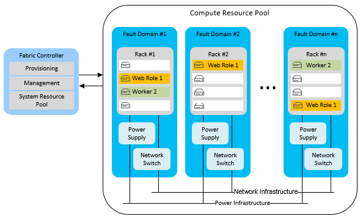
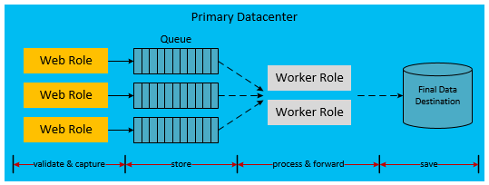

<properties
    pageTitle="Azure 应用程序的高可用性 | Azure"
    description="有关在 Azure 上设计和构建应用程序以实现高可用性的技术概述与深入信息。"
    services=""
    documentationcenter="na"
    author="adamglick"
    manager="saladki"
    editor="" />
<tags
    ms.assetid="8be4f323-ca00-4025-9356-c9bbc998eef3"
    ms.service="resiliency"
    ms.devlang="na"
    ms.topic="article"
    ms.tgt_pltfrm="na"
    ms.workload="na"
    ms.date="08/18/2016"
    wacn.date="02/20/2017"
    ms.author="aglick"/>  

# 构建在 Azure 基础之上的应用程序高可用性

高度可用的应用程序可消减依赖的服务和硬件在可用性、负载和临时故障方面的波动。应用程序以可接受的用户和系统响应级别继续运行，如业务要求或应用程序服务级别协议 (SLA) 所定义。

## Azure 高可用性功能

Azure 在平台中内置了多种功能，用于支持高度可用的应用程序。本部分介绍其中一些重要功能。<!-- 有关该平台的更全面分析，请参阅 [Azure resiliency technical guidance（Azure 业务连续性技术指南）](/documentation/articles/resiliency-technical-guidance/)。-->

### 结构控制器

Azure 结构控制器负责预配和监视 Azure 计算实例的状况。结构控制器检查主机和来宾计算机实例的硬件和软件的状态。检测到故障后，它通过自动重新定位 VM 实例来履行 SLA。容错域和升级域的概念进一步为计算 SLA 提供支持。

部署多个云服务角色实例时，Azure 将这些实例部署到不同的容错域。容错域边界基本上就是同一区域内的其他硬件机架。容错域可降低局部硬件故障将中断应用程序服务的可能性。你无法管理分配给辅助角色或 Web 角色的容错域的数量。结构控制器采用与 Azure 托管的应用程序分离的专用资源。由于它充当 Azure 系统的核心，因此其正常运行时间为 100%。它监视和管理各个容错域中的角色实例。

以下示意图显示了结构控制器在各个容错域中部署和管理的 Azure 共享资源。

升级域在功能上与容错域类似，但支持升级而非故障。升级域是实例分离的逻辑单元，它决定将在某个时间点升级特定服务中的哪些实例。默认情况下会为托管服务部署定义五个升级域。不过，你可以在服务定义文件中更改该值。例如，假设你有八个 Web 角色实例。三个升级域中各有两个实例，一个升级域中有两个实例。Azure 定义了更新顺序，但它以升级域的数量为基础。有关升级域的详细信息，请参阅[更新云服务](/documentation/articles/cloud-services-update-azure-service/)。

### 其他服务中的功能

除了这些支持高计算可用性的平台功能之外，Azure 还将高可用性功能嵌入到它的其他服务中。例如，Azure 存储空间保存所有 Blob、表和队列数据的 3 个副本。它还允许使用异地复制选项，将 Blob 和表的备份存储在次要区域内。通过 Azure 内容交付网络，可在世界各地缓存 Blob 以实现冗余和可缩放性。Azure SQL 数据库也保留多个副本。

除 [Resiliency technical guidance](https://aka.ms/bctechguide)（Azure 业务连续性技术指南）系列教程以外，另请参阅 [Best Practices for the Design of Large-Scale Services on Azure Cloud Services](https://azure.microsoft.com/blog/best-practices-for-designing-large-scale-services-on-windows-azure/)（在 Azure 云服务上设计大规模服务的最佳实践）一文。这些文章更深入介绍了 Azure 平台可用性功能。

尽管 Azure 提供多项支持高可用性的功能，但了解其限制也很重要：

* 对于计算，Azure 保证你的角色可用并处于运行状态，但它不了解你的应用程序是否运行或过载。
* 对于 Azure SQL 数据库，在区域内同步复制数据。你可以选择活动异地复制，以便在同一个区域（或不同的区域中）最多创建四个附加的数据库副本。这些数据库副本不是时间点备份。SQL 数据库确实提供时间点备份功能。若要详细了解 SQL 数据库时间点功能，请阅读 [Azure SQL Database Point in Time Restore](https://azure.microsoft.com/blog/azure-sql-database-point-in-time-restore/)（Azure SQL 数据库时间点还原）。
* 对于 Azure 存储空间，默认情况下会将表和 Blob 数据复制到备用区域。但是，直到 Microsoft 选择将故障转移到备用站点，你才能访问这些副本。通常仅在发生区域范围的长时间服务中断时才执行区域故障转移，并且异地故障转移时间没有 SLA。另外，必须注意，任何数据损坏将迅速扩散到副本。

出于这些原因，必须使用应用程序特定的可用性功能对平台可用性功能加以补充。应用程序特定的可用性功能包括用于创建 Blob 数据时间点备份的 Blob 快照功能。

### Azure 虚拟机的可用性集

本文的大部分内容重点介绍云服务，其中使用平台即服务 (PaaS) 模型。但是，Azure 虚拟机也有一些特定的可用性功能，它们使用基础结构即服务 (IaaS) 模型。若要使虚拟机实现高可用性，必须使用可用性集。可用性集的功能与容错域和升级域类似。在可用性集中，Azure 会以某种方式定位虚拟机，避免局部硬件故障和维护活动导致该组的所有虚拟机停机。可用性集必须达到针对虚拟机可用性的 Azure SLA。

下图显示了两个可用性集，其中分别组合了 Web 和 SQL Server 虚拟机。

> [AZURE.NOTE]
> 在上图中，SQL Server 安装并运行在虚拟机上。这与以前讨论的 Azure SQL 数据库不同，后者提供数据库作为托管服务。
> 
> 

## 高可用性的应用程序策略

高可用性的大多数应用程序策略均涉及冗余或消除应用程序组件之间的硬性依赖。应用程序设计应在 Azure 或第三方服务偶发的停机时间内支持容错。以下部分介绍几种用于提高云服务可用性的应用程序模式。

### 异步通信和持久队列

考虑在松散耦合的服务之间进行异步通信以提高 Azure 应用程序的可用性。在此模式下，会将消息写入存储队列或 Azure 服务总线队列供以后处理。将消息写入队列后，立即将控制权归还给消息的发送者。消息由通常作为辅助角色实现的另一层应用程序负责处理。如果辅助角色发生故障，则消息累积在队列中，直到处理服务恢复。只要队列可用，前端发送者与消息处理程序之间即不存在直接的依赖关系。这样就不必进行同步服务调用，此类调用可能在分布式应用程序中形成吞吐量瓶颈。

上述情况的一种变化形式使用 Azure 存储空间（Blob、表，队列）或服务总线队列作为调用数据库失败后的故障转移位置。例如，在应用程序中同步调用另一个服务（如 Azure SQL 数据库）反复失败。你可以将这些数据序列化为持久存储。以后在服务或数据库恢复联机时，应用程序可重新提交来自存储的请求。此模型中的区别在于中间位置不是应用程序工作流的固定部分。此模型仅用于故障情况下。

在两种方案中，异步通信和中间存储均可防止后端服务中断导致整个应用程序停止运行。队列充当逻辑中介。有关选择正确队列服务的更多指导，请参阅 [Azure 队列和 Azure 服务总线队列 - 比较与对照](/documentation/articles/service-bus-azure-and-service-bus-queues-compared-contrasted/)。

### 故障检测和重试逻辑

高度可用的应用程序设计的一个关键点，是利用代码中的重试逻辑正常处理临时中断的服务。Microsoft 模式和实践团队开发的[暂时性故障处理应用程序块](https://msdn.microsoft.com/zh-cn/library/hh680934.aspx)可协助应用程序开发人员完成此过程。“暂时性”一词表示仅持续相对较短时间的临时条件。在本文的上下文中，处理暂时性故障是开发高度可用的应用程序的一部分。暂时性情况的示例包括间歇性网络错误和丢失数据库连接。

暂时性故障处理应用程序块是一种正常处理代码中故障的简化方式。此方式可通过添加可靠的暂时性故障处理逻辑，提高应用程序的可用性。大多数情况下，将由重试逻辑处理短暂中断，并在一次或多次尝试失败后重新连接发送者和接收者。应用程序用户通常注意不到成功的重试尝试。

开发人员有三个选项可用于管理其重试逻辑：增量、固定间隔和指数。增量是指在每次重试前等待更长时间，等待时间以线性方式增长（例如 1、2、3 和 4 秒）。固定间隔是指在每次重试之间等待相同长度的时间（例如 2 秒）。作为一个更随机的选项，指数补偿是指在重试之间等待更长时间。但是，等待时间呈指数级增长（例如 2、4、8 和 16 秒）。

代码中的策略大致包括：

1. 定义重试策略。
2. 尝试可能导致暂时性故障的操作。
3. 如果发生暂时性故障，则调用重试策略。
4. 如果所有重试均失败，则捕获一个最终异常。

将在模拟故障中测试重试逻辑，以确保连续的重试操作不会导致难以预料的长时间延迟。请在决定放弃整个任务之前进行此测试。

### 高可用性的引用数据模式

引用数据是应用程序的只读数据。此数据提供一个业务上下文，应用程序将于业务运行期间在其中生成事务数据。事务数据是引用数据的时间点函数。因此，其完整性取决于引用数据在事务期间的快照。这个定义不太准确，但应该可以满足我们在此的用途。

应用程序上下文中必须有引用数据，否则应用程序将无法运行。相关应用程序创建和维护引用数据；主控数据管理 (MDM) 系统通常负责执行此功能。这些系统对引用数据的整个生命周期负责。引用数据的示例包括产品目录、雇员主控数据、部件主控数据和设备主控数据。引用数据也可来自组织以外，如邮政编码或税率。提高引用数据可用性的策略之外通常要比提高事务数据可用性的策略简单。引用数据具有最为持久的优点。

通过将引用数据连同应用程序一起部署，使用引用数据的 Azure Web 角色和辅助角色可在运行时变为自治。如果本地存储的大小允许此类部署，则这是理想状态。部署到本地文件系统的嵌入式数据库（SQL、NoSQL）或 XML 文件有助于实现 Azure 计算缩放单位的自治。但是，应该制定一种机制，以便无需重新部署即可更新每个角色中的数据。为此，请将对引用数据的任何更新放置到云存储终结点（例如，Azure Blob 存储或 SQL 数据库）。向每个角色添加在角色启动时将数据更新下载到计算节点中的代码。或者添加使管理员可在角色实例中执行强制下载的代码。

若要提高可用性，角色还应包含一组引用数据以防存储失灵。这样使角色可先使用一组基本的引用数据，直到有存储资源可供更新使用。

此模式的一个注意事项是角色的部署和启动速度。如果在启动时部署或下载大量引用数据，则这样会增加使新部署或角色实例运转所需的时间。要在每个角色上立即有引用数据可用而不依赖于外部存储服务，这可能是一个可接受的折衷。

### 高可用性的事务数据模式

事务数据是应用程序在某种业务上下文中生成的数据。事务数据由应用程序实现的一组业务流程与支持这些流程的引用数据组合而成。事务数据的示例包括订单、预先发货通知、发票和客户关系管理 (CRM) 机会。这样生成的事务数据将送入外部系统，用于保存记录或进一步处理。

请牢记，引用数据在负责这些数据的系统中可发生更改。出于此原因，事务数据必须保存时间点引用数据上下文，以使其对外部的依赖程度降至最低，保持其语义一致性。例如，设想在履行订单几个月后从目录中删除某件产品。最佳实践是将尽可能多的引用数据上下文嵌入到事务中。这样可保留与事务相关的语义，即使要在捕获事务之后更改引用数据也是如此。

如前所述，使用松散耦合和异步通信的体系结构可提高自身的可用性。这一点对于事务数据也属实，但实现起来更为复杂。传统的事务概念通常依靠数据库确保事务的正常进行。引入中间层后，应用程序代码必须在各层正确处理数据，以确保足够的一致性和持久性。

以下序列描述了一个工作流，其中将事务数据的捕获与其处理相分离：

1. Web 计算节点：提供引用数据。
2. 外部存储：保存中间事务数据。
3. Web 计算节点：完成最终用户事务。
4. Web 计算节点：将完成的事务数据与引用数据上下文一起发送到保证做出可预测响应的临时持久存储。
5. Web 计算节点：通知最终用户事务已完成。
6. 后台计算节点：提取事务数据，如有必要，则后处理这些数据，然后将其发送到它在当前系统中的最终存储位置。

下图显示了在 Azure 云服务中实现这种设计的一种可行方式。

上图中的虚线箭头表示异步处理。前端 Web 角色不了解这种异步处理。这样导致将事务存储在其最终目标，并引用当前系统。由于此异步模型会导致延迟，因此无法立即查询事务数据。因此，需要将事务数据的每个单位保存在缓存或用户会话中，以满足即时 UI 的需要。

Web 角色将脱离基础结构的其余部分进行自治。其可用性配置文件是 Web 角色与 Azure 队列而非整个基础结构的结合。除了高可用性之外，这种方法还使 Web 角色可独立于后端存储进行水平缩放。这种高可用性模型可能会影响运营的经济状况。Azure 队列和辅助角色等其他组件可能影响到每月的使用成本。

请注意，上图显示了针对事务数据的这种去耦方法的一种实现。还有许多其他实现可用。以下列表提供一些备用的变化形式：

 * 可在 Web 角色与队列存储之间放置辅助角色。
 * 可使用服务总线队列代替 Azure 存储空间队列。
 * 最终目标可能是 Azure 存储空间或其他数据库提供商。
 * 可在 Web 层使用 Azure 缓存满足完成事务后的立即缓存要求。

### 可缩放性模式

请务必注意，云服务的可缩放性会直接影响到可用性。如果负载增加导致你的服务无法响应，则给用户留下的印象就是应用程序故障。根据预期的应用程序负载和未来的预期，遵照可缩放性的最佳实践进行操作。最大限度的扩展需要考虑多种因素，如使用单个还是多个存储帐户、在多个数据库之间共享以及缓存策略。有关这些模式的深入探讨，请参阅 [Best Practices for the Design of Large-Scale Services on Azure Cloud Services](https://azure.microsoft.com/blog/best-practices-for-designing-large-scale-services-on-windows-azure/)（在 Azure 云服务上设计大规模服务的最佳实践）。

## 后续步骤

本文是着重介绍[构建在 Azure 基础之上的应用程序灾难恢复和高可用性](/documentation/articles/resiliency-disaster-recovery-high-availability-azure-applications/)的系列教程的一部分。此系列教程的下一篇文章为[构建在 Azure 基础之上的应用程序灾难恢复](/documentation/articles/resiliency-disaster-recovery-azure-applications/)。

<!---HONumber=Mooncake_0213_2017-->
<!-- Update_Description: update meta properties; wroding update -->