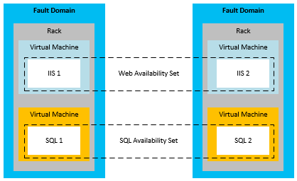

<properties
    pageTitle="技术指南：Azure 中发生局部故障后进行恢复 | Azure"
    description="本文可帮助你了解和设计有复原能力、高度可用、容错的应用程序，以及针对灾难恢复进行规划，其内容侧重于 Azure 中的局部故障。"
    services=""
    documentationcenter="na"
    author="adamglick"
    manager="saladki"
    editor="" />
<tags
    ms.assetid="2e50f6c1-fa61-4c7d-ac26-566a142fbfc2"
    ms.service="resiliency"
    ms.devlang="na"
    ms.topic="article"
    ms.tgt_pltfrm="na"
    ms.workload="na"
    ms.date="08/18/2016"
    wacn.date="02/20/2017"
    ms.author="aglick" />

# Azure 复原技术指南：Azure 中发生局部故障后进行恢复

应用程序可用性主要面临两大威胁：

* 设备（如驱动器和服务器）故障
* 在高峰负载情况下关键资源（如计算资源）耗尽

Azure 组合提供一套资源管理、弹性、负载均衡和分区功能，可在这些情况下实现高可用性。上述某些功能会对所有 Azure 服务自动执行。但在某些情况下，应用程序开发人员必须完成额外的工作，方可从这些功能中获益。

##云服务

Azure 云服务由包含一个或多个 Web 角色或辅助角色的集合组成。角色的一个或多个实例可以并发运行。实例的数量由配置决定。角色实例由名为结构控制器的组件进行监视和管理。结构控制器会自动检测并响应软件和硬件故障。

每个角色实例都在自已的虚拟机 (VM) 中运行，并通过来宾代理与其结构控制器通信。来宾代理收集资源和节点指标，包括 VM 使用状况、状态、日志、资源使用状况、异常和故障情况。结构控制器将按照可配置的间隔查询来宾代理，并在来宾代理未能响应时重新启动 VM。如果发生硬件故障，关联的结构控制器会将所有受影响的角色实例移到新的硬件节点，并重新配置网络以将流量路由到该节点。

若要从这些功能中受益，开发人员应确保所有服务都不在角色实例上存储状态。相反，所有永久性数据都应从持久存储访问，如 Azure 存储空间或 SQL 数据库。这样，任何角色都能对请求进行处理。这也意味着，角色实例可以随时停止，却不会造成服务暂时状态或永久状态的不一致。

将状态存储在角色外部的要求具有几个含义。例如，这意味着对 Azure 存储表的所有相关更改，如果可能，将在单一实体组事务中进行。当然，在单一事务中进行所有更改并非始终都可能。请务必多加留心，确保在角色实例故障中断长期运行的操作、而这种操作包括两个或多个对服务永久状态的更新时，这些故障不会产生问题。如果另一个角色尝试重新执行此类操作，它应预期并处理只有部分工作完成的情况。

例如，有一项服务将数据分区存储在多个存储中。如果辅助角色在重定位分片时关闭，则分片重定位可能不会完成。或者重定位可能由另一个辅助角色重复，而这可能引起数据孤立或数据损坏。为防止出现问题，长期运行的操作必须是以下一种或两种类型：

* *幂等*：可重复且无副作用。要成为幂等操作，长期运行的操作无论执行多少次都应具有相同的效果，即使在执行过程中中断也是如此。
* *能以增量方式重新启动*：可从最近的故障点继续。要能以增量方式重新启动，长期运行的操作必须由一连串小型的原子操作组成。此外，该操作应在持久存储中记录其进度，从而使每个后续调用能够从其前任停止的位置接续。

最后，所有长期运行的操作都应被重复调用，直到操作成功为止。例如，辅助角色可能会将预配操作放入 Azure 队列中，并且只有在操作成功时才能将它从队列中删除。可能有必要进行垃圾收集，来清理已中断操作创建的数据。

### 弹性

为每个角色运行的初始实例数量由每个角色的配置决定。管理员应根据预期负载，将每个角色初始配置为运行两个或多个实例。但是，角色实例数可以随着使用模式的更改轻松扩展或缩减。可以在 Azure 门户预览中手动执行此操作，或者使用 Windows PowerShell、服务管理 API 或第三方工具来自动完成该过程。有关详细信息，请参阅 [如何自动缩放应用程序](/documentation/articles/cloud-services-how-to-scale/)。

### 分区

Azure 结构控制器使用两种类型的分区：

* *更新域*用于按组升级服务的角色实例。Azure 将服务实例部署到多个更新域中。对于就地更新，结构控制器会停止一个更新域中的所有实例，更新这些实例，然后重新启动这些实例，接下来将它们移到下一个更新域中。这种方法能够避免整个服务在更新期间无法使用。
* *容错域*定义硬件或网络的潜在故障点。对于任何角实例数超过一个的角色，结构控制器会确保这些实例分布在多个容错域上，从而防止孤立的硬件故障中断服务。所有服务器和群集故障风险都由容错域管理。

[Azure 服务级别协议 (SLA)](/support/legal/sla/) 保证在有两个或更多个 Web 角色实例部署到不同的容错域和升级域时，它们将有至少 99.95% 的时间具有外部连接性。与更新域不同的是，没有办法控制容错域的数量。Azure 会自动分配容错域，并将角色实例分布到这些容错域中。至少应将每个角色的前两个实例放在不同的容错域和升级域中，以确保至少有两个实例的任何角色都能满足 SLA。下图对此做了演示。

### 负载均衡

某个 Web 角色的所有入站流量都会通过无状态负载均衡器，由负载均衡器将客户请求在角色实例间分配。单个角色实例没有公共 IP 地址，无法直接从 Internet 访问。Web 角色是无状态角色，所以可将任何客户端请求路由到任何角色实例。每隔 15 秒会引发一次 [StatusCheck](https://msdn.microsoft.com/zh-cn/library/microsoft.windowsazure.serviceruntime.roleenvironment.statuscheck.aspx) 事件。这可用来指示角色是已准备好接收流量，还是仍在忙碌，因而应从负载均衡器轮换中取出。

## 虚拟机

就高可用性而言，Azure 虚拟机在许多方面与平台即服务 (PaaS) 计算角色有所不同。在某些情况下，必须完成额外的工作才能确保高可用性。

### 磁盘持久性

与 PaaS 角色实例不同，即使虚拟机位置改变，虚拟机驱动器中存储的数据仍会保存下来。Azure 虚拟机使用以 Blob 形式存在于 Azure 存储空间中的 VM 磁盘。由于 Azure 存储的可用性特征，存储在虚拟机驱动器上的数据也具有高可用性。

请注意，D 驱动器（Windows VM 中）是此项规则的例外。D 驱动器实际上是托管 VM 的机架服务器的物理存储，如果回收 VM，其中的数据就会丢失。D 驱动器只能用作临时存储。在 Linux 中，Azure“通常”（但不总是）将本地临时磁盘作为 /dev/sdb 块设备公开。Azure Linux 代理通常将其作为 /mnt/resource 或 /mnt 装入点进行装载（可通过 /etc/waagent.conf 进行配置）。

### 分区

Azure 原本就能识别 PaaS 应用程序（Web 角色和辅助角色）中的各个层，因此能够正确地将它们分布在容错域和更新域上。相反，必须使用可用性集手动定义基础结构即服务 (IaaS) 应用程序中的层。IaaS 需要使用可用性集来符合 SLA 要求。

在上图中，Internet Information Services (IIS) 层（充当 Web 应用层）和 SQL 层（充当数据层）分配给不同的可用性集。这可确保通过将虚拟机分布在多个容错域中，使每一层的所有实例获得硬件冗余，并且整个层在更新期间不会关闭。

### 负载均衡

如果应在各 VM 间分布流量，必须将应用程序中的 VM 分组，并对特定的 TCP 或 UDP 终结点进行负载均衡。有关详细信息，请参阅[对虚拟机进行负载均衡](/documentation/articles/virtual-machines-linux-load-balance/)。如果 VM 接收来自其他来源（如排队机制）的输入，则不需要负载均衡器。负载均衡器使用基本运行状况检查来确定是否应将流量发送到节点。你也可以创建自己的探测，实现应用程序特定的运行状况指标，以确定 VM 是否应接收流量。

## 存储

Azure 存储空间是 Azure 的基准持久数据服务。它提供 Blob、表、队列和 VM 磁盘存储。它使用复制与资源管理的组合，在单个数据中心内提供高可用性。Azure 存储空间可用性 SLA 保证至少 99.9% 的时间内可以：

* 成功且正确地处理格式正确的请求，以添加、更新、读取和删除数据。
* 存储帐户将与 Internet 网关建立连接。

### 复制

Azure 存储空间数据持久性形成的方式，是在区域内完全独立的物理存储子系统中的不同驱动器上维护所有数据的多个副本。数据会进行同步复制，然后提交所有副本，之后才会确认写入操作。Azure 存储空间具有坚实的一致性，保证读取会反映最新写入的内容。此外，系统会对数据副本进行连续扫描，以检测和修复位衰减，在所存储数据的完整性方面，这是一种经常会被忽略的威胁。

服务只要使用 Azure 存储空间，便会因复制而受益。服务开发人员不需要完成任何额外工作，即可从局部故障恢复。

### 资源管理

2014 年 5 月之后创建的存储帐户最高可以增长至 500 TB（以前的最大值为 200 TB）。如果需要额外的空间，必须将应用程序设计为利用多个存储帐户。

### 虚拟机磁盘

虚拟机的磁盘作为页 Blob 存储在 Azure 存储中，因此，它与 Blob 存储具有完全相同的持久性和可缩放性。如果采用这种设计，即使运行 VM 的服务器发生故障，必须在另一台服务器上重启该 VM，虚拟机磁盘上的数据仍会得以保存。

## 数据库

### SQL 数据库

Azure SQL 数据库提供数据库即服务。它使应用程序可以快速预配和查询关系数据库，并在数据库中插入数据。它提供许多熟悉的 SQL Server 特性与功能，同时减少了硬件、配置、修补和复原方面的负担。

> [AZURE.NOTE]
> Azure SQL 数据库并不提供与 SQL Server 一一对应的功能。其目的在于满足专门适用于云应用程序的一套不同的要求（通过弹性扩展、数据库即服务来降低维护成本等）。有关详细信息，请参阅[选择云 SQL Server 选项：Azure SQL (PaaS) 数据库或 Azure VM 上的 SQL Server (IaaS)](/documentation/articles/sql-database-paas-vs-sql-server-iaas/)。
> 
> 

#### 复制

Azure SQL 数据库对节点级故障提供内置的复原功能。所有写入数据库的内容会使用仲裁提交技术自动复制到两个或更多个后台节点。（主要副本和至少一个辅助副本必须先确认活动写入事务日志，然后才将事务视为成功并返回。） 在节点发生故障时，数据库会自动故障转移到其中一个辅助副本。这会造成客户端应用程序的暂时连接中断。因此，所有 Azure SQL 数据库客户端都必须实现某种形式的暂时连接处理。有关详细信息，请参阅[重试服务特定指南](/documentation/articles/best-practices-retry-service-specific/)。

####资源管理

每个数据库在创建时，都配置了大小上限。当前可用的最大大小为 1 TB（大小限制随服务层而定），请参阅 [Azure SQL 数据库的服务层和性能级别](/documentation/articles/sql-database-resource-limits/#service-tiers-and-performance-levels)。当数据库达到大小限制时，它会拒绝其他 INSERT 或 UPDATE 命令。（仍可查询和删除数据。）

在数据库内，Azure SQL 数据库使用结构来管理资源。但是，它不使用结构控制器，而是使用环形拓扑来检测故障。群集中的每个副本都有两个相邻副本，并负责检测这两个副本何时停止。当某个副本停止时，它的相邻副本便会触发重新配置代理，在另一台计算机上重新创建该副本。引擎限制可确保逻辑服务器不会在一台计算机上使用过多资源，或超过计算机的物理限制。

### 弹性

如果应用程序需要超过 1 TB 的数据库，必须实现扩展方法。使用 Azure SQL 数据库扩展的方法是在多个 SQL 数据库上手动分区（也称为分片）数据。这种扩展方法提供了实现成本随扩展呈线性增长的机会。弹性增长（或按需容量）可以根据需求随成本的增加而增长，因为数据库是根据每天实际使用的大小来进行收费，而不是根据最大的可用大小来收费。

## 虚拟机上的 SQL Server

通过在 Azure 虚拟机上安装 SQL Server（2014 或更高版本），可以利用 SQL Server 的传统可用性功能。这些功能包括 AlwaysOn 可用性组或数据库镜像。请注意，Azure VM、存储和网络的运行特征与本地非虚拟化的 IT 基础结构不同。需要了解这些区别并设计可适应这些区别的解决方案，才能成功地在 Azure 中实现高可用性/灾难恢复 (HA/DR) SQL Server 解决方案

### 可用性集中的高可用性节点

在 Azure 中实现高可用性解决方案时，通过 Azure 中的可用性集，可将高可用性节点放入单独的容错域和升级域。具体而言，可用性集是 Azure 中的一个概念。应遵循的最佳实践是确保数据库确实为高度可用，无论使用 AlwaysOn 可用性组、数据库镜像还是其他方法。如果不遵循此最佳实践，则可能会错误地假设系统为高度可用。但实际上，节点可能会因碰巧被放置在 Azure 区域内的同一容错域中而同时全部出现故障。

此项建议不适用于日志传送。作为灾难恢复功能，你应确保服务器在单独的 Azure 区域中运行。根据定义，这些区域是不同的容错域。

对于同一可用性集中通过经典管理门户部署的 Azure 云服务 VM，必须将它们部署在同一个云服务中。通过 Azure Resource Manager（当前门户）部署的 VM 不具有这种限制。对于在 Azure 云服务中部署 VM 的经典管理门户，只有同一云服务中的节点可加入同一可用性集。此外，云服务 VM 应位于同一虚拟网络中，以确保它们在服务修复后仍能保持其 IP。这可以避免 DNS 更新中断。

### 仅限 Azure：高可用性解决方案

可使用 AlwaysOn 可用性组或数据库镜像，为 Azure 中的 SQL Server 数据库提供高可用性解决方案。

下图演示了 Azure 虚拟机中运行的 AlwaysOn 可用性组的体系架构。此图摘自有关本主题的深入文章，即[Azure 虚拟机中的 SQL Server 高可用性和灾难恢复](/documentation/articles/virtual-machines-windows-sql-high-availability-dr/)。

也可以在 Azure 门户中使用 AlwaysOn 模板在 Azure VM 上自动预配 AlwaysOn 可用性组的端到端部署。有关详细信息，请参阅 [SQL Server AlwaysOn Offering in Azure Portal Preview Gallery](https://blogs.technet.microsoft.com/dataplatforminsider/2014/08/25/sql-server-alwayson-offering-in-microsoft-azure-portal-gallery/)（Azure 门户预览库中的 SQL Server AlwaysOn 产品/服务）。

下图演示了在 Azure 虚拟机上使用数据库镜像的情况。该图同样摘自深入主题文章（[Azure 虚拟机中的 SQL Server 高可用性和灾难恢复](/documentation/articles/virtual-machines-windows-sql-high-availability-dr/)）。

> [AZURE.NOTE]
> 这两种体系结构都需要域控制器。但是，数据库镜像也可以使用服务器证书，从而不再需要域控制器。
> 
> 

## 其他 Azure 平台服务

在 Azure 基础之上构建的应用程序可以利用平台功能从局部故障中恢复。在某些情况下，你可以采取某些特定操作来增加特定情况下的可用性。

### 服务总线

为了防范 Azure 服务总线的临时中断，请考虑创建一个持久的客户端队列。这会临时使用备用的本地存储机制，来存储无法添加到服务总线队列的消息。应用程序可以在还原服务后再决定如何处理临时存储的消息。有关详细信息，请参阅[使用服务总线中转消息传送改进性能的最佳实践](/documentation/articles/service-bus-performance-improvements/)和[服务总线（灾难恢复）](/documentation/articles/resiliency-technical-guidance-recovery-loss-azure-region/#other-azure-platform-services)。

### HDInsight

与 Azure HDInsight 关联的数据默认存储在 Azure Blob 存储中。Azure 存储空间为 Blob 存储指定了高可用性和持久性属性。与 Hadoop MapReduce 作业关联的多节点处理是在 HDInsight 根据需要预配的暂时性 Hadoop 分布式文件系统 (HDFS) 上进行的。MapReduce 作业产生的结果默认也存储在 Azure Blob 存储中，因此在取消 Hadoop 群集的设置后处理过的数据仍具有持久性且仍然高度可用。有关详细信息，请参阅 [HDInsight（灾难恢复）](/documentation/articles/resiliency-technical-guidance-recovery-loss-azure-region/#other-azure-platform-services)。

## 局部故障清单

### 云服务

  1. 查看本文档的“云服务”部分。
  2. 为每个角色至少配置两个实例。
  3. 将状态保存在持久存储中，而不是角色实例上。
  4. 正确处理 StatusCheck 事件。
  5. 尽可能将相关更改包装在事务中。
  6. 确认辅助角色任务具有幂等性且可重新开始。
  7. 持续调用操作，直到操作成功为止。
  8. 考虑采用自动缩放策略。

### 虚拟机

  1. 查看本文档的“虚拟机”部分。
  2. 不要使用 D 驱动器作为持久存储。
  3. 将服务层中的计算机分组为可用性集。
  4. 配置负载均衡和可选探测。

### 存储

  1. 查看本文档的“存储”部分。
  2. 在数据或带宽超过配额时使用多个存储帐户。

### SQL 数据库

  1. 查看本文档的“SQL 数据库”部分。
  2. 实现重试策略以处理暂时错误。
  3. 使用分区/分片作为扩展策略。

### 虚拟机上的 SQL Server

  1. 查看本文档的“虚拟机上的 SQL Server”部分。
  2. 遵循上述有关虚拟机的建议。
  3. 使用 SQL Server 高可用性功能，如 AlwaysOn。

### 服务总线

  1. 查看本文档的“服务总线”部分。
  2. 考虑创建持久客户端队列作为备份。

### HDInsight

  1. 查看本文档的“HDInsight”部分。
  2. 对于局部故障无需采取其他可用性步骤。

## 后续步骤

本文是着重介绍 [Azure 复原技术指南](/documentation/articles/resiliency-technical-guidance/)的系列教程的一部分。本系列教程的下一篇文章是[Recovery from a region-wide service disruption](/documentation/articles/resiliency-technical-guidance-recovery-loss-azure-region/)（在发生区域范围的服务中断后进行恢复）。

<!---HONumber=Mooncake_0213_2017-->
<!-- Update_Description: update meta properties; wording update-->