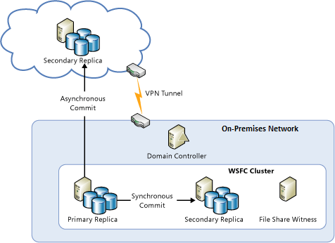
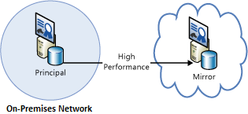
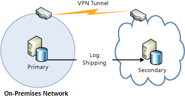
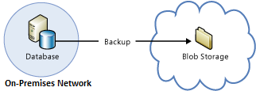

<!-- Remove StoreSimple -->
<properties
   pageTitle="技术指南：从本地恢复到 Azure | Azure"
   description="本文可帮助你了解和设计用于从本地基础结构恢复到 Azure 的系统"
   services=""
   documentationCenter="na"
   authors="adamglick"
   manager="saladki"
   editor=""/>

<tags
   ms.service="resiliency"
   ms.devlang="na"
   ms.topic="article"
   ms.tgt_pltfrm="na"
   ms.workload="na"
   ms.date="08/18/2016"
   wacn.date="10/10/2016"/>

#Azure 复原技术指南：从本地恢复到 Azure

Azure 提供一整套服务，可让你将本地数据中心扩展到 Azure，用于高可用性和灾难恢复目的：

* __网络__：通过虚拟专用网络，你可以安全地将本地网络扩展到云。
* __计算__：使用本地 Hyper-V 的客户可以将现有虚拟机 (VM)“提起并移动”到现有的 Azure。
* __存储__：StorSimple 可将文件系统扩展到 Azure 存储空间。Azure 备份服务提供将文件和 SQL 数据库备份到 Azure 存储空间的功能。
* __数据库复制__：使用 SQL 2014（或更高版本）可用性组，可以为本地数据实现高可用性和灾难恢复。

##联网

可以使用 Azure 虚拟网络在 Azure 中创建一个逻辑上独立的部分，并可使用 IPsec 连接将其连接到本地数据中心或单个客户端计算机。通过虚拟网络，可轻松地利用 Azure 中按需可缩放的基础架构，同时可连接到本地数据和应用程序，包括 Windows Server、大型机和 UNIX 上运行的系统。有关详细信息，请参阅 [Azure 网络文档](/documentation/articles/virtual-networks-overview/)。

##计算

使用本地 Hyper-V 的客户可以将现有的虚拟机“提起并移动”到 Azure 和运行 Windows Server 2012（或更高版本）的服务提供程序，而不需要对 VM 进行更改或转换 VM 格式。有关详细信息，请参阅 [About disks and VHDs for Azure virtual machines（关于 Azure 虚拟机的磁盘和 VHD）](/documentation/articles/virtual-machines-linux-about-disks-vhds/)。

##Azure Site Recovery

如果你希望作为一项服务 (DRaaS) 的灾难恢复，Azure 提供了 [Azure Site Recovery](/home/features/site-recovery/)。Azure Site Recovery 为 VMware、Hyper-V 和物理服务器提供全面的保护。借助 Azure Site Recovery，可以使用另一台本地服务器或 Azure 作为恢复站点。有关 Azure Site Recovery 的详细信息，请参阅 [Azure Site Recovery 文档](/home/features/site-recovery/)。

##存储

可以使用多个选项将 Azure 用作本地数据的备份站点。

<!-- ###StorSimple

StorSimple 可安全、透明地整合本地应用程序的云存储。它还提供单个设备来实现高性能的分层本地和云存储、实时存档、基于云的数据保护和灾难恢复。有关详细信息，请参阅 [StorSimple 产品页](/home/features/storsimple/)。 -->

###Azure 备份

Azure 备份让你可以使用 Windows Server 2012（或更高版本）、Windows Server 2012 Essentials（或更高版本）和 System Center 2012 Data Protection Manager（或更高版本）中熟悉的备份工具进行云备份。这些工具提供了独立于备份存储位置（无论是本地磁盘还是 Azure 存储空间）的备份管理工作流。数据备份到云后，经过授权的用户可以轻松地恢复到任何服务器的备份。

使用增量备份时，只会将文件更改传输到云。这有助于高效使用存储空间、降低带宽消耗并支持多个数据版本的时间点恢复。你也可以选择使用其他功能，如数据保留策略、数据压缩和数据传输限制。使用 Azure 作为备份位置有一个明显的优点，那就是自动在“场外”备份。这样就不再需要额外对现场备份媒体进行保护了。

有关详细信息，请参阅 [What is Azure Backup?（什么是 Azure 备份？）](/documentation/articles/backup-introduction-to-azure-backup/)和 [Configure Azure Backup for DPM data（为 DMP 数据配置 Azure 备份）](https://technet.microsoft.com/zh-cn/library/jj728752.aspx)。

##数据库

可使用 AlwaysOn 可用性组、数据库镜像、日志传送以及备份和还原与 Azure Blob 存储配合使用，在混合 IT 环境中为 SQL Server 数据库提供灾难恢复解决方案。所有这些解决方案都使用 Azure 虚拟机上运行的 SQL Server。

AlwaysOn 可用性组可在本地和云中都有数据库副本的混合 IT 环境中使用。下图显示了此特点。

在基于证书的设置中，数据库镜像也可以横跨本地服务器和云。下图演示了此概念。

日志传送可用于同步本地数据库和 Azure 虚拟机中的 SQL Server 数据库。

最后，可以直接将本地数据库备份到 Azure Blob 存储。

有关详细信息，请参阅 [High availability and disaster recovery for SQL Server in Azure virtual machines（Azure 虚拟机中 SQL Server 的高可用性和灾难恢复）](/documentation/articles/virtual-machines-windows-sql-high-availability-dr/)和 [Backup and restore for SQL Server in Azure virtual machines（Azure 虚拟机中 SQL Server 的备份和还原）](/documentation/articles/virtual-machines-windows-sql-backup-recovery/)。

##Azure 中的本地恢复清单

###联网

  1. 查看本文档的[网络](#networking)部分。
  2. 使用虚拟网络安全地将本地部署与云相连。

###计算

  1. 查看本文档的[计算](#compute)部分。
  2. 在 Hyper-V 和 Azure 之间重新定位 VM。

###存储

  1. 查看本文档的[存储](#storage)部分。
  2. 通过 StorSimple 服务来使用云存储。
  3. 使用 Azure 备份服务。

###数据库

  1. 查看本文档的[数据库](#database)部分。
  2. 考虑使用 Azure VM 上的 SQL Server 作为备份。
  3. 设置 AlwaysOn 可用性组。
  4. 配置基于证书的数据库镜像。
  5. 使用日志传送。
  6. 将本地数据库备份到 Azure Blob 存储。

##后续步骤

本文是着重介绍 [Azure 复原技术指南](/documentation/articles/resiliency-technical-guidance/)的系列教程的一部分。本系列教程的下一篇文章是[数据损坏或意外删除后进行恢复](/documentation/articles/resiliency-technical-guidance-recovery-data-corruption/)。

<!---HONumber=Mooncake_0926_2016-->