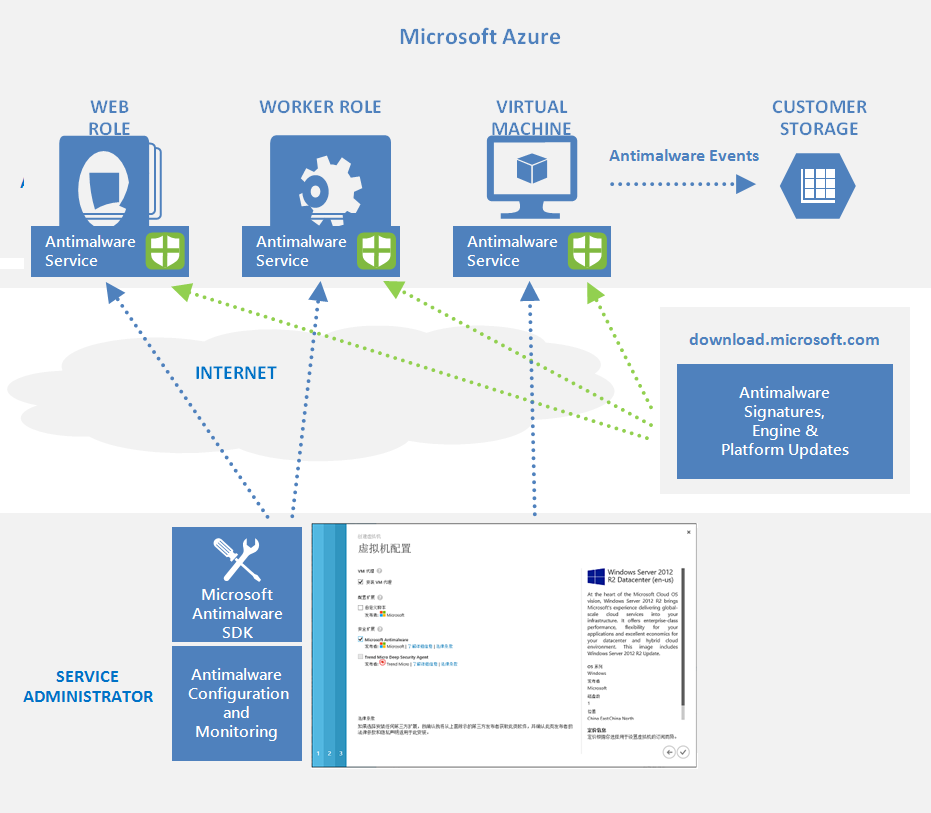

<properties
   pageTitle="适用于 Azure 云服务和虚拟机的 Microsoft 反恶意软件 | Microsoft Azure"
   description="本文提供适用于 Azure 的 Microsoft 反恶意软件的体系结构概述，包括为 Azure 云服务和虚拟机启用、配置和部署保护时支持的方案与配置。我们将介绍可通过 Microsoft Azure 服务管理 API、PowerShell 脚本、Azure 门户和 Visual Studio 访问的基本配置、管理与监视功能。"
   services="security"
   documentationCenter="na"
   authors="lingche"
   manager="shlan"
   editor="lingche"/>  

<tags
   ms.service="security"
   ms.devlang="na"
   ms.topic="article"
   ms.tgt_pltfrm="na"
   ms.workload="na"
   ms.date="09/19/2016"
   wacn.date="10/31/2016"
   ms.author="lingche"/>  

#适用于 Azure 云服务和虚拟机的 Microsoft 反恶意软件

现代云环境的威胁局势非常多变，企业 IT 云订阅者为了遵循法规和达到安全要求，在维护有效保护机制方面承受着许多压力。用于 Azure 云服务和虚拟机的 Microsoft 反恶意软件是一种免费的实时保护功能，当已知恶意软件或不需要的软件试图在 Azure 系统上安装自己或运行时，它可使用可配置的警报帮助识别和删除病毒、间谍软件和其他恶意软件。

该解决方案构建于 Microsoft Security Essentials [MSE]、Microsoft Forefront Endpoint Protection、Microsoft System Center Endpoint Protection、Windows Intune 和适用于 Windows 8.0 及更高版本的 Windows Defender 所用的同一个反恶意软件平台基础之上。适用于 Azure 的 Microsoft 反恶意软件是一个针对应用程序和租户环境所提供的单一代理解决方案，可在在后台运行而无需人工干预。你可以根据应用程序工作负荷的需求，选择默认的基本安全性或高级的自定义配置（包括反恶意软件监视）来部署保护。

为应用程序部署并启用适用于 Azure 的 Microsoft 反恶意软件后，便可以使用以下几项核心功能：

- **实时保护** - 监视云服务和虚拟机上的活动，以检测和阻止恶意软件的执行。
- **计划的扫描** - 定期执行有针对性的扫描，以检测恶意软件，包括主动运行的程序。
- **恶意软件消除** - 自动针对检测到的恶意软件采取措施，例如删除或隔离恶意文件以及清除恶意注册表项。
- **签名更新** - 自动安装最新的保护签名（病毒定义）以确保按预定的频率保持最新保护状态。
- **反恶意软件引擎更新** - 自动更新 Microsoft 反恶意软件引擎。
- **反恶意软件平台更新** – 自动更新 Microsoft 反恶意软件平台。
- **主动保护** - 将检测到的威胁和可疑资源的遥测元数据报告给 Microsoft Azure，以确保针对不断演变的威胁局势做出快速响应，并通过 Microsoft Active Protection System (MAPS) 启用实时同步签名传递。
- **示例报告** - 将示例提供并报告给 Microsoftt 反恶意软件服务，以帮助改善服务并实现故障排除。
- **排除项** - 允许应用程序和服务管理员配置特定的文件、进程与驱动器，以便出于性能和/或其他原因将其从保护和扫描中排除。
- **恶意软件事件收集** -在操作系统事件日志中记录反恶意软件服务的运行状况、可疑活动及采取的补救措施，并将这些数据收集到客户的 Azure 存储帐户。

##体系结构

适用于 Azure 云服务和虚拟机的 Microsoft 反恶意软件解决方案包含 Microsoft 反恶意软件客户端和服务、反恶意软件经典部署模型、反恶意软件 PowerShell cmdlet 和 Azure 诊断扩展。Windows Server 2008 R2、Windows Server 2012 和 Windows Server 2012 R2 操作系统系列支持 Microsoft 反恶意软件解决方案。Windows Server 2008 操作系统不支持此解决方案。目前仍不支持 Windows Server 技术预览版，但预期将来会提供支持。

默认情况下，Microsoft 反恶意软件客户端和服务以禁用状态安装在云服务平台中所有受支持的 Azure 来宾操作系统系列上。默认情况下，Microsoft 反恶意软件客户端和服务未安装在虚拟机平台中，而是通过 Azure 门户和 Visual Studio 虚拟机配置中的“安全扩展”作为一个可选功能来提供。

使用 Azure 网站时，托管 Web 应用的集成服务在其上启用了 Microsoft 反恶意软件。该软件用于保护 Azure 网站基础结构，不会在客户内容上运行。

###Microsoft 反恶意软件工作流

Azure 服务管理员可以使用以下选项，针对虚拟机和云服务通过默认或自定义配置来启用 Azure 的反恶意软件：

-   虚拟机 – 在服务器资源管理器中使用 Visual Studio 虚拟机配置

-   虚拟机和云服务 – 使用反恶意软件[经典部署模型](https://msdn.microsoft.com/library/azure/ee460799.aspx)

-   虚拟机和云服务 – 使用反恶意软件 PowerShell cmdlet

Azure 门户或 PowerShell cmdlet 将反恶意软件扩展包文件推送到 Azure 系统中的预定固定位置。Azure 来宾代理（或结构代理）启动反恶意软件扩展，并将提供的反恶意软件配置设置应用为输入。此步骤将以默认或自定义配置设置来启用反恶意软件服务。若未提供任何自定义配置，则将以默认配置设置来启用反恶意软件服务。有关详细信息，请参阅[适用于 Azure 云服务和虚拟机的 Microsoft 反恶意软件 – 代码示例](http://aka.ms/amazsamples "适用于 Azure 云服务和 VM 的 Microsoft 反恶意软件代码示例")中的*反恶意软件配置*部分。

运行后，Microsoft 反恶意软件客户端将从 Internet 下载最新的保护引擎和签名定义，并将其加载到 Azure 系统上。Microsoft 反恶意软件服务会将服务相关的事件写入“Microsoft 反恶意软件”事件源下的系统 OS 事件日志中。事件包括反恶意软件客户端运行状况、保护和补救状态、新的和旧的配置设置、引擎更新和签名定义及其他信息。

你可以为云服务或虚拟机启用反恶意软件监视，以便将生成的反恶意软件事件日志事件写入 Azure 存储帐户。反恶意软件服务使用 Azure 诊断扩展将 Azure 系统中的反恶意软件事件收集到客户 Azure 存储帐户中的表内。

本文档的[反恶意软件部署方案](#_Antimalware_Deployment_Scenarios)部分介绍了上述方案支持的部署工作流，包括配置步骤和选项。

  

> [AZURE.NOTE] 但是，用户可以使用 Powershell/API 和 Azure Resource Manager 模板，将虚拟机规模集与 Microsoft 反恶意软件扩展部署在一起。若要在已经运行的虚拟机上安装扩展，可以使用[此处](https://github.com/gbowerman/vmsstools)提供的示例 python 脚本 *vmssextn.py*。此脚本获取规模集上的现有扩展配置，并向 VM 规模集上的现有扩展的列表添加扩展。

###默认和自定义的反恶意软件配置

如果你未提供自定义配置设置，将会应用默认的配置设置以启用适用于 Azure 云服务或虚拟机的反恶意软件。默认配置设置已预先经过优化，可在 Azure 环境中运行。或者，可以根据 Azure 应用程序或服务部署的需要自定义这些默认配置设置，并将其应用到其他部署方案。

> [AZURE.NOTE] 默认情况下，Azure Resource Manager 上的 Microsoft 反恶意软件用户界面处于禁用状态，无法通过 [cleanuppolicy.xml](https://blogs.msdn.microsoft.com/azuresecurity/2016/02/24/update-on-microsoft-antimalware-and-azure-resource-manager-arm-vms/) 文件绕过此错误消息。有关如何创建自定义策略的信息，请阅读 [Enabling Microsoft Antimalware User Interface on Azure Resource Manager VMs Post Deployment](https://blogs.msdn.microsoft.com/azuresecurity/2016/03/09/enabling-microsoft-antimalware-user-interface-post-deployment/)（部署后在 Azure Resource Manager VM 上启用 Microsoft 反恶意软件用户界面）。

下表汇总了反恶意软件服务可用的配置设置。标有“默认”的列下面标记了默认的配置设置。

  

##反恶意软件部署方案

本部分将介绍启用和配置反恶意软件的方案，包括监视 Azure 云服务和虚拟机。

###虚拟机 - 启用和配置反恶意软件

**使用 Azure 经典门户进行部署**

若要在预配虚拟机时使用 Azure 门户来启用和配置适用于 Azure 虚拟机的 Microsoft 反恶意软件，请执行以下步骤：

<<<<<<< HEAD
1\.通过 <https://portal.azure.cn> 登录到 Azure 门户
=======
1\.通过 <https://manage.windowsazure.cn> 登录到 Azure 管理
>>>>>>> c42d4e5d33761c2a0e5ee539e4bd3d1059536a71

2\. 若要创建新的虚拟机，请依次单击“新建”、“计算”、“虚拟机”、“从库中”（不要使用“快速创建”），如下所示：

  

3\. 在“选择映像”页面上选择“Microsoft Windows Server”映像。

4\. 单击向右箭头并输入虚拟机配置。

5\. 选中虚拟机配置页面上“安全扩展”下面的“Microsoft 反恶意软件”复选框。

6\. 单击“提交”按钮，以使用默认配置设置来启用和配置适用于 Azure 虚拟机的 Microsoft 反恶意软件。

  

**使用 PowerShell cmdlet 进行部署**

Azure 应用程序或服务可以使用 PowerShell cmdlet 来启用和配置适用于 Azure 虚拟机的 Microsoft 反恶意软件。

对于使用反恶意软件 PowerShell cmdlet 的 Microsoft 反恶意软件，请执行以下操作：

1. 设置你的 PowerShell 环境 - 请参阅 <https://github.com/Azure/azure-powershell> 上的文档

2. 设置你的 PowerShell 环境 - 请参阅 <https://github.com/Azure/azure-sdk-tools-samples> 上的文档

3. 如 <http://msdn.microsoft.com/library/azure/dn771716.aspx> 中所述，通过 Set-AzureVMMicrosoftAntimalwareExtension 反恶意软件 cmdlet 启用和配置 Microsoft 反恶意软件

4. 如 <http://msdn.microsoft.com/library/azure/dn771719.aspx> 中所述，使用 Get-AzureVMMicrosoftAntimalwareExtension 反恶意软件 cmdlet 获取反恶意软件配置

**注意：**适用于反恶意软件的 Azure 虚拟机配置仅支持 JSON 格式配置。[适用于 Azure 云服务和虚拟机的 Microsoft 反恶意软件 - 代码示例](http://aka.ms/amazsamples "适用于 Azure 云服务和虚拟机的 Microsoft 反恶意软件 - 代码示例")中包含了反恶意软件 JSON 配置设置模板，其中显示了支持的反恶意软件配置设置。

<!---HONumber=Mooncake_1024_2016-->