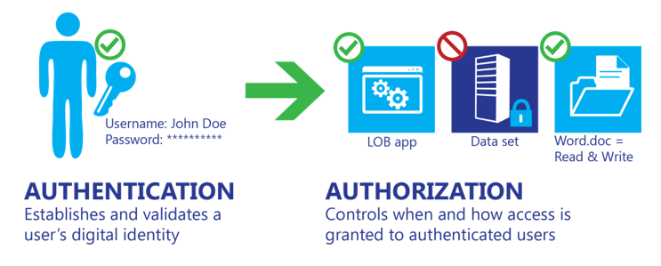

<properties
   pageTitle="Azure 的数据分类 | Azure"
   description="本文介绍数据分类基础知识并强调其价值，特别是在云计算的环境下使用 Azure 时"
   services="security"
   documentationCenter="na"
   authors="YuriDio"
   manager="swadhwa"
   editor=""
   tags="azure-service-management,azure-resource-manager"/>

<tags
   ms.service="security"
   ms.devlang="na"
   ms.topic="article"
   ms.tgt_pltfrm="na"
   ms.workload="na"
   ms.date="08/16/2016"
   wacn.date="09/26/2016"
   ms.author="yurid"/>

# Azure 的数据分类

本文介绍数据分类基础知识并强调其价值，特别是在云计算的环境下使用 Azure 时。

## 数据分类基础知识

组织中成功的数据分类需要全面认识组织的需求，并透彻了解数据资产的所在位置。

数据有三种基本状态：

- 静态
- 处理中
- 传输中

所有三种状态都需要使用独特的技术解决方案进行数据分类，但对每种状态的数据运用的数据分类原理应该相同。分类为机密的数据，在处于静态、处理中和传输中状态时需保持机密。

数据也可以是结构化或非结构化数据。相对于文档、源代码和电子邮件中的非结构化数据而言，数据库和电子表格中的结构化数据的分类过程不太复杂和耗时。

> [AZURE.TIP] 有关 Azure 功能和数据加密最佳实践的详细信息，请阅读 [Azure Data Encryption Best Practices](/documentation/articles/azure-security-data-encryption-best-practices/)（Azure 数据加密最佳实践）

一般情况下，组织的结构化数据比非结构化数据要多。不管数据是结构化还是非结构化，都必须处理好数据的敏感性。如果正确实施，数据分类可帮助确保敏感或机密数据得到的监管力度优于公开或可任意分发的数据资产。

### 控制对数据的访问

身份验证与授权经常给人造成混淆，并且其角色容易令人误解。事实上它们有很大的差别，如下图中所示。

### 身份验证

身份验证通常至少包括两个组成部分：用于标识用户的用户名或用户 ID，以及用于确认用户名凭据是否有效的令牌，如密码。该过程不会给经过身份验证的用户提供访问任何项或服务的权限；它只是验证该用户声明的身份。

> [AZURE.TIP] [Azure Active Directory](/documentation/articles/active-directory-whatis/) 提供基于云的标识服务，可让你对用户进行身份验证和授权。

### 授权

授权是使经过身份验证的用户能够访问应用程序、数据集、数据文件或其他某个对象的过程。向经过身份验证的用户分配使用、修改或删除他们可访问的项的权限需要考虑到数据分类。

成功的授权需要实施某种机制，以根据角色、安全策略和风险策略考虑因素的组合，来验证单个用户访问文件和信息的需求。
例如，不一定所有员工都需要访问特定业务线 (LOB) 应用程序中的数据，而只有一小部分员工需要访问人力资源 (HR) 文件。但是，对于需要控制谁、何时以及如何访问数据的组织而言，必须部署一个用于对用户进行身份验证的有效系统。

> [AZURE.TIP] 在 Microsoft Azure 中，可以利用 Azure 基于角色的访问控制 (RBAC)，来请确只授予用户执行其任务所需的访问权限大小。有关详细信息，请阅读 [Use role assignments to manage access to your Azure Active Directory resources](/documentation/articles/role-based-access-control-configure/)（使用角色分配来管理对 Azure Active Directory 资源的访问）。

### 云计算中的角色和职责

尽管云提供商可以帮助控制风险，但客户需确保实施数据分类管理，并正确采取强制措施来提供适当级别的数据管理服务。

数据分类的责任根据部署的云服务模型而有所不同，如下图所示。有三种主要的云服务模型，分别是基础结构即服务 (IaaS)、平台即服务 (PaaS) 和软件即服务 (SaaS)。数据分类机制的实施还取决于对云提供商的依赖性和预期。

尽管数据分类由你负责，但云提供商应该就如何保护和维持其云中存储的客户数据的隐私性做出书面承诺。

- **IaaS 提供商**需符合的要求仅限于确保虚拟环境能够适应数据分类功能和客户的合规性要求。IaaS 提供商在数据分类中扮演的角色不太重要，因为他们只需要确保客户数据能够满足合规性要求。但是，提供商仍必须确保其虚拟环境既能满足数据分类要求，又能保护其数据中心。
- **PaaS 提供商**的责任大小不一，因为平台可能是以分层方法使用的，以便为分类工具提供安全性。PaaS 提供商可能需要负责身份验证和某些授权规则，并且必须在其应用程序层中提供安全性和数据分类功能。与 IaaS 提供商非常类似，PaaS 提供商必须确保其平台满足任何相关的数据分类要求。
- **SaaS 提供商**经常被视为授权链的一部分，需确保 SaaS 应用程序中存储的数据可以根据分类类型进行控制。SaaS 应用程序可用于 LOB 应用程序，根据其鲜明的性质，需要提供某种方式来对使用和存储的数据进行身份验证与授权。

## 分类过程

了解数据分类需求并想要实施数据分类的许多组织面临着一个基本的难题：从何处着手？

实施数据分类的一种有效而简单的方法是使用 [MOF](https://technet.microsoft.com/solutionaccelerators/dd320379.aspx) 中的计划、执行、检查和行动模型。下图以图表形式演示了在此模型中成功实施数据分类所要执行的任务。

1. **计划**。识别数据资产，数据监管人员部署分类计划，并开发保护配置文件。
2. **执行**。议定数据分类策略后，根据机密数据的需要部署计划并实施强制技术。
3. **检查**。检查并验证报告，以确保所用的工具和方法能够有效解决分类策略。
4. **行动**。审查数据访问状态，并使用重新分类和修订方法审查需要修订的文件与数据，以调整更改并解决新的风险。

###选择能够满足需求的术语模型

数据分类存在多种类型的过程，包括手动过程、根据用户或系统位置来分类数据的基于位置的过程、基于应用程序的过程（例如数据库特定的分类）和各种技术使用的自动化过程，本文后面的“保护机密数据”部分中介绍了其中的某些过程。

本文将介绍两种广泛使用的术语模型，它们基于行业遵循的、能够正常运转的模型。下表显示了这些术语模型，两者提供三种级别的分类敏感性。

> [AZURE.NOTE] 在分类某个文件或资源时，如果该文件或资源中合并了通常需要以不同级别分类的数据，则提供的最高分类级别应该建立总分类。例如，包含敏感数据和受限数据的文件应分类为受限。

| **敏感性** | **术语模型 1** | **术语模型 2** |
|--------------------|---------------------------|-------------------------|
| 高 | 机密 | 受限 |
| 中型 | 仅供内部使用 | 敏感 |
| 低 | 公共 | 非受限 |

#### 机密（受限）

分类为机密或受限的信息包括泄漏或丢失时，可能给一个或多个个人和/或组织造成灾难性损失的数据。此类信息通常是在“需要知道”的基础上提供的，可能包括：

- 个人数据，包括个人身份信息，如社会安全号或身份证号、护照号、信用卡号、驱动程序的许可证号、医疗记录和医疗保险政策 ID 号。
- 财务记录，包括财务帐号，如支票或投资帐号。
- 业务材料，如属于专属或特定知识产权的文档或数据。
- 法律数据，包括潜在的律师特权材料。
- 身份验证数据，包括专用加密密钥、用户名密码对或其他标识序列，如私人生物识别密钥文件。

分类为机密的数据在数据处理方面往往需要满足法规和遵从性要求。

#### 仅供内部使用（敏感）

分类为中等敏感性的信息包括丢失或受损时，不会给个人和/或组织造成严重影响的文件和数据。此类信息可能包括：

- 电子邮件。大部分的大部分在经删除或分发后不会造成严重问题（不包括邮箱，或者纳入机密分类的个人的电子邮件）。
- 不包含机密数据的文档和文件。

通常，这种分类包括非机密的任何信息。这种分类可以包括大多数业务数据，因为日常管理或使用的大多数文件都可以分类为敏感信息。除了公开或划归为保密的数据以外，企业组织中的所有数据默认情况下都可分类为敏感数据。

#### 公开（非受限）

分类为公开的信息包括对企业需求或运营不重要的数据和文件。这种分类还可包括有意发布给公众使用的数据，例如市场营销材料或新闻公告。此外，这种分类可以包括电子邮件服务存储的垃圾电子邮件等数据。

### 定义数据所有权

必须针对所有数据资产的所有权建立明确的监管链。下表列出了数据分类工作中不同的数据所有权角色及其相应的权限。

| **角色** | **创建** | **修改/删除** | **委托** | **读取** | **存档/还原** |
|-----------------|---------------|---------------------|---------------|-------------|-----------------------|
| 所有者 | X | X | X | X | X |
| 监管员 | | | X | | |
| 管理员 | | | | | X |
| 用户* | | X | | X | |
*监管员可为用户授予其他权限，例如编辑和删除权限

> [AZURE.NOTE] 此表中提供的角色和权限并不详尽，而只是提供了一些典型的示例。

**数据资产所有者**是数据的原始创建者，可以委托所有权和分配监管员。创建一个文件后，所有者应该能够分配分类，这意味着，他们有责任根据其组织的策略了解需要将哪些信息分类为机密。除非需要负责拥有或创建机密（受限）数据类型，否则，数据资产所有者的所有数据可自动分类为仅供内部使用（敏感）。所有者的角色在分类数据后往往发生变化。例如，所有者在创建包含分类信息的数据库后，将会交出数据监管权限。

> [AZURE.NOTE] 数据资产所有者通常混合使用服务、设备和媒体，其中，有些是个人的，有些则属于组织。明确的组织策略可帮助确保设备（例如笔记本电脑和智能设备）的使用符合数据分类指导方针。

**数据资产监管员**由资产所有者（或其代理人）分配，可根据与资产所有者达成的协议或根据适用的策略要求来管理资产。理想情况下，监管员角色可在自动化系统中实施。资产监管员确保提供所需的访问控制，并负责管理和保护委托给他们的资产。资产监管员的职责可能包括：

- 根据资产所有者的指示或者与资产所有者达成的协议保护资产
- 确保遵守分类策略
- 在议定的控制措施和/或保护过程发生任何更改时，在这些更改生效之前通知资产所有者
- 当资产监管员的职责发生变化或者被撤销时，向资产所有者汇报
- **管理员**代表负责确保维持完整性的用户，但他们不是数据资产所有者、监管员或用户。事实上，许多管理员角色提供数据容器管理服务，但无权访问数据。管理员角色包括备份和还原数据、维护资产记录，以及选择、采购和操作用于容装资产的设备与存储。
- 资产用户包括有权访问数据或文件的任何人。所有者通常会将访问权限分配委托给资产监管员。

### 实现

管理考虑因素适用于所有分类方法。这些考虑因素需要包括使用、访问、更改或删除数据资产的人员、具体资产、位置、时间和原因的详细信息。必须在了解组织如何审视风险的基础上执行所有资产管理，但可以根据数据分类过程中的定义应用简单的方法。数据分类的其他考虑因素包括引入新的应用程序和工具，以及管理实施分类方法后的更改。

### 重新分类

当用户或系统确定数据资产的重要性或风险配置文件已更改时，需要重新分类或更改数据资产的分类状态。为了确保分类状态持续保持最新且有效，这项工作非常重要。不是手动分类的大多数内容可以自动分类，或根据数据监管员或数据所有者的用法进行分类。

### 手动数据重新分类

理想情况下，这项工作将确保捕获和审核更改的详细信息。手动重新分类的最可能原因是出于敏感性，或者保留书面格式的记录，或者要求审查最初分类不当的数据。由于本文考虑的是数据分类以及将数据移到云中，手动重新分类工作需要考虑到不同的案例，理想情况下，应该使用风险管理评审来满足分类要求。通常，此类工作会考虑到组织的政策，其中规定需要分类哪些信息、默认分类状态（敏感但不机密的所有数据和文件），以及对高风险数据额外采取的措施。

### 自动数据重新分类

自动数据重新分类使用的一般准则与手动分类相同。例外的情况是，自动化解决方案可以确保根据需要遵循并应用规则。可将数据分类作为数据分类强制策略的一部分执行，使用授权技术存储、使用和传输数据时，可以强制实施该策略。

- 基于应用程序。按默认使用特定应用程序可设置分类级别。例如，默认情况下，客户关系管理 (CRM) 软件、HR 和医疗记录管理工具中的数据是机密数据。
- 基于位置。数据位置可帮助识别数据敏感性。例如，HR 或财务部门存储的数据在性质上往往是机密的。

### 数据保留、恢复和处置

与数据重新分类一样，数据恢复和处置是管理数据资产时的重要方面。数据恢复和处置原则由数据保留策略定义，其实施方式与数据重新分类相同；此类工作将由监管员和管理员角色以协作任务的形式执行。

如果未制定数据保留策略，则可能会导致数据丢失，或者无法满足法规和法律发现要求。未明确定义数据保留策略的大多数组织往往使用默认的“保留一切”保留策略。但是，在云服务方案中，此类保留策略存在额外的风险。

例如，云服务提供商的数据保留策略可能被视为在“订阅的生存期内”一直保留（只要支付了服务费用，数据就一直保留）。这种付费保留式协议可能无法满足企业或法规保留策略。为机密数据定义策略可确保根据最佳实践存储和删除数据。此外，可以创建存档策略，以规范化在处置哪些数据，以及何时处置数据方面的共识。

数据保留策略应能满足所需的法规与合规性要求，以及企业的合法保留要求。分类的数据可能会引发有关保留期限以及提供商存储数据例外条款的问题；对于未正确分类的数据，出现这种问题的可能性更大。

> [AZURE.TIP] 请阅读 [Microsoft 在线订阅协议](/support/legal/subscription-agreement/)，详细了解 Azure 数据保留策略和其他信息

## 保护机密数据

将数据分类后，探索并实施某些方法来保护机密数据就成了任何数据保护部署策略的不可或缺部分。保护机密数据需要额外地关注如何在传统体系结构及云中存储和传输数据。

本部分提供有关可以自动化实施工作，以帮助保护分类为机密的数据的某些技术的基本信息。

如下图所示，可将这些技术部署为本地或基于云的解决方案 — 或者以混合方式部署，即，有些技术部署在本地，有些部署在云中。（有些技术，如加密和 Rights Management，也会扩展到用户设备。）

### Rights Management 软件  

防止数据丢失的解决方案之一是 Rights Management 软件。与尝试在组织中的出口点上中断信息流的方法不同，Rights Management 软件在数据存储技术中的较深级别上工作。文档将会加密，控制谁可以解密文档的机制使用身份验证控制解决方案（如目录服务）中定义的访问控制。

> [AZURE.TIP] 你可以使用 Azure Rights Management (Azure RMS) 作为信息保护解决方案来保护不同方案中的数据。请阅读[什么是 Azure Rights Management？](https://docs.microsoft.com/rights-management/understand-explore/what-is-azure-rms)，以了解有关此 Azure 解决方案的详细信息。

Rights Management 软件的部分优势包括：

- 敏感信息受到保护。用户可以直接使用已启用 Rights Management 的应用程序保护其数据。无需其他步骤 — 创作文档、发送电子邮件和发布数据提供一致的数据保护体验。
- 不同状态的数据都会受到保护。客户可以持续控制谁有权访问其数据，不管数据是位于云、现有 IT 基础结构中，还是在用户桌面上。组织可以选择加密其数据，并根据业务要求限制访问。
- 默认的信息保护策略。管理员和用户可以针对许多常见业务方案使用标准策略，例如“公司机密 - 只读”和“不得转发”。 支持一组丰富的使用权限，例如读取、复制、打印、保存、编辑和转发，允许灵活自定义使用权限。

### 加密网关

加密网关在其各自的层上运行，通过将所有访问重新路由到基于云的数据来提供加密服务。不要将此方法与用于虚拟专用网络 (VPN) 的方法相混淆。加密网关旨在为基于云的解决方案提供透明层。

加密网关可以提供一种管理手段，并通过加密传输中的数据和静态数据来保护分类为机密的数据。

加密网关位于用户设备与应用程序数据中心之间的数据流中，可加密/解密服务。这些解决方案（如 VPN）主要是本地解决方案。它们旨在向第三方提供对加密密钥的控制权，帮助降低由一家提供商管理数据和密钥存在的风险。与加密非常类似，此类解决方案可以无缝、透明地在用户与服务之间工作。

> [AZURE.TIP] 可以使用 Azure ExpressRoute 通过专用连接将本地网络扩展到 Microsoft 云。有关此功能的详细信息，请阅读[ ExpressRoute 技术概述](/documentation/articles/expressroute-introduction/)。在本地网络之间与 Azure 之间建立跨界连接的另一个选项是[站点到站点 VPN](/documentation/articles/vpn-gateway-howto-site-to-site-resource-manager-portal/)。

### 数据丢失预防
数据丢失（有时称为数据泄漏）是一个重要的考虑因素，对于许多组织来说，防止恶意用户有意和内部人员无意丢失外部数据是首要任务。

数据丢失防护 (DLP) 技术可帮助确保解决方案（如电子邮件服务）不会传输分类为机密的数据。组织可以在现有产品中利用 DLP 功能来帮助防止数据丢失。此类功能使用可以轻松从头开始创建的，或者借助软件提供商提供的模板创建的策略。

DLP 技术可以通过关键字匹配、字典匹配、正则表达式求值和其他内容检查来执行深度内容分析，以检测违反组织 DLP 策略的内容。例如，DLP 可帮助防止以下类型的数据丢失：

- 社会安全号和身份证号
- 银行信息
- 信用卡号
- IP 地址

某些 DLP 技术还提供覆盖 DLP 配置的功能（例如，如果组织需要将社会安全号码传输给工资出纳员）。此外，还可以配置 DLP，以便在用户尝试发送不能传输的敏感信息之前，向用户发出通知。

> [AZURE.TIP] 可以使用 Office 365 DLP 功能来保护文档。有关详细信息，请阅读 [Office 365 compliance controls: Data Loss Prevention](https://blogs.office.com/2013/10/28/office-365-compliance-controls-data-loss-prevention/)（Office 365 合规性控制：数据丢失预防）。

## 另请参阅

- [Azure Data Encryption Best Practices（Azure 数据加密最佳实践）](/documentation/articles/azure-security-data-encryption-best-practices/)
- [Azure 安全团队博客](http://blogs.msdn.com/b/azuresecurity/)
- [Microsoft 安全响应中心](https://technet.microsoft.com/zh-cn/library/dn440717.aspx)

<!---HONumber=Mooncake_0725_2016-->