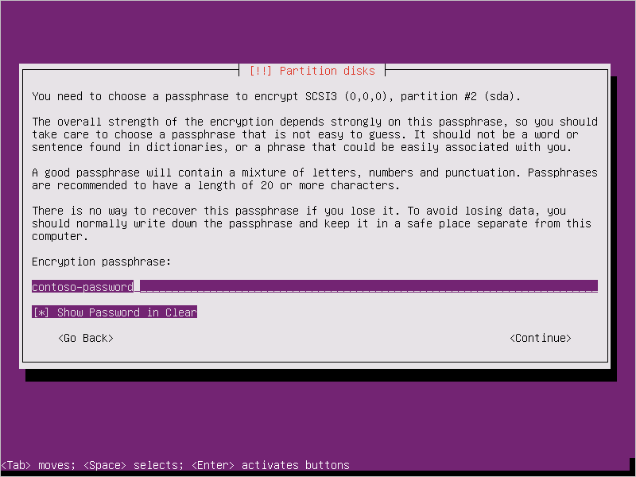
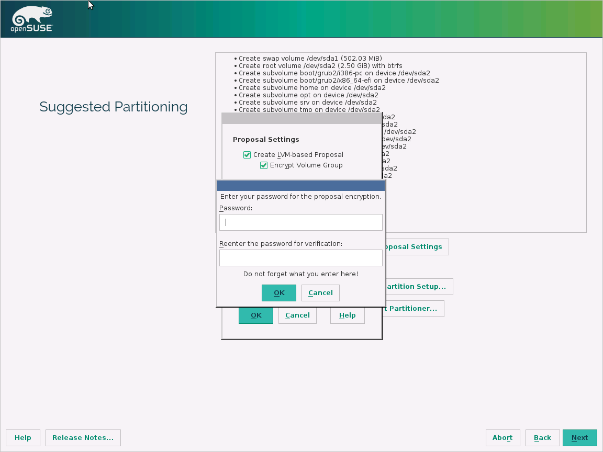
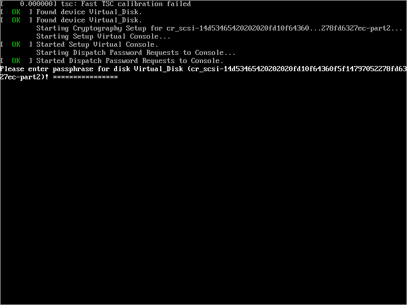

<properties
    pageTitle="适用于 Windows 和 Linux IaaS VM 的 Azure 磁盘加密 | Azure"
    description="本文概述适用于 Windows 和 Linux IaaS VM 的 Azure 磁盘加密。"
    services="security"
    documentationcenter="na"
    author="YuriDio"
    manager="swadhwa"
    editor="TomSh"
    translationtype="Human Translation" />
<tags
    ms.assetid="d3fac8bb-4829-405e-8701-fa7229fb1725"
    ms.service="security"
    ms.devlang="na"
    ms.topic="article"
    ms.tgt_pltfrm="na"
    ms.workload="na"
    ms.date="04/07/2017"
    wacn.date="06/15/2017"
    ms.author="kakhan"
    ms.sourcegitcommit="e851a3e1b0598345dc8bfdd4341eb1dfb9f6fb5d"
    ms.openlocfilehash="d2887e255e59c164bb6d733988053f514a118c7b"
    ms.lasthandoff="04/15/2017" />

# <a name="azure-disk-encryption-for-windows-and-linux-iaas-vms"></a>适用于 Windows 和 Linux IaaS VM 的 Azure 磁盘加密
Azure 坚决承诺确保数据隐私权和数据所有权，并通过各种先进技术来加密、控制和管理加密密钥以及控制和审核对数据的访问，使你能够控制 Azure 托管的数据。 这样，Azure 客户便可以灵活选择最符合其业务需求的解决方案。 在本文中，我们将会介绍新的技术解决方案“适用于 Windows 和 Linux IaaS VM 的 Azure 磁盘加密”，以帮助你保护数据，使你的组织能够信守在安全性与合规性方面所做的承诺。 本文提供有关如何使用 Azure 磁盘加密功能的详细指导，包括支持的方案和用户体验。

> [AZURE.NOTE]
> 某些建议可能会导致数据、网络或计算资源使用量增加，从而产生额外许可或订阅成本。

## <a name="overview"></a>概述
Azure 磁盘加密是用于加密 Windows 和 Linux IaaS 虚拟机磁盘的新功能。 Azure 磁盘加密利用 Windows 的行业标准 [BitLocker](https://technet.microsoft.com/zh-cn/library/cc732774.aspx) 功能和 Linux 的 [DM-Crypt](https://en.wikipedia.org/wiki/Dm-crypt) 功能，为 OS 和数据磁盘提供卷加密。 该解决方案与 [Azure Key Vault](/documentation/services/key-vault/) 集成，帮助用户管理 Key Vault 订阅中的磁盘加密密钥和机密。 此解决方案还可确保虚拟机磁盘上的所有数据在 Azure 存储中静态加密。

在标准 VM 和使用高级存储的 VM 的所有 Azure 公共区域和 AzureGov 区域中，适用于 Windows 和 Linux IaaS VM 的 Azure 磁盘加密现在以**通用版本**提供。

### <a name="encryption-scenarios"></a>加密方案
Azure 磁盘加密解决方案支持以下客户方案：

* 在通过预加密 VHD 和加密密钥创建的新 IaaS VM 上启用加密
* 在通过 Azure 库映像创建的新 IaaS VM 上启用加密
* 在 Azure 中运行的现有 IaaS VM 上启用加密
* 在 Windows IaaS VM 上禁用加密
* 在 Linux IaaS VM 的数据驱动器上禁用加密
* 启用托管磁盘 VM 的加密
* 更新现有加密的非高级存储 VM 的加密设置
* 备份和还原使用密钥加密密钥进行加密的已加密 VM

在 Azure 中启用 IaaS VM 时，该解决方案支持以下 IaaS VM 方案：

* 与 Azure 密钥保管库集成
* 标准层 VM：[A、D、DS 和 F 等系列 IaaS VM](/pricing/details/virtual-machines/)
* 在 Windows 和 Linux IaaS VM 及托管磁盘 VM 上启用加密
* 在 Windows IaaS VM 和托管磁盘 VM 的 OS 和数据驱动器上禁用加密
* 在 Linux IaaS VM 和托管磁盘 VM 的数据驱动器上禁用加密
* 在运行 Windows 客户端 OS 的 IaaS VM 上启用加密
* 在包含装入路径的卷上启用加密
* 在使用 mdadm 配置了磁盘分段 (RAID) 的 Linux VM 上启用加密
* 使用 LVM 对 Linux VM 上的数据磁盘启用加密
* 在配置有存储空间的 Windows VM 上启用加密
* 更新现有加密的非高级存储 VM 的加密设置
* 支持所有 Azure 公共和 AzureGov 区域

该解决方案不支持以下方案、功能和技术：

* 基本层 IaaS VM
* 在 Linux IaaS VM 的 OS 驱动器上禁用加密
* 使用经典 VM 创建方法创建的 IaaS VM
* 与本地密钥管理服务集成
* Azure 文件（文件共享系统）、网络文件系统 (NFS)、动态卷，以及配置了基于软件的 RAID 系统的 Windows VM
* 备份和还原不使用密钥加密密钥进行加密的已加密 VM。
* 更新现有加密的高级存储 VM 的加密设置。

> [AZURE.NOTE]
> 只有使用 KEK 配置加密的 VM 才支持已加密 VM 的备份和还原。 未使用 KEK 加密的 VM 不支持。 KEK 是用于启用 VM 加密的可选参数。 即将推出此支持。
> 不支持更新现有加密的高级存储 VM 的加密设置。 即将推出此支持。

### <a name="encryption-features"></a>加密功能
为 Azure IaaS VM 启用并部署 Azure 磁盘加密后，可根据提供的配置启用以下功能：

* 加密 OS 卷以轻松保护存储中的引导卷
* 加密数据卷以轻松保护存储中的数据卷
* 在 Windows IaaS VM 的 OS 和数据驱动器上禁用加密
* 在 Linux IaaS VM 的数据驱动器上禁用加密
* 保护 Key Vault 订阅中的加密密钥和机密
* 报告已加密 IaaS VM 的加密状态
* 从 IaaS 虚拟机中删除磁盘加密配置设置
* 使用 Azure 备份服务来备份和还原已加密 VM

> [AZURE.NOTE]
> 只有使用 KEK 配置加密的 VM 才支持已加密 VM 的备份和还原。 未使用 KEK 加密的 VM 不支持。 KEK 是用于启用 VM 加密的可选参数。

适用于 Windows 和 Linux 解决方案的 IaaS VM 的 Azure 磁盘加密包括：

* 适用于 Windows 的磁盘加密扩展。
* 适用于 Linux 的磁盘加密扩展。
* 磁盘加密 PowerShell cmdlet。
* 磁盘加密 Azure 命令行接口 (CLI) cmdlet。

运行 Windows 或 Linux OS 的 IaaS VM 支持 Azure 磁盘加密解决方案。 有关支持的操作系统的详细信息，请参阅“先决条件”部分。

> [AZURE.NOTE]
> 可以免费使用 Azure 磁盘加密来加密 VM 磁盘。

### <a name="value-proposition"></a>价值主张
Azure 磁盘加密管理解决方案可以解决以下业务需求：

* 使用行业标准的加密技术轻松保护 IaaS VM，满足组织的安全性与合规性要求。
* IaaS VM 会根据客户控制的密钥和策略启动，客户可以在 Key Vault 中审核密钥和策略的使用方式。

### <a name="encryption-workflow"></a>加密工作流
若要启用 Windows 和 Linux VM 的磁盘加密，请执行以下操作：

1. 从之前的加密方案中选择一种加密方案。
2. 选择通过 Azure PowerShell cmdlet 或 CLI 命令启用磁盘加密，并指定加密配置。

   * 对于客户加密的 VHD 方案，将加密的 VHD 上传到存储帐户，并将加密密钥材料上传到 Key Vault。 然后，提供加密配置，在新的 IaaS VM 上启用加密。
   * 针对通过应用商店创建的新 VM 和已在 Azure 中运行的现有 VM，提供加密配置以便在 IaaS VM 上启用加密。

3. 向 Azure 平台授予访问权限，使其能够从 Key Vault 中读取加密密钥数据（Windows 系统的 BitLocker 加密密钥和 Linux 密码），从而在 IaaS VM 上启用加密。

4. 提供 Azure Active Directory (Azure AD) 应用程序标识，将加密密钥材料写入 Key Vault。 这样做，即可在步骤 2 所述方案中的 IaaS VM 上启用加密。

5. Azure 使用加密和 Key Vault 配置更新 VM 服务模型，并设置加密的 VM。

 

### <a name="decryption-workflow"></a>解密工作流
若要为 IaaS VM 禁用磁盘加密，请完成以下高级步骤：

1. 选择通过 Azure PowerShell cmdlet 在 Azure 中运行的 IaaS VM 上禁用加密（解密），并指定解密配置。

 此步骤将对正在运行的 Windows IaaS VM 禁用 OS 和/或数据卷加密。 但是如前面部分所述，不支持对 Linux 禁用 OS 磁盘加密。 仅允许对 Linux VM 上的数据驱动器执行解密步骤。
2. Azure 更新 VM 服务模型后，IaaS VM 将被标记为已解密。 VM 的内容不再静态加密。

> [AZURE.NOTE]
> 禁用加密操作不会删除 Key Vault 和加密密钥材料（Windows 的 BitLocker 加密密钥或 Linux 密码）。
 > 不支持禁用 Linux 的 OS 磁盘加密。 仅允许对 Linux VM 上的数据驱动器执行解密步骤。

## <a name="terminology"></a>术语
若要理解该技术所用的一些常见术语，请参考下面的术语表：

| 术语 | 定义 |
| --- | --- |
| Azure AD | Azure AD 是 [Azure Active Directory](/documentation/services/identity/) 的缩写。 若要从 Key Vault 进行身份验证以及存储和检索机密，必须具有 Azure AD 帐户。 |
| Azure 密钥保管库 | Key Vault 是基于联邦信息处理标准 (FIPS) 验证的硬件安全模块，可以帮助保护加密密钥和敏感机密。 有关详细信息，请参阅 [Key Vault](/home/features/key-vault/) 文档。 |
| ARM | Azure Resource Manager |
| BitLocker |[BitLocker](https://technet.microsoft.com/zh-cn/library/hh831713.aspx) 是一种行业认可的 Windows 卷加密技术，用于在 Windows IaaS VM 上启用磁盘加密。 |
| BEK | BitLocker 加密密钥用于加密 OS 引导卷和数据卷。 BitLocker 密钥在 Key Vault 中以机密形式进行保护。 |
| CLI | 请参阅 [Azure 命令行接口](/documentation/articles/cli-install-nodejs/)。 |
| DM-Crypt |[DM-Crypt](https://en.wikipedia.org/wiki/Dm-crypt) 是基于 Linux 的透明磁盘加密子系统，用于在 Linux IaaS VM 上启用磁盘加密。 |
| KEK | 密钥加密密钥是非对称密钥 (RSA 2048)，用于在需要时保护或包装机密。 可提供硬件安全模块 (HSM) 保护的密钥或软件保护的密钥。 有关详细信息，请参阅 [Azure Key Vault](/home/features/key-vault/) 文档。 |
| PS cmdlet | 请参阅 [Azure PowerShell cmdlet](https://docs.microsoft.com/powershell/azure/overview)。 |

## <a name="prerequisites"></a>先决条件
针对“概述”部分所述支持的方案，在 Azure IaaS VM 上启用 Azure 磁盘加密之前，请查看以下先决条件：

* 必须具有有效的活动 Azure 订阅，才能在 Azure 的受支持区域中创建资源。
* 以下 Windows 服务器版本支持 Azure 磁盘加密：Windows Server 2008 R2、Windows Server 2012、Windows Server 2012 R2 和 Windows Server 2016。
* 以下 Windows 客户端版本支持 Azure 磁盘加密：Windows 8 Client 和 Windows 10 Client。

> [AZURE.NOTE]
> 对于 Windows Server 2008 R2，必须安装 .NET Framework 4.5 才能在 Azure 中启用加密。 可通过安装可选更新“适用于 Windows Server 2008 R2 x64 系统的 Microsoft .NET Framework 4.5.2 ([KB2901983](https://support.microsoft.com/zh-cn/kb/2901983))”，从 Windows 更新安装它。

* 在以下 Linux 服务器分发和版本上支持 Azure 磁盘加密：

| Linux 分发 | 版本 | 支持加密的卷类型|
| --- | --- |--- |
| Ubuntu | 16.04-DAILY-LTS | OS 和数据磁盘 |
| Ubuntu | 14.04.5-DAILY-LTS | OS 和数据磁盘 |
| Ubuntu | 12.10 | 数据磁盘 |
| Ubuntu | 12.04 | 数据磁盘 |
| RHEL | 7.3 | OS 和数据磁盘 |
| RHEL | 7.2 | OS 和数据磁盘 |
| RHEL | 6.8 | OS 和数据磁盘 |
| RHEL | 6.7 | 数据磁盘 |
| CentOS | 7.3 | OS 和数据磁盘 |
| CentOS | 7.2 | OS 和数据磁盘 |
| CentOS | 6.8 | OS 和数据磁盘 |
| CentOS | 7.1 | 数据磁盘 |
| CentOS | 7.0 | 数据磁盘 |
| CentOS | 6.7 | 数据磁盘 |
| CentOS | 6.6 | 数据磁盘 |
| CentOS | 6.5 | 数据磁盘 |
| openSUSE | 13.2 | 数据磁盘 |
| SLES | 12 SP1 | 数据磁盘 |
| SLES | 12-SP1（高级） | 数据磁盘 |
| SLES | HPC 12 | 数据磁盘 |
| SLES | 11-SP4（高级） | 数据磁盘 |
| SLES | 11 SP4 | 数据磁盘 |

* Azure 磁盘加密要求 Key Vault 和 VM 位于同一 Azure 区域和订阅。

> [AZURE.NOTE]
> 在不同区域中配置资源会导致启用 Azure 磁盘加密功能失败。

* 若要设置和配置 Azure 磁盘加密的 Key Vault，请参阅本文*先决条件*部分中的“设置和配置 Azure 磁盘加密的 Key Vault”部分。
* 若要针对 Azure 磁盘加密在 Azure Active Drectory 中设置和配置 Azure AD 应用程序，请参阅本文*先决条件*部分中的“在 Azure Active Directory 中设置 Azure AD 应用程序”部分。
* 若要设置和配置 Azure AD 应用程序的 Key Vault 访问策略，请参阅本文*先决条件*部分中的“为 Azure AD 应用程序设置 Key Vault 访问策略”部分。
* 若要准备预加密的 Windows VHD，请参阅*附录*中的“准备预加密的 Windows VHD”部分。
* 若要准备预加密的 Linux VHD，请参阅*附录*中的“准备预加密的 Linux VHD”部分。
* Azure 平台需要访问 Key Vault 中的加密密钥或机密，才能使这些密钥和机密可供虚拟机用来启动和解密虚拟机 OS 卷。 若要向 Azure 平台授予权限，请在 Key Vault 中设置 **EnabledForDiskEncryption** 属性。 有关详细信息，请参阅附录中的“为 Azure 磁盘加密设置和配置 Key Vault”。
* Key Vault 机密和 KEK URL 必须已设置版本。 Azure 会强制实施这项版本控制限制。 有关有效的机密和 KEK URL，请参阅以下示例：

  * 有效机密 URL 的示例：  *https://contosovault.vault.azure.cn/secrets/BitLockerEncryptionSecretWithKek/xxxxxxxxxxxxxxxxxxxxxxxxxxxxxxxx*
  * 有效 KEK URL 的示例：  *https://contosovault.vault.azure.cn/keys/diskencryptionkek/xxxxxxxxxxxxxxxxxxxxxxxxxxxxxxxx*

* Azure 磁盘加密不支持将端口号指定为 Key Vault 机密和 KEK URL 的一部分。 有关不支持和支持的 Key Vault URL 的示例，请参阅以下示例：

  * 不接受的 Key Vault URL： *https://contosovault.vault.azure.cn:443/secrets/contososecret/xxxxxxxxxxxxxxxxxxxxxxxxxxxxxxxx*
  * 接受的 Key Vault URL：  *https://contosovault.vault.azure.cn/secrets/contososecret/xxxxxxxxxxxxxxxxxxxxxxxxxxxxxxxx*

* 若要启用 Azure 磁盘加密功能，IaaS VM 必须符合以下网络终结点配置要求：
  * IaaS VM 必须能够连接到 Azure Active Directory 终结点 \[Login.chinacloudapi.cn\]，以获取用于连接 Key Vault 的令牌。
  * IaaS VM 必须能够连接到 Key Vault 终结点，以将加密密钥写入 Key Vault。
  * IaaS VM 必须能够连接到托管 Azure 扩展存储库的 Azure 存储终结点和托管 VHD 文件的 Azure 存储帐户。

  > [AZURE.NOTE]
  > 如果安全策略限制从 Azure VM 到 Internet 的访问，可以解析上述 URI，并配置特定的规则以允许与这些 IP 建立出站连接。
  >
  >若要配置和访问防火墙保护下的 Azure Key Vault (/documentation/articles/key-vault-access-behind-firewall/)

* 使用最新版本的 Azure PowerShell SDK 来配置 Azure 磁盘加密。 下载最新的 [Azure PowerShell 发行版](https://github.com/Azure/azure-powershell/releases)

 > [AZURE.NOTE]
  > [Azure PowerShell SDK 版本 1.1.0](https://github.com/Azure/azure-powershell/releases/tag/v1.1.0-January2016) 不支持 Azure 磁盘加密。 如果收到与使用 Azure PowerShell 1.1.0 相关的错误，请参阅 [与 Azure PowerShell 1.1.0 相关的 Azure 磁盘加密错误](http://blogs.msdn.com/b/azuresecurity/archive/2016/02/10/azure-disk-encryption-error-related-to-azure-powershell-1-1-0.aspx)。

* 若要运行任何 Azure CLI 命令并将其与 Azure 订阅关联，必须首先安装 Azure CLI：
  * 若要安装 Azure CLI 并将其与 Azure 订阅相关联，请参阅[如何安装和配置 Azure CLI](/documentation/articles/cli-install-nodejs/)。
  * 若要将适用于 Mac、Linux 和 Windows 的 Azure CLI 与 Azure Resource Manager 配合使用，请参阅 [Resource Manager 模式下的 Azure CLI 命令](/documentation/articles/azure-cli-arm-commands/)。

* 使用 Azure 磁盘加密 PS cmdlet Set-AzureRmVMDiskEncryptionExtension 或 CLI 命令在 Azure 托管磁盘 VM 上启用加密时，必须使用 -skipVmBackup 参数。
> [AZURE.NOTE]
 > 如果未指定 -skipVmBackup 参数，则启用加密步骤将失败。

* Azure 磁盘加密解决方案对 Windows IaaS VM 使用 BitLocker 外部密钥保护程序。 对于已加入域的 VM，不要推送会强制执行 TPM 保护程序的任何组策略。 有关“在没有兼容 TPM 的情况下允许 BitLocker”的组策略信息，请参阅 [BitLocker 组策略参考](https://technet.microsoft.com/zh-cn/library/ee706521)。
* 若要创建 Azure AD 应用程序、创建 Key Vault 或设置现有 Key Vault 并启用加密，请参阅 [Azure 磁盘加密先决条件 PowerShell 脚本](https://github.com/Azure/azure-powershell/blob/master/src/ResourceManager/Compute/Commands.Compute/Extension/AzureDiskEncryption/Scripts/AzureDiskEncryptionPreRequisiteSetup.ps1)。
* 若要使用 Azure CLI 配置磁盘加密先决条件，请参阅[此 Bash 脚本](https://github.com/ejarvi/ade-cli-getting-started)。
* 若要使用 Azure 备份服务来备份和还原加密的 VM，则使用 Azure 磁盘加密启用加密时，请使用 Azure 磁盘加密密钥配置加密 VM。 备份服务仅支持使用 KEK 配置加密的 VM。 请参阅[如何通过 Azure 备份加密来备份和还原加密的虚拟机](/documentation/articles/backup-azure-vms-encryption/)。

> [AZURE.NOTE]
> 只有使用 KEK 配置加密的 VM 才支持已加密 VM 的备份和还原。 未使用 KEK 加密的 VM 不支持。 KEK 是用于启用 VM 的可选参数。

#### <a name="set-up-the-azure-ad-application-in-azure-active-directory"></a>在 Azure Active Directory 中设置 Azure AD 应用程序
需要在 Azure 中正在运行的 VM 上启用加密时，Azure 磁盘加密将生成加密密钥并将其写入 Key Vault。 在 Key Vault 中管理加密密钥需要 Azure AD 身份验证。

为此，请创建 Azure AD 应用程序。 有关注册应用程序的详细步骤，请参阅 [Azure Key Vault - 分步指南](http://blogs.technet.com/b/kv/archive/2015/06/02/azure-key-vault-step-by-step.aspx)博客文章的“Get an Identity for the Application（获取应用程序的标识）”部分。 这篇文章还包含一些有关设置和配置 Key Vault 的有用示例。 对于身份验证，可以使用基于客户端机密的身份验证或基于客户端证书的 Azure AD 身份验证。

#### <a name="client-secret-based-authentication-for-azure-ad"></a>Azure AD 基于客户端机密的身份验证
以下部分介绍如何为 Azure AD 配置基于客户端机密的身份验证。

##### <a name="create-an-azure-ad-application-by-using-azure-powershell"></a>使用 Azure PowerShell 创建 Azure AD 应用程序
输入以下 PowerShell cmdlet 创建 Azure AD 应用程序：

    $aadClientSecret = “yourSecret”
    $azureAdApplication = New-AzureRmADApplication -DisplayName "<Your Application Display Name>" -HomePage "<https://YourApplicationHomePage>" -IdentifierUris "<https://YouApplicationUri>" -Password $aadClientSecret
    $servicePrincipal = New-AzureRmADServicePrincipal –ApplicationId $azureAdApplication.ApplicationId

> [AZURE.NOTE]
> $azureAdApplication.ApplicationId 是 Azure AD ClientID，$aadClientSecret 是客户端机密，稍后启用 Azure 磁盘加密将用到这些信息。 请妥善保存 Azure AD 客户端机密。

##### <a name="setting-up-the-azure-ad-client-id-and-secret-from-the-azure-classic-portal"></a>通过 Azure 经典管理门户设置 Azure AD 客户端 ID 和机密
还可通过 [Azure 经典管理门户]( https://manage.windowsazure.cn)设置 Azure AD 客户端 ID 和机密。 若要执行此任务，请执行以下操作：

1. 单击“Active Directory”选项卡。

    

2. 单击“添加应用程序”，然后键入应用程序名称。

    

3. 单击箭头按钮并配置应用程序的属性。

    

4. 单击左下角的复选标记完成操作。 将出现应用程序配置页，页面底部显示 Azure AD 客户端 ID。

    

5. 单击“保存”按钮保存 Azure AD 客户端机密。 请注意密钥文本框中的 Azure AD 客户端机密。 请妥善保存。

    
    
    > [AZURE.NOTE]
    > Azure 经典管理门户不支持先前的流。

##### <a name="use-an-existing-application"></a>使用现有的应用程序
若要执行以下命令，请获取并使用 [Azure AD PowerShell 模块](https://technet.microsoft.com/zh-cn/library/jj151815.aspx)。

> [AZURE.NOTE]
> 必须在新的 PowerShell 窗口中执行以下命令。 请不要使用 Azure PowerShell 或 Azure Resource Manager 窗口执行这些命令。 提出这项建议是因为这些 cmdlet 位于 MSOnline 模块或 Azure AD PowerShell 中。

    $clientSecret = ‘<yourAadClientSecret>’
    $aadClientID = '<Client ID of your Azure AD application>'
    connect-msolservice
    New-MsolServicePrincipalCredential -AppPrincipalId $aadClientID -Type password -Value $clientSecret

#### <a name="certificate-based-authentication-for-azure-ad"></a>Azure AD 基于证书的身份验证
> [AZURE.NOTE]
> Linux VM 当前不支持 Azure AD 基于证书的身份验证。

以下部分说明如何为 Azure AD 配置基于证书的身份验证。

##### <a name="create-an-azure-ad-application"></a>创建 Azure AD 应用程序
若要创建 Azure AD 应用程序，请执行以下 PowerShell cmdlet：

> [AZURE.NOTE]
> 请将 `yourpassword` 字符串替换为安全密码并保护该密码。

    $Cert = New-Object System.Security.Cryptography.X509Certificates.X509Certificate("C:\certificates\examplecert.pfx", "yourpassword")
    $CertValue = [System.Convert]::ToBase64String($Cert.GetRawCertData())
    $azureAdApplication = New-AzureRmADApplication -DisplayName "<Your Application Display Name>" -HomePage "<https://YourApplicationHomePage>" -IdentifierUris "<https://YouApplicationUri>" -CertValue $CertValue -StartDate $Cert.StartDate -EndDate $Cert.EndDate
    $servicePrincipal = New-AzureRmADServicePrincipal –ApplicationId $azureAdApplication.ApplicationId

完成此步骤后，请将 .PFX 文件上传到 Key Vault，并启用将该证书部署到 VM 所需的访问策略。

##### <a name="use-an-existing-azure-ad-application"></a>使用现有的 Azure AD 应用程序
如果要为现有应用程序配置基于证书的身份验证，请使用此处的 PowerShell cmdlet。 请务必在新的 PowerShell 窗口中执行这些 cmdlet。

    $certLocalPath = 'C:\certs\myaadapp.cer'
    $aadClientID = '<Client ID of your Azure AD application>'
    connect-msolservice
    $cer = New-Object System.Security.Cryptography.X509Certificates.X509Certificate
    $cer.Import($certLocalPath)
    $binCert = $cer.GetRawCertData()
    $credValue = [System.Convert]::ToBase64String($binCert);
    New-MsolServicePrincipalCredential -AppPrincipalId $aadClientID -Type asymmetric -Value $credValue -Usage verify

完成此步骤后，请将 .PFX 文件上传到 Key Vault，并启用将该证书部署到 VM 所需的访问策略。

##### <a name="upload-a-pfx-file-to-your-key-vault"></a>将 PFX 文件上传到 Key Vault
有关此过程的详细说明，请参阅 [Azure Key Vault 团队博客](http://blogs.technet.com/b/kv/archive/2015/07/14/vm_2d00_certificates.aspx)。 不过，只需执行以下 PowerShell cmdlet 即可完成此任务。 请务必通过 Azure PowerShell 控制台执行这些 cmdlet。

> [AZURE.NOTE]
> 请将 `yourpassword` 字符串替换为安全密码并保护该密码。

    $certLocalPath = 'C:\certs\myaadapp.pfx'
    $certPassword = "yourpassword"
    $resourceGroupName = ‘yourResourceGroup’
    $keyVaultName = ‘yourKeyVaultName’
    $keyVaultSecretName = ‘yourAadCertSecretName’

    $fileContentBytes = get-content $certLocalPath -Encoding Byte
    $fileContentEncoded = [System.Convert]::ToBase64String($fileContentBytes)

    $jsonObject = @"
    {
    "data": "$filecontentencoded",
    "dataType" :"pfx",
    "password": "$certPassword"
    }
    "@

    $jsonObjectBytes = [System.Text.Encoding]::UTF8.GetBytes($jsonObject)
    $jsonEncoded = [System.Convert]::ToBase64String($jsonObjectBytes)

    Switch-AzureMode -Name AzureResourceManager
    $secret = ConvertTo-SecureString -String $jsonEncoded -AsPlainText -Force
    Set-AzureKeyVaultSecret -VaultName $keyVaultName -Name $keyVaultSecretName -SecretValue $secret
    Set-AzureRmKeyVaultAccessPolicy -VaultName $keyVaultName -ResourceGroupName $resourceGroupName –EnabledForDeployment

##### <a name="deploy-a-certificate-in-your-key-vault-to-an-existing-vm"></a>将 Key Vault 中的证书部署到现有 VM
上传完 PFX 后，使用以下代码将 Key Vault 中的证书部署到现有 VM：

    $resourceGroupName = ‘yourResourceGroup’
    $keyVaultName = ‘yourKeyVaultName’
    $keyVaultSecretName = ‘yourAadCertSecretName’
    $vmName = ‘yourVMName’
    $certUrl = (Get-AzureKeyVaultSecret -VaultName $keyVaultName -Name $keyVaultSecretName).Id
    $sourceVaultId = (Get-AzureRmKeyVault -VaultName $keyVaultName -ResourceGroupName $resourceGroupName).ResourceId
    $vm = Get-AzureRmVM -ResourceGroupName $resourceGroupName -Name $vmName
    $vm = Add-AzureRmVMSecret -VM $vm -SourceVaultId $sourceVaultId -CertificateStore "My" -CertificateUrl $certUrl
    Update-AzureRmVM -VM $vm  -ResourceGroupName $resourceGroupName


#### <a name="set-up-the-key-vault-access-policy-for-the-azure-ad-application"></a>为 Azure AD 应用程序设置 Key Vault 访问策略
Azure AD 应用程序需有访问保管库中密钥或机密的权限。 使用 [`Set-AzureKeyVaultAccessPolicy`](https://docs.microsoft.com/en-us/powershell/module/azurerm.keyvault/set-azurermkeyvaultaccesspolicy?view=azurermps-4.1.0) cmdlet，并将客户端 ID（注册应用程序时生成）用作 _–ServicePrincipalName_ 参数值，即可向应用程序授予权限。 若要了解详细信息，请参阅博客文章 [Azure Key Vault - 分步指南](http://blogs.technet.com/b/kv/archive/2015/06/02/azure-key-vault-step-by-step.aspx)。 以下是有关如何通过 PowerShell 执行此任务的示例：

    $keyVaultName = '<yourKeyVaultName>'
    $aadClientID = '<yourAadAppClientID>'
    $rgname = '<yourResourceGroup>'
    Set-AzureRmKeyVaultAccessPolicy -VaultName $keyVaultName -ServicePrincipalName $aadClientID -PermissionsToKeys 'WrapKey' -PermissionsToSecrets 'Set' -ResourceGroupName $rgname

> [AZURE.NOTE]
> Azure 磁盘加密要求为 Azure AD 客户端应用程序配置以下访问策略 -“WrapKey”和“Set”权限。

### <a name="set-up-and-configure-your-key-vault-for-azure-disk-encryption"></a>设置和配置 Azure 磁盘加密的 Key Vault
Azure 磁盘加密有助于保护 Key Vault 中的磁盘加密密钥和机密。 若要设置 Azure 磁盘加密的 Key Vault，请完成以下每个部分中的步骤。

#### <a name="create-a-key-vault"></a>创建密钥保管库
若要创建 Key Vault，请使用以下选项之一：

* [Azure PowerShell Key Vault cmdlet](https://docs.microsoft.com/powershell/module/azurerm.keyvault/#key_vault)
* 如何[保护 Key Vault](/documentation/articles/key-vault-secure-your-key-vault/)

> [AZURE.NOTE]
> 如果已设置了订阅的 Key Vault，请跳至下一部分。


#### <a name="set-up-a-key-encryption-key-optional"></a>设置密钥加密密钥（可选）
如果想要使用 KEK 为 BitLocker 加密密钥增强安全性，请将 KEK 添加到 Key Vault。 使用 [`Add-AzureKeyVaultKey`](https://docs.microsoft.com/en-us/powershell/module/azurerm.keyvault/add-azurekeyvaultkey?view=azurermps-4.1.0) cmdlet 在 Key Vault 中创建密钥加密密钥。 还可从本地密钥管理 HSM 导入 KEK。 有关详细信息，请参阅 [Key Vault 文档](/documentation/services/key-vault/)。

    Add-AzureKeyVaultKey [-VaultName] <string> [-Name] <string> -Destination <string> {HSM | Software}


#### <a name="set-key-vault-permissions"></a>设置 Key Vault 权限
Azure 平台需要访问 Key Vault 中的加密密钥或机密，才能使这些密钥和机密可供 VM 用来启动和解密卷。 若要向 Azure 平台授予权限，请使用以下 Key Vault PowerShell cmdlet 在 Key Vault 上设置 **EnabledForDiskEncryption** 属性：

    Set-AzureRmKeyVaultAccessPolicy -VaultName <yourVaultName> -ResourceGroupName <yourResourceGroup> -EnabledForDiskEncryption


如前所述，必须在 Key Vault 上设置 **EnabledForDiskEncryption** 属性。 否则，部署将失败。


## <a name="disk-encryption-deployment-scenarios-and-user-experiences"></a>磁盘加密部署方案和用户体验
可启用多种磁盘加密方案，具体步骤因方案而异。 以下部分更加详细地介绍了各种方案。

### <a name="enable-encryption-on-new-iaas-vms-that-are-created-from-customer-encrypted-vhd-and-encryption-keys"></a>在通过客户加密 VHD 和加密密钥创建的新 IaaS VM 上启用加密
在此方案中，可以通过使用 PowerShell cmdlet 或 CLI 命令启用加密。 以下部分详细介绍了 CLI 命令。

按照以下某一部分的说明操作，准备可在 Azure 中使用的预先加密映像。 创建映像后，可使用下一部分中的步骤创建加密的 Azure VM。

* [准备预加密的 Windows VHD](#preparing-a-pre-encrypted-windows-vhd)
* [准备预加密的 Linux VHD](#preparing-a-pre-encrypted-linux-vhd)

#### <a name="using-powershell-cmdlets"></a>使用 PowerShell cmdlet
可通过 PowerShell cmdlet [`Set-AzureRmVMOSDisk`](https://docs.microsoft.com/powershell/module/azurerm.compute/set-azurermvmosdisk) 在加密 VHD 上启用磁盘加密。  

#### <a name="using-cli-commands"></a>使用 CLI 命令
若要使用 CLI 命令为此方案启用磁盘加密，请执行以下步骤：

1. 在 Key Vault 中设置访问策略：

    * 设置“EnabledForDiskEncryption”标志：

        azure keyvault set-policy --vault-name <keyVaultName> --enabled-for-disk-encryption true

    * 设置 Azure AD 应用程序的权限，将机密写入 Key Vault：

        azure keyvault set-policy --vault-name <keyVaultName> --spn <aadClientID> --perms-to-keys '["wrapKey"]' --perms-to-secrets '["set"]'

2. 若要在现有或正在运行的 VM 上启用加密，请键入：

        azure vm enable-disk-encryption --resource-group <resourceGroupName> --name <vmName> --aad-client-id <aadClientId> --aad-client-secret <aadClientSecret> --disk-encryption-key-vault-url <keyVaultURL> --disk-encryption-key-vault-id <keyVaultResourceId> --volume-type [All|OS|Data]

3. 获取加密状态：

        azure vm show-disk-encryption-status --resource-group <resourceGroupName> --name <vmName> --json

4. 若要从加密 VHD 在新 VM 上启用加密，请将以下参数与 `azure vm create` 命令结合使用：


        * disk-encryption-key-vault-id <disk-encryption-key-vault-id>
        * disk-encryption-key-url <disk-encryption-key-url>
        * key-encryption-key-vault-id <key-encryption-key-vault-id>
        * key-encryption-key-url <key-encryption-key-url>


### <a name="enable-encryption-on-existing-or-running-iaas-windows-vm-in-azure"></a>在 Azure 中现有或正在运行的 IaaS Windows VM 上启用加密
在此方案中，可以通过使用 PowerShell cmdlet 或 CLI 命令启用加密。 以下部分详细介绍了如何通过 CLI 命令启用它。

#### <a name="using-powershell-cmdlets"></a>使用 PowerShell cmdlet
若要了解如何使用 PowerShell cmdlet 通过 Azure 磁盘加密启用加密，请参阅博客文章 [了解如何使用 Azure PowerShell 启用 Azure 磁盘加密 - 第 1 部分](http://blogs.msdn.com/b/azuresecurity/archive/2015/11/17/explore-azure-disk-encryption-with-azure-powershell.aspx)和 [了解如何使用 Azure PowerShell 启用 Azure 磁盘加密 - 第 2 部分](http://blogs.msdn.com/b/azuresecurity/archive/2015/11/21/explore-azure-disk-encryption-with-azure-powershell-part-2.aspx)。

#### <a name="using-cli-commands"></a>使用 CLI 命令
若要使用 CLI 命令在 Azure 中现有/正在运行的 IaaS Windows VM 上启用加密，请执行以下步骤：

1. 在 Key Vault 中设置访问策略：

    * 设置“EnabledForDiskEncryption”标志：

        azure keyvault set-policy --vault-name <keyVaultName> --enabled-for-disk-encryption true

    * 设置 Azure AD 应用程序的权限，将机密写入 Key Vault：

        azure keyvault set-policy --vault-name <keyVaultName> --spn <aadClientID> --perms-to-keys '["wrapKey"]' --perms-to-secrets '["set"]'

2. 在现有或正在运行的 VM 上启用加密：

        azure vm enable-disk-encryption --resource-group <resourceGroupName> --name <vmName> --aad-client-id <aadClientId> --aad-client-secret <aadClientSecret> --disk-encryption-key-vault-url <keyVaultURL> --disk-encryption-key-vault-id <keyVaultResourceId> --volume-type [All|OS|Data]

3. 获取加密状态：

        azure vm show-disk-encryption-status --resource-group <resourceGroupName> --name <vmName> --json

4. 若要从加密 VHD 在新 VM 上启用加密，请将以下参数与 `azure vm create` 命令结合使用：


        * disk-encryption-key-vault-id <disk-encryption-key-vault-id>
        * disk-encryption-key-url <disk-encryption-key-url>
        * key-encryption-key-vault-id <key-encryption-key-vault-id>
        * key-encryption-key-url <key-encryption-key-url>


### <a name="enable-encryption-on-an-existing-or-running-iaas-linux-vm-in-azure"></a>在 Azure 中现有或正在运行的 IaaS Linux VM 上启用加密
#### <a name="cli-commands"></a>CLI 命令
可通过安装并使用 [CLI 命令](/documentation/articles/cli-install-nodejs/)在加密 VHD 上启用磁盘加密。 若要使用 CLI 命令在 Azure 中现有/正在运行的 IaaS Linux VM 上启用加密，请执行以下步骤：

1. 在 Key Vault 中设置访问策略：

    * 设置“EnabledForDiskEncryption”标志：

        azure keyvault set-policy --vault-name <keyVaultName> --enabled-for-disk-encryption true
    
    * 设置 Azure AD 应用程序的权限，将机密写入 Key Vault：

        azure keyvault set-policy --vault-name <keyVaultName> --spn <aadClientID> --perms-to-keys '["wrapKey"]' --perms-to-secrets '["set"]'

2. 在现有或正在运行的 VM 上启用加密：

        azure vm enable-disk-encryption --resource-group <resourceGroupName> --name <vmName> --aad-client-id <aadClientId> --aad-client-secret <aadClientSecret> --disk-encryption-key-vault-url <keyVaultURL> --disk-encryption-key-vault-id <keyVaultResourceId> --volume-type [All|OS|Data]

3. 获取加密状态：

        azure vm show-disk-encryption-status --resource-group <resourceGroupName> --name <vmName> --json

4. 若要从加密 VHD 在新 VM 上启用加密，请将以下参数与 `azure vm create` 命令结合使用：

        * disk-encryption-key-vault-id <disk-encryption-key-vault-id>
        * disk-encryption-key-url <disk-encryption-key-url>
        * key-encryption-key-vault-id <key-encryption-key-vault-id>
        * key-encryption-key-url <key-encryption-key-url>


### <a name="get-the-encryption-status-of-an-encrypted-iaas-vm"></a>获取已加密 IaaS VM 的加密状态
可以使用 Azure Resource Manager、[PowerShell cmdlets](https://docs.microsoft.com/powershell/azure/overview) 或 CLI 命令获取加密状态。 以下部分将说明如何使用 Azure 经典管理门户和 CLI 命令来获取加密状态。

#### <a name="get-the-encryption-status-of-an-encrypted-windows-vm-by-using-azure-resource-manager"></a>使用 Azure Resource Manager 获取已加密 Windows VM 的加密状态
可通过以下步骤从 Azure Resource Manager 获取 IaaS VM 的加密状态：

1. 登录 [Azure 门户](https://portal.azure.cn/)，然后在左窗格中单击“虚拟机”，查看订阅中虚拟机的摘要视图。 可以通过从“订阅”下拉列表中选择订阅名称来筛选虚拟机视图。

2. 在“虚拟机”页的顶部，单击“列”。

3. 从“选择列”边栏选项卡中选择“磁盘加密”，然后单击“更新”。 应会看到，对于每个 VM，磁盘加密列会显示加密状态“已启用”或“未启用”，如下图所示：

 

#### <a name="get-the-encryption-status-of-an-encrypted-windowslinux-iaas-vm-by-using-the-disk-encryption-powershell-cmdlet"></a>使用磁盘加密 PowerShell cmdlet 获取已加密 (Windows/Linux) IaaS VM 的加密状态
可使用磁盘加密 PowerShell cmdlet `Get-AzureRmVMDiskEncryptionStatus` 获取 IaaS VM 的加密状态。 若要获取 VM 的加密设置，请输入以下内容：

    C:\> Get-AzureRmVmDiskEncryptionStatus  -ResourceGroupName $ResourceGroupName -VMName $VMName
    -ExtensionName $ExtensionName

    OsVolumeEncrypted          : NotEncrypted
    DataVolumesEncrypted       : Encrypted
    OsVolumeEncryptionSettings : Microsoft.Azure.Management.Compute.Models.DiskEncryptionSettings
    ProgressMessage            : https://rheltest1keyvault.vault.azure.cn/secrets/bdb6bfb1-5431-4c28-af46-b18d0025ef2a/abebacb83d864a5fa729508315020f8a

可以检查 _Get-AzureRmVMDiskEncryptionStatus_ 的输出来获取加密密钥 URL。

    C:\> $status = Get-AzureRmVmDiskEncryptionStatus  -ResourceGroupName $ResourceGroupName -VMName
    e $VMName -ExtensionName $ExtensionName
    C:\> $status.OsVolumeEncryptionSettings

    DiskEncryptionKey                                                 KeyEncryptionKey                                               Enabled
    -----------------                                                 ----------------                                               -------
    Microsoft.Azure.Management.Compute.Models.KeyVaultSecretReference Microsoft.Azure.Management.Compute.Models.KeyVaultKeyReference    True


    C:\> $status.OsVolumeEncryptionSettings.DiskEncryptionKey.SecretUrl
    https://rheltest1keyvault.vault.azure.cn/secrets/bdb6bfb1-5431-4c28-af46-b18d0025ef2a/abebacb83d864a5fa729508315020f8a
    C:\> $status.OsVolumeEncryptionSettings.DiskEncryptionKey

    SecretUrl                                                                                                               SourceVault
    ---------                                                                                                               -----------
    https://rheltest1keyvault.vault.azure.cn/secrets/bdb6bfb1-5431-4c28-af46-b18d0025ef2a/abebacb83d864a5fa729508315020f8a Microsoft.Azure.Management....

OSVolumeEncrypted 和 DataVolumesEncrypted 设置值为“Encrypted”，表明这两个卷都已使用 Azure 磁盘加密进行加密。 若要了解如何使用 PowerShell cmdlet 通过 Azure 磁盘加密启用加密，请参阅博客文章 [了解如何使用 Azure PowerShell 启用 Azure 磁盘加密 - 第 1 部分](http://blogs.msdn.com/b/azuresecurity/archive/2015/11/17/explore-azure-disk-encryption-with-azure-powershell.aspx)和 [了解如何使用 Azure PowerShell 启用 Azure 磁盘加密 - 第 2 部分](http://blogs.msdn.com/b/azuresecurity/archive/2015/11/21/explore-azure-disk-encryption-with-azure-powershell-part-2.aspx)。

> [AZURE.NOTE]
> 在 Linux VM 上，需要三到四分钟 `Get-AzureRmVMDiskEncryptionStatus` cmdlet 才会报告加密状态。

#### <a name="get-the-encryption-status-of-the-iaas-vm-from-the-disk-encryption-cli-command"></a>通过磁盘加密 CLI 命令获取 IaaS VM 的加密状态
可通过磁盘加密 CLI 命令 `azure vm show-disk-encryption-status` 获取 IaaS VM 的加密状态。 若要获取 VM 的加密设置，请在 Azure CLI 会话中键入：

    azure vm show-disk-encryption-status --resource-group <yourResourceGroupName> --name <yourVMName> --json  

#### <a name="disable-encryption-on-running-windows-iaas-vm"></a>在正在运行的 Windows IaaS VM 上禁用加密
可通过 Azure PowerShell cmdlet 在正在运行的 Windows 或 Linux IaaS VM 上禁用加密，并指定解密配置。

##### <a name="windows-vm"></a>Windows VM
禁用加密步骤将禁用正在运行的 Windows IaaS VM 上的 OS 和/或数据卷的加密。 你无法禁用 OS 卷并保持数据卷的加密状态。 执行禁用加密步骤后，Azure 经典部署模型会更新 VM 服务模型，Windows IaaS VM 将标记为已解密。 VM 的内容不再静态加密。 解密操作不会删除 Key Vault 和加密密钥材料（Windows 的 BitLocker 加密密钥或 Linux 密码）。

##### <a name="linux-vm"></a>Linux VM
禁用加密步骤将禁用正在运行的 Linux IaaS VM 上的数据卷的加密。

> [AZURE.NOTE]
> 在 Linux VM 上不允许禁用 OS 磁盘上的加密。

##### <a name="disable-encryption-on-an-existing-or-running-iaas-vm"></a>在现有或正在运行的 IaaS VM 上禁用加密
若要使用 PowerShell cmdlet 在现有或正在运行的 IaaS VM 上禁用加密，请参阅 [`Disable-AzureRmVMDiskEncryption`](https://docs.microsoft.com/powershell/module/azurerm.compute/disable-azurermvmdiskencryption)。 此 cmdlet 同时支持 Windows 和 Linux VM。 为禁用加密，此 cmdlet 将在虚拟机上安装一个扩展。 如果未指定 _Name_ 参数，将创建默认名称为“AzureDiskEncryption for Windows VMs”的扩展。

在 Linux VM 上，使用 AzureDiskEncryptionForLinux 扩展。

> [AZURE.NOTE]
> 运行此 cmdlet 会重启虚拟机。


### <a name="update-encryption-settings-of-an-existing-encrypted-non-premium-vm"></a>更新现有加密的非高级 VM 的加密设置
  针对运行中的 VM 使用现有 Azure 磁盘加密支持的接口 [PS cmdlet、CLI]，来更新加密设置，如 AAD 客户端 ID/密钥、密钥加密密钥 [KEK]、用于 Windows VM 的 BitLocker 加密密钥或用于 Linux VM 的密码等。只有非高级存储支持的 VM 才支持更新加密设置。 高级存储支持的 VM 不支持更新加密设置。

## <a name="appendix"></a>附录
### <a name="connect-to-your-subscription"></a>连接到订阅
在继续操作前，请查看本文的*先决条件*部分。 确保已满足所有先决条件后，请执行以下步骤，连接你的订阅：

1. 启动 Azure PowerShell 会话，然后使用以下命令登录 Azure 帐户：

    `Login-AzureRmAccount -EnvironmentName AzureChinaCloud`

2. 如果有多个订阅，并想要指定其中一个要使用的订阅，请键入以下内容以查看帐户的订阅：

    `Get-AzureRmSubscription`

3. 若要指定要使用的订阅，请键入：

    `Select-AzureRmSubscription -SubscriptionName <Yoursubscriptionname>`

4. 若要验证配置的订阅是否正确，请键入：

    `Get-AzureRmSubscription`

5. 若要确认已安装 Azure 磁盘加密 cmdlet，请键入：

    `Get-command *diskencryption*`

6. 以下输出可确认已安装 Azure 磁盘加密 PowerShell：

```
    PS C:\Windows\System32\WindowsPowerShell\v1.0> get-command *diskencryption*
    CommandType  Name                                         Source                                                             
    Cmdlet       Get-AzureRmVMDiskEncryptionStatus            AzureRM.Compute                                                    
    Cmdlet       Disable-AzureRmVMDiskEncryption              AzureRM.Compute                                                    
    Cmdlet       Set-AzureRmVMDiskEncryptionExtension         AzureRM.Compute                                                     
```

### <a name="prepare-a-pre-encrypted-windows-vhd"></a>准备预加密的 Windows VHD
以下部分介绍了必要操作，让你在 Azure IaaS 中准备将预加密的 Windows VHD 部署为加密 VHD。 使用该信息在 Azure Site Recovery 或 Azure 上准备和启动全新的 Windows VM (VHD)。

#### <a name="update-group-policy-to-allow-non-tpm-for-os-protection"></a>更新组策略以允许使用非 TPM 保护 OS
在“本地计算机策略” > “计算机设置” > “管理模板” > “Windows 组件”下配置名为“BitLocker 驱动器加密”的 BitLocker 组策略设置。 如下图所示，将此设置更改为“操作系统驱动器” > “启动时需要附加身份验证” > “没有兼容的 TPM 时允许 BitLocker”：


#### <a name="install-bitlocker-feature-components"></a>安装 BitLocker 功能组件
对于 Windows Server 2012 或更高版本，请使用以下命令：

    dism /online /Enable-Feature /all /FeatureName:BitLocker /quiet /norestart

对于 Windows Server 2008 R2，请使用以下命令：

    ServerManagerCmd -install BitLockers

#### <a name="prepare-the-os-volume-for-bitlocker-by-using-bdehdcfg"></a>使用 `bdehdcfg` 为 BitLocker 准备 OS 卷
执行以下命令压缩 OS 分区并为 BitLocker 准备计算机：

    bdehdcfg -target c: shrink -quiet

#### <a name="protect-the-os-volume-by-using-bitlocker"></a>使用 BitLocker 保护 OS 卷
使用 [`manage-bde` ](https://technet.microsoft.com/zh-cn/library/ff829849.aspx) 命令在使用外部密钥保护程序的引导卷上启用加密。 此外将外部密钥（.bek 文件）放在外部驱动器或卷上。 下次重启后，将会在系统/引导卷上启用加密。

    manage-bde -on %systemdrive% -sk [ExternalDriveOrVolume]
    reboot

> [AZURE.NOTE]
> 使用独立的数据/资源 VHD 准备 VM，以使用 BitLocker 获取外部密钥。

#### <a name="encrypting-an-os-drive-on-a-running-linux-vm"></a>在正在运行的 Linux VM 上加密 OS 驱动器
以下发行版支持在正在运行的 Linux VM 上加密 OS 驱动器：

* RHEL 7.2
* CentOS 7.2
* Ubuntu 16.04

##### <a name="prerequisites-for-os-disk-encryption"></a>OS 磁盘加密的先决条件

* 必须从 Azure Resource Manager 中的应用商店映像创建 VM。
* Azure VM，至少具有 4 GB RAM（建议大小为 7 GB）。
* （针对 RHEL 和 CentOS）禁用 SELinux。 若要禁用 SELinux，请参阅 [SELinux 用户和管理员指南](https://access.redhat.com/documentation/en-US/Red_Hat_Enterprise_Linux/7/html/SELinux_Users_and_Administrators_Guide/sect-Security-Enhanced_Linux-Working_with_SELinux-Changing_SELinux_Modes.html#sect-Security-Enhanced_Linux-Enabling_and_Disabling_SELinux-Disabling_SELinux)中针对 VM 的“4.4.2. Disabling SELinux（4.4.2. 禁用 SELinux）”。
* 禁用 SELinux 后，重启 VM 至少一次。

##### <a name="steps"></a>步骤
1. 通过之前指定的分发版之一创建 VM。

    对于 CentOS 7.2，通过专门的映像支持 OS 磁盘加密。 若要使用此映像，请在创建 VM 时将“7.2”指定为 SKU：

        Set-AzureRmVMSourceImage -VM $VirtualMachine -PublisherName "OpenLogic" -Offer "CentOS" -Skus "7.2" -Version "latest"

2. 根据需要配置 VM。 如果打算加密所有（OS + 数据）驱动器，需要指定数据驱动器且可从 /etc/fstab 处装载数据驱动器。

    > [AZURE.NOTE]
    > 使用 UUID =... 在 /etc/fstab 中指定数据驱动器（而不是指定 /dev/sdb1 等块设备名称）。 在加密过程中，驱动器的顺序将在 VM 上有所改变。 如果 VM 依赖于特定块设备顺序，加密后将无法装载。

3. 注销 SSH 会话。

4. 若要加密 OS，请在[启用加密](#enable-encryption-on-existing-or-running-iaas-linux-vm-in-azure)时将 volumeType 指定为“All”或“OS”。

    > [AZURE.NOTE]
    > 未作为 `systemd` 服务运行的所有用户空间进程应使用 `SIGKILL` 终止。 重启 VM。 在正在运行的 VM 上启用 OS 磁盘加密时，请计划 VM 停机时间。

5. 使用[下一部分](#monitoring-os-encryption-progress)中的说明，定期监视加密进度。

6. Get-AzureRmVmDiskEncryptionStatus 显示“VMRestartPending”后，通过登录 VM 或通过 Portal/PowerShell/CLI 重启 VM。

        C:\> Get-AzureRmVmDiskEncryptionStatus  -ResourceGroupName $ResourceGroupName -VMName $VMName
        -ExtensionName $ExtensionName
    
        OsVolumeEncrypted          : VMRestartPending
        DataVolumesEncrypted       : NotMounted
        OsVolumeEncryptionSettings : Microsoft.Azure.Management.Compute.Models.DiskEncryptionSettings
        ProgressMessage            : OS disk successfully encrypted, reboot the VM
    
重启之前，建议保存 VM 的[启动诊断](https://azure.microsoft.com/en-us/blog/boot-diagnostics-for-virtual-machines-v2/)。

#### <a name="monitoring-os-encryption-progress"></a>监视 OS 加密进度
可通过三种方法监视 OS 加密进度：

* 使用 `Get-AzureRmVmDiskEncryptionStatus` cmdlet 并检查“ProgressMessage”字段：

        OsVolumeEncrypted          : EncryptionInProgress
        DataVolumesEncrypted       : NotMounted
        OsVolumeEncryptionSettings : Microsoft.Azure.Management.Compute.Models.DiskEncryptionSettings
        ProgressMessage            : OS disk encryption started
    
 VM 变为“OS 磁盘加密开始”后，在支持高级存储的 VM 上将需要花费大约 40-50 分钟。

 由于 WALinuxAgent 出现[问题 #388](https://github.com/Azure/WALinuxAgent/issues/388)，`OsVolumeEncrypted` 和 `DataVolumesEncrypted` 在某些发行版中显示为 `Unknown`。 在 WALinuxAgent 2.1.5 版及更高版本中，将自动修复此问题。 

* 查看[启动诊断](https://azure.microsoft.com/en-us/blog/boot-diagnostics-for-virtual-machines-v2/)。 来自 ADE 扩展的消息应带有前缀 `[AzureDiskEncryption]`。

* 通过 SSH 登录 VM 并从以下位置获取扩展日志：

    /var/log/azure/Microsoft.Azure.Security.AzureDiskEncryptionForLinux

 建议不要在 OS 加密正在进行时登录 VM。 仅当其他两个方法都失败时再复制日志。

#### <a name="prepare-a-pre-encrypted-linux-vhd"></a>准备预加密的 Linux VHD
##### <a name="ubuntu-16"></a>Ubuntu 16
通过执行以下步骤在分发安装过程中配置加密：

1. 对磁盘进行分区时选择“配置加密卷”。

    

2. 创建一个单独的不得加密的启动驱动器。 对根驱动器进行加密。

    

3. 提供通行短语。 这是将上传到 Key Vault 的密码。

    

4. 完成分区。

    

5. 启动 VM 并被要求提供密码时，请使用步骤 3 中提供的密码。

    

6. 使用[这些说明](/documentation/articles/virtual-machines-linux-create-upload-ubuntu/)准备 VM 以上传到 Azure。 不要运行最后一步（解除配置 VM）。

执行以下步骤，配置加密以与 Azure 一起工作：

1. 在 /usr/local/sbin/azure_crypt_key.sh 下创建一个包含以下脚本的文件。 请注意 KeyFileName，因为它是 Azure 使用的密码文件名。


	    #!/bin/sh
	    MountPoint=/tmp-keydisk-mount
	    KeyFileName=LinuxPassPhraseFileName
	    echo "Trying to get the key from disks ..." >&2
	    mkdir -p $MountPoint
	    modprobe vfat >/dev/null 2>&1
	    modprobe ntfs >/dev/null 2>&1
	    sleep 2
	    OPENED=0
	    cd /sys/block
	    for DEV in sd*; do

	        echo "> Trying device: $DEV ..." >&2
	        mount -t vfat -r /dev/${DEV}1 $MountPoint >/dev/null||
	        mount -t ntfs -r /dev/${DEV}1 $MountPoint >/dev/null
	        if [ -f $MountPoint/$KeyFileName ]; then
	                cat $MountPoint/$KeyFileName
	                umount $MountPoint 2>/dev/null
	                OPENED=1
	                break
	        fi
	        umount $MountPoint 2>/dev/null
	    done

	      if [ $OPENED -eq 0 ]; then
	        echo "FAILED to find suitable passphrase file ..." >&2
	        echo -n "Try to enter your password: " >&2
	        read -s -r A </dev/console
	        echo -n "$A"
	     else
	        echo "Success loading keyfile!" >&2
	    fi


2. 在 */etc/crypttab* 中更改加密配置。 它看起来应该如下所示：

        xxx_crypt uuid=xxxxxxxxxxxxxxxxxxxxx none luks,discard,keyscript=/usr/local/sbin/azure_crypt_key.sh
    

3. 如果要在 Windows 中编辑 *azure_crypt_key.sh*但你将其复制到了 Linux，请运行 `dos2unix /usr/local/sbin/azure_crypt_key.sh`。

4. 将可执行文件的权限添加到脚本：

        chmod +x /usr/local/sbin/azure_crypt_key.sh
    
5. 通过追加行编辑 */etc/initramfs-tools/modules*：

        vfat
        ntfs
        nls_cp437
        nls_utf8
        nls_iso8859-1
    
6. 运行 `update-initramfs -u -k all` 更新 initramfs 以使 `keyscript` 生效。

7. 现在可以解除配置 VM。

    

8. 继续下一步，[上传 VHD](#upload-encrypted-vhd-to-an-azure-storage-account) 到 Azure。

##### <a name="opensuse-132"></a>openSUSE 13.2
执行以下步骤，在分发安装过程中配置加密：
1. 对磁盘进行分区时，选择“加密卷组”，然后输入密码。 这是将上传到 Key Vault 的密码。

    

2. 使用密码启动 VM。

    

3. 遵循 [为 Azure 准备 SLES 或 openSUSE 虚拟机](/documentation/articles/virtual-machines-linux-suse-create-upload-vhd/#prepare-opensuse-131)中的说明准备 VM，以上传到 Azure。 不要运行最后一步（解除配置 VM）。

执行以下步骤，配置加密以与 Azure 一起工作：
1. 编辑 /etc/dracut.conf 并添加以下行：

        add_drivers+=" vfat ntfs nls_cp437 nls_iso8859-1"
    
2. 注释掉文件 /usr/lib/dracut/modules.d/90crypt/module-setup.sh 末尾的这些代码行：

        #        inst_multiple -o \
        #        $systemdutildir/system-generators/systemd-cryptsetup-generator \
        #        $systemdutildir/systemd-cryptsetup \
        #        $systemdsystemunitdir/systemd-ask-password-console.path \
        #        $systemdsystemunitdir/systemd-ask-password-console.service \
        #        $systemdsystemunitdir/cryptsetup.target \
        #        $systemdsystemunitdir/sysinit.target.wants/cryptsetup.target \
        #        systemd-ask-password systemd-tty-ask-password-agent
        #        inst_script "$moddir"/crypt-run-generator.sh /sbin/crypt-run-generator
    

3. 在文件 /usr/lib/dracut/modules.d/90crypt/parse-crypt.sh 的开头附加以下行：

        DRACUT_SYSTEMD=0
    
    并更改所有匹配项：

        if [ -z "$DRACUT_SYSTEMD" ]; then
    
    修改为：

        if [ 1 ]; then

4. 编辑 /usr/lib/dracut/modules.d/90crypt/cryptroot-ask.sh 并将其附加在“# Open LUKS device”的后面：


        MountPoint=/tmp-keydisk-mount
        KeyFileName=LinuxPassPhraseFileName
        echo "Trying to get the key from disks ..." >&2
        mkdir -p $MountPoint >&2
        modprobe vfat >/dev/null >&2
        modprobe ntfs >/dev/null >&2
        for SFS in /dev/sd*; do
        echo "> Trying device:$SFS..." >&2
        mount ${SFS}1 $MountPoint -t vfat -r >&2 ||
        mount ${SFS}1 $MountPoint -t ntfs -r >&2
        if [ -f $MountPoint/$KeyFileName ]; then
            echo "> keyfile got..." >&2
            cp $MountPoint/$KeyFileName /tmp-keyfile >&2
            luksfile=/tmp-keyfile
            umount $MountPoint >&2
            break
        fi
        done

5. 运行 `/usr/sbin/dracut -f -v` 以更新 initrd。

6. 现在解除配置 VM，并[上传 VHD](#upload-encrypted-vhd-to-an-azure-storage-account) 到 Azure。

##### <a name="centos-7"></a>CentOS 7
执行以下步骤，在分发安装过程中配置加密：
1. 对磁盘进行分区时，选择“加密我的数据”。

    

2. 确保为根分区选择了“加密”。

    

3. 提供通行短语。 这是将上传到 Key Vault 的密码。

    

4. 启动 VM 并被要求提供密码时，请使用步骤 3 中提供的密码。

    

5. 通过 [为 Azure 准备基于 CentOS 的虚拟机](/documentation/articles/virtual-machines-linux-create-upload-centos/#centos-70)中的“CentOS 7.0+”说明准备 VM 以上传到 Azure。 不要运行最后一步（解除配置 VM）。

6. 现在解除配置 VM，并[上传 VHD](#upload-encrypted-vhd-to-an-azure-storage-account) 到 Azure。

执行以下步骤，配置加密以与 Azure 一起工作：

1. 编辑 /etc/dracut.conf 并添加以下行：

        add_drivers+=" vfat ntfs nls_cp437 nls_iso8859-1"
    

2. 注释掉文件 /usr/lib/dracut/modules.d/90crypt/module-setup.sh 末尾的这些代码行：

        #        inst_multiple -o \
        #        $systemdutildir/system-generators/systemd-cryptsetup-generator \
        #        $systemdutildir/systemd-cryptsetup \
        #        $systemdsystemunitdir/systemd-ask-password-console.path \
        #        $systemdsystemunitdir/systemd-ask-password-console.service \
        #        $systemdsystemunitdir/cryptsetup.target \
        #        $systemdsystemunitdir/sysinit.target.wants/cryptsetup.target \
        #        systemd-ask-password systemd-tty-ask-password-agent
        #        inst_script "$moddir"/crypt-run-generator.sh /sbin/crypt-run-generator
    

3. 在文件 /usr/lib/dracut/modules.d/90crypt/parse-crypt.sh 的开头附加以下行：

        DRACUT_SYSTEMD=0
    
    并更改所有匹配项：

        if [ -z "$DRACUT_SYSTEMD" ]; then

    to

        if [ 1 ]; then

4. 编辑 /usr/lib/dracut/modules.d/90crypt/cryptroot-ask.sh 并将其附加在“# Open LUKS device”的后面：

        MountPoint=/tmp-keydisk-mount
        KeyFileName=LinuxPassPhraseFileName
        echo "Trying to get the key from disks ..." >&2
        mkdir -p $MountPoint >&2
        modprobe vfat >/dev/null >&2
        modprobe ntfs >/dev/null >&2
        for SFS in /dev/sd*; do
        echo "> Trying device:$SFS..." >&2
        mount ${SFS}1 $MountPoint -t vfat -r >&2 ||
        mount ${SFS}1 $MountPoint -t ntfs -r >&2
        if [ -f $MountPoint/$KeyFileName ]; then
            echo "> keyfile got..." >&2
            cp $MountPoint/$KeyFileName /tmp-keyfile >&2
            luksfile=/tmp-keyfile
            umount $MountPoint >&2
            break
        fi
        done
 
5. 运行“/usr/sbin/dracut -f -v”以更新 initrd。

    

### <a name="upload-encrypted-vhd-to-an-azure-storage-account"></a>将加密的 VHD 上载到 Azure 存储帐户
启用 BitLocker 加密或 DM-Crypt 加密后，需要将本地加密的 VHD 上传到存储帐户。

    Add-AzureRmVhd [-Destination] <Uri> [-LocalFilePath] <FileInfo> [[-NumberOfUploaderThreads] <Int32> ] [[-BaseImageUriToPatch] <Uri> ] [[-OverWrite]] [ <CommonParameters>]

### <a name="upload-the-disk-encryption-secret-for-the-pre-encrypted-vm-to-your-key-vault"></a>将预加密的 VM 的磁盘加密机密上传到 Key Vault
需要将前面获取的磁盘加密机密作为机密上传到 Key Vault 中。 Key Vault 需要具有对 Azure AD 客户端启用的磁盘加密等权限。

    $AadClientId = "YourAADClientId"
    $AadClientSecret = "YourAADClientSecret"

    $key vault = New-AzureRmKeyVault -VaultName $KeyVaultName -ResourceGroupName $ResourceGroupName -Location $Location

    Set-AzureRmKeyVaultAccessPolicy -VaultName $KeyVaultName -ResourceGroupName $ResourceGroupName -ServicePrincipalName $AadClientId -PermissionsToKeys all -PermissionsToSecrets all
    Set-AzureRmKeyVaultAccessPolicy -VaultName $KeyVaultName -ResourceGroupName $ResourceGroupName -EnabledForDiskEncryption


#### <a name="disk-encryption-secret-not-encrypted-with-a-kek"></a>未使用 KEK 加密的磁盘加密机密
使用 [Set-AzureKeyVaultSecret](https://docs.microsoft.com/powershell/module/azurerm.keyvault/set-azurekeyvaultsecret) 在 Key Vault 中设置机密。 对于 Windows 虚拟机，需将 bek 文件编码为 base64 字符串，然后使用 `Set-AzureKeyVaultSecret` cmdlet 将其上传到 Key Vault。 对于 Linux，需将密码编码为 base64 字符串，然后将其上传到 Key Vault。 此外，请确保在 Key Vault 中创建机密时设置以下标记。

    # This is the passphrase that was provided for encryption during the distribution installation
    $passphrase = "contoso-password"

    $tags = @{"DiskEncryptionKeyEncryptionAlgorithm" = "RSA-OAEP"; "DiskEncryptionKeyFileName" = "LinuxPassPhraseFileName"}
    $secretName = [guid]::NewGuid().ToString()
    $secretValue = [Convert]::ToBase64String([System.Text.Encoding]::ASCII.GetBytes($passphrase))
    $secureSecretValue = ConvertTo-SecureString $secretValue -AsPlainText -Force

    $secret = Set-AzureKeyVaultSecret -VaultName $KeyVaultName -Name $secretName -SecretValue $secureSecretValue -tags $tags
    $secretUrl = $secret.Id

在下一步中使用 `$secretUrl` 以便[在不使用 KEK 的情况下附加 OS 磁盘](#without-using-a-kek)。

#### <a name="disk-encryption-secret-encrypted-with-a-kek"></a>使用 KEK 加密的磁盘加密机密
将机密上传到 Key Vault 之前，可根据需要使用密钥加密密钥对其进行加密。 先使用包装 [API](https://msdn.microsoft.com/zh-cn/library/azure/dn878066.aspx) 加密使用密钥加密密钥的机密。 此包装操作的输出是 base64 URL 编码的字符串，可以使用 [`Set-AzureKeyVaultSecret`](https://docs.microsoft.com/powershell/module/azurerm.keyvault/set-azurekeyvaultsecret) cmdlet 将其作为机密上传。

    # This is the passphrase that was provided for encryption during the distribution installation
    $passphrase = "contoso-password"

    Add-AzureKeyVaultKey -VaultName $KeyVaultName -Name "keyencryptionkey" -Destination Software
    $KeyEncryptionKey = Get-AzureKeyVaultKey -VaultName $KeyVault.OriginalVault.Name -Name "keyencryptionkey"

    $apiversion = "2015-06-01"

    ##############################
    # Get Auth URI
    ##############################

    $uri = $KeyVault.VaultUri + "/keys"
    $headers = @{}

    $response = try { Invoke-RestMethod -Method GET -Uri $uri -Headers $headers } catch { $_.Exception.Response }

    $authHeader = $response.Headers["www-authenticate"]
    $authUri = [regex]::match($authHeader, 'authorization="(.*?)"').Groups[1].Value

    Write-Host "Got Auth URI successfully"

    ##############################
    # Get Auth Token
    ##############################

    $uri = $authUri + "/oauth2/token"
    $body = "grant_type=client_credentials"
    $body += "&client_id=" + $AadClientId
    $body += "&client_secret=" + [Uri]::EscapeDataString($AadClientSecret)
    $body += "&resource=" + [Uri]::EscapeDataString("https://vault.azure.cn")
    $headers = @{}

    $response = Invoke-RestMethod -Method POST -Uri $uri -Headers $headers -Body $body

    $access_token = $response.access_token

    Write-Host "Got Auth Token successfully"

    ##############################
    # Get KEK info
    ##############################

    $uri = $KeyEncryptionKey.Id + "?api-version=" + $apiversion
    $headers = @{"Authorization" = "Bearer " + $access_token}

    $response = Invoke-RestMethod -Method GET -Uri $uri -Headers $headers

    $keyid = $response.key.kid

    Write-Host "Got KEK info successfully"

    ##############################
    # Encrypt passphrase using KEK
    ##############################

    $passphraseB64 = [Convert]::ToBase64String([System.Text.Encoding]::ASCII.GetBytes($Passphrase))
    $uri = $keyid + "/encrypt?api-version=" + $apiversion
    $headers = @{"Authorization" = "Bearer " + $access_token; "Content-Type" = "application/json"}
    $bodyObj = @{"alg" = "RSA-OAEP"; "value" = $passphraseB64}
    $body = $bodyObj | ConvertTo-Json

    $response = Invoke-RestMethod -Method POST -Uri $uri -Headers $headers -Body $body

    $wrappedSecret = $response.value

    Write-Host "Encrypted passphrase successfully"

    ##############################
    # Store secret
    ##############################

    $secretName = [guid]::NewGuid().ToString()
    $uri = $KeyVault.VaultUri + "/secrets/" + $secretName + "?api-version=" + $apiversion
    $secretAttributes = @{"enabled" = $true}
    $secretTags = @{"DiskEncryptionKeyEncryptionAlgorithm" = "RSA-OAEP"; "DiskEncryptionKeyFileName" = "LinuxPassPhraseFileName"}
    $headers = @{"Authorization" = "Bearer " + $access_token; "Content-Type" = "application/json"}
    $bodyObj = @{"value" = $wrappedSecret; "attributes" = $secretAttributes; "tags" = $secretTags}
    $body = $bodyObj | ConvertTo-Json

    $response = Invoke-RestMethod -Method PUT -Uri $uri -Headers $headers -Body $body

    Write-Host "Stored secret successfully"

    $secretUrl = $response.id

将在下一步中使用 `$KeyEncryptionKey` 和 `$secretUrl` 以便[在使用 KEK 的情况下附加 OS 磁盘](#using-a-kek)。

### <a name="specify-a-secret-url-when-you-attach-an-os-disk"></a>附加 OS 磁盘时指定机密 URL
#### <a name="without-using-a-kek"></a>不使用 KEK
附加 OS 磁盘时，需要传递 `$secretUrl`。 该 URL 是在“不使用 KEK 对磁盘加密机密进行加密”部分中生成的。

    Set-AzureRmVMOSDisk `
            -VM $VirtualMachine `
            -Name $OSDiskName `
            -SourceImageUri $VhdUri `
            -VhdUri $OSDiskUri `
            -Linux `
            -CreateOption FromImage `
            -DiskEncryptionKeyVaultId $KeyVault.ResourceId `
            -DiskEncryptionKeyUrl $SecretUrl

#### <a name="using-a-kek"></a>使用 KEK
附加 OS 磁盘时，传递 `$KeyEncryptionKey` 和 `$secretUrl`。 该 URL 是在“不使用 KEK 对磁盘加密机密进行加密”部分中生成的。

    Set-AzureRmVMOSDisk `
            -VM $VirtualMachine `
            -Name $OSDiskName `
            -SourceImageUri $CopiedTemplateBlobUri `
            -VhdUri $OSDiskUri `
            -Linux `
            -CreateOption FromImage `
            -DiskEncryptionKeyVaultId $KeyVault.ResourceId `
            -DiskEncryptionKeyUrl $SecretUrl `
            -KeyEncryptionKeyVaultId $KeyVault.ResourceId `
            -KeyEncryptionKeyURL $KeyEncryptionKey.Id

## <a name="download-this-guide"></a>下载此指南
可以从 [TechNet 库](https://gallery.technet.microsoft.com/Azure-Disk-Encryption-for-a0018eb0)下载此指南。

## <a name="for-more-information"></a>更多信息
- [了解如何使用 Azure PowerShell 启用 Azure 磁盘加密 - 第 1 部分](http://blogs.msdn.com/b/azuresecurity/archive/2015/11/16/explore-azure-disk-encryption-with-azure-powershell.aspx?wa=wsignin1.0)  
- [探讨如何使用 Azure PowerShell 启用 Azure 磁盘加密 - 第 2 部分](http://blogs.msdn.com/b/azuresecurity/archive/2015/11/21/explore-azure-disk-encryption-with-azure-powershell-part-2.aspx)
