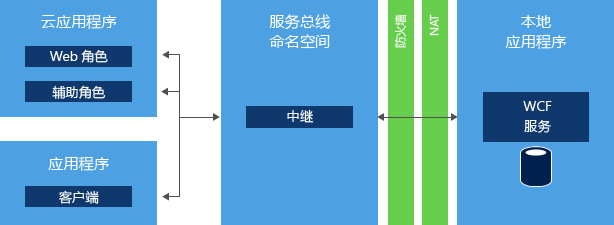
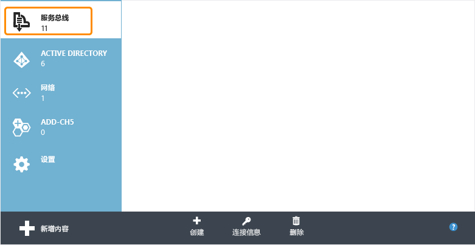
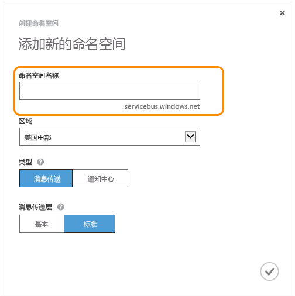
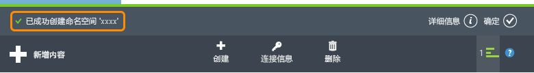
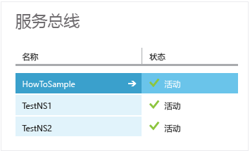
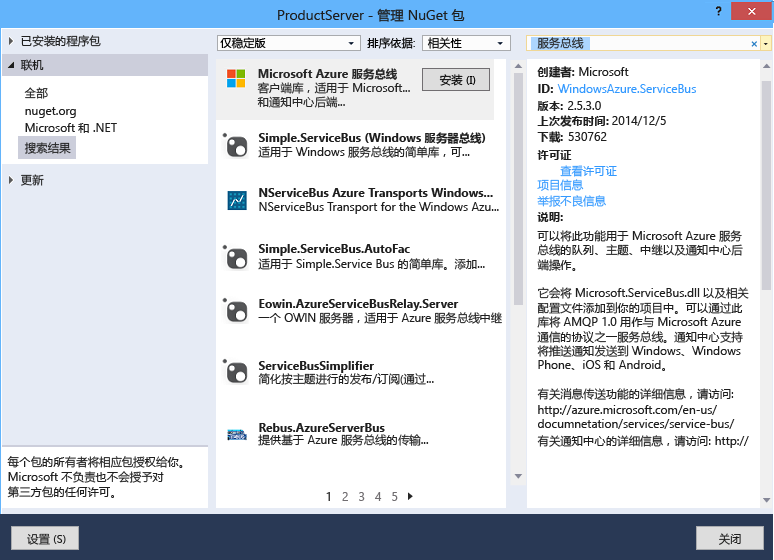

<properties
	pageTitle="如何通过 .NET 使用服务总线中继 | Azure"
	description="了解如何使用 Azure 服务总线中继服务连接两个托管于不同位置的应用程序。"
	services="service-bus"
	documentationCenter=".net"
	authors="sethmanheim"
	manager="timlt"
	editor=""/>

<tags
	ms.service="service-bus"
	ms.date="05/06/2016"
	wacn.date="06/21/2016"/>


# 如何使用 Azure 服务总线中继服务

本文介绍如何使用服务总线中继服务。相关示例用 C# 编写并使用服务总线程序集中包含的 Windows Communication Foundation (WCF) API 及扩展。有关服务总线中继的详细信息，请参阅[服务总线中继消息传送](/documentation/articles/service-bus-relay-overview/)概述。

[AZURE.INCLUDE [create-account-note](../includes/create-account-note.md)]

## 什么是服务总线中继？

[服务总线“中继”服务](/documentation/articles/service-bus-relay-overview/)使你能构建可在 Azure 数据中心和你自己的本地企业环境中运行的混合应用程序。服务总线中继可简化这一过程，它允许你安全地向公有云公开位于企业网络内的 Windows Communication Foundation (WCF) 服务，而无需打开防火墙连接，也无需对企业网络基础结构进行彻底的更改。



服务总线中继使你能够在现有企业环境中托管 WCF 服务。然后，你可以将侦听传入会话和请求这些 WCF 服务的任务委托给在 Azure 内运行的服务总线服务。这使你能够向 Azure 中运行的应用程序代码或者向移动工作者或 Extranet 合作伙伴环境公开这些服务。服务总线允许你精确、安全地控制谁可以访问这些服务。它提供了一种强大且安全的方式，从你的现有企业解决方案公开应用程序功能和数据并从云中利用这些功能和数据。

本文演示如何使用服务总线中继创建 WCF Web 服务，并使用 TCP 通道绑定（可实现双方之间安全的对话）公开该服务。

## 创建服务命名空间

若要开始在 Azure 中使用服务总线中继，必须先创建一个命名空间。命名空间提供了用于对应用程序中的 Service Bus 资源进行寻址的范围容器。

创建服务命名空间：

1.  登录到 [Azure 经典门户][]。

2.  在门户的左侧导航窗格中，单击“服务总线”。

3.  在门户的下方窗格中，单击“创建”。

	

4.  在“添加新命名空间”对话框中，输入命名空间名称。系统会立即检查该名称是否可用。

	


5.  在确保命名空间名称可用后，选择应承载您的命名空间的国家或地区（确保使用在其中部署计算资源的同一国家/地区）。

	> [AZURE.IMPORTANT] 选取要选择用于部署应用程序的“相同区域”。这将为您提供最佳性能。

6.	将对话框中的其他字段保留为其默认值（“消息传送”和“标准”层），然后单击复选标记。系统现已创建命名空间并已将其启用。您可能需要等待几分钟，因为系统将为您的帐户配置资源。

	

	你创建的命名空间随后将显示在门户中，然后要花费一段时间来激活。请等到状态变为“活动”后再继续。

## 获取命名空间的默认管理凭据

若要对新的命名空间执行管理操作（如创建中继连接），必须为该命名空间配置共享访问签名 (SAS) 授权规则。有关 SAS 的详细信息，请参阅[使用服务总线进行共享访问签名身份验证][]。

1.  在左侧导航窗格中，单击“服务总线”节点以显示可用命名空间的列表。

	

2.  在显示的列表中双击刚刚创建的命名空间的名称。

	

3.  单击页面顶部的“配置”选项卡。

4.  如果预配了服务总线命名空间，默认情况下，将创建 **SharedAccessAuthorizationRule**，其中，**KeyName** 设置为 **RootManageSharedAccessKey**。此页将显示该密钥，以及默认规则的主密钥和辅助密钥。

## 获取服务总线 NuGet 包

[服务总线 NuGet 包](https://www.nuget.org/packages/WindowsAzure.ServiceBus)是获取服务总线 API 并为应用程序配置所有服务总线依赖项的最简单的方法。要在你的应用程序中安装 NuGet 包，请执行以下操作：

1.  在解决方案资源管理器中，右键单击“引用”，然后单击“管理 NuGet 包”。
2.  搜索“服务总线”并选择“Azure 服务总线”项。单击“安装”以完成安装，然后关闭以下对话框。

	
  

## 使用服务总线通过 TCP 公开和使用 SOAP Web 服务

若要公开现有 WCF SOAP Web 服务以供外部使用，你必须更改服务绑定和地址。这可能需要更改你的配置文件或者可能需要更改代码，具体取决于你如何设置和配置 WCF 服务。请注意，WCF 允许你对同一服务使用多个网络终结点，因此你可以在添加服务总线终结点以便进行外部访问的同时保留现有内部终结点。

在此任务中，你将构建一个简单的 WCF 服务并向其添加服务总线侦听程序。此练习假定你熟悉 Visual Studio，因此不演练创建项目的所有详细信息，而是侧重于代码。

在开始下面的步骤之前，请完成以下过程以设置你的环境：

1.  在 Visual Studio 中，在解决方案内创建一个包含以下两个项目的控制台应用程序：“客户端”和“服务”。
2.  向这两个项目添加 Azure Service Bus NuGet 包。这会向您的项目添加所有必需的程序集引用。

### 如何创建服务

首先，创建该服务本身。任何 WCF 服务都包含至少三个不同部分：

-   描述交换哪些信息以及将调用哪些操作的协定的定义。 
-   上述协定的实施方案。
-   托管 WCF 服务并公开多个终结点的主机。

本部分中的代码示例涵盖了其中的每个组成部分。

协定定义用于添加两个数字并返回相应结果的单个操作 `AddNumbers`。`IProblemSolverChannel` 接口使客户端能够更轻松地管理代理生存期。创建这样一个接口被认为是最佳实践。最好将此协定定义放入单独的文件中，以便可从你的“客户端”和“服务”两个项目中引用该文件，但也可以将代码复制到这两个项目中。

```
using System.ServiceModel;

[ServiceContract(Namespace = "urn:ps")]
interface IProblemSolver
{
    [OperationContract]
    int AddNumbers(int a, int b);
}

interface IProblemSolverChannel : IProblemSolver, IClientChannel {}
```

协定到位后，实施起来就很简单了。

```
class ProblemSolver : IProblemSolver
{
    public int AddNumbers(int a, int b)
    {
        return a + b;
    }
}
```

### 以编程方式配置服务主机

协定和实施完成后，你现在就可以托管服务了。托管发生在 [System.ServiceModel.ServiceHost](https://msdn.microsoft.com/zh-cn/library/azure/system.servicemodel.servicehost.aspx) 对象内，该对象负责管理服务实例并托管侦听消息的终结点。以下代码使用常规的本地终结点和服务总线终结点来配置服务，以便并列展示内部和外部终结点的外观。将字符串 *namespace* 替换为你的命名空间名称，并将 *yourKey* 替换为你在前面的设置步骤中获取的 SAS 密钥。

```
ServiceHost sh = new ServiceHost(typeof(ProblemSolver));

sh.AddServiceEndpoint(
   typeof (IProblemSolver), new NetTcpBinding(),
   "net.tcp://localhost:9358/solver");

sh.AddServiceEndpoint(
   typeof(IProblemSolver), new NetTcpRelayBinding(),
   ServiceBusEnvironment.CreateServiceUri("sb", "namespace", "solver"))
    .Behaviors.Add(new TransportClientEndpointBehavior {
          TokenProvider = TokenProvider.CreateSharedAccessSignatureTokenProvider("RootManageSharedAccessKey", "yourKey")});

sh.Open();

Console.WriteLine("Press ENTER to close");
Console.ReadLine();

sh.Close();
```

在本示例中，你将创建两个位于同一协定实施中的终结点。一个是本地的，一个通过服务总线进行投影。两者之间的主要区别是绑定；本地终结点使用 [NetTcpBinding](https://msdn.microsoft.com/zh-cn/library/azure/system.servicemodel.nettcpbinding.aspx)，而服务总线终结点和地址使用 [NetTcpRelayBinding](https://msdn.microsoft.com/zh-cn/library/azure/microsoft.servicebus.nettcprelaybinding.aspx)。本地终结点有一个使用不同端口的本地网络地址。服务总线终结点有一个由字符串 `sb`、你的命名空间名称、路径“solver”组成的终结点地址。 这将生成 URI `sb://[serviceNamespace].servicebus.chinacloudapi.cn/solver`，将服务终结点标识为具有完全限定的外部 DNS 名称的服务总线 TCP 终结点。如果将替换上述占位符的代码放入**服务**应用程序的 `Main` 函数中，你将会获得一个可正常运行的服务。如果你希望你的服务专门侦听服务总线，请删除本地终结点声明。

### 在 App.config 文件中配置服务主机

你还可以使用 App.config 文件配置主机。在此情况下，服务托管代码如以下示例所示。

```
ServiceHost sh = new ServiceHost(typeof(ProblemSolver));
sh.Open();
Console.WriteLine("Press ENTER to close");
Console.ReadLine();
sh.Close();
```

终结点定义将移到 App.config 文件中。请注意，NuGet 包已向 App.config 文件添加一系列定义，这些定义是服务总线必需的配置扩展。以下示例（与前面的代码完全等效）应该紧靠在 **system.serviceModel** 元素的下面。此代码示例假设你的项目 C# 命名空间名为“Service”。将占位符替换为你的服务总线服务命名空间和密钥。

```
<services>
    <service name="Service.ProblemSolver">
        <endpoint contract="Service.IProblemSolver"
                  binding="netTcpBinding"
                  address="net.tcp://localhost:9358/solver"/>
        <endpoint contract="Service.IProblemSolver"
                  binding="netTcpRelayBinding"
                  address="sb://namespace.servicebus.chinacloudapi.cn/solver"
                  behaviorConfiguration="sbTokenProvider"/>
    </service>
</services>
<behaviors>
    <endpointBehaviors>
        <behavior name="sbTokenProvider">
            <transportClientEndpointBehavior>
                <tokenProvider>
                    <sharedAccessSignature keyName="RootManageSharedAccessKey" key="yourKey" />
                </tokenProvider>
            </transportClientEndpointBehavior>
        </behavior>
    </endpointBehaviors>
</behaviors>
```

进行这些更改后，该服务将像以前一样启动，但具有两个活动终结点：一个位于本地，一个在云中侦听。

### 创建客户端

#### 以编程方式配置客户端

若要使用该服务，你可以使用 [ChannelFactory](https://msdn.microsoft.com/zh-cn/library/system.servicemodel.channelfactory.aspx) 对象构造 WCF 客户端。服务总线使用通过 ACS 实现的基于令牌的安全模型。[TokenProvider](https://msdn.microsoft.com/zh-cn/library/azure/microsoft.servicebus.tokenprovider.aspx) 类代表具有内置工厂方法的安全令牌提供程序，这些方法可返回一些众所周知的令牌提供程序。以下示例使用 [CreateSharedAccessSignatureTokenProvider](https://msdn.microsoft.com/zh-cn/library/azure/microsoft.servicebus.tokenprovider.createsharedaccesssignaturetokenprovider.aspx) 方法来处理相应 SAS 令牌的获取。名称和密钥是根据上一部分所述从门户获取的凭据。

首先，在你的客户端项目中引用服务中的 `IProblemSolver` 约定代码或将其复制到你的客户端项目中。

然后，替换客户端的 `Main` 方法中的代码，再次将占位符文本替换为服务总线命名空间和 SAS 密钥。

```
var cf = new ChannelFactory<IProblemSolverChannel>(
    new NetTcpRelayBinding(),
    new EndpointAddress(ServiceBusEnvironment.CreateServiceUri("sb", "namespace", "solver")));

cf.Endpoint.Behaviors.Add(new TransportClientEndpointBehavior
            { TokenProvider = TokenProvider.CreateSharedAccessSignatureTokenProvider("RootManageSharedAccessKey","yourKey") });

using (var ch = cf.CreateChannel())
{
    Console.WriteLine(ch.AddNumbers(4, 5));
}
```

现在你可以生成客户端和服务，运行它们（首先运行服务），客户端将调用该服务并输出 **9**。 你可以在不同计算机上，甚至跨网络运行客户端和服务器，通信仍将进行。客户端代码还可以在云中或在本地运行。

#### 在 App.config 文件中配置客户端

以下代码介绍了如何使用 App.config 文件配置客户端。

```
var cf = new ChannelFactory<IProblemSolverChannel>("solver");
using (var ch = cf.CreateChannel())
{
    Console.WriteLine(ch.AddNumbers(4, 5));
}
```

终结点定义将移到 App.config 文件中。以下示例（与前面列出的代码相同）应该紧靠在 **system.serviceModel** 元素的下面。在此，与之前一样，你必须将占位符替换为服务总线命名空间和 SAS 密钥。

```
<client>
    <endpoint name="solver" contract="Service.IProblemSolver"
              binding="netTcpRelayBinding"
              address="sb://namespace.servicebus.chinacloudapi.cn/solver"
              behaviorConfiguration="sbTokenProvider"/>
</client>
<behaviors>
    <endpointBehaviors>
        <behavior name="sbTokenProvider">
            <transportClientEndpointBehavior>
                <tokenProvider>
                    <sharedAccessSignature keyName="RootManageSharedAccessKey" key="yourKey" />
                </tokenProvider>
            </transportClientEndpointBehavior>
        </behavior>
    </endpointBehaviors>
</behaviors>
```

## 后续步骤

现在，你已了解服务总线中继服务的基础知识，请访问以下链接以了解更多信息。

- [服务总线中继消息传送概述](/documentation/articles/service-bus-relay-overview/)
- [Azure 服务总线体系结构概述](/documentation/articles/service-bus-fundamentals-hybrid-solutions/)
- 从 [Azure 示例][]下载服务总线示例，或参阅[服务总线示例概述][]。

  [Azure 经典门户]: http://manage.windowsazure.cn
  [使用服务总线进行共享访问签名身份验证]: /documentation/articles/service-bus-shared-access-signature-authentication/
  [Azure 示例]: https://code.msdn.microsoft.com/site/search?query=service%20bus&f%5B0%5D.Value=service%20bus&f%5B0%5D.Type=SearchText&ac=2
  [服务总线示例概述]: /documentation/articles/service-bus-samples/

<!---HONumber=Mooncake_0104_2016-->