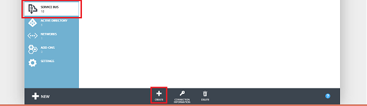
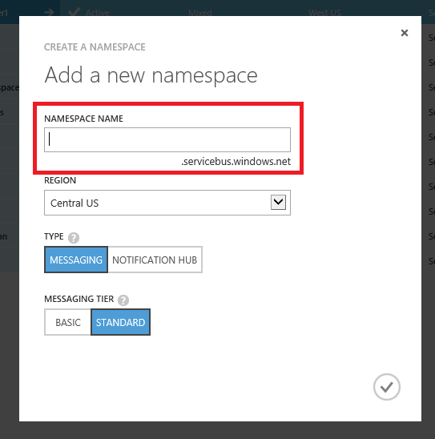
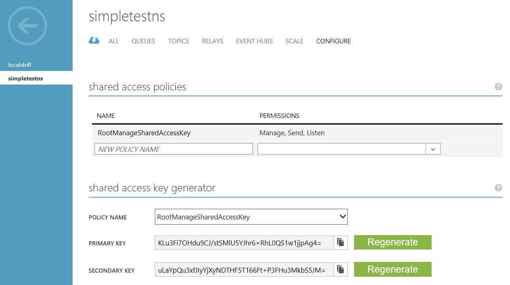

<properties
    pageTitle="服务总线队列入门 | Azure"
    description="如何编写用于服务总线消息传送的 C# 控制台应用程序"
    services="service-bus"
    documentationCenter=".net"
    authors="jtaubensee"
    manager="timlt"
    editor=""/>

<tags
    ms.service="service-bus"
    ms.date="11/30/2016"
    wacn.date="01/23/2017"/>

# 服务总线队列入门

[AZURE.INCLUDE [service-bus-selector-queues](../../includes/service-bus-selector-queues.md)]

## 将要完成的任务

在本教程中我们将完成以下任务：

1. 使用 Azure 门户创建服务总线命名空间。

2. 使用 Azure 门户创建服务总线消息传递队列。

3. 编写一个控制台应用程序用于发送消息。

4. 编写一个控制台应用程序用于接收消息。

## 先决条件

1. [Visual Studio 2013 或 Visual Studio 2015](http://www.visualstudio.com)。本教程中的示例使用 Visual Studio 2015。

2. Azure 订阅。

[AZURE.INCLUDE [create-account-note](../../includes/create-account-note.md)]

## 使用 Azure 门户创建命名空间

如果你已创建服务总线命名空间，请跳转到[使用 Azure 门户创建队列](#2-create-a-queue-using-the-azure-portal)部分。

创建命名空间：

1.  登录到 [Azure 经典管理门户](https://manage.windowsazure.cn/)。

2.  在门户的左侧导航窗格中，单击“服务总线”。

3.  在门户的下方窗格中，单击“创建”。

	

4.  在“添加新命名空间”对话框中，输入命名空间名称。系统会立即检查该名称是否可用。

	

5.  在确保命名空间名称可用后，选择应承载你的命名空间的国家或地区（确保使用在其中部署计算资源的同一国家/地区）。

	重要说明：选取要部署应用程序的**相同区域**。这将为你提供最佳性能。

6. 	将对话框中的其他字段保留其默认值（“消息传递”和“标准层”），然后单击复选标记。系统现已创建命名空间并已将其启用。您可能需要等待几分钟，因为系统将为您的帐户配置资源。

创建的命名空间将花费一段时间来激活，然后显示在 Azure 门户中。请等到命名空间状态变为“活动”后再继续操作。

## 获取命名空间的默认管理凭据

若要在新命名空间上执行管理操作（如创建队列），则必须获取该命名空间的管理凭据。可以从门户中获取这些凭据。

1.  在左侧导航窗格中，单击“Service Bus”节点以显示可用命名空间的列表：

	

2.  从显示的列表中单击你刚刚创建的命名空间。

3.  单击“配置”以查看命名空间的共享访问策略。

	

4.  记下主密钥，或将其复制到剪贴板。


## <a name="2-create-a-queue-using-the-azure-portal"></a> 使用 Azure 门户创建队列

如果你已创建服务总线队列，请跳转到[将消息发送到队列](#3-send-messages-to-the-queue)部分。


## <a name="3-send-messages-to-the-queue"></a> 将消息发送到队列

为了将消息发送到队列中，我们将使用 Visual Studio 编写一个 C# 控制台应用程序。

### 创建控制台应用程序

1. 启动 Visual Studio 并创建新的控制台应用程序。

### 添加服务总线 NuGet 包

1. 右键单击新创建的项目，然后选择“管理 NuGet 包”。

2. 单击“浏览”选项卡，然后搜索“Microsoft Azure 服务总线”，并选择“Microsoft Azure 服务总线”项。单击“安装”以完成安装，然后关闭此对话框。

    ![选择 NuGet 包][nuget-pkg]

### 编写一些代码以向队列发送消息

1. 在 Program.cs 文件的顶部添加以下 using 语句。

    ```
    using Microsoft.ServiceBus.Messaging;
    ```
    
2. 将以下代码添加到 `Main` 方法，并将 **connectionString** 变量设置为创建命名空间时获取的连接字符串，以及将 **queueName** 设置为创建队列时使用的队列名称。

    ```
    var connectionString = "<Your connection string>";
    var queueName = "<Your queue name>";
  
    var client = QueueClient.CreateFromConnectionString(connectionString, queueName);
    var message = new BrokeredMessage("This is a test message!");
    client.Send(message);
    ```

    Program.cs 文件的内容如下所示。

    ```
    using System;
    using Microsoft.ServiceBus.Messaging;

    namespace GettingStartedWithQueues
    {
        class Program
        {
            static void Main(string[] args)
            {
                var connectionString = "<Your connection string>";
                var queueName = "<Your queue name>";

                var client = QueueClient.CreateFromConnectionString(connectionString, queueName);
                var message = new BrokeredMessage("This is a test message!");

                client.Send(message);
            }
        }
    }
    ```
  
3. 运行该程序，并检查 Azure 经典管理门户。请注意，**队列长度**值现在应为 1。
    
      ![队列长度][queue-length-send]
    
## 从队列接收消息

1. 创建新的控制台应用程序并添加对服务总线 NuGet 包的引用，类似于上面的发送应用程序。

2. 在 Program.cs 文件顶部添加以下 `using` 语句。
  
    ```
    using Microsoft.ServiceBus.Messaging;
    ```
  
3. 将以下代码添加到 `Main` 方法，并将 **connectionString** 变量设置为创建命名空间时获取的连接字符串，以及将 **queueName** 设置为创建队列时使用的队列名称。

    ```
    var connectionString = "";
    var queueName = "samplequeue";
  
    var client = QueueClient.CreateFromConnectionString(connectionString, queueName);
  
    client.OnMessage(message =>
    {
      Console.WriteLine(String.Format("Message body: {0}", message.GetBody<String>()));
      Console.WriteLine(String.Format("Message id: {0}", message.MessageId));
    });
  
    Console.ReadLine();
    ```

	Program.cs 文件的内容如下所示：

    ```
    using System;
    using Microsoft.ServiceBus.Messaging;
  
    namespace GettingStartedWithQueues
    {
      class Program
      {
        static void Main(string[] args)
        {
          var connectionString = "";
          var queueName = "samplequeue";
  
          var client = QueueClient.CreateFromConnectionString(connectionString, queueName);
  
          client.OnMessage(message =>
          {
            Console.WriteLine(String.Format("Message body: {0}", message.GetBody<String>()));
            Console.WriteLine(String.Format("Message id: {0}", message.MessageId));
          });
  
          Console.ReadLine();
        }
      }
    }
    ```
  
4. 运行该程序，并检查门户。请注意，**队列长度**值现在应为 0。

    ![队列长度][queue-length-receive]
  
祝贺你！ 你已创建队列、发送和接收消息。

## 后续步骤

签出 [GitHub 存储库](https://github.com/Azure-Samples/azure-servicebus-messaging-samples)，该存储库中包含演示 Azure 服务总线消息传送的一些更高级功能的示例。

<!--Image references-->

[nuget-pkg]: ./media/service-bus-dotnet-get-started-with-queues/nuget-package.png
[queue-length-send]: ./media/service-bus-dotnet-get-started-with-queues/queue-length-send.png
[queue-length-receive]: ./media/service-bus-dotnet-get-started-with-queues/queue-length-receive.png


<!--Reference style links - using these makes the source content way more readable than using inline links-->

[github-samples]: https://github.com/Azure-Samples/azure-servicebus-messaging-samples


<!---HONumber=Mooncake_0718_2016-->