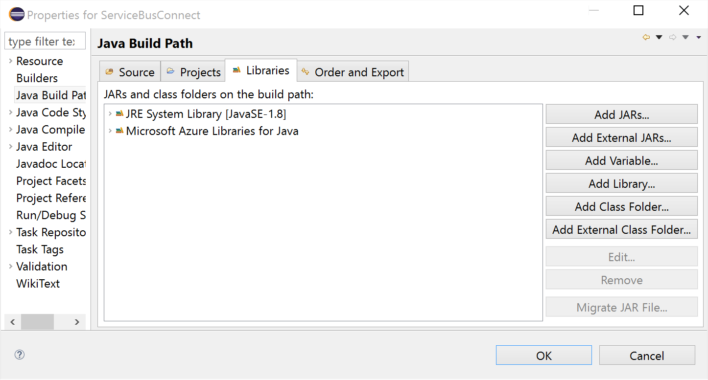

<properties
    pageTitle="如何通过 Java 使用 Azure 服务总线主题 | Azure"
    description="了解如何在 Azure 中使用服务总线主题和订阅。 代码示例是针对 Java 应用程序编写的。"
    services="service-bus"
    documentationCenter="java"
    author="sethmanheim"
    manager="timlt"
    editor="" />
<tags
    ms.assetid="63d6c8bd-8a22-4292-befc-545ffb52e8eb"
    ms.service="service-bus"
    ms.workload="tbd"
    ms.tgt_pltfrm="na"
    ms.devlang="Java"
    ms.topic="article"
    ms.date="03/23/2017"
    ms.author="sethm"
    wacn.date="05/22/2017"
    ms.translationtype="Human Translation"
    ms.sourcegitcommit="8fd60f0e1095add1bff99de28a0b65a8662ce661"
    ms.openlocfilehash="293ad73dd166a0bee1b95ff9f6ada599dcaa71a5"
    ms.lasthandoff="05/12/2017" />

# 如何使用服务总线主题和订阅

[AZURE.INCLUDE [service-bus-selector-topics](../../includes/service-bus-selector-topics.md)]

本指南介绍如何使用服务总线主题和订阅。 这些示例采用 Java 编写，并且使用了 [Azure SDK for Java][Azure SDK for Java]。 涉及的应用场景包括**创建主题和订阅**、**创建订阅筛选器**、**将消息发送到主题**、**从订阅接收消息**以及**删除主题和订阅**。

## 什么是服务总线主题和订阅？
服务总线主题和订阅支持 *发布/订阅* 消息通信模型。 在使用主题和订阅时，分布式应用程序的组件不会直接相互通信，而是通过充当中介的主题交换消息。

与每条消息由单个使用方处理的 Service Bus 队列相比，主题和订阅通过发布/订阅模式提供“一对多”通信方式。 可向一个主题注册多个订阅。 当消息发送到主题时，每个订阅会分别对该消息进行处理。

主题订阅类似于接收发送至该主题的消息副本的虚拟队列。你可以选择基于每个订阅注册主题的筛选规则，这样就可以筛选/限制哪些主题订阅接收发送至某个主题的哪些消息。

利用 Service Bus 主题和订阅，你可以进行扩展以处理跨大量用户和应用程序的许多消息。

## 创建服务命名空间
若要开始在 Azure 中使用服务总线主题和订阅，必须先创建一个命名空间，该命名空间提供一个范围容器，用于对应用程序中的服务总线资源进行寻址。

创建命名空间：

[AZURE.INCLUDE [service-bus-create-namespace-portal](../../includes/service-bus-create-namespace-portal.md)]

## 配置应用程序以使用 Service Bus
在生成本示例之前，请确保已安装 [Azure SDK for Java][Azure SDK for Java]。 如果使用 Eclipse，则可以安装包含 Azure SDK for Java 的[用于 Eclipse 的 Azure 工具包][Azure Toolkit for Eclipse]。 然后，你可以将 **Microsoft Azure Libraries for Java** 添加到你的项目：

  

将以下 `import` 语句添加到 Java 文件顶部：

		import com.microsoft.windowsazure.services.servicebus.*;
		import com.microsoft.windowsazure.services.servicebus.models.*;
		import com.microsoft.windowsazure.core.*;
		import javax.xml.datatype.*;

向您的生成路径添加 Azure Libraries for Java，并将其包含在您的项目部署程序集中。

## 创建主题
服务总线主题的管理操作可通过 **ServiceBusContract** 类执行。 **ServiceBusContract** 对象是使用封装了 SAS 令牌及用于管理其权限的适当配置构造的，而 **ServiceBusContract** 类是与 Azure 进行通信的单一点。

**ServiceBusService** 类提供了创建、枚举和删除主题的方法。以下示例演示了如何通过名为 `HowToSample` 的命名空间，使用 **ServiceBusService** 对象创建名为 `TestTopic` 的主题：

    Configuration config =
    	ServiceBusConfiguration.configureWithSASAuthentication(
          "HowToSample",
          "RootManageSharedAccessKey",
          "SAS_key_value",
          ".servicebus.chinacloudapi.cn"
          );

	ServiceBusContract service = ServiceBusService.create(config);
    TopicInfo topicInfo = new TopicInfo("TestTopic");
	try  
	{
    	CreateTopicResult result = service.createTopic(topicInfo);
	}
	catch (ServiceException e) {
		System.out.print("ServiceException encountered: ");
	    System.out.println(e.getMessage());
		System.exit(-1);
	}

**TopicInfo** 上有一些方法可设置主题的属性（例如，将默认的生存时间 (TTL) 值设置为应用于发送到主题的消息）。以下示例演示了如何创建最大空间为 5 GB 且名为 `TestTopic` 的主题：

    long maxSizeInMegabytes = 5120;  
	TopicInfo topicInfo = new TopicInfo("TestTopic");  
    topicInfo.setMaxSizeInMegabytes(maxSizeInMegabytes);
    CreateTopicResult result = service.createTopic(topicInfo);

请注意，可以对 **ServiceBusContract** 对象使用 **listTopics** 方法来检查具有指定名称的主题在某个服务命名空间中是否已存在。

## 创建订阅

主题订阅也是使用 **ServiceBusService** 类创建的。订阅已命名，并且具有一个限制传递到订阅的虚拟队列的消息集的可选筛选器。

### 创建具有默认 (MatchAll) 筛选器的订阅

**MatchAll** 筛选器是默认筛选器，在创建新订阅时未指定筛选器的情况下使用。使用 **MatchAll** 筛选器时，发布到主题的所有消息都将置于订阅的虚拟队列中。以下示例创建名为“AllMessages”的订阅，并使用默认的 **MatchAll** 筛选器。

    SubscriptionInfo subInfo = new SubscriptionInfo("AllMessages");
    CreateSubscriptionResult result = 
        service.createSubscription("TestTopic", subInfo);

### 创建具有筛选器的订阅

还可以创建筛选器，以确定发送到主题的哪些消息应该在特定主题订阅中显示。

订阅支持的最灵活的筛选器类型是 [SqlFilter][SqlFilter]，它实现了一部分 SQL92 功能。 SQL 筛选器将对发布到主题的消息的属性进行操作。 有关可用于 SQL 筛选器的表达式的更多详细信息，请参阅 [SqlFilter.SqlExpression][SqlFilter.SqlExpression] 语法。

以下示例创建了一个名为 `HighMessages` 的订阅，其包含的 [SqlFilter][SqlFilter] 对象只选择自定义 **MessageNumber** 属性大于 3 的消息：

		// Create a "HighMessages" filtered subscription  
		SubscriptionInfo subInfo = new SubscriptionInfo("HighMessages");
		CreateSubscriptionResult result = service.createSubscription("TestTopic", subInfo);
		RuleInfo ruleInfo = new RuleInfo("myRuleGT3");
		ruleInfo = ruleInfo.withSqlExpressionFilter("MessageNumber > 3");
		CreateRuleResult ruleResult = service.createRule("TestTopic", "HighMessages", ruleInfo);
		// Delete the default rule, otherwise the new rule won't be invoked.
		service.deleteRule("TestTopic", "HighMessages", "$Default");

类似地，以下示例创建一个名为 `LowMessages` 的订阅，其包含的 [SqlFilter][SqlFilter] 对象只选择 **MessageNumber** 属性小于或等于 3 的消息：

		// Create a "LowMessages" filtered subscription
		SubscriptionInfo subInfo = new SubscriptionInfo("LowMessages");
		CreateSubscriptionResult result = service.createSubscription("TestTopic", subInfo);
		RuleInfo ruleInfo = new RuleInfo("myRuleLE3");
		ruleInfo = ruleInfo.withSqlExpressionFilter("MessageNumber <= 3");
		CreateRuleResult ruleResult = service.createRule("TestTopic", "LowMessages", ruleInfo);
		// Delete the default rule, otherwise the new rule won't be invoked.
		service.deleteRule("TestTopic", "LowMessages", "$Default");

现在，当消息发送到 `TestTopic` 时，它始终会传送给订阅了 `AllMessages` 订阅的接收者，并且选择性地传送给订阅了 `HighMessages` 和 `LowMessages` 订阅的接收者（具体取决于消息内容）。

## 将消息发送到主题
将消息发送到服务总线主题，应用程序获得 **ServiceBusContract** 对象。 以下代码演示了如何将消息发送到之前在 `HowToSample` 命名空间内创建的 `TestTopic` 主题：

		BrokeredMessage message = new BrokeredMessage("MyMessage");
		service.sendTopicMessage("TestTopic", message);

发送到服务总线主题的消息是 [BrokeredMessage][BrokeredMessage] 类的实例。 [BrokeredMessage][BrokeredMessage]* 对象包含一组标准方法（如 **setLabel** 和 **TimeToLive**）、一个用来保存特定于应用程序的自定义属性的字典，以及大量的任意应用程序数据。 应用程序可通过将任何可序列化对象传入到 [BrokeredMessage][BrokeredMessage] 的构造函数来设置消息的正文，然后系统将使用适当的 **DataContractSerializer** 对对象进行序列化操作。 或者，也可以提供 **java.io.InputStream**。

以下示例演示了如何将五条测试消息发送到我们在前面的代码段中获得的 `TestTopic` **MessageSender** 。
请注意每条消息的 **MessageNumber** 属性值如何随循环迭代而变化（这将确定接收消息的订阅）：

		for (int i=0; i<5; i++)  {
		// Create message, passing a string message for the body
		BrokeredMessage message = new BrokeredMessage("Test message " + i);
		// Set some additional custom app-specific property
		message.setProperty("MessageNumber", i);
		// Send message to the topic
		service.sendTopicMessage("TestTopic", message);
		}

服务总线主题在标准层中支持的最大消息容量为 256 KB。标头最大为 64 KB，其中包括标准和自定义应用程序属性。一个主题中包含的消息数量不受限制，但消息的总大小受限制。此主题大小是在创建时定义的，上限为 5 GB。

## 如何从订阅接收消息
若要从订阅接收消息，请使用 **ServiceBusContract** 对象。 收到的消息可在两种不同模式下工作：**ReceiveAndDelete** 和 **PeekLock**。

当使用 **ReceiveAndDelete** 模式时，接收是一个单次操作。即，当服务总线收到对消息的读取请求时，它会将该消息标记为“已使用”并将其返回给应用程序。 **ReceiveAndDelete** 模式是最简单的模式，最适合在发生故障时应用程序允许不处理消息的情况。 为了理解这一点，可以考虑这样一种情形：使用方发出接收请求，但在处理该请求前发生了崩溃。 由于服务总线会将消息标记为“已使用”，因此当应用程序重启并重新开始使用消息时，它会遗漏在发生崩溃前使用的消息。

在 **PeekLock** 模式下，接收变成了一个两阶段操作，从而有可能支持无法允许遗漏消息的应用程序。 当 Service Bus 收到请求时，它会查找下一条要使用的消息，锁定该消息以防其他使用者接收，然后将该消息返回到应用程序。 应用程序完成消息处理（或可靠地存储消息以供将来处理）后，将通过对收到的消息调用 **Delete** 完成接收过程的第二个阶段。 服务总线发现 **Delete** 调用时，它会将消息标记为“已使用”并将其从主题中删除。

以下示例演示了如何使用 **PeekLock** 模式（非默认模式）接收和处理消息。以下示例执行一个循环并处理“HighMessages”订阅中的消息，然后在处理完所有消息后退出循环（或者，可将其设置为等待新消息）。

		try
		{
			ReceiveMessageOptions opts = ReceiveMessageOptions.DEFAULT;
			opts.setReceiveMode(ReceiveMode.PEEK_LOCK);

			while(true)  {
			    ReceiveSubscriptionMessageResult  resultSubMsg =
			        service.receiveSubscriptionMessage("TestTopic", "HighMessages", opts);
			    BrokeredMessage message = resultSubMsg.getValue();
			    if (message != null && message.getMessageId() != null)
			    {
				    System.out.println("MessageID: " + message.getMessageId());
				    // Display the topic message.
				    System.out.print("From topic: ");
				    byte[] b = new byte[200];
				    String s = null;
				    int numRead = message.getBody().read(b);
				    while (-1 != numRead)
		            {
		                s = new String(b);
		                s = s.trim();
		                System.out.print(s);
		                numRead = message.getBody().read(b);
				    }
		            System.out.println();
				    System.out.println("Custom Property: " +
				        message.getProperty("MessageNumber"));
				    // Delete message.
				    System.out.println("Deleting this message.");
				    service.deleteMessage(message);
			    }  
			    else  
			    {
			        System.out.println("Finishing up - no more messages.");
			        break;
			        // Added to handle no more messages.
			        // Could instead wait for more messages to be added.
			    }
		    }
		}
		catch (ServiceException e) {
		    System.out.print("ServiceException encountered: ");
		    System.out.println(e.getMessage());
		    System.exit(-1);
		}
		catch (Exception e) {
		    System.out.print("Generic exception encountered: ");
		    System.out.println(e.getMessage());
		    System.exit(-1);
		}

## 如何处理应用程序崩溃和不可读消息
Service Bus 提供了相关功能来帮助你轻松地从应用程序错误或消息处理问题中恢复。 如果接收方应用程序出于某种原因无法处理消息，则其可以对收到的消息调用 **unlockMessage** 方法（而不是 **deleteMessage** 方法）。 这将导致服务总线解锁主题中的消息并使它能够由同一使用方应用程序或其他使用方应用程序再次接收。

还存在与主题中已锁定消息关联的超时，并且如果应用程序无法在锁定超时到期之前处理消息（例如，如果应用程序崩溃），则服务总线将自动解锁该消息并使其可再次被接收。

如果在处理消息之后，发出 **deleteMessage** 请求之前，应用程序发生崩溃，该消息将在应用程序重新启动时重新传送给它。 此情况通常称作**至少处理一次**，即每条消息将至少被处理一次，但在某些情况下，同一消息可能会被重新传送。 如果方案无法容忍重复处理，则应用程序开发人员应向其应用程序添加更多逻辑以处理重复消息传送。 通常可使用消息的 **getMessageId** 方法实现此操作，这在多个传送尝试中保持不变。

## 删除主题和订阅
删除主题和订阅的主要方法是使用 **ServiceBusContract** 对象。 删除某个主题也会删除向该主题注册的所有订阅。 也可以单独删除订阅。

    // Delete subscriptions
    service.deleteSubscription("TestTopic", "AllMessages");
    service.deleteSubscription("TestTopic", "HighMessages");
    service.deleteSubscription("TestTopic", "LowMessages");

    // Delete a topic
    service.deleteTopic("TestTopic");

## 后续步骤
现在，已了解服务总线队列的基础知识，请参阅[服务总线队列、主题和订阅][Service Bus queues, topics, and subscriptions]以了解详细信息。

  [Azure SDK for Java]: /develop/java/
  [Azure Toolkit for Eclipse]: /documentation/articles/azure-toolkit-for-eclipse/
  [Azure classic portal]: http://manage.windowsazure.cn
  [服务总线队列、主题和订阅]: /documentation/articles/service-bus-queues-topics-subscriptions/
  [SqlFilter]: https://docs.microsoft.com/dotnet/api/microsoft.servicebus.messaging.sqlfilter 
  [SqlFilter.SqlExpression]: https://docs.microsoft.com/dotnet/api/microsoft.servicebus.messaging.sqlfilter#Microsoft_ServiceBus_Messaging_SqlFilter_SqlExpression
  [BrokeredMessage]: https://docs.microsoft.com/dotnet/api/microsoft.servicebus.messaging.brokeredmessage
  [0]: ./media/service-bus-java-how-to-use-topics-subscriptions/sb-queues-13.png
  [2]: ./media/service-bus-java-how-to-use-topics-subscriptions/sb-queues-04.png
  [3]: ./media/service-bus-java-how-to-use-topics-subscriptions/sb-queues-09.png

<!---HONumber=Mooncake_Quality_Review_1230_2016-->
<!--Update_Description:update meta properties-->