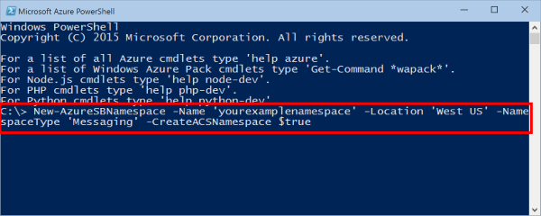
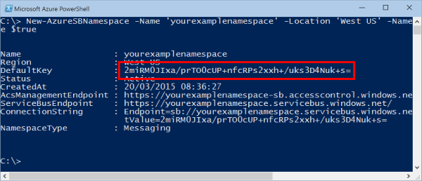

<properties
	pageTitle="如何通过 Ruby 使用服务总线队列 | Azure"
	description="了解如何在 Azure 中使用服务总线队列。用 Ruby 编写的代码示例。"
	services="service-bus"
	documentationCenter="ruby"
	authors="sethmanheim"
	manager="timlt"
	editor=""/>  

<tags
	ms.service="service-bus"
	ms.workload="na"
	ms.tgt_pltfrm="na"
	ms.devlang="ruby"
	ms.topic="article"
	ms.date="01/11/2017"
	ms.author="sethm" 
	wacn.date="02/20/2017"/>  

# 如何使用服务总线队列

[AZURE.INCLUDE [service-bus-selector-queues](../../includes/service-bus-selector-queues.md)]

本指南介绍如何使用服务总线队列。相关示例用 Ruby 编写且使用 Azure gem。涉及的应用场景包括**创建队列、发送和接收消息**以及**删除队列**。有关服务总线队列的详细信息，请参阅[后续步骤](#next-steps)部分。

[AZURE.INCLUDE [howto-service-bus-queues](../../includes/howto-service-bus-queues.md)]

## 创建命名空间

若要开始在 Azure 中使用服务总线队列，必须先创建一个命名空间。命名空间提供了用于对应用程序中的服务总线资源进行寻址的作用域容器。必须通过命令行接口创建命名空间，因为 Azure 经典管理门户不会使用 ACS 连接创建命名空间。

创建命名空间：

1. 打开 Azure PowerShell 控制台。

2. 键入以下命令以创建服务总线命名空间。提供你自己的命名空间值，并指定与应用程序相同的区域。

	    New-AzureSBNamespace -Name 'yourexamplenamespace' -Location 'China East' -NamespaceType 'Messaging' -CreateACSNamespace $true

    

## 获取命名空间的管理凭据

若要在新命名空间上执行管理操作（如创建队列），则必须获取该命名空间的管理凭据。

你运行的用于创建 Azure 服务总线命名空间的 PowerShell cmdlet 将显示可用于管理命名空间的密钥。复制 **DefaultKey** 值。你将在本教程稍后的代码中使用此值。

  

> [AZURE.NOTE] 如果登录到 [Azure 经典管理门户](http://manage.windowsazure.cn/)并导航到服务总线命名空间的连接信息，也可以找到此密钥。

## 创建 Ruby 应用程序

创建 Ruby 应用程序。有关说明，请参阅[在 Azure 上创建 Ruby 应用程序](/documentation/articles/virtual-machines-linux-classic-ruby-rails-web-app/)。

## 配置应用程序以使用服务总线

若要使用 Azure 服务总线，请下载并使用 Ruby Azure 包，其中包括一组便于与存储 REST 服务进行通信的库。

### 使用 RubyGems 获取包

1. 使用命令行接口，例如 **PowerShell** (Windows)、**Terminal** (Mac) 或 **Bash** (Unix)。

2. 在命令窗口中键入“gem install azure”以安装 gem 和依赖项。

### 导入包

使用常用的文本编辑器将以下内容添加到要在其中使用存储的 Ruby 文件的顶部：

    require "azure"

## 设置 Azure 服务总线连接

Azure 模块将读取环境变量 **AZURE\_SERVICEBUS\_NAMESPACE** 和 **AZURE\_SERVICEBUS\_ACCESS\_KEY** 以获取连接到服务总线命名空间所需的信息。如果未设置这些环境变量，则在使用 **Azure::ServiceBusService** 之前必须通过以下代码指定命名空间信息：

    Azure.config.sb_namespace = "<your azure service bus namespace>"
    Azure.config.sb_access_key = "<your azure service bus access key>"

将命名空间值设置为你创建的值，而不是整个 URL 的值。例如，使用 **"yourexamplenamespace"**，而不是 "yourexamplenamespace.servicebus.chinacloudapi.cn"。

## 如何创建队列

可以通过 **Azure::ServiceBusService** 对象处理队列。若要创建队列，请使用 **create\_queue()** 方法。以下示例将创建一个队列或输出任何错误。

    azure_service_bus_service = Azure::ServiceBusService.new
    begin
      queue = azure_service_bus_service.create_queue("test-queue")
    rescue
      puts $!
    end

还可以通过其他选项传递 **Azure::ServiceBus::Queue** 对象，这些选项可让你重写默认队列设置，如消息保存时间或最大队列大小。以下示例演示了如何将最大队列大小设置为 5 GB，将生存时间设置为 1 分钟：

    queue = Azure::ServiceBus::Queue.new("test-queue")
    queue.max_size_in_megabytes = 5120
    queue.default_message_time_to_live = "PT1M"

    queue = azure_service_bus_service.create_queue(queue)

## 如何向队列发送消息

若要向服务总线队列发送消息，你的应用程序需要对 **Azure::ServiceBusService** 对象调用 **send\_queue\_message\(\)** 方法。发往服务总线队列的消息以及从服务总线队列接收的消息是 **Azure::ServiceBus::BrokeredMessage** 对象，它们具有一组标准属性（如 **label** 和 **time\_to\_live**）、一个用于保存自定义应用程序特定属性的字典和一段任意应用程序数据正文。应用程序可以通过将字符串值作为消息传递来设置消息正文，并且任何必需的标准属性将用默认值填充。

以下示例演示了如何使用 **send\_queue\_message()** 向名为“test-queue”的队列发送测试消息：

    message = Azure::ServiceBus::BrokeredMessage.new("test queue message")
    message.correlation_id = "test-correlation-id"
    azure_service_bus_service.send_queue_message("test-queue", message)

服务总线队列在标准层中支持的最大消息大小为 256 KB。标头最大为 64 KB，其中包括标准和自定义应用程序属性。一个队列可包含的消息数不受限制，但消息的总大小受限。此队列大小是在创建时定义的，上限为 5 GB。

## 如何从队列接收消息

可通过对 **Azure::ServiceBusService** 对象使用 **receive\_queue\_message()** 方法从队列接收消息。默认情况下，消息在被读取的同时会被锁定，从而无法从队列中删除。但是，你可以通过将 **:peek\_lock** 选项设置为 **false**，在读取消息时将其从队列中删除。

默认行为使读取和删除变成一个两阶段操作，从而也有可能支持不允许遗漏消息的应用程序。当服务总线收到请求时，它会查找下一条要使用的消息，锁定该消息以防其他使用方接收，然后将该消息返回给应用程序。应用程序处理完该消息（或将其可靠地存储起来留待将来处理）后，会通过调用 **delete\_queue\_message\(\)** 方法并提供要删除的消息作为参数来完成接收过程的第二阶段。**delete\_queue\_message\(\)** 方法将该消息标记为“已使用”并将其从队列中删除。

如果 **:peek\_lock** 参数设置为 **false**，读取并删除消息将是最简单的模式，并且最适合在发生故障时应用程序允许不处理消息的情况。为了理解这一点，可以考虑这样一种情形：使用方发出接收请求，但在处理该请求前发生崩溃。由于服务总线会将消息标记为“已使用”，因此当应用程序重启并重新开始使用消息时，它会遗漏在发生崩溃前使用的消息。

以下示例演示如何使用 **receive\_queue\_message()** 接收和处理消息。该示例先通过将 **:peek\_lock** 设置为 **false** 接收并删除一条消息，然后再接收另一条消息，最后使用 **delete\_queue\_message()** 删除该消息：

    message = azure_service_bus_service.receive_queue_message("test-queue", 
	  { :peek_lock => false })
    message = azure_service_bus_service.receive_queue_message("test-queue")
    azure_service_bus_service.delete_queue_message(message)

## 如何处理应用程序崩溃和不可读消息

服务总线提供了相关功能来帮助你轻松地从应用程序错误或消息处理问题中恢复。如果接收方应用程序因某种原因无法处理消息，则它可以对 **Azure::ServiceBusService** 对象调用 **unlock\_queue\_message\(\)** 方法。这将导致服务总线解锁队列中的消息并使其能够再次被同一个消费应用程序或其他消费应用程序接收。

还存在与队列中的锁定消息关联的超时，如果应用程序未能在锁定超时过期前处理消息（例如，如果应用程序崩溃），则服务总线将自动解锁该消息并使其可再次被接收。

如果应用程序在处理消息之后，但在调用 **delete\_queue\_message\(\)** 方法之前崩溃，则在应用程序重新启动时，该消息将重新传送给应用程序。此情况通常称作**至少处理一次**，即每条消息将至少被处理一次，但在某些情况下，同一消息可能会被重新传送。如果某个场景不允许重复处理，则应用程序开发人员应向其应用程序添加更多逻辑以处理重复消息传送。这通常可以通过使用消息的 **message\_id** 属性来实现，该属性在多次传送尝试中保持不变。

##  后续步骤

现在，你已了解有关服务总线队列的基础知识，请访问下面的链接以获取详细信息。

-   [队列、主题和订阅](/documentation/articles/service-bus-queues-topics-subscriptions/)的概述
-   访问 GitHub 上的 [Azure SDK for Ruby](https://github.com/Azure/azure-sdk-for-ruby) 存储库。

有关本文中讨论的 Azure 服务总线队列与[如何通过 Ruby 使用队列存储](/documentation/articles/storage-ruby-how-to-use-queue-storage/)一文中讨论的 Azure 队列的比较，请参阅 [Azure 队列和 Azure 服务总线队列 - 比较与对照](/documentation/articles/service-bus-azure-and-service-bus-queues-compared-contrasted/)

<!---HONumber=Mooncake_0213_2017-->
<!--Update_Description:update meta properties and wording-->