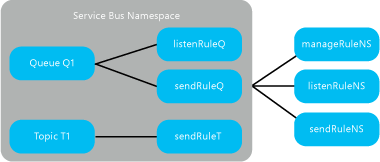

<properties
    pageTitle="Azure 服务总线的共享访问签名身份验证 | Azure"
    description="使用共享访问签名进行服务总线身份验证的概述中详细介绍了 Azure 服务总线的 SAS 身份验证。"
    services="service-bus"
    documentationcenter="na"
    author="sethmanheim"
    manager="timlt"
    editor="" />
<tags
    ms.assetid=""
    ms.service="service-bus"
    ms.devlang="na"
    ms.topic="article"
    ms.tgt_pltfrm="na"
    ms.workload="na"
    ms.date="02/14/2017"
    wacn.date="03/20/2017"
    ms.author="sethm" />  

# 服务总线的共享访问签名身份验证

*共享访问签名* (SAS) 是服务总线消息传送的主要安全机制。本文介绍 SAS、其工作原理以及如何以平台无关的方式使用它们。

SAS 身份验证使应用程序能够使用在命名空间或在关联了特定权限的消息传送实体（队列或主题）上配置的访问密钥向服务总线进行身份验证。然后可以使用此密钥生成 SAS 令牌，客户端反过来可用它向服务总线进行身份验证。

Azure SDK 2.0 版和更高版本包括 SAS 身份验证支持。

## SAS 概述

共享访问签名是基于 SHA-256 安全哈希或 URI 的身份验证机制。SAS 是所有服务总线服务使用的非常强大的机制。在实际应用中，SAS 有两个组件：*共享访问策略*和*共享访问签名*（通常称为*令牌*）。

服务总线中的 SAS 身份验证涉及配置具有服务总线资源相关权限的加密密钥。客户端通过提供 SAS 令牌，声明访问服务总线资源。此令牌包括正在访问的资源 URI，以及一个由已配置的密钥签名的到期时间。

可在服务总线[中继](/documentation/articles/service-bus-fundamentals-hybrid-solutions/#relays)、[队列](/documentation/articles/service-bus-fundamentals-hybrid-solutions/#queues)和[主题](/documentation/articles/service-bus-fundamentals-hybrid-solutions/#topics)上配置共享访问签名授权规则。

SAS 身份验证使用以下元素：

* [共享访问授权规则](https://docs.microsoft.com/en-us/dotnet/api/microsoft.servicebus.messaging.sharedaccessauthorizationrule)：采用 Base64 表示的 256 位主加密密钥、一个可选的配用密钥，以及密钥名称和关联的权限（*侦听*、*发送*、*管理*权限的集合）。
* [共享访问签名](https://docs.microsoft.com/en-us/dotnet/api/microsoft.servicebus.sharedaccesssignaturetokenprovider)令牌：使用 HMAC-SHA256 资源字符串生成的，包括访问的资源 URI 和一个具有加密密钥的过期时间。该签名和以下各节所述的其他元素已被格式化为字符串，用于形成 SAS 令牌。

## 共享访问策略

对于 SAS，要了解的一个重点是，它开始于策略。对于每个策略，需要确定三个信息片段：**名称**、**范围**和**权限**。**名称**只是该范围内的唯一名称。范围也很简单：它是相关资源的 URI。对于服务总线命名空间，范围是完全限定的域名 (FQDN)，例如 `https://<yournamespace>.servicebus.windows.cn/`。

策略的可用权限大多数都易于理解：

* 发送
* 侦听
* 管理

在你创建策略后，系统将为它分配*主密钥*和*辅助密钥*。它们是加密形式的强密钥。请勿遗失或泄露这些密钥 - 在 [Azure 门户预览][Azure portal]中总要用到它们。你可以使用其中一个生成的密钥，并且随时可以重新生成密钥。不过，如果你重新生成或更改策略中的主密钥，基于该密钥创建的所有共享访问签名都将失效。

当你创建服务总线命名空间时，系统将自动为整个命名空间创建名为 **RootManageSharedAccessKey** 的策略，此策略具有所有权限。你不会以 **root** 身份登录，因此除非有适合的理由，否则请勿使用此策略。可以在门户上的命名空间“配置”选项卡中创建更多的策略。请务必注意，在服务总线中的单一树级别（命名空间、队列等）中，最多只能附加 12 个策略。

## 共享访问签名身份验证的配置
可在服务总线命名空间、队列或主题上配置 [SharedAccessAuthorizationRule](https://docs.microsoft.com/en-us/dotnet/api/microsoft.servicebus.messaging.sharedaccessauthorizationrule) 规则。当前不支持在服务总线订阅上配置 [SharedAccessAuthorizationRule](https://docs.microsoft.com/en-us/dotnet/api/microsoft.servicebus.messaging.sharedaccessauthorizationrule)，但可以使用命名空间或主题上配置的规则来确保安全访问订阅。有关演示此过程的有效示例，请参阅 [Using Shared Access Signature (SAS) authentication with Service Bus Subscriptions](http://code.msdn.microsoft.com/Using-Shared-Access-e605b37c)（将共享访问签名 (SAS) 身份验证与服务总线订阅配合使用）示例。

服务总线命名空间、队列或主题上最多可配置 12 条这样的授权规则。在服务总线命名空间上配置的规则适用于该命名空间中的所有实体。

  

在此图中， *manageRuleNS* 、 *sendRuleNS* ，以及 *listenRuleNS* 授权规则适用于队列 Q1 和主题 T1，而 *listenRuleQ* 和 *sendRuleQ* 仅适用于队列 Q1， *sendRuleT* 仅适用于主题 T1。

[SharedAccessAuthorizationRule](https://docs.microsoft.com/en-us/dotnet/api/microsoft.servicebus.messaging.sharedaccessauthorizationrule) 的密钥参数如下：

| 参数 | 说明 |
| --- | --- |
| *KeyName* |描述授权规则的字符串。 |
| *PrimaryKey* |用于签名和验证 SAS 令牌的 Base64 编码的 256 位主密钥。 |
| *SecondaryKey* |用于签名和验证 SAS 令牌的 Base64 编码的 256 位辅助密钥。 |
| *AccessRights* |授权规则授予的访问权限列表。这些权限可以是侦听、发送和管理权限的任何集合。 |

如果预配了服务总线命名空间，默认情况下，将创建 [SharedAccessAuthorizationRule](https://docs.microsoft.com/en-us/dotnet/api/microsoft.servicebus.messaging.sharedaccessauthorizationrule)，其中，[KeyName](https://docs.microsoft.com/en-us/dotnet/api/microsoft.servicebus.messaging.sharedaccessauthorizationrule#Microsoft_ServiceBus_Messaging_SharedAccessAuthorizationRule_KeyName) 设置为 **RootManageSharedAccessKey**。

## 生成共享访问签名（令牌）

策略本身不是服务总线的访问令牌。它是使用主密钥或辅助密钥生成访问令牌时所依据的对象。任何有权访问共享访问授权规则中指定的签名密钥的客户端均可以生成 SAS 令牌。令牌是通过妥善编写一个字符串而生成的，格式如下所示：

	SharedAccessSignature sig=<signature-string>&se=<expiry>&skn=<keyName>&sr=<URL-encoded-resourceURI>

其中，`signature-string` 是令牌范围的 SHA-256 哈希（前一部分已介绍**范围**），后面附加了 CRLF 和过期时间（自纪元算起，以秒为单位：1970 年 1 月 1 日 `00:00:00 UTC`）。

> [AZURE.NOTE]
> 为了避免令牌到期时间过短，建议将到期时间值编码为至少 32 位的无符号整数，或更优的（64 位）长整数。
> 
> 

哈希类似于以下虚构代码，可返回 32 个字节。

	SHA-256('https://<yournamespace>.servicebus.windows.cn/'+'\n'+ 1438205742)

非哈希值位于 **SharedAccessSignature** 字符串中，这样，接收方便可以使用相同的参数计算哈希，以确保它返回相同的结果。URI 指定范围，而密钥名称标识要用于计算哈希的策略。从安全角度来看，这非常重要。如果签名与接收方（服务总线）的计算结果不符，则拒绝访问。此时，你可以确保发送方可访问密钥，并且应该被授予策略中指定的权限。

请注意，对此操作应使用编码的资源 URI。资源 URI 是向其声明访问权限的服务总线资源的完整 URI。例如，`http://<namespace>.servicebus.windows.cn/<entityPath>` 或 `sb://<namespace>.servicebus.windows.cn/<entityPath>`；即，`http://contoso.servicebus.windows.cn/contosoTopics/T1/Subscriptions/S3`。

用于签名的共享访问授权规则必须在此 URI 指定的实体上，或由其分层父级之一进行配置。例如，前面的示例中的 `http://contoso.servicebus.windows.cn/contosoTopics/T1` 或 `http://contoso.servicebus.windows.cn`。

SAS 令牌对于 `signature-string` 中使用的 `<resourceURI>` 下的所有资源均有效。

SAS 令牌中的 [KeyName](https://docs.microsoft.com/en-us/dotnet/api/microsoft.servicebus.messaging.sharedaccessauthorizationrule#Microsoft_ServiceBus_Messaging_SharedAccessAuthorizationRule_KeyName) 是指用于生成令牌的共享访问授权规则的 **keyName**。

*URL-encoded-resourceURI* 必须与在签名计算期间签名字符串中使用的 URI 相同。它应该是[百分比编码](https://msdn.microsoft.com/zh-cn/library/4fkewx0t.aspx)。

建议你定期重新生成 [SharedAccessAuthorizationRule](https://docs.microsoft.com/en-us/dotnet/api/microsoft.servicebus.messaging.sharedaccessauthorizationrule) 对象中使用的密钥。应用程序通常应使用 [PrimaryKey](https://docs.microsoft.com/en-us/dotnet/api/microsoft.servicebus.messaging.sharedaccessauthorizationrule#Microsoft_ServiceBus_Messaging_SharedAccessAuthorizationRule_PrimaryKey) 来生成 SAS 令牌。在重新生成密钥时，应使用旧主密钥替换 [SecondaryKey](https://docs.microsoft.com/en-us/dotnet/api/microsoft.servicebus.messaging.sharedaccessauthorizationrule#Microsoft_ServiceBus_Messaging_SharedAccessAuthorizationRule_SecondaryKey)，并生成新密钥作为新主密钥。这让你可以继续使用通过旧的主密钥颁发的尚未过期的授权令牌。

如果密钥已泄漏，并且必须吊销这些密钥，你可以同时生成 [SharedAccessAuthorizationRule](https://docs.microsoft.com/en-us/dotnet/api/microsoft.servicebus.messaging.sharedaccessauthorizationrule) 的 [PrimaryKey](https://docs.microsoft.com/en-us/dotnet/api/microsoft.servicebus.messaging.sharedaccessauthorizationrule#Microsoft_ServiceBus_Messaging_SharedAccessAuthorizationRule_PrimaryKey) 和 [SecondaryKey](https://docs.microsoft.com/en-us/dotnet/api/microsoft.servicebus.messaging.sharedaccessauthorizationrule#Microsoft_ServiceBus_Messaging_SharedAccessAuthorizationRule_SecondaryKey)，并用新的密钥替换它们。此过程将使得由旧密钥签名的所有令牌失效。

## 如何使用服务总线的共享访问签名身份验证

以下方案包括配置授权规则、生成 SAS 令牌和客户端授权。

有关演示使配置和使用 SAS 授权的服务总线应用程序的完整工作示例，请参阅[服务总线的共享访问签名身份验证](http://code.msdn.microsoft.com/Shared-Access-Signature-0a88adf8)。有关演示使用在命名空间或主题中配置的 SAS 授权规则来保护服务总线订阅的相关示例，请参阅 [Using Shared Access Signature (SAS) authentication with Service Bus Subscriptions](http://code.msdn.microsoft.com/Using-Shared-Access-e605b37c)（将共享访问签名 (SAS) 身份验证与服务总线订阅配合使用）。

## 访问命名空间上的共享访问授权规则

在服务总线命名空间根路径上的操作需要证书身份验证。你必须上载用于 Azure 订阅的管理证书。若要上传管理证书，请使用 [Azure 门户预览][Azure portal]并按照[此处](/documentation/articles/cloud-services-configure-ssl-certificate-portal/#step-3-upload-a-certificate)的步骤进行操作。有关 Azure 管理证书的详细信息，请参阅 [Azure 证书概述](/documentation/articles/cloud-services-certs-create/#what-are-management-certificates)。

访问服务总线命名空间上的共享访问授权规则的终结点如下所示：

    https://management.core.windows.cn/{subscriptionId}/services/ServiceBus/namespaces/{namespace}/AuthorizationRules/

若要在服务总线命名空间上创建 [SharedAccessAuthorizationRule](https://docs.microsoft.com/en-us/dotnet/api/microsoft.servicebus.messaging.sharedaccessauthorizationrule) 对象，在此终结点上使用序列化为 JSON 或 XML 的规则信息执行 POST 操作。例如：

    // Base address for accessing authorization rules on a namespace
    string baseAddress = @"https://management.core.windows.cn/<subscriptionId>/services/ServiceBus/namespaces/<namespace>/AuthorizationRules/";
    
    // Configure authorization rule with base64-encoded 256-bit key and Send rights
    var sendRule = new SharedAccessAuthorizationRule("contosoSendAll",
        SharedAccessAuthorizationRule.GenerateRandomKey(),
        new[] { AccessRights.Send });
    
    // Operations on the Service Bus namespace root require certificate authentication.
    WebRequestHandler handler = new WebRequestHandler
    {
        ClientCertificateOptions = ClientCertificateOption.Manual
    };
    // Access the management certificate by subject name
    handler.ClientCertificates.Add(GetCertificate(<certificateSN>));
    
    HttpClient httpClient = new HttpClient(handler)
    {
        BaseAddress = new Uri(baseAddress)
    };
    httpClient.DefaultRequestHeaders.Accept.Add(
        new MediaTypeWithQualityHeaderValue("application/json"));
    httpClient.DefaultRequestHeaders.Add("x-ms-version", "2015-01-01");
    
    // Execute a POST operation on the baseAddress above to create an auth rule
    var postResult = httpClient.PostAsJsonAsync("", sendRule).Result;

类似地，在终结点上使用 GET 操作来读取在命名空间上配置的授权规则。

若要更新或删除特定的授权规则，请使用以下终结点：

    https://management.core.windows.cn/{subscriptionId}/services/ServiceBus/namespaces/{namespace}/AuthorizationRules/{KeyName}
    

## 访问实体上的共享访问授权规则

可通过相应 [QueueDescription](https://docs.microsoft.com/en-us/dotnet/api/microsoft.servicebus.messaging.queuedescription) 或 [TopicDescription](https://docs.microsoft.com/en-us/dotnet/api/microsoft.servicebus.messaging.topicdescription) 中的 [AuthorizationRules](https://docs.microsoft.com/en-us/dotnet/api/microsoft.servicebus.messaging.authorizationrules) 集合，访问在服务总线队列或主题中配置的 [Microsoft.ServiceBus.Messaging.SharedAccessAuthorizationRule](https://docs.microsoft.com/zh-cn/dotnet/api/microsoft.servicebus.messaging.sharedaccessauthorizationrule) 对象。

下面的代码演示了如何向队列添加授权规则。

    // Create an instance of NamespaceManager for the operation
    NamespaceManager nsm = NamespaceManager.CreateFromConnectionString(
        <connectionString> );
    QueueDescription qd = new QueueDescription( <qPath> );
    
    // Create a rule with send rights with keyName as "contosoQSendKey"
    // and add it to the queue description.
    qd.Authorization.Add(new SharedAccessAuthorizationRule("contosoSendKey",
        SharedAccessAuthorizationRule.GenerateRandomKey(),
        new[] { AccessRights.Send }));
    
    // Create a rule with listen rights with keyName as "contosoQListenKey"
    // and add it to the queue description.
    qd.Authorization.Add(new SharedAccessAuthorizationRule("contosoQListenKey",
        SharedAccessAuthorizationRule.GenerateRandomKey(),
        new[] { AccessRights.Listen }));
    
    // Create a rule with manage rights with keyName as "contosoQManageKey"
    // and add it to the queue description.
    // A rule with manage rights must also have send and receive rights.
    qd.Authorization.Add(new SharedAccessAuthorizationRule("contosoQManageKey",
        SharedAccessAuthorizationRule.GenerateRandomKey(),
        new[] {AccessRights.Manage, AccessRights.Listen, AccessRights.Send }));
    
    // Create the queue.
    nsm.CreateQueue(qd);

## 使用共享访问签名授权

使用具有服务总线 .NET 库的 Azure.NET SDK 的应用程序可以通过 [SharedAccessSignatureTokenProvider](https://docs.microsoft.com/en-us/dotnet/api/microsoft.servicebus.sharedaccesssignaturetokenprovider) 类使用 SAS 授权。下面的代码演示了如何使用令牌提供程序向服务总线队列发送消息。

    Uri runtimeUri = ServiceBusEnvironment.CreateServiceUri("sb",
        <yourServiceNamespace>, string.Empty);
    MessagingFactory mf = MessagingFactory.Create(runtimeUri,
        TokenProvider.CreateSharedAccessSignatureTokenProvider(keyName, key));
    QueueClient sendClient = mf.CreateQueueClient(qPath);
    
    //Sending hello message to queue.
    BrokeredMessage helloMessage = new BrokeredMessage("Hello, Service Bus!");
    helloMessage.MessageId = "SAS-Sample-Message";
    sendClient.Send(helloMessage);

应用程序还可以通过使用可接受连接字符串的方法中的 SAS 连接字符串来使用 SAS 进行身份验证。

请注意，若要使用服务总线中继的 SAS 授权，你可以使用服务总线命名空间上配置的 SAS 密钥。如果在命名空间上显式创建中继（[NamespaceManager](https://docs.microsoft.com/en-us/dotnet/api/microsoft.servicebus.namespacemanager) 与 [RelayDescription](https://docs.microsoft.com/en-us/dotnet/api/microsoft.servicebus.messaging.relaydescription)）对象，你可以只为该中继设置 SAS 规则。若要使用服务总线订阅的 SAS 授权，你可以使用服务总线命名空间或主题上配置的 SAS 密钥。

## 使用共享访问签名（在 HTTP 级别）

了解如何为服务总线中的任何实体创建共享访问签名后，便可以执行 HTTP POST：

    POST https://<yournamespace>.servicebus.windows.net/<yourentity>/messages
    Content-Type: application/json
    Authorization: SharedAccessSignature sr=https%3A%2F%2F<yournamespace>.servicebus.windows.net%2F<yourentity>&sig=<yoursignature from code above>&se=1438205742&skn=KeyName
    ContentType: application/atom+xml;type=entry;charset=utf-8

请记住，这适用于所有情况。可以为队列、主题或订阅创建 SAS。

如果你为发送方或客户端提供 SAS 令牌，它们不会直接获取密钥，并且无法逆向改编哈希来获取令牌。因此，你可以控制它们有权访问的项以及访问时长。要记住的一个重点是，如果你更改策略中的主密钥，基于该密钥创建的所有共享访问签名都将失效。

## 使用共享访问签名（在 AMQP 级别）

在前一部分中，你已了解如何根据 HTTP POST 请求使用 SAS 令牌将数据发送到服务总线。正如你所知道的，你可以使用高级消息队列协议 (AMQP) 来访问服务总线。在许多方案中，出于性能原因，会将该协议用作首选协议。文档[基于 AMQP 声明的安全性版本 1.0](https://www.oasis-open.org/committees/download.php/50506/amqp-cbs-v1%200-wd02%202013-08-12.doc)（自 2013 年以来以有效草案版推出，不过 Azure 现在能够很好地支持它）中介绍了如何通过 AMQP 使用 SAS 令牌。

开始将数据发送到服务总线之前，发布者必须将 AMQP 消息中的 SAS 令牌发送到正确定义的名为 **$cbs** 的 AMQP 节点（可以将它视为一个由服务使用的“特殊”队列，用于获取和验证所有 SAS 令牌）。发布者必须在 AMQP 消息中指定 **ReplyTo** 字段；这是服务向发布者回复令牌验证结果（发布者与服务之间的简单请求/回复模式）时所在的节点。根据 AMQP 1.0 规范中有关“动态创建远程节点”的论述，此回复节点是“在运行中”创建的。在检查 SAS 令牌是否有效之后，发布者可以继续将数据发送到服务。

下面的步骤演示如何使用 [AMQP.Net Lite](https://github.com/Azure/amqpnetlite) 库通过 AMQP 协议发送 SAS 令牌。如果不能使用官方的服务总线 SDK（例如，在 WinRT、Net Compact Framework、.Net Micro Framework 和 Mono 中）进行 C# 开发，则这很有用。当然，此库对于帮助了解基于声明的安全性如何在 AMQP 级别工作非常有用，就如同你可以了解它如何在 HTTP 级别工作一样（根据 HTTP POST 请求在“Authorization”标头内部发送 SAS 令牌）。如果你不需要此类有关 AMQP 的深入知识，可以将官方的服务总线 SDK 用于 .Net Framework 应用程序，该 SDK 会为你执行此操作。

### C&#35;

    /// 

    /// Send claim-based security (CBS) token
    /// 

    /// <param name="shareAccessSignature">Shared access signature (token) to send</param>
    private bool PutCbsToken(Connection connection, string sasToken)
    {
        bool result = true;
        Session session = new Session(connection);
    
        string cbsClientAddress = "cbs-client-reply-to";
        var cbsSender = new SenderLink(session, "cbs-sender", "$cbs");
        var cbsReceiver = new ReceiverLink(session, cbsClientAddress, "$cbs");
    
        // construct the put-token message
        var request = new Message(sasToken);
        request.Properties = new Properties();
        request.Properties.MessageId = Guid.NewGuid().ToString();
        request.Properties.ReplyTo = cbsClientAddress;
        request.ApplicationProperties = new ApplicationProperties();
        request.ApplicationProperties["operation"] = "put-token";
        request.ApplicationProperties["type"] = "servicebus.windows.net:sastoken";
        request.ApplicationProperties["name"] = Fx.Format("amqp://{0}/{1}", sbNamespace, entity);
        cbsSender.Send(request);
    
        // receive the response
        var response = cbsReceiver.Receive();
        if (response == null || response.Properties == null || response.ApplicationProperties == null)
        {
            result = false;
        }
        else
        {
            int statusCode = (int)response.ApplicationProperties["status-code"];
            if (statusCode != (int)HttpStatusCode.Accepted && statusCode != (int)HttpStatusCode.OK)
            {
                result = false;
            }
        }
    
        // the sender/receiver may be kept open for refreshing tokens
        cbsSender.Close();
        cbsReceiver.Close();
        session.Close();
    
        return result;
    }
    

`PutCbsToken()` 方法接收代表服务的 TCP 连接的 *connection* （[AMQP .NET Lite 库](https://github.com/Azure/amqpnetlite)提供的 AMQP Connection 类实例），以及表示要发送的 SAS 令牌的 *sasToken* 参数。

> [AZURE.NOTE]
> 请务必在 **SASL 身份验证机制设置为 EXTERNAL** 的情况下创建连接（而不是在不需要发送 SAS 令牌时使用的包含用户名与密码的默认 PLAIN）。
> 
> 

接下来，发布者将创建两个 AMQP 链接来发送 SAS 令牌和接收来自服务的回复（令牌验证结果）。

AMQP 消息包含一组属性，比简单消息包含更多信息。SAS 令牌是消息的正文（使用其构造函数）。 **ReplyTo** 属性设置为用于在接收方链接上接收验证结果的节点名称（可以根据需要更改其名称，该节点将由服务动态创建）。服务使用最后三个应用程序/自定义属性来指示它需要执行哪种类型的操作。如 CBS 草案规范中所述，这些属性必须是 **操作名称** (put-token)、 **令牌类型** （在此例中为“servicebus.windows.net:sastoken”），以及要应用令牌的 **受众的“名称”** （整个实体）。

在发送方链接上发送 SAS 令牌后，发布者必须在接收方链接上读取回复。回复是一个简单的 AMQP 消息，其中包含一个名为 **status-code** 的应用程序属性，该属性可以包含与 HTTP 状态代码相同的值。

## 服务总线操作所需的权限

下表显示对服务总线资源进行各种操作所需的访问权限。

| 操作 | 所需声明 | 声明范围 |
| --- | --- | --- |
| **命名空间** | | |
| 在命名空间上配置授权规则 |管理 |任何命名空间地址 |
| **服务注册表** | | |
| 枚举私有策略 |管理 |任何命名空间地址 |
| 开始在命名空间上侦听 |侦听 |任何命名空间地址 |
| 将消息发送到命名空间中的侦听器 |发送 |任何命名空间地址 |
| **队列** | | |
| 创建队列 |管理 |任何命名空间地址 |
| 删除队列 |管理 |任何有效队列地址 |
| 枚举队列 |管理 |/$Resources/Queues |
| 获取队列说明 |管理 |任何有效队列地址 |
| 在队列上配置授权规则 |管理 |任何有效队列地址 |
| 发送到队列 |发送 |任何有效队列地址 |
| 从队列接收消息 |侦听 |任何有效队列地址 |
| 在速览-锁定模式下接收消息后放弃或完成消息 |侦听 |任何有效队列地址 |
| 推迟消息以供将来检索 |侦听 |任何有效队列地址 |
| 将消息放入死信队列 |侦听 |任何有效队列地址 |
| 获取与消息队列会话关联的状态 |侦听 |任何有效队列地址 |
| 设置与消息队列会话关联的状态 |侦听 |任何有效队列地址 |
| **主题** | | |
| 创建主题 |管理 |任何命名空间地址 |
| 删除主题 |管理 |任何有效主题地址 |
| 枚举主题 |管理 |/$Resources/Topics |
| 获取主题描述 |管理 |任何有效主题地址 |
| 在主题上配置授权规则 |管理 |任何有效主题地址 |
| 发送到主题 |发送 |任何有效主题地址 |
| **订阅** | | |
| 创建订阅 |管理 |任何命名空间地址 |
| 删除订阅 |管理 |../myTopic/Subscriptions/mySubscription |
| 枚举订阅 |管理 |../myTopic/Subscriptions |
| 获取订阅说明 |管理 |../myTopic/Subscriptions/mySubscription |
| 在速览-锁定模式下接收消息后放弃或完成消息 |侦听 |../myTopic/Subscriptions/mySubscription |
| 推迟消息以供将来检索 |侦听 |../myTopic/Subscriptions/mySubscription |
| 将消息放入死信队列 |侦听 |../myTopic/Subscriptions/mySubscription |
| 获取与主题会话关联的状态 |侦听 |../myTopic/Subscriptions/mySubscription |
| 设置与主题会话关联的状态 |侦听 |../myTopic/Subscriptions/mySubscription |
| **规则** | | |
| 创建规则 |管理 |../myTopic/Subscriptions/mySubscription |
| 删除规则 |管理 |../myTopic/Subscriptions/mySubscription |
| 枚举规则 |管理或侦听 |../myTopic/Subscriptions/mySubscription/Rules 

## 后续步骤

若要了解有关服务总线消息传送的详细信息，请参阅以下主题。

* [服务总线基础知识](/documentation/articles/service-bus-fundamentals-hybrid-solutions/)
* [服务总线队列、主题和订阅](/documentation/articles/service-bus-queues-topics-subscriptions/)
* [如何使用 Service Bus 队列](/documentation/articles/service-bus-dotnet-get-started-with-queues/)
* [如何使用服务总线主题和订阅](/documentation/articles/service-bus-dotnet-how-to-use-topics-subscriptions/)

[Azure portal]: https://portal.azure.cn

<!---HONumber=Mooncake_0313_2017-->