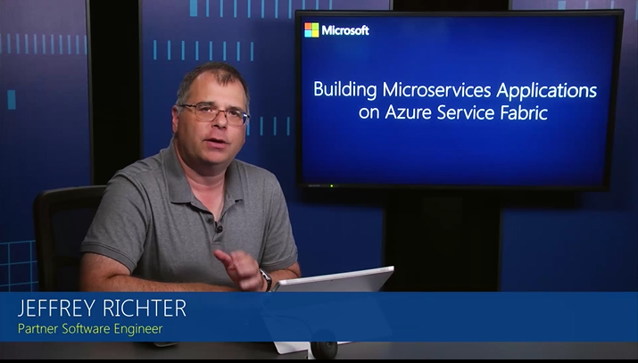

<properties
    pageTitle="Service Fabric 中的应用程序生命周期 | Azure"
    description="介绍了开发、部署、测试、升级、维护和删除 Service Fabric 应用程序。"
    services="service-fabric"
    documentationcenter=".net"
    author="rwike77"
    manager="timlt"
    editor=""
    translationtype="Human Translation" />
<tags
    ms.assetid="08837cca-5aa7-40da-b087-2b657224a097"
    ms.service="service-fabric"
    ms.devlang="dotnet"
    ms.topic="article"
    ms.tgt_pltfrm="NA"
    ms.workload="NA"
    ms.date="03/08/2017"
    wacn.date="04/24/2017"
    ms.author="ryanwi"
    ms.sourcegitcommit="a114d832e9c5320e9a109c9020fcaa2f2fdd43a9"
    ms.openlocfilehash="0c2c3a058df7db529addc81274909168ec6ffa37"
    ms.lasthandoff="04/14/2017" />

# Service Fabric 应用程序生命周期
与其他平台一样，Azure Service Fabric 上的应用程序通常将经历以下几个阶段：设计、开发、测试、部署、升级、维护和删除。 Service Fabric 为云应用程序的整个应用程序生命周期提供一流的支持：从开发到部署、到日常管理和维护，再到最终解除授权。 服务模型使多个不同角色可以独立参与到应用程序生命周期中。 本文提供了有关 API 的概述，以及不同角色在 Service Fabric 应用程序生命周期的各个阶段如何使用它们。

以下 Microsoft Virtual Academy 视频介绍了如何管理应用程序生命周期：

## 服务模型角色
服务模型角色如下：

* **服务开发人员**：开发可以用作其他用途或在相同类型或不同类型的多个应用程序中使用的模块和通用服务。 例如，队列服务可用于创建票证应用程序（帮助服务台）或电子商务应用程序（购物车）。
* **应用程序开发人员**：通过集成满足某些特定要求或方案的服务集合来创建应用程序。 例如，电子商务网站可能集成“JSON 无状态前端服务”、“拍卖有状态服务”，以及“队列有状态服务”来建构拍卖解决方案。
* **应用程序管理员**：针对应用程序配置（填写配置模板参数）、部署（映射到可用资源）以及服务质量做出决策。 例如，应用程序管理员决定应用程序的语言区域设置（例如，美国为英语，中国为中文）。 另一个已部署的应用程序可以具有不同的设置。
* **操作员**：基于由应用程序管理员指定的应用程序配置和要求部署应用程序。 例如，操作员预配和部署应用程序并确保它在 Azure 中运行。 操作员监视应用程序运行状况和性能信息，并根据需要维护物理基础结构。

## 开发
1. *服务开发人员*使用 [Reliable Actors](/documentation/articles/service-fabric-reliable-actors-introduction/) 或 [Reliable Services](/documentation/articles/service-fabric-reliable-services-introduction/) 编程模型开发不同类型的服务。
2. *服务开发人员*以声明的方式描述包含一个或多个代码、配置和数据包的服务清单文件中的开发服务类型。
3. 随后， *应用程序开发人员* 构建使用不同服务类型的应用程序。
4. *应用程序开发人员*以声明的方式，通过引用构成服务的服务清单并相应地重写并参数化构成服务的不同配置与部署设置，描述了应用程序清单中的应用程序类型。

有关示例，请参阅 [Reliable Actors 入门](/documentation/articles/service-fabric-reliable-actors-get-started/)和 [Reliable Services 入门](/documentation/articles/service-fabric-reliable-services-quick-start/)。

## 部署
1. *应用程序管理员*通过在应用程序清单中指定 **ApplicationType** 元素的相应参数，将应用程序类型定制为将被部署到 Service Fabric 群集的特定应用程序。
2. *操作员*使用 [**CopyApplicationPackage** 方法](https://docs.microsoft.com/dotnet/api/system.fabric.fabricclient.applicationmanagementclient#System_Fabric_FabricClient_ApplicationManagementClient_CopyApplicationPackage_System_String_System_String_System_String_)或 [**Copy-ServiceFabricApplicationPackage** cmdlet](https://docs.microsoft.com/zh-cn/powershell/servicefabric/vlatest/copy-servicefabricapplicationpackage)，将应用程序包上载到群集映像存储中。 应用程序包包含应用程序清单和服务包集合。 Service Fabric 部署存储在映像存储（可能是 Azure Blob 存储或 Service Fabric 系统服务）中的应用程序包中的应用程序。
3. 然后，*操作员*使用 [**ProvisionApplicationAsync** 方法](https://docs.microsoft.com/dotnet/api/system.fabric.fabricclient.applicationmanagementclient#System_Fabric_FabricClient_ApplicationManagementClient_ProvisionApplicationAsync_System_String_System_TimeSpan_System_Threading_CancellationToken_)、[**Register-ServiceFabricApplicationType** cmdlet](https://docs.microsoft.com/zh-cn/powershell/servicefabric/vlatest/register-servicefabricapplicationtype) 或[**预配应用程序** REST 操作](https://docs.microsoft.com/zh-cn/rest/api/servicefabric/provision-an-application)预配从已上载的应用程序包的目标群集中的应用程序类型。
4. 预配该应用程序后，*操作员*使用由*应用程序管理员*通过 [**CreateApplicationAsync** 方法](https://docs.microsoft.com/dotnet/api/system.fabric.fabricclient.applicationmanagementclient#System_Fabric_FabricClient_ApplicationManagementClient_CreateApplicationAsync_System_Fabric_Description_ApplicationDescription_System_TimeSpan_System_Threading_CancellationToken_)、[**New-ServiceFabricApplication** cmdlet](https://docs.microsoft.com/zh-cn/powershell/servicefabric/vlatest/new-servicefabricapplication) 或[**创建应用程序** REST 操作](https://docs.microsoft.com/zh-cn/rest/api/servicefabric/create-an-application)所提供的参数，来启动该应用程序。
5. 部署应用程序后，*操作员*使用 [**CreateServiceAsync**方法](https://docs.microsoft.com/dotnet/api/system.fabric.fabricclient.servicemanagementclient#System_Fabric_FabricClient_ServiceManagementClient_CreateServiceAsync_System_Fabric_Description_ServiceDescription_System_TimeSpan_System_Threading_CancellationToken_)、[**New-ServiceFabricService** cmdlet](https://docs.microsoft.com/zh-cn/powershell/servicefabric/vlatest/new-servicefabricservice) 或[**创建服务** REST 操作](https://docs.microsoft.com/zh-cn/rest/api/servicefabric/create-a-service)，来基于可用的服务类型为应用程序创建新的服务实例。
6. 该应用程序现在在 Service Fabric 群集中运行。

有关示例，请参阅[部署应用程序](/documentation/articles/service-fabric-deploy-remove-applications/)。

## 测试
1. 部署到本地开发群集或测试群集后，*服务开发人员*使用 [**FailoverTestScenarioParameters**](https://docs.microsoft.com/dotnet/api/system.fabric.testability.scenario.failovertestscenarioparameters#System_Fabric_Testability_Scenario_FailoverTestScenarioParameters) 和 [**FailoverTestScenario**](https://docs.microsoft.com/dotnet/api/system.fabric.testability.scenario.failovertestscenario#System_Fabric_Testability_Scenario_FailoverTestScenario) 类或 [**Invoke ServiceFabricFailoverTestScenario** cmdlet](https://docs.microsoft.com/zh-cn/powershell/servicefabric/vlatest/invoke-servicefabricfailovertestscenario) 运行内置的故障转移测试方案。 故障转移测试方案在重要转换和故障转移中运行指定的服务，以确保其仍然可用并正在工作。
2. 然后，*服务开发人员*使用 [**ChaosTestScenarioParameters**](https://docs.microsoft.com/dotnet/api/system.fabric.testability.scenario.chaostestscenarioparameters#System_Fabric_Testability_Scenario_ChaosTestScenarioParameters) 和 [**ChaosTestScenario**](https://docs.microsoft.com/dotnet/api/system.fabric.testability.scenario.chaostestscenario#System_Fabric_Testability_Scenario_ChaosTestScenario) 类或 [**Invoke ServiceFabricChaosTestScenario** cmdlet](https://docs.microsoft.com/zh-cn/powershell/servicefabric/vlatest/invoke-servicefabricchaostestscenario) 运行内置的混乱测试方案。 任意混合测试方案会将多个节点、代码包和副本错误包括到群集中。
3. *服务开发人员*通过创建围绕群集移动主副本的测试方案，来[测试服务之间的通信](/documentation/articles/service-fabric-testability-scenarios-service-communication/)。

有关详细信息，请参阅[故障分析服务简介](/documentation/articles/service-fabric-testability-overview/)。

## 升级
1. *服务开发人员* 将更新实例化应用程序的构成服务并/或修复 bug，并提供服务清单的新版本。
2. *应用程序开发人员* 重写并参数化一致服务的配置和部署设置，并提供应用程序清单的新版本。 然后，应用程序开发人员将服务清单的新版本合并到应用程序中，并在更新的应用程序包中提供应用程序类型的新版本。
3. *应用程序管理员*通过更新相应参数，将应用程序类型的新版本合并到目标应用程序中。
4. *操作员*使用 [**CopyApplicationPackage** 方法](https://docs.microsoft.com/dotnet/api/system.fabric.fabricclient.applicationmanagementclient#System_Fabric_FabricClient_ApplicationManagementClient_CopyApplicationPackage_System_String_System_String_System_String_)或 [**Copy-ServiceFabricApplicationPackage** cmdlet](https://docs.microsoft.com/zh-cn/powershell/servicefabric/vlatest/copy-servicefabricapplicationpackage)，将更新的应用程序包上载到群集映像存储中。 应用程序包包含应用程序清单和服务包集合。
5. *操作员*使用 [**ProvisionApplicationAsync** 方法](https://docs.microsoft.com/dotnet/api/system.fabric.fabricclient.applicationmanagementclient#System_Fabric_FabricClient_ApplicationManagementClient_ProvisionApplicationAsync_System_String_System_TimeSpan_System_Threading_CancellationToken_)、[**Register-ServiceFabricApplicationType** cmdlet](https://docs.microsoft.com/zh-cn/powershell/servicefabric/vlatest/register-servicefabricapplicationtype) 或[**预配应用程序** REST 操作](https://docs.microsoft.com/zh-cn/rest/api/servicefabric/provision-an-application)，在目标群集中预配应用程序的新版本。
6. *操作员*使用 [**UpgradeApplicationAsync** 方法](https://docs.microsoft.com/dotnet/api/system.fabric.fabricclient.applicationmanagementclient#System_Fabric_FabricClient_ApplicationManagementClient_UpgradeApplicationAsync_System_Fabric_Description_ApplicationUpgradeDescription_System_TimeSpan_System_Threading_CancellationToken_)、[**Start-ServiceFabricApplicationUpgrade** cmdlet](https://docs.microsoft.com/zh-cn/powershell/servicefabric/vlatest/start-servicefabricapplicationupgrade) 或[**升级应用程序** REST 操作](https://docs.microsoft.com/zh-cn/rest/api/servicefabric/upgrade-an-application)将目标应用程序升级到新版本。
7. *操作员*使用 [**GetApplicationUpgradeProgressAsync** 方法](https://docs.microsoft.com/dotnet/api/system.fabric.fabricclient.applicationmanagementclient#System_Fabric_FabricClient_ApplicationManagementClient_GetApplicationUpgradeProgressAsync_System_Uri_System_TimeSpan_System_Threading_CancellationToken_)、[**Get ServiceFabricApplicationUpgrade** cmdlet](https://docs.microsoft.com/zh-cn/powershell/servicefabric/vlatest/get-servicefabricapplicationupgrade) 或[**获取应用程序升级进度** REST 操作](https://docs.microsoft.com/zh-cn/rest/api/servicefabric/get-the-progress-of-an-application-upgrade1)，来检查升级进度。
8. 如有必要，*操作员*将使用 [**UpdateApplicationUpgradeAsync** 方法](https://docs.microsoft.com/dotnet/api/system.fabric.fabricclient.applicationmanagementclient#System_Fabric_FabricClient_ApplicationManagementClient_UpdateApplicationUpgradeAsync_System_Fabric_Description_ApplicationUpgradeUpdateDescription_System_TimeSpan_System_Threading_CancellationToken_)、[**Update-ServiceFabricApplicationUpgrade** cmdlet](https://docs.microsoft.com/zh-cn/powershell/servicefabric/vlatest/update-servicefabricapplicationupgrade) 或[**更新应用程序升级**REST 操作](https://docs.microsoft.com/zh-cn/rest/api/servicefabric/update-an-application-upgrade)，来修改并重新应用当前应用程序升级参数。
9. 如有必要，*操作员*将使用 [**RollbackApplicationUpgradeAsync** 方法](https://docs.microsoft.com/dotnet/api/system.fabric.fabricclient.applicationmanagementclient#System_Fabric_FabricClient_ApplicationManagementClient_RollbackApplicationUpgradeAsync_System_Uri_System_TimeSpan_System_Threading_CancellationToken_)、[**Start-ServiceFabricApplicationRollback** cmdlet](https://docs.microsoft.com/zh-cn/powershell/servicefabric/vlatest/start-servicefabricapplicationrollback) 或[**回滚应用程序升级** REST 操作](https://docs.microsoft.com/zh-cn/rest/api/servicefabric/rollback-an-application-upgrade)，来回滚当前的应用程序升级。
10. Service Fabric 对在群集中运行的目标应用程序进行升级，并且不会丢失其任何构成服务的可用性。

有关示例，请参阅[应用程序升级教程](/documentation/articles/service-fabric-application-upgrade-tutorial/)。

## 维护
1. 对于操作系统升级和修补程序，Service Fabric 与 Azure 基础结构连接，以确保在群集中运行的所有应用程序的可用性。
2. 对于 Service Fabric 平台的升级和修补程序，Service Fabric 自行升级，并且不会丢失在群集上运行的任何应用程序的可用性。
3. *应用程序管理员*在分析历史容量使用率数据与将来需求后，批准从群集中添加或删除节点。
4. *操作员*添加和删除由*应用程序管理员*指定的节点。
5. 当新节点被添加到群集中或从群集中删除现有节点时，Service Fabric 自动负载均衡正在群集中的所有节点上运行的应用程序，以获得最佳性能。

## 删除
1. *操作员*可以使用 [**DeleteServiceAsync**方法](https://docs.microsoft.com/dotnet/api/system.fabric.fabricclient.servicemanagementclient#System_Fabric_FabricClient_ServiceManagementClient_DeleteServiceAsync_System_Fabric_Description_DeleteServiceDescription_System_TimeSpan_System_Threading_CancellationToken_)、[**Remove-ServiceFabricService** cmdlet](https://docs.microsoft.com/zh-cn/powershell/servicefabric/vlatest/remove-servicefabricservice) 或[**删除服务** REST 操作](https://docs.microsoft.com/zh-cn/rest/api/servicefabric/delete-a-service)来删除群集中正在运行的服务的特定实例，并且不会删除整个应用程序。  
2. *操作员*还可以使用 [**DeleteApplicationAsync** 方法](https://docs.microsoft.com/dotnet/api/system.fabric.fabricclient.applicationmanagementclient#System_Fabric_FabricClient_ApplicationManagementClient_DeleteApplicationAsync_System_Fabric_Description_DeleteApplicationDescription_System_TimeSpan_System_Threading_CancellationToken_)、[**Remove-ServiceFabricApplication** cmdlet](https://docs.microsoft.com/zh-cn/powershell/servicefabric/vlatest/remove-servicefabricapplication)，或[**删除应用程序** REST 操作](https://docs.microsoft.com/zh-cn/rest/api/servicefabric/delete-an-application)，来删除应用程序实例及其所有服务。
3. 应用程序和服务停止后，*操作员*可以使用 [**UnprovisionApplicationAsync** 方法](https://docs.microsoft.com/dotnet/api/system.fabric.fabricclient.applicationmanagementclient#System_Fabric_FabricClient_ApplicationManagementClient_UnprovisionApplicationAsync_System_String_System_String_System_TimeSpan_System_Threading_CancellationToken_)、[**Unregister-ServiceFabricApplicationType** cmdlet](https://docs.microsoft.com/zh-cn/powershell/servicefabric/vlatest/unregister-servicefabricapplicationtype)，或[**取消预配应用程序**REST 操作](https://docs.microsoft.com/zh-cn/rest/api/servicefabric/unprovision-an-application)，来取消预配应用程序类型。 取消预配应用程序类型不会从 ImageStore 删除应用程序包。 你必须手动删除应用程序包。
4. *操作员*使用 [**RemoveApplicationPackage** 方法](https://docs.microsoft.com/dotnet/api/system.fabric.fabricclient.applicationmanagementclient#System_Fabric_FabricClient_ApplicationManagementClient_RemoveApplicationPackage_System_String_System_String_)或 [**Remove-ServiceFabricApplicationPackage** cmdlet](https://docs.microsoft.com/zh-cn/powershell/servicefabric/vlatest/remove-servicefabricapplicationpackage) 从 ImageStore 中删除应用程序包。

有关示例，请参阅[部署应用程序](/documentation/articles/service-fabric-deploy-remove-applications/)。

## 后续步骤
有关开发、测试和管理 Service Fabric 应用程序与服务的详细信息，请参阅：

* [Reliable Actors](/documentation/articles/service-fabric-reliable-actors-introduction/)
* [Reliable Services](/documentation/articles/service-fabric-reliable-services-introduction/)
* [部署应用程序](/documentation/articles/service-fabric-deploy-remove-applications/)
* [应用程序升级](/documentation/articles/service-fabric-application-upgrade/)
* [可测试性概述](/documentation/articles/service-fabric-testability-overview/)
<!--Update_Description: wording update;add anchors to H2 titles-->