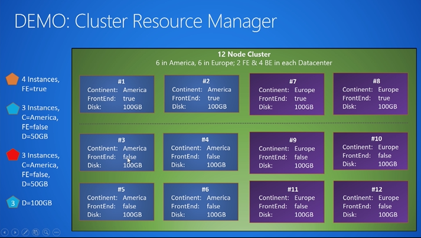

<properties
    pageTitle="Service Fabric 群集资源管理器简介 | Azure"
    description="介绍 Service Fabric 群集资源管理器。"
    services="service-fabric"
    documentationcenter=".net"
    author="masnider"
    manager="timlt"
    editor="" />
<tags
    ms.assetid="cfab735b-923d-4246-a2a8-220d4f4e0c64"
    ms.service="Service-Fabric"
    ms.devlang="dotnet"
    ms.topic="article"
    ms.tgt_pltfrm="NA"
    ms.workload="NA"
    ms.date="01/05/2017"
    wacn.date="02/20/2017"
    ms.author="masnider" />  

# Service Fabric 群集资源管理器简介
在传统上，管理 IT 系统或一组服务意味着要使一些物理机或虚拟机专用于这些特定的服务或系统。许多主要服务划分为“Web”层和“数据”或“存储”层，此外可能还有其他一些专用组件，例如缓存。其他类型的应用程序会有一个消息传送层，请求在其中流入和流出。该层会连接到一个工作层，以便完成在消息传送过程中必需的分析或转换操作。每种类型的工作负荷都有专用的计算机：数据库需要一些专用计算机，Web 服务器也需要一些。如果特定类型的工作负荷导致其所在的计算机运行时温度过高，则可添加更多使用该配置的计算机。但大多数情况下，你会使用更大型的计算机来替换其中的部分计算机。这很容易理解。如果某台计算机发生故障，则在还原该计算机之前，整个应用程序中的该部件将以较低容量运行。这仍然很容易理解（但不一定有趣）。

但是，我们现在假设你已发现有扩展的需要并采用了容器和/或微服务。你会突然发现自己有了数十、数百或数千台计算机。你有数十项不同类型的服务（没有一项服务占用一整台计算机的资源），也许还有数百个此类服务的不同实例。每个命名的实例都有一个或多个实现高可用性 \(HA\) 所需的实例或副本。

突然间，管理环境并不像管理一些专用于单一类型工作负荷的计算机一样简单。服务器是虚拟的且不再具有名称（毕竟*现在*要管理的是[一大堆](http://www.slideshare.net/randybias/architectures-for-open-and-scalable-clouds/20)而不是几台计算机）。有关计算机的配置减少了，有关服务本身的配置增多了。专用硬件已是过去的产物，服务本身已经变成小型分布式系统，跨越多个较小的商用硬件。

由于这会解构以前的单体式分层应用并分解到在商用硬件上运行的独立服务，因此，现在有许多更高程度的组合需要处理。哪种因素决定了哪些类型的工作负荷可在特定的硬件上运行，或者可以运行多少个工作负荷？ 哪些工作负荷可在相同的硬件上运行良好，哪些会发生冲突？ 当计算机关闭时...哪种功能还能在其上运行？ 哪种机制负责确保该工作负荷可再次开始运行？ 是否正在等待（虚拟）计算机恢复正常，或者工作负荷自动故障转移到其他计算机并保持运行？ 是否需要人工干预？ 在这种环境中升级会如何？

作为处理这种情况的开发人员和操作人员，我们在管理这种复杂情况时还是需要一点帮助的。你觉得，大量招聘以及尝试使用人员来掩饰复杂性并非解决问题的正确方式。

怎么办？

## 协调器简介
“协调器”是软件片段中使用的一般术语，可帮助管理员管理这些类型的环境。协调器是组件，会获取“我想要在环境中运行此服务的五个副本”这样的请求。它们会尝试让环境来满足所需的状态，不管发生什么情况。

协调器（不是人类）是当计算机故障或工作负荷出于某种意外原因而终止时，要快速采取措施的组件。大多数协调器不仅仅处理故障。它们的其他功能还有：管理新部署、处理升级事项，以及处理资源消耗情况。所有协调器的基本任务都是在环境中维持某种所需的配置状态。你可以将自己的预期告诉协调器，让它帮助你完成繁重的工作。例如，基于 Mesos、Fleet、Docker 数据中心/Docker Swarm、Kubernetes 和 Service Fabric 的 Chronos 或 Marathon 都是协调器（或者有内置的协调器）。由于在不同类型的环境中管理现实部署的复杂性和条件不断加剧和变化，持续创建的协调器越来越多。

## 协调即服务
在 Service Fabric 群集中，协调器的作业主要由群集资源管理器处理。Service Fabric 群集资源管理器是 Service Fabric 中的系统服务之一，将在每个群集中自动启动。一般而言，群集资源管理器的作业可划分为三个部分：

1. 强制实施规则
2. 优化你的环境
3. 提供其他进程的帮助

若要了解群集资源管理器的工作原理，请观看下面的 Microsoft 虚拟大学视频：

### 它不是什么
在传统的 N 层应用程序中，始终有某种有关“负载均衡器”的概念。通常情况下，该概念是指网络负载均衡器 \(NLB\) 或应用程序负载均衡器 \(ALB\)，具体取决于其在网络堆栈中所处的位置。有些负载均衡器基于硬件（例如 F5 的 BigIP 产品），有些则基于软件（例如 Microsoft 的 NLB）。在其他环境中，可能会在此角色中看到类似于 HAProxy 或 Nginx 的内容。在这些体系结构中，负载均衡作业的目的是确保无状态工作负荷接收大致相同的工作量。负载均衡策略各不相同。某些均衡器会将每个不同的调用发送到不同的服务器。另外一些均衡器提供会话固定/粘连。更高级的均衡器使用实际的估算或报告，根据预计的成本和当前的计算机负载来路由调用。

网络均衡器或消息路由器尝试确保 Web/辅助角色层保持大致均衡。均衡数据层的策略则不同，其取决于数据存储机制，通常集中在数据分片、缓存、托管视图、存储过程，以及其他特定于存储的机制。

尽管其中有些策略很有作用，但 Service Fabric 群集资源管理器的功能并不像网络负载均衡器或缓存一样。网络负载均衡器可确保将流量定向到运行服务的位置，从而实现前端的均衡。Service Fabric 群集资源管理器采用不同的策略。Service Fabric 基本上是将*服务* 移到最适当的位置，让流量或负载进行跟随。例如，它可能会将服务移到目前较冷清的节点，这些节点因为其中的服务的工作量不大而显得冷清。节点冷清可能是因为其中的服务被删除或移至别处。再举一例，群集资源管理器也可能会将服务从计算机中移除。可能该计算机需要升级，也可能该计算机因为其上运行的服务处于使用高峰而导致过载。

由于群集资源管理器负责移动服务（而不是将网络流量传送到服务所在位置），因此其所包含的功能集不同于网络负载均衡器中的功能集。如果更详细地进行考察，我们会发现，该管理器本质上采用的是不同的策略，以此确保群集中的硬件资源得到有效的利用。

## 后续步骤
- 有关群集资源管理器中体系结构和信息流的信息，请查看[此文](/documentation/articles/service-fabric-cluster-resource-manager-architecture/)
- 群集资源管理器提供许多用于描述群集的选项。若要详细了解这些选项，请查看这篇[描述 Service Fabric 群集](/documentation/articles/service-fabric-cluster-resource-manager-cluster-description/)的文章
- 如需详细了解适用于配置服务的其他选项，请查看[了解如何配置服务](/documentation/articles/service-fabric-cluster-resource-manager-configure-services/)中提供的其他群集资源管理器配置的相关主题
- 指标是 Service Fabric 群集资源管理器在群集中管理消耗和容量的方式。若要详细了解指标及其配置方式，请查看[此文](/documentation/articles/service-fabric-cluster-resource-manager-metrics/)
- 群集资源管理器可与 Service Fabric 的管理功能配合使用。若要了解有关这种集成的详细信息，请阅读[此文](/documentation/articles/service-fabric-cluster-resource-manager-management-integration/)
- 若要了解群集资源管理器如何管理和均衡群集中的负载，请查看有关[均衡负载](/documentation/articles/service-fabric-cluster-resource-manager-balancing/)的文章

<!---HONumber=Mooncake_0213_2017-->
<!--Update_Description: add introduction to NLB-->