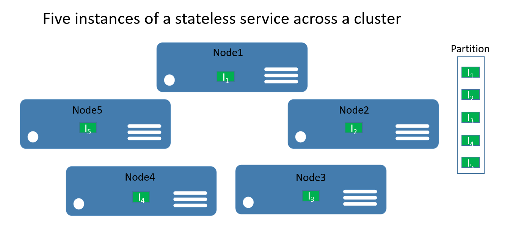
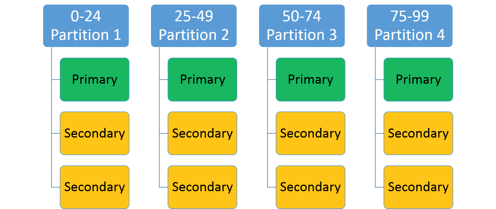
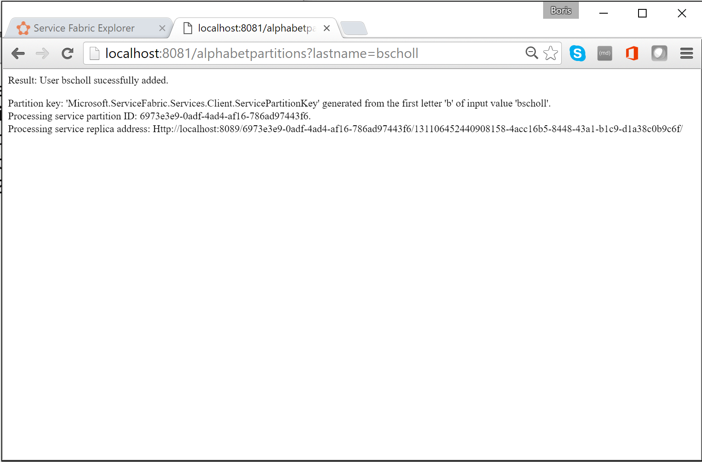

<properties
   pageTitle="Service Fabric 服务分区 | Azure"
   description="介绍如何对 Service Fabric 服务进行分区"
   services="service-fabric"
   documentationCenter=".net"
   authors="appi101"
   manager="timlt"
   editor=""/>

<tags
   ms.service="service-fabric"
   ms.date="06/20/2016"
   wacn.date="07/04/2016"/>
# Service Fabric Reliable Services 分区
本文介绍 Azure Service Fabric Reliable Services 分区的基本概念。本文中使用的源代码也可以在 [GitHub](https://github.com/Azure-Samples/service-fabric-dotnet-getting-started/tree/master/Services/AlphabetPartitions) 上获取。

## 分区
分区并不是 Service Fabric 所独有的。事实上，它是构建可缩放服务的核心模式。从更广泛的意义来说，我们可以将分区视为将状态（数据）和计算划分为更小的可访问单元，以提高可伸缩性和性能的一种概念。一种众所周知的分区形式是[数据分区][wikipartition]，也称为分片。

### Service Fabric 无状态服务分区
对于无状态服务，可以将分区视为包含服务的一个或多个实例的逻辑单元。图 1 显示一个无状态服务，其五个实例使用一个分区在群集中分布。

实际上有两种类型的无状态服务解决方案。第一种是在外部（例如在 Azure SQL 数据库中）保持其状态的服务（如存储会话信息和数据的网站）。第二种是不管理任何持久状态的仅计算服务（如计算器或图像缩略）。

在任一情况下，对无状态服务进行分区都是非常少见的方案 — 通常通过添加更多实例来实现可伸缩性和可用性。对于无状态服务实例要考虑多个分区的唯一情况是在需要满足特殊路由请求时。

例如，考虑以下这种情况：ID 处于特定范围内的用户只应该由特定服务实例提供服务。可以对无状态服务进行分区的情况的另一个示例是在你具有真正分区后端（例如分片 SQL 数据库）并且你要控制哪个服务实例应写入数据库分片（或是在无状态服务中执行的其他准备工作需要的分区信息与后端中使用的信息相同）时。这些类型的情况也可以通过其他方式进行解决，并不一定需要服务分区。

本演练的其余部分侧重于有状态服务。

### 对 Service Fabric 有状态服务进行分区
通过 Service Fabric 可以提供到一流的状态（数据）分区方式，从而方便地开发可缩放有状态服务。从概念上讲，可以将有状态服务的分区视为通过在群集中的节点间进行分布和平衡的[副本](/documentation/articles/service-fabric-availability-services/)而高度可用的缩放单位。

在 Service Fabric 有状态服务的上下文中进行分区是指确定特定服务分区负责服务完整状态的某个部分的过程。（如前所述，分区是一组[副本](/documentation/articles/service-fabric-availability-services/)）。Service Fabric 的一大优点是它将分区置于不同节点上。这使它们可以按照节点的资源限制来增长。随着数据需求的增长，分区也会增长，Service Fabric 会在节点间重新平衡分区。这可确保硬件资源的持续高效使用。

为了提供一个示例，假设你开始时具有一个 5 节点群集，以及一个配置为具有 10 个分区并且目标为 3 个副本的服务。在这种情况下，Service Fabric 会在群集间平衡和分布副本 — 最后每个节点会有两个主[副本](/documentation/articles/service-fabric-availability-services/)。如果现在需要将群集扩大到 10 个节点，则 Service Fabric 会在所有 10 个节点间重新平衡主[副本](/documentation/articles/service-fabric-availability-services/)。同样，如果重新缩小为 5 个节点，则 Service Fabric 会在 5 个节点间重新平衡所有副本。

图 2 显示缩放群集之前和之后的 10 个分区的分布。

这样，便因为来自客户端的请求在计算机间进行分布而实现了扩大，提高了应用程序的整体性能，并减少了对数据区块的访问争用。

## 规划分区
实现服务之前，应始终考虑扩大所需的分区策略。可使用不同方式，但所有方式都注重应用程序需要实现的功能。由于本文的背景，我们来考虑一些更重要的方面。

一个不错的方法是将需要进行分区的状态的结构视为第一步。

我们来看一个简单的示例。如果你要为全县投票构建一个服务，则可以为县中的每个城市创建一个分区。随后可以在对应于城市的分区中为城市中的每个人存储投票。图 3 显示一组人及其所在的城市。

因为城市的人口差别很大，所以你最后可能有一些分区包含大量数据（例如西雅图），而其他分区包含非常少的状态（例如柯克兰）。那么分区具有不均匀的状态数量会有什么影响呢？

如果你再次考虑该示例，便可以很容易地发现为西雅图保存投票的分区获得的流量会多于柯克兰的相应分区。默认情况下，Service Fabric 可确保每个节点上的主副本和辅助副本数量大致相同。因此，最后可能节点容纳的一些副本处理较多流量，而其他副本处理较少流量。你会倾向于避免群集中出现类似于这种情况的热点和冷点。

为避免出现这种情况，从分区的角度来看，你应做两件事：

- 尝试对状态进行分区，以便状态在所有分区间均匀分布。
- 从服务的每个副本报告负载。（有关操作方法的信息，请查看这篇有关[指标和负载](/documentation/articles/service-fabric-cluster-resource-manager-metrics/)的文章）。Service Fabric 可以报告服务消耗的负载，例如内存量或记录数。根据报告的指标，Service Fabric 会检测到某些分区处理的负载高于其他分区，并通过将副本移动到更合适的节点来重新平衡群集，以便在整体上不会有节点过载。

有时，无法知道将处于给定分区中的数据量。因此，常规建议是执行以下两种操作：首先是采用在分区间均匀分布数据的分区策略，其次是报告负载。第一种方法可防止投票示例中描述的情况，而第二种方法可帮助随时间推移而消除访问或负载的中的临时差异。

分区规划的另一个方面是选择开始时要采用的正确分区数。从 Service Fabric 角度来看，你可以毫无阻碍地在一开始便使用比针对方案所预期的分区更多的分区。事实上，采用最大数量的分区是一种有效方法。

在极少数情况下，你可能最终需要比最初选择更多的分区。因为无法在事后更改分区计数，所以需要应用一些高级分区方法，如创建相同服务类型的新服务实例。还需要实现某种可基于客户端代码必须维护的客户端知识，将请求路由到正确服务实例的客户端逻辑。

分区规划的另一个注意事项是可用计算机资源。因为状态需要进行访问和存储，所以你一定会遵循以下各项：

- 网络带宽限制
- 系统内存限制
- 磁盘存储限制

那么，如果在正在运行的群集中遇到资源限制时会发生什么情况呢？ 答案是可以只需扩大群集以适应新需求。

[容量规划指南](/documentation/articles/service-fabric-capacity-planning/)提供有关如何确定群集需要的节点数的指导。

## 开始进行分区
本部分介绍如何开始对服务进行分区。

Service Fabric 提供了三个分区方案可供选择：

- 范围分区（也称为 UniformInt64Partition）。
- 命名分区。使用此模型的应用程序通常具有可以在受限集中分段的数据。用作命名分区键的数据字段的一些常见示例是区域、邮政编码、客户组或其他业务边界。
- 单独分区。单独分区通常在服务不需要任何其他路由时使用。例如，无状态服务在默认情况下使用此分区方案。

命名和单独分区方案是范围分区的特殊形式。默认情况下，用于 Service Fabric 的 Visual Studio 模板会使用范围分区，因为它是最常用且最有用的分区。本文的其余部分重点介绍范围分区方案。

### 范围分区方案
此方案用于指定整数范围（由低键和高键标识）和分区数目 (n)。它将创建 n 个分区，每个分区负责整个分区键范围的未重叠子范围。例如，一个采用低键 0、高键 99 和计数 4 的范围分区方案将创建如下所示的 4 个分区。

一种常见方法是基于数据集中的唯一键创建哈希。一些常见的键示例有：车辆识别号 (VIN)、员工 ID 或唯一字符串。随后使用此唯一键生成一个哈希代码（键范围取模）以用作你的键。可以指定所允许键范围的上限和下限。

### 选择哈希算法
哈希法的重要部分是选择哈希算法。一个考虑事项是：目标是否是对相邻的类似键进行分组（局部敏感哈希法）— 或者活动是否应广泛分布在所有分区上（分发哈希法，这更加常见）。

良好的分发哈希算法的特征是易于计算，几乎没有冲突，并且均匀地分发键。高效哈希算法的一个良好示例是 [FNV-1](https://en.wikipedia.org/wiki/Fowler%E2%80%93Noll%E2%80%93Vo_hash_function) 哈希算法。

有关选择常规哈希代码算法的良好资源是[哈希函数的维基百科网页](http://en.wikipedia.org/wiki/Hash_function)。

## 构建具有多个分区的有状态服务
我们来创建具有多个分区的第一个可靠有状态服务。在此示例中，你会构建一个非常简单的应用程序，在其中你要将以相同字母开头的所有姓氏存储在相同分区中。

编写任何代码之前，需要考虑分区和分区键。需要 26 个分区（字母表中的每个字母各一个分区），但是低键和高键是怎样的呢？ 因为我们确实是对每个字母使用一个分区，所以可以使用 0 作为低键，使用 25 作为高键，因为每个字母都是自己的键。

>[AZURE.NOTE] 这是简化方案，因为在现实情况下分布是不均匀的。以字母“S”或“M”开头的姓氏比以“X”或“Y”开头的姓氏更常见。

1. 打开 Visual Studio >“文件”>“新建”>“项目”。
2. 在“新建项目”对话框中，选择 Service Fabric 应用程序。
3. 将项目命名为“AlphabetPartitions”。
4. 在“创建服务”对话框中，选择“有状态”服务并将它称为“Alphabet.Processing”，如下图所示。

    

5. 设置分区数。打开 AlphabetPartitions 项目的 ApplicationPackageRoot 文件夹中的 Applicationmanifest.xml 文件，然后将参数 Processing\_PartitionCount 更新为 26，如下所示。

		<Parameter Name="Processing_PartitionCount" DefaultValue="26" />

   	还需要更新 ApplicationManifest.xml 中 StatefulService 元素的 LowKey 和 HighKey 属性，如下所示。

    	<Service Name="Processing">
      	<StatefulService ServiceTypeName="ProcessingType" TargetReplicaSetSize="[Processing_TargetReplicaSetSize]" MinReplicaSetSize="[Processing_MinReplicaSetSize]">
        	<UniformInt64Partition PartitionCount="[Processing_PartitionCount]" LowKey="0" HighKey="25" />
      	</StatefulService>
    	</Service>
    

6. 要使访问可以访问，请通过添加 Alphabet.Processing 服务的 ServiceManifest.xml（位于 PackageRoot 文件夹中）的终结点元素，在某个端口上打开终结点，如下所示：

    
    	<Endpoint Name="ProcessingServiceEndpoint" Port="8089" Protocol="http" Type="Internal" />
    

    现在服务已配置为侦听具有 26 个分区的内部终结点。

7. 接下来，需要重写 Processing 类的 `CreateServiceReplicaListeners()` 方法。

    >[AZURE.NOTE] 对于此示例，我们假定你使用一个简单 HttpCommunicationListener。有关 Reliable Service 通信的详细信息，请参阅 [Reliable Service 通信模型](/documentation/articles/service-fabric-reliable-services-communication/)。

8. 副本所侦听的 URL 的建议模式是以下格式：`{scheme}://{nodeIp}:{port}/{partitionid}/{replicaid}/{guid}`。因此，你要将通信侦听器配置为侦听正确的终结点以及使用此模式。

    可以在同一台计算机上承载此服务的多个副本，因此此地址需要是副本独有的。这就是 URL 中包含分区 ID 和副本 ID 的原因。HttpListener 可以在同一端口上侦听多个地址，只要 URL 前缀是唯一的。

    额外 GUID 在其中用于辅助副本也针对只读请求进行侦听的高级情况。如果是这种情况，则要确保在从主副本转换为辅助副本时使用新的唯一地址，以强制客户端重新解析地址。“+”在此处用作地址，以便副本在所有可用主机（IP、FQDM、localhost 等）上进行侦听 下面的代码演示一个示例。

    	protected override IEnumerable<ServiceReplicaListener> CreateServiceReplicaListeners()
    	{
         	return new[] { new ServiceReplicaListener(context => this.CreateInternalListener(context))};
    	}
    	private ICommunicationListener CreateInternalListener(ServiceContext context)
    	{
            
         	EndpointResourceDescription internalEndpoint = context.CodePackageActivationContext.GetEndpoint("ProcessingServiceEndpoint");
         	string uriPrefix = String.Format(
                	"{0}://+:{1}/{2}/{3}-{4}/",
                	internalEndpoint.Protocol,
                	internalEndpoint.Port,
                	context.PartitionId,
                	context.ReplicaOrInstanceId,
                	Guid.NewGuid());

         	string nodeIP = FabricRuntime.GetNodeContext().IPAddressOrFQDN;

         	string uriPublished = uriPrefix.Replace("+", nodeIP);
         	return new HttpCommunicationListener(uriPrefix, uriPublished, this.ProcessInternalRequest);
    	}

    此外，值得注意的是发布的 URL 与侦听 URL 前缀略有不同。该侦听 URL 提供给 HttpListener。发布的 URL 是发布到 Service Fabric 命名服务（用于服务发现）的 URL。客户端会通过该发现服务请求此地址。客户端获取的地址需要具有节点的实际 IP 或 FQDN 才能连接。因此需要将“+”替换为节点的 IP 或 FQDN，如上所示。

9. 最后一步是将处理逻辑添加到服务，如下所示。

    	private async Task ProcessInternalRequest(HttpListenerContext context, CancellationToken cancelRequest)
    	{
        	string output = null;
        	string user = context.Request.QueryString["lastname"].ToString();

        	try
        	{
            	output = await this.AddUserAsync(user);
        	}
        	catch (Exception ex)
        	{
            	output = ex.Message;
        	}

        	using (HttpListenerResponse response = context.Response)
        	{
            	if (output != null)
            	{
                	byte[] outBytes = Encoding.UTF8.GetBytes(output);
                	response.OutputStream.Write(outBytes, 0, outBytes.Length);
            	}
        	}
    	}
    	private async Task<string> AddUserAsync(string user)
    	{
        	IReliableDictionary<String, String> dictionary = await this.StateManager.GetOrAddAsync<IReliableDictionary<String, String>>("dictionary");

        	using (ITransaction tx = this.StateManager.CreateTransaction())
        	{
            	bool addResult = await dictionary.TryAddAsync(tx, user.ToUpperInvariant(), user);

            	await tx.CommitAsync();

            	return String.Format(
                	"User {0} {1}",
                	user,
                	addResult ? "sucessfully added" : "already exists");
        	}
    	}

    `ProcessInternalRequest` 会读取用于调用分区的查询字符串参数值，并调用 `AddUserAsync` 以将姓氏添加到可靠字典 `dictionary`。

10. 我们来将一个无状态服务添加到项目，以查看如何调用特定分区。

    此服务可用作简单 Web 界面，它接受姓氏作为查询字符串参数，确定分区键，然后将它发送到 Alphabet.Processing 服务进行处理。
    
11. 在“创建服务”对话框中，选择“无状态”服务并将它称为“Alphabet.Web”，如下所示。
    
    。

12. 在 Alphabet.WebApi 服务的 ServiceManifest.xml 中更新终结点信息，以打开端口，如下所示。

    
    	<Endpoint Name="WebApiServiceEndpoint" Protocol="http" Port="8081"/>
    

13. 需要在 Web 类中返回 ServiceInstanceListeners 的集合。同样，可以选择实现简单 HttpCommunicationListener。

    
    	protected override IEnumerable<ServiceInstanceListener> CreateServiceInstanceListeners()
    	{
        	return new[] {new ServiceInstanceListener(context => this.CreateInputListener(context))};
    	}
    	private ICommunicationListener CreateInputListener(ServiceContext context)
    	{
        	// Service instance's URL is the node's IP & desired port
        	EndpointResourceDescription inputEndpoint = context.CodePackageActivationContext.GetEndpoint("WebApiServiceEndpoint")
        	string uriPrefix = String.Format("{0}://+:{1}/alphabetpartitions/", inputEndpoint.Protocol, inputEndpoint.Port);
        	var uriPublished = uriPrefix.Replace("+", FabricRuntime.GetNodeContext().IPAddressOrFQDN);
        	return new HttpCommunicationListener(uriPrefix, uriPublished, this.ProcessInputRequest);
    	}
    

14. 现在需要实现处理逻辑。HttpCommunicationListener 在请求进入时调用 `ProcessInputRequest`。那么，我们来继续进行，添加下面的代码。

    
    	private async Task ProcessInputRequest(HttpListenerContext context, CancellationToken cancelRequest)
    	{
        	String output = null;
        	try
        	{
            	string lastname = context.Request.QueryString["lastname"];
            	char firstLetterOfLastName = lastname.First();
            	ServicePartitionKey partitionKey = new ServicePartitionKey(Char.ToUpper(firstLetterOfLastName) - 'A');

            	ResolvedServicePartition partition = await this.servicePartitionResolver.ResolveAsync(alphabetServiceUri, partitionKey, cancelRequest);
            	ResolvedServiceEndpoint ep = partition.GetEndpoint();
                
            	JObject addresses = JObject.Parse(ep.Address);
            	string primaryReplicaAddress = (string)addresses["Endpoints"].First();

            	UriBuilder primaryReplicaUriBuilder = new UriBuilder(primaryReplicaAddress);
            	primaryReplicaUriBuilder.Query = "lastname=" + lastname;

            	string result = await this.httpClient.GetStringAsync(primaryReplicaUriBuilder.Uri);

            	output = String.Format(
                    	"Result: {0}. 
Partition key: '{1}' generated from the first letter '{2}' of input value '{3}'.  Processing service partition ID: {4}.  Processing service replica address: {5}",
                    	result,
                    	partitionKey,
                    	firstLetterOfLastName,
                    	lastname,
                    	partition.Info.Id,
                    	primaryReplicaAddress);
        	}
        	catch (Exception ex) { output = ex.Message; }

        	using (var response = context.Response)
        	{
            	if (output != null)
            	{
                	output = output + "added to Partition: " + primaryReplicaAddress;
                	byte[] outBytes = Encoding.UTF8.GetBytes(output);
                	response.OutputStream.Write(outBytes, 0, outBytes.Length);
            	}
        	}
    	}
    

    让我们逐步演练其步骤。代码将查询字符串参数 `lastname` 的第一个字母为读入到一个字符中。随后，它通过从姓氏第一个字母的十六进制值减去 `A` 的十六进制值，来确定字母的分区键。

    
    	string lastname = context.Request.QueryString["lastname"];
    	char firstLetterOfLastName = lastname.First();
    	ServicePartitionKey partitionKey = new ServicePartitionKey(Char.ToUpper(firstLetterOfLastName) - 'A');
    

    请记住，对于此示例，我们在使用 26 个分区，其中每个分区有一个分区键。接下来，我们通过对 `servicePartitionResolver` 对象使用 `ResolveAsync` 方法，来获取此键的服务分区 `partition`。`servicePartitionResolver` 定义为

    
    	private readonly ServicePartitionResolver servicePartitionResolver = ServicePartitionResolver.GetDefault();
    

    `ResolveAsync` 方法采用服务 URI、分区键和取消标记作为参数。处理服务的服务 URI 是 `fabric:/AlphabetPartitions/Processing`。接下来，我们会获取分区的终结点。

    
    	ResolvedServiceEndpoint ep = partition.GetEndpoint()
    

    最后，我们会构建终结点 URL 以及查询字符串，并调用处理服务。

    
    	JObject addresses = JObject.Parse(ep.Address);
    	string primaryReplicaAddress = (string)addresses["Endpoints"].First();

    	UriBuilder primaryReplicaUriBuilder = new UriBuilder(primaryReplicaAddress);
    	primaryReplicaUriBuilder.Query = "lastname=" + lastname;

    	string result = await this.httpClient.GetStringAsync(primaryReplicaUriBuilder.Uri);
    

    处理完成之后，我们会将输出写回。

15. 最后一步是测试服务。Visual Studio 将应用程序参数用于本地和云部署。要在本地测试具有 26 个分区服务，需要在 AlphabetPartitions 项目的 ApplicationParameters 文件夹中更新 `Local.xml` 文件，如下所示：

		<Parameters>
			<Parameter Name="Processing_PartitionCount" Value="26" />
			<Parameter Name="WebApi_InstanceCount" Value="1" />
		</Parameters>
    

16. 完成部署之后，便可以在 Service Fabric 资源管理器中检查服务及其所有分区。
    
    
    
17. 在浏览器中，可以通过输入 `http://localhost:8081/?lastname=somename` 来测试分区逻辑。你会看到以相同字母开头的每个姓氏都存储在相同区域中。
    
    

该示例的完整源代码位于 [GitHub](https://github.com/Azure-Samples/service-fabric-dotnet-getting-started/tree/master/Services/AlphabetPartitions)。

## 后续步骤

有关 Service Fabric 概念的信息，请参阅以下内容：

- [Service Fabric 服务的可用性](/documentation/articles/service-fabric-availability-services/)

- [Service Fabric 服务的可伸缩性](/documentation/articles/service-fabric-concepts-scalability/)
 
- [Service Fabric 应用程序的容量规划](/documentation/articles/service-fabric-capacity-planning/)

[wikipartition]: https://en.wikipedia.org/wiki/Partition_(database)

<!---HONumber=Mooncake_0627_2016-->