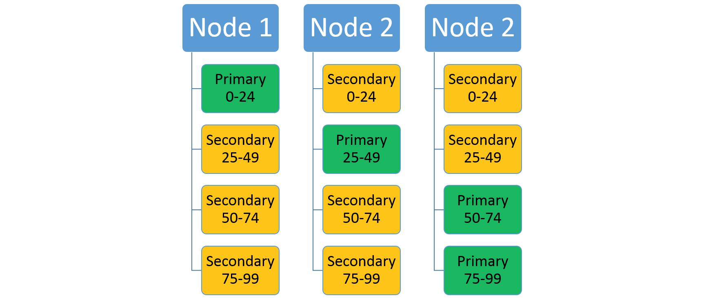

<properties
    pageTitle="Service Fabric 服务的可伸缩性 | Azure"
    description="介绍如何缩放 Service Fabric 服务"
    services="service-fabric"
    documentationcenter=".net"
    author="masnider"
    manager="timlt"
    editor="" />
<tags
    ms.assetid="ed324f23-242f-47b7-af1a-e55c839e7d5d"
    ms.service="service-fabric"
    ms.devlang="dotnet"
    ms.topic="article"
    ms.tgt_pltfrm="NA"
    ms.workload="NA"
    ms.date="12/30/2016"
    wacn.date="02/20/2017"
    ms.author="masnider" />

# 缩放 Service Fabric 应用程序
Azure Service Fabric 通过管理群集中所有节点上的服务、分区和副本，让可伸缩应用程序的生成更简单。这实现了资源利用率的最大化。

可以通过以下两种方式实现 Service Fabric 应用程序的高缩放性：

1. 在服务分区级别进行缩放
2. 在指定的服务实例级别进行缩放

## 在分区级别进行缩放
Service Fabric 支持分区。可以通过分区将单个服务拆分成多个独立的分区，每个分区都有该服务总体状态的一部分。[分区概述](/documentation/articles/service-fabric-concepts-partitioning/)提供了有关受支持分区方案类型的信息。每个分区的副本分布在群集中的各个节点上。考虑一下这样一项服务：使用范围分区方案，低键为 0，高键为 99，分区计数为 4。在包含三个节点的群集中，该服务可能如此处所示，按四个副本共享每个节点上的资源的方式进行布局：

 
 

如果增加节点数，Service Fabric 会将部分现有副本移到新节点，以便利用新节点上的资源。通过将节点数目增加到四个，现在服务在每个节点上运行三个副本（每个副本属于不同的分区），从而获得更高的资源利用率和性能。

 
 

## 在服务名称级别进行缩放
服务实例是应用程序名称和服务类型名称的一个特定实例（请参阅 [Service Fabric 应用程序生命周期](/documentation/articles/service-fabric-application-lifecycle/)）。在创建服务的过程中，指定要使用的分区方案（请参阅 [Service Fabric 服务分区](/documentation/articles/service-fabric-concepts-partitioning/)）。

第一个缩放级别是按服务名称进行。随着旧服务实例变得繁忙，用户可以创建多个服务实例，并可选择性地为其赋予不同的分区级别。这允许新服务使用者使用较不繁忙的服务实例而非较忙碌的实例。

增加容量的一种方法是使用新的分区方案创建新的服务实例。不过，这会增加复杂性。任何使用方客户端都需要知道何时以及如何使用具有不同命名的服务。另一种替代方法是，通过管理服务或中间服务来确定处理每个请求的具体服务和分区。

### 示例方案：嵌入日期
一种可行的方案是将日期信息用作服务名称的一部分。例如，可以使用如下服务实例：2013 年加入的所有客户具有一个特定名称，2014 年加入的客户具有另一个名称。此命名方案允许根据日期以编程方式增加名称（随着 2014 年的临近，可按需创建 2014 年的服务实例）。

但是，此方法基于使用超出 Service Fabric 知识范围外的应用程序特定命名信息的客户端。

* *使用命名约定*：2013 年你的应用程序上线时，你创建了一个名为 fabric:/app/service2013 的服务。临近 2013 年第二季度时，你创建了另一个名为 fabric:/app/service2014 的服务。这两个服务同为一种服务类型。在这种方法中，你的客户端需要使用基于年度构建适当服务名称的逻辑。
* *使用查找服务*：另一种模式是提供辅助的“查找服务”，此服务可为所需密钥提供服务的名称。然后可以通过查找服务创建新的服务实例。查找服务本身不会保留任何应用程序数据，它仅保留有关自己创建的服务名称的数据。因此，对于以上基于年度的示例，客户端将首先联系查找服务以找到处理给定年度数据的服务的名称。然后，客户端会使用该服务名称执行实际操作。首次查找的结果可进行缓存。

## 汇总
让我们汇总一下所讲述的内容，继续讨论另一方案。

考虑一下以下示例：你尝试生成一项可充当通讯簿的服务，用来保存姓名和联系人信息。你会有多少用户？ 每个用户会存储多少个联系人？ 尝试在第一次建立服务时就对这些项目进行估算相当困难。如果选取错误的分区计数，以后可能会存在规模问题。但是，为什么要为所有用户选取单一分区方案呢？

对于上述情况，不妨考虑以下模式：
1. 生成一项“管理器服务”，而不是尝试为所有人预先选取一个分区方案。
2. 管理器服务负责在客户注册你的服务时查看客户信息，然后根据该信息为_实际的_ 联系人-存储服务创建一个实例，_仅针对该客户_。此类动态服务创建模式有很多好处：

    * 不需为所有用户预先猜测正确的分区计数
    * 数据分段，因为每个客户都有自己的服务副本
    * 每项客户服务均可进行不同的配置，根据预期的规模视需要增减分区或副本。
      * 例如，假如客户付款购买了“黄金”级服务，则可获得更多副本或更大的分区计数
      * 或者，假如客户提供的信息表明其需要的联系人数为“小”，则只会获得数个分区。
    * 不需在等待客户出现时运行多个服务实例或副本
    * 如果客户离开，从服务中删除其信息很简单，只需让管理器删除其所创建的该服务即可

## 后续步骤
有关 Service Fabric 概念的详细信息，请参阅以下文章：

- [Service Fabric 服务的可用性](/documentation/articles/service-fabric-availability-services/)

- [Service Fabric 服务分区](/documentation/articles/service-fabric-concepts-partitioning/)

- [定义和管理状态](/documentation/articles/service-fabric-concepts-state/)
 

<!---HONumber=Mooncake_0213_2017-->
<!--Update_Description: add "汇总" section-->