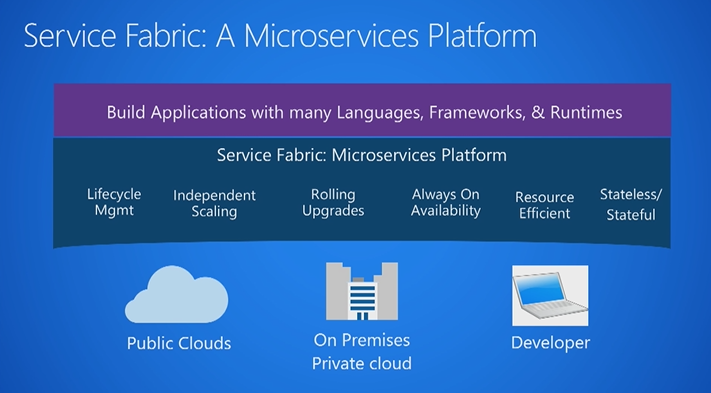
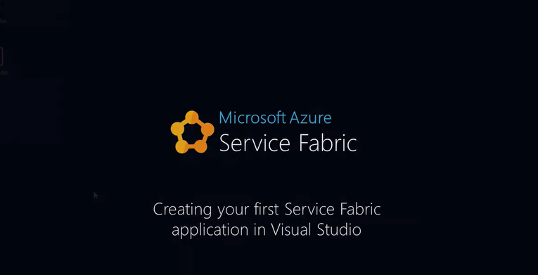

<properties
    pageTitle="Azure Service Fabric 内容路线图 | Azure"
    description="Service Fabric 的概述和入门指南。在 Service Fabric 中，应用程序由许多微服务组成，能够提供可伸缩性和复原能力。"
    services="service-fabric"
    documentationcenter=".net"
    author="rwike77"
    manager="timlt" />
<tags
    ms.service="service-fabric"
    ms.devlang="dotnet"
    ms.topic="article"
    ms.tgt_pltfrm="NA"
    ms.workload="NA"
    ms.date="01/09/2017"
    wacn.date="02/24/2017"
    ms.author="ryanwi" />  

# 想要了解 Service Fabric 吗？
本学习路线图将帮助你开始在 Service Fabric 上开发可缩放、可靠且易于管理的应用程序。

## 五分钟概述
Azure Service Fabric 是一个分布式系统平台，可让用户更轻松地打包、部署和管理可缩放且可靠的微服务，在开发和管理云应用程序的过程中处理重大难题。通过使用 Service Fabric，开发人员和管理员不仅可以避免解决复杂的基础结构问题，而且可以专注于实现可扩展、可靠且易于管理的所需的任务关键型工作负荷。Service Fabric 代表用于生成和管理这些企业级的一级云规模应用程序的下一代中间件平台。

第 9 频道中的这部简短视频介绍了 Service Fabric 和微服务：

## 详细概述
利用 Service Fabric，可以生成并管理由微服务组成的应用程序，这些应用程序可缩放且可靠，以非常高的密度在计算机共享池（称为群集）上运行。它提供复杂的运行时，可生成分布式、可缩放的无状态和有状态微服务。它还提供全面的应用程序管理功能，用于预配、部署、监视、升级/修补和删除部署的应用程序。请阅读 [Service Fabric 概述](/documentation/articles/service-fabric-overview/)了解详细信息。

为何要使用微服务设计模式？ 所有应用程序会随着时间而发展。成功的应用程序因为有实用性而发展。我们对当前的要求了解多少，今后这些要求又有什么变化？ 有时，向外寻求一个简单的应用作为概念证明才是驱动因素（因为已知将来可以重新设计该应用程序）。另一方面，公司在讨论云的构建时，都对成长和使用量有一个预期。问题在于成长和规模不可预测。我们希望能够快速制作原型，同时知道应用能够缩放，对不可预测的增长和使用量做出反应。[什么是微服务？](/documentation/articles/service-fabric-overview-microservices/)中介绍了微服务设计模式如何解决这些难题，以及如何创建可独立扩展或缩减、测试、部署和管理的微服务。

Service Fabric 提供了一个灵活可靠的平台用于编写和运行多种类型的商业应用程序和服务。你还可以运行任何现有应用程序（以任何语言编写）。这些应用程序和微服务可以无状态也可以有状态，它们在各虚拟机间资源平衡，可最大限度提高工作效率。通过 Service Fabric 的独特体系结构，可以在应用程序中执行准实时数据分析、内存中计算、并行事务和事件处理。可根据不断变化的资源需求轻松扩展或缩减（实为放大或缩小）应用程序。请阅读[应用程序方案](/documentation/articles/service-fabric-application-scenarios/)，了解可创建的应用程序和服务类别以及客户案例研究。

这部较长的 Microsoft 虚拟大学视频介绍了 Service Fabric 的核心概念：

## 入门并创建第一个应用 
使用 Service Fabric SDK 和工具可在 Windows 开发应用，并将这些应用程序部署到 Windows 上运行的群集。以下指南可帮助你在短时间内部署应用。

### 在 Windows 上
Service Fabric SDK 包含一个用于 Visual Studio 的外接程序，它可提供用于创建、部署和调试 Service Fabric 应用程序的模板和工具。这些主题逐步讲解了在 Visual Studio 中创建并在开发计算机上运行第一个应用程序的过程。

[设置开发环境](/documentation/articles/service-fabric-get-started/)
[创建第一个应用 \(C\#\)](/documentation/articles/service-fabric-create-your-first-application-in-visual-studio/)

学习这篇内容丰富的[动手实验](https://msdnshared.blob.core.windows.net/media/2016/07/SF-Lab-Part-I.docx)，熟悉 Service Fabric 的端到端开发流。了解如何创建无状态服务、配置监视和运行状况报告，以及执行应用程序升级。

第 9 频道中的以下视频逐步讲解了在 Visual Studio 中创建 C\# 应用的过程：

## 核心概念
[Service Fabric 术语](/documentation/articles/service-fabric-technical-overview/)、[应用程序模型](/documentation/articles/service-fabric-application-model/)和[支持的编程模型](/documentation/articles/service-fabric-choose-framework/)提供了更多概念和说明，下面只是基础知识。

<table><tr><th>核心概念</th><th>设计时</th><th>运行时</th></tr>
<tr><td></td>
<td></td>
<td></td></tr>
</table>

### 设计时：应用类型、服务类型、应用包和清单、服务包和清单
应用程序类型是分配给服务类型集合的名称/版本。应用程序类型在 ApplicationManifest.xml 文件中定义，在应用程序包目录中嵌入，并复制到 Service Fabric 群集的映像存储中。然后，可以基于此应用程序类型创建命名应用程序并在群集中运行。

服务类型是分配给服务的代码包、数据包、配置包的名称/版本。服务类型在 ServiceManifest.xml 文件中定义，在服务包目录中嵌入，然后，应用程序包的 ApplicationManifest.xml 文件将引用该服务包目录。在群集中创建命名应用程序后，可以从应用程序类型的服务类型之一创建命名服务。服务类型由 ServiceManifest.xml 文件描述，包括在运行时加载的可执行代码服务配置设置，以及服务使用的静态数据。

![Service Fabric 应用程序类型和服务类型][cluster-imagestore-apptypes]  

应用程序包是包含应用程序类型的 ApplicationManifest.xm 文件的磁盘目录，引用构成应用程序类型的每个服务类型的服务包。例如，电子邮件应用程序类型的应用程序包可能包含对队列服务包、前端服务包和数据库服务包的引用。应用程序包目录中的文件将复制到 Service Fabric 群集的映像存储中。

服务包是包含服务类型的 ServiceManifest.xml 文件的磁盘目录，引用服务类型的代码、静态数据和配置包。应用程序类型的 ApplicationManifest.xml 文件引用服务包目录中的文件。例如，服务包可能引用构成数据库服务的代码、静态数据和配置包。

### 运行时：群集和节点、命名应用、命名服务、分区和副本
[Service Fabric 群集](/documentation/articles/service-fabric-deploy-anywhere/)是一组通过网络连接在一起的虚拟机或物理计算机，将在其中部署和管理微服务。群集可以扩展到成千上万台计算机。

构成群集的计算机或 VM 称为节点。需为每个节点分配节点名称（字符串）。节点具有各种特征，如放置属性。每个计算机或 VM 都有一个自动启动 Windows 服务 FabricHost.exe，此服务在引导时开始运行，然后启动两个可执行文件：Fabric.exe 和 FabricGateway.exe。这两个可执行文件构成了节点。在开发或测试方案中，可以通过运行 Fabric.exe 和 FabricGateway.exe 的多个实例，在单台计算机或 VM 上托管多个节点。

命名应用程序是由执行一个或多个特定功能的命名服务组成的集合。服务执行完整且独立的功能（它们可以独立于其他服务启动和运行），并由代码、配置和数据组成。将应用程序包复制到映像存储后，可通过指定应用程序包的应用程序类型（使用其名称/版本）在群集内创建应用程序的实例。将为每个应用程序类型实例分配一个类似于下面的 URI 名称：*fabric:/MyNamedApp*。在群集中，可以从单个应用程序类型创建多个命名应用程序。也可以从不同的应用程序类型创建命名应用程序。可单独管理每个命名应用程序并设置其版本。

创建命名应用程序后，可以通过指定服务类型（使用其名称/版本），在群集中创建应用程序服务类型之一的实例（命名服务）。需为每个服务类型实例分配一个 URI 名称，该名称归并到实例的命名应用程序的 URI 之下。例如，如果在命名应用程序“MyNamedApp”中创建命名服务“MyDatabase”，则 URI 将类似于：*fabric:/MyNamedApp/MyDatabase*。在一个命名应用程序中可以创建一个或多个命名服务。每个命名服务可以有自身的分区方案和实例/副本计数。

有两种类型的服务：无状态服务和有状态服务。无状态服务的持久状态存储在 Azure 存储、Azure SQL 数据库、Azure DocumentDB 等外部存储服务中。当服务根本没有永久性存储时，请使用无状态服务。有状态服务使用 Service Fabric 通过其 Reliable Collections 或 Reliable Actors 编程模型管理服务的状态。

创建命名服务时，需要指定一个分区方案。包含大量状态的服务将跨分区拆分数据，从而将数据分散在群集的节点上。这样，命名服务的状态便可缩放。在分区中，无状态命名服务具有实例，而有状态命名服务具有副本。通常，无状态命名服务只有一个分区，因为它们没有内部状态。分区实例提供可用性；如果一个实例失败，其他实例可继续正常运行，然后 Service Fabric 将创建新的实例。有状态命名服务在副本中保持其状态，每个分区都有自身的副本集，其中包含保持同步的所有状态。如果某个副本失败，Service Fabric 将从现有副本生成新副本。

下图显示应用程序和服务实例、分区与副本之间的关系。

![服务中的分区和副本][cluster-application-instances]  

## 支持的编程模型
Service Fabric 提供了多种方法来编写和管理服务。服务可以选择使用 Service Fabric API 充分利用平台的功能和应用程序框架，或者服务可以只是采用任何语言编写的任何已编译的可执行程序，并且只是托管在 Service Fabric 群集上。有关详细信息，请参阅 [支持的编程模型](/documentation/articles/service-fabric-choose-framework/)。

### 来宾可执行文件
[来宾可执行文件](/documentation/articles/service-fabric-deploy-existing-app/)是以任何语言编写的任意可执行文件，因此可以将现有应用程序连同其他服务一起托管在 Service Fabric 群集上。但是，来宾可执行文件不直接与 Service Fabric API 集成，因此无法从平台提供的完整功能集获益，例如自定义运行状况和负载报告、服务终结点注册和有状态计算。

### Reliable Services
[Reliable Services](/documentation/articles/service-fabric-reliable-services-introduction/) 是一个用于编写与 Service Fabric 平台集成的服务的轻型框架，并且受益于完整的平台功能集。Reliable Services 可以是无状态的（类似于大多数服务平台，例如 Web 服务器或 Azure 云服务中的辅助角色），其状态保存在外部解决方案中，例如 Azure DB 或 Azure 表存储。Reliable Services 也可以是有状态的，其状态使用 Reliable Collections 直接保存在服务中。通过复制使状态具有高可用性，以及通过分区分配状态，所有状态由 Service Fabric 自动管理。

### Reliable Actors
[Reliable Actor](/documentation/articles/service-fabric-reliable-actors-introduction/) 框架在 Reliable Services 的基础上生成，是根据执行组件设计模式实现虚拟执行组件模式的应用程序框架。Reliable Actor 框架使用称为执行组件的单线程执行的独立的计算单元和状态。Reliable Actor 框架为执行组件提供内置通信，以及提供预设的状态暂留和扩展配置。

## 后续步骤
* 了解如何[在 Azure 中创建群集](/documentation/articles/service-fabric-cluster-creation-via-portal/)或[在 Windows 上创建独立群集](/documentation/articles/service-fabric-cluster-creation-for-windows-server/)。
* 尝试使用 [Reliable Services](/documentation/articles/service-fabric-reliable-services-quick-start/) 或 [Reliable Actors](/documentation/articles/service-fabric-reliable-actors-get-started/) 编程模型创建服务。
* 了解[应用程序生命周期](/documentation/articles/service-fabric-application-lifecycle/)。
* 了解如何[检查应用程序和群集运行状况](/documentation/articles/service-fabric-health-introduction/)。
* 了解如何[监视和诊断服务](/documentation/articles/service-fabric-diagnostics-how-to-monitor-and-diagnose-services-locally/)。
* 了解 [Service Fabric 支持选项](/documentation/articles/service-fabric-support/)。

[cluster-application-instances]: ./media/service-fabric-content-roadmap/cluster-application-instances.png
[cluster-imagestore-apptypes]: ./media/service-fabric-content-roadmap/cluster-imagestore-apptypes.png

<!---HONumber=Mooncake_0213_2017-->