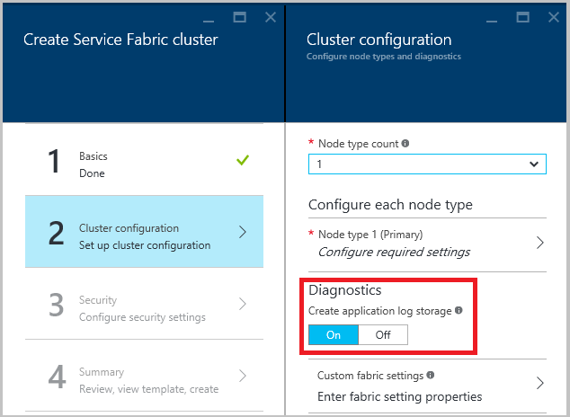

<properties
    pageTitle="使用 Azure 诊断收集日志 | Azure"
    description="本文介绍如何将 Azure 诊断设置为从在 Azure 中运行的 Service Fabric 群集收集日志。"
    services="service-fabric"
    documentationcenter=".net"
    author="ms-toddabel"
    manager="timlt"
    editor="" />
<tags
    ms.assetid="9f7e1fa5-6543-4efd-b53f-39510f18df56"
    ms.service="service-fabric"
    ms.devlang="dotnet"
    ms.topic="article"
    ms.tgt_pltfrm="NA"
    ms.workload="NA"
    ms.date="01/04/2017"
    wacn.date="02/20/2017"
    ms.author="toddabel" />  

# 使用 Azure 诊断收集日志

当你运行 Azure Service Fabric 群集时，最好是从一个中心位置的所有节点中收集日志。将日志放在中心位置可帮助分析和排查群集中的问题，或该群集中运行的应用程序与服务的问题。

上载和收集日志的方式之一是使用可将日志上载到 Azure 存储的 Azure 诊断扩展。无法直接在存储中使用日志。

## 先决条件
将使用以下工具执行本文档中的某些操作：

* [Azure 诊断](/documentation/articles/cloud-services-dotnet-diagnostics/)（与 Azure 云服务相关，但包含有用的信息和示例）
* [Azure 资源管理器](/documentation/articles/resource-group-overview/)
* [Azure PowerShell](/documentation/articles/powershell-install-configure/)
* [Azure Resource Manager 客户端](https://github.com/projectkudu/ARMClient)
* [Azure Resource Manager 模板](/documentation/articles/virtual-machines-windows-extensions-diagnostics-template/)

## 想要收集的日志源
- **Service Fabric 日志：**由平台发送到标准 Windows 事件跟踪 \(ETW\) 和 EventSource 通道。日志有以下几种类型：
  - 操作事件：Service Fabric 平台执行的操作的日志。示例包括创建应用程序和服务、节点状态更改和升级信息。
  - [Reliable Actors 编程模型事件](/documentation/articles/service-fabric-reliable-actors-diagnostics/)
  - [Reliable Services 编程模型事件](/documentation/articles/service-fabric-reliable-services-diagnostics/)
- **应用程序事件：**从服务代码发出，使用 Visual Studio 模板中提供的 EventSource 帮助程序类写出的事件。有关如何从应用程序写入日志的详细信息，请参阅[在本地计算机开发设置中监视和诊断服务](/documentation/articles/service-fabric-diagnostics-how-to-monitor-and-diagnose-services-locally/)。

## 部署诊断扩展
收集日志的第一个步骤是将诊断扩展部署在 Service Fabric 群集中的每个 VM 上。诊断扩展将收集每个 VM 上的日志，并将它们上传到指定的存储帐户。根据使用的是 Azure 门户预览还是 Azure Resource Manager，步骤稍有不同。另外，根据扩展是在创建群集时部署，还是针对现有群集部署，步骤也有所不同。让我们看看每个方案的步骤。

### 在通过门户创建群集的过程中部署诊断扩展
若要在创建群集的过程中将诊断扩展部署到群集中的 VM，需使用下图所示的“诊断设置”面板。若要启用 Reliable Actors 或 Reliable Services 事件收集，请确保“诊断”设置为“打开”（默认设置）。创建群集后，无法使用门户更改这些设置。

  

Azure 支持团队*需要*借助日志解决你创建的任何支持请求。这些日志是实时收集的，存储在创建于资源组中的某个存储帐户内。诊断设置将配置应用程序级事件。这些事件包括 [Reliable Actors](/documentation/articles/service-fabric-reliable-actors-diagnostics/) 事件、[Reliable Services](/documentation/articles/service-fabric-reliable-services-diagnostics/) 事件，以及要存储在 Azure 存储中的某些系统级 Service Fabric 事件。

使用门户创建群集时，我们强烈建议先下载模板，*然后单击“确定”*\*\*创建群集。有关详细信息，请参阅[使用 Azure Resource Manager 模板设置 Service Fabric 群集](/documentation/articles/service-fabric-cluster-creation-via-arm/)。以后，需要通过模板进行更改，因为无法使用门户进行某些更改。

可以使用以下步骤从门户导出模板。但是，这些模板可能难以使用，因为它们可能包含 null 值，缺少必需的信息。

1. 打开资源组。
2. 选择“设置”显示“设置”面板。
3. 选择“部署”显示“部署历史记录”面板。
4. 选择一个部署以显示其详细信息。
5. 选择“导出模板”显示“模板”面板。
6. 选择“保存到文件”，导出包含模板、参数和 PowerShell 文件的 .zip 文件。

导出文件之后，需要进行修改。编辑 parameters.json 文件并删除 **adminPassword** 元素。这样，在运行部署脚本时会出现密码提示。运行部署脚本时，可能需要修复 null 参数值。

使用下载的模板更新配置：

1. 将内容解压缩到本地计算机上的某个文件夹。
2. 修改内容以反映新配置。
3. 启动 PowerShell 并更改为内容解压缩到的文件夹。
4. 运行 **deploy.ps1** 并填入订阅 ID、资源组名称（使用相同名称更新配置）和唯一的部署名称。

### 使用 Azure Resource Manager 在创建群集的过程中部署诊断扩展
若要使用 Resource Manager 创建群集，需要在创建群集之前，将诊断配置 JSON 添加到整个群集 Resource Manager 模板。我们将在 Resource Manager 模板示例中提供包含五个 VM 的群集 Resource Manager 模板，并在演示 Resource Manager 模板示例的过程中添加诊断配置。可以在 Azure 示例库中的以下位置找到该示例：[包含五节点群集的诊断 Resource Manager 模板示例](https://github.com/Azure/azure-quickstart-templates/tree/master/service-fabric-secure-cluster-5-node-1-nodetype)。

若要查看 Resource Manager 模板中的诊断设置，请打开 azuredeploy.json 文件并搜索 **IaaSDiagnostics**。若要使用此模板创建群集，请选择在上面的链接中提供的“部署到 Azure”按钮。

或者，也可以下载 Resource Manager 示例，进行更改，然后在 Azure PowerShell 窗口中输入 `New-AzureRmResourceGroupDeployment` 命令，使用修改后的模板创建群集。有关要在命令中传入的参数，请参阅以下代码。有关如何使用 PowerShell 部署资源组的详细信息，请参阅[使用 Azure Resource Manager 模板部署资源组](/documentation/articles/resource-group-template-deploy/)一文。

	New-AzureRmResourceGroupDeployment -ResourceGroupName $resourceGroupName -Name $deploymentName -TemplateFile $pathToARMConfigJsonFile -TemplateParameterFile $pathToParameterFile –Verbose

### 将诊断扩展部署到现有群集
如果现有的群集上未部署诊断或者你要修改现有配置，可以添加或更新配置。修改用于创建现有群集的 Resource Manager 模板，或者如前所述从门户下载该模板。执行以下任务可修改 template.json 文件。

通过将新存储资源添加到资源部分将其添加到模板。

	{
	  "apiVersion": "2015-05-01-preview",
	  "type": "Microsoft.Storage/storageAccounts",
	  "name": "[parameters('applicationDiagnosticsStorageAccountName')]",
	  "location": "[parameters('computeLocation')]",
	  "properties": {
	    "accountType": "[parameters('applicationDiagnosticsStorageAccountType')]"
	  },
	  "tags": {
	    "resourceType": "Service Fabric",
	    "clusterName": "[parameters('clusterName')]"
	  }
	},

 接下来，将该资源添加到存储帐户定义后面的 `supportLogStorageAccountName` 与 `vmNodeType0Name` 之间的参数部分中。将占位符文本 *storage account name goes here* 替换为存储帐户的名称。

	    "applicationDiagnosticsStorageAccountType": {
	      "type": "string",
	      "allowedValues": [
	        "Standard_LRS",
	        "Standard_GRS"
	      ],
	      "defaultValue": "Standard_LRS",
	      "metadata": {
	        "description": "Replication option for the application diagnostics storage account"
	      }
	    },
	    "applicationDiagnosticsStorageAccountName": {
	      "type": "string",
	      "defaultValue": "storage account name goes here",
	      "metadata": {
	        "description": "Name for the storage account that contains application diagnostics data from the cluster"
	      }
	    },

然后，通过在 extensions 数组中添加以下代码更新 template.json 的 `VirtualMachineProfile` 部分。请务必根据插入位置，在开头或末尾添加逗点。

	{
		"name": "[concat(parameters('vmNodeType0Name'),'_Microsoft.Insights.VMDiagnosticsSettings')]",
		"properties": {
			"type": "IaaSDiagnostics",
			"autoUpgradeMinorVersion": true,
			"protectedSettings": {
			"storageAccountName": "[parameters('applicationDiagnosticsStorageAccountName')]",
			"storageAccountKey": "[listKeys(resourceId('Microsoft.Storage/storageAccounts', parameters('applicationDiagnosticsStorageAccountName')),'2015-05-01-preview').key1]",
			"storageAccountEndPoint": "https://core.chinacloudapi.cn/"
			},
			"publisher": "Microsoft.Azure.Diagnostics",
			"settings": {
			"WadCfg": {
				"DiagnosticMonitorConfiguration": {
				"overallQuotaInMB": "50000",
				"EtwProviders": {
					"EtwEventSourceProviderConfiguration": [
					{
						"provider": "Microsoft-ServiceFabric-Actors",
						"scheduledTransferKeywordFilter": "1",
						"scheduledTransferPeriod": "PT5M",
						"DefaultEvents": {
						"eventDestination": "ServiceFabricReliableActorEventTable"
						}
					},
					{
						"provider": "Microsoft-ServiceFabric-Services",
						"scheduledTransferPeriod": "PT5M",
						"DefaultEvents": {
						"eventDestination": "ServiceFabricReliableServiceEventTable"
						}
					}
					],
					"EtwManifestProviderConfiguration": [
					{
						"provider": "cbd93bc2-71e5-4566-b3a7-595d8eeca6e8",
						"scheduledTransferLogLevelFilter": "Information",
						"scheduledTransferKeywordFilter": "4611686018427387904",
						"scheduledTransferPeriod": "PT5M",
						"DefaultEvents": {
						"eventDestination": "ServiceFabricSystemEventTable"
						}
					}
					]
				}
				}
			},
			"StorageAccount": "[parameters('applicationDiagnosticsStorageAccountName')]"
			},
			"typeHandlerVersion": "1.5"
		}
	}

如上所述修改 template.json 文件后，请重新发布 Resource Manager 模板。如果已导出模板，则运行 deploy.ps1 文件会重新发布模板。部署后，请确保 **ProvisioningState** 为 **Succeeded**。

## 更新诊断以从新的 EventSource 通道收集并上传日志
若要将诊断更新为从新的 EventSource 通道（表示要部署的新应用程序）收集日志，请执行[前一部分](#deploywadarm)中相同的步骤，其中描述了现有群集的诊断设置。

在使用 `New-AzureRmResourceGroupDeployment` PowerShell 命令应用配置更新之前，请更新 template.json 文件中的 `EtwEventSourceProviderConfiguration` 部分，添加新 EventSource 通道的条目。事件源的名称定义为 Visual Studio 生成的 ServiceEventSource.cs 文件中代码的一部分。

例如，如果事件源名为 My-Eventsource，请添加以下代码，将来自 My-Eventsource 的事件放入名为 MyDestinationTableName 的表中。

		{
			"provider": "My-Eventsource",
			"scheduledTransferPeriod": "PT5M",
			"DefaultEvents": {
			"eventDestination": "MyDestinationTableName"
			}
		}

若要收集性能计数器或事件日志，请参考[使用 Azure Resource Manager 模板创建具有监视和诊断功能的 Windows 虚拟机](/documentation/articles/virtual-machines-windows-extensions-diagnostics-template/)中提供的示例修改 Resource Manager 模板。然后重新发布 Resource Manager 模板。

## 后续步骤
若要详细了解排查问题时应该调查哪些事件，请查看针对 [Reliable Actors](/documentation/articles/service-fabric-reliable-actors-diagnostics/) 和 [Reliable Services](/documentation/articles/service-fabric-reliable-services-diagnostics/) 发出的诊断事件。

## 相关文章
* [了解如何使用诊断扩展收集性能计数器或日志](/documentation/articles/virtual-machines-windows-extensions-diagnostics-template/)

<!---HONumber=Mooncake_0213_2017-->
<!--Update_Description: wording update; remove link reference to elasticsearch-->