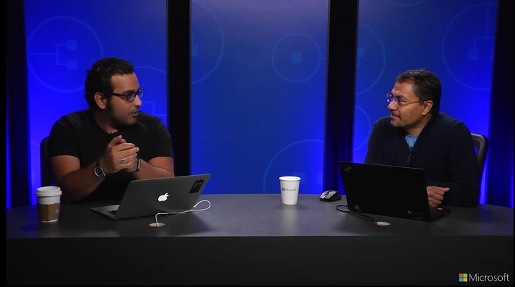
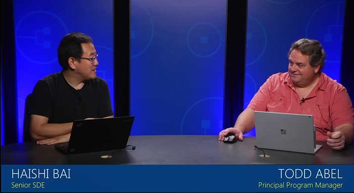
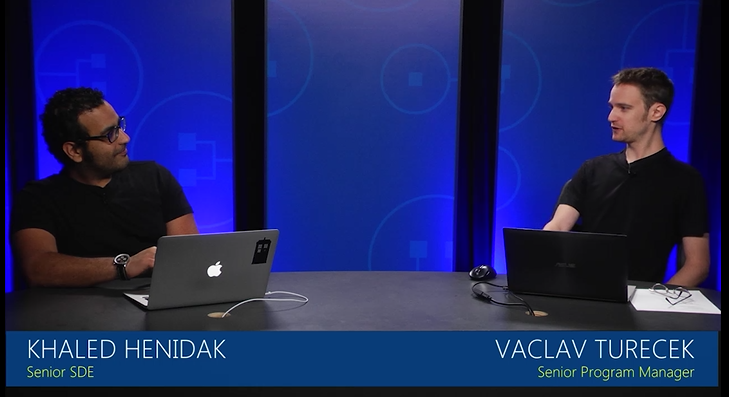
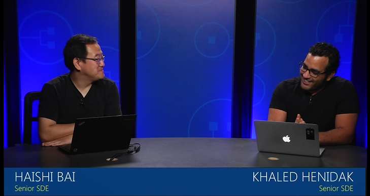
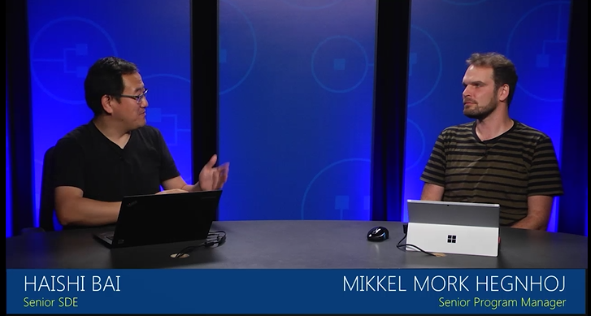
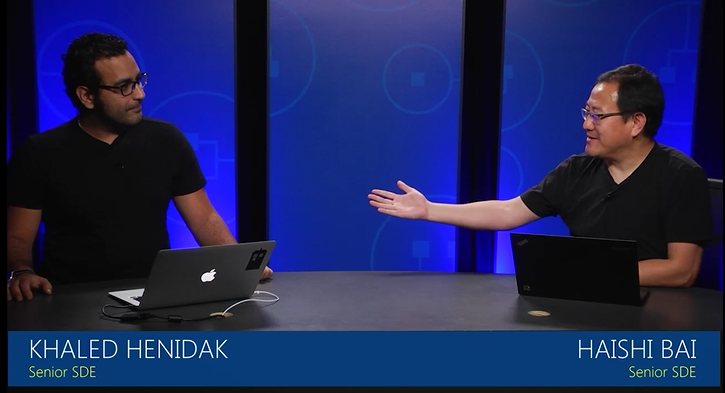

<properties
    pageTitle="Azure Service Fabric 模式和应用场景 | Azure"
    description="了解最佳做法和经验证的可重复使用的模式，以便在 Service Fabric 上设计、开发和操作你的微服务。"
    services="service-fabric"
    documentationcenter=".net"
    author="rwike77"
    manager="timlt" />
<tags
    ms.assetid="d5aa75ff-98b9-4573-a2e5-7f5ab288157a"
    ms.service="service-fabric"
    ms.devlang="dotnet"
    ms.topic="article"
    ms.tgt_pltfrm="NA"
    ms.workload="NA"
    ms.date="11/30/2016"
    wacn.date="01/20/2017"
    ms.author="ryanwi" />  

# Service Fabric 模式和应用场景
如果你正在寻求如何使用 Azure Service Fabric 构建大规模的微服务，那么可以向设计和构建平台即服务 (PaaS) 的专家咨询。从构建合适的体系结构开始，然后了解如何优化应用程序的资源。[Service Fabric 模式和实践](https://mva.microsoft.com/en-us/training-courses/service-fabric-patterns-and-practices-16925?l=mudwqISGD_6005167344)课程回答了实际客户最常询问的有关 Service Fabric 应用场景和应用领域的问题。
 
了解如何使用最佳做法和经验证的可重复使用的模式在 Service Fabric 上设计、开发和操作你的微服务。了解 Service Fabric 的基本知识，然后深入探讨相关主题，包括群集优化和安全性、迁移旧的应用、大规模的 IoT、托管游戏引擎等等。

## 介绍
探索最佳实践，并了解为何选择平台即服务 (PaaS)，而不选择基础结构即服务 (IaaS)。获取以下经过验证的应用程序设计原则的详细信息。

<table><tr><th>视频</th><th>PowerPoint 幻灯片</th></tr>
<tr><td></td><td><a target="_blank" href="https://mva.microsoft.com/en-us/training-courses/service-fabric-patterns-and-practices-16925?l=mudwqISGD_6005167344">Service Fabric 简介</a></td></tr>
</table>

## 群集规划和管理
了解容量规划、群集优化和群集安全性，从中认识 Azure Service Fabric。

<table><tr><th>视频</th><th>PowerPoint 幻灯片</th></tr>
<tr><td></td><td> <a target="_blank" href="https://mva.microsoft.com/en-us/training-courses/service-fabric-patterns-and-practices-16925?l=E5B3nJSGD_805167344">群集规划和管理</a></td></tr>
</table>

## 超大规模 web
查看有关超大规模 web 的概念，包括可用性和可靠性、超大规模和状态管理。

<table><tr><th>视频</th><th>PowerPoint 幻灯片</th></tr>
<tr><td></td><td><a target="_blank" href="https://mva.microsoft.com/en-us/training-courses/service-fabric-patterns-and-practices-16925?l=CPMLBLSGD_7705167344">超大规模 web</a></td></tr>
</table>

## IoT
探索 Azure Service Fabric 环境中的物联网 (IoT)，包括 Azure IoT 管道、多租户和大规模 IoT。

<table><tr><th>视频</th><th>PowerPoint 幻灯片</th></tr>
<tr><td></td><td><a target="_blank" href="https://mva.microsoft.com/en-us/training-courses/service-fabric-patterns-and-practices-16925?l=kfqFWMSGD_6205167344">IoT</a></td></tr>
</table>

## 游戏
了解基于轮次的游戏、交互式游戏和托管现有的游戏引擎。

<table><tr><th>视频</th><th>PowerPoint 幻灯片</th></tr>
<tr><td></td><td><a target="_blank" href="https://mva.microsoft.com/en-us/training-courses/service-fabric-patterns-and-practices-16925?l=kfqFWMSGD_6205167344">游戏</a></td></tr>
</table>

## 持续交付
探讨一些概念，包括使用 Visual Studio Team Services 的持续集成/持续交付、生成/打包/发布工作流、多环境安装和服务包/共享。

<table><tr><th>视频</th><th>PowerPoint 幻灯片</th></tr>
<tr><td></td><td><a target="_blank" href="https://mva.microsoft.com/en-us/training-courses/service-fabric-patterns-and-practices-16925?l=VlENvOSGD_105167344">持续交付</a></td></tr>
</table>

## 迁移
了解如何从云服务迁移，包括迁移旧应用。

<table><tr><th>视频</th><th>PowerPoint 幻灯片</th></tr>
<tr><td></td><td><a target="_blank" href="https://mva.microsoft.com/en-us/training-courses/service-fabric-patterns-and-practices-16925?l=GQAq4QSGD_8305167344">迁移</a></td></tr>
</table>

## 后续步骤
现在，你已了解 Service Fabric 模式和应用场景，请阅读有关如何[创建和管理群集](/documentation/articles/service-fabric-deploy-anywhere/)、[将云服务应用迁移到 Service Fabric](/documentation/articles/service-fabric-cloud-services-migration-worker-role-stateless-service/)和[设置持续交付](/documentation/articles/service-fabric-set-up-continuous-integration/)的详细信息。

<!---HONumber=Mooncake_0116_2017-->