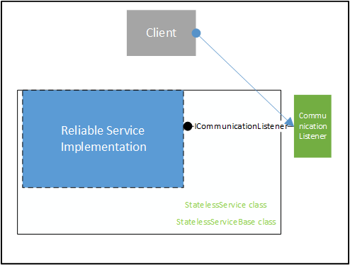

<properties
   pageTitle="可靠服务体系结构 | Azure"
   description="概述有状态和无状态服务的可靠服务体系结构"
   services="service-fabric"
   documentationCenter=".net"
   authors="AlanWarwick"
   manager="timlt"
   editor=""/>

<tags
   ms.service="Service-Fabric"
   ms.date="03/30/2016"
   wacn.date="07/04/2016"/>

# 有状态和无状态 Reliable Services 的体系结构

Azure Service Fabric 可靠服务可能有状态，也可能无状态。每种类型的服务都在特定的体系结构中运行。本文将介绍这些体系结构。有关有状态服务和无状态服务之间的区别的详细信息，请参阅 [Reliable Services 概述](/documentation/articles/service-fabric-reliable-services-introduction/)。

## 有状态的 Reliable Services

### 有状态服务的体系结构

### 有状态的 Reliable Service

有状态可靠服务可以从 StatefulService 或 StatefulServiceBase 类派生。这两个基类都由 Service Fabric 提供。它们可为有状态服务提供各种支持和抽象层级，以便与 Service Fabric 进行交互，并作为服务加入 Service Fabric 群集。

StatefulService 派生自 StatefulServiceBase。StatefulServiceBase 为服务提供更大的灵活性，但需要对 Service Fabric 内部运作有更多了解。
有关使用 StatefulService 和 StatefulServiceBase 类编写服务的细节的详细信息，请参阅 [Reliable Services 概述](/documentation/articles/service-fabric-reliable-services-introduction/)和 [Reliable Services 高级用法](/documentation/articles/service-fabric-reliable-services-advanced-usage/)。

这两个基类可管理服务实现的生存期和角色。如果服务实现需要在服务实现生命周期中的那些阶段执行操作或者想要创建通信侦听器对象，服务实现可能会重写任一基类的虚拟方法。请注意，尽管服务实现可以实现自己的通信侦听器对象来公开 ICommunicationListener，但在上图中，通信侦听器仍由 Service Fabric 实现，因为服务实现使用由 Service Fabric 实现的通信侦听器。

有状态可靠服务使用可靠状态管理器来利用可靠集合。可靠集合是对服务高度可用的本地数据结构，即，无论是否进行服务故障转移，一律可以使用。每种类型的 Reliable Collection 都由可靠状态提供程序实现。
有关可靠集合的详细信息，请参阅[可靠集合概述](/documentation/articles/service-fabric-reliable-services-reliable-collections/)。

### 可靠状态管理器和状态提供程序

可靠状态管理器是用于管理可靠状态提供程序的对象。它具有创建、删除、枚举和确保可靠状态提供程序持续保存且高度可用的功能。可靠状态提供程序实例代表持续保存且高度可用的数据结构的实例，比如字典或队列。

每个可靠状态提供程序公开一个接口，由有状态服务用于与可靠状态提供程序交互。例如，IReliableDictionary 用来与可靠字典交互，IReliableQueue 用来与可靠队列交互。所有可靠状态提供程序均实现 IReliableState 接口。

可靠状态管理器具有一个名为 IReliableStateManager 的接口，该接口允许从有状态服务访问。面向可靠状态提供程序的接口通过 IReliableStateManager 返回。

可靠状态管理器使用插件体系结构，因此可以动态地插入新的可靠集合类型。

可靠字典和可靠队列以高性能版本的差异存储实现为基础构建。

### 事务复制器

事务复制器组件负责确保服务的状态（即可靠状态管理器和可靠集合内的状态）跨运行服务的所有副本保持一致。它还确保该状态持久保存在日志中。可靠状态管理器通过私有机制与事务复制器交互。

事务复制器使用网络协议与服务实例的其他副本就状态进行通信，以便所有副本都具有最新的状态信息。

事务复制器使用日志保存状态信息，以便该状态信息在进程或节点崩溃后依然存在。与日志的交互通过私有机制进行。

### 日志

日志组件提供一个高性能的持久性存储，该存储可针对旋转磁盘或固态磁盘的写入进行优化。日志的设计方式是使持久性存储（例如硬盘）位于运行有状态服务的节点本地。与不是位于节点本地的远程持久性存储相比，这可以降低延迟并提高吞吐量。

日志组件使用多个日志文件。其中有一个所有副本都会使用的节点范围内共享日志文件，因为它可在存储状态数据时提供最低的延迟和最高的吞吐量。默认情况下，共享日志放在 Service Fabric 节点工作目录中，但它也可以配置为放在另一个位置上，最好是放在仅保留给共享日志的磁盘上。服务的每个副本还有一个专用的日志文件，该专用日志位于服务的工作目录中。系统不提供将专用日志配置为放在不同位置上的机制。

共享日志是副本状态信息的过渡区域，而专用日志文件则是其最终的保存目标位置。在此设计中，首先将状态信息写入共享日志文件，然后在后台延迟移到专用日志文件。通过这种方式，共享日志写入将具有最低的延迟和最高的吞吐量，以便让服务加快进度。

通过直接 IO 至磁盘上预先分配给共享日志文件的空间，完成共享日志的读取和写入。为了让专用日志能以最佳方式利用驱动器上的磁盘空间，专用日志文件会创建为 NTFS 稀疏文件。请注意，这将允许过度预配磁盘空间，因此，OS 将使用远超实际所用空间的磁盘空间显示专用日志文件。

除了为日志提供最精简的用户模式接口，还将以内核模式驱动程序的形式编写日志。通过以内核模式驱动程序的形式运行，日志可以为所有使用它的服务提供最高的性能。

有关配置日志的详细信息，请参阅[配置有状态 Reliable Services](/documentation/articles/service-fabric-reliable-services-configuration/)。

## 无状态的 Reliable Service

### 无状态服务的体系结构

### 无状态的 Reliable Service

无状态服务实现派生自 StatelessService 或 StatelessServiceBase 类。与 StatelessService 类相比，StatelessServiceBase 类可提供更大的灵活性。
这两个基类可管理服务的生存期和角色。

如果服务需要在服务生命周期中的那些阶段执行操作或者想要创建通信侦听器对象，服务实现可能会重写任一基类的虚拟方法。请注意，尽管服务可以实现自己的通信侦听器对象来公开 ICommunicationListener，但在上图中，通信侦听器仍由 Service Fabric 实现，因为该服务实现使用由 Service Fabric 实现的通信侦听器。

有关使用 StatelessService 和 StatelessServiceBase 类编写服务的详细信息，请参阅[可靠服务概述](/documentation/articles/service-fabric-reliable-services-introduction/)和[可靠服务高级用法](/documentation/articles/service-fabric-reliable-services-advanced-usage/)。

<!--Every topic should have next steps and links to the next logical set of content to keep the customer engaged-->
## 后续步骤

有关 Service Fabric 的详细信息，请参阅：

[Reliable Services 概述](/documentation/articles/service-fabric-reliable-services-introduction/)

[快速启动](/documentation/articles/service-fabric-reliable-services-quick-start/)

[可靠集合概述](/documentation/articles/service-fabric-reliable-services-reliable-collections/)

[Reliable Services 高级用法](/documentation/articles/service-fabric-reliable-services-advanced-usage/)

[Reliable Services 配置](/documentation/articles/service-fabric-reliable-services-configuration/)

<!---HONumber=Mooncake_0503_2016-->