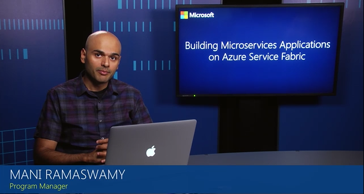

<properties
    pageTitle="在 Java 中创建第一个可靠的 Azure 微服务 | Azure"
    description="介绍如何创建包含无状态服务和有状态服务的 Azure Service Fabric 应用程序。"
    services="service-fabric"
    documentationcenter=".net"
    author="vturecek"
    manager="timlt"
    editor="" />
<tags
    ms.assetid="7831886f-7ec4-4aef-95c5-b2469a5b7b5d"
    ms.service="service-fabric"
    ms.devlang="java"
    ms.topic="article"
    ms.tgt_pltfrm="na"
    ms.workload="na"
    ms.date="02/10/2017"
    wacn.date="03/03/2017"
    ms.author="vturecek" />  

# Reliable Services 入门

> [AZURE.SELECTOR]
- [Windows 上的 C#](/documentation/articles/service-fabric-reliable-services-quick-start/)
- [Linux 上的 Java](/documentation/articles/service-fabric-reliable-services-quick-start-java/)

本文介绍 Azure Service Fabric Reliable Services 的基础知识，并演示如何创建和部署以 Java 编写的简单 Reliable Service 应用程序。此微软虚拟学院视频还说明如何创建无状态可靠服务：

## 安装和设置
在开始之前，请确保已在计算机上设置 Service Fabric 开发环境。如果需要设置环境，请转到[在 Mac 上开始使用](/documentation/articles/service-fabric-get-started-mac/)或[在 Linux 上开始使用](/documentation/articles/service-fabric-get-started-linux/)。

## 基本概念
了解几个基本概念，即可开始使用 Reliable Services：

 - **服务类型**：这是服务实现。它由你编写的可扩展 `StatelessService` 的类、其中使用的任何其他代码或依赖项以及名称和版本号定义。

 - **命名服务实例**：若要运行服务，需要创建服务类型的命名实例，就像创建类类型的对象实例一样。事实上，服务实例是编写的服务类的对象实例化。

 - **服务宿主**：创建的命名服务实例需在宿主中运行。服务宿主是可以运行服务实例的进程。

 - **服务注册**：通过注册可将所有对象融合在一起。只有在服务宿主中将服务类型注册 Service Fabric 运行时，Service Fabric 才能创建该类型的可运行实例。

## 创建无状态服务
首先创建 Service Fabric 应用程序。适用于 Linux 的 Service Fabric SDK 包括一个 Yeoman 生成器，它为包含无状态服务的 Service Fabric 应用程序提供基架。首先，请运行以下 Yeoman 命令：

	$ yo azuresfjava

按照说明创建**可靠无状态服务**。本教程将应用程序命名为“HelloWorldApplication”，将服务命名为“HelloWorld”。结果包含 `HelloWorldApplication` 和 `HelloWorld` 的目录。

	HelloWorldApplication/
	├── build.gradle
	├── HelloWorld
	│   ├── build.gradle
	│   └── src
	│       └── statelessservice
	│           ├── HelloWorldServiceHost.java
	│           └── HelloWorldService.java
	├── HelloWorldApplication
	│   ├── ApplicationManifest.xml
	│   └── HelloWorldPkg
	│       ├── Code
	│       │   ├── entryPoint.sh
	│       │   └── _readme.txt
	│       ├── Config
	│       │   └── _readme.txt
	│       ├── Data
	│       │   └── _readme.txt
	│       └── ServiceManifest.xml
	├── install.sh
	├── settings.gradle
	└── uninstall.sh

## 实现服务

打开 **HelloWorldApplication/HelloWorld/src/statelessservice/HelloWorldService.java**。此类定义服务类型，可以运行任何代码。服务 API 为你的代码提供两个入口点：

* 名为 `runAsync()` 的开放式入口点方法，可在其中开始执行任何工作负荷，包括长时间运行的计算工作负荷。

	@Override
	protected CompletableFuture<?> runAsync(CancellationToken cancellationToken) {
	    ...
	}

* 一个通信入口点，可在其中插入选择的通信堆栈。可在其中开始接收来自用户和其他服务的请求。

	@Override
	protected List<ServiceInstanceListener> createServiceInstanceListeners() {
	    ...
	}

在本教程中，我们重点介绍 `runAsync()` 入口点方法。可在其中立即开始运行代码。

### RunAsync
当服务实例已放置并且可以执行时，平台将调用此方法。对于无状态服务，这就意味着打开服务实例。需要关闭服务实例时，将提供取消标记进行协调。在 Service Fabric 中，服务的整个生存期内可能多次出现服务实例的这一打开-关闭循环。发生这种情况的原因多种多样，包括：

- 系统可能会移动服务实例以实现资源平衡。
- 代码中发生错误。
- 应用程序或系统升级。
- 基础硬件遇到中断。

Service Fabric 将管理此业务流程，以便保持服务的高度可用和适当均衡。

`runAsync()` 不应以同步方式阻止。RunAsync 实现应返回 CompletableFuture，以允许运行时继续执行。如果工作负荷需要实现应在 CompletableFuture 内部完成的长时间运行任务。

#### 取消
取消工作负荷是一项协同操作，由提供的取消标记进行协调。系统会等待任务结束（成功完成、取消或出现故障），然后再执行下一步操作。当系统请求取消时，请务必接受取消标记，完成所有任务，然后尽快退出 `runAsync()`。以下示例演示如何处理取消事件：

	    @Override
	    protected CompletableFuture<?> runAsync(CancellationToken cancellationToken) {

	        // TODO: Replace the following sample code with your own logic
	        // or remove this runAsync override if it's not needed in your service.

	        CompletableFuture.runAsync(() -> {
	          long iterations = 0;
	          while(true)
	          {
	            cancellationToken.throwIfCancellationRequested();
	            logger.log(Level.INFO, "Working-{0}", ++iterations);

	            try
	            {
	              Thread.sleep(1000);
	            }
	            catch (IOException ex) {}
	          }
	        });
	    }

### 服务注册

必须将服务类型注册到 Service Fabric 运行时。服务类型在 `ServiceManifest.xml` 中以及实现 `StatelessService` 的服务类中定义。服务注册在进程主入口点中执行。在本示例中，进程主入口点为 `HelloWorldServiceHost.java`：

	public static void main(String[] args) throws Exception {
	    try {
	        ServiceRuntime.registerStatelessServiceAsync("HelloWorldType", (context) -> new HelloWorldService(), Duration.ofSeconds(10));
	        logger.log(Level.INFO, "Registered stateless service type HelloWorldType.");
	        Thread.sleep(Long.MAX_VALUE);
	    } 
	    catch (Exception ex) {
        	logger.log(Level.SEVERE, "Exception in registration:", ex);
	        throw ex;
	    }
	}

## 运行应用程序
Yeoman 基架包含用于构建应用程序的 gradle 脚本，以及用于部署和取消部署应用程序的 bash 脚本。若要运行应用程序，请先使用 gradle 构建应用程序：

	$ gradle

这会生成可以使用 Service Fabric Azure CLI 部署的 Service Fabric 应用程序包。Install.sh 脚本包含用于部署应用程序包的 Azure CLI 命令。运行 install.sh 脚本进行部署：

	$ ./install.sh

<!---HONumber=Mooncake_0227_2017-->
<!--Update_Description: sample code update; add a MVA video-->