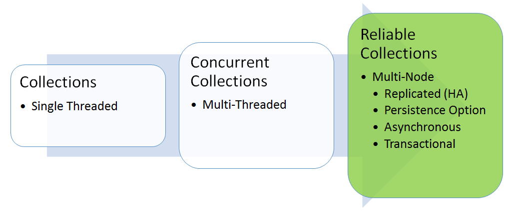

<properties
    pageTitle="在 Azure 微服务中保存应用程序状态 | Azure"
    description="Service Fabric 有状态服务提供可靠集合让你编写高度可用、可缩放且低延迟的云应用程序。"
    services="service-fabric"
    documentationcenter=".net"
    author="mcoskun"
    manager="timlt"
    editor="masnider,vturecek"
    translationtype="Human Translation" />
<tags
    ms.assetid="62857523-604b-434e-bd1c-2141ea4b00d1"
    ms.service="service-fabric"
    ms.devlang="dotnet"
    ms.topic="article"
    ms.tgt_pltfrm="na"
    ms.workload="required"
    ms.date="3/1/2017"
    wacn.date="04/24/2017"
    ms.author="mcoskun"
    ms.sourcegitcommit="a114d832e9c5320e9a109c9020fcaa2f2fdd43a9"
    ms.openlocfilehash="d8d4cc1fa8c6dc81be8b6bf274bacf192ba30c1b"
    ms.lasthandoff="04/14/2017" />

# Azure Service Fabric 有状态服务中的可靠集合简介
可靠集合可让你编写高度可用、可缩放且低延迟的云应用程序，就像编写单计算机应用程序一样。 **Microsoft.ServiceFabric.Data.Collections** 命名空间中的类提供一组自动使状态具备高可用性的全新集合。 开发人员只需面向可靠集合 API 编程，并让可靠集合管理复制状态和本地状态。

Reliable Collections 与其他高可用性技术（如 Redis、Azure 表服务和 Azure 队列服务）的主要区别在于其状态以本地方式保存在服务实例中，同时仍实现高可用性。 这意味着：

* 所有读取均在本地进行，可保障读取的低延迟和高吞吐量。
* 所有写入都只产生最少量的网络 IO，可保障写入的低延迟和高吞吐量。

可以将可靠集合视作 **System.Collections** 类的自然演变：它们是一组新的集合，专为云应用程序和多计算机应用程序设计，且不会为开发人员增加复杂性。 因此，可靠集合的特性如下：

* 可复制：复制状态更改以实现高可用性。
* 可保存：数据会保存至磁盘，可在发生大规模中断（例如，数据中心断电）时保障持续性。
* 异步：API 采用异步模式，以确保在产生 IO 时不会阻止线程。
* 事务性：API 利用事务抽象方法，让你可以在某个服务内轻松管理多个可靠集合。

Reliable Collections 提供全新的非常一致保证，使应用程序状态推断变得更轻松。
非常一致通过以下方法实现：确保仅对副本的多数仲裁（包括主副本）记录整个事务后，才完成事务提交。
若要实现较弱的一致性，应用程序可以在异步提交返回之前，回头向客户端/请求者进行确认。

可靠集合 API 由并发集合 API（位于 **System.Collections.Concurrent** 命名空间中）演变而来：

* 异步：返回任务；不同于并发集合，其操作会受到复制及保存。
* 没有 out 参数：使用 `ConditionalValue<T>` 返回布尔值和值，而不是返回 out 参数。 `ConditionalValue<T>` 与 `Nullable<T>` 类似，但不要求 T 是一个 struct。
* 事务：使用事务对象，让用户可以对事务中多个 Reliable Collections 上的操作分组。

目前， **Microsoft.ServiceFabric.Data.Collections** 包含两个集合：

* [Reliable Dictionary](https://msdn.microsoft.com/zh-cn/library/azure/dn971511.aspx)：表示可复制、事务性和异步的键/值对集合。 类似于 **ConcurrentDictionary**，键和值都可以是任何类型。
* [可靠队列](https://msdn.microsoft.com/zh-cn/library/azure/dn971527.aspx)：表示可复制、事务性和异步的严格先进先出 (FIFO) 队列。 类似于 **ConcurrentQueue**，值可以是任何类型。

## 隔离级别
隔离级别定义必须从其他事务所作修改中隔离事务的程度。
Reliable Collections 支持两种隔离级别：

* **可重复的读取**：指定语句不能读取已由其他事务修改但尚未提交的数据，并且指定，其他任何事务都不能在当前事务完成之前修改由当前事务读取的数据。 有关详细信息，请参阅 [https://msdn.microsoft.com/zh-cn/library/ms173763.aspx](https://msdn.microsoft.com/zh-cn/library/ms173763.aspx)。
* **快照**：指定事务中任何语句读取的数据都将是事务开始时便存在的数据的事务上一致的版本。
  事务只能识别在其开始之前提交的数据修改。
  在当前事务中执行的语句将看不到在当前事务开始以后由其他事务所做的数据修改。
  其效果就好像事务中的语句获得了已提交数据的快照，因为该数据在事务开始时就存在。
  快照跨 Reliable Collections 一致。
  有关详细信息，请参阅 [https://msdn.microsoft.com/zh-cn/library/ms173763.aspx](https://msdn.microsoft.com/zh-cn/library/ms173763.aspx)。

Reliable Collections 将在事务创建时根据副本的操作和角色，为指定读取操作自动选择要使用的隔离级别。
下表描述了用于 Reliable Dictionary 和 Reliable Queue 操作的默认隔离级别。

| 操作\角色 | 主要 | 辅助 |
| --- |:--- |:--- |
| 单个实体读取 |可重复的读取 |快照 |
| 枚举\计数 |快照 |快照 |

> [AZURE.NOTE]
> 单个实体操作的常见示例为 `IReliableDictionary.TryGetValueAsync`、`IReliableQueue.TryPeekAsync`。
> 
> 

Reliable Dictionary 和 Reliable Queue 都支持“读取你的写入”。
换而言之，事务中的任何写入都将对属于同一事务的后续读取可见。

## 锁定
在可靠集合中，所有事务都分为两个阶段：在以中止或提交操作终止事务之前，该事务不会释放所获取的锁。

Reliable Dictionary 对所有单个实体操作使用行级别锁定。
Reliable Queue 权衡严格事务性 FIFO 属性的并发。
Reliable Queue 使用操作级别锁，允许具有 `TryPeekAsync` 和/或 `TryDequeueAsync` 的事务与具有 `EnqueueAsync` 的事务同时进行。
请注意，为保留 FIFO，如果 `TryPeekAsync` 或 `TryDequeueAsync` 曾观察到 Reliable Queue 为空，则它们将锁定 `EnqueueAsync`。

写入操作始终采用排他锁。
对于读取操作，锁定取决于几个因素。
使用快照隔离完成的任何读取操作都是无锁定的。
任何可重复读取操作默认情况下均采用共享锁。
但是，对于任何支持可重复读取的读取操作，用户可以要求使用更新锁而非共享锁。
更新锁是一种非对称锁，用于防止当多个事务为随后可能进行的更新锁定资源时发生常见的死锁。

锁兼容性矩阵如下所示：

| 请求\授予 | 无 | 共享 | 更新 | 排他 |
| --- |:--- |:--- |:--- |:--- |
| 共享 |无冲突 |无冲突 |冲突 |冲突 |
| 更新 |无冲突 |无冲突 |冲突 |冲突 |
| 排他 |无冲突 |冲突 |冲突 |冲突 |

请注意，Reliable Collections API 中的超时参数可用作死锁检测。
例如，两个事务（T1 和 T2）正在尝试读取和更新 K1。
它们有可能发生死锁，因为它们最后都拥有共享锁。
在这种情况下，其中一个操作或两个操作都将超时。

请注意，上面的死锁方案很好地说明了更新锁可如何防止死锁。

## 持久性模型
可靠状态管理器和 Reliable Collections 都遵循一个名为“日志和检查点”的持久性模型。
在该模型中，每个状态更改都将记录在磁盘上，并且仅应用于内存中。
仅在某些时候保存自身的完整状态（又称 检查点）。
其优点是增量转变成磁盘上只能追加的顺序写入，从而提高了性能。

为了更好地了解“日志和检查点”模型，我们先来看一下无限磁盘方案。
可靠状态管理器在复制操作之前记录每个操作。
这样，可靠服务只需应用内存中的操作。
由于保存了日志，因此，即使副本出现故障并且需要重新启动，可靠状态管理器在其日志中也有足够的信息来重播副本丢失的所有操作。
由于磁盘无限大，因此，永远不需要删除日志记录，可靠集合只需管理内存中的状态。

现在让我们看一下有限磁盘方案。
随着日志记录的累积，可靠状态管理器将耗尽磁盘空间。
在这种情况出现之前，可靠状态管理器需截断其日志，以便为较新的记录腾出空间。
它将请求可靠集合在磁盘中添加其内存中状态的检查点。
Reliable Collections 负责保存到该点为止的状态。
在 Reliable Collections 完成其检查点后，可靠状态管理器便可以截断日志以释放磁盘空间。
这样一来，当副本需要重新启动时，Reliable Collections 将恢复其检查点状态，而可靠状态管理器将恢复并播放自该检查点以来发生的所有状态更改。

> [AZURE.NOTE]
> 检查点的另一增值优点在于它可提高常见情况下的恢复性能。
> 这是因为检查点仅包含最新版本。
> 
> 

## 建议
* 切勿修改读取操作返回的自定义类型的对象（例如 `TryPeekAsync` 或 `TryGetValueAsync`）。 Reliable Collections 与 Concurrent Collections 一样，将返回对这些对象的引用，而非副本。
* 在修改返回的自定义类型的对象之前，务必对其进行深层复制。 由于结构和内置类型均按值传递，因此无需对其进行深层复制。
* 切勿对超时值使用 `TimeSpan.MaxValue` 。 应使用超时值来检测死锁。
* 切勿在已提交、中止或释放一个事务之后使用该事务。
* 切勿在对其创建的事务范围之外使用枚举。
* 切勿在另一个事务的 `using` 语句内创建事务，因为它可能会导致死锁。
* 务必确保您的 `IComparable<TKey>` 实现是正确的。 系统采用其上的依赖关系以合并检查点。
* 意图更新某项而读取该项时，切勿更新锁以防止出现某类死锁。
* 请考虑使用备份和还原功能进行灾难恢复。
* 避免在同一事务中混合使用单个实体操作和多个实体操作（例如 `GetCountAsync`、`CreateEnumerableAsync`），因为它们的隔离级别不同。
* 务必处理 InvalidOperationException。 系统可能出于各种原因中止用户事务。 例如，当可靠状态管理器将其角色从“主要”更改为其他角色时，或者当长时间运行的事务阻止截断事务日志时。 在这类情况下，用户可能会收到 InvalidOperationException，指示其事务已终止。 假设用户未请求终止事务，那么，处理此异常的最佳方式是释放事务，然后检查是否发出了取消令牌（或者是否更改了副本的角色），如果没有，则创建新的事务并重试。  

需谨记以下几点：

* 所有可靠集合 API 的默认超时值均为 4 秒。 大多数用户不应重写此值。
* 所有 Reliable Collections API 中的默认取消标记均为 `CancellationToken.None`。
* 可靠字典的键类型参数 (*TKey*) 必须正确实现 `GetHashCode()` 和 `Equals()`。 键必须不可变。
* 若要实现 Reliable Collections 的高可用性，每个服务应至少有一个目标，并且最小副本集大小必须为 3。
* 针对辅助副本的读取操作可能会读取未提交仲裁的版本。
  这意味着从单个辅助副本读取的数据版本可能被错误处理。
  当然，从主副本读取的数据将始终是可靠的，绝不会被错误处理。

## 后续步骤
* [Reliable Services 快速启动](/documentation/articles/service-fabric-reliable-services-quick-start/)
* [使用可靠集合](/documentation/articles/service-fabric-work-with-reliable-collections/)
* [Reliable Services 通知](/documentation/articles/service-fabric-reliable-services-notifications/)
* [Reliable Services 备份和还原（灾难恢复）](/documentation/articles/service-fabric-reliable-services-backup-restore/)
* [可靠状态管理器和配置](/documentation/articles/service-fabric-reliable-services-configuration/)
* [Service Fabric Web API 服务入门](/documentation/articles/service-fabric-reliable-services-communication-webapi/)
* [Reliable Services 编程模型的高级用法](/documentation/articles/service-fabric-reliable-services-advanced-usage/)
* [Reliable Collections 的开发人员参考](https://msdn.microsoft.com/zh-cn/library/azure/microsoft.servicefabric.data.collections.aspx)
<!--Update_Description:wording update;add anchors to sub titles-->