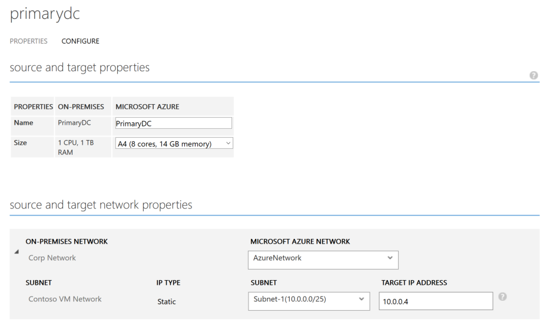

<properties
	pageTitle="使用 Azure Site Recovery 保护 Active Directory 和 DNS | Azure" 
	description="本文介绍如何使用 Azure Site Recovery 为 Active Directory 实现灾难恢复解决方案。" 
	services="site-recovery" 
	documentationCenter="" 
	authors="prateek9us" 
	manager="abhiag" 
	editor=""/>

<tags 
	ms.service="site-recovery"
	ms.date="05/10/2016"
	wacn.date="06/06/2016"/>

# 使用 Azure Site Recovery 保护 Active Directory 和 DNS

企业应用程序，例如 SharePoint, Dynamics AX 和 SAP，都依赖于 Active Directory 和 DNS 基础结构才能正常工作。在为应用程序创建灾难恢复解决方案时，请务必记住，需要先保护和恢复 Active Directory 与 DNS，再保护和恢复其他应用程序组件，以确保灾难发生时一切可正常工作。

站点恢复是一项 Azure 服务，可提供灾难恢复，对虚拟机的复制、故障转移和恢复进行协调。站点恢复支持一系列复制方案，可以前后一致地对虚拟机和应用程序进行保护和无缝故障转移，转移目标是私有云/公有云或托管商的云。

使用站点恢复，你可以为 Active Directory 创建一个完整的自动化灾难恢复计划。在出现中断时，你可以在数秒内从任何位置启动故障转移，在数分钟内启动和运行 Active Directory。如果你为主站点中的多个应用程序（如 SharePoint 和 SAP）部署了 Active Directory，而且希望故障转移整个站点，则可先使用站点恢复故障转移 Active Directory，然后再使用特定于应用程序的恢复计划故障转移其他应用程序。

本文说明了如何为 Active Directory 创建灾难恢复解决方案，以及如何通过一键式恢复计划执行计划内、计划外和测试故障转移，同时还说明了支持的配置和先决条件。在开始之前，你应该熟悉 Active Directory 和 Azure Site Recovery。

根据环境的复杂性，可以使用两个建议的选项。

### 选项 1

如果你有少量的应用程序和单个域控制器，而且你想要故障转移整个站点，则我们建议你使用站点恢复将域控制器复制到辅助站点（不管是要故障转移到 Azure 还是辅助站点）。同一台复制的虚拟机也可以用于测试故障转移。

### 方法 2

如果你有大量的应用程序，而环境中有不止一个域控制器，或者你计划一次性故障转移多个应用程序，则我们建议，除了使用站点恢复复制域控制器虚拟机以外，还在目标站点（Azure 或本地数据中心）上设置附加的域控制器。

>[AZURE.NOTE]即使你实施第 2 个选项来运行测试故障转移，仍然需要使用站点恢复来复制域控制器。有关详细信息，请详阅[测试故障转移注意事项](#considerations-for-test-failover)。

以下部分说明了如何在站点恢复中为域控制器启用保护，以及如何在 Azure 中设置域控制器。

## 先决条件

- 已在本地部署 Active Directory 和 DNS 服务器。
- Azure 订阅中有一个 Azure Site Recovery 服务保管库 
- 如果要复制到 Azure，请在 VM 上运行 Azure 虚拟机就绪状态评估工具，以确保这些 VM 与 Azure VM 和 Azure Site Recovery 服务兼容。

## 使用站点恢复启用保护

### 保护虚拟机

在站点恢复中启用域控制器/DNS 虚拟机的保护。根据虚拟机类型（Hyper-V 或 VMware）配置站点恢复。我们建议配置 15 分钟的崩溃一致性复制频率。

###配置虚拟机网络设置

对于域控制器/DNS 虚拟机，请在站点恢复中配置网络设置，以便在故障转移后将 VM 连接到正确的网络。例如，如果将 Hyper-V VM 复制到 Azure，你可以按如下所示选择 VMM 云或保护组中的 VM 以配置网络设置

## 使用 Active Directory 复制保护 Active Directory 

### 站点到站点保护

将服务器提升为域控制器角色时，请在辅助站点上创建一个域控制器，并为它指定主站点使用的同一个域名。你可以使用 **Active Directory 站点和服务**管理单元来配置站点要添加到的站点链接对象的设置。通过在站点链接上配置设置，你可以控制何时在两个或两个以上站点之间进行复制，以及复制的频率。有关详细信息，请参阅[计划站点之间的复制](https://technet.microsoft.com/zh-cn/library/cc731862.aspx)。

###站点到 Azure 的保护

遵照说明[在 Azure 虚拟网络中创建域控制器](/documentation/articles/virtual-network-install-replica-active-directory-domain-controller/)。将服务器提升为域控制器角色时，请指定主站点中使用的同一域名。

然后，[重新配置虚拟网络的 DNS 服务器](/documentation/articles/virtual-network-install-replica-active-directory-domain-controller/#reconfigure-dns-server-for-the-virtual-network)，以便在 Azure 中使用 DNS 服务器。
  

##测试故障转移注意事项

测试故障转移发生在独立于生产网络的网络中，因此对生产工作负荷没有影响。

大多数应用程序还需要域控制器和 DNS 服务器存在，因此在应用程序故障转移之前，需要在隔离的网络中创建域控制器以用于测试故障转移。若要这样做，最简单的方法是在运行应用程序恢复计划的测试故障转移之前，先使用站点恢复在域控制器/DNS 虚拟机上启用保护，然后对该虚拟机运行测试故障转移。下面介绍了操作方法：

1. 在站点恢复中为域控制器/DNS 虚拟机启用保护。
2. 创建独立的网络。默认情况下，在 Azure 中创建的任何虚拟网络都是独立于其他网络的。建议将此网络的 IP 地址范围设置为与生产网络相同。不要在此网络上启用站点到站点连接。
3. 提供创建的网站的 DNS IP 地址作为 DNS 虚拟机应该获取的 IP 地址。如果要复制到 Azure，请在 VM 属性的“目标 IP”中提供 VM 的 IP 地址用于故障转移。如果要复制到其他本地站点并使用 DHCP，请遵照说明来[针对测试故障转移设置 DNS 和 DHCP](/documentation/articles/site-recovery-failover/#prepare-dhcp) 

>[AZURE.NOTE]如果 IP 地址可用于测试故障转移网络，则在测试故障转移期间分配给虚拟机的 IP 地址与在运行计划或非计划的故障转移时获取的 IP 地址相同。如果该 IP 地址不可用，则虚拟机收到的 IP 地址与测试故障转移网络中提供的 IP 地址不同。

4. 在域控制器虚拟机上，在隔离的网络中对它运行测试故障转移。 
5. 运行应用程序恢复计划的测试故障转移。
6. 测试完成后，在站点恢复门户的“作业”选项卡中将针对域控制器虚拟机作业和恢复计划进行的故障转移标记为“完成”。 

### 不同计算机上的 DNS 和域控制器
 
如果 DNS 与域控制器不在同一个虚拟机上，则需创建一个可以进行测试性故障转移的 DNS VM。如果它们位于同一 VM 上，则可跳过本部分。

你可以使用全新的 DNS 服务器并创建所有需要的区域。例如，如果你的 Active Directory 域是 contoso.com，则可以使用名称 contoso.com 创建 DNS 区域。必须在 DNS 中更新与 Active Directory 对应的条目，如下所示：

1. 确保在恢复计划中的任何其他虚拟机到位之前，以下设置已准备就绪：

	- 区域必须以林根名称命名。
	- 区域必须备份文件。
	- 必须启用区域以进行安全和非安全更新。
	- 域控制器虚拟机的解析程序应指向 DNS 虚拟机的 IP 地址。

2. 在域控制器虚拟机目录中运行以下命令：

	`nltest /dsregdns`

3. 在 DNS 服务器上添加一个区域，允许非安全更新，并向 DNS 添加该区域的条目：

	    dnscmd /zoneadd contoso.com  /Primary 
	    dnscmd /recordadd contoso.com  contoso.com. SOA %computername%.contoso.com. hostmaster. 1 15 10 1 1 
	    dnscmd /recordadd contoso.com %computername%  A <IP_OF_DNS_VM> 
	    dnscmd /config contoso.com /allowupdate 1

## 后续步骤

阅读[我可以保护哪些工作负荷？](/documentation/articles/site-recovery-workload/)，详细了解如何使用 Azure Site Recovery 保护企业工作负荷。

<!---HONumber=Mooncake_0530_2016-->