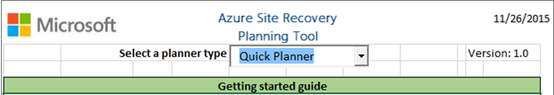
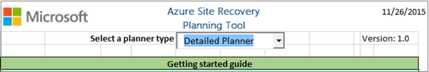

<properties
	pageTitle="在 Azure Site Recovery 中规划用于保护虚拟机和物理服务器的容量 | Azure"
	description="Azure Site Recovery 可以协调位于本地的虚拟机和物理服务器到 Azure 或辅助本地站点的复制、故障转移和恢复。" 
	services="site-recovery" 
	documentationCenter="" 
	authors="rayne-wiselman" 
	manager="jwhit" 
	editor=""/>

<tags 
	ms.service="site-recovery" 
	ms.date="02/22/2016" 
	wacn.date="05/31/2016"/>

# 在 Azure Site Recovery 中规划虚拟机容量和物理服务器保护

Azure Site Recovery Capacity Planner 工具可帮助你确定通过 Azure Site Recovery 保护 Hyper-V VM、VMware VM 和 Windows/Linux 物理服务器时的容量要求。

## 概述

使用 Site Recovery Capacity Planner 可以分析你的源环境和工作负荷，并且可以确定带宽需求、源位置所需的服务器资源，以及目标位置所需的资源（虚拟机和存储等）。

可以通过多种模式运行该工具：

- **快速规划**：在此模式下运行该工具时，可以根据 VM 平均数、磁盘、存储和更改率来获取网络和服务器投影。
- **详细规划**：在此模式下运行该工具时，可以提供 VM 级别每个工作负荷的详细信息。分析 VM 兼容性，获取网络和服务器投影。

## 开始之前

运行该工具之前，请执行以下操作：

1. 收集环境信息，包括 VM 数、每个 VM 的磁盘数、每个磁盘的存储空间。
2. 确定已复制数据的每日更改（改动）率。为此，请按以下步骤操作：

	- 如果你是在复制 Hyper-V VM，则可下载 [Hyper-V 容量规划工具](https://www.microsoft.com/download/details.aspx?id=39057)来获取更改率。[详细了解](/documentation/articles/site-recovery-capacity-planning-for-hyper-v-replication/)此工具。我们建议你运行此工具一周以上的时间以获取平均值。
	- 如果你是在复制 VMware 虚拟机，则可使用 [vSphere 容量规划工具](https://labs.vmware.com/flings/vsphere-replication-capacity-planning-appliance)来计算改动率。
	- 如果你是在复制物理服务器，则需手动进行估算。

## 运行快速规划器
1.	下载并打开 [Azure Site Recovery 容量规划器](http://aka.ms/asr-capacity-planner-excel)工具。你需要运行宏，因此在系统提示你启用编辑功能和启用内容时，请选择执行相应的操作。 
2.	在“选择规划器类型”中，从列表框选择“快速规划器”。

	

3.	在“容量规划器”工作表中输入所需信息。你必须填写以下屏幕快照中标有红圈的所有字段。

	- 在“选择你的方案”中，选择“Hyper-V 到 Azure”或“VMware/物理设备到 Azure”。
	- 在“平均每日数据更改率(%)”中输入你使用 [Hyper-V 容量规划工具](/documentation/articles/site-recovery-capacity-planning-for-hyper-v-replication/)或 [vSphere 容量规划工具](https://labs.vmware.com/flings/vsphere-replication-capacity-planning-appliance)收集的信息。  
	- “压缩”仅适用于将 VMware VM 或物理服务器复制到 Azure 时提供的压缩。我们的估计值是 30% 或以上，不过你可以根据需要修改此设置。将 Hyper-V VM 复制到 Azure 时，如果需要进行压缩，你可以使用第三方工具，例如 Riverbed。 
	-  在“保留输入”中，指定副本的保留时间。如果你复制的是 VMware 或物理服务器，则请输入天数值。如果你复制的是 Hyper-V，则请以小时为单位指定时间。
	-  在“完成成批虚拟机的初始复制所需的小时数”和“初始复制批处理的虚拟机数”中，你可以输入用于计算初始复制要求的设置。部署 Site Recovery 时，应上载整个初始数据集。 

	

2.	输入源环境的值以后，显示的输出将包括：

	- **增量复制所需的带宽**(MB/秒)。根据每日数据更改率的平均值计算增量复制的网络带宽。
	- **初始复制所需的带宽**(MB/秒)。根据你输入的初始复制值计算初始复制的网络带宽。 
	- **所需存储空间(GB)**：即所需的总 Azure 存储空间。
	- **标准存储帐户的总 IOPS** 是根据所有标准存储帐户的 8K IOPS 单元大小计算的。对于快速规划器，该数字根据所有源 VM 磁盘数以及每日数据更改率来计算。对于详细规划器，该数字根据映射到标准 Azure VM 的 VM 总数以及这些 VM 的数据更改率来计算。 
	- **标准存储帐户数**提供对 VM 进行保护所需的标准存储帐户的总数。请注意，标准存储帐户最高可以在所有 VM 的标准存储中支持 20000 IOPS，每个磁盘支持的最大IOPS 为 500。 
	- **所需 blob 磁盘数**给出了将要在 Azure 存储空间中创建的磁盘数。
	- **所需高级存储帐户数**提供对 VM 进行保护所需的高级存储帐户的总数。请注意，IOPS 较高（高于 20000）的源 VM 需要高级存储帐户。高级存储帐户最高可支持 80000 IOPS。
	- **高级存储的总 IOPS** 根据高级存储帐户总数按 256K 的 IOPS 单元大小来计算。对于快速规划器，该数字根据所有源 VM 磁盘数以及每日数据更改率来计算。对于详细规划器，该数字根据映射到高级 Azure VM（DS 系列）的 VM 总数以及这些 VM 的数据更改率来计算。 
	- **所需配置服务器数**显示需要多少个配置服务器才能完成该部署 (1)
	- **所需其他进程服务器数**显示除了在配置服务器上默认配置的进程服务器，是否还需要其他进程服务器。
	- **100% 源的其他存储**显示源位置是否需要其他存储。
			
	
 
## 运行详细规划器

1.	下载并打开 [Azure Site Recovery 容量规划器](https://gallery.technet.microsoft.com/Azure-Recovery-Capacity-d01dc40e)工具。你需要运行宏，因此在系统提示你启用编辑功能和启用内容时，请选择执行相应的操作。 
2.	在“选择规划器类型”中，从列表框选择“详细规划器”。

	

3.	在“工作负荷限定”工作表中输入所需的信息。必须填写所有标记的字段。

	- 在“处理器内核数”中指定源服务器上的内核总数。
	- 在“内存分配(MB)”中指定源服务器的 RAM 大小。 
	- **NIC 数**：指定源服务器上的网络适配器数。 
	-  在“总存储空间(GB)”中指定 VM 存储空间的总大小。例如，如果源服务器有 3 个磁盘，每个磁盘的大小为 500 GB，则总的存储空间大小为 1500 GB。
	-  在“附加磁盘数”中指定源服务器的磁盘总数。
	-  在“磁盘容量使用率”中指定平均使用率。
	-  在“每日更改率(%)”中指定源服务器的每日数据更改率。
	-  在“映射 Azure 大小”中输入你想要映射的 Azure VM 大小。如果你不想手动执行此操作，请单击“计算 IaaS VM”。请注意，如果你先输入手动设置，然后单击“计算 IaaS VM”，系统可能会覆盖你的手动设置，因为计算流程会自动确定 Azure VM 大小的最佳匹配项。

	

4.	如果你单击“计算 IaaS VM”，则会执行以下操作：

	- 验证必需的输入。
	- 计算 IOPS，并为每个可以复制到 Azure 的 VM 提供最佳 Azure VM 大小匹配项的建议。如果系统检测不到合适的 Azure VM 大小，则会发出错误消息。例如，如果附加的磁盘数为 65，则会发出错误消息，因为 Azure VM 的最大大小为 64。
	- 建议一个适用于 Azure VM 的存储帐户。
	- 计算工作负荷所需的标准存储帐户和高级存储帐户的总数。在右侧向下滚动，以便查看适用于源服务器的 Azure 存储类型和存储帐户
	- 根据为 VM 分配的所需存储类型（标准或高级）以及附加磁盘数完成表的其余部分并对其排序。所有能够备份到 Azure 的 VM 的 A 列（VM 是否符合资格?）都会显示“是”。如果 VM 无法备份到 Azure，则会显示错误。

AA 到 AE 列为输出，提供的是每个 VM 的信息。

### 示例
例如，如果有 6 个 VM，其值如表中所示，该工具会计算和分配最佳 Azure VM 匹配项以及 Azure 存储需求。

- 在该示例的输出中，请注意以下问题：
	
	- 第一列是用于 VM、磁盘和改动的验证列。
	- 5 个 VM 需要 2 个标准存储帐户和 1 个高级存储帐户。 
	-  VM3 不符合受保护资格，因为一个或多个磁盘大于 1 TB。
	-  VM1 和 VM2 可以使用第一个标准存储帐户。
	-  VM4 可以使用第二个标准存储帐户。
	-  VM5 和 VM6 需要高级存储帐户，并且都可以使用单个帐户。

	>[AZURE.NOTE]  标准存储和高级存储的 IOPS 在 VM 级别而非磁盘级别进行计算。标准虚拟机最多可处理每个磁盘 500 IOPS。如果磁盘的 IOPS 大于 500，则需要高级存储。不过，如果某个磁盘的 IOPS 超出 500 但所有 VM 磁盘的 IOPS 仍在标准 Azure VM 的支持范围（VM 大小、磁盘数、适配器数、CPU、内存）内，则规划器会选取标准 VM 而不是 DS 系列。你将需要使用相应的 DS 系列 VM 来手动更新“映射 Azure 大小”单元格。

5. 输入所有详细信息以后，单击“将数据提交到规划器工具”以打开“容量规划器”。工作负荷会突出显示，以表明其是否符合受保护资格。

### 在容量规划器中提交数据

1.	当你打开“容量规划器”工作表时，该表会根据你所指定的设置进行填充。“工作负荷”一词会出现在“基础输入源”单元格中，用来表示输入的“工作负荷限定”工作表。 
2.	如果你想要进行更改，则需修改“工作负荷限定”工作表，然后再次单击“将数据提交到规划器工具”。  

	

<!---HONumber=Mooncake_0328_2016-->