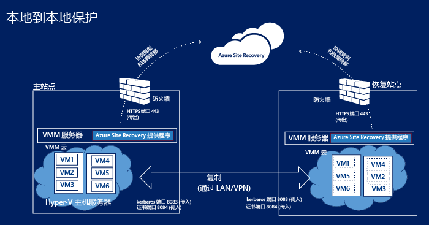
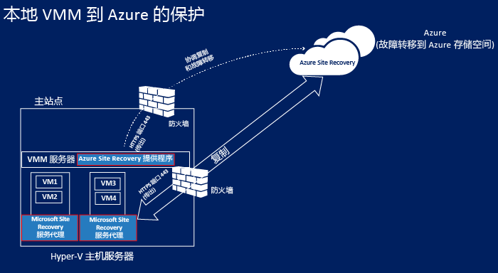
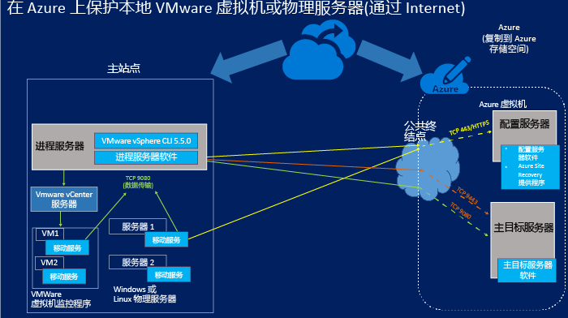

<properties
	pageTitle="站点恢复组件" 
	description="本文概述站点恢复组件以及如何管理这些组件" 
	services="site-recovery"
	documentationCenter=""
	authors="rayne-wiselman"
	manager="jwhit"
	editor=""/>

<tags
	ms.service="site-recovery"
	ms.date="07/09/2015"
	wacn.date="10/03/2015"/>

# 站点恢复组件

Azure 站点恢复 有助于业务连续性和灾难恢复 (BCDR) 策略，因为它可以安排复制、故障转移和恢复虚拟机和物理服务器。虚拟机可复制到 Azure 中，也可复制到本地数据中心中。[阅读概述](/documentation/articles/site-recovery-overview)。

本文总结并介绍了在服务器和虚拟机中安装的 站点恢复 组件。

您可以在 [Azure 恢复服务论坛](https://social.msdn.microsoft.com/Forums/zh-cn/home?forum=hypervrecovmgr)上发布有关本文的任何问题。

## 概述

根据保护方案，站点恢复 组件将略有不同。

### 通过 VMM 在两个数据中心之间提供保护

**方案** | **说明** | **所需的组件** | **详细信息**
--- | --- | --- | ---
您部署 Azure 站点恢复以在两个数据中心之间复制虚拟机 | 
每个数据中心都有一个 VMM 服务器

每个 VMM 服务器都有一个私有云，其中包含一个或多个 Hyper-V 主机服务器以及您想要保护的虚拟机
 | 将在这两个 VMM 服务器上安装 Azure 站点恢复 提供程序 | 
Hyper-V 主机服务器或受保护的虚拟机上没有安装组件

VMM 服务器上的 Azure 站点恢复 提供程序通过 HTTPS 443 与 站点恢复 服务进行通信，以安排保护

在端口 8083 和 8084 上使用 Kerberos 和证书身份验证通过 Internet 在主要和辅助 Hyper-V 主机服务器之间进行复制。

### 通过 VMM 和 Azure 在数据中心之间提供保护

**方案** | **说明** | **所需的组件** | **详细信息**
--- | --- | --- | ---
您部署 Azure 站点恢复以在数据中心和 Azure 之间复制虚拟机 | 
本地数据中心的一个 VMM 服务器具有一个私有云包含一个或多个 Hyper-V 主机服务器，其中具有您要保护的虚拟机
 | 
将在 VMM 服务器上安装 Azure 站点恢复提供程序

将在源 Hyper-V 主机服务器上安装 Microsoft 恢复服务代理
 | 
受保护的虚拟机上没有安装组件

VMM 服务器上的 Azure 站点恢复提供程序通过 HTTPS 443 与 站点恢复 服务进行通信，以安排保护

通过 HTTPS 443 在源 Hyper-V 主机服务器上运行的 Microsoft 恢复服务代理与 Azure 之间进行复制。

###  在 Hyper-V 站点与 Azure 之间提供保护

**方案** | **说明** | **所需的组件** | **详细信息**
--- | --- | --- | ---
您部署 Azure 站点恢复以在数据中心和 Azure 之间复制虚拟机 | 
本地数据中心有一个或多个 Hyper-V 主机服务器包含您要保护的虚拟机

在配置过程中，您定义一个 Hyper-V 站点包含一个或多个这些 Hyper-V 主机服务器
 | 
运行单个组件安装，以在 Hyper-V 主机服务器上安装 Azure 站点恢复 提供程序和 Microsoft 恢复服务代理
 | 
部署中没有 VMM 服务器

受保护的虚拟机上没有安装组件

Hyper-V 主机服务器上的 Azure 站点恢复提供程序通过 HTTPS 443 与 站点恢复 服务进行通信，以安排保护

通过 HTTPS 443 在 Hyper-V 主机服务器上运行的 Microsoft 恢复服务代理与 Azure 之间进行复制。

### 在本地物理服务器或 VMware 虚拟机与 Azure 之间提供保护 

在此方案中，可以通过两种方式实现复制：

- 通过 VPN 连接（使用 Azure ExpressRoute 或站点到站点 VPN）
- 通过 Internet 上的安全连接

#### 通过 VPN 站点到站点连接（或 ExpressRoute）

来自本地服务器的通信被定向到 Azure 虚拟网络上的内部端口，配置和主目标虚拟机与这些内部端口连接。

#### 通过 Internet

来自本地服务器的所有通信均被定向到 Azure 云服务的映射公共终结点，这些终结点用于配置服务器虚拟机和主目标服务器虚拟机。当您部署虚拟机时动态创建终结点。

#### 端口

**组件** | **端口** | **详细信息** 
--- | --- | --- | ---
**进程服务器** |9080 | 受保护的计算机通过 TCP 9080 向进程服务器发送复制数据。
**配置服务器** | HTTPS/443 | 在受保护的计算机上运行的移动服务在端口 443 上向配置服务器发送复制元数据。
 | HTTPS/443 | 配置服务器协调并安排计算机保护。进程服务器在 443 或映射的公共终结点上与配置服务器进行通信，以接收管理和控制信息。 
 | 9443 | 在故障回复方向上，vContinuum 工具在端口 9443 上请求来自配置服务器的控制和元数据（图中未显示）
 | 5986 | PowerShell 远程管理使用端口 5986（图中未显示）
 | 3389 | 配置服务器的 RDP 连接使用 3389（图中未显示）
**主目标服务器** | 80 | 进程站点通过 9080 将关于复制流量的通信发送到主目标服务器
 | HTTP/443 | 进程服务器通过 HTTP 或 443 将数据复制到主目标服务器 (VPN)
 | HTTP/443 | 进程服务器通过 HTTP 或 443 将数据复制到主目标服务器 (VPN)
**防火墙规则** | | 
为了确保移动服务的推式安装正常运行，受保护计算机上的防火墙应允许“文件和打印机共享”以及“Windows Management Instrumentation”。

您想要保护的计算机上的防火墙规则应允许这些计算机访问配置服务器。

若要在故障转移后通过 Internet 连接到 Azure 虚拟机，计算机上的防火墙规则应允许通过 Internet 进行远程桌面连接。若要连接到 Azure 中已进行过故障转移的 Linux 计算机，应将 Secure Shell 服务设置为在系统上自动启动，且防火墙规则应允许 ssh 连接。

## 站点恢复 组件

**组件** | **详细信息** | **安装** | **部署方案**
--- | --- | --- | ---
**适用于 VMM 的 Azure 站点恢复提供程序** | 处理 VMM 服务器与 站点恢复 服务之间的通信。 | 在 VMM 服务器上安装 | 在您设置两个 VMM 站点之间或 VMM 站点与 Azure 之间的保护时使用
**适用于 Hyper-V 的 Azure 站点恢复提供程序** | 在未部署 VMM 的情况下处理 Hyper-V 主机与 站点恢复 服务之间的通信。 | 在 Hyper-V 主机服务器上安装 | 在设置 Hyper-V 站点与 Azure 之间的保护时使用   
**Microsoft 恢复服务代理** | 处理 Hyper-V 主机服务器与 站点恢复 服务之间的通信 | 在 Hyper-V 主机服务器上安装 | 
在您设置 Hyper-V 站点与 Azure 之间的保护时使用。

您下载单个提供程序，其中包括适用于 Hyper-V 的 Azure 站点恢复提供程序以及 Microsoft 恢复服务代理。

**进程服务器/故障回复进程服务器** | 
在来自受保护 VMware 虚拟机或 Windows/Linux 物理服务器的数据被发送到 Azure 中的主目标服务器之前优化该数据

需要请求在 VMware 虚拟机或物理服务器上安装移动服务

执行 VMware 虚拟机自动发现。
 
故障回复进程服务器：只有复制之前优化数据的第一个点适用于故障回复进程服务器
 | 
在本地服务器上安装，该服务器应至少运行 Windows Server 2012 R2

故障回复进程服务器：在标准 A4 大小的 Azure 虚拟机上运行
 | 
在您设置本地物理服务器或 VMware 虚拟机与 Azure 之间的保护时使用。

故障回复进程服务器：在从 Azure 向本地进行故障回复时使用

**移动服务** | 在受保护的计算机上捕获更改，并将这些更改告知本地进程服务器，以复制到 Azure。 | 在本地 VMware 虚拟机上或在您想要保护的物理服务器上安装| 在您设置本地物理服务器或 VMware 虚拟机与 Azure 之间的保护时使用
**主目标服务器/故障回复主目标服务器** | 
使用在 Azure 存储帐户中的 blob 存储上创建的附加 VHD，保留从受保护的计算机复制的数据

故障回复主目标服务器：保留来自 Azure 中已进行过故障转移的虚拟机的复制数据。数据保留在数据存储区中创建的 VMDK 中，数据存储区是在故障回复启用反向复制时选择的。
 | 
作为基于 Windows Server 2012 R2 库映像（用于保护 Windows 计算机）的 Azure 虚拟机或 Windows 服务器进行安装，或作为基于 OpenLogic CentOS 6.6 库映像（用于保护 Linux 计算机）的 Linux 服务器进行安装

有两个大小调整选项 – 标准 A3 和标准 D14

故障回复主目标服务器：在 VMware 虚拟机上运行。其在对计算机进行故障回复的同一主机上进行设置。
| 
在您设置本地物理服务器或 VMware 虚拟机与 Azure 之间的保护时使用。

故障回复主目标服务器：在以虚拟方式从 Azure 向本地进行故障回复时使用。

**配置服务器** | 
在 Azure 中协调受保护的计算机、进程服务器和主目标服务器之间的通信

发生故障转移时在 Azure 中安排复制并协调恢复
 | 安装在与 站点恢复 相同的 Azure 订阅中的 Azure 标准 A3 虚拟机上。 | 在您设置本地物理服务器或 VMware 虚拟机与 Azure 之间的保护时使用

## 组件部署规划

### Azure 站点恢复提供程序

该提供程序在 VMM 服务器、HYPER-V 主机服务器（如果您的部署中没有 VMM 服务器）或配置服务器上运行。它通过 Internet 使用加密的 HTTPS 连接连接到 站点恢复 服务。请注意：

- 不需要添加特定的防火墙例外来连接 站点恢复 提供程序。
- 如果您希望运行提供程序的服务器使用代理服务器连接到 Internet，可以使用现有的代理设置，也可指定自定义代理。
- 代理需要允许以下地址通过防火墙：

	-  **.accesscontrol.chinacloudapi.cn
-  .backup.windowsazure.cn
	-  **.blob.core.chinacloudapi.cn
-  **.store.core.chinacloudapi.cn
	
- 如果您在防火墙上采用基于 IP 地址的规则，请确保这些规则允许从配置服务器到 [Azure 数据中心 IP 范围](https://www.microsoft.com/download/details.aspx?id=41653)和 HTTPS (443) 中所述的 IP 地址之间的通信。您需要将计划使用的 Azure 区域以及美国西部的 IP 地址范围设为允许列表。
- 如果您要部署包含 VMM 的 站点恢复并使用自定义代理，系统会使用您在 站点恢复门户的自定义代理设置中指定的代理凭据自动创建一个 VMM RunAs 帐户 (DRAProxyAccount)。您需要设置代理服务器，以便此帐户能够成功完成身份验证。
- 如果您使用代理，从 HYPER-V 主机服务器上安装的提供程序发送到代理的流量必须通过 HTTP 进行发送。

### Microsoft 恢复服务代理

该代理通过 Internet 使用加密的 HTTPS 连接连接到 站点恢复 服务。无需指定防火墙例外。

### VMware 或物理服务器保护组件

#### 主目标服务器

- 主目标服务器可以是 Azure 标准 A4 或 D14 虚拟机。
- 使用标准 A4 主目标，您可以将 16 个数据磁盘（每个数据磁盘最多有 1023 GB）添加到每个虚拟机。
- 使用标准 D14 主目标，您可以将 32 个数据磁盘（每个数据磁盘最多有 1023 GB）添加到每个虚拟机。
- 只有您想要保护的服务器拥有 15 个以上的附加磁盘，才需要使用标准 D14 尺寸的主目标服务器；对于所有其他配置，可以部署标准 A4 大小的主目标服务器。
- 请注意，附加到主目标服务器的一个磁盘作为保留驱动器保留。Azure 站点恢复让您可以定义保留窗口，并在该保留窗口内将受保护的计算机恢复到一个恢复点。保留驱动器为窗口时段内的磁盘更改保留一个日志。这会将 A4 上可用于复制的最大磁盘数量减少到 15 个，将 D14 上的减少到 31 个。

#### 进程服务器 

- 处理服务器使用基于磁盘的缓存。确保有足够的可用空间 C:/ 用于缓存。缓存大小调整将受您要保护的计算机的数据更改率的影响。通常，我们建议对中型部署使用 600 GB 的缓存目录大小。
- 如果受保护的计算机的数据更改率超过现有处理服务器的能力，则您应该部署其他处理服务器。
- 若要伸缩部署，您可以添加多个处理服务器和主目标服务器。如果现有的主目标服务器上没有足够的可用磁盘，则您应该部署第二个主目标服务器。
-  请注意，处理服务器和主目标服务器不需要一对一映射。您可以使用第二个主目标服务器部署第一个处理服务器，依此类推。

#### 配置服务器

- 配置服务器是基于 Azure 站点恢复的标准 A3 虚拟机，系统将在您的订阅中为配置服务器创建 Windows Server 2012 R2 库映像。它将使用保留的公用 IP 地址作为第一个实例在新的云服务中创建。
- 安装路径仅限使用英文字符。

#### 移动服务

在 VMware 虚拟机或物理服务器上安装。计算机和服务器必须符合以下要求：

- **Windows 服务器**：
	-  64 位操作系统：Windows Server 2012 R2、Windows Server 2012 或 Windows Server 2008 R2 SP1 及更高版本。
	-  主机名、安装点、设备名称、Windows 系统路径（例如 C:\Windows，仅限使用英文字符）。
	-  C:\ 驱动器上的操作系统。
	-  仅支持基本磁盘。不支持动态磁盘。

- **Linux 服务器**：
	- 支持的 64 位操作系统：Centos 6.4、6.5、6.6；Oracle Enterprise Linux 6.4、6.5（运行 Red Hat 兼容内核或 Unbreakable Enterprise Kernel Release 3 (UEK3)）、SUSE Linux Enterprise Server 11 SP3。
	- 受保护计算机上的 /etc/hosts 文件包含的条目应将本地主机名映射到与 NIC 相关联的 IP 地址。
	- 主机名、安装点、设备名称，以及 Linux 系统路径和文件名（例如 /etc/；/usr）只能采用英文形式。
	-  支持以下存储：文件系统：EXT3、ETX4、ReiserFS、XFS/多路径软件设备映射器（多路径）/卷管理器：LVM2。不支持使用 HP CCISS 控制器存储的物理服务器。

有关这些组件的详细规划信息，请阅读[此文章](/documentation/articles/site-recovery-vmware-to-azure)中的容量规划部分。

## 使组件保持最新

**组件** | **如何更新** 
--- | --- 

**适用于 VMM 的 Azure 站点恢复提供程序**

**Azure 恢复服务代理**
 | 

**首次安装**：从“快速启动”页下载最新版本

**后续安装**：您可以从 站点恢复 的“仪表板”下载最新（和上一个）版本。或者，如果您选择启用 Microsoft 更新，最新版本的提供程序和代理将会自动安装在服务器上。

**进程服务器**

**配置服务器**

**主目标服务器**
 | 检查 站点恢复 仪表板上的更新。 
**移动服务** | 
确保您想要保护的每台计算机上都有最新的移动服务更新：

可以下载最新的更新：

[Windows](http://download.microsoft.com/download/7/C/7/7C70CA53-2D8E-4FE0-BD85-8F7A7A8FA163/Microsoft-ASR_UA_8.3.0.0_Windows_GA_03Jul2015_release.exe)

[RHELP6-64](http://download.microsoft.com/download/B/4/5/B45D1C8A-C287-4339-B60A-70F2C7EB6CFE/Microsoft-ASR_UA_8.3.0.0_RHEL6-64_GA_03Jul2015_release.tar.gz)

[OL6-64](http://download.microsoft.com/download/9/4/8/948A2D75-FC47-4DED-B2D7-DA4E28B9E339/Microsoft-ASR_UA_8.3.0.0_OL6-64_GA_03Jul2015_release.tar.gz)

[SLES11-SP3-64](http://download.microsoft.com/download/6/A/2/6A22BFCD-E978-41C5-957E-DACEBD43B353/Microsoft-ASR_UA_8.3.0.0_SLES11-SP3-64_GA_03Jul2015_release.tar.gz)

也可在确保进程服务器是最新版本后，从进程服务器上的 C:\pushinstallsvc\\repository 文件夹下载最新版本的移动服务
  

## 后续步骤

开始为部署方案配置组件。[了解详细信息](/documentation/articles/site-recovery-overview)。

<!---HONumber=71-->