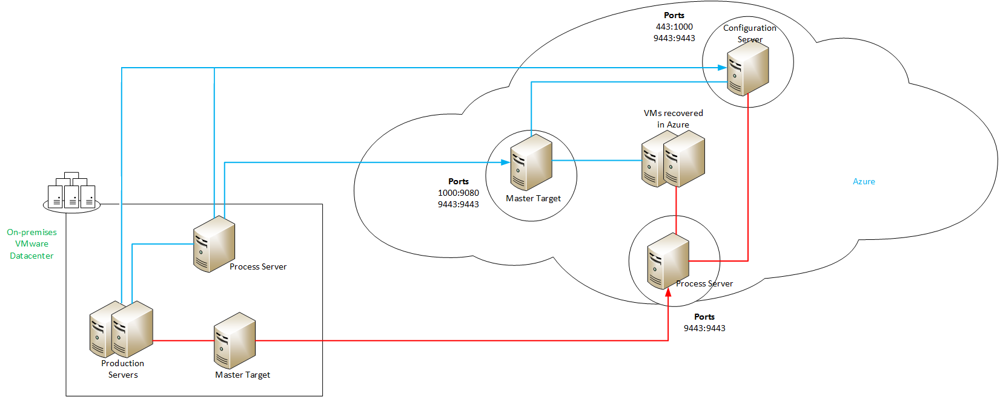
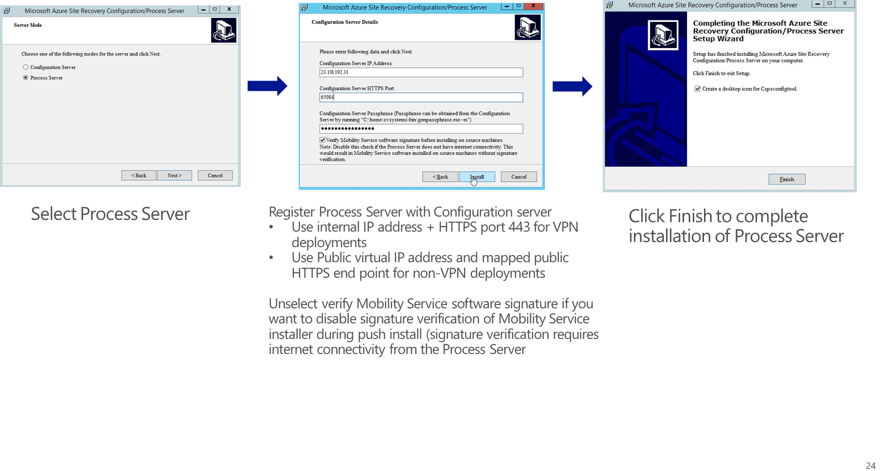

<properties 
   pageTitle="将 VMware 虚拟机和物理服务器从 Azure 故障回复到 VMware（旧版） | Azure" 
   description="本文介绍如何使用 Azure Site Recovery 来故障回复已复制到 Azure 的 VMware 虚拟机。" 
   services="site-recovery" 
   documentationCenter="" 
   authors="ruturaj" 
   manager="mkjain" 
   editor=""/>

<tags
   ms.service="site-recovery"
   ms.date="03/06/2016"
   wacn.date="04/05/2016"/>

# 使用 Azure Site Recovery 将 VMware 虚拟机和物理服务器从 Azure 故障回复到 VMware（旧版）

> [AZURE.SELECTOR]
- [增强版](/documentation/articles/site-recovery-failback-azure-to-vmware-classic/)
- [旧版](/documentation/articles/site-recovery-failback-azure-to-vmware-classic-legacy/)

Azure Site Recovery 服务有助于业务连续性和灾难恢复 (BCDR) 策略，因为它可以协调虚拟机和物理服务器的复制、故障转移和恢复。虚拟机可复制到 Azure 中，也可复制到本地数据中心中。如需快速概览，请阅读[什么是 Azure Site Recovery？](/documentation/articles/site-recovery-overview/)

## 概述

本文介绍从本地站点复制到 Azure 之后如何将 VMware 虚拟机和 Windows/Linux 物理服务器从 Azure 故障回复到本地站点。
<!--
>[AZURE.NOTE] 本文介绍旧方案。如果使用[这些旧说明](/documentation/articles/site-recovery-vmware-to-azure-classic-legacy/)复制到 Azure，则仅应使用本文中的说明。如果使用[增强版部署](/documentation/articles/site-recovery-vmware-to-azure-classic-legacy/)设置复制，那么请按照[本文](/documentation/articles/site-recovery-failback-azure-to-vmware-classic/)中的说明进行故障回复。-->

## 体系结构

此图显示了故障转移和故障回复方案。蓝线是故障转移期间使用的连接。红线是故障回复期间使用的连接。箭头线将通过 Internet。

## 开始之前 

- 应该已对 VMware VM 或物理服务器进行故障回复，并且它们应在 Azure 中运行。
- 你应该注意，只能将 VMware 虚拟机和 Windows/Linux 物理服务器从 Azure 故障回复到本地主站点中的 VMware 虚拟机。如果你要故障回复物理机，则将它故障转移到 Azure 时，会将它转换成 Azure VM；将它故障回复到 VMware 时，会将它转换成 VMware VM。

下面是设置故障回复的方式：

1. **设置故障回复组件**：需要在本地设置 vContinuum 服务器并将它指向 Azure 中的配置服务器 VM。此外，将进程服务器设置作为 Azure VM，用于将数据发送回本地主目标服务器。将进程服务器注册到处理故障转移的配置服务器。安装本地主目标服务器。如果需要 Windows 主目标服务器，则会在安装 vContinuum 时自动设置。如果需要 Linux，则需要在单独服务器上手动设置。
2. **启用保护和故障回复**：设置组件后，需要在 vContinuum 中对 Azure VM 启用故障转移保护。你需要在 VM 上运行就绪状态检查，并运行从 Azure 到本地站点的故障转移。故障回复完成后，重新保护本地计算机，以便它们启动到 Azure 的复制。

## 步骤 1：在本地安装 vContinuum

需要在本地安装 vContinuum 服务器并将它指向配置服务器。

1.  [下载 vContinuum](http://go.microsoft.com/fwlink/?linkid=526305)。 
2.  然后下载 [vContinuum 更新](http://go.microsoft.com/fwlink/?LinkID=533813)版本。
3. 安装最新版本的 vContinuum。在“欢迎”页上，单击“下一步”。
4.  在向导的第一页上，指定 CX 服务器 IP 地址和 CX 服务器端口。选择“使用 HTTPS”。

	

5.  在 Azure 中的配置服务器 VM 的“仪表板”选项卡上查找配置服务器 IP 地址。

6.  在 Azure 中的配置服务器 VM 的“终结点”选项卡上查找配置服务器 HTTPS 公共端口。

	

7. 在“CS 密码详细信息”页上，指定你在注册配置服务器时记下的密码。如果忘了密码，可在配置服务器 VM 的 **C:\\Program Files (x86)\\InMage Systems\\private\\connection.passphrase** 中查看。

	

8.  在“选择目标位置”页上，指定想要安装 vContinuum 服务器的位置，然后单击“安装”。

	

9. 安装完成后，可以启动 vContinuum。

## 步骤 2：在 Azure 中安装进程服务器 

需要在 Azure 中安装一个进程服务器，以便 Azure 中的 VM 可以将数据发回到本地主目标服务器。

1.  在 Azure 中的“配置服务器”页上，选择添加新的进程服务器。

	

2.  指定进程服务器名称，然后指定用于连接到虚拟机的管理员用户名和密码。选择要将进程服务器注册到的配置服务器。此服务器应该是你用来保护虚拟机并对其进行故障转移的同一台服务器。
3.  指定应在其中部署进程服务器的 Azure 网络。它与配置服务器应该是相同的网络。指定所选子网的唯一 IP 地址，然后开始部署。

	

4.  将触发一个用于部署进程服务器的作业。

	

5.  在 Azure 上部署进程服务器后，你可以使用指定的凭据登录到该服务器。以注册本地进程服务器时使用的相同方法注册该进程服务器。

	

>[AZURE.NOTE] 故障回复期间，注册的服务器不会显示在站点恢复中的 VM 属性下。它们只会出现在它们注册到的配置服务器的“服务器”选项卡下。可能需要在大约 10-15 分钟后，进程服务器才会出现在该选项卡中。

## 步骤 3：在本地安装主目标服务器

根据源虚拟机的操作系统，你需要在本地安装 Linux 或 Windows 主目标服务器。

### 部署 Windows 主目标服务器

vContinuum 安装程序中已捆绑 Windows 主目标。当你安装 vContinuum 时，主服务器也会部署在同一台计算机上，并注册到配置服务器。

1.  若要开始部署，请在 ESX 主机本地创建一个空计算机，你需要将 VM 从 Auzre 恢复到该计算机。

2.  确保至少有两个磁盘附加到 VM – 一个磁盘用于存储操作系统，另一个磁盘用作保留驱动器。

3.  安装操作系统。

4.  在服务器上安装 vContinuum。这也会完成主目标服务器的安装。

### 部署 Linux 主目标服务器

1.  若要开始部署，请在 ESX 主机本地创建一个空计算机，你需要将 VM 从 Auzre 恢复到该计算机。

2.  确保至少有两个磁盘附加到 VM – 一个磁盘用于存储操作系统，另一个磁盘用作保留驱动器。

3.  安装 Linux 操作系统。Linux 主目标系统不应为根或保留存储空间使用 LVM。默认情况下，Linux 主目标服务器已配置为避免发现 LVM 分区/磁盘。
4.  可以创建的分区：

	

5.  在开始安装主目标之前，请执行以下安装后步骤。

#### OS 安装后步骤

若要获取 Linux 虚拟机中每个 SCSI 硬盘的 SCSI ID，请启用参数“disk.EnableUUID = TRUE”，如下所示：

1. 关闭你的虚拟机。
2. 在左侧面板中右键单击 VM 对应的条目，然后单击“编辑设置”。
3. 单击“选项”选项卡。选择“高级”>“常规项”>“配置参数”。仅当计算机已关闭时，“配置参数”选项才可用。

	

4. 查看是否存在包含 **disk.EnableUUID** 的行。如果存在该行并且其值设置为 **False**，请将该值设置为 **True**（不区分大小写）。如果存在该行并且其值设置为 true，请单击“取消”，然后在启动来宾操作系统后，在来宾操作系统中测试 SCSI 命令。如果不存在该行，请单击“添加行”。
5. 在“名称”列中添加 disk.EnableUUID。将其值设置为 TRUE。添加上述值时请不要包括双引号。

	

#### 下载并安装其他程序包

注意：在下载并安装其他程序包之前，请确保系统已建立 Internet 连接。

# yum install -y xfsprogs perl lsscsi rsync wget kexec-tools

此命令将从 CentOS 6.6 存储库下载并安装下面的 15 个程序包：

bc-1.06.95-1.el6.x86\\64.rpm

busybox-1.15.1-20.el6.x86\\64.rpm

elfutils-libs-0.158-3.2.el6.x86\\64.rpm

kexec-tools-2.0.0-280.el6.x86\\64.rpm

lsscsi-0.23-2.el6.x86\\64.rpm

lzo-2.03-3.1.el6\\5.1.x86\\64.rpm

perl-5.10.1-136.el6\\6.1.x86\\64.rpm

perl-Module-Pluggable-3.90-136.el6\\6.1.x86\\64.rpm

perl-Pod-Escapes-1.04-136.el6\\6.1.x86\\64.rpm
	
perl-Pod-Simple-3.13-136.el6\\6.1.x86\\64.rpm

perl-libs-5.10.1-136.el6\\6.1.x86\\64.rpm

perl-version-0.77-136.el6\\6.1.x86\\64.rpm

rsync-3.0.6-12.el6.x86\\64.rpm

snappy-1.1.0-1.el6.x86\\64.rpm

wget-1.12-5.el6\\6.1.x86\\64.rpm

注意：如果源计算机为根设备或引导设备使用了 Reiser 或 XFS 文件系统，则应该在保护之前，在 Linux 主目标中下载并安装以下程序包。

\# cd /usr/local

\# wget
<http://elrepo.org/linux/elrepo/el6/x86_64/RPMS/kmod-reiserfs-0.0-1.el6.elrepo.x86_64.rpm>

\# wget
<http://elrepo.org/linux/elrepo/el6/x86_64/RPMS/reiserfs-utils-3.6.21-1.el6.elrepo.x86_64.rpm>

\# rpm -ivh kmod-reiserfs-0.0-1.el6.elrepo.x86\\64.rpm
reiserfs-utils-3.6.21-1.el6.elrepo.x86\\64.rpm

\# wget
<http://mirror.centos.org/centos/6.6/os/x86_64/Packages/xfsprogs-3.1.1-16.el6.x86_64.rpm>

\# rpm -ivh xfsprogs-3.1.1-16.el6.x86\\64.rpm

#### 应用自定义配置更改

在应用这些更改之前，请确保已完成上一部分的操作，然后遵循以下步骤：

1. 将 RHEL 6-64 统一代理二进制文件复制到新建的 OS。

2. 运行以下命令来解压缩二进制文件：**tar -zxvf \<File name\>**

3. 运行以下命令来指定权限：# **chmod 755 ./ApplyCustomChanges.sh**

4. 运行脚本：**# ./ApplyCustomChanges.sh**。仅在服务器上运行该脚本一次。运行该脚本后，重新启动服务器。

### 安装 Linux 服务器

1. [下载](http://go.microsoft.com/fwlink/?LinkID=529757)安装文件。
2. 使用所选的 sftp 客户端实用程序，将该文件复制到 Linux 主目标虚拟机。或者，你可以登录到 Linux 主目标虚拟机，然后使用 wget 从提供的链接下载安装程序包
3. 使用所选的 ssh 客户端登录到 Linux 主目标服务器虚拟机
4. 如果你已通过 VPN 连接连接到部署了 Linux 主目标服务器的 Azure 网络，请使用虚拟机“仪表板”选项卡中显示的服务器内部 IP 地址和端口 22，通过安全外壳连接到 Linux 主目标服务器。
5. 如果你要通过公共 Internet 连接来连接到 Linux 主目标服务器，请使用 Linux 主目标服务器的公共虚拟 IP 地址（从虚拟机“仪表板”选项卡获取）以及为 ssh 创建的公共终结点登录到 Linux 服务器。
6. 从包含安装程序文件的目录运行 *“tar –xvzf Microsoft-ASR\\UA\\8.2.0.0\\RHEL6-64*”*，以便从使用 gzip 压缩的 Linux 主目标服务器安装程序 tar 存档中提取文件。

	

7. 如果将安装程序文件提取到了其他目录，请切换到 tar 存档内容所提取到的目录。从此目录路径运行“sudo ./install.sh”。

	

8. 当系统提示你选择主角色时，请选择“2 (主目标)”。将其他交互式安装选项保留为其默认值。
9. 等待安装完成，随后将显示主机配置界面。适用于 Linux 主目标服务器的主机配置实用程序是一个命令行实用程序。请不要调整 ssh 客户端实用程序窗口的大小。使用箭头键选择“全局”选项，然后在键盘上按 Enter。

	

	

10. 在“IP”字段中，输入配置服务器的内部 IP 地址（可在配置服务器 VM 的“仪表板”选项卡中找到），然后按 Enter。在“端口”中输入 **22**，然后按 Enter。
11.  将“使用 HTTPS”保留为“是”，然后按 Enter。
12.  输入在配置服务器上生成的通行短语。如果在 Windows 计算机中使用 PUTTY 客户端与 Linux 虚拟机建立 ssh 连接，则可以使用 Shift+Insert 来粘贴剪贴板的内容。使用 Ctrl+C 将通行短语复制到本地剪贴板，然后使用 Shift+Insert 粘贴通行短语。按 Enter。
13.  使用右箭头键导航到退出按钮，然后按 Enter。等待安装完成。

	

如果出于某种原因而无法将 Linux 主目标服务器注册到配置服务器，可以通过从 /usr/local/ASR/Vx/bin/hostconfigcli 运行主机配置实用程序来再次注册（首先需要通过以超级用户身份运行 chmod，来设置对此目录的访问权限）。

#### 验证主目标注册

可以通过 Azure Site Recovery 保管库中的“配置服务器”>“服务器详细信息”，来验证是否已成功将主目标服务器注册到配置服务器。

>[AZURE.NOTE] 注册主目标服务器后，如果你收到指出虚拟机可能已从 Azure 中删除或者终结点未正确配置的错误，原因是在 Azure 中部署主目标时，主目标配置是通过 Azure 终结点检测的。不过，对于本地主目标服务器，事实并非如此。这不会影响故障回复，你可以忽略这些错误。

## 步骤 4：在本地站点中保护虚拟机

在故障回复之前，你需要在本地站点中保护 VM。

### 开始之前

将 VM 故障转移到 Azure 时，将会为页面文件添加一个额外的临时驱动器。故障转移的 VM 通常不需要此额外驱动器，因为它可能已经为页面文件提供了一个专用的驱动器。在开始反向保护虚拟机之前，需要确保将此驱动器脱机，使它不会受到保护。请按如下所述执行此操作：

1.  打开“计算机管理”，然后选择“存储管理”列出已联机并已附加到计算机的磁盘。
2.  选择附加到计算机的临时磁盘，然后选择它以使其脱机。 

### 保护 VM

1. 在 Azure 门户中，查看虚拟机的状态并确保它们已故障转移。

	

2. 在计算机上启动 vContinuum。

	

3. 单击“新建保护”并选择操作系统类型

4.  在打开的新窗口中，选择你要故障回复的 VM 对应的“操作系统类型”>“获取详细信息”。在“主服务器详细信息”中，找到并选择你要保护的虚拟机。VM 将按照其在故障转移之前的 vCenter 主机名列出。
5.  在选择要保护的虚拟机时（该虚拟机已故障转移到 Azure），会显示一个弹出窗口，其中提供了该虚拟机的两个条目。这是因为，配置服务器已检测到其中注册的虚拟机的两个实例。你需要删除本地 VM 的条目，以便可以保护正确的 VM。若要在此处标识正确的 Azure VM 条目，可先登录到 Azure VM，然后转到 C:\\Program Files (x86)\\Microsoft Azure Site Recovery\\Application Data\\etc。在文件 drscout.conf 中，找到主机 ID。在 vContinuum 对话框中，保留在 VM 中发现其主机 ID 的条目。删除所有其他条目。若要选择正确的 VM，你可以参考其 IP 地址。本地 IP 地址范围将是本地 VM。

	

	

6. 在 vCenter 服务器上停止该虚拟机。你也可以删除本地 VM。
7. 然后指定要在其上保护 VM 的本地 MT 服务器。为此，请连接到要故障回复到的 vCenter 服务器。

	

8. 根据要将 VM 恢复到的主机选择主目标服务器。

	

9. 提供每个虚拟机的复制选项。为此，你需要选择 VM 要恢复到的恢复端数据存储。下表汇总了需要为每个 VM 提供的不同选项。

	

	**选项** | **选项建议值**
	---|---
	进程服务器 IP 地址 | 选择在 Azure 中部署的进程服务器
	保留大小 (MB)| 
	保留值 | 1
	天/小时 | 天
	一致性间隔 | 1
	选择目标数据存储 | 恢复站点上提供的数据存储。该数据存储应有足够的空间，并且可用于要在其上还原虚拟机的 ESX 主机。

10. 配置故障转移到本地站点后虚拟机要获取的属性。下表汇总了这些属性。

	

	**属性** | **详细信息**
	---|---
	网络配置| 对于检测到的每个网络适配器，请选择该适配器并单击“更改”以配置虚拟机的故障回复 IP 地址。 
	硬件配置| 指定 VM 的 CPU 和内存。可向你正在尝试保护的所有 VM 应用设置。若要确定“CPU”和“内存”的正确值，可以参考 IAAS VM 角色大小，并查看分配的核心数和内存。
	显示名称 | 在故障转移回到本地后，你可以重命名要在 vCenter 清单中显示的虚拟机。默认名称是虚拟机主机名。若要确定 VM 名称，可以参考保护组中的 VM 列表。
	NAT 配置 | 下面将详细讨论

	

#### 配置 NAT 设置

1. 若要启用虚拟机保护，需要建立两个通信通道。第一个通道在虚拟机和进程服务器之间建立。此通道从 VM 收集数据并将数据发送到进程服务器，后者将此数据发送到主目标服务器。如果要保护的 进程服务器和虚拟机位于同一个 Azure 虚拟网络上，则不需要使用 NAT 设置。否则需要指定 NAT 设置。在 Azure 中查看进程服务器的公共 IP 地址。 

	

2. 第二个通道在进程服务器和主目标服务器之间建立。是否选择使用 NAT 取决于是要使用基于 VPN 的连接，还是要通过 Internet 进行通信。如果你使用 VPN，请不要选择 NAT；仅当你使用 Internet 连接时，才选择 NAT。

	

	

3. 如果未按说明删除本地虚拟机，并且要故障回复到的数据存储仍然包含旧 VMDK，则你需要确保在新位置创建故障回复 VM。为此，请选择“高级”设置，然后在“文件夹名称设置”中指定要还原到的备用文件夹。将其他选项保留默认设置。将文件夹名称设置应用到所有服务器。

	

4. 运行就绪状态检查，以确保虚拟机已准备好在本地受到保护。

	

5. 等待检查完成。如果在所有 VM 上成功完成了检查，你可以指定保护计划的名称。然后单击“保护”按钮以开始保护。

	

6. 你可以在 vContinuum 中监视进度。

	

7. 完成“激活保护计划”步骤后，你可以在 Site Recovery 门户中监视 VM 的保护。

	

8. 你可以通过单击 VM 并监视其进度，来查看确切的状态。

	

## 准备故障回复计划

可以使用 vContinuum 来准备故障回复计划，使应用程序随时可以故障回复到本地站点。这些恢复计划与站点恢复中的恢复计划非常相似。

1.  启动 vContinuum 并选择“管理计划”>“恢复”。 你可以查看已用于故障转移 VM 的所有计划的列表。这些计划同样可用于恢复。

	

2. 选择保护计划，然后选择要在其中恢复的所有 VM。在选择每个 VM 时，你可以查看更多详细信息，包括目标 ESX 服务器和源 VM 磁盘。单击“下一步”启动恢复向导，然后选择要恢复的 VM。

	

3. 你可以基于多个选项进行恢复，不过，我们建议使用“最新标记”并选择“对所有 VM 应用”，以确保使用虚拟机中的最新数据。
4. 运行“就绪状态检查”。 这将会检查是否配置了正确的参数来启用 VM 恢复。如果所有检查都已成功，请单击“下一步”。否则，请查看日志并解决错误。

	

8.  在“VM 配置”中，确保正确设置恢复设置。你可以根据需要更改 VM 设置。

	

9. 查看要恢复的虚拟机列表并指定恢复顺序。请注意，VM 是使用计算机主机名列出的。可能很难将计算机主机名映射到虚拟机。若要映射名称，请在 Azure 中转到虚拟机的“仪表板”，然后查看 VM 主机名。

	

10. 指定计划名称，然后选择“以后恢复”。我们建议选择“以后恢复”，因为初始保护可能不完整。
11. 单击“恢复”，以保存计划或触发恢复（如果你选择了立即恢复而不是以后恢复）。你可以查看恢复状态，以了解该计划是否已保存。

	

	

## 恢复虚拟机

创建计划后，你可以恢复虚拟机。在恢复之前，请检查虚拟机是否已完成同步。如果复制状态显示“正常”，则表示保护已完成，并且符合 RPO 阈值。可以在 VM 属性中检查运行状况。

在启动恢复之前，请关闭 Azure 虚拟机。这可以确保不会出现裂脑，并且用户只能访问应用程序的一个副本。

1.  启动保存的计划。在 vContinuum 中选择“监视”计划。这将会列出已运行的所有计划。

	

2.  在“恢复”中选择该计划，然后单击“启动”。你可以监视恢复状态。在打开 VM 后，你可以在 vCenter 中连接到 VM。

	

## 故障回复后在 Azure 中重新保护

完成故障回复后，你可能需要重新保护虚拟机。请按如下所述执行此操作：

1.  检查本地虚拟机是否在正常工作，并且可以访问应用程序。
2.  在 Azure Site Recovery 门户中，选择虚拟机并将其删除。选择禁用虚拟机的保护。这可以确保 VM 不再受保护。
3.  在 Azure 中删除故障转移的 Azure 虚拟机
4.  在 vSpehere 上删除旧虚拟机。这是以前故障转移到 Azure 的 VM。
5.  在站点恢复门户中保护最近故障转移的 VM。VM 受保护后，你可以将它们添加到恢复计划。
 

 

<!---HONumber=Mooncake_0328_2016-->