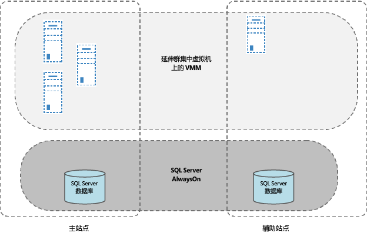
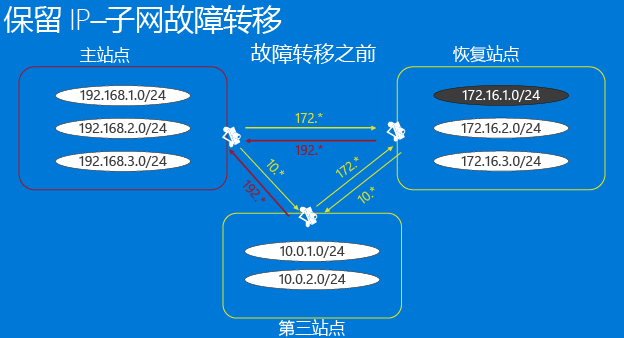
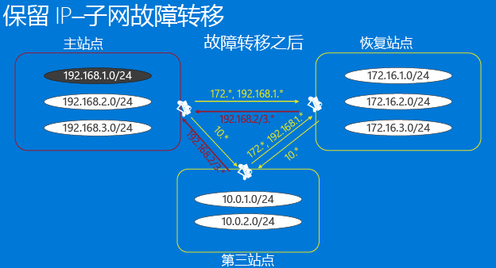
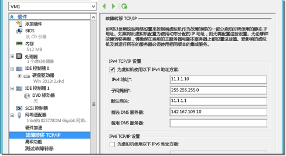
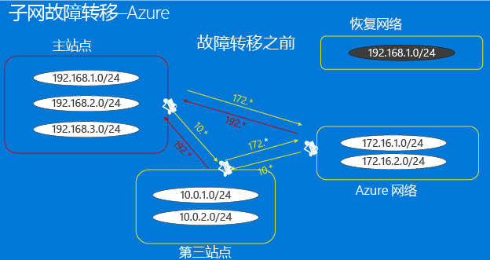
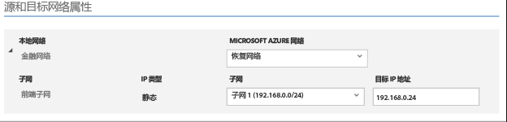
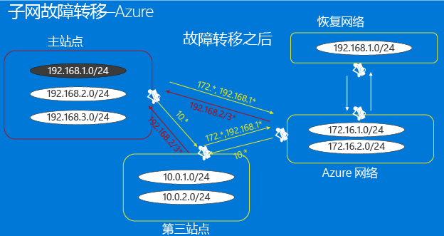
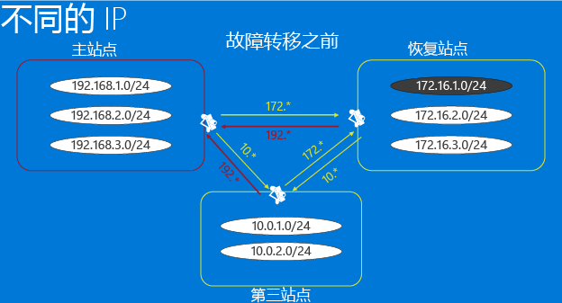
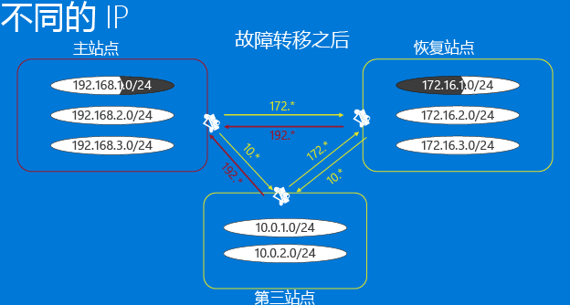

<properties
	pageTitle="Site Recovery 的网络基础结构注意事项" 
	description="本文讨论使用 Site Recovery 进行故障转移的切实可行的网络设计的注意事项。" 
	services="site-recovery" 
	documentationCenter="" 
	authors="rayne-wiselman" 
	manager="jwhit" 
	editor=""/>

<tags 
	ms.service="site-recovery" 
	ms.date="08/10/2015" 
	wacn.date="10/22/2015"/>

#  Site Recovery 的网络基础结构注意事项

Azure Site Recovery 服务通过协调和自动化到 Azure 或辅助本地数据中心的复制与故障转移，来保护和恢复本地物理服务器和虚拟机，从而有助于构建稳健的业务连续性和灾难恢复 (BCDR) 解决方案。

本文面向负责设计、实施和支持 BCDR 解决方案并且基础结构中包括 System Center VMM 和 Azure Site Recovery 的虚拟化团队。

## 概述

BCDR 策略的目的是使你的业务应用程序保持运行，并恢复失败的工作负荷和服务，从而让组织能够快速恢复正常运作。由于预测各种无法预料的事件所固有的困难，以及针对影响深远的故障实施适当的防范所产生的高昂成本，制定灾难恢复策略是一项挑战。Azure Site Recovery 通过首次复制你的主数据，然后定期刷新副本来帮助你实现从你的主数据中心到辅助数据中心（或到 Azure）的保护和故障转移。

作为 BCDR 规划的一个关键部分，你需要定义恢复时间目标 (RTO) 和恢复点目标 (RPO)，从而能够让你组织的数据尽可能快（具有较低的 RTO）地恢复上线且数据丢失最少（低 RPO）。组织的网络设计是你的 RTO 和 RPO 目标的潜在瓶颈，而坚实的设计规划能够帮助避免此瓶颈。

如果你已经决定使用 Azure Site Recovery 服务来帮助实现保护和故障转移，对于 BCDR，在网络设计中有若干重要问题：

- **VMM 设计**：我正在使用 System Center VMM。我应该如何进行网络设计以将 VMM 和 Site Recover 集成在一起？
- **故障转移后的连接**：我正在使用 Site Recovery 进行一次故障转移。我如何确保我的应用程序和工作负荷在故障转移完成之后可供使用？

## VMM 设计

你可以在现有的 VMM 设计之上进行分层站点恢复，而不管该设计使用一个还是多个 VMM 服务器。

### 独立 VMM 服务器

在这种拓扑结构中，你将在主站点中的一个虚拟机上部署一个 VMM 服务器，然后使用 Site Recovery 和 Hyper-V 副本将此虚拟机复制到一个辅助站点。你可能认为在同一虚拟机上安装 VMM 服务器及其支持 SQL Server 能够减少停机时间，因为只有一个虚拟机必须要实例化。当 VMM 服务使用远程 SQL Server 时，你需要在恢复 VMM 服务器之前恢复 SQL Server 实例。

使用 Hyper-V 副本在虚拟机上部署单个 VMM：

1. 使用已安装的 SQL Server 在虚拟机上设置 VMM。
2. 在 VMM 服务器上将要管理的主机添加到云中。
3. 登录到 Azure 门户，然后配置云以提供保护。
4. 为所有需要 VMM 服务器保护的虚拟机启用复制。
5. 转到 HYPER-V 管理器控制台，选择 HYPER-V 副本，然后在 VMM 虚拟机上启用复制。
6. 确保 VMM 虚拟机没有被添加到受 ASR 服务保护的云中，从而使 Hyper-V 复制设置不会被 ASR 覆盖。

发生灾难时，可以如下所述恢复工作负荷：

1. 使用 Hyper-V 管理器，从副本 VMM 虚拟机到恢复站点进行故障转移。
2. 在 VMM 虚拟机恢复之后，用户可以从辅助站点登录到 Hyper-V 恢复管理器。
3. 完成非计划的故障转移之后，用户可以在主站点上访问所有资源。
4. 注意，在能够进行工作负荷的故障转移之前，需要手动进行从 VMM 虚拟机到辅助站点的故障转移。 

### 群集的 VMM 服务器

[在群集中部署 VMM](https://technet.microsoft.com/zh-cn/library/gg610675.aspx) 提供高可用性和针对硬件故障转移的保护。如果你正在使用 Site Recovery 部署 VMM 群集，请注意：

VMM 服务器应部署在一个外延式群集中，该群集在地理位置上跨多个单独的站点。
应该使用包含辅助站点上的副本的 SQL Server AlwaysOn 可用性组来保护 VMM 所用的 SQL Server 数据库。
如果发生灾难，VMM 服务器及其对应的 SQL Server 会自动向恢复站点进行故障转移。然后，你可以使用 Site Recovery 进行工作负荷的故障转移。

## 故障转移后的连接

现代应用程序在一定程度上几乎都依赖网络，因此，以物理方式将服务从一个站点移动到另一个站点会带来在故障转移之后如何确保应用程序和工作负荷可供使用的网络挑战。对于此问题，有两个主要的解决方案：

- **固定 IP 地址**：第一种方法是保持固定的 IP 地址。尽管移动的服务和宿主服务器位于不同的物理位置，应用程序将 IP 地址配置带到新的位置。
- **修改 IP 地址**：第二种方法需要在转换到恢复站点的过程中更改 IP 地址。 

### 选项 1：固定 IP 地址

从灾难恢复的角度来看，使用固定 IP 地址似乎是最容易的实现方法。然而，存在若干潜在挑战，使其成为实践中最不流行的方法。Azure Site Recovery 在所有方案中提供保留 IP 地址的能力。在你决定采用这种方法之前，让我们看一看这个主要方案的注意事项（外延式子网和子网故障转移）。

#### 外延式子网

在外延式子网中，子网在主位置和目标位置中同时可用。简单而言，这意味着你可以将一个服务器及其 IP（第 3 层）配置移动到辅助站点，并且网络会自动将流量路由到新的位置。从服务器的角度来看，这处理十分常见，但是也有若干挑战：

- 从第 2 层（数据链路层）的角度来看，它需要能够管理外延式 VLAN 的网络设备，尽管现在可以方便地获得这种类型的设备。
- 第二个且更加困难的问题在于通过延伸 VLAN，潜在容错域也延伸到两端，本质上变为一个单点故障。尽管可能性不大，但也有可能发生广播风暴并且不能隔离。我们已经看到了针对此问题的不同观点，部分人认为是成功实现，也有人认为“切勿”这样操作。
- 如果你正在如灾难恢复站点一样向 Azure 进行故障转移，则外延式子网是不可能的。

#### 子网故障转移

为获得外延式子网的好处而不而实际延伸子网，但实现子网故障转移是有可能的。在这种配置中，任何给定子网存在于站点 1 或站点 2 中，但是绝对不能在两上站点上同时存在。为了在出现故障转移时保留 IP 地址空间，可以通过编程方式安排路由器基础结构将子网从一个站点移到另一个站点。在一个故障转移方案中，子网随与它们关联的受保护虚拟机一起移动。此方法的主要缺点在于，当出现故障时，你必须移动整个子网，这可能是一种合理的解决方案，但是会影响故障转移粒度考虑事项。

让我们了解一下一家虚构企业 (Contoso) 如何能够将其虚拟机到一个恢复位置，同时对整个子网进行故障转移。我们将看到 Contoso 如何能够管理其子网，同时在两个本地位置之间复制虚拟机，并且讨论在将 Azure 用作灾难恢复站点时，子网故障转移是如何工作的。

##### 示例 - 一家企业中的子网故障转移
 
- 主站点具有在子网 192.168.1.0/24 中运行的应用程序。
- 整个子网将进行故障转移，并且子网中的所有虚拟机将向恢复站点进行故障转移，并且保留它们的 IP 地址
- 如下图所示，主站点和恢复站点之间的路由、第三站点和主站点之间的路由以及第三站点和恢复站点之间的路由将不得不适当地修改以反映属于子网 192.168.1.0/24 的所有虚拟机已经被移到恢复站点这一事实。
- 此图假定：
	-  每个数据中心由其自己的 VMM 实例提供服务。在数据中心之间没有 System Center VMM 数据库的复制。
	-  每个数据中心对虚拟机使用静态 IP 地址。
	-  数据中心之间的连接通过专用线路，并且不通过经由 Internet 的 VPN 连接。

**在故障转移之前**

**在故障转移之后**

为某个虚拟机启用保护时，Site Recovery 如下所示分配网络资源：

1. Site Recovery 从每个 VMM 实例的相应网络所定义的静态 IP 地址池中为虚拟机上的每个网络接口分配一个 IP 地址。
2. 如果管理员为恢复站点上的网络定义在主站点上使用的相同 IP 地址池，Site Recovery 会将分配给主虚拟机的相同 IP 地址分配给副本虚拟机。IP 地址保留在 VMM 中，但不会设置为故障转移 IP 地址。故障转移 IP 地址仅在故障转移之前设置。此屏幕快照显示副本虚拟机的故障转移 TCP/IP 设置（在 Hyper-V 控制台上）。这些设置仅在虚拟机的故障转移开始前复制。

	

3. 如果相同的 IP 地址不可用，则 Site Recovery 会从地址池分配另一个地址。
4. 在启用虚拟机保护之后，可以使用以下脚本示例验证已经分配给虚拟机的 IP 地址。应该设置为与故障转移 IP 地址相同的 IP 地址，并且在故障转移时分配到虚拟机。

    $vm = Get-SCVirtualMachine -Name 
    $na = $vm[0].VirtualNetworkAdapters
    $ip = Get-SCIPAddress -GrantToObjectID $na[0].id 
    $ip.address

注意，如果虚拟机使用 DHCP，则 IP 地址管理不由 Site Recovery 处理。你需要确保在恢复站点上分配 IP 地址的 DHCP 服务器能够从与主站点相同的范围分配地址。

##### 示例 - 子网向 Azure 进行的故障转移

如果正在向 Azure 进行故障转移，则有更多约束。让我们了解一下一家虚构公司 (Woodgrove Bank)，该公司有一个承载其业务线应用程序的本地基础结构和承载其移动应用程序的 Azure。

- Woodgrove Bank 在 Azure 中的虚拟机和在本地服务器中的虚拟机之间的连接通过站点到站点 VPN 实现，该 VPN 将 Azure 中的虚拟网络显示为 Woodgrove Bank 本地网络的一个扩展。 
- Woodgrove 想要使用 Site Recovery 将其本地工作负荷复制到 Azure。 
- Woodgrove 必须处理依赖于硬编码 IP 地址的应用程序和配置，因此他们需要在向 Azure 进行故障转移之后为他们的应用程序保留 IP 地址。
- Woodgrove 的本地基础结构由一台 VMM 2012 R2 服务器管理。
- 在 VMM 服务器上已经创建了一个基于 VLAN 的逻辑网络（应用程序网络）。
	
- 使用逻辑网络创建了一个虚拟机网络（应用程序虚拟机网络）。
	
- 应用程序中的所有虚拟机使用静态 IP 地址，因此也为逻辑网络定义了一个静态 IP 地址池。 
- Woodgrove 正在将来自范围（172.16.1.0/24、172.16.2.0/24）的 IP 地址分配给在 Azure 中运行的资源。

Woodgrove 要部署复制并维护 IP 地址，需要满足以下条件：

- 作为本地网络的一个扩展的 Azure 虚拟机，这样应用程序能够顺畅地进行故障转移。
- 注意，在 Azure 中设置站点到站点连接时，只有在 IP 地址范围与本地 IP 地址范围不同时，Azure 网络才允许你将流量路由到本地位置（Azure 称其为本地网络），因为 Azure 不支持延伸子网。这意味着如果你在本地有一个子网 192.168.1.0/24，则不能在 Azure 网络中添加一个本地网络 192.168.1.0/24。这是意料之中的，因为 Azure 不知道子网中没有活动的虚拟机，也不知道正在创建的子网仅用于灾难恢复。为了能够将网络流量从一个 Azure 网络中正确路由出去，该网络中的子网和本地网络中的子网不能有冲突。 
- 我们需要在 Azure 中创建一个额外的网络（恢复网络），在其中创建故障转移的虚拟机。

	

- 为了确保该虚拟机的 IP 地址在 Site Recovery 的虚拟机属性中得到保留，我们将指定应该使用相同 IP 地址。然后，在故障转移之后，Site Recover 将指定 IP 地址分配给虚拟机。
	

- 当故障转移触发且在恢复网络中用需要的 IP 地址创建虚拟机之后，可以建立到该虚拟机的链接。可以编写脚本来实现此操作。如我们在关于子网故障转移的上一节中以及在到 Azure 的故障转移的案例中所讨论，不得不适当修改路由以反映 192.168.1.0/24 现在已移到 Azure。
	

### 选项 2：修改 IP 地址

此方法似乎是最常见的，意味着每一个进行故障转移的虚拟机的 IP 地址都将改变。此方法的主要缺点是你的网络基础结构需要知道 IP 地址已经改变并且 DNS 条目通常必须改变或在整个网络内刷新，如网络表中的缓存条目要经历的一样。视 DNS 基础结构是如何设置的而定，这可能导致停机。对于 Intranet 网络应用程序，可以使用低 TTL 值，对于基于 Internet 的应用程序，可以使用[带有 Site Recovery 的 Azure 流量管理器](http://azure.microsoft.com/blog/2015/03/03/reduce-rto-by-using-azure-traffic-manager-with-azure-site-recovery/)来缓解这些问题。

#### 示例 - 修改 IP 地址

让我们通过一个示例看一看这种情形；该示例含有第三个站点，可以从该站点访问驻留在主站点或恢复站点上的应用程序。

- 某些应用程序驻留在主站点上的子网 192.168.1.0/24 中，它们被配置为在故障转移之后来到子网 172.16.1.0/24 中的恢复站点中。
- 已经正确配置 VPN 连接/网络路由，使所有三个站点都能相互访问。 
- 在对一个或多个应用程序进行故障转移之后，它们将在恢复子网中恢复。在此案例中，我们不需要同时对整个子网进行故障转移，并且不需要做出改变以重新配置 VPN 或网络路由。
- 故障转移和某些 DNS 更新将让应用程序保持可用。如果 DNS 服务器配置为允许动态更新，则虚拟机会在故障转移之后的启动时使用新的 IP 地址自动注册。

	

- 在故障转移之后，副本虚拟机的 IP 地址可能与主虚拟机的 IP 地址不同。
- 虚拟机在启动后将更新它们使用的 DNS 服务器。DNS 条目通常必须改变或在整个网络中刷新，并且网络表中的缓存条目必须更新或刷新，因此在这些状态改变发生时面临停机并不是少见的事情。这可以通过以下方式来缓解：

	- 对于 Intranet 应用程序，使用低 TTL 值。
	- 对于基于 Internet 的应用程序，使用[带有Site Recovery 的 Azure 流量管理器](http://azure.microsoft.com/blog/2015/03/03/reduce-rto-by-using-azure-traffic-manager-with-azure-site-recovery/)。
	- 在你的恢复计划中使用以下脚本来更新 DNS 服务器，以确保及时更新（如果配置了动态 DNS 注册，则不需要此脚本）

    [string]$Zone,
    [string]$name,
    [string]$IP
    )
    $Record = Get-DnsServerResourceRecord -ZoneName $zone -Name $name
    $newrecord = $record.clone()
    $newrecord.RecordData[0].IPv4Address = $IP
    Set-DnsServerResourceRecord -zonename $zone -OldInputObject $record -NewInputObject $Newrecord

#### 示例 - 向 Azure 进行的故障转移

“为作为灾难恢复站点的 Azure 搭建网络基础结构”这篇[博客文章](http://azure.microsoft.com/blog/2014/09/04/networking-infrastructure-setup-for-microsoft-azure-as-a-disaster-recovery-site/)解释了在保留 IP 地址不再是一个要求时如何搭建需要的 Azure 网络基础结构。它以描述应用程序开头，然后讨论如何在本地及 Azure 中搭建网络。并以有关运行一个测试故障转移和计划好的故障转移的说明来结尾。

## 后续步骤

[了解](/documentation/articles/site-recovery-network-mapping) Site Recovery 如何映射源网络和目标网络。

<!---HONumber=74-->