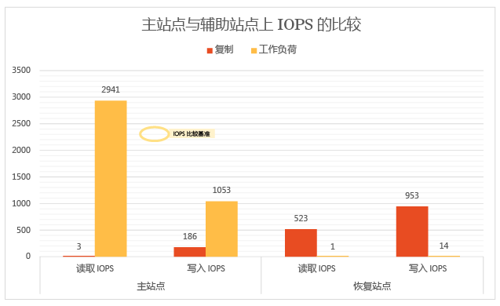
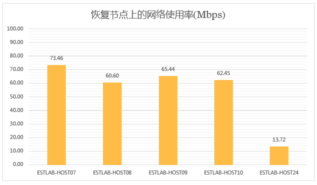
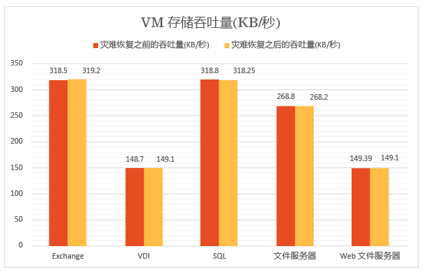
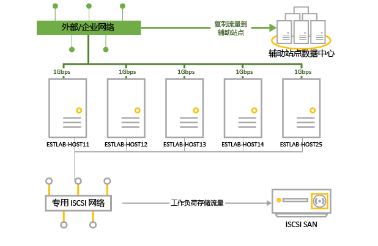
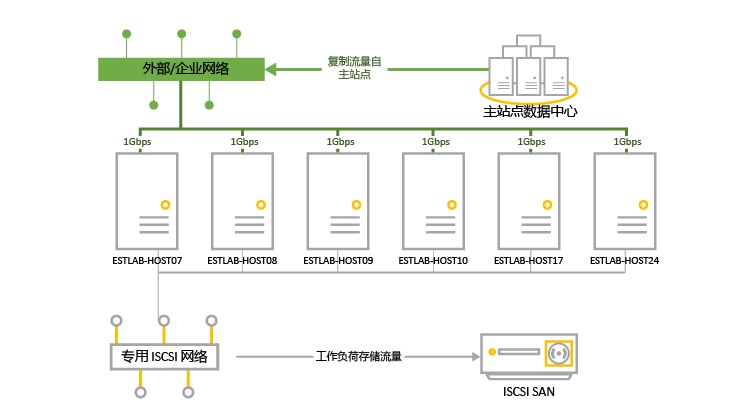

<properties
	pageTitle="使用 Site Recovery 进行本地到本地 Hyper-V 复制的性能测试和缩放结果 | Azure"
	description="本文介绍了使用 Azure Site Recovery 进行本地到本地复制时的性能测试。"
	services="site-recovery"
	documentationCenter=""
	authors="csilauraa"
	manager="jwhit"
	editor="tysonn"/>

<tags
	ms.service="site-recovery"
	ms.date="12/14/2015"
	wacn.date="01/14/2016"/>

# 使用 Site Recovery 进行本地到本地 Hyper-V 复制的性能测试和缩放结果

你可以使用 Azure Site Recovery 来协调和管理从虚拟机和物理服务器到 Azure 或辅助数据中心的复制。本文提供了我们在两个本地数据中心之间进行 Hyper-V 虚拟机复制时执行的性能测试的结果。

## 概述

测试目标是观察在稳定状态复制期间 Azure Site Recovery 的性能如何。当虚拟机已完成初始复制并且在同步增量更改时会发生稳定状态复制。使用稳定状态对性能进行测量非常重要，因为除非发生意外中断，这是大多数虚拟机保持的状态。

测试部署包括两个本地站点，每个站点中有一台 VMM 服务器。此测试部署是典型的总公司/分公司部署，总公司作为主站点，分公司作为辅助站点或恢复站点。

### 我们的操作

下面是我们在测试过程中执行的操作：

1. 使用 VMM 模板创建虚拟机。

1. 启动虚拟机并捕获 12 个小时内的基准性能指标。

1. 在主 VMM 服务器和恢复 VMM 服务器上创建云。

1. 在 Azure Site Recovery 中配置云保护，包括源云和恢复云的映射。

1. 为虚拟机启用保护并让它们完成初始复制。

1. 等待几个小时以便系统达到稳定状态。

1. 捕获 12 个小时内的性能指标，需要确保所有虚拟机在那 12 个小时内都保持在预期的复制状态。

1. 测量基准性能指标与复制性能指标之间的增量。

## 测试部署结果

### 主服务器性能

- Hyper-V 副本以异步方式跟踪对日志文件的更改，从而最大限度地降低了主服务器上的存储开销。

- Hyper-V 副本利用自我维护的内存缓存最大程度地降低用于跟踪的 IOPS 开销。它将向 VHDX 进行的写入存储在内存中，并在将日志发送到恢复站点之前将它们刷新到日志文件中。如果写入数达到了预先确定的限制，也会发生磁盘刷新。

- 下图显示了复制的稳定状态 IOPS 开销。我们可以看到由复制导致的 IOPS 开销大约为 5%，非常低。

Hyper-V 副本利用主服务器上的内存来优化磁盘性能。如下图中所示，主群集中所有服务器上的内存开销都很低。所显示的内存开销是复制使用的内存占 Hyper-V 服务器上安装的总内存的百分比。

Hyper-V 副本具有最小的 CPU 开销。如图中所示，复制的开销范围是 2-3%。

### 辅助（恢复）服务器性能

Hyper-V 副本使用恢复服务器上的少量内存来使存储操作数量最优化。图中汇总了恢复服务器上的内存使用率。所显示的内存开销是复制使用的内存占 Hyper-V 服务器上安装的总内存的百分比。

恢复站点上的 I/O 操作数量是主站点上的写入操作数量的一个函数。让我们在与主站点上的总 I/O 操作量和写入操作量进行比较的情况下看一下恢复站点上的总 I/O 操作量。图中显示，恢复站点上的总 IOPS 大约是

- 主站点上的写入 IOPS 的 1.5 倍。

- 主站点上的总 IOPS 的 37%。

### 复制对网络利用率的影响

在现有的每秒 5 GB 带宽中，在主节点与恢复节点（启用了压缩功能）之间平均每秒使用了 275 MB 网络带宽。

### 复制对虚拟机性能的影响

一个重要的注意事项是复制对在虚拟机上运行的生产工作负荷的影响。如果主站点针对复制进行了充分的设置，则不应当对工作负荷产生任何影响。Hyper-V 副本的轻量跟踪机制可以确保在虚拟机中运行的工作负荷在稳定状态复制期间不受影响。下图中对此进行了解释。

此图显示了在启用复制之前和之后运行各种工作负荷的虚拟机执行的 IOPS。你可以看到两者之间没有差别。

下图显示了在启用复制之前和之后运行各种工作负荷的虚拟机的吞吐量。你可以看到复制没有明显影响。

### 结束语

我们的结果清晰地表明，与 Hyper-V 副本配合使用的 Azure Site Recovery 可以针对大型群集以最小的开销很好地进行扩展。Azure Site Recovery 提供了简单的部署、复制、管理和监视。Hyper-V 副本为成功进行复制扩展提供了必要的基础结构。为规划最佳的部署，建议你下载 [Hyper-V 副本容量规划器](https://www.microsoft.com/zh-cn/download/details.aspx?id=39057)。

## 测试环境详细信息

### 主站点

- 主站点具有一个群集，其中包含运行着 470 个虚拟机的五台 Hyper-V 服务器。

- 各个虚拟机运行不同的工作负载，并且都启用了 Azure Site Recovery 保护。

- 群集节点的存储是由一个 iSCSI SAN 提供的。型号 - Hitachi HUS130。

- 每台群集服务器具有四个网卡 (NIC)，每个为 1 Gbps。

- 两个网卡连接到一个 iSCSI 专用网络，另外两个网卡连接到一个外部企业网络。其中一个外部网络保留给群集通信使用。

|服务器|RAM|型号|处理器|处理器数目|NIC|软件|
|---|---|---|---|---|---|---|
|群集中的 Hyper-V 服务器： ESTLAB-HOST11 ESTLAB-HOST12 ESTLAB-HOST13 ESTLAB-HOST14 ESTLAB-HOST25|128ESTLAB-HOST25 有 256 个|Dell ™ PowerEdge ™ R820|Intel(R) Xeon(R) CPU E5-4620 0 @ 2.20GHz|4|I Gbps x 4|Windows Server Datacenter 2012 R2 (x64) + Hyper-V 角色|
|VMM 服务器|2|||2|1 Gbps|Windows Server Database 2012 R2 (x64) + VMM 2012 R2|

### 辅助（恢复）站点

- 辅助站点具有一个六节点的故障转移群集。

- 群集节点的存储是由一个 iSCSI SAN 提供的。型号 - Hitachi HUS130。

|服务器|RAM|型号|处理器|处理器数目|NIC|软件|
|---|---|---|---|---|---|---|
|群集中的 Hyper-V 服务器： ESTLAB-HOST07 ESTLAB-HOST08 ESTLAB-HOST09 ESTLAB-HOST10|96|Dell ™ PowerEdge ™ R720|Intel(R) Xeon(R) CPU E5-2630 0 @ 2.30GHz|2|I Gbps x 4|Windows Server Datacenter 2012 R2 (x64) + Hyper-V 角色|
|ESTLAB-HOST17|128|Dell ™ PowerEdge ™ R820|Intel(R) Xeon(R) CPU E5-4620 0 @ 2.20GHz|4||Windows Server Datacenter 2012 R2 (x64) + Hyper-V 角色|
|ESTLAB-HOST24|256|Dell ™ PowerEdge ™ R820|Intel(R) Xeon(R) CPU E5-4620 0 @ 2.20GHz|2||Windows Server Datacenter 2012 R2 (x64) + Hyper-V 角色|
|VMM 服务器|2|||2|1 Gbps|Windows Server Database 2012 R2 (x64) + VMM 2012 R2|

### 服务器工作负载

- 针对测试用途，我们选取了企业客户方案中常用的工作负载。

- 我们使用 [IOMeter](http://www.iometer.org) 与表中汇总的工作负载特性进行模拟。

- 所有 IOMeter 配置文件都设置为写入随机字节以模拟工作负载的最坏情况写入模式。

|工作负载|I/O 大小 (KB)|访问百分比|读取百分比|未完成的 I/O|I/O 模式|
|---|---|---|---|---|---|
|文件服务器|48163264|60%20%5%5%10%|80%80%80%80%80%|88888|全部 100% 随机|
|SQL Server（卷 1）SQL Server（卷 2）|864|100%100%|70%0%|88|100% 随机100% 连续|
|Exchange|32|100%|67%|8|100% 随机|
|工作站/VDI|464|66%34%|70%95%|11|两者都 100% 随机|
|Web 文件服务器|4864|33%34%33%|95%95%95%|888|全部 75% 随机|

### 虚拟机配置

- 主群集上有 470 个虚拟机。

- 所有虚拟机都具有 VHDX 磁盘。

- 虚拟机运行表中汇总的工作负载。所有虚拟机都是使用 VMM 模板创建的。

|工作负载|VM 数目|最小 RAM (GB)|最大 RAM (GB)|每个 VM 的逻辑磁盘大小 (GB)|最大 IOPS|
|---|---|---|---|---|---|
|SQL Server|51|1|4|167|10|
|Exchange Server|71|1|4|552|10|
|文件服务器|50|1|2|552|22|
|VDI|149|0.5|1|80|6|
|Web 服务器|149|0.5|1|80|6|
|总计|470|||96.83 TB|4108|

### Azure Site Recovery 设置

- 针对本地到本地保护配置了 Azure Site Recovery

- VMM 服务器配置有四个云，包含 Hyper-V 群集服务器及其虚拟机。

|主 VMM 云|云中受保护的虚拟机数目|复制频率|额外的恢复点|
|---|---|---|---|
|PrimaryCloudRpo15m|142|15 分钟|无|
|PrimaryCloudRpo30s|47|30 秒|无|
|PrimaryCloudRpo30sArp1|47|30 秒|1|
|PrimaryCloudRpo5m|235|5 分钟|无|

### 性能指标

此表汇总了在部署中测量到的性能指标和计数器。

|度量值|计数器|
|---|---|
|CPU|\Processor(_Total)\% Processor Time|
|可用内存|\Memory\Available MBytes|
|IOPS|\PhysicalDisk(_Total)\Disk Transfers/sec|
|VM 读取 (IOPS) 操作数/秒|\Hyper-V Virtual Storage Device(<VHD>)\Read Operations/Sec|
|VM 写入 (IOPS) 操作数/秒|\Hyper-V Virtual Storage Device(<VHD>)\Write Operations/S|
|VM 读取吞吐量|\Hyper-V Virtual Storage Device(<VHD>)\Read Bytes/sec|
|VM 写入吞吐量|\Hyper-V Virtual Storage Device(<VHD>)\Write Bytes/sec|

## 后续步骤

- [设置两个本地 VMM 站点之间的保护](/documentation/articles/site-recovery-vmm-to-vmm/)

 

<!---HONumber=Mooncake_0104_2016-->