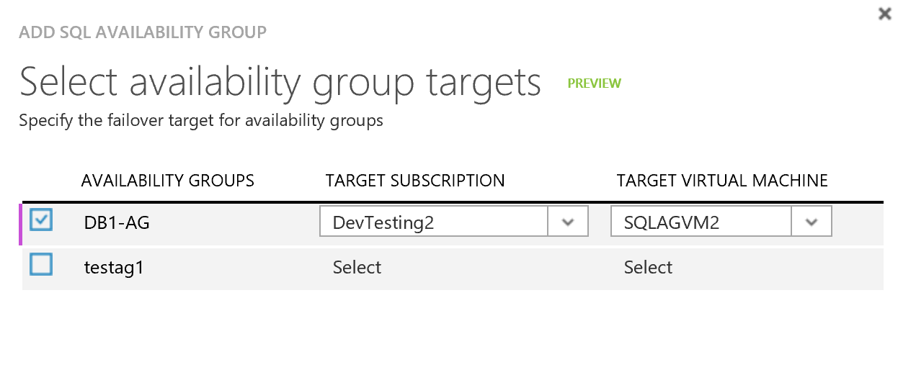

<properties 
	pageTitle="使用 SQL Server 灾难恢复和 Azure Site Recovery 来保护 SQL Server | Azure" 
	description="本文介绍如何使用 Azure Site Recovery 的 SQL Server 灾难功能来复制 SQL Server。" 
	services="site-recovery" 
	documentationCenter="" 
	authors="rayne-wiselman" 
	manager="jwhit" 
	editor="tysonn"/>

<tags 
	ms.service="site-recovery"  
	ms.date="02/14/2016" 
	wacn.date="04/05/2016"/>

# 使用 SQL Server 灾难恢复和 Azure Site Recovery 来保护 SQL Server 

Azure Site Recovery 服务有助于业务连续性和灾难恢复 (BCDR) 策略，因为它可以协调虚拟机和物理服务器的复制、故障转移和恢复。虚拟机可复制到 Azure 中，也可复制到本地数据中心中。如需快速概览，请阅读[什么是 Azure Site Recovery？](/documentation/articles/site-recovery-overview/)。

 本文介绍如何结合使用 SQL Server BCDR 技术和 Azure Site Recovery 来保护应用程序的 SQL Server 后端。你应该先充分了解 SQL Server 灾难恢复功能（故障转移群集、AlwaysOn 可用性组、数据库镜像和日志传送）与 Azure Site Recovery，然后再部署本文中所述的方案。

## 概述

许多工作负载都使用 SQL Server 作为基础。SharePoint、Dynamics 和 SAP 等应用程序使用 SQL Server 实现数据服务。应用程序会以各种不同的方式部署 SQL Server：

- **独立 SQL Server**：SQL Server 和所有数据库都承载于单个计算机（物理或虚拟）上。当虚拟化时，主机群集用于本地高可用性。不会实施来宾级别的高可用性。
- **SQL Server 故障转移群集实例 (Always On FCI)**：在一个 Windows 故障转移群集中配置两个或更多个带共享磁盘的 SQL Server 实例节点。如果任何群集实例关闭，群集可以将 SQL Server 故障转移到其他实例。此设置通常用于主站点上的 HA。这不能防止共享存储层中出现故障或中断。共享磁盘可以使用 ISCSI、光纤通道或共享 VHDX 来实现。
- **SQL Always ON 可用性组**：在此设置中，使用同步复制与自动故障转移在可用性组中配置 SQL Server 数据库时，在不共享任何内容的群集中设置两个节点。

在 Enterprise Edition 中，SQL Server 还提供了本机灾难恢复技术，用于将数据库恢复到远程站点。在本文中，我们将运用并集成这些本机 SQL 灾难恢复技术：

- SQL Server 2012 或 2014 Enterprise Edition 灾难恢复的 SQL Always On 可用性组
- SQL Server Standard Edition（任何版本）或 SQL Server 2008 R2 高安全性模式下的 SQL 数据库镜像

Site Recovery 可以保护下表中汇总的 SQL Server。

 |**本地到本地** | **本地到 Azure**
---|---|---
**Hyper-V** | 是 | 是
**VMware** | 是 | 是
**物理服务器** | 是 | 是

## 支持和集成

本文中的方案支持以下 SQL Server 版本：

- SQL Server 2014 Enterprise 和 Standard
- SQL Server 2012 Enterprise 和 Standard
- SQL Server 2008 R2 Enterprise 和 Standard

Site Recovery 可与下表中汇总的本机 SQL Server BCDR 技术集成，以提供灾难恢复解决方案。

**功能** |**详细信息** | **SQL Server 版本** 
---|---|---
**AlwaysOn 可用性组** | 
SQL Server 的多个独立实例，每个实例在包含多个节点的故障转移群集中运行。
 
数据库可以分组到可在 SQL Server 实例上复制（镜像）的故障转移组，因此不需要任何共享存储。
 
在主站点与一个或多个辅助站点之间提供灾难恢复。使用同步复制与自动故障转移在可用性组中配置 SQL Server 数据库时，可以在不共享任何内容的群集中设置两个节点。
 | SQL Server 2014/2012 Enterprise 版本
**故障转移群集 (AlwaysOn FCI)** | 
SQL Server 利用 Windows 故障转移群集实现本地 SQL Server 工作负载的高可用性。

使用共享磁盘运行 SQL Server 实例的节点是在故障转移群集中配置的。如果实例关闭，群集将故障转移到另一个节点。
 
群集无法防止共享存储出现故障或中断。共享磁盘可以使用 iSCSI、光纤通道或共享 VHDX 来实现。
 | SQL Server Enterprise 版本

SQL Server Standard 版本（仅限两个节点）
**数据库镜像（高安全性模式）** | 在单个辅助副本中保护单个数据库。提供高安全性（同步）和高性能（异步）复制模式。不需要故障转移群集。 | 
SQL Server 2008 R2

SQL Server Enterprise 的所有版本

**独立 SQL Server** | SQL Server 和数据库托管在单个服务器（物理或虚拟）上。如果是虚拟服务器，则主机群集用于高可用性。没有来宾级别的高可用性。 | Enterprise 或 Standard 版本

## 部署建议

下表汇总了有关将 SQL Server BCDR 技术与 Site Recovery 集成的建议。

**版本** |**版本** | **部署** | **本地到本地** | **本地到 Azure** 
---|---|---|---|---
SQL Server 2014 或 2012 | Enterprise | 故障转移群集实例 | AlwaysOn 可用性组 | AlwaysOn 可用性组
| Enterprise | 实现高可用性的 AlwaysOn 可用性组 | AlwaysOn 可用性组 | AlwaysOn 可用性组
 | 标准 | 故障转移群集实例 (FCI) | 使用本地镜像进行 Site Recovery 复制 | 使用本地镜像进行 Site Recovery 复制
 | Enterprise 或 Standard | 独立 | 站点恢复复制 | 站点恢复复制
SQL Server 2008 R2 | Enterprise 或 Standard | 故障转移群集实例 (FCI) | 使用本地镜像进行 Site Recovery 复制 | 使用本地镜像进行 Site Recovery 复制
 | Enterprise 或 Standard | 独立 | 站点恢复复制 | 站点恢复复制
SQL Server（任何版本） | Enterprise 或 Standard | 故障转移群集实例 - DTC 应用程序 | 站点恢复复制 | 不支持

## 部署先决条件

以下是开始之前需要满足的条件：

- 运行受支持 SQL Server 版本的本地 SQL Server 部署。通常还需要为 SQL Server 安装 Active Directory。
- 要部署的方案所要满足的先决条件。可在每篇部署文章中找到先决条件。[Site Recovery 概述](/documentation/articles/site-recovery-overview/)中提供了这些内容的链接。
- 如果你要在 Azure 中设置恢复，则需要在 SQL Server 虚拟机上运行 [Azure 虚拟机准备情况评估](http://www.microsoft.com/download/details.aspx?id=40898)工具，以确保虚拟机与 Azure 和 Site Recovery 兼容。

## 设置 Active Directory

需要在辅助恢复站点上安装 Active Directory 才能使 SQL Server 正常运行。可以使用以下几个选项：

- **小型企业** — 如果你有少量的应用程序和适用于本地站点的单个域控制器，而且你想要故障转移整个站点，则我们建议你使用 Site Recovery 复制将域控制器复制到辅助数据中心或 Azure。

- **中大型企业** — 如果你有大量的应用程序、你运行的是 Active Directory 林，而且你想要按应用程序或工作负载进行故障转移，则我们建议你在辅助数据中心或 Azure 配置附加的域控制器。请注意，如果你要使用 AlwaysOn 可用性组恢复到远程站点，建议你在辅助站点或 Azure 上配置另一个域控制器，供已恢复 SQL Server 实例使用。

本文档中的说明假设辅助位置提供了域控制器。[详细了解](/documentation/articles/site-recovery-active-directory/)如何使用 Site Recovery 保护 Active Directory。

## 使用 SQL Server Always-On（本地至 Azure）集成保护

### 在 VMM 云中保护 Hyper-V VM

Site Recovery 本身支持 SQL AlwaysOn。如果你已创建 SQL 可用性组并且 Azure 虚拟机设置为“辅助”，则可以使用 Site Recovery 来管理可用性组的故障转移。

>[AZURE.NOTE] 此功能目前处于预览状态，当主要数据中心的 Hyper-V 主机服务器由 VMM 云管理时可供使用。

#### 先决条件

以下是当你从 VMM 复制时，将 SQL AlwaysOn 与 Site Recovery 集成所需的内容：

- 本地 SQL Server（独立服务器或故障转移群集）。
- 一个或多个装有 SQL Server 的 Azure 虚拟机
- 已在本地 SQL Server 与 Azure 中运行的 SQL Server 之间设置 SQL 可用性组
- 应在本地 SQL Server 计算机上启用 PowerShell 远程处理。VMM 服务器应该能够对 SQL Server 进行远程 PowerShell 调用。
- 在本地 SQL Server 上，应该将一个至少具有以下权限的用户帐户添加到以下 SQL 用户组：
	- ALTER AVAILABILITY GROUP：[此处](https://msdn.microsoft.com/zh-cn/library/hh231018.aspx)和[此处](https://msdn.microsoft.com/zh-cn/library/ff878601.aspx#Anchor_3)的权限
	- ALTER DATABASE — [此处](https://msdn.microsoft.com/zh-cn/library/ff877956.aspx#Security)的权限
- 在 VMM 服务器上，应针对上一步中的帐户创建一个运行方式帐户
- 本地运行的 SQL Server 上和 Azure 虚拟机上应安装 SQL PS 模块
- 在 Azure 上运行的虚拟机中应安装 VM 代理
- NTAUTHORITY\\System 应该对 Azure 中的虚拟机上运行的 SQL Server 具有以下权限：
	- ALTER AVAILABILITY GROUP — [此处](https://msdn.microsoft.com/zh-cn/library/hh231018.aspx)和[此处](https://msdn.microsoft.com/zh-cn/library/ff878601.aspx#Anchor_3)的权限
	- ALTER DATABASE — [此处](https://msdn.microsoft.com/zh-cn/library/ff877956.aspx#Security)的权限

####  步骤 1：添加 SQL Server

1. 单击“添加 SQL”以添加新的 SQL Server。 

2. 在“配置 SQL 设置”>“名称”中，提供一个友好名称来表示 SQL Server。
3. 在“SQL Server (FQDN)”中，指定要添加的源 SQL Server 的 FQDN。如果 SQL Server 安装在故障转移群集上，请提供群集的 FQDN，而不是任何群集节点的 FQDN。  
4. 在“SQL Server 实例”中，选择默认实例或提供自定义实例的名称。
5. 在“VMM 服务器”中，选择在 Site Recovery 保管库中注册的 VMM 服务器。Site Recovery 会使用此 VMM 服务器来与 SQL Server 通信。
6. 在“运行方式帐户”中，提供在指定 VMM 服务器上创建的运行方式帐户的名称。此帐户用于访问 SQL Server，并且应该对 SQL Server 计算机上的可用性组具有读取和故障转移权限。

	

添加 SQL Server 之后，它就会显示在“SQL Server”选项卡中。

#### 步骤 2：添加 SQL 可用性组

1. 添加 SQL Server 计算机后，下一步是将可用性组添加到 Site Recovery。为此，请向下钻取到在上一步骤中添加的 SQL Server，然后单击“添加 SQL 可用性组”。 

	

2. SQL 可用性组可以复制到 Azure 中的一个或多个虚拟机。添加 SQL 可用性组时，系统将要求你提供 Azure 虚拟机的名称和订阅，Site Recovery 会将可用性组故障转移到该虚拟机中。

	

3. 在上述示例中，可用性组 DB1-AG 在故障转移之后，将变成订阅 DevTesting2 中运行的虚拟机 SQLAGVM2 上的主节点。

>[AZURE.NOTE] 只有上述步骤中添加为 SQL Server 上的主节点的可用性组可以添加到 Site Recovery 中。如果已在 SQL Server 上将可用性组设为主节点，或在添加可用性组后在 SQL Server 上添加了更多可用性组，请使用 SQL Server 上的“刷新”选项进行刷新。

#### 步骤 3：创建恢复计划

下一步是使用虚拟机和可用性组创建恢复计划。 
选择在步骤 1 中所用的同一 VMM 服务器作为源，并选择 Microsoft Azure 作为目标。

在本示例中，Sharepoint 应用程序包含 3 个虚拟机，这些虚拟机使用 SQL 可用性组作为后端。在此恢复计划中，我们可以同时选择可用性组以及构成应用程序的虚拟机。

你可以通过将虚拟机移到不同的故障转移组排列故障转移的顺序来进一步自定义恢复计划。始终先故障转移可用性组，因为它用作任何应用程序的后端。

### 步骤 4：故障转移

将可用性组添加到恢复计划后，可以使用不同的故障转移选项。

故障转移 | 详细信息
--- | ---
**计划的故障转移** | 计划的故障转移意味着不会丢失数据的故障转移。若要实现该故障转移，应先将 SQL 可用性组的可用性模式设置为“同步”，然后触发故障转移以使可用性组在提供的虚拟机上成为主节点，同时将可用性组添加到 Site Recovery。完成故障转移之后，可用性模式将设置为触发计划故障转移之前的相同值。
**未计划的故障转移** | 非计划的故障转移可能会造成数据丢失。触发非计划的故障转移时，可用性组的可用性模式不会更改，使可用性组在提供的虚拟机上成为主节点，同时将可用性组添加到 Site Recovery。完成非计划的故障转移并且运行 SQL Server 的本地服务器再次可用之后，必须在可用性组上触发反向复制。请注意，此操作不可用于恢复计划，但可以对“SQL Server”选项卡下的“SQL 可用性组”执行。
**测试故障转移** | 不支持对 SQL 可用性组执行测试故障转移。如果对包含 SQL 可用性组的恢复计划触发测试故障转移，则会跳过可用性组的故障转移。

请考虑以下故障转移选项。

选项 | 详细信息
--- | ---
**选项 1** | 1.执行应用程序层和前端层的测试故障转移。  2.更新应用程序层，以便在只读模式下访问副本，并执行应用程序的只读测试。
**方法 2** | 1.创建副本 SQL Server 虚拟机实例的副本（使用 VMM 克隆进行站点到站点备份或 Azure 备份），并在测试网络中启动该副本   2.使用恢复计划执行测试故障转移。

步骤 5：故障回复

如果你想要再次在本地 SQL Server 上使可用性组成为主节点，可以通过在恢复计划上触发计划的故障转移，并选择从 Microsoft Azure 到本地 VMM 服务器的方向来实现。

>[AZURE.NOTE] 在执行非计划的故障转移之后，必须在可用性组上触发反向复制才能继续复制。在完成此操作之前，复制将保持暂停状态。

### 不使用 VMM 保护计算机

对于不由 VMM 服务器管理的环境，可以使用 Azure 自动化 Runbook 来配置 SQL 可用性组的脚本化故障转移。以下是配置步骤：

1.	为脚本创建本地文件，以故障转移可用性组。此示例脚本将在 Azure 副本上指定可用性组的路径，并将其故障转移到该副本实例。此脚本将通过使用自定义脚本扩展传递，以便在 SQL Server 副本虚拟机上运行。

    	Param(
    	[string]$SQLAvailabilityGroupPath
    	)
    	import-module sqlps
    	Switch-SqlAvailabilityGroup -Path $SQLAvailabilityGroupPath -AllowDataLoss -force

2.	将脚本上载到 Azure 存储帐户中的 Blob。使用以下示例：

    	$context = New-AzureStorageContext -Environment AzureChinaCloud -StorageAccountName "Account" -StorageAccountKey "Key"
    	Set-AzureStorageBlobContent -Blob "AGFailover.ps1" -Container "script-container" -File "ScriptLocalFilePath" -context $context

3.	创建 Azure 自动化 Runbook，以便在 Azure 中调用 SQL Server 副本虚拟机上的脚本。使用此示例脚本来实现此目的。[详细了解](/documentation/articles/site-recovery-runbook-automation/)如何在恢复计划中使用自动化 Runbook。

    	workflow SQLAvailabilityGroupFailover
    	{
    		param (
        		[Object]$RecoveryPlanContext
    		)

    		$Cred = Get-AutomationPSCredential -name 'AzureCredential'
	
    		#Connect to Azure
    		$AzureAccount = Add-AzureAccount -Environment AzureChinaCloud -Credential $Cred
    		$AzureSubscriptionName = Get-AutomationVariable –Name ‘AzureSubscriptionName’
    		Select-AzureSubscription -SubscriptionName $AzureSubscriptionName
    
    		InLineScript
    		{
     		#Update the script with name of your storage account, key and blob name
     		$context = New-AzureStorageContext -StorageAccountName "Account" -StorageAccountKey "Key";
     		$sasuri = New-AzureStorageBlobSASToken -Container "script-container"- Blob "AGFailover.ps1" -Permission r -FullUri -Context $context;
     
     		Write-output "failovertype " + $Using:RecoveryPlanContext.FailoverType;
               
     		if ($Using:RecoveryPlanContext.FailoverType -eq "Test")
       			{
           		#Skipping TFO in this version.
           		#We will update the script in a follow-up post with TFO support
           		Write-output "tfo: Skipping SQL Failover";
       			}
     		else
       			{
           		Write-output "pfo/ufo";
           		#Get the SQL Azure Replica VM.
           		#Update the script to use the name of your VM and Cloud Service
           		$VM = Get-AzureVM -Name "SQLAzureVM" -ServiceName "SQLAzureReplica";     
       
           		Write-Output "Installing custom script extension"
           		#Install the Custom Script Extension on teh SQL Replica VM
           		Set-AzureVMExtension -ExtensionName CustomScriptExtension -VM $VM -Publisher Microsoft.Compute -Version 1.3| Update-AzureVM; 
                    
           		Write-output "Starting AG Failover";
           		#Execute the SQL Failover script
           		#Pass the SQL AG path as the argument.
       
           		$AGArgs="-SQLAvailabilityGroupPath sqlserver:\sql\sqlazureVM\default\availabilitygroups\testag";
       
           		Set-AzureVMCustomScriptExtension -VM $VM -FileUri $sasuri -Run "AGFailover.ps1" -Argument $AGArgs | Update-AzureVM;
       
           		Write-output "Completed AG Failover";

       			}
        
    		}
    	}

4.	当您创建应用程序的恢复计划时，请添加可调用自动化 Runbook 的 "pre-Group 1 boot" 脚本化步骤以故障转移可用性组。

## 使用 SQL AlwaysOn（本地至本地）集成保护

如果 SQL Server 使用可用性组实现高可用性或使用故障转移群集实例，我们建议你也在恢复站点上使用可用性组。请注意，本指南适用于不使用分布式事务的应用程序。

1. 在可用性组中[配置数据库](https://msdn.microsoft.com/zh-cn/library/hh213078.aspx)。
2. 在辅助站点上创建新的虚拟网络。
3. 在新的虚拟网络与主站点之间配置站点到站点 VPN。
4. 在恢复站点上创建虚拟机，并在其上安装 SQL Server。
5. 将现有的 AlwaysOn 可用性组扩展为新的 SQL Server 虚拟机。将此 SQL Server 实例配置为异步副本。
6. 创建可用性组侦听器，或更新现有的侦听器，以包含异步副本虚拟机。
7. 确保应用程序场是使用侦听器设置的。如果它是使用数据库服务器名称设置的，请将其更新为使用侦听器，以便不需要在故障转移后重新配置该场。

对于使用分布式事务的应用程序，建议你使用[包含 SAN 复制的 Site Recovery](/documentation/articles/site-recovery-vmm-san/) 或 [VMWare/物理服务器站点到站点复制](/documentation/articles/site-recovery-vmware-to-vmware/)。

### 恢复计划注意事项

1. 将此示例脚本添加到主站点和辅助站点上的 VMM 库。

    	Param(
    	[string]$SQLAvailabilityGroupPath
    	)
    	import-module sqlps
    	Switch-SqlAvailabilityGroup -Path $SQLAvailabilityGroupPath -AllowDataLoss -force

2. 当您创建应用程序的恢复计划时，请添加可调用脚本的 "pre-Group 1 boot" 脚本化步骤以故障转移可用性组。

## 保护独立 SQL Server

在此配置中，建议你使用 Site Recovery 复制保护 SQL Server 计算机。确切步骤取决于 SQL Server 是设置为虚拟机还是物理服务器，以及你想要复制到 Azure 还是辅助本地站点。在 [Site Recovery 概述](/documentation/articles/site-recovery-overview/)中获取有关所有部署方案的说明。

## 保护 SQL Server 群集（Standard 或 2008 R2）

对于运行 SQL Server Standard 版本或 SQL Server 2008 R2 的群集，建议你使用 Site Recovery 复制来保护 SQL Server。

### 本地到本地

- 如果应用程序使用分布式事务，建议你为 Hyper-V 环境部署[包含 SAN 复制的 Site Recovery](/documentation/articles/site-recovery-vmm-san/)，为 VMware 环境部署 [VMware/物理服务器到 VMware](/documentation/articles/site-recovery-vmware-to-vmware/)。

- 对于非 DTC 应用程序，可使用上述方法通过利用本地高安全性数据库镜像将群集恢复为独立服务器。

### 本地到 Azure

复制到 Azure 时，Site Recovery 不支持来宾群集。SQL Server 也不会为 Standard 版本提供低成本灾难恢复解决方案。建议你在独立 SQL Server 中保护本地 SQL Server，并在 Azure 中恢复它。

1. 在本地站点中配置其他独立 SQL Server 实例。
2. 将此实例配置为需要保护的数据库的镜像。在高安全模式下配置镜像。
3.	根据环境（[Hyper-V](/documentation/articles/site-recovery-hyper-v-site-to-azure/) 或 [VMware/物理服务器](/documentation/articles/site-recovery-vmware-to-azure/)）在本地站点上配置 Site Recovery。
4.	使用 Site Recovery 复制将新的 SQL Server 实例复制到 Azure。该实例是高安全性镜像副本，因此会将它与主群集同步，但会使用站点恢复复制将它复制到 Azure。

下图演示了此设置。

### 故障回复注意事项

对于 SQL 标准群集，非计划故障转移后的故障回复需要从镜像实例 SQL 备份并还原到原始群集，然后重新建立镜像。

## 后续步骤
[详细了解](/documentation/articles/site-recovery-best-practices/)如何准备开始部署 Site Recovery。

 

<!---HONumber=Mooncake_0328_2016-->