<properties 
	pageTitle="设置本地 VMM 站点与 Azure 之间的保护" 
	description="Azure Site Recovery 可以协调位于本地 VMM 云中的 Hyper-V 虚拟机到 Azure 的复制、故障转移和恢复。" 
	services="site-recovery" 
	documentationCenter="" 
	authors="raynew" 
	manager="jwhit" 
	editor="tysonn"/>
<tags ms.service="site-recovery" ms.date="03/16/2015" wacn.date="04/11/2015"/>

# 设置本地 VMM 站点与 Azure 之间的保护

## 概述

Azure Site Recovery 可在许多部署方案中安排虚拟机的复制、故障转移和恢复，为业务连续性和灾难恢复 (BCDR) 策略发挥作用。有关部署方案的完整列表，请参阅 [Azure Site Recovery 概述](/documentation/articles/hyper-v-recovery-manager-overview)。

本方案指南介绍了如何部署 Site Recovery 针对在位于 VMM 私有云中的 Hyper-V 主机服务器上的虚拟机上运行的工作负荷安排和自动实施保护。在本方案中，使用 Hyper-V 副本将虚拟机从主 VMM 站点复制到 Azure。

指南中包括了方案的先决条件并展示了如何设置 Site Recovery 保管库，在源 VMM 服务器上安装 Azure Site Recovery 提供程序，在保管库中注册服务器，添加 Azure 存储帐户，在 Hyper-V 主机服务器上安装 Azure 恢复服务代理，为 VMM 云配置将应用于所有受保护虚拟机的保护设置，然后为这些虚拟机启用保护。最后将测试故障转移以确保一切都正常工作。

如果在设置本方案时遇到问题，请将你的问题发布到 [Azure 恢复服务论坛](https://social.msdn.microsoft.com/Forums/zh-CN/home?forum=windowsazucezhchs)。

## 准备工作

确保已满足以下先决条件：
### Azure 先决条件

- 你将需要一个 Azure 帐户。如果没有，请使用 [1rmb 试用版](http://www.windowsazure.cn/pricing/1rmb-trial/)。此外，你可以阅读 [Azure Site Recovery Manager 定价](/home/features/site-recovery/#home_rec_pri)。
- 你将需要一个 Azure 存储帐户来存储复制到 Azure 的数据。需要为帐户启用地域复制。该帐户应位于 Azure Site Recovery 服务所在的同一区域，并与同一订阅相关联。若要了解有关设置 Azure 存储的更多信息，请参阅 [Azure 存储简介](/documentation/articles/storage-introduction/)。
- 你将需要确保你要保护的虚拟机符合 Azure 要求。有关详细信息，请参阅[虚拟机支持](https://msdn.microsoft.com/zh-CN/library/azure/dn469078.aspx#BKMK_E2A)。

### VMM 先决条件
- 你需要具有运行 System Center 2012 R2 的 VMM 服务器。
- 包含你要保护的虚拟机的任何 VMM 服务器必须运行有 Azure Site Recovery 提供程序。这是在部署 Azure Site Recovery 期间安装的。
- 在 VMM 服务器上需要至少有一个你要保护的云。云应当包含：
	- 一个或多个 VMM 主机组。
	- 每个主机组中有一个或多个 Hyper-V 主机服务器或群集。
	- 源 Hyper-V 服务器上有一个或多个虚拟机。虚拟机应当是层代 1。 
- 了解有关设置 VMM 云的更多信息：
	- 阅读 [VMM 2012 和云](http://go.microsoft.com/fwlink/?LinkId=324956)中有关私有 VMM 云的更多信息。 
	- 了解有关[配置 VMM 云结构](https://msdn.microsoft.com/zh-CN/library/azure/dn469075.aspx#BKMK_Fabric)的更多信息
	- 在你的云结构元素就位后，通过[在 VMM 中创建私有云](http://technet.microsoft.com/en-us/library/jj860425.aspx)和[演练：使用 System Center 2012 SP1 VMM 创建私有云](http://blogs.technet.com/b/keithmayer/archive/2013/04/18/walkthrough-creating-private-clouds-with-system-center-2012-sp1-virtual-machine-manager-build-your-private-cloud-in-a-month.aspx)了解有关创建私有云的更多信息。

### Hyper-V 先决条件

- Hyper-V 主机服务器必须至少运行具有 Hyper-V 角色且安装了最新更新的 Windows Server 2012。
- 如果你在群集中运行 Hyper-V，请注意，如果你具有基于静态 IP 地址的群集，则不会自动创建群集代理。你需要手动配置群集代理。有关说明，请参阅[配置 Hyper-V 副本代理](http://technet.microsoft.com/zh-cn/library/jj134153.aspx#BKMK_1_4)。
- 你要为其管理保护的任何 Hyper-V 主机服务器或群集必须包括在 VMM 云中。

### 网络映射先决条件
当在 Azure 中保护虚拟机时，网络映射会在源 VMM 服务器上的 VM 网络与目标 Azure 网络之间进行映射以实现以下功能： 

- 在同一网络上进行故障转移的所有计算机都可以彼此连接到对方，不管它们位于哪个恢复计划中。
- 如果在目标 Azure 网络上设置了网络网关，则虚拟机可以连接到其他本地虚拟机。
- 如果没有配置网络映射，则只有在同一恢复计划中进行故障转移的虚拟机能够在故障转移到 Azure 后彼此连接到对方。

如果希望部署网络映射，需要满足下列条件：

- 源 VMM 服务器上你要保护的虚拟机应当连接到某个 VM 网络。该网络应当该链接到与该云相关联的逻辑网络。
- 具有在故障转移后复制的虚拟机可以连接到的 Azure 网络。你将在故障转移时选择此网络。此网络应当与你的 Azure Site Recovery 订阅位于同一区域中。 
- 了解有关网络映射的更多信息：
	- [在 VMM 中配置逻辑网络](http://technet.microsoft.com/zh-cn/library/jj721568.aspx)
	- [在 VMM 中配置 VM 网络和网关](http://technet.microsoft.com/zh-cn/library/jj721575.aspx)
	- [在 Azure 中配置和监视虚拟网络](http://azure.microsoft.com/zh-cn/documentation/services/virtual-network/)

## 步骤 1：创建一个 Site Recovery 保管库

1. 从你要注册的 VMM 服务器登录到[管理门户](https://manage.windowsazure.cn)。

2. 依次展开"数据服务"、"恢复服务"，然后单击"Site Recovery 保管库"<b></b><b></b><b></b>。

3. 依次单击"新建"、"快速创建"<b></b><b></b>。
	

4. 在"名称"<b></b>中，输入一个友好名称以标识此保管库。

5. 在"区域"<b></b>中，为保管库选择地理区域。可用的地理区域包括"东亚"、"西欧"、"华北"、"美国东部"、"北欧"、"东南亚"。
6. 单击"创建保管库"<b></b>。 

	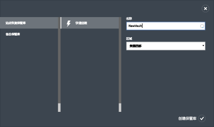

检查状态栏以确认保管库已成功创建。该保管库将在主"恢复服务"页上列为"活动"<b></b>。

## 步骤 2：生成保管库注册密钥
 
在保管库中生成一个注册密钥。在下载 Azure Site Recovery 提供程序并将其安装到 VMM 服务器上后，你将使用此密钥在保管库中注册 VMM 服务器。

1. 在"恢复服务"页面中<b></b>，单击保管库以打开"快速启动"页面。也可随时使用该图标打开"快速启动"。

	

2. 在下拉列表中，选择"本地 Hyper-V 站点与 Microsoft Azure 之间"。
3. 在"准备 VMM 服务器"中，单击"生成注册密钥文件"。密钥文件将自动生成并且自生成后在 5 天内有效。如果你不是从 VMM 服务器访问 Azure 门户，则需要将此文件复制到服务器。

	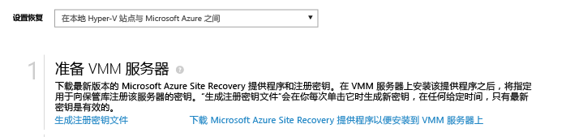

## 步骤 3：安装 Azure Site Recovery 提供程序

4. 在"快速启动"页面上<b></b>，在"准备 VMM 服务器"中，单击"下载用于在 VMM 服务器上安装的 Microsoft Azure Site Recovery 提供程序"<b></b>来获取最新版本的提供程序安装文件。

2. 在源 VMM 服务器上运行此文件。如果 VMM 部署到群集中并且你是首次安装该提供程序，请将其安装在一个活动节点上并完成安装以在保管库中注册 VMM 服务器。然后在其他节点上安装该提供程序。请注意，如果你是在升级提供程序，则需要在所有节点上进行升级，因为所有节点都应当运行相同的提供程序版本。

3. 在"先决条件检查"中，选择停止 VMM 服务以开始安装提供程序。该服务会停止，并将在安装程序完成时自动重新启动。如果你是在 VMM 群集上进行安装，则会提示你停止群集角色。

	

4. 在"Microsoft Update"中，你可以选择获取更新。当启用了此设置时，将根据你的 Microsoft 更新策略自动安装提供程序更新。

	

安装提供程序后，继续设置以在保管库中注册服务器。

5. 在"Internet 连接"中，指定在 VMM 服务器上运行的提供程序如何连接到 Internet。选择"使用默认系统代理设置"以使用服务器上配置的默认 Internet 连接设置<b></b>。

	
	- 如果希望使用自定义代理，则应当在安装该提供程序之前设置它。当配置自定义代理设置时，会运行测试来检查代理连接。
	- 如果你确实使用自定义代理，或者你的默认代理要求进行身份验证，则需要输入代理详细信息，包括代理地址和端口。
	- 你应当豁免以下地址通过代理进行路由：
		- 用于连接到 Azure Site Recovery 的 URL：*.hypervrecoverymanager.windowsazure.com
		- *.accesscontrol.windows.net
		- *.backup.windowsazure.com
		- *.blob.core.windows.net 
		- *.store.core.windows.net 
	- 如果你需要允许到 Azure 域控制器的出站连接，请允许 [Azure 数据中心 IP 范围](https://msdn.microsoft.com/zh-CN/library/azure/dn175718.aspx)中描述的 IP 地址，并允许 HTTP (80) 和 HTTPS (443) 协议。 
	- 如果你使用自定义代理，则将使用指定的代理凭据自动创建一个 VMM 运行身份帐户 (DRAProxyAccount)。对代理服务器进行配置以便该帐户可以成功通过身份验证。可以在 VMM 控制台中修改 VMM 运行身份帐户设置。若要执行此操作，请打开"设置"工作区，展开"安全性"，单击"运行身份帐户"，然后修改 DRAProxyAccount 的密码。你将需要重新启动 VMM 服务以使此设置生效。

6. 在"注册密钥"中，选择你从 Azure Site Recovery 下载并复制到 VMM 服务器的密钥。
7. 在"保管库名称"中，验证将在其中注册服务器的保管库的名称。
8. 在"服务器名称"中，指定一个友好名称以在保管库中标识该 VMM 服务器。在群集配置中，请指定 VMM 群集角色名称。

	
	

8. 在"初始云元数据同步"中，选择是否要将 VMM 服务器上所有云的元数据与保管库进行同步。此操作在每个服务器上只需执行一次。如果你不希望同步所有云，可以将此设置保留为未选中状态并在 VMM 控制台中的云属性中分别同步各个云。

9. 在"数据加密"中，指定用于保存为数据加密自动生成的 SSL 证书的位置。如果在 Azure Site Recovery 门户中为受 Azure 保护的云启用数据加密，则会使用此证书。请确保该证书安全。当你运行到 Azure 的故障转移时，将选择该证书以便对加密的数据进行解密。 

	

8. 单击"注册"<b></b>完成此过程。注册后，Azure Site Recovery 将检索 VMM 服务器中的元数据。服务器将显示在保管库中"服务器"页面上的"资源"选项卡的末尾。<b></b>

## 步骤 4：创建 Azure 存储帐户

如果你没有 Azure 存储帐户，请单击"添加 Azure 存储帐户"。该帐户应已启用地域复制。该帐户必须位于 Azure Site Recovery 服务所在的同一区域，并与同一订阅相关联。

## 步骤 5：安装 Azure 恢复服务代理

在 VMM 云中要保护的每个 Hyper-V 主机服务器上安装 Azure 恢复服务代理。

1. 在"快速启动"页上，单击"下载 Azure Site Recovery 服务代理并安装在主机上"<b></b>，以获取最新版本的代理安装文件。

	

2. 在 VMM 云中要保护的每个 Hyper-V 主机服务器上运行安装文件。
3. 在"先决条件检查"页上，单击<b></b>"下一步"。将自动安装任何缺少的必备组件。

	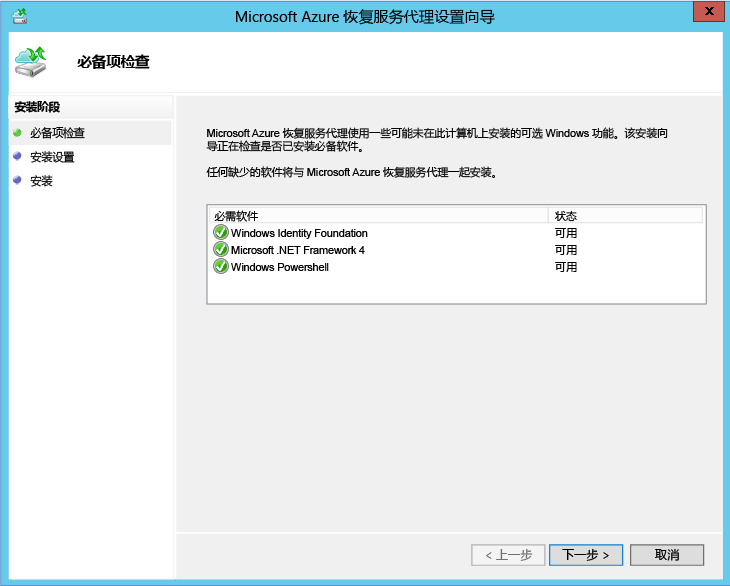

4. 在"安装设置"页上，指定要安装代理的位置，并选择将在其中安装备份元数据的缓存位置。然后，单击"安装"<b></b>。

## 步骤 6：配置云保护设置

在注册 VMM 服务器后，你可以配置云保护设置。因为你在安装提供程序时启用了选项"与保管库同步云数据"，所以，VMM 服务器上的所有云都将显示在保管库中的"受保护的项"选项卡上<b></b>。

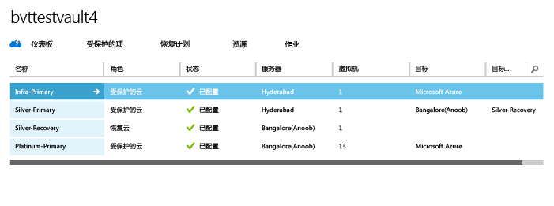

1. 在"快速启动"页上，单击"为 VMM 云设置保护"。
2. 在"受保护的项"选项卡上，单击你要配置的云，然后转到"配置"选项卡。
3. 在"目标"中<b></b>，选择"Microsoft Azure"<b></b>。
4. 在"存储帐户"<b></b>中，选择要用来存储 Azure 虚拟机的 Azure 存储。
5. 将"加密存储的数据"<b></b>设置为"关闭"<b></b>。此设置指定应该加密在本地站点与 Azure 之间复制的数据。
6. 在"复制频率"<b></b>中，保留默认设置。此值指定数据应在源和目标位置之间同步的频率。
7. 在"恢复点保留时长"<b></b>中，保留默认设置。当默认值为零时，副本主机服务器上只存储主虚拟机的最新恢复点。
8. 在"与应用程序一致的快照的频率"<b></b>中，保留默认设置。此值指定创建快照的频率。快照使用卷影复制服务 (VSS) 来确保应用程序在拍摄快照时处于一致状态。如果确实要设置一个值，请确保该值小于你配置的附加恢复点数。
9. 在"复制开始时间"<b></b>中，指定应开始向 Azure 进行初始数据复制的时间。将使用 Hyper-V 主机服务器上的时区。我们建议你将初始复制安排在非高峰时段进行。 

	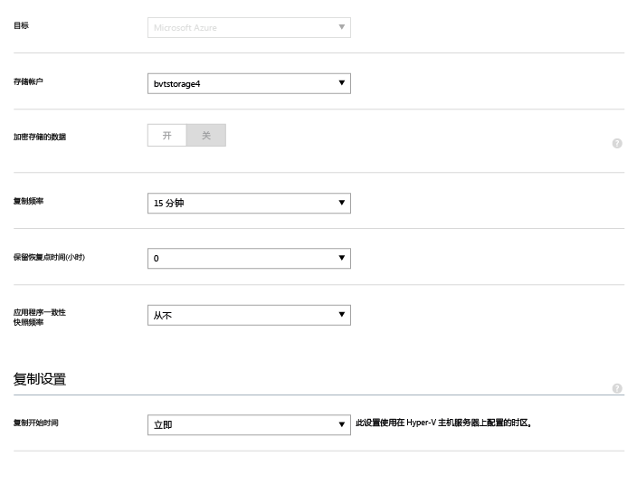

在保存设置后，将创建一个作业，可以在"作业"选项卡上监视该作业<b></b>。VMM 源云中的所有 Hyper-V 主机服务器将为复制进行配置。

保存后，可以在"配置"<b></b>选项卡上修改云设置。若要修改目标位置或目标存储，需要删除云配置，然后重新配置云。请注意，如果你更改存储帐户，在修改存储帐户后，只对已启用保护的虚拟机应用更改。现有虚拟机不会迁移到新的存储帐户。

## 步骤 7：配置网络映射
在开始网络映射之前，请验证源 VMM 服务器上的虚拟机是否已连接到一个 VM 网络。该 VM 网络应该链接到与受保护的云相关联的逻辑网络。此外，请创建一个或多个 Azure 虚拟机。注意，可以将多个 VM 网络映射到单个 Azure 网络。 

1. 在"快速启动"页面上，单击"映射网络"。
2. 在"网络"选项卡上，在"源位置"中，选择源 VMM 服务器。在"目标位置"中，选择"Azure"。
3. 在"源网络"中，会显示与 VMM 服务器关联的 VM 网络的列表。在"目标网络"中，会显示与订阅关联的 Azure 网络。
4. 选择源 VM 网络并单击"映射"。
5. 在"选择目标网络"页上，选择要使用的目标 VM 网络。
6. 单击复选标记以完成映射过程。

	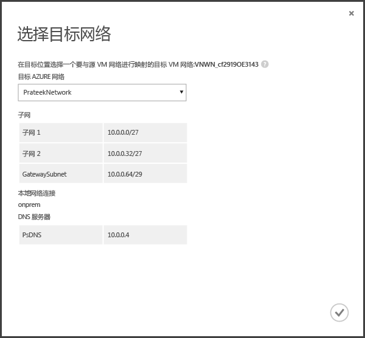

在保存设置后，将启动一个作业来跟踪映射进度，可以在"作业"选项卡上监视该作业。与源 VM 网络对应的任何现有副本虚拟机都将连接到目标 Azure 网络。在复制后，连接到源 VM 网络的新虚拟机将连接到映射的 Azure 网络。如果你修改了与新网络之间的映射，则会使用新设置来连接副本虚拟机。

请注意，如果目标网络具有多个子网，并且其中一个子网与源虚拟机所在的子网同名，则在故障转移后副本虚拟机将连接到该目标子网。如果没有具有匹配名称的目标子网，则虚拟机将连接到网络中的第一个子网。 

## 步骤 8：为虚拟机启用保护

在正确配置服务器、云和网络后，你可以为云中的虚拟机启用保护。注意以下事项：

- 虚拟机必须满足 Azure 要求。可以在规划指南中的<a href="https://msdn.microsoft.com/zh-CN/library/dn469078.aspx">先决条件和支持</a>中查看这些要求。
- 若要启用保护，必须为虚拟机设置操作系统和操作系统磁盘属性。当你使用虚拟机模板在 VMM 中创建虚拟机时，可以设置属性。也可以在虚拟机属性的"常规"和"硬件配置"选项卡上为现有虚拟机设置这些属性。如果未在 VMM 中设置这些属性，可以在 Azure Site Recovery 门户中配置它们。

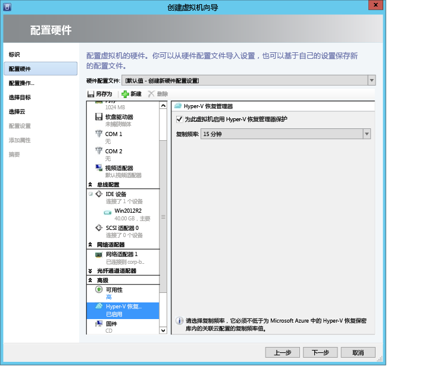

1. 若要启用保护，请在虚拟机所在的云中的"虚拟机"<b></b>选项卡上单击"启用保护"<b></b>，然后选择"添加虚拟机"<b></b>。
2. 从云中的虚拟机列表中，选择要保护的虚拟机。 

	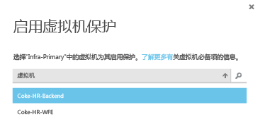

3. 验证虚拟机属性并根据需要进行修改。

	

在"作业"选项卡中跟踪"启用保护"操作的进度，包括初始复制。在"完成保护"作业运行之后，虚拟机就可以进行故障转移了。在启用保护并复制虚拟机后，你将能够在 Azure 中查看它们。

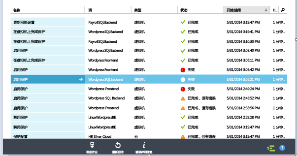

## 测试你的部署
若要测试你的部署，可针对一台虚拟机运行测试故障转移，或者创建一个包括多个虚拟机的恢复计划并针对该计划运行测试故障转移。测试故障转移在隔离的网络中模拟你的故障转移和恢复机制。注意：

- 如果想要在故障转移之后使用远程桌面连接到 Azure 中的虚拟机，请在虚拟机上启用远程桌面连接，然后运行测试故障转移。
- 在故障转移后，你将使用公共 IP 地址通过远程桌面连接到 Azure 中的虚拟机。如果要执行此操作，请确保没有任何域策略阻止你使用公共地址连接到虚拟机。

### 创建恢复计划

1. 在"恢复计划"选项卡上，添加一个新计划。指定一个名称，在"源类型"中指定"VMM"，在"源"中指定源 VMM 服务器。目标将是 Azure。

	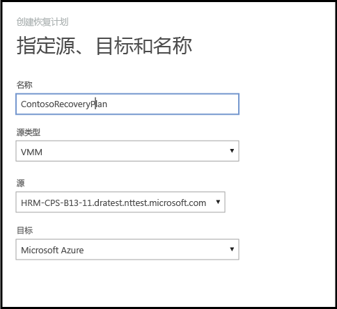

2. 在"选择虚拟机"页上，选择要添加到恢复计划的虚拟机。这些虚拟机将添加到恢复计划的默认组（组 1）中。最多将测试单个恢复计划中的 100 个虚拟机。

	- 如果希望在将虚拟机添加到计划之前验证虚拟机属性，请在虚拟机所在云的属性页上单击该虚拟机。你还可以在 VMM 控制台中配置虚拟机属性。
	- 显示的所有虚拟机都已启用了保护。此列表包括已启用了保护且已完成初始复制的虚拟机和已启用了保护但未完成初始复制的那些虚拟机。在执行恢复计划期间，只有已完成了初始复制的虚拟机可以进行故障转移。因此，在启动恢复计划故障转移之前，请验证计划中虚拟机的初始复制状态。 
	

	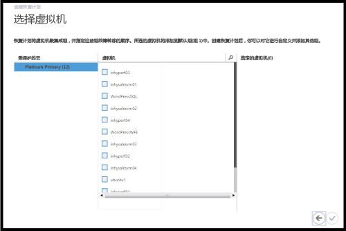

在创建恢复计划后，它将出现在"恢复计划"选项卡中。

### 运行测试故障转移

可通过两种方式运行到 Azure 的测试故障转移。

- 没有 Azure 网络的测试故障转移-此类型的测试故障转移检查虚拟机是否可以正常在 Azure 中运行。在故障转移后，虚拟机不会连接到任何 Azure 网络。
- 具有 Azure 网络的测试故障转移-此类型的故障转移检查整个复制环境是否可以按预期运行，并且在故障转移后，虚拟机将连接到指定的目标 Azure 网络。对于测试故障转移的子网处理，将根据副本虚拟机的子网确定测试虚拟机的子网。这不同于常规复制，在常规复制中，副本虚拟机的子网是根据源虚拟机的子网确定的。

如果你希望在不指定 Azure 目标网络的情况下为启用了保护的虚拟机运行到 Azure 的测试故障转移，则不需要做任何准备。若要运行具有目标 Azure 网络的测试故障转移，你将需要创建一个与你的 Azure 生产网络相隔离的新 Azure 网络（你在 Azure 中新建网络时的默认行为），并设置基础结构以便复制的虚拟机可以按预期方式工作。例如：

示例：使用 Azure Site Recovery 将包含 Active Directory 和 DNS 的虚拟机复制到 Azure。若要运行测试故障转移，请执行以下操作：

1. 在你将用于为本地虚拟机执行实际的测试故障转移的同一网络中执行 Active Directory 虚拟机和 DNS 虚拟机的测试故障转移。
2. 记下分配给故障转移后的 Active Directory 和 DNS 虚拟机的 IP 地址。
3. 在将用于故障转移的 Azure 虚拟网络中，将这两个 IP 地址添加为 DNS 和 Active Directory 服务器的地址。
4. 在指定 Azure 网络的情况下运行源本地虚拟机的测试故障转移。
5. 在验证测试故障转移按预期方式工作后，将测试故障转移标记为已针对恢复计划完成，然后将测试故障转移标记为已针对 Active Directory 和 DNS 虚拟机完成。

若要运行测试故障转移，请执行以下操作：

1. 在"恢复计划"选项卡上，选择该计划并单击"测试故障转移"。
2. 在"确认测试故障转移"页上，选择"无"或选择一个特定的 Azure 网络。请注意，如果你选择了"无"，则测试故障转移将检查虚拟机是否可以正确复制到 Azure，但不会检查你的复制网络配置。

	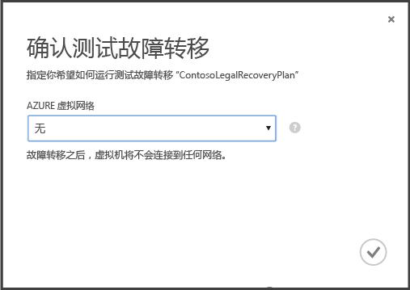

3. 如果为云启用了数据加密，请在"加密密钥"中选择你在打开此选项为云启用数据加密时在 VMM 服务器上安装提供程序期间颁发的证书。
4. 在"作业"选项卡上，你可以跟踪故障转移进度。在 Azure 门户中，你应当也能够看到虚拟机测试副本。如果你已设置为从本地网络访问虚拟机，则可以启动与虚拟机的远程桌面连接。
5. 在故障转移到达"完成测试"阶段时，单击"完成测试"以结束测试故障转移。你可以向下钻取到"作业"选项卡来跟踪故障转移进度和状态以及执行所需的任何操作。
6.  在故障转移完成后，执行以下操作：
	- 验证虚拟机是否成功启动。
	- 单击"说明"以记录并保存与测试故障转移相关联的任何观测结果。
	- 单击"测试故障转移已完成"。清理测试环境以自动关闭测试虚拟机的电源，并删除测试 Azure 网络。
5. 在故障转移后，你将能够在 Azure 门户中看到虚拟机测试副本。如果你已设置为从本地网络访问虚拟机，则可以启动与虚拟机的远程桌面连接。注意：

- 如果想要在故障转移之后使用远程桌面连接到 Azure 中的虚拟机，请在虚拟机上启用远程桌面连接，然后运行测试故障转移。
- 在故障转移后，你将使用公共 IP 地址通过远程桌面连接到 Azure 中的虚拟机。如果要执行此操作，请确保没有任何域策略阻止你使用公共地址连接到虚拟机。

<h2>监视活动</h2>

你可以使用"作业"选项卡和"仪表板"来查看和监视由 Azure Site Recovery 保管库执行的主作业，包括为云配置保护、为虚拟机启用和禁用保护、运行故障转移（计划内的、计划外的或测试），以及提交计划外故障转移<b></b><b></b>。

从"作业"选项卡中，你可以查看作业，深入了解作业详细信息和错误，运行作业查询以检索符合特定条件的作业，将作业导出到 Excel，以及重新启动失败的作业。<b></b>

从"仪表板"中，你可以下载提供程序和代理安装文件的最新版本，获取保管库的配置信息，查看其保护是由保管库管理的虚拟机的数量，查看最近的作业，管理保管库证书，以及重新同步虚拟机<b></b>。

有关与作业和仪表板交互的详细信息，请参阅<a href="https://msdn.microsoft.com/zh-CN/library/dn788906.aspx">操作和监视指南</a>。

<h2>后续步骤</h2>
<UL>
<LI>若要在完全的生产环境中规划和部署 Azure Site Recovery，请参阅 <a href="https://msdn.microsoft.com/zh-CN/library/azure/dn469074.aspx">Azure Site Recovery 规划指南</a>和 <a href="https://msdn.microsoft.com/zh-CN/library/sazure/dn168841.aspx">Azure Site Recovery 部署指南</a>。</LI>

<LI>如有问题，请访问 <a href="https://social.msdn.microsoft.com/Forums/zh-CN/home?forum=windowsazucezhchs">Azure 恢复服务论坛</a>。</LI> 
</UL>

<!--HONumber=51-->