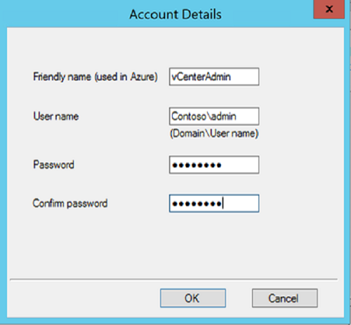
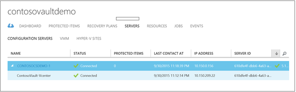
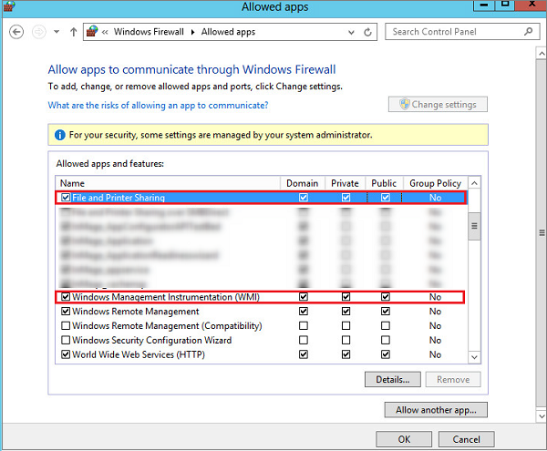
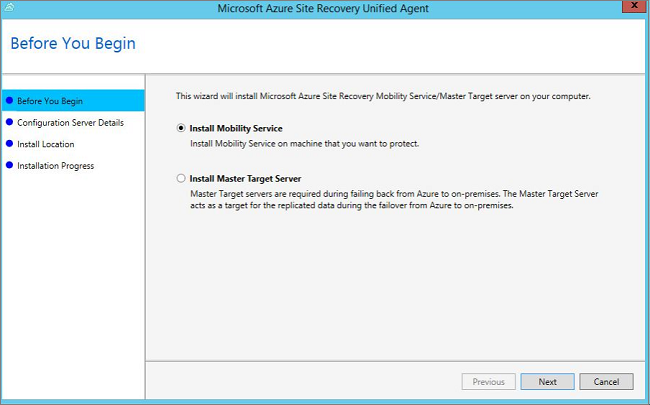
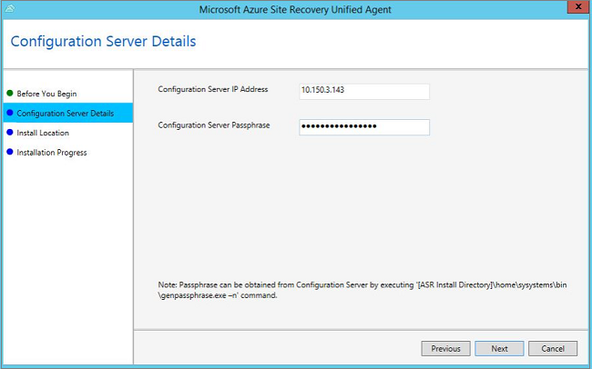
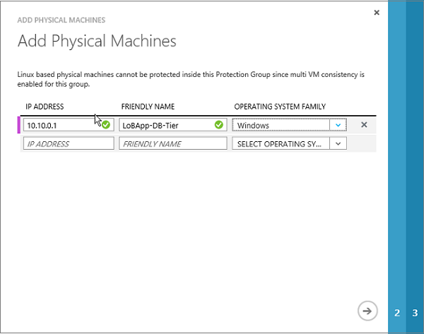
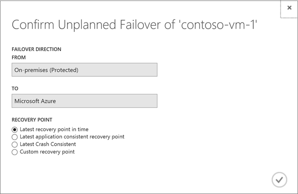

<properties
	pageTitle="通过 Azure Site Recovery 将 VMware 虚拟机和物理服务器复制到 Azure | Azure" 
	description="本文介绍如何通过部署 Azure Site Recovery 来协调本地 VMware 虚拟机和 Windows/Linux 物理服务器到 Azure 的复制、故障转移和恢复。" 
	services="site-recovery"
	documentationCenter=""
	authors="rayne-wiselman"
	manager="jwhit"
	editor=""/>

<tags
	ms.service="site-recovery"
	ms.date="03/15/2016"
	wacn.date="04/05/2016"/>

# 通过 Azure Site Recovery 将 VMware 虚拟机和物理服务器复制到 Azure

> [AZURE.SELECTOR]
- [增强版](/documentation/articles/site-recovery-vmware-to-azure-classic)
- [旧版](/documentation/articles/site-recovery-vmware-to-azure-classic-legacy)

Azure Site Recovery 服务有助于业务连续性和灾难恢复 (BCDR) 策略，因为它可以协调虚拟机和物理服务器的复制、故障转移和恢复。虚拟机可复制到 Azure 中，也可复制到本地数据中心中。如需快速概览，请阅读[什么是 Azure Site Recovery？](/documentation/articles/site-recovery-overview)。

## 概述

本文将介绍如何：

- **将 VMware 虚拟机复制到 Azure** - 部署 Site Recovery，以便协调本地 VMware 虚拟机到 Azure 存储空间的复制、故障转移和恢复。
- **将物理服务器复制到 Azure** - 部署 Azure Site Recovery，以便协调本地 Windows 和 Linux 物理服务器到 Azure 的复制、故障转移和恢复。

>[AZURE.NOTE] 本文介绍如何复制到 Azure。如果你要将 VMware VM 或 Windows/Linux 物理服务器复制到辅助数据中心，请按[此文章](/documentation/articles/site-recovery-vmware-to-vmware)中的说明操作。

请将任何评论或问题发布到本文底部，或者发布到 [Azure 恢复服务论坛](https://social.msdn.microsoft.com/Forums/zh-cn/home?forum=hypervrecovmgr)。

## 增强型部署 

本文包含的说明适用于经典 Azure 门户中的增强型部署。建议你将此版本用于所有全新的部署。如果你已使用旧版本进行了部署，则建议你迁移到新版本。阅读有关迁移的[详细信息](/documentation/articles/site-recovery-vmware-to-azure-classic-legacy)。

增强型部署是一种重大更新。下面是我们所做改进的摘要：

- **在 Azure 中没有基础结构 VM**：数据直接复制到 Azure 存储帐户。此外，对于复制和故障转移，不设置任何在旧部署中所需的基础结构 VM（配置服务器、主目标服务器）。  
- **统一安装**：统一安装可以方便本地组件的安装和伸缩操作。
- **安全部署**：所有流量都进行加密，复制管理通信经 HTTPS 443 发送。
- **恢复点**：支持崩溃状态一致的以及与应用程序一致的恢复点（适用于 Windows 和 Linux 环境），支持单 VM 和多 VM 一致的配置。
- **测试性故障转移**：支持不中断的测试性故障转移（故障转移到 Azure），不影响生产，也不会导致复制暂停。
- **非计划的故障转移**：支持非计划的故障转移（故障转移到 Azure），并可在故障转移之前通过增强版选项来自动关闭 VM。
- **故障回复**：集成式故障回复，仅将增量更改复制回本地站点。
- **vSphere 6.0**：有限支持，支持进行 VMware Vsphere 6.0 部署。

## Site Recovery 是如何帮助你保护虚拟机和物理服务器的？

- VMware 管理员可以配置针对 Azure 的非现场保护，保护运行在 VMware 虚拟机上的业务工作负荷和应用程序。服务器管理员可以将本地 Windows 和 Linux 物理服务器复制到 Azure。
- Azure Site Recovery 控制台可以对复制、故障转移和恢复过程进行集中且简单的设置和管理。
- 如果你复制受 vCenter 服务器管理的 VMware 虚拟机，则 Site Recovery 可以自动发现这些 VM。如果虚拟机位于 ESXi 主机上，则 Site Recovery 可以发现该主机上的 VM。
- 运行简单的故障转移，从本地基础结构故障转移到 Azure，并运行故障回复（还原），从 Azure 故障回复到本地站点中的 VMware VM 服务器。 
- 配置恢复计划，将分布到多个计算机中的应用程序工作负荷组合到一起。你可以对这些计划进行故障转移，而 Site Recovery 提供多 VM 一致性，因此可以将运行相同工作负荷的计算机一起恢复到某个一致的数据点。

## 方案体系结构

方案组件：

- **本地管理服务器**：管理服务器运行 Site Recovery 组件：
	- **配置服务器**：协调通信，同时管理数据复制和恢复过程。
	- **进程服务器**：充当复制网关。此服务器接收受保护源计算机提供的数据，通过缓存、压缩和加密对其进行优化，然后将复制数据发送到 Azure 存储空间。它还处理用于保护计算机的移动服务的推送安装，并执行 VMware VM 的自动发现。
	- **主目标服务器**：处理从 Azure 进行故障回复期间产生的复制数据。你还可以部署仅充当进程服务器的管理服务器，以便进行部署缩放。
- **移动服务**：此组件部署在要复制到 Azure 的每个计算机（VMware VM 或物理服务器）上。它可以捕获计算机上的数据写入，并将其转发到进程服务器。
- **Azure**：不需创建任何 Azure VM 来处理复制和故障转移。Site Recovery 服务处理数据管理操作，数据直接复制到 Azure 存储空间。仅当故障转移到 Azure 时，才会自动启动复制的 Azure VM。但是，如果你需要从 Azure 故障回复到本地站点，则需设置一个充当进程服务器的 Azure VM。

此图显示了这些组件的交互方式。

## 容量规划

计划容量时，需考虑以下问题：

- **源环境** - 容量规划或 VMware 基础结构和源计算机要求。
- **管理服务器** - 针对运行 Site Recovery 组件的本地管理服务器进行规划。
- **从源到目标的网络带宽** - 针对所需的网络带宽进行规划，以便在源和 Azure 之间进行复制

### 源环境注意事项

- **每日最大更改率** - 一台受保护的计算机只能使用一个进程服务器，一个进程服务器每日可以处理高达 2 TB 的数据更改。因此，2 TB 是受保护计算机支持的每日数据更改率上限。
- **最大吞吐量** - 在 Azure 中，一个复制的计算机可能属于一个存储帐户。标准存储帐户每秒最多可以处理 20,000 个请求，因此建议你将源计算机中的 IOPS 数目保持在 20,000。例如，如果你的源计算机有 5 个磁盘，每个磁盘在源上生成 120 IOPS（8K 大小），则处于 Azure 的单磁盘 IOPS 限制 (500) 内。所需的存储帐户数 = 源 IOPS 总计/20000。 
 

### 管理服务器注意事项

管理服务器运行的 Site Recovery 组件负责处理数据的优化、复制和管理。该服务器应该能够处理跨所有工作负荷（运行在受保护的计算机上）的每日更改率容量，并有足够的带宽，可以持续地将数据复制到 Azure 存储空间。具体而言：

- 进程服务器接收受保护计算机提供的复制数据，并在发送到 Azure 之前对其通过缓存、压缩和加密进行优化。管理服务器应有足够的资源来执行这些任务。
- 处理服务器使用基于磁盘的缓存。建议在出现网络瓶颈或中断时，使用单独的大小至少为 600 GB 的缓存磁盘来处理存储的数据更改。在部署过程中，你可以在可用存储空间至少为 5 GB 的任何驱动器上配置缓存，但建议的最小大小为 600 GB。
- 根据最佳实践，我们建议你将管理服务器置于与所要保护的计算机相同的网络和 LAN 网段上。可以将它置于另一网络中，但所要保护的计算机应可通过 L3 网络来查看它。 

下表总结了管理服务器的建议大小。

**管理服务器 CPU** | **内存** | **缓存磁盘大小** | **数据更改率** | **受保护的计算机**
--- | --- | --- | --- | ---
8 个 vCPU（2 个插槽 * 4 个核心 @ 2.5GHz） | 16 GB | 300 GB | 500 GB 或更少 | 使用这些设置来部署管理服务器，可复制数量不到 100 台计算机。
12 个 vCPU（2 个插槽 * 6 个核心 @ 2.5GHz） | 18 GB | 600 GB | 500 GB 到 1 TB | 使用这些设置来部署管理服务器，可复制数量为 100-150 台计算机。
16 个 vCPU（2 个插槽 * 8 个核心 @ 2.5GHz） | 32 GB | 1 TB | 1 TB 到 2 TB | 使用这些设置来部署管理服务器，可复制数量为 150-200 台计算机。
部署另一个进程服务器 | | | > 2 TB | 如果你要复制 200 多台计算机，或者每日数据更改率超过 2 TB，则需部署额外的进程服务器。

其中：

- 每台源计算机均配置 3 个磁盘，每个磁盘 100 GB。
- 我们使用了包含 8 个 SAS 驱动器 (10 K RPM) 的基准测试存储空间，使用 RAID 10 进行缓存磁盘度量。

### 从源到目标的网络带宽
请确保计算带宽，带宽是使用 [容量规划器工具](/documentation/articles/site-recovery-capacity-planner)进行初始复制和增量复制所必需的

#### 限制用于复制的带宽

复制到 Azure 的 VMware 流量会经过特定的进程服务器。你可以在该服务器上限制用于 Site Recovery 复制的带宽，如下所示：

1. 在主管理服务器或运行其他预配的进程服务器的管理服务器上打开 Azure 备份 MMC 管理单元。默认情况下，会在桌面上创建 Azure 备份的快捷方式，你也可以在 C:\\Program Files\\Microsoft Azure Recovery Services Agent\\bin\\wabadmin 中找到它。
2. 在管理单元中，单击“更改属性”。

	

3. 在“限制”选项卡上，指定可以用于 Site Recovery 复制和相应计划的带宽。

	

（可选）你也可以使用 PowerShell 来设置限制。下面是一个示例：

    Set-OBMachineSetting -WorkDay $mon, $tue -StartWorkHour "9:00:00" -EndWorkHour "18:00:00" -WorkHourBandwidth (512*1024) -NonWorkHourBandwidth (2048*1024) 

#### 最大化带宽使用率 
若要增大通过 Azure Site Recovery 进行复制时的带宽使用率，你需要更改注册表项。

以下项控制进行复制时每个复制磁盘所使用的线程数

    HKEY_LOCAL_MACHINE\SOFTWARE\Microsoft\Microsoft Azure Backup\Replication\UploadThreadsPerVM

 在“过度预配型”网络中，此注册表项需要更改，不能使用默认值。我们支持的最大数为 32。

[详细了解](/documentation/articles/site-recovery-capacity-planner)容量规划细节。

### 额外的进程服务器

如果你需要保护的计算机超过 200 台，或者每日更改率大于 2 TB，则可添加更多服务器来处理负载。若要横向扩展，你可以执行以下操作：

- 增加管理服务器的数量。例如，你可以通过两台管理服务器来保护最多 400 台计算机。
- 添加更多进程服务器，使用这些服务器来处理流量，而不是添加管理服务器。

下表介绍了一种方案，在该方案中：

- 你对原始管理服务器进行了设置，仅将其用作配置服务器。
- 你还设置了一个进程服务器。
- 你将受保护的虚拟机配置为使用这个额外的进程服务器。
- 每台受保护的源计算机配置为了三个磁盘，每个磁盘 100 GB。

**原始管理服务器**  （配置服务器） | **额外的进程服务器**| **缓存磁盘大小** | **数据更改率** | **受保护的计算机**
--- | --- | --- | --- | --- 
8 个 vCPU（2 个插槽 * 4 个核心 @ 2.5GHz），16 GB 内存 | 4 个 vCPU（2 个插槽 * 2 个核心 @ 2.5GHz），8 GB 内存 | 300 GB | 250 GB 或更少 | 你可以复制 85 台或更少的计算机。
8 个 vCPU（2 个插槽 * 4 个核心 @ 2.5GHz），16 GB 内存 | 8 个 vCPU（2 个插槽 * 4 个核心 @ 2.5GHz），12 GB 内存 | 600 GB | 250 GB 到 1 TB | 你可以复制 85-150 台计算机。
12 个 vCPU（2 个插槽 * 6 个核心 @ 2.5GHz），18 GB 内存 | 12 个 vCPU（2 个插槽 * 6 个核心 @ 2.5GHz），24 GB 内存 | 1 TB | 1 TB 到 2 TB | 你可以复制 150-225 台计算机。

使用哪种方式来扩展服务器将取决于你是喜欢向上扩展模型还是横向扩展模型。向上扩展时，需部署数个高端管理服务器和进程服务器，而横向扩展时，则需部署较多服务器，需要的资源较少。例如，如果你需要对 220 台计算机进行保护，则可执行以下某项操作：

- 将原始的管理服务器配置为 12vCPU，18 GB 内存，将额外的进程服务器配置为 12vCPU，24 GB 内存，将受保护计算机配置为仅使用额外的进程服务器。
- 也可以配置两个管理服务器（2 x 8vCPU，16 GB 内存）和两个额外的进程服务器（1 x 8vCPU 和 4vCPU x 1，可处理 135 + 85 (220) 台计算机），并将受保护计算机配置为仅使用额外的进程服务器。
  

[按照这些说明](#deploy-additional-process-servers)设置额外的进程服务器。

## 在开始部署之前

这些表总结了部署该方案的先决条件。

### Azure 先决条件

**先决条件** | **详细信息**
--- | ---
**Azure 帐户**| 需要一个 [Azure](https://azure.cn/) 帐户。你可以从 [1rmb 试用版](/pricing/1rmb-trial/)开始。[详细了解](/home/features/site-recovery#price) Site Recovery 定价。 
**Azure 存储空间** | 你将需要使用 Azure 存储帐户来存储复制的数据。复制的数据存储在 Azure 空间，Azure VM 在发生故障转移时启动。  你需要[标准异地冗余存储帐户](/documentation/articles/storage-redundancy#geo-redundant-storage)。该帐户必须位于 Site Recovery 服务所在的同一区域，并与同一订阅相关联。请注意，目前不支持复制到高级存储帐户，因此不应使用该功能。  我们不支持跨资源组移动使用新 Azure 门户创建的存储帐户。[阅读](/documentation/articles/storage-introduction)有关 Azure 存储空间的信息。   
**Azure 网络** | 你需要一个 Azure 虚拟网络，以便发生故障转移时 Azure VM 能够连接到其中。Azure 虚拟网络所在的区域必须与 Site Recovery 保管库所在的区域相同。  请注意，若要在故障转移到 Azure 后进行故障回复，你需要设置一个 VPN 连接（或 Azure ExpressRoute），以便从 Azure 网络连接到本地站点。 

### 本地先决条件

**先决条件** | **详细信息**
--- | ---
**管理服务器** | 你需要一个运行在虚拟机或物理服务器上的本地 Windows 2012 R2 服务器。所有本地 Site Recovery 组件都安装在此管理服务器上   建议你将此服务器部署成高度可用的 VMware VM。从 Azure 故障回复到本地站点时，将始终故障回复到 VMware VM，不管你是对 VM 还是物理服务器进行了故障转移。如果你不将管理服务器配置为 VMware VM，则需将单独的主目标服务器设置为 VMware VM 来接收故障回复流量。  该服务器应该有一个静态 IP 地址。  该服务器的主机名至多为 15 个字符。  操作系统区域设置只能为英语。  管理服务器需要 Internet 访问权限。  你需要从服务器进行出站访问，详情如下：在安装 Site Recovery 组件（用于下载 MySQL）过程中在 HTTP 80 上进行临时访问；在 HTTPS 443 上进行持续的出站访问，以便进行复制管理；在 HTTPS 9443 上进行针对复制流量的持续出站访问（此端口可以修改）   确保可从管理服务器访问这些 URL： - *.hypervrecoverymanager.windowsazure.cn - *.accesscontrol.chinacloudapi.cn - *.backup.windowsazure.com - *.blob.core.chinacloudapi.cn - *.store.core.windows.net -https://www.msftncsi.com/ncsi.txt - [ https://dev.mysql.com/get/archives/mysql-5.5/mysql-5.5.37-win32.msi](https://dev.mysql.com/get/archives/mysql-5.5/mysql-5.5.37-win32.msi "https://dev.mysql.com/get/archives/mysql-5.5/mysql-5.5.37-win32.msi")  如果你在服务器上设置了基于 IP 地址的防火墙规则，请检查这些规则是否允许与 Azure 通信。你需要允许 [Azure 数据中心 IP 范围](https://www.microsoft.com/download/details.aspx?id=41653)和 HTTPS (433) 协议。你还需要将所订阅的 Azure 区域（以及美国西部）的 IP 地址范围加入允许列表。URL [https://dev.mysql.com/get/archives/mysql-5.5/mysql-5.5.37-win32.msi](https://dev.mysql.com/get/archives/mysql-5.5/mysql-5.5.37-win32.msi "https://dev.mysql.com/get/archives/mysql-5.5/mysql-5.5.37-win32.msi") 用于下载 MySQL。 
**VMware vCenter/ESXi 主机**： | 你需要一个或多个 vMware vSphere ESX/ESXi 虚拟机监控程序，该程序管理 VMware 虚拟机，运行 ESX/ESXi 6.0、5.5 或 5.1 版并装有最新更新。   建议你部署 VMware vCenter 服务器来管理 ESXi 主机。该服务器应运行 vCenter 6.0 或 5.5 版并装有最新更新。  请注意，Site Recovery 不支持新的 vCenter 和 vSphere 6.0 功能，例如跨 vCenter vMotion、虚拟卷和存储 DRS。Site Recovery 支持仅限也可在 5.5 版中使用的功能。
**受保护的计算机**： | **AZURE**  要保护的计算机应符合创建 Azure VM 的 [Azure 先决条件](/documentation/articles/site-recovery-best-practices#azure-virtual-machine-requirements)。  如果你需要在故障转移后连接到 Azure VM，则需在本地防火墙上启用远程桌面连接。  受保护计算机上的单个磁盘的容量不应超过 1023 GB。一台 VM 最多可以有 64 个磁盘（因此最大容量为 64 TB）。如果你的磁盘超出 1 TB，可以考虑使用数据库复制（例如 SQL Server Always On 或 Oracle 数据防护）  共享磁盘来宾群集不受支持。如果你的部署为群集式部署，可以考虑使用数据库复制，例如 SQL Server Always On 或 Oracle 数据防护。  不支持统一可扩展固件接口 (UEFI)/可扩展固件接口 (EFI) 启动。  计算机名应包含 1 到 63 个字符（字母、数字和连字符）。名称必须以字母或数字开头，并以字母或数字结尾。对计算机进行保护以后，你可以修改 Azure 名称。  **VMware VM**  你需要在管理服务器（配置服务器）上安装 VMware vSphere PowerCLI 6.0。  需要保护的 VMware VM 应已安装并运行 VMware 工具。  如果源 VM 存在 NIC 组合，该组合会在故障转移到 Azure 后转换成单个 NIC。  如果受保护 VM 有一个 iSCSI 磁盘，则在 VM 故障转移到 Azure 时，Site Recovery 会将受保护的 VM iSCSI 磁盘转换成 VHD 文件。如果 iSCSI 目标可供 Azure VM 访问，后者会连接到 iSCSI 目标且实际上会看到两个磁盘 – Azure VM 上的 VHD 磁盘，以及源 iSCSI 磁盘。在这种情况下，你需要断开显示在 Azure VM（已进行故障转移）上的 iSCSI 目标的连接。  [详细了解](#vmware-permissions-for-vcenter-access) Site Recovery 所需的 VMware 用户权限。   **WINDOWS SERVER 计算机（在 VMware VM 或物理服务器上）**  服务器应运行受支持的 64 位操作系统：Windows Server 2012 R2、Windows Server 2012 或 Windows Server 2008 R2（至少安装 SP1）。  主机名、装载点、设备名、Windows 系统路径（例如 C:\\Windows）只能为英文。  操作系统应安装在 C:\\ 驱动器上，OS 磁盘应该是 Windows 基本磁盘（OS 不应安装在 Windows 动态磁盘上。）  你需要提供一个管理员帐户（必须是 Windows 计算机上的本地管理员），以便在 Windows 服务器上推送安装移动服务。如果提供的帐户不是域帐户，则你将需要在本地计算机上禁用远程用户访问控制。[了解更多](#install-the-mobility-service-with-push-installation)。  Site Recovery 支持使用 RDM 磁盘的 VM。在故障回复期间，如果原始的源 VM 和 RDM 磁盘可用，Site Recovery 会重复使用 RDM 磁盘。如果这些磁盘不可用，则 Site Recovery 会在故障回复期间为每个磁盘创建一个新的 VMDK 文件。  **LINUX 计算机**  你需要受支持的 64 位操作系统：Red Hat Enterprise Linux 6.7；Centos 6.5、6.6、6.7；Oracle Enterprise Linux 6.4、6.5，运行 Red Hat 兼容性内核或 Unbreakable Enterprise Kernel Release 3 (UEK3)、SUSE Linux Enterprise Server 11 SP3。  受保护计算机上的 /etc/hosts 文件应包含相应条目，这些条目可将本地主机名映射到与所有网络适配器关联的 IP 地址。  如果你希望在故障转移后使用 Secure Shell 客户端 (ssh) 连接到运行 Linux 的 Azure 虚拟机，请确保受保护计算机上的 Secure Shell 服务已设置为在系统启动时自动启动，且防火墙规则允许对其进行 ssh 连接。  主机名、装载点、设备名、Linux 系统路径和文件名（例如 /etc/、/usr）只能为英文。  只能对具有以下存储的 Linux 计算机启用保护：文件系统（EXT3、ETX4、ReiserFS、XFS）；多路径软件-设备映射器（多路径））；卷管理器：(LVM2)。不支持使用 HP CCISS 控制器存储的物理服务器。ReiserFS 文件系统仅在 SUSE Linux Enterprise Server 11 SP3 上受支持。  Site Recovery 支持使用 RDM 磁盘的 VM。在针对 Linux 进行故障回复期间，Site Recovery 不重复使用 RDM 磁盘。相反，它会为每个相应的 RDM 磁盘创建新的 VMDK 文件。 

## 步骤 1：创建保管库

1. 登录到[管理门户](https://manage.windowsazure.cn/)。
2. 展开“数据服务”>“恢复服务”，并单击“Site Recovery 保管库”。
3. 单击“新建”>“快速创建”。
4. 在“名称”中，输入一个友好名称以标识此保管库。
5. 在“区域”中，为保管库选择地理区域。若要查看受支持的区域，请参阅 [Azure Site Recovery 价格详细信息](/home/features/site-recovery#price)中的“地域可用性”。
6. 单击“创建保管库”。

检查状态栏以确认保管库已成功创建。保管库将以“活动”状态列在主要的“恢复服务”页上。

## 步骤 2：设置 Azure 网络

设置一个 Azure 网络，使得 Azure VM 能够在故障转移后连接到网络，同时能够正常地故障回复到本地站点。

1. 在 Azure 门户 >“创建虚拟网络”中，指定网络名称。IP 地址范围和子网名称。
2. 如果你需要进行故障回复，则需将 VPN/ExpressRoute 添加到网络。甚至可以在故障转移后将 VPN/ExpressRoute 添加到网络。 

[阅读更多](/documentation/articles/virtual-networks-overview)有关 Azure 网络的信息。

## 步骤 3：安装 VMware 组件

如果你想要复制 VMware 虚拟机，请在管理服务器上安装以下 VMware 组件：

1. [下载](https://developercenter.vmware.com/tool/vsphere_powercli/6.0)和安装 VMware vSphere PowerCLI 6.0。
2. 重新启动服务器。

##步骤 4：下载保管库注册密钥

1. 在 Azure 中通过管理服务器打开 Site Recovery 控制台。在“恢复服务”页中，单击保管库以打开“快速启动”页。也可随时使用该图标打开“快速启动”。

	

2. 在“快速启动”页中，单击“准备目标资源”>“下载注册密钥”。此时将自动生成注册文件。该文件在生成后的 5 天内有效。

## 步骤 5：安装管理服务器
> [AZURE.TIP] 确保可通过管理服务器访问以下 URL：
>
- *.hypervrecoverymanager.windowsazure.cn
- *.accesscontrol.chinacloudapi.cn
- *.backup.windowsazure.cn
- *.blob.core.chinacloudapi.cn
- *.store.core.chinacloudapi.cn
- https://dev.mysql.com/get/archives/mysql-5.5/mysql-5.5.37-win32.msi
- https://www.msftncsi.com/ncsi.txt

1. 在“快速启动”页上，将统一的安装文件下载到服务器。
2. 运行安装文件，开始在 Site Recovery 统一安装程序向导中进行安装。
3. 在“开始之前”中选择“安装配置服务器和进程服务器”。根据部署大小，你可能需要在以后使用更多的进程服务器，但在第一次设置此部署时不需要。

	

4. 在“第三方软件安装”中，单击“我接受”以下载并安装 MySQL。

	

5. 在“Internet 设置”中，指定将安装在服务器上的提供程序如何通过 Internet 连接到 Azure Site Recovery。

	- 如果你希望提供程序直接进行连接，请选择“不使用代理直接连接”。
	- 如果你希望使用当前已在服务器上设置的代理进行连接，请选择“使用现有代理设置进行连接”。
	- 如果现有代理要求身份验证，或者你希望使用自定义代理进行提供程序连接，请选择“使用自定义代理设置进行连接”。
	- 如果你使用自定义代理，则需指定地址、端口和凭据
	- 如果你使用代理，则应可通过该代理访问以下 URL：

	

7. 在“先决条件检查”中，安装程序会在服务器上运行先决条件检查。

	

>[AZURE.WARNING] 如果看到针对“全局时间同步”先决条件检查的警告，请检查系统时钟的时间是否与时区相同。
 +	
 +	

8. 在“MySQL 配置”中，创建用于登录 MySQL 服务器实例的凭据。你可以指定以下特殊字符：“\_”、“!”、“@”、“$”、“\\”、“%”。

	

9. 在“环境详细信息”中，指定是否要复制 VMware VM。如果你已进行安装，请检查 PowerCLI 6.0 是否已安装。

	

10. 在“安装位置”中，选择要安装二进制文件和存储缓存的位置。建议你将缓存驱动器的可用空间保留为 600 GB 或更大。

	

11. 在“网络选择”中，指定侦听器（网络适配器和 SSL 端口），以便服务器在其上发送和接收复制数据。你可以修改默认端口 (9443)。除了此端口，还会在服务器上打开端口 443，以便发送和接收有关复制业务流程的信息。443 不应用于复制数据。

	

12. 在“注册”中，通过浏览查找并选择从保管库下载的注册密钥。

	

13.  在“摘要”中查看信息。

	
>[AZURE.WARNING] Microsoft Azure 恢复服务代理的代理需要进行设置。安装完成之后，从 Windows“开始”菜单启动一个名为“Microsoft Azure 恢复服务 Shell”的应用程序。在打开的命令窗口中，运行以下命令集以设置代理服务器设置。
>
	$pwd = ConvertTo-SecureString -String ProxyUserPassword
	Set-OBMachineSetting -ProxyServer http://myproxyserver.domain.com -ProxyPort PortNumb – ProxyUserName domain\\username -ProxyPassword $pwd
	net stop obengine
	net start obengine
	 

### 从命令行运行安装程序

你还可以从命令行运行统一向导，如下所示：

    UnifiedSetup.exe [/ServerMode <CS/PS>] [/InstallDrive <DriveLetter>] [/MySQLCredsFilePath <MySQL credentials file path>] [/VaultCredsFilePath <Vault credentials file path>] [/EnvType <VMWare/NonVMWare>] [/PSIP <IP address to be used for data transfer] [/CSIP <IP address of CS to be registered with>] [/PassphraseFilePath <Passphrase file path>]

其中：

- /ServerMode：必需。指定安装时是应同时安装配置服务器和进程服务器，还是只安装进程服务器（用于安装更多的进程服务器）。输入值：CS、PS。
- InstallDrive：必需。指定安装组件的文件夹。
- /MySQLCredFilePath。必需。指定存储 MySQL 服务器凭据的文件的路径。获取创建文件所需的模板。
- /VaultCredFilePath。必需。保管库凭据文件的位置
- /EnvType。必需。安装类型。值：VMware、NonVMware
- /PSIP 和 /CSIP。必需。进程服务器和配置服务器的 IP 地址。
- /PassphraseFilePath。必需。通行短语文件的位置。
- /ByPassProxy。可选。指定由管理服务器在不使用代理的情况下连接到 Azure。
- /ProxySettingsFilePath。可选。指定自定义代理（在需要身份验证的服务器上的默认代理，或自定义代理）的设置 

##步骤 6：为 vCenter 服务器设置凭据

进程服务器可以自动发现由 vCenter 服务器管理的 VMware VM。进行自动发现时，Site Recovery 需要能够访问 vCenter 服务器的帐户和凭据。如果你只复制物理服务器，则与此无关。

请按如下所述执行此操作：

1. 在 vCenter 服务器上创建一个角色 (**Azure\_Site\_Recovery**)，该角色处于 vCenter 级别，具有[所需的权限](#vmware-permissions-for-vcenter-access)。
2. 将 **Azure\_Site\_Recovery** 角色分配给 vCenter 用户。

	>[AZURE.NOTE] 具有只读角色的 vCenter 用户帐户可以运行故障转移而不关闭受保护的源计算机。如果你想要关闭这些计算机，则需 Azure\_Site\_Recovery 角色。请注意，如果你只是将 VM 从 VMware 迁移到 Azure 且不需要进行故障回复，则只读角色是足够的。

3. 若要添加该帐户，请打开 **cspsconfigtool**。该帐户作为快捷方式位于桌面上，并位于 [安装位置]\\home\\svsystems\\bin 文件夹中。
2. 在“管理帐户”选项卡中，单击“添加帐户”。

	

3. 在“帐户详细信息”中，添加能够用于访问 vCenter 服务器的凭据。请注意，帐户名称出现在门户中可能需要 15 分钟以上的时间。若要立即进行更新，请单击“配置服务器”选项卡上的“刷新”。

	

##步骤 7：添加 vCenter 服务器和 ESXi 主机

如果你要复制 VMware VM，则需添加 vCenter 服务器（或 ESXi 主机）。

1. 在“服务器”>“配置服务器”选项卡上，选择配置服务器，然后单击“添加 vCenter 服务器”。

	

2. 添加 vCenter 服务器或 ESXi 主机详细信息、在前一步骤中指定的用于访问 vCenter 服务器的帐户的名称，以及将用于发现 vCenter 服务器所管理的 VMware VM 的进程服务器。请注意，vCenter 服务器或 ESXi 主机所在的网络应与在其上安装了进程服务器的服务器所在的网络相同。

	>[AZURE.NOTE] 如果你在添加 vCenter 服务器或 ESXi 主机时使用的帐户没有对 vCenter 或主机服务器的管理员权限，则请确保 vCenter 或 ESXi 帐户启用了以下权限：数据中心、数据存储、文件夹、主机、网络、资源、虚拟机、vSphere 分布式交换机。此外，vCenter 服务器需要存储视图权限。

	

3. 发现完成之后，vCenter 服务器将列在“配置服务器”选项卡中。

	
		

##步骤 8：创建保护组

保护组包含将共享相同复制设置的虚拟机或物理服务器。

1. 打开“受保护的项”>“保护组”，然后单击即可添加一个保护组。

	

2. 在“指定保护组设置”页上，指定保护组的名称，并在“从”中选择要在其上创建该组的配置服务器。“目标”是 Azure。

	

3. 在“指定复制设置”页上，配置要用于该组中的所有计算机的复制设置。

	

	- **多 VM 一致性**：如果你将此项打开，则它将在保护组中的计算机之间创建共享的应用程序一致性恢复点。当保护组中的所有计算机运行的是相同工作负荷时，此设置最为有用。所有计算机都将恢复到相同数据点。不管你是复制 VMware VM，还是复制 Windows/Linux 物理服务器，此项均可用。
	- **RPO 阈值**：设置 RPO。当连续数据保护复制超过配置的 RPO 阈值时，将生成警报。
	- **恢复点保留期**：指定保留时段。受保护的计算机可在此时段内恢复到任何点。
	- **应用程序一致性快照频率**：指定创建包含应用程序一致性快照的恢复点的频率。

单击复选标记时，将使用指定名称创建一个保护组。此外，还将使用名称 <protection-group-name-Failback> 创建第二个保护组。如果你在故障转移到 Azure 以后故障回复到本地站点，则会使用此保护组。你可以监视保护组，因为它们是在“受保护的项”页上创建的。

## 步骤 9：安装移动服务

为虚拟机和物理服务器启用保护时，第一步是安装移动服务。可通过两种方式实现此目的：

- 从进程服务器自动推送并在每台计算机上安装该服务。请注意，如果将计算机添加到已运行适当版本移动服务的保护组，则不会进行推送安装。
- 使用企业推送方法（例如 WSUS 或 System Center Configuration Manager）自动安装该服务。请确保在执行此操作之前，已设置好管理服务器。
- 在每台要保护的计算机上手动进行安装。请确保在执行此操作之前，已设置好管理服务器。

### 使用推送安装安装移动服务

在向保护组添加计算机时，进程服务器将自动推送移动服务，并将其安装在每个计算机上。

#### 准备在 Windows 计算机上自动推送 

下面介绍了如何准备 Windows 计算机，以便进程服务器能够自动安装移动服务。

1.  创建可供进程服务器用来访问计算机的帐户。该帐户应具有管理员权限（本地或域）。请注意，这些凭据仅用于移动服务的推送安装。

	>[AZURE.NOTE] 如果你使用的不是域帐户，则需在本地计算机上禁用远程用户访问控制。为此，请在注册表的 HKEY\_LOCAL\_MACHINE\\SOFTWARE\\Microsoft\\Windows\\CurrentVersion\\Policies\\System 下添加值为 1 的 DWORD 项 LocalAccountTokenFilterPolicy。若要从 CLI 添加注册表项，请打开 cmd 或 powershell 并输入 **`REG ADD HKEY_LOCAL_MACHINE\SOFTWARE\Microsoft\Windows\CurrentVersion\Policies\System /v LocalAccountTokenFilterPolicy /t REG_DWORD /d 1`**。

2.  在要保护的计算机的 Windows 防火墙中，选择“允许应用或功能通过防火墙”并启用“文件和打印机共享”和“Windows Management Instrumentation”。对于属于某个域的计算机，你可以使用 GPO 配置防火墙策略。

	

2. 添加已创建的帐户：

	- 打开 **cspsconfigtool**。该帐户作为快捷方式位于桌面上，并位于 [安装位置]\\home\\svsystems\\bin 文件夹中。
	- 在“管理帐户”选项卡中，单击“添加帐户”。
	- 添加已创建的帐户。添加帐户后，在向保护组添加计算机时，你需要提供这些凭据。

#### 准备在 Linux 服务器上自动推送

1.	确保要保护的 Linux 计算机受支持，如[本地先决条件](#on-premises-prerequisites)中所述。确保在要保护的计算机和运行进程服务器的管理服务器之间存在网络连接。 

2.	创建可供进程服务器用来访问计算机的帐户。帐户应该是源 Linux 服务器上的 root 用户。请注意，这些凭据仅用于移动服务的推送安装。

	- 打开 **cspsconfigtool**。该帐户作为快捷方式位于桌面上，并位于 [安装位置]\\home\\svsystems\\bin 文件夹中。
	- 在“管理帐户”选项卡中，单击“添加帐户”。
	- 添加已创建的帐户。添加帐户后，在向保护组添加计算机时，你需要提供这些凭据。

3.	确保源 Linux 服务器上的 /etc/hosts 文件包含用于将本地主机名映射到所有网络适配器关联的 IP 地址的条目。
4.	在要保护的计算机上安装最新的 openssh、openssh-server 和 openssl 包。
5.	确保 SSH 已启用且正在端口 22 上运行。 
6.	在 sshd\_config 文件中启用 SFTP 子系统与密码身份验证，如下所示： 

	- 以 root 身份登录。
	- 在文件 /etc/ssh/sshd\_config 中，找到以 PasswordAuthentication 开头的行。
	- 取消注释该行，并将值从“no”更改为“yes”。
	- 找到以“Subsystem”开头的行，并取消注释该行。
 
		

### 手动安装移动服务

C:\\Program Files (x86)\\Microsoft Azure Site Recovery\\home\\svsystems\\pushinstallsvc\\repository 中提供了安装程序。

源操作系统 | 移动服务安装文件
--- | ---
Windows Server（仅限 64 位） | Microsoft-ASR\_UA\_9.*.0.0\_Windows\_* release.exe
CentOS 6.4、6.5、6.6（仅限 64 位） | Microsoft-ASR\_UA\_9.*.0.0\_RHEL6-64\_*release.tar.gz
SUSE Linux Enterprise Server 11 SP3（仅限 64 位）| Microsoft-ASR\_UA\_9.*.0.0\_SLES11-SP3-64\_*release.tar.gz
Oracle Enterprise Linux 6.4、6.5（仅限 64 位） | Microsoft-ASR\_UA\_9.*.0.0\_OL6-64\_*release.tar.gz

#### 在 Windows 服务器上手动安装

1. 下载并运行相关安装程序。
2. 在“开始之前”中选择“移动服务”。

	

3. 在“配置服务器详细信息”中，指定管理服务器的 IP 地址，以及安装管理服务器组件时生成的通行短语。你可以通过在管理服务器上运行以下命令来检索通行短语：**<SiteRecoveryInstallationFolder>\\home\\sysystems\\bin\\genpassphrase.exe –n**。

	

4. 保留“安装位置”中的默认位置，然后单击“下一步”开始进行安装。
5. 在“安装进度”中监视安装过程，并在系统提示的情况下重新启动计算机。

你还可以从命令行进行安装：

UnifiedAgent.exe [/Role <Agent/MasterTarget>] [/InstallLocation <安装目录>] [/CSIP <IP address of CS to be registered with>] [/PassphraseFilePath <通行短语文件路径>] [/LogFilePath <Log File Path>]

其中：

- /Role：必需。指定是否应安装移动服务。
- /InstallLocation：必需。指定服务安装位置。
- /PassphraseFilePath：必需。指定配置服务器通行短语。
- /LogFilePath：必需。指定日志安装程序文件位置 

#### 修改管理服务器的 IP 地址

运行向导之后，你可以修改管理服务器的 IP 地址，如下所示：

1. 打开 hostconfig.exe 文件（位于桌面）。
2. 在“全局”选项卡中，你可以更改管理服务器的 IP 地址。

	>[AZURE.NOTE] 你只应更改管理服务器的 IP 地址。进行管理服务器通信的端口号必须是 443，“使用 HTTPS”应处于启用状态。不应修改该通行短语。

	

#### 在 Linux 服务器上手动安装：

1. 根据上表，将相应的 tar 存档复制到要保护的 Linux 计算机。
2. 打开 shell 程序，并通过运行 `tar -xvzf Microsoft-ASR_UA_8.5.0.0*` 将压缩的 tar 存档解压缩到本地路径
3. 在 tar 存档内容解压缩到的本地目录中创建 passphrase.txt 文件。为此，请在管理服务器上从 C:\\ProgramData\\Microsoft Azure Site Recovery\\private\\connection.passphrase 复制通行短语，然后通过在 shell 中运行 *`echo <passphrase> >passphrase.txt`*，将其保存在 passphrase.txt 中。
4. 输入 *`sudo ./install -t both -a host -R Agent -d /usr/local/ASR -i <IP address> -p <port> -s y -c https -P passphrase.txt`* 以安装移动服务。
5. 指定管理服务器的内部 IP 地址，确保选择端口 443。

**你还可以从命令行进行安装**：

1. 在管理服务器上从 C:\\Program Files (x86)\\InMage Systems\\private\\connection 复制通行短语，再在管理服务器上将其另存为“passphrase.txt”。然后运行这些命令。在我们的示例中，管理服务器 IP 地址为 104.40.75.37，HTTPS 端口应该为 443：

在生产服务器上安装：

    ./install -t both -a host -R Agent -d /usr/local/ASR -i 104.40.75.37 -p 443 -s y -c https -P passphrase.txt
 
在主目标服务器上安装：

    ./install -t both -a host -R MasterTarget -d /usr/local/ASR -i 104.40.75.37 -p 443 -s y -c https -P passphrase.txt

## 步骤 10：为计算机启用保护

若要启用保护，请将虚拟机和物理服务器添加到保护组。在开始之前，请记下以下内容（如果你要保护 VMware 虚拟机）：

- 系统会每隔 15 分钟发现 VMware VM 一次，在发现之后，可能需要 15 分钟以上的时间虚拟机才会出现在 Site Recovery 门户中。
- 虚拟机上的环境更改（例如 VMware 工具安装）也可能需要 15 分钟以上的时间才能在 Site Recovery 中更新。
- 你可以在“配置服务器”选项卡上 vCenter 服务器/ESXi 主机的“上次联系时间”字段中检查上次发现 VMware VM 的时间。
- 如果你已创建保护组，并在其后添加 vCenter 服务器或 ESXi 主机，则 Azure Site Recovery 门户可能需要 15 分钟以上的时间进行刷新，而虚拟机则需要 15 分钟以上的时间才能列在“向保护组添加计算机”对话框中。
- 如果你要立即将计算机添加到保护组而不想要等待完成计划的发现，请突出显示配置服务器（不要单击它），然后单击“刷新”按钮。

此外请注意：

- 我们建议你对保护组进行体系结构设置，使得保护组能够镜像你的工作负荷。例如，将运行特定应用程序的计算机添加到同一组。
- 在向保护组添加计算机时，进程服务器将自动推送移动服务并进行安装（如果尚未安装）。请注意，你需要根据上一步的描述来准备推送机制。

向保护组中添加计算机：

1. 单击“受保护的项”>“保护组”>“计算机”>“添加计算机”。\\此为最佳实践 
2. 如果你要保护 VMware 虚拟机，请在“选择虚拟机”中，选择负责管理虚拟机（或其运行所在的 EXSi 主机）的 vCenter 服务器，然后选择计算机。

	

3.  如果你要保护物理服务器，请在“添加物理计算机”向导的“选择虚拟机”中，提供 IP 地址和友好名称。然后选择操作系统系列。

	
		
4. 在“指定目标资源”中选择用于复制的存储帐户，并选择是否应将设置用于所有工作负荷。请注意，目前不支持高级存储帐户。

	

5. 在“指定帐户”中，选择[配置](#install-the-mobility-service-with-push-installation)用于自动安装移动服务的帐户。

	

6. 单击复选标记以完成向保护组添加计算机，并对每个计算机启动初始复制。

	>[AZURE.NOTE] 如果已准备好推送安装，则会自动在没有移动服务的计算机上安装移动服务，因为这些计算机已被添加到保护组。安装完服务以后，会启动一个保护作业，然后该作业失败。失败后，你需要手动重启安装了移动服务的每个计算机。重启后，保护作业重新启动，初始复制开始。

你可以在“作业”页上监视状态。

此外，还可以在“受保护的项”>“<protection group name>”>“虚拟机”中监视保护状态。初始复制完成后，数据得到同步，计算机状态更改为“受保护”。****

## 步骤 11：设置受保护的计算机属性

1. 在计算机的状态为“受保护”后，你可以配置其故障转移属性。在“保护组详细信息”中，选择计算机，然后打开“配置”选项卡。
2. Site Recovery 会自动为 Azure VM 提供属性建议，并检测本地网络设置。 

	

3. 你可以修改以下设置：

	-  **Azure VM 名称**：这是在故障转移以后，要提供给 Azure 中的计算机的名称。该名称必须符合 Azure 要求。
	-  **Azure VM 大小**：网络适配器数目根据你为目标虚拟机指定的大小来确定。[阅读更多](/documentation/articles/virtual-machines-windows-sizes#size-tables)有关大小和适配器的信息。请注意：
		- 在修改虚拟机的大小并保存设置后，下一次当你打开“配置”选项卡时，网络适配器的数量将会改变。目标虚拟机的网络适配器数目是源虚拟机上网络适配器的最小数目和所选虚拟机大小支持的网络适配器的最大数目。 
			- 如果源计算机上的网络适配器数小于或等于目标计算机大小允许的适配器数，则目标的适配器数将与源相同。
			- 如果源虚拟机的适配器数大于目标大小允许的数目，则使用目标大小允许的最大数目。
			- 例如，如果源计算机有两个网络适配器，而目标计算机大小支持四个，则目标计算机将有两个适配器。如果源计算机有两个适配器，但支持的目标大小只支持一个，则目标计算机只有一个适配器。
		- 如果虚拟机有多个网络适配器，所有适配器应连接到同一个 Azure 网络。 
	- **Azure 网络**：必须指定一个在故障转移后供 Azure VM 连接的 Azure 网络。如果不指定，则 Azure VM 不会连接到任何网络。此外，如果你想要从 Azure 故障回复到本地站点，则也需指定 Azure 网络。故障回复需要在 Azure 网络和本地网络之间建立 VPN 连接。	
	- **Azure IP 地址/子网**：为每个网络适配器选择可供 Azure VM 连接的子网。请注意：
		- 如果源计算机的网络适配器已配置为使用静态 IP 地址，则可为 Azure VM 指定静态 IP 地址。如果没有提供静态 IP 地址，则会分配任何可用的 IP 地址。如果指定了目标 IP 地址，但该地址已被 Azure 中的其他 VM 使用，则故障转移会失败。如果源计算机的网络适配器已配置为使用 DHCP，则需将 DHCP 作为 Azure 的设置。

## 步骤 12：创建恢复计划并运行故障转移

你可以针对单台计算机运行故障转移，也可以对多台执行同一任务或运行同一工作负荷的虚拟机进行故障转移。若要同时对多台计算机进行故障转移，需将这些计算机添加到某个恢复计划中。

### 创建恢复计划

1. 在“恢复计划”页上，单击“添加恢复计划”即可添加恢复计划。指定该计划的详细信息，并选择“Azure”作为目标。

	

2. 在“选择虚拟机”中，选择保护组，然后选择该组中要添加到恢复计划的计算机。

	

你可以自定义该计划以创建组，并排列顺序，恢复计划中的计算机以该顺序进行故障转移。你还可以添加脚本和进行手动操作的提示。脚本可以手动创建，也可以通过 [Azure 自动化 Runbook](/documentation/articles/site-recovery-runbook-automation) 来创建。[了解更多](/documentation/articles/site-recovery-create-recovery-plans)有关自定义恢复计划的信息。

## 运行故障转移

在运行故障转移之前，请注意：

- 确保管理服务器正在运行并可用 - 否则，故障转移会失败。
- 如果运行非计划的故障转移，则请注意：

	- 在运行非计划的故障转移之前，请尽可能关闭主计算机。这样可确保不会同时运行源计算机和副本计算机。如果你要复制 VMware VM，则当你运行非计划的故障转移时，可以指定要求 Site Recovery 尽量关闭源计算机。这可能有用，也可能无用，具体取决于主站点的状态。如果你要复制物理服务器，Site Recovery 不提供此选项。 
	- 当你执行非计划的故障转移时，将会停止从主计算机复制数据，因此在非计划的故障转移开始以后，将不会传输任何数据差异。
	
- 如果你想要在故障转移后连接到 Azure 中的副本虚拟机，可以在运行故障转移之前在源计算机上启用远程桌面连接，并允许通过防火墙进行 RDP 连接。你还需要在故障转移后，在 Azure 虚拟机的公共终结点上启用 RDP。请遵循这些[最佳实践](http://social.technet.microsoft.com/wiki/contents/articles/31666.troubleshooting-remote-desktop-connection-after-failover-using-asr.aspx)，确保 RDP 在故障转移后仍然工作。

### 运行测试故障转移

在隔离的不影响生产环境的网络中运行测试性故障转移来模拟故障转移和恢复过程，常规复制仍正常工作。测试性故障转移在源中启动，你可以采用多种方式来运行它：

- **不指定 Azure 网络**：如果你在没有网络的情况下运行测试性故障转移，该测试会直接检查虚拟机是否在 Azure 中正常启动和显示。虚拟机在故障转移后不会连接到 Azure 网络。
- **指定 Azure 网络**：此类型的故障转移检查整个复制环境是否按预期运行，以及 Azure 虚拟机是否连接到指定的网络。 

1. 在“恢复计划”页中，选择该计划，然后单击“测试性故障转移”。

	

2. 在“确认测试性故障转移”中，选择“无”，表示你不想使用 Azure 网络进行测试性故障转移；或者选择在故障转移后测试性 VM 将要连接到的网络。单击复选标记开始故障转移。

	

3. 在“作业”选项卡上监视故障转移进度。

	

4. 故障转移完成后，你还应该能够看到副本 Azure 计算机显示在 Azure 门户的“虚拟机”中。如果你想要启动一个 RDP 连接来连接到 Azure VM，则需在 VM 终结点上打开端口 3389。

5. 完成后，在故障转移到达“完成测试”阶段时，单击“完成测试”以完成故障转移。在“说明”中，记录并保存与测试性故障转移相关联的任何观测结果。

6. 单击“测试故障转移已完成”以自动清理测试环境。此操作完成后，测试性故障转移会显示“完成”状态。测试性故障转移期间自动创建的任何元素或 VM 将被删除。请注意，如果测试性故障转移持续了两周以上，系统会强行将其结束。

	

### 运行非计划的故障转移

非计划的故障转移从 Azure 启动，在主站点不可用的情况下也可以执行。

1. 在“恢复计划”页中，选择该计划，然后单击“故障转移”>“非计划的故障转移”。

	

2. 如果你要复制 VMware 虚拟机，你可以选择尝试关闭本地 VM。系统会尽力完成此操作，不管此操作是否成功，故障转移都会继续。如果不成功，可以单击“作业”选项卡 >“非计划的故障转移作业”来查看错误详细信息。

	

	>[AZURE.NOTE] 如果你复制的是物理服务器，则此选项不可用。你需要尽量手动关闭这些 VM。
	
3. 在“确认故障转移”中，验证故障转移方向（故障转移到 Azure），然后选择要用于故障转移的恢复点。配置复制属性时，如果启用了“多 VM”，则可恢复到与应用程序一致的或崩溃状态一致的最新恢复点。你还可以选择“自定义恢复点”，以便恢复到更早的时间点。单击复选标记开始故障转移。

	

3. 等待非计划的故障转移作业完成。在“作业”选项卡上，你可以监视故障转移进度。请注意，即使在未计划的故障转移期间发生错误，恢复计划也会运行至完成。你还应该能够看到副本 Azure 计算机显示在 Azure 门户的“虚拟机”中。

### 在故障转移后连接到复制的 Azure 虚拟机

若要在故障转移后在 Azure 中连接到复制的虚拟机，需完成以下操作：

1. 应在主计算机上启用远程桌面连接。
2. 将主计算机上的 Windows 防火墙设置为允许 RDP。
3. 故障转移后，需将 RDP 添加到 Azure 虚拟机的公共终结点。

[阅读更多](http://social.technet.microsoft.com/wiki/contents/articles/31666.troubleshooting-remote-desktop-connection-after-failover-using-asr.aspx)有关此方面设置的信息。

##部署额外的进程服务器

如果你必须将部署扩展到 200 台源计算机以上，或者你的每日改动率总计超过 2 TB，则需要额外的进程服务器来处理流量。若要设置额外的进程服务器，请查看[额外的进程服务器](#additional-process-servers)中的要求，然后按照此处的说明设置进程服务器。设置服务器以后，你可以通过配置源计算机来使用它。

### 设置额外的进程服务器

按以下方式设置额外的进程服务器：

- 运行统一的向导，将管理服务器仅配置为进程服务器。
- 如果你想要在只使用新的进程服务器的情况下管理数据复制，则需迁移受保护的计算机。

### 安装进程服务器

1. 在“快速启动”页中下载统一的安装文件，以便进行 Site Recovery 组件安装。运行安装程序。
2. 在“开始之前”中选择“添加额外的进程服务器以横向扩展部署”。

	

3. 完成向导，完成方式与[安装](#step-5-install-the-management-server)第一台管理服务器时采用的方式相同。
4. 在“配置服务器详细信息”中，指定在其上安装了配置服务器的原始管理服务器的 IP 地址，以及通行短语。在原始管理服务器上，运行 **<SiteRecoveryInstallationFolder>\\home\\sysystems\\bin\\genpassphrase.exe –n** 以获取通行短语。

	

### 对计算机进行迁移，以使用新的进程服务器

1. 打开“配置服务器”>“服务器”> 原始管理服务器的名称 >“服务器详细信息”。

	

2. 在“进程服务器”列表中，单击要修改的服务器旁边的“更改进程服务器”。

	

3. 在“更改进程服务器”>“目标进程服务器”中，选择新的管理服务器，然后选择新进程服务器需要处理的虚拟机。单击信息图标，获取服务器的相关信息。随后会显示将每个所选虚拟机复制到新进程服务器所需的平均空间，以帮助你做出负载决策。单击复选标记，开始复制到新的进程服务器。

	

	

## VMware 进行 vCenter 访问的权限

进程服务器可以自动发现 vCenter 服务器上的 VM。若要执行自动发现，需在 vCenter 级别定义一个角色 (Azure_Site_Recovery)，以便 Site Recovery 访问 vCenter 服务器。请注意，如果只需将 VMware 计算机迁移到 Azure，不需从 Azure 进行故障回复，则可定义一个其功能足够的只读角色。请按[步骤 6：为 vCenter 服务器设置凭据](#step-6-set-up-credentials-for-the-vcenter-server)中所述设置权限。角色权限摘要见下表。

**角色** | **详细信息** | **权限**
--- | --- | ---
Azure\_Site\_Recovery 角色 | VMware VM 发现 |为 v-Center 服务器分配以下权限：  数据存储->分配空间、浏览数据存储、低级别文件操作、删除文件、更新虚拟机文件  网络-> 网络分配  资源 -> 将虚拟机分配到资源池、迁移关闭的虚拟机、迁移打开的虚拟机  任务 -> 创建任务、更新任务  虚拟机 -> 配置  虚拟机 -> 交互 -> 回答问题、设备连接、配置 CD 介质、配置软盘介质、关机、开机、VMware 工具安装  虚拟机 -> 清单 -> 创建、注册、取消注册  虚拟机 -> 预配 -> 允许虚拟机下载、允许虚拟机文件上载  虚拟机 -> 快照 -> 删除快照
vCenter 用户角色 | VMware VM 发现/在不关闭源 VM 的情况下进行故障转移 | 为 v-Center 服务器分配以下权限：  数据中心对象 –> 传播到子对象，角色=只读  用户是在数据中心级别分配的，因此有权访问数据中心的所有对象。若要限制访问权限，请将“禁止访问”角色（包含“传播到子对象”）分配给子对象（ESX 主机、数据存储、VM 和网络）。 
vCenter 用户角色 | 故障转移和故障回复 | 为 v-Center 服务器分配以下权限：  数据中心对象 – 传播到子对象，角色=Azure\_Site\_Recovery  用户是在数据中心级别分配的，因此有权访问数据中心的所有对象。若要限制访问权限，请将“禁止访问”角色（包含“传播到子对象”）分配给子对象（ESX 主机、数据存储、VM 和网络）。  

## 第三方软件通知和信息

请勿翻译或本地化

Microsoft 产品或服务中运行的软件和固件基于或包含下列项目中的材料（统称为“第三方代码”）。Microsoft 不是“第三方代码”的原创作者。Microsoft 获取此类“第三方代码”依据的原始版权声明和许可证如下文所述。

A 部分中的信息与下列项目中的“第三方代码”组件相关。提供的此类许可证和信息仅供参考。本“第三方代码”将由 Microsoft 依据 Microsoft 产品或服务的 Microsoft 软件许可条款重新许可给你。

B 部分中的信息与 Microsoft 要依据原始许可条款提供给你的“第三方代码”组件相关。

完整文件可以在 [Microsoft 下载中心](http://go.microsoft.com/fwlink/?linkid=529428&clcid=0x409)找到。Microsoft 保留未在此处明确授予的所有权利，无论是暗示、禁止或其他方式。

## 后续步骤

[详细了解故障回复](/documentation/articles/site-recovery-failback-azure-to-vmware-classic)，以便将 Azure 中运行的已故障转移的计算机回复到本地环境。

<!---HONumber=Mooncake_0328_2016-->