<properties
	pageTitle="在本地 VMware 虚拟机或物理服务器与 Azure 之间设置保护"
	description="介绍如何使用 Azure Site Recovery 来协调本地 VMware 虚拟机或 Windows/Linux 物理服务器到 Azure 的复制、故障转移和恢复。" 
	services="site-recovery"
	documentationCenter=""
	authors="rayne-wiselman"
	manager="jwhit"
	editor=""/>

<tags
	ms.service="site-recovery"
	ms.date="05/09/2016"
	wacn.date="06/06/2016"/>

# 在本地 VMware 虚拟机或物理服务器与 Azure 之间设置保护

本文介绍如何部署站点恢复以执行以下操作：

- **保护 VMware 虚拟机** — 协调本地 VMware 虚拟机到 Azure 的复制、故障转移和恢复
- **保护物理服务器** — 使用 Azure Site Recovery 服务来协调本地 Windows 和 Linux 物理服务器到 Azure 的复制、故障转移和恢复。

本文包含概述、部署先决条件和设置说明。本文最后介绍如何将 VMware 虚拟机或物理服务器复制到 Azure。
如果你遇到问题，可以将其发布在 [Azure 恢复服务论坛](https://social.msdn.microsoft.com/forums/zh-cn/home?forum=hypervrecovmgr)上。

## 什么是 Azure Site Recovery？

Azure Site Recovery 有助于业务连续性和灾难恢复 (BCDR) 策略，因为它可以协调虚拟机和物理服务器的复制、故障转移和恢复。虚拟机可复制到 Azure 中，也可复制到本地数据中心中。阅读有关 [Azure Site Recovery](/documentation/articles/site-recovery-overview/) 的详细信息。

## 它如何保护本地资源？

站点恢复可以通过在许多[部署方案](/documentation/articles/site-recovery-overview/)中协调、简化复制、故障转移和故障回复，来帮助保护本地资源。如果你想要保护本地 VMware 虚拟机或者 Windows 或 Linux 物理服务器，站点恢复可为你提供以下帮助：

- 允许 VMware 用户将虚拟机复制到 Azure。
- 允许将本地物理服务器复制到 Azure。
- 提供单一位置来设置和管理复制、故障转移与恢复。
- 提供从本地基础结构故障转移到 Azure，以及从 Azure 故障回复到本地（还原）的简单方式。
- 实施恢复计划，以方便故障转移绑定在多台计算机上的工作负荷。
- 提供多 VM 一致性，以便运行特定工作负荷的虚拟机和物理服务器可以一起恢复到一致数据点。
- 支持通过 Internet、站点到站点 VPN 连接或 Azure ExpressRoute 复制数据。
- 提供自动发现 VMware 虚拟机的功能。

## 我需要做好哪些准备？

此图显示了部署组件。

以下是你需要做好的准备：

**组件** | **部署** | **详细信息**
--- | --- | ---
**配置服务器** | 
在与站点恢复相同的订阅中部署一个 Azure 标准 A3 虚拟机。
 
在站点恢复门户中设置
 | 此服务器可在 Azure 中协调受保护的计算机、进程服务器和主目标服务器之间的通信。在执行故障转移时，它可在 Azure 中设置复制并协调恢复。
**主目标服务器** | 
你可以将其部署为基于 Windows Server 2012 R2 库映像（用于保护 Windows 计算机）的 Azure 虚拟机或 Windows 服务器，或将其部署为基于 OpenLogic CentOS 6.6 库映像（用于保护 Linux 计算机）的 Linux 服务器。
 
共有三个大小选项可供选择－标准 A4、标准 D14 和标准 DS4。

该服务器连接到配置服务器所在的 Azure 网络。

在站点恢复门户中设置
 | 
它使用在 Azure 存储帐户的 Blob 存储上所创建的附加 VHD 从受保护计算机接收并保留复制的数据。
 
标准 DS4 专门用于针对需要通过高级存储帐户持续提供高性能和低延迟的工作负荷配置保护。

**进程服务器** | 
部署为运行 Windows Server 2012 R2 的本地虚拟或物理服务器

我们建议将进程服务器放置在与要保护的计算机相同的网络和 LAN 网段中，但是，它可以运行在不同网络上，只要受保护的计算机对其拥有 L3 网络可见性即可。

可以在站点恢复门户中设置该服务器并将其注册到配置服务器。
 | 
受保护的虚拟机将复制数据发送到本地进程服务器。它具有基于磁盘的缓存，用于缓存所收到的复制数据。它对该数据执行多种操作。

它通过在发送数据到主目标服务器之前，缓存、压缩和加密数据来优化数据。

处理移动服务的推送安装。

它执行 VMware 虚拟机的自动发现。

**本地计算机** | 本地虚拟机是在 VMware 虚拟机监控程序上运行的虚拟机，或是运行 Windows 或 Linux 的物理服务器。 | 你可以设置应用于虚拟机和服务器的复制设置。你可以故障转移单个计算机，或更常见地，随着包含多个虚拟机的恢复方案一起故障转移。
**移动服务** | 
在想要保护的每个虚拟机或物理服务器上安装

为服务器启用保护时，可以手动安装或推送并由进程服务器自动安装。
 | 移动服务随着初始复制（重新同步处理）将数据发送到进程服务器。 一旦服务器进入受保护状态（重新同步处理完成之后），移动服务将执行写入磁盘的内存中捕获，并将其发送到进程服务器。Windows 服务器的应用程序一致性是使用 VSS 框架实现的。
**Azure Site Recovery 保管库** | 在订阅站点恢复服务之后设置。 | 在站点恢复保管库中注册服务器。保管库可协调和安排本地站点与 Azure 之间的数据复制、故障转移和恢复。
**复制机制** | 
**通过 Internet** — 通过公共 Internet 连接使用安全 SSL/TLS 通信通信并从受保护的本地服务器和 Azure 复制数据。这是默认选项。

VPN/ExpressRoute — 通过 VPN 连接通信并在本地服务器与 Azure 之间复制数据。你将需要在本地站点与 Azure 网络之间设置站点到站点 VPN 或 [ExpressRoute](/documentation/articles/expressroute-introduction/) 连接。

需选择要在站点恢复部署期间复制的方式。配置机制后，你无法在不影响已受保护服务器上的保护的前提下更改该机制。
| 
无论是哪个选项，都不需要你在受保护的计算机上打开任何入站网络端口。所有网络通信都从本地站点启动。
 

可以在[站点恢复组件](/documentation/articles/site-recovery-components/)中深入了解站点恢复组件、提供程序和代理。

## 容量规划

考虑的主要方面为：

- **源环境** — VMware 基础结构、源计算机设置和要求。
- **组件服务器** — 进程服务器、配置服务器和主目标服务器 

### 有关源环境的注意事项

- **磁盘最大大小** — 可以连接到虚拟机的磁盘的当前大小上限为 1 TB。因此，可以复制的源磁盘的最大大小也限制为 1 TB。
- **每个源的最大大小** — 单个源计算机的最大大小是 31 TB（包含 31 个磁盘），以及对主目标服务器预配一个 D14 实例。 
- **每个主目标服务器的源数目** — 可以使用单个主目标服务器保护多个源计算机。但是，无法通过多个主目标服务器保护单个计算机，因为在磁盘复制时，镜像磁盘大小的 VHD 在 Azure Blob 存储上创建，并作为数据磁盘附加到主目标服务器。  
- **每个源的每日更改率上限** — 考虑每个源建议的更改率时，有三个需要考虑的因素。对于基于目标的考虑因素，源上每个操作的目标磁盘需要两个 IOPS。这是因为目标磁盘上会发生旧数据的读取和新数据的写入。 
	- **进程服务器支持的每日更改率** — 一个源计算机不能跨多个进程服务器。单个进程服务器可以支持多达 1 TB 的每日更改率。因此 1 TB 是源计算机支持的每日数据更改率上限。 
	- **目标磁盘支持的最大吞吐量** — 每个源磁盘的最大变换不能超过 144 GB/天（8K 写入大小）。请参阅主目标部分中的表，以获取各种写入大小的目标的吞吐量与 IOPS。必须将此数字除以 2，因为每个源 IOP 在目标磁盘上生成 2 个 IOPS。配置高级存储帐户的目标时，请参阅[使用高级存储时的缩放性和性能目标](/documentation/articles/storage-scalability-targets/#scalability-targets-for-premium-storage-accounts)。
	- **存储帐户支持的最大吞吐量** — 一个源不能跨越多个存储帐户。假设某个存储帐户每秒可接受最多 20,000 个请求，并且每个源 IOP 在主目标服务器上生成 2 个 IOPS，则建议将源的 IOPS 数目保留为 10,000。配置高级存储帐户的源时，请参阅[使用高级存储时的缩放性和性能目标](/documentation/articles/storage-scalability-targets/#scalability-targets-for-premium-storage-accounts)。

### 有关组件服务器的注意事项

表 1 汇总了配置服务器与主目标服务器的虚拟机大小。

**组件** | **部署的 Azure 实例** | **核心数** | **内存** | **最大磁盘数** | **磁盘大小**
--- | --- | --- | --- | --- | ---
配置服务器 | 标准 A3 | 4 | 7 GB | 8 | 1023 GB
主目标服务器 | 标准 A4 | 8 | 14 GB | 16 | 1023 GB
 | 标准 D14 | 16 | 112 GB | 32 | 1023 GB
 | 标准 DS4 | 8 | 28 GB | 16 | 1023 GB

**表 1**

#### 进程服务器注意事项

进程服务器的大小通常取决于跨所有受保护工作负荷的每日更改率。主要注意事项包括：

-	需要有足够的计算容量才能执行内联压缩和加密等任务。
-	进程服务器使用基于磁盘的缓存。请确保提供建议的缓存空间和磁盘吞吐量，以便在出现网络瓶颈或服务中断时能够存储数据更改。 
-	确保提供足够的带宽，使进程服务器能够将数据上载到主目标服务器，以提供持续的数据保护。 

表 2 提供了进程服务器的指导摘要。

**数据更改率** | **CPU** | **内存** | **缓存磁盘大小**| **缓存磁盘吞吐量** | **带宽入口/出口**
--- | --- | --- | --- | --- | ---
< 300 GB | 4 个 vCPU（2 个插槽 * 2 个核心 @ 2.5GHz） | 4 GB | 600 GB | 每秒 7 到 10 MB | 30 Mbps/21 Mbps
300 到 600 GB | 8 个 vCPU（2 个插槽 * 4 个核心 @ 2.5GHz） | 6 GB | 600 GB | 每秒 11 到 15 MB | 60 Mbps/42 Mbps
600 GB 到 1 TB | 12 个 vCPU（2 个插槽 * 6 个核心 @ 2.5GHz） | 8 GB | 600 GB | 每秒 16 到 20 MB | 100 Mbps/70 Mbps
> 1 TB | 部署另一个进程服务器 | | | | 

**表 2**

其中：

- 入口是下载带宽（源与进程服务器之间的 Intranet）。
- 出口是上载带宽（进程服务器与主目标服务器之间的 Internet）。出口数字假设平均进程服务器压缩率为 30%。
- 对于缓存磁盘，建议为所有进程服务器提供一个至少有 128 GB 的独立 OS 磁盘。
- 缓存磁盘吞吐量已使用以下存储进行基准测试：8 个采用 RAID 10 配置的 10K RPM SAS 驱动器。

#### 配置服务器注意事项

每个配置服务器最多支持 100 个包含 3 到 4 个卷的源计算机。如果超过这些数字，建议部署另一个配置服务器。有关配置服务器的默认虚拟机属性，请参阅“表 1”。

#### 主目标服务器与存储帐户注意事项

每个主目标服务器的存储由 OS 磁盘、保留卷和数据磁盘组成。保留驱动器可以维护站点恢复门户中定义的特定时段内的磁盘更改日志。有关主目标的虚拟机服务器属性，请参阅“表 1”。表 3 显示了如何使用 A4 的磁盘。

**实例** | **操作系统磁盘** | **保留** | **数据磁盘数**
--- | --- | --- | ---
 | | **保留** | **数据磁盘数**
标准 A4 | 1 个磁盘 (1 * 1023 GB) | 1 个磁盘 ( 1 * 1023 GB) | 15 个磁盘 (15 * 1023 GB)
标准 D14 | 1 个磁盘 (1 * 1023 GB) | 1 个磁盘 ( 1 * 1023 GB) | 31 个磁盘 (15 * 1023 GB)
标准 DS4 | 1 个磁盘 (1 * 1023 GB) | 1 个磁盘 ( 1 * 1023 GB) | 15 个磁盘 (15 * 1023 GB)

**表 3**

主目标服务器的容量规划取决于：

- Azure 存储空间性能和限制
	- 单个存储帐户中标准层 VM 的高度使用的磁盘数目上限约为 40（每个磁盘 20,000/500 IOPS）。有关详细信息，请参阅[标准存储帐户的可伸缩性目标](/documentation/articles/storage-scalability-targets/#scalability-targets-for-standard-storage-accounts)。有关高级存储帐户的详细信息，请参阅[高级存储帐户的可伸缩性目标](/documentation/articles/storage-scalability-targets/#scalability-targets-for-premium-storage-accounts)。
-	每日更改率 
-	保留卷存储。

请注意：

- 一个源不能跨越多个存储帐户。此限制适用于属于配置保护时选择的存储帐户的数据磁盘。OS 和保留磁盘通常属于自动部署的存储帐户。
- 所需的保留存储卷取决于每日更改率和保留天数。每个主目标服务器所需的保留存储 = 每日来自源的变换总计 * 保留天数。 
- 每个主目标服务器只有一个保留卷。保留卷在附加到主目标服务器的磁盘之间共享。例如：
	- 如果有一台包含 5 个磁盘的源计算机，并且在源上的每个磁盘生成 120 IOPS（8K 大小），则相当于每个磁盘 240 IOPS（在每个源的目标磁盘上生成 2 个 IO 操作）。每个磁盘 IOPS 限制 500，在 Azure 中是 240 IOPS。
	- 在保留卷上，这会变成 120 * 5 = 600 IOPS，而这可能会造成瓶颈。在此情况下，合理的策略是将更多磁盘添加到保留卷，并将这些磁盘分散成 RAID 条带配置。由于 IOPS 分散在多个驱动器之间，因此可以提高性能。要添加到保留卷的驱动器数目如下：
		- 来自源环境的 IOPS 总计 / 500
		- 每日来自源环境的变换总计（未压缩）/ 287 GB。287 GB 是目标磁盘每日支持的最大吞吐量。此度量值根据因数为 8K 的写入大小而异，因为在此情况下，8K 是假设的写入大小。例如，如果写入大小为 4K，则吞吐量为 287/2。同理，如果写入大小为 16K，则吞吐量为 287*2。
- 所需的存储帐户数 = 源 IOPS 总计/10000。

## 开始之前

**组件** | **要求** | **详细信息**
--- | --- | --- 
**Azure 帐户** | 你将需要一个 [Azure](/) 帐户。你可以从[试用版](/pricing/1rmb-trial/)开始。
**Azure 存储空间** | 
需要使用 Azure 存储帐户来存储复制的数据

该帐户应该是[标准异地冗余存储帐户](/documentation/articles/storage-redundancy/#geo-redundant-storage)或[高级存储帐户](/documentation/articles/storage-premium-storage-preview-portal/)。

它应该位于 Azure Site Recovery 保管库所在的区域中，并与相同订阅关联。

若要了解详细信息，请阅读 [Azure 存储简介](/documentation/articles/storage-introduction/)

**Azure 虚拟网络** | 你将需要 Azure 虚拟网络，配置服务器和主目标服务器将部署在该网络上。它应该位于 Azure Site Recovery 保管库所在的订阅和区域中。如果你要通过 ExpressRoute 或 VPN 连接复制数据，Azure 虚拟网络必须通过 ExpressRoute 连接或站点到站点 VPN 连接到本地网络。
**Azure 资源** | 确保你有足够的 Azure 资源用于部署所有组件。在 [Azure 订阅限制](/documentation/articles/azure-subscription-service-limits/)中阅读更多内容。
**Azure 虚拟机** | 
要保护的虚拟机应该符合 [Azure 先决条件](/documentation/articles/site-recovery-best-practices/)。

磁盘计数 — 单个受保护的服务器最多可以支持 31 个磁盘

**磁盘大小** — 单个磁盘的容量不能超过 1023 GB

**群集** — 不支持群集服务器

**启动** — 不支持统一可扩展固件接口 (UEFI)/可扩展固件接口 (EFI)

**卷** — 不支持 Bitlocker 加密卷

**服务器名称** — 名称应包含 1 到 63 个字符（字母、数字和连字符）。名称必须以字母或数字开头，并以字母或数字结尾。在计算机受到保护后，你可以修改 Azure 名称。

**配置服务器** | 
将在你的订阅中针对配置服务器创建基于 Azure Site Recovery Windows Server 2012 R2 库映像的标准 A3 虚拟机。它将作为第一个实例在新的云服务中创建。如果你选择“公共 Internet”作为配置服务器的连接类型，将使用保留的公共 IP 地址创建云服务。

安装路径应该只包含英文字符。

**主目标服务器** | 
标准 A4、D14 或 DS4 Azure 虚拟机。

安装路径应该只包含英文字符。例如，对于运行 Linux 的主目标服务器，路径应为 **/usr/local/ASR**。

**进程服务器** | 
你可以在运行带有最新更新的 Windows Server 2012 R2 的物理或虚拟机上部署进程服务器。在 C:/ 上安装。

我们建议你将该服务器放置在你要保护的计算机所在的网络和子网上。

在进程服务器上安装 VMware vSphere CLI 5.5.0。进程服务器上需要有 VMware vSphere CLI 组件才能发现 vCenter 服务器管理的虚拟机或 ESXi 主机上运行的虚拟机。

安装路径应该只包含英文字符。

不支持 ReFS 文件系统。

**VMware** | 
用于管理 VMware vSphere 虚拟机监控程序的 VMware vCenter 服务器。它应该运行的是带有最新更新的 vCenter 5.1 或 5.5 版。

一个或多个包含要保护的 VMware 虚拟机的 vSphere 虚拟机监控程序。虚拟机监控程序应该运行的是带有最新更新的 ESX/ESXi 版本 5.1 或 5.5。

VMware 虚拟机上应已安装并运行 VMware 工具。
  
**Windows 计算机** | 
受保护的物理服务器或运行 Windows 的 VMware 虚拟机需要满足许多要求。

支持的 64 位操作系统：**Windows Server 2012 R2**、**Windows Server 2012** 或** Windows Server 2008 R2 SP1** 及其更高版本。

主机名、装入点、设备名称、Windows 系统路径（例如：C:/Windows）只能采用英文形式。

操作系统应安装在 C:/ 驱动器上。

仅支持基本磁盘。不支持动态磁盘。

<Firewall rules on protected machines should allow them to reach the configuration and master target servers in Azure.

你需要提供管理员帐户（必须是 Windows 计算机上的本地管理员）才能在 Windows 服务器上推送安装移动服务。如果提供的帐户不是域帐户，则你将需要在本地计算机上禁用远程用户访问控制。为此，请在 HKEY\_LOCAL\_MACHINE\\SOFTWARE\\Microsoft\\Windows\\CurrentVersion\\Policies\\System 下添加值为 1 的 LocalAccountTokenFilterPolicy DWORD 注册表项。若要从 CLI 添加注册表项，请打开 cmd 或 powershell 并输入 **`REG ADD HKEY_LOCAL_MACHINE\SOFTWARE\Microsoft\Windows\CurrentVersion\Policies\System /v LocalAccountTokenFilterPolicy /t REG_DWORD /d 1`**。[详细了解](https://msdn.microsoft.com/library/aa826699.aspx)有关访问控制的信息。

故障转移之后，如果你要通过远程桌面连接到 Azure 中的 Windows 虚拟机，请确保对本地计算机启用远程桌面。如果你没有通过 VPN 连接，则防火墙规则应允许通过 Internet 的远程桌面连接。

**Linux 计算机** | 
支持的 64 位操作系统：**Centos 6.4、6.5、6.6**；**Oracle Enterprise Linux 6.4、6.5（运行 Red Hat 兼容内核或 Unbreakable Enterprise Kern Release 3 (UEK3)）**、**SUSE Linux Enterprise Server 11 SP3**。

受保护的计算机上的防火墙规则应允许其访问 Azure 中的配置服务器和主目标服务器。

受保护计算机上的 /etc/hosts 文件应该包含将本地主机名映射到所有 NIC 关联的 IP 地址的条目

如果要在故障转移后使用 Secure Shell 客户端 (ssh) 连接到运行 Linux 的 Azure 虚拟机，请确保将受保护的计算机上的 Secure Shell 服务设置为在系统启动时自动启动，并且防火墙规则允许建立到它的 ssh 连接。

主机名、装载点、设备名称，以及 Linux 系统路径和文件名（例如 /etc/；/usr）只能采用英文形式。主机名、装载点、设备名称，以及 Linux 系统路径和文件名（例如 /etc/；/usr）只能采用英文形式。

可以对使用以下存储的本地计算机启用保护： 文件系统：EXT3、ETX4、ReiserFS、XFS 多路径软件 - 设备映射器（多路径） 卷管理器：LVM2 不支持使用 HP CCISS 控制器存储的物理服务器。

**第三方** | 在这种情况下，一些部署组件依赖第三方软件才能正常工作。有关完整列表，请参阅[第三方软件通知和信息](#third-party)

## 部署

该图汇总了部署步骤。

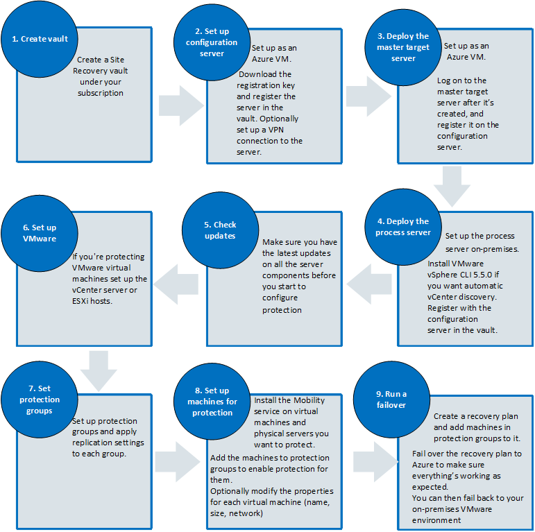

## 网络连接类型

可以使用两个选项来配置本地站点与部署基础结构组件（配置服务器、主目标服务器）的 Azure 虚拟网络之间的网络连接。在部署配置服务器之前，需要决定所要使用的网络连接选项。你需要在部署时做出选择，以后无法更改。

**公共 Internet：**本地服务器（进程服务器、受保护的服务器）与 Azure 基础结构组件服务器（配置服务器、主目标服务器）之间的通信和数据复制通过安全 SSL/TLS 连接从本地到配置服务器与主目标服务器上的公共终结点进行。（唯一的例外是 TCP 端口 9080 上的进程服务器与主目标服务器之间的连接未加密。在此连接上，只会交换用于设置复制的复制协议相关的控制信息。）

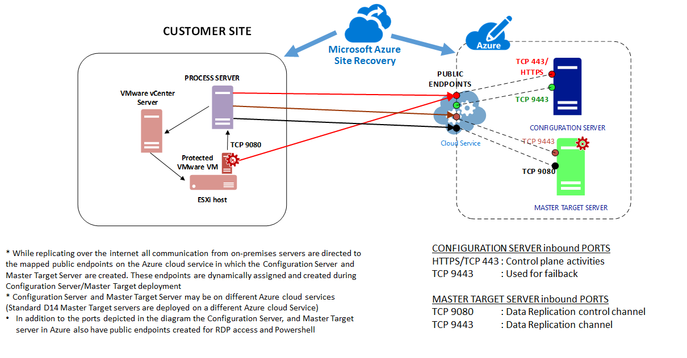

**VPN：**本地服务器（进程服务器、受保护的服务器）与 Azure 基础结构组件服务器（配置服务器、主目标服务器）之间的通信和数据复制通过 VPN 连接在本地网络与部署配置服务器和主目标服务器的 Azure 虚拟网络之间进行。确保本地网络通过 ExpressRoute 连接或站点到站点 VPN 连接来与 Azure 虚拟网络连接。

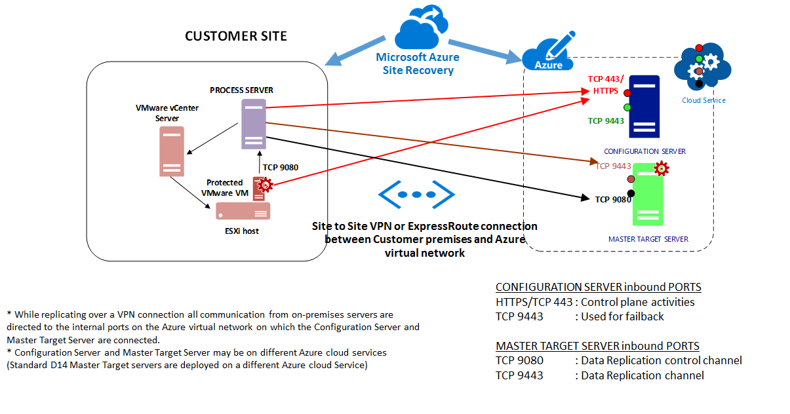

## 步骤 1：创建保管库

1. 登录到[管理门户](https://manage.windowsazure.cn)。

2. 展开“数据服务”>“恢复服务”，并单击“Site Recovery 保管库”。

3. 单击“新建”>“快速创建”。

4. 在“名称”中，输入一个友好名称以标识此保管库。

5. 在“区域”中，为保管库选择地理区域。若要查看受支持的区域，请参阅 [Azure Site Recovery 价格详细信息](/home/features/site-recovery/pricing/)中的“地域可用性”。

6. 单击“创建保管库”。

	

检查状态栏以确认保管库已成功创建。保管库将以“活动”状态列在主要的“恢复服务”页上。

## 步骤 2：部署配置服务器

### 配置服务器设置

1. 在“恢复服务”页中，单击保管库以打开“快速启动”页。也可随时使用该图标打开“快速启动”。

	

2. 在下拉列表中，选择“在使用 VMware/物理服务器的本地站点与 Azure 之间”。
3. 在“准备目标(Azure)资源”中，单击“部署配置服务器”。

	

4. 在“新配置服务器详细信息”中指定：

	- 配置服务器的名称和用于连接它的凭据。
	- 在“网络连接类型”下拉列表中，选择“公共 Internet”或“VPN”。  
	>[AZURE.NOTE]你需要在部署时选择此设置，以后无法更改。  
	- 选择该服务器所在的 Azure 网络。如果指定了 VPN 作为网络连接类型，请确保此 Azure 虚拟网络通过 ExpressRoute 连接或站点到站点 VPN 连接到本地站点。
	- 指定要分配到该服务器的内部 IP 地址和子网。请注意，任何子网中的前四个 IP 地址保留给 Azure 内部使用。请使用任何其他可用的 IP 地址。
	
	

5. 在单击“确定”时，将在你的订阅中针对配置服务器创建基于 Azure Site Recovery Windows Server 2012 R2 库映像的标准 A3 虚拟机。它将作为第一个实例在新的云服务中创建。如果你将网络连接类型指定为“公共 Internet”，则会使用保留的公共 IP 地址创建云服务。你可以在“作业”选项卡中监视进度。

	

6.  **仅当连接类型是“公共 Internet”时，此步骤才适用。** 在部署配置服务器后，请在 Azure 门户中的“虚拟机”页上记下分配给它的公用 IP 地址。然后，在“终结点”选项卡中，记下映射到专用端口 443 的公用 HTTPS 端口。稍后将主目标服务器和处理服务器注册到配置服务器时，你将需要用到这些信息。配置服务器使用以下终结点部署：

	- HTTPS：公用端口用于协调通过 Internet 在组件服务器与 Azure 之间进行的通信。专用端口 443 用于协调通过 VPN 在组件服务器与 Azure 之间进行的通信。
	- 自定义：公用端口用于通过 Internet 进行的故障回复工具
	- 通信。专用端口 9443 用于通过 VPN 进行的故障回复工具通信。
	- PowerShell：专用端口 5986
	- 远程桌面：专用端口 3389
	
	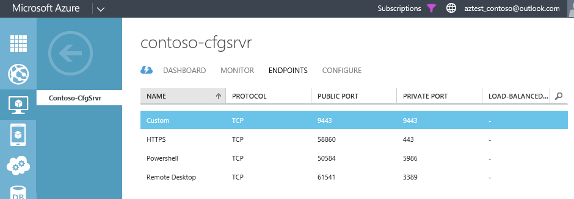

    >[AZURE.WARNING]请勿删除在配置服务器部署期间创建的任何终结点的公用或专用端口号。

配置服务器使用保留的 IP 地址部署在自动创建的 Azure 云服务中。需要使用保留的地址确保云服务上的虚拟机（包括配置服务器）在重新启动后，配置服务器云服务 IP 地址仍然相同。在停用配置服务器后，必须手动将保留的公共 IP 地址取消保留，否则会继续保留。每个订阅保留的公共 IP 地址数默认限制为 20 个。[详细了解](/documentation/articles/virtual-networks-reserved-private-ip/)有关保留 IP 地址的信息。

### 在保管库中注册配置服务器

1. 在“快速启动”页中，单击“准备目标资源”>“下载注册密钥”。此时将自动生成密钥文件。该文件在生成后的 5 天内有效。将它复制到配置服务器。
2. 在“虚拟机”中，从虚拟机列表中选择配置服务器。打开“仪表板”选项卡，然后单击“连接”。**打开**下载的 RDP 文件，以使用远程桌面登录到配置服务器。如果配置服务器部署在 VPN 网络上，则使用配置服务器的内部 IP 地址（这是在部署配置服务器时指定的 IP 地址，也可以在配置服务器虚拟机的虚拟机仪表板页上看到），以通过远程桌面从本地网络访问它。当你首次登录时，Azure Site Recovery 安装向导将自动运行。

	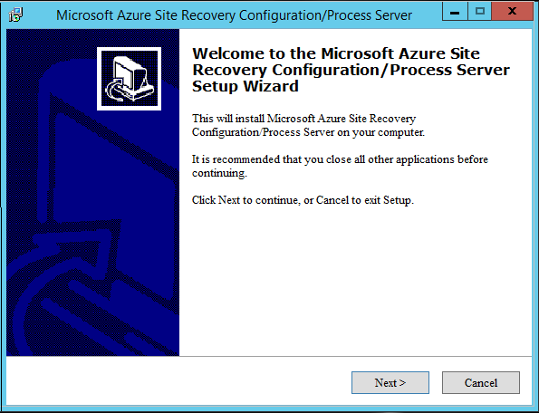

3. 在“第三方软件安装”中，单击“我接受”以下载并安装 MySQL。

	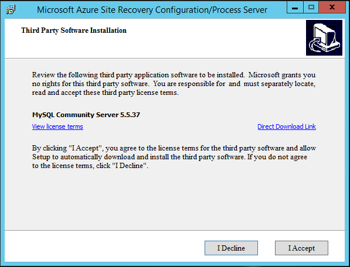

4. 在“MySQL 服务器详细信息”中，创建用于登录 MySQL 服务器实例的凭据。

	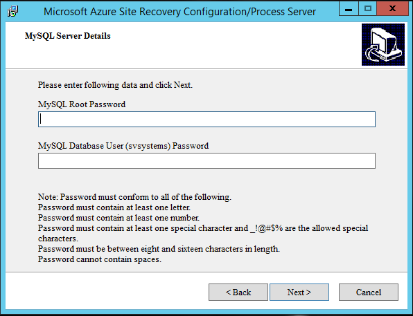

5. 在“Internet 设置”中，指定配置服务器连接到 Internet 的方式。请注意：

	- 如果希望使用自定义代理，则应当在安装该提供程序之前设置它。
	- 当你单击“下一步”时，将会运行测试来检查代理连接。
	- 如果你确实使用自定义代理，或者你的默认代理要求进行身份验证，则需要输入代理详细信息，包括地址、端口和凭据。
	- 应可通过代理访问以下 URL：
		- *.hypervrecoverymanager.windowsazure.cn
		- *.accesscontrol.chinacloudapi.cn
		- *.backup.windowsazure.cn
		- *.blob.core.chinacloudapi.cn
		- *.store.core.chinacloudapi.cn
	- 如果你采用了基于 IP 地址的防火墙规则，请确保这些规则设置为允许配置服务器与 [Azure 数据中心 IP 范围](https://msdn.microsoft.com/zh-cn/library/azure/dn175718.aspx)和 HTTPS (443) 协议中所述的 IP 地址通信。必须将你打算使用的 Azure 区域以及美国西部的 IP 范围加入允许列表。

	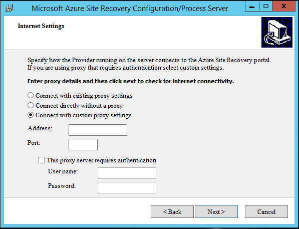

6. 在“提供程序错误消息本地化设置”中指定显示错误消息的语言。

	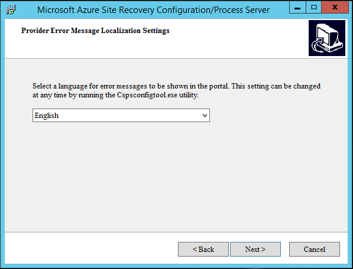

7. 在“Azure Site Recovery 注册”中，浏览并选择已复制到该服务器的密钥文件。

	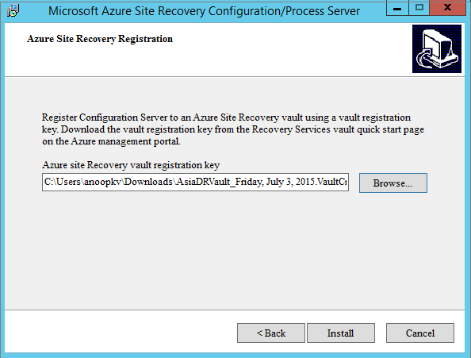

8. 在向导的完成页上选择以下选项：

	- 选择“启动帐户管理对话框”，指定在完成向导后应该打开“管理帐户”对话框。
	- 选择“为 Cspsconfigtool 创建桌面图标”，以便在配置服务器上添加桌面快捷方式，使你能够在任何时间打开“管理帐户”对话框，而无需重新运行向导。

	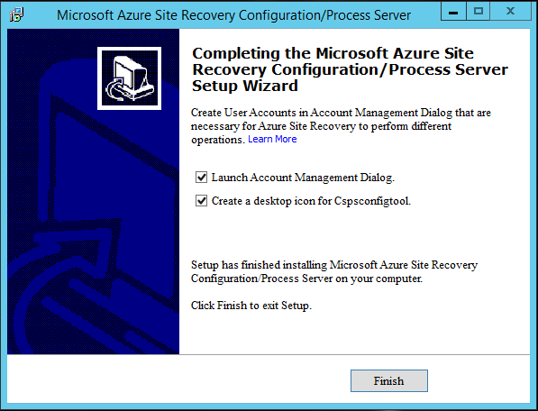

9. 单击“完成”以完成向导。此时将生成一个通行短语。将其复制到安全位置。你将需要它进行身份验证，并将处理服务器和主目标服务器注册到配置服务器。它还可用于确保配置服务器通信中的通道完整性。你可以重新生成该通行短语，但是此后，你将需要使用新通行短语重新注册主目标服务器和进程服务器。

	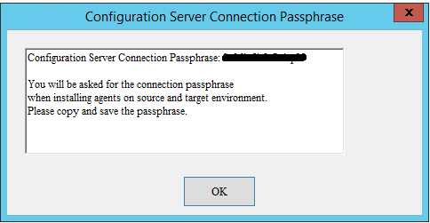

注册后，保管库中的“配置服务器”页上将列出该配置服务器。

### 设置和管理帐户

在部署期间，站点恢复将请求以下操作的凭据：

- 当你添加 vCenter 服务器，以便自动发现 vCenter 服务器管理的虚拟机时。自动发现虚拟机需要 vCenter 帐户。
- 当你添加要保护的计算机，以便站点恢复可在这些计算机上安装移动服务时。

注册配置服务器后，可以打开“管理帐户”对话框来添加和管理要用于这些操作的帐户。可通过多种方式实现此目的：

- 打开你在安装程序最后一页上的对话框中为配置服务器 (cspsconfigtool) 创建的快捷方式。
- 打开配置服务器安装程序完成页上的对话框。

1. 在“管理帐户”中，单击“添加帐户”。你还可以修改和删除现有帐户。

	

2. 在“帐户详细信息”中，指定要在 Azure 中使用的帐户名和凭据（域/用户名）。

	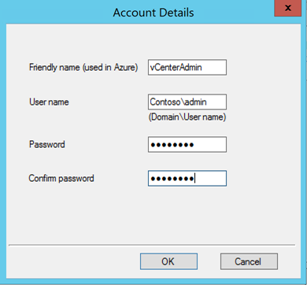

### 连接到配置服务器 

可通过两种方式连接到配置服务器：

- 通过 VPN 站点到站点或 ExpressRoute 连接
- 通过 Internet 

请注意：

- Internet 连接将虚拟机的终结点与服务器的公用虚拟 IP 地址结合使用。
- VPN 连接将服务器的内部 IP 地址与终结点的专用端口结合使用。
- 确定是要从本地服务器通过 VPN 连接还是 Internet 连接到 Azure 中运行的各种组件服务器（配置服务器、主目标服务器，以访问控制和复制数据），这项决定是最终性的。以后无法更改此设置。如果这样做，将需要重新部署方案并重新保护计算机。  

## 步骤 3：部署主目标服务器

1. 在“准备目标(Azure)资源”中，单击“部署主目标服务器”。
2. 指定主目标服务器的详细信息和凭据。该服务器将部署在注册到的配置服务器所在的 Azure 网络中。在单击完成时，将使用 Windows 或 Linux 库映像创建 Azure 虚拟机。

	

请注意，任何子网中的前四个 IP 地址保留给 Azure 内部使用。请指定任何其他可用的 IP 地址。

>[AZURE.NOTE]使用[高级存储帐户](/documentation/articles/storage-premium-storage-preview-portal/)为需要持续性的高 IO 性能和低延迟才能托管 IO 密集型工作负荷的工作负荷配置保护时，请选择“标准 DS4”。

3. Windows 主目标服务器虚拟机使用以下终结点创建：（仅当部署类型是“公共 Internet”时，才创建公开终结点）：

	- 自定义：进程服务器使用公用端口来通过 Internet 发送复制数据。处理服务器使用专用端口 9443 来通过 VPN 将复制数据发送到主目标服务器。
	- 自定义 1：进程服务器使用公用端口来通过 Internet 发送控制元数据。处理服务器使用专用端口 9080 来通过 VPN 将控制元数据发送到主目标服务器。
	- PowerShell：专用端口 5986
	- 远程桌面：专用端口 3389

4. Linux 主目标服务器虚拟机使用以下终结点创建：（仅当部署类型是“公共 Internet”时，才创建公开终结点）：

	- 自定义：进程服务器使用公用端口来通过 Internet 发送复制数据。处理服务器使用专用端口 9443 来通过 VPN 将复制数据发送到主目标服务器。
	- 自定义 1：进程服务器使用公用端口来通过 Internet 发送控制元数据。处理服务器使用专用端口 9080 来通过 VPN 将控制数据发送到主目标服务器
	- SSH：专用端口 22

    >[AZURE.WARNING]请勿删除或更改在主目标服务器部署期间创建的任何终结点的公用或专用端口号。

5. 在“虚拟机”中，等待虚拟机启动。

	- 如果该服务器已配置有 Windows，请记下远程桌面详细信息。
	- 如果已配置有 Linux，并且要通过 VPN 连接，请记下虚拟机的内部 IP 地址。如果要通过 Internet 连接，请记下公用 IP 地址。

6.  登录到该服务器以完成安装，并将其注册到配置服务器。
7.  如果你运行的是 Windows，请执行以下操作：

	1. 启动到虚拟机的远程桌面连接。在首次登录时，将在 PowerShell 窗口中运行一个脚本。请勿将其关闭。在它完成之后，主机代理配置工具将自动打开以注册服务器。
	2. 在“主机代理配置”中，指定配置服务器的内部 IP 地址和端口 443。你可以使用内部地址和专用端口 443，即使你没有通过 VPN 连接，因为虚拟机附加到配置服务器所在的 Azure 网络。保持“使用 HTTPS”处于启用状态。输入以前记下的配置服务器的密码。单击“确定”以注册服务器。请注意，你可以忽略该页上的 NAT 选项。这些选项不会用到。
	3. 如果估计的保留驱动器要求超过 1 TB，你可以使用虚拟磁盘和[存储空间](http://blogs.technet.com/b/askpfeplat/archive/2013/10/21/storage-spaces-how-to-configure-storage-tiers-with-windows-server-2012-r2.aspx)来配置保留卷 (R:)。
	
	

6. 如果你运行的是 Linux，请执行以下操作：
	1. 在安装主目标服务器软件之前，请确保已安装最新的 Linux 集成服务 (LIS)。可以在[此处](https://www.microsoft.com/zh-cn/download/details.aspx?id=46842)找到最新版本的 LIS 和安装说明。安装 LIS 后重新启动计算机。
	2. 在“准备目标(Azure)资源”中，单击“下载并安装其他软件(仅适用于 Linux 主目标服务器)”以下载 Linux 主目标服务器包。使用 sftp 客户端将下载的 tar 文件复制到虚拟机。你也可以登录到已部署的 Linux 主目标服务器，并使用 *wget http://go.microsoft.com/fwlink/?LinkID=529757&clcid=0x409* 下载文件。
	2. 使用 Secure Shell 客户端登录到服务器。请注意，如果你已通过 VPN 连接到 Azure 网络，请使用内部 IP 地址。否则，请使用外部 IP 地址和 SSH 公用终结点。
	3. 运行以下程序：**tar –xvzf Microsoft-ASR\_UA\_8.4.0.0\_RHEL6-64*** ，从 gzip 压缩过的安装程序中提取文件
	4. 确保你位于 tar 文件内容提取到的目录中。
	5. 使用命令 **echo *`<passphrase>`* >passphrase.txt** 将配置服务器的通行短语复制到本地文件
	6. 运行命令“**sudo ./install -t both -a host -R MasterTarget -d /usr/local/ASR -i *`<Configuration server internal IP address>`* -p 443 -s y -c https -P passphrase.txt**”。

	

9. 等待几分钟 (10-15)，然后在“服务器”>“配置服务器”页上，检查主目标服务器是否作为注册服务器列在“服务器详细信息”选项卡中。如果运行的是 Linux，并且它未注册，请从 /usr/local/ASR/Vx/bin/hostconfigcli 再次运行主机配置工具。你需要以 root 身份运行 chmod 以设置访问权限。

	

>[AZURE.NOTE]请注意，在注册完成之后，最多需要 15 分钟，配置服务器下才会列出主目标服务器。若要立即更新，请单击配置服务器页面底部的刷新按钮以刷新配置服务器。

## 步骤 4：部署本地进程服务器

>[AZURE.NOTE]建议在进程服务器上配置静态 IP 地址，以保证在重新启动后可持续使用相同的地址。

1. 单击“快速启动”>“在本地安装进程服务器”>“下载并安装进程服务器”。

	

2.  将下载的 zip 文件复制到要将处理服务器安装到的服务器。该 zip 文件包含两个安装文件：

	- Microsoft-ASR_CX_TP_8.4.0.0_Windows*
	- Microsoft-ASR_CX_8.4.0.0_Windows*

3. 解压缩存档，然后将安装文件复制到该服务器上的某个位置。
4. 运行 **Microsoft-ASR_CX_TP_8.4.0.0_Windows*** 安装文件，然后按相关说明操作。此时将安装部署所需的第三方组件。
5. 然后，运行 **Microsoft-ASR_CX_8.4.0.0_Windows***。
6. 在“服务器模式”页上，选择“进程服务器”。

	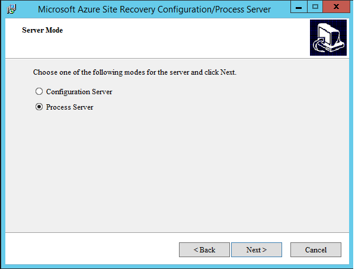

7. 在“环境详细信息”页上执行以下操作：

	- 如果你想要保护 VMware 虚拟机，请单击“是”
	- 如果你只要保护物理服务器，则不需要在进程服务器上安装 VMware vCLI。请单击“否”并继续。
		
	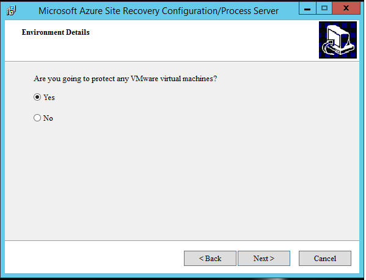

8. 安装 VMware vCLI 时，请注意以下事项：

	- **仅支持 VMware vSphere CLI 5.5.0**。进程服务器无法与 vSphere CLI 的其他版本或更新配合使用。
	- 从[此处](https://my.vmware.com/web/vmware/details?downloadGroup=VCLI550&productId=352)下载 vSphere CLI 5.5.0。
	- 如果在开始安装进程服务器之前刚刚安装了 vSphere CLI，并且安装程序未检测到它，请等待最多五分钟的时间再重新尝试安装。这可以确保执行 vSphere CLI 检测所需的所有环境变量已正确初始化。

9.	在“进程服务器的 NIC 选择范围”中，选择进程服务器应该使用的网络适配器。

	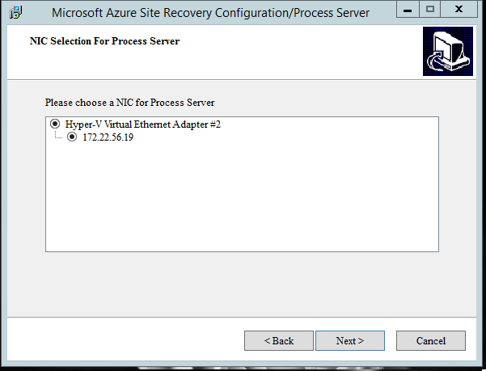

10.	在“配置服务器详细信息”中：

	- 对于 IP 地址和端口，如果你要通过 VPN 连接，请指定配置服务器的内部 IP 地址和端口 443。否则，请指定公用虚拟 IP 地址和映射的公用 HTTP 终结点。
	- 键入配置服务器的密码。
	- 如果要在使用自动推送安装服务时禁用验证，请清除“验证移动服务软件签名”。签名验证需要来自处理器的 Internet 连接。
	- 单击**“下一步”**。

	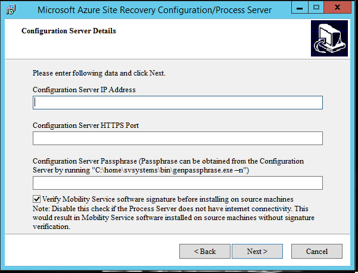

11. 在“选择安装驱动器”中，选择缓存驱动器。进程服务器需要至少有 600 GB 可用空间的缓存驱动器。然后单击“安装”。

	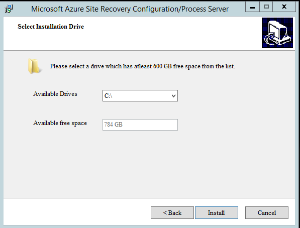

12. 请注意，可能需要重新启动服务器才能完成安装。在“配置服务器”>“服务器详细信息”中，检查该进程服务器是否已显示并已在保管库中成功注册。

>[AZURE.NOTE]注册完成之后，最多需要 15 分钟，配置服务器下才会列出进程服务器。若要立即更新，请单击配置服务器页面底部的刷新按钮以刷新配置服务器。
 

如果在注册进程服务器时未对移动服务禁用签名验证，则稍后可以按以下方式执行该操作：

1. 以管理员身份登录到处理服务器，然后打开文件 C:\pushinstallsvc\pushinstaller.conf 以进行编辑。在 **[PushInstaller.transport]** 节下，添加以下行：**SignatureVerificationChecks=”0”**。保存并关闭该文件。
2. 重新启动 InMage PushInstall 服务。

## 步骤 5：安装最新更新

继续之前，请确保你已安装最新更新。请记得按以下顺序安装更新：

1. 配置服务器
2. 进程服务器
3. 主目标服务器
4. 故障回复工具 (vContinuum)

你可以在站点恢复的“仪表板”上获取更新。**对于 Linux 安装，请从 gzip 压缩过的安装程序中提取文件，然后运行命令“sudo ./install”以安装更新
从[此处](http://go.microsoft.com/fwlink/?LinkID=533813)下载**故障回复工具 (vContinuum)** 的最新更新

如果运行的虚拟机或物理服务器上已安装移动服务，你可以按如下所示获取服务更新：

- 按如下所示获取服务更新：
	- [Windows Server（仅限 64 位）](http://download.microsoft.com/download/8/4/8/8487F25A-E7D9-4810-99E4-6C18DF13A6D3/Microsoft-ASR_UA_8.4.0.0_Windows_GA_28Jul2015_release.exe)
	- [CentOS 6.4、6.5、6.6（仅限 64 位）](http://download.microsoft.com/download/7/E/D/7ED50614-1FE1-41F8-B4D2-25D73F623E9B/Microsoft-ASR_UA_8.4.0.0_RHEL6-64_GA_28Jul2015_release.tar.gz)
	- [Oracle Enterprise Linux 6.4、6.5（仅限 64 位）](http://download.microsoft.com/download/5/2/6/526AFE4B-7280-4DC6-B10B-BA3FD18B8091/Microsoft-ASR_UA_8.4.0.0_OL6-64_GA_28Jul2015_release.tar.gz)
	- [SUSE Linux Enterprise Server SP3（仅限 64 位）](http://download.microsoft.com/download/B/4/2/B4229162-C25C-4DB2-AD40-D0AE90F92305/Microsoft-ASR_UA_8.4.0.0_SLES11-SP3-64_GA_28Jul2015_release.tar.gz)
- 或者，在更新进程服务器之后，可以从进程服务器上的 C:\\pushinstallsvc\\repository 文件夹获取移动服务的更新版本。
- 如果你已有安装旧版的移动服务的受保护计算机，则还可以从管理门户自动升级受保护计算机上的移动服务。为此，请选择计算机所属的保护组，突出显示受保护的计算机并单击底部的“更新移动服务”按钮。仅当有较新版本的移动服务时，“更新移动服务”按钮才会激活。在更新移动服务之前，请确保进程服务器运行最新版本的进程服务器软件。受保护的服务器必须符合所有[自动推送安装先决条件](#install-the-mobility-service-automatically)才能更新移动服务。

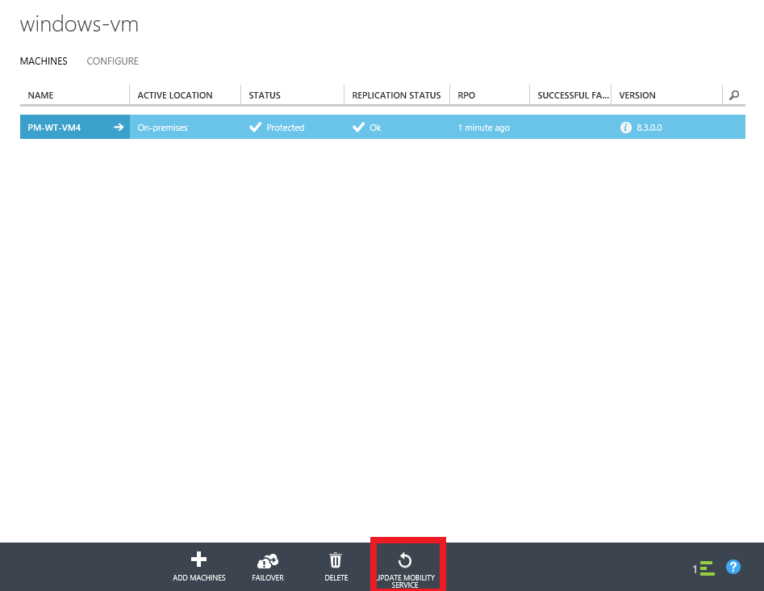

在“选择帐户”中，指定用于更新受保护服务器上的移动服务的管理员帐户。单击“确定”并等待触发的作业完成。

## 步骤 6：添加 vCenter 服务器或 ESXi 主机

1. 在“服务器”>“配置服务器”选项卡上，选择配置服务器并单击“添加 VCENTER 服务器”以添加 vCenter 服务器或 ESXi 主机。

	

2. 指定 vCenter 服务器或 ESXi 主机的详细信息，并选择要用于发现它的进程服务器。

	- 如果 vCenter 服务器不在默认端口 443 上运行，请指定 vCenter 服务器运行所在的端口号。
	- 进程服务器必须位于 vCenter 服务器/ESXi 主机所在的网络上，并且应安装有 VMware vSphere CLI 5.5.0。

	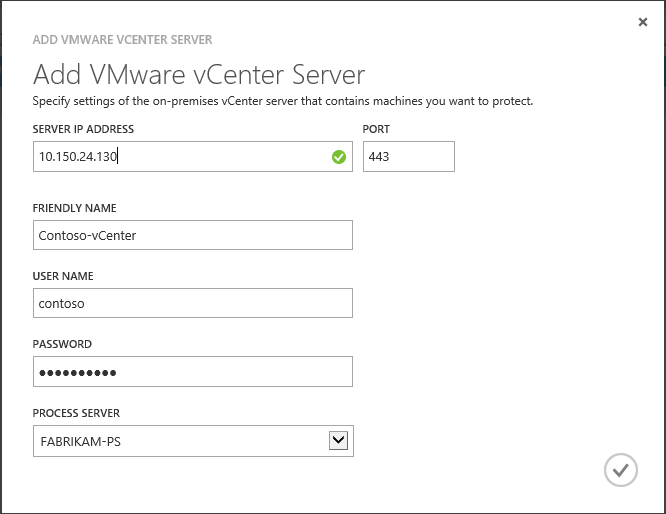

3. 发现完成之后，vCenter 服务器将在“配置服务器详细信息”下方列出。

	

4. 如果你使用非管理员帐户添加 vCenter 服务器或 ESXi 主机，请确保该帐户具有以下权限：

	- vCenter 帐户应该已启用数据中心、数据存储、文件夹、主机、网络、资源、存储视图、虚拟机和 vSphere 分布式交换机权限。
	- ESXi 主机帐户应该已启用数据中心、数据存储、文件夹、主机、网络、资源、虚拟机和 vSphere 分布式交换机权限

## 步骤 7：创建保护组

1. 打开“受保护的项”>“保护组”，然后单击即可添加一个保护组。

	

2. 在“指定保护组设置”页上，指定保护组的名称，并选择要在其上创建该组的配置服务器。

	

3. 在“指定复制设置”页上，配置要用于该组中的所有计算机的复制设置。

	

4. 设置：
	- **多 VM 一致性**：如果你将此项打开，则它将在保护组中的计算机之间创建共享的应用程序一致性恢复点。当保护组中的所有计算机运行的是相同工作负荷时，此设置最为有用。所有计算机都将恢复到相同数据点。仅适用于 Windows 服务器。
	- **RPO 阈值**：当连续数据保护复制 RPO 超过配置的 RPO 阈值时，将生成警报。
	- **恢复点保留期**：指定保留时段。受保护的计算机可在此时段内恢复到任何点。
	- **应用程序一致性快照频率**：指定创建包含应用程序一致性快照的恢复点的频率。

你可以监视保护组，因为它们是在“受保护的项”页上创建的。

## 步骤 8：设置想要保护的计算机

需在要保护的虚拟机和物理服务器上安装移动服务。可通过两种方式实现此目的：

- 从进程服务器自动推送并在每台计算机上安装该服务。
- 手动安装该服务。 

### 自动安装移动服务

在向保护组添加计算机时，进程服务器将自动推送移动服务，并将其安装在每个计算机上。

**在 Windows 服务器上自动推送安装移动服务：**

1. 按[步骤 5：安装最新更新](#step-5-install-latest-updates)中所述安装进程服务器的最新更新，并确定进程服务器可用。 
2. 确保源计算机和进程服务器之间已建立网络连接，并且可从进程服务器访问源计算机。  
3. 将 Windows 防火墙配置为允许“文件和打印机共享”和“Windows Management Instrumentation”。在 Windows 防火墙设置中，选择“允许应用或功能通过防火墙”选项，然后选择应用程序，如下图所示。对于属于某个域的计算机，你可以使用组策略对象配置防火墙策略。

	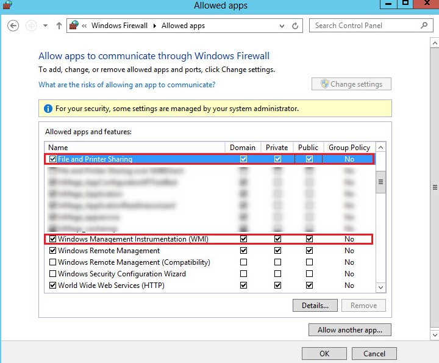

4. 用于执行推式安装的帐户必须位于要保护的计算机上的“管理员”组中。这些凭据仅用于推送移动服务的安装，在向保护组添加计算机时，你将要提供这些凭据。
5. 如果提供的帐户不是域帐户，你将需要在本地计算机上禁用远程用户访问控制。为此，请在 HKEY\_LOCAL\_MACHINE\\SOFTWARE\\Microsoft\\Windows\\CurrentVersion\\Policies\\System 下添加值为 1 的 LocalAccountTokenFilterPolicy DWORD 注册表项。若要从 CLI 添加注册表项，请打开 cmd 或 powershell 并输入 **`REG ADD HKEY_LOCAL_MACHINE\SOFTWARE\Microsoft\Windows\CurrentVersion\Policies\System /v LocalAccountTokenFilterPolicy /t REG_DWORD /d 1`**。 

**在 Linux 服务器上自动推送安装移动服务：**

1. 按[步骤 5：安装最新更新](#step-5-install-latest-updates)中所述安装进程服务器的最新更新，并确定进程服务器可用。
2. 确保源计算机和进程服务器之间已建立网络连接，并且可从进程服务器访问源计算机。  
3. 确保帐户是源 Linux 服务器上的 root 用户。
4. 确保源 Linux 服务器上的 /etc/hosts 文件包含用于将本地主机名映射到所有 NIC 关联的 IP 地址的条目。
5. 在要保护的计算机上安装最新的 openssh、openssh-server 和 openssl 包。
6. 确保 SSH 已启用且正在端口 22 上运行。 
7. 在 sshd_config 文件中启用 SFTP 子系统与密码身份验证，如下所示： 

	- a) 以 root 身份登录。
	- b) 在文件 /etc/ssh/sshd_config 中，找到以 **PasswordAuthentication** 开头的行。
	- c) 取消注释该行，并将值从“no”更改为“yes”。

		

	- d) 找到以 Subsystem 开头的行，并取消注释该行。
	
		

8. 确保支持源计算机 Linux 变体。
 
### 手动安装移动服务

用于安装移动服务的软件包位于进程服务器上的 C:\\pushinstallsvc\\repository 中。请登录进程服务器，并根据下表将相应的安装包复制到源计算机：

| 源操作系统 | 进程服务器上的移动服务包 |
|---------------------------------------------------	|------------------------------------------------------------------------------------------------------	|
| Windows Server（仅限 64 位） | `C:\pushinstallsvc\repository\Microsoft-ASR_UA_8.4.0.0_Windows_GA_28Jul2015_release.exe` |
| CentOS 6.4、6.5、6.6（仅限 64 位） | `C:\pushinstallsvc\repository\Microsoft-ASR_UA_8.4.0.0_RHEL6-64_GA_28Jul2015_release.tar.gz` |
| SUSE Linux Enterprise Server 11 SP3（仅限 64 位） | `C:\pushinstallsvc\repository\Microsoft-ASR_UA_8.4.0.0_SLES11-SP3-64_GA_28Jul2015_release.tar.gz`|
| Oracle Enterprise Linux 6.4、6.5（仅限 64 位） | `C:\pushinstallsvc\repository\Microsoft-ASR_UA_8.4.0.0_OL6-64_GA_28Jul2015_release.tar.gz` |

**若要在 Windows 服务器上手动安装移动服务**，请执行以下操作：

1. 将上表所列进程服务器目录路径中的 **Microsoft-ASR_UA_8.4.0.0_Windows_GA_28Jul2015_release.exe** 包复制到源计算机。
2. 在源计算机上运行该可执行文件以安装移动服务。
3. 遵循安装程序说明操作。
4. 选择“移动服务”作为角色，然后单击“下一步”。
	
	

5. 将安装目录保留为默认安装路径，然后单击“安装”。
6. 在“主机代理配置”中，指定配置服务器的 IP 地址与 HTTPS 端口。

	- 如果你通过 Internet 进行连接，请指定公共虚拟 IP 地址和公共 HTTPS 终结点作为端口。
	- 如果你通过 VPN 进行连接，请指定内部 IP 地址和端口 443。保持“使用 HTTPS”的选中状态。

	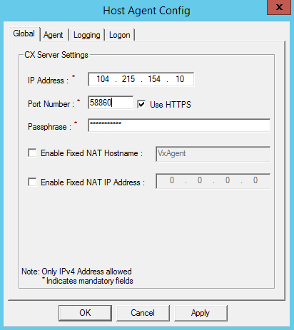

7. 指定配置服务器通行短语，然后单击“确定”将移动服务注册到配置服务器。

**从命令行运行：**

1. 将通行短语从 CX 复制到服务器上的“C:\\connection.passphrase”文件中，然后运行此命令。在本示例中，CX 是 104.40.75.37，HTTPS 端口是 62519：

    `C:\Microsoft-ASR_UA_8.2.0.0_Windows_PREVIEW_20Mar2015_Release.exe" -ip 104.40.75.37 -port 62519 -mode UA /LOG="C:\stdout.txt" /DIR="C:\Program Files (x86)\Azure Site Recovery" /VERYSILENT  /SUPPRESSMSGBOXES /norestart  -usesysvolumes  /CommunicationMode https /PassphrasePath "C:\connection.passphrase"`

**在 Linux 服务器上手动安装移动服务**：

1. 根据上表，将相应的 tar 存档从进程服务器复制到源计算机。
2. 打开 shell 程序，并通过执行 `tar -xvzf Microsoft-ASR_UA_8.2.0.0*` 将压缩的 tar 存档解压缩到本地路径
3. 通过 shell 输入 *`echo <passphrase> >passphrase.txt`*，在 tar 存档内容解压缩到的本地目录中创建 passphrase.txt 文件。
4. 输入 *`sudo ./install -t both -a host -R Agent -d /usr/local/ASR -i <IP address> -p <port> -s y -c https -P passphrase.txt`* 以安装移动服务。
5. 指定 IP 地址和端口：

	- 如果你通过 Internet 连接到配置服务器，请在 `<IP address>` 和 `<port>` 中指定配置服务器的虚拟公共 IP 地址和公共 HTTPS 终结点。
	- 如果你通过 VPN 建立连接，请指定内部 IP 地址和端口 443。

**从命令行运行：**

1. 将通行短语从 CX 复制到服务器上的“passphrase.txt”文件中，然后运行此命令。在本示例中，CX 是 104.40.75.37，HTTPS 端口是 62519：

在生产服务器上安装：

    ./install -t both -a host -R Agent -d /usr/local/ASR -i 104.40.75.37 -p 62519 -s y -c https -P passphrase.txt
 
在目标服务器上安装：

    ./install -t both -a host -R MasterTarget -d /usr/local/ASR -i 104.40.75.37 -p 62519 -s y -c https -P passphrase.txt

>[AZURE.NOTE]如果将计算机添加到已运行适当版本移动服务的保护组，则会跳过推送安装。

## 步骤 9：启用保护

若要启用保护，请将虚拟机和物理服务器添加到保护组。开始之前，请注意：

- 系统会每隔 15 分钟发现虚拟机一次，在发现之后，最多需要 15 分钟时间虚拟机才会出现在 Azure Site Recovery 中。
- 虚拟机上的环境更改（例如 VMware 工具安装）最多也可能需要 15 分钟时间才能在站点恢复中更新。
- 你可以在“配置服务器”页上 vCenter 服务器/ESXi 主机的“上次联系时间”字段中检查上次发现的时间。
- 如果你已创建保护组，并在其后添加 vCenter 服务器或 ESXi 主机，则 Azure Site Recovery 门户需要 15 分钟刷新，而虚拟机需要 15 分钟列在“向保护组添加计算机”对话框中。
- 如果你要立即将计算机添加到保护组而不想要等待完成计划的发现，请突出显示配置服务器（不要单击它），然后单击“刷新”按钮。
- 将虚拟机或物理机添加到保护组时，进程服务器将自动推送并在源服务器上安装移动服务（如果尚未安装）。
- 为了使自动推送机制发挥作用，请确保你已按上一步所述设置你的受保护的计算机。

按如下所示添加计算机：

1. “受保护的项”>“保护组”>“计算机”选项卡。单击“添加计算机”。作为最佳实践，我们建议，保护组应镜像你的工作负荷，以便于你向相同组中添加运行特定应用程序的计算机。
2. 如果你要保护物理服务器，请在“添加物理计算机”向导的“选择虚拟机”中，提供 IP 地址和友好名称。然后选择操作系统系列。

	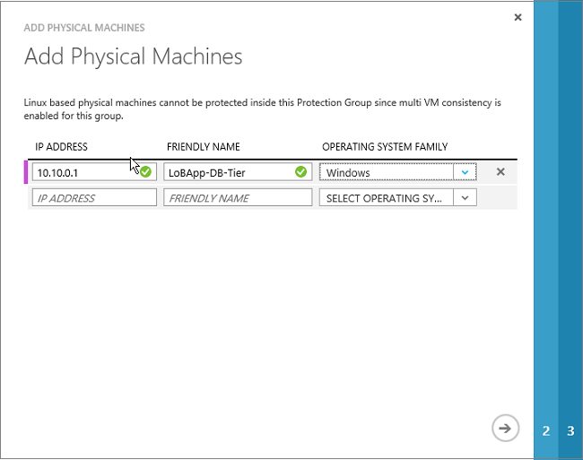

3. 如果你要保护 VMware 虚拟机，请在“选择虚拟机”中，选择负责管理虚拟机（或其运行所在的 EXSi 主机）的 vCenter 服务器，然后选择计算机。

	

4. 在“指定目标资源”中选择用于复制的主目标服务器和存储，并选择是否应将设置用于所有工作负荷。为需要持续性的高 IO 性能和低延迟才能托管 IO 密集型工作负荷的工作负荷配置保护时，请选择“高级存储帐户”。如果你希望工作负荷磁盘使用高级存储帐户，则需使用 DS 系列的主目标。非 DS 系列的主目标无法使用高级存储磁盘。

	

5. 在“指定帐户”中，选择用于在受保护计算机上安装移动服务的帐户。需要使用帐户凭据来自动安装移动服务。如果你无法选择帐户，请确保按步骤 2 中所述设置一个。请注意，Azure 无法访问此帐户。对于 Windows 服务器，帐户应该对源服务器具有管理员权限。对于 Linux，帐户必须是 root。

	

6. 单击复选标记以完成向保护组添加计算机，并对每个计算机启动初始复制。你可以在“作业”页上监视状态。

	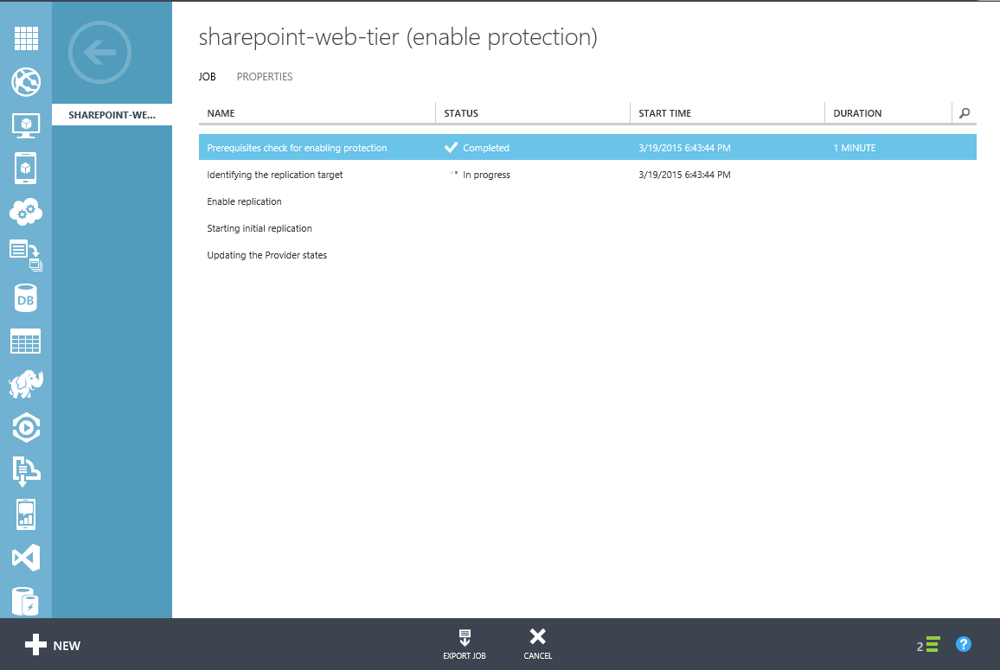

7. 此外，你可以单击“受保护的项”> 保护组名称 >“虚拟机”来监视保护状态。初始复制完成并且计算机同步数据后，它们将显示“受保护”状态。

	

### 设置受保护的计算机属性

1. 在计算机的状态为“受保护”后，你可以配置其故障转移属性。在“保护组详细信息”中，选择计算机，然后打开“配置”选项卡。
2. 在故障转移后，你可以在 Azure 中修改要提供给计算机的名称，以及 Azure 虚拟机大小。你还可以选择故障转移后要将计算机连接到的 Azure 网络。

	

请注意：

- Azure 计算机的名称必须符合 Azure 要求。
- 默认情况下，Azure 中的复制虚拟机不连接到 Azure 网络。如果希望复制的虚拟机进行通信，请确保为其设置相同的 Azure 网络。
- 如果你调整了 VMware 虚拟机或物理服务器上卷的大小，它将进入关键状态。如果你需要修改大小，请执行以下操作：

	- a) 更改大小设置。
	- b) 在“虚拟机”选项卡中选择虚拟机，然后单击“删除”。
	- c) 在“删除虚拟机”中，选择“禁用保护(用于恢复深化和重设卷大小)”。此选项将禁用保护，但在 Azure 中保留恢复点。

		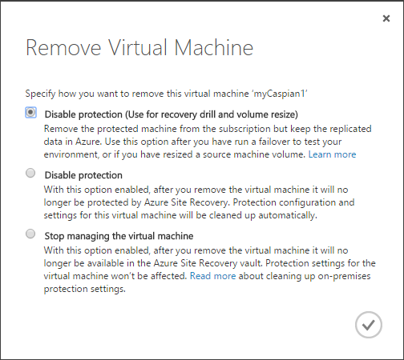

	- d) 为虚拟机重新启用保护。在重新启用保护时，调整过大小的卷的数据将被传输到 Azure。

	

## 步骤 10：运行故障转移

目前只能为受保护的 VMware 虚拟机和物理服务器运行非计划的故障转移。注意以下事项：

- 启动故障转移之前，请确保配置服务器和主目标服务器正常运行，否则故障转移将会失败。
- 在执行非计划的故障转移期间，源计算机不会关闭。执行非计划的故障转移会停止受保护服务器的数据复制。你需要从保护组中删除计算机并重新添加，然后才能在非计划的故障转移完成之后再次开始保护计算机。
- 如果你想要故障转移而不丢失任何数据，请确保主站点虚拟机在启动故障转移之前已关闭。

1. 在“恢复计划”页上，添加恢复计划。指定该计划的详细信息，并选择“Azure”作为目标。

	

2. 在“选择虚拟机”中，选择保护组，然后选择该组中要添加到恢复计划的计算机。[详细了解](/documentation/articles/site-recovery-create-recovery-plans/)恢复计划。

	

3. 如果需要，你可以自定义该计划以创建组，并排列顺序，恢复计划中的计算机以该顺序进行故障转移。你还可以添加手动操作和脚本的提示。在恢复到 Azure 时，可以使用 [Azure 自动化 Runbook](/documentation/articles/site-recovery-runbook-automation/) 添加脚本。

4. 在“恢复计划”页中，选择该计划，然后单击“非计划的故障转移”。
5. 在“确认故障转移”中，验证故障转移方向（到 Azure），然后选择要故障转移到的恢复点。
6. 等待故障转移作业完成，然后验证故障转移是否按预期工作，以及复制的虚拟机是否在 Azure 中成功启动。

## 步骤 11：故障回复 Azure 中已故障转移的计算机

[详细了解](/documentation/articles/site-recovery-failback-azure-to-vmware-classic-legacy/)如何将 Azure 中运行的已故障转移的计算机恢复到本地环境。

## 管理进程服务器

进程服务器将复制数据发送到 Azure 中的主目标服务器，并发现已添加到 vCenter 服务器的新 VMware 虚拟机。在以下情况下，你可能要更改部署中的进程服务器：

- 如果当前进程服务器已关闭
- 如果恢复点目标 (RPO) 提升到组织无法接受的程度。

如果需要，你可以将部分或所有本地 VMware 虚拟机和物理服务器的复制转移到另一台进程服务器。例如：

- **故障** — 如果进程服务器发生故障或不可用，你可以将受保护计算机的复制转移到另一台进程服务器。源计算机和副本计算机的元数据将转移到新的进程服务器并且会重新同步。新的进程服务器将自动连接到 vCenter 服务器以执行自动发现。你可以在站点恢复仪表板上监视进程服务器的状态。
- **负载平衡以调整 RPO** — 若要改善负载平衡，你可以在站点恢复门户中选择不同的进程服务器，并将一台或多台计算机的复制转移到该服务器，以手动进行负载平衡。在此情况下，选择的源和副本计算机的元数据将转移到新的进程服务器。原始进程服务器仍然连接到 vCenter 服务器。 

### 监视进程服务器

如果进程服务器处于关键状态，站点恢复仪表板上会显示状态警告。你可以单击状态以打开“事件”选项卡，然后向下钻取到“作业”选项卡上的特定作业。

### 修改用于复制的进程服务器

1. 转到“服务器”下的“配置服务器”页
2. 单击配置服务器的名称转到“服务器详细信息”。
3. 在“进程服务器”列表中，单击要修改的服务器旁边的“更改进程服务器”。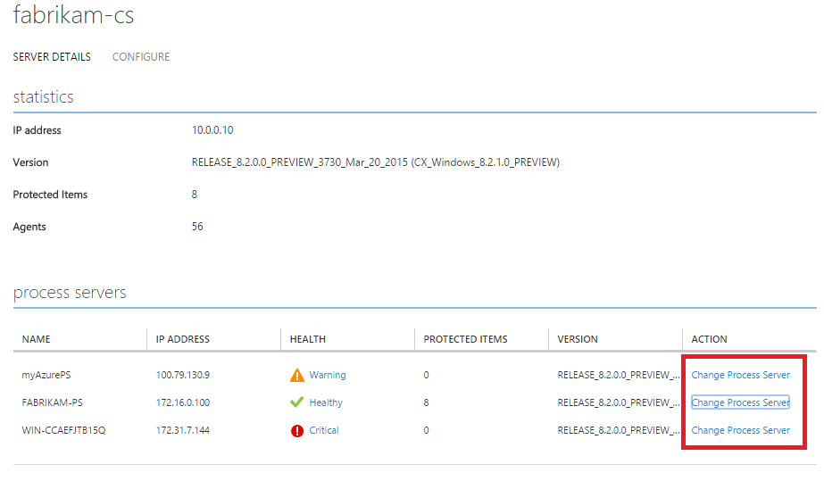
4. 在“更改进程服务器”对话框中，在“目标进程服务器”中选择新服务器，然后选择要复制到新服务器的虚拟机。若要获取相关信息，包括可用空间、已用内存，请单击服务器名称旁边的信息图标。随后会显示将每个所选虚拟机复制到新进程服务器所需的平均空间，以帮助你做出负载决策。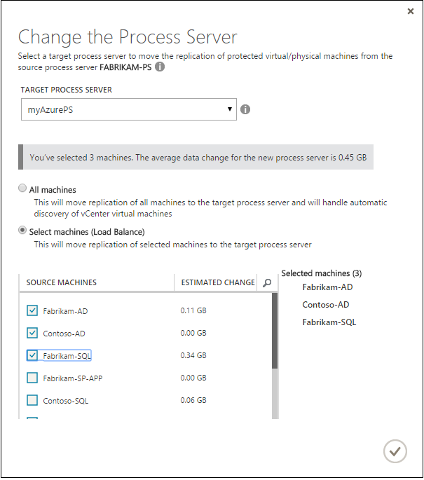
5. 单击复选标记以开始复制到新的进程服务器。如果你从某个重要的进程服务器中删除所有虚拟机，仪表板中应该不再会显示关键警告。

## 第三方软件通知和信息

请勿翻译或本地化

Microsoft 产品或服务中运行的软件和固件基于或包含下列项目中的材料（统称为“第三方代码”）。Microsoft 不是“第三方代码”的原创作者。Microsoft 获取此类“第三方代码”依据的原始版权声明和许可证如下文所述。

A 部分中的信息与下列项目中的“第三方代码”组件相关。提供的此类许可证和信息仅供参考。本“第三方代码”将由 Microsoft 依据 Microsoft 产品或服务的 Microsoft 软件许可条款重新许可给你。

B 部分中的信息与 Microsoft 要依据原始许可条款提供给你的“第三方代码”组件相关。

完整文件可以在 [Microsoft 下载中心](http://go.microsoft.com/fwlink/?LinkId=529428)找到。Microsoft 保留未在此处明确授予的所有权利，无论是暗示、禁止或其他方式。

<!---HONumber=Mooncake_0104_2016-->