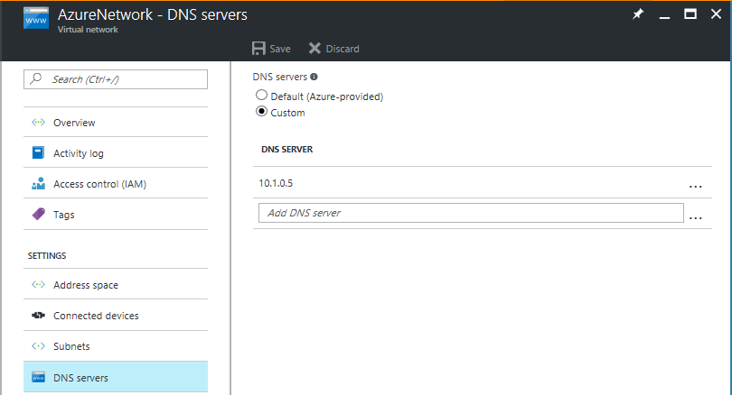
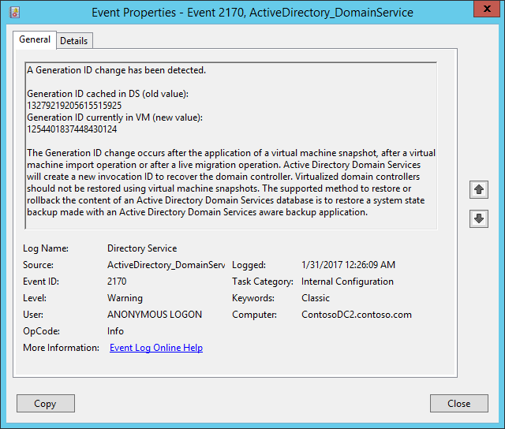
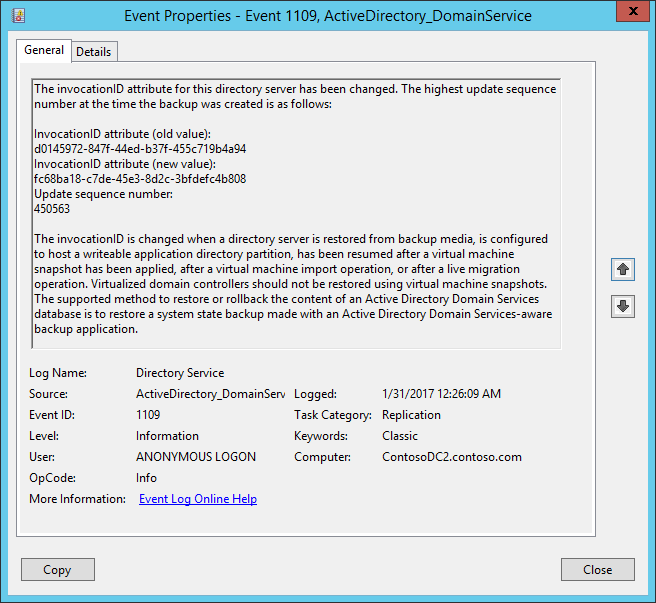
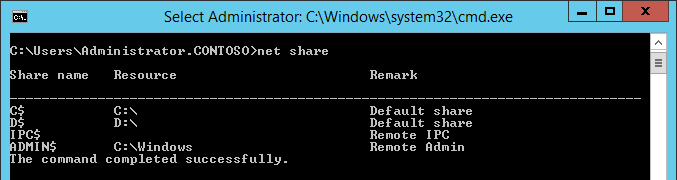
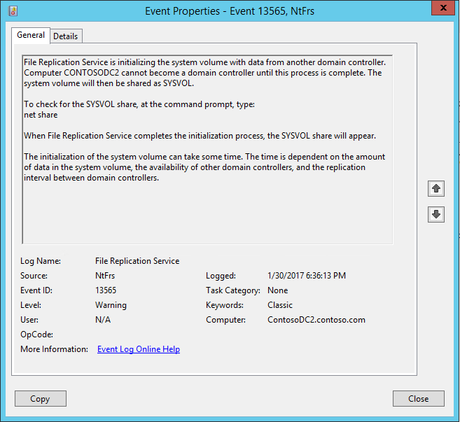
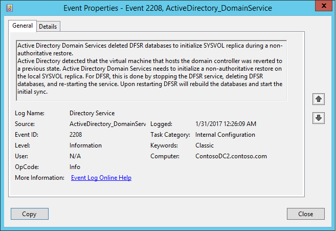

# 使用 Azure Site Recovery 保护 Active Directory 和 DNS
企业应用程序，例如 SharePoint、Dynamics AX 和 SAP，都依赖于 Active Directory 和 DNS 基础结构才能正常工作。在为应用程序创建灾难恢复解决方案时，请务必记住，需要先保护和恢复 Active Directory 与 DNS，再保护和恢复其他应用程序组件，以确保灾难发生时一切可正常工作。

站点恢复是一项 Azure 服务，可通过协调虚拟机的复制、故障转移和恢复来提供灾难恢复。站点恢复支持一系列复制方案，可以前后一致地对虚拟机和应用程序进行保护，并将它们无缝地故障转移到私有云/公有云或托管商的云。

使用站点恢复，你可以为 Active Directory 创建一个完整的自动化灾难恢复计划。出现中断时，可在数秒内从任何位置启动故障转移，并在数分钟内启动和运行 Active Directory。如果你为主站点中的多个应用程序（如 SharePoint 和 SAP）部署了 Active Directory，而且希望故障转移整个站点，则可先使用站点恢复故障转移 Active Directory，然后再使用特定于应用程序的恢复计划故障转移其他应用程序。

本文说明了如何为 Active Directory 创建灾难恢复解决方案，以及如何通过一键式恢复计划执行计划内、计划外和测试故障转移，同时还说明了支持的配置和先决条件。在开始之前，你应该熟悉 Active Directory 和 Azure Site Recovery。

## 复制域控制器

至少需要在一台托管域控制器和 DNS 的虚拟机上设置 [Site Recovery 复制](#enable-protection-using-site-recovery)。如果环境中有[多个域控制器](#environment-with-multiple-domain-controllers)，则除了使用 Site Recovery 复制域控制器虚拟机以外，还需要在目标站点（Azure 或本地辅助数据中心）上设置[附加的域控制器](#protect-active-directory-with-active-directory-replication)。

### 包含单个域控制器的环境
包含单个域控制器的环境如果应用程序数目较少并且只有一个域控制器，同时你要故障转移整个站点，则我们建议使用 Site Recovery 将域控制器复制到辅助站点（不管是要故障转移到 Azure 还是辅助站点）。也可以将复制的同一个域控制器/DNS 虚拟机用于[测试故障转移](#test-failover-considerations)。

### 包含多个域控制器的环境
如果应用程序数目较多，而环境中包含多个域控制器，或者你计划一次性故障转移多个应用程序，我们建议，除了使用 Site Recovery 复制域控制器虚拟机以外，还需要在目标站点（Azure 或本地辅助数据中心）上设置[附加的域控制器](#protect-active-directory-with-active-directory-replication)。在此方案中，可以使用 Site Recovery 复制的域控制器进行[测试故障转移](#test-failover-considerations)；执行实际故障转移时，可以使用目标站点上的附加域控制器。

以下部分说明了如何在站点恢复中为域控制器启用保护，以及如何在 Azure 中设置域控制器。

## 先决条件
- 已在本地部署 Active Directory 和 DNS 服务器。
- Azure 订阅中有一个 Azure Site Recovery 服务保管库。
- 如果要复制到 Azure，请在 VM 上运行 Azure 虚拟机就绪状态评估工具，以确保这些 VM 与 Azure VM 和 Azure Site Recovery 服务兼容。

## 使用站点恢复启用保护
### 保护虚拟机
在站点恢复中启用域控制器/DNS 虚拟机的保护。根据虚拟机类型（Hyper-V）配置站点恢复。使用 Site Recovery 复制的域控制器用于[测试性故障转移](#test-failover-considerations)。确保该域控制器满足以下要求：

1. 该域控制器是全局编录服务器
2. 对于需要在测试性故障转移过程中使用的角色，该域控制器应该是 FSMO 角色所有者（否则只能在故障转移后[获取](https://support.microsoft.com/zh-cn/help/255504/using-ntdsutil.exe-to-transfer-or-seize-fsmo-roles-to-a-domain-controller)这些角色）

### 配置虚拟机网络设置
对于域控制器/DNS 虚拟机，请在站点恢复中配置网络设置，以便在故障转移后将 VM 连接到正确的网络。

## 使用 Active Directory 复制保护 Active Directory
### 站点到站点保护
在辅助站点上创建域控制器。将服务器提升为域控制器角色时，请指定在主站点中使用的同一域名。你可以使用 **Active Directory 站点和服务**管理单元来配置站点要添加到的站点链接对象的设置。通过在站点链接上配置设置，你可以控制何时在两个或两个以上站点之间进行复制，以及复制的频率。有关详细信息，请参阅[计划站点之间的复制](https://technet.microsoft.com/zh-cn/library/cc731862.aspx)。

### 站点到 Azure 的保护
按照说明[在 Azure 虚拟网络中创建域控制器](/documentation/articles/active-directory-install-replica-active-directory-domain-controller/)。将服务器提升为域控制器角色时，请指定主站点中使用的同一域名。

然后，[重新配置虚拟网络的 DNS 服务器](/documentation/articles/active-directory-install-replica-active-directory-domain-controller/#reconfigure-dns-server-for-the-virtual-network)，以便在 Azure 中使用 DNS 服务器。

  

**Azure 生产网络中的 DNS**

## 测试故障转移注意事项
测试故障转移发生在独立于生产网络的网络中，因此对生产工作负荷没有影响。

大多数应用程序还需要存在域控制器和 DNS 服务器才能运行。因此，在对应用程序进行故障转移之前，还需在用于测试性故障转移的独立网络中创建域控制器。为此，最简单的方式是使用 Site Recovery 复制域控制器/DNS 虚拟机。然后，在对应用程序的恢复计划运行测试性故障转移之前，先对域控制器虚拟机运行测试性故障转移。下面介绍了操作方法：

1. 使用 Site Recovery 复制域控制器/DNS 虚拟机。
2. 创建独立的网络。默认情况下，在 Azure 中创建的任何虚拟网络都是独立于其他网络的。建议将此网络的 IP 地址范围设置为与生产网络相同。不要在此网络上启用站点到站点连接。
3. 提供创建的网站的 DNS IP 地址作为 DNS 虚拟机应该获取的 IP 地址。如果要复制到 Azure，请在 “计算和网络”设置的“目标 IP”设置中提供用于故障转移的 VM 的 IP 地址。

1. 如果要复制到其他本地站点并使用 DHCP，请按照说明来[针对测试故障转移设置 DNS 和 DHCP](/documentation/articles/site-recovery-test-failover-vmm-to-vmm/#prepare-dhcp)
1. 针对隔离网络中运行的域控制器虚拟机执行测试故障转移。使用域控制器虚拟机的最新可用**应用程序一致**恢复点执行测试性故障转移。
1. 针对包含应用程序的虚拟机的恢复计划运行测试性故障转移。
1. 测试完成后，请在域控制器虚拟机上**清理测试性故障转移**。此步骤将删除为测试性故障转移创建的域控制器。

### 删除对其他域控制器的引用
进行测试性故障转移时，不需要将所有域控制器都带到测试网络中。若要删除生产环境中存在的其他域控制器的引用，需要针对缺失的域控制器[获取 FSMO Active Directory 角色](https://support.microsoft.com/zh-cn/help/255504/using-ntdsutil.exe-to-transfer-or-seize-fsmo-roles-to-a-domain-controller)并执行[元数据清理](https://technet.microsoft.com/zh-cn/library/cc816907.aspx)。

> [AZURE.IMPORTANT] 以下部分介绍的某些配置不是标准/默认的域控制器配置。如果不想要对生产性域控制器进行此类更改，可以创建一个专用于 Site Recovery 测试性故障转移的域控制器，然后对该控制器进行更改。
>
>

### 虚拟化防护造成的问题 

从 Windows Server 2012 开始，[在 Active Directory 域服务中内置了额外的防护措施](https://technet.microsoft.com/windows-server-docs/identity/ad-ds/introduction-to-active-directory-domain-services-ad-ds-virtualization-level-100)。只要底层虚拟机监控程序平台支持 VM-GenerationID，这些防护措施就可以防止虚拟化域控制器发生 USN 回退。Azure 支持 VM-GenerationID，这意味着 Azure 虚拟机上运行 Windows Server 2012 或更高版本的域控制器具有额外的安全防护措施。

重置 VM-GenerationID 时，也会重置 AD DS 数据库的 invocationID，RID 池将被丢弃，SYSVOL 将标记为非权威性。有关详细信息，请参阅 [Active Directory 域服务虚拟化简介](https://technet.microsoft.com/windows-server-docs/identity/ad-ds/introduction-to-active-directory-domain-services-ad-ds-virtualization-level-100)和 [安全虚拟化 DFSR](https://blogs.technet.microsoft.com/filecab/2013/04/05/safely-virtualizing-dfsr/)

故障转移到 Azure 可能导致 VM-GenerationID 重置，当域控制器虚拟机在 Azure 中启动时，这会触发更多的防护措施。当用户尝试登录到域控制器虚拟机时，这可能会导致**严重延迟**。由于该域控制器只会用于测试性故障转移，因此不需要实施虚拟化防护措施。若要确保域控制器虚拟机的 VM-GenerationID 不会更改，可在本地域控制器中将下述 DWORD 的值更改为 4。

		
		HKEY_LOCAL_MACHINE\SYSTEM\CurrentControlSet\Services\gencounter\Start
 

#### 虚拟化防护措施的症状
 
如果在测试性故障转移后触发了虚拟化防护措施，可能会显示以下一种或多种症状：

生成 ID 发生更改

  

调用 ID 发生更改

  

Sysvol 和 Netlogon 共享不可用

  

  

所有 DFSR 数据库被删除

  

> [AZURE.IMPORTANT] 以下部分介绍的某些配置不是标准/默认的域控制器配置。如果不想要对生产性域控制器进行此类更改，可以创建一个专用于 Site Recovery 测试性故障转移的域控制器，然后对该控制器进行更改。
>
>

### 排查在测试性故障转移期间发生的域控制器问题

在命令提示符下运行以下命令，检查 SYSVOL 和 NETLOGON 文件夹是否已共享：

	NET SHARE

在命令提示符下运行以下命令，确保域控制器正常运行。

	dcdiag /v > dcdiag.txt

在输出日志中查找以下文本，确认域控制器是否正常运行。

* "passed test Connectivity"
* "passed test Advertising"
* "passed test MachineAccount"

如果满足上述条件，则表示域控制器可能运行正常。否则，请尝试以下步骤。

* 对域控制器执行授权还原。
	* 尽管我们[不建议使用 FRS 复制](https://blogs.technet.microsoft.com/filecab/2014/06/25/the-end-is-nigh-for-frs/)，但如果你仍要使用，请遵循[此文](https://support.microsoft.com/zh-cn/kb/290762)提供的步骤执行授权还原。可以阅读[此文](https://blogs.technet.microsoft.com/janelewis/2006/09/18/d2-and-d4-what-is-it-for/)，详细了解有关上一链接中所述 Burflags 的详细信息。
	* 如果你正在使用 DFSR 复制，请遵循[此文](https://support.microsoft.com/zh-cn/kb/2218556)提供的步骤执行授权还原。也可使用此[链接](https://blogs.technet.microsoft.com/thbouche/2013/08/28/dfsr-sysvol-authoritative-non-authoritative-restore-powershell-functions/)中提供的 Powershell 函数实现此目的。
	
* 在本地域控制器中将以下注册表项设置为 0，绕过初始同步要求。如果不存在此 DWORD，可在“Parameters”节点下创建。可在[此文](https://support.microsoft.com/zh-cn/kb/2001093)中了解相关的详细信息

	    HKEY_LOCAL_MACHINE\SYSTEM\CurrentControlSet\Services\NTDS\Parameters\Repl Perform Initial Synchronizations

* 通过在本地域控制器中将以下注册表项设置为 1，禁用全局目录服务器可用于验证用户登录这一要求。如果不存在此 DWORD，可在“Lsa”节点下创建它。可在[此文](http://support.microsoft.com/zh-cn/kb/241789)中了解相关的详细信息

    	HKEY_LOCAL_MACHINE\SYSTEM\CurrentControlSet\Control\Lsa\IgnoreGCFailures

### 不同计算机上的 DNS 和域控制器
如果 DNS 与域控制器不在同一个虚拟机上，则需要创建一个可以进行测试性故障转移的 DNS VM。如果它们位于同一 VM 上，则可跳过本部分。

你可以使用全新的 DNS 服务器并创建所有需要的区域。例如，如果你的 Active Directory 域是 contoso.com，则可以使用名称 contoso.com 创建 DNS 区域。必须在 DNS 中更新与 Active Directory 对应的条目，如下所示：

1. 确保在恢复计划中的任何其他虚拟机到位之前，以下设置已准备就绪：
   
   * 区域必须以林根名称命名。
   * 必须在区域中备份文件。
   * 必须启用区域以进行安全和非安全更新。
   * 域控制器虚拟机的解析程序应指向 DNS 虚拟机的 IP 地址。
2. 在域控制器虚拟机中运行以下命令：

	`nltest /dsregdns`

3. 在 DNS 服务器上添加一个区域，允许非安全更新，并向 DNS 添加该区域的条目：

	    dnscmd /zoneadd contoso.com  /Primary
	    dnscmd /recordadd contoso.com  contoso.com. SOA %computername%.contoso.com. hostmaster. 1 15 10 1 1
	    dnscmd /recordadd contoso.com %computername%  A <IP_OF_DNS_VM>
	    dnscmd /config contoso.com /allowupdate 1

## 后续步骤
阅读[我可以保护哪些工作负荷？](/documentation/articles/site-recovery-workload/)详细了解如何使用 Azure Site Recovery 保护企业工作负荷。

<!---HONumber=Mooncake_0327_2017-->
<!--Update_Description:--add DC prerequisites for test failover; add common issues of test failover and troubleshooting commands >