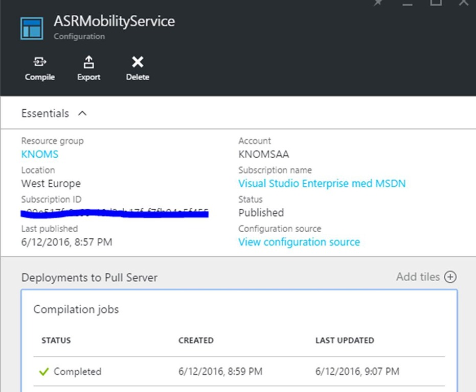
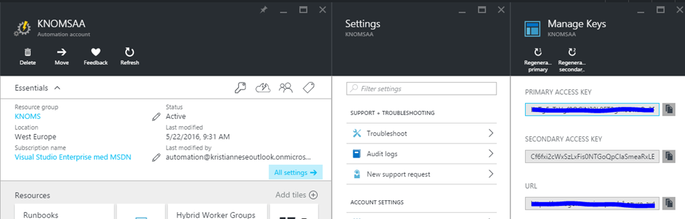
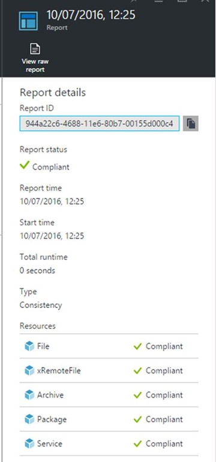

<properties
    pageTitle="使用 Site Recovery 和 Azure Automation DSC 将 VMware 虚拟机复制到 Azure | Azure"
    description="介绍如何通过 Azure Automation DSC 将适用于虚拟机/物理机的 Azure Site Recovery 移动服务和 Azure 代理自动部署到 Azure。"
    services="site-recovery"
    documentationcenter=""
    author="krnese"
    manager="lorenr"
    editor="" />  

<tags
    ms.assetid="1f8cd3ac-0522-48eb-a5f0-679ee9192ddb"
    ms.service="site-recovery"
    ms.workload="backup-recovery"
    ms.tgt_pltfrm="na"
    ms.devlang="na"
    ms.topic="article"
    ms.date="11/01/2016"
    wacn.date="02/15/2017"
    ms.author="krnese" />  

# 使用 Site Recovery 和 Azure Automation DSC 将 VMware 虚拟机复制到 Azure
在 Operations Management Suite 中，我们提供了一个可在业务连续性计划中使用的综合性备份和灾难恢复解决方案。

我们已使用 Hyper-V 副本并结合 Hyper-V 体验了这些功能。但是，这些功能现已经过扩展，可支持异构设置，因为客户在其云中拥有多个虚拟机监管程序与平台。

如果你目前运行的是 VMware 工作负荷和/或物理服务器，当 Azure 是目标时，管理服务器将运行环境中的所有 Azure Site Recovery 组件来处理与 Azure 之间的通信和数据复制。

## 使用 Automation DSC 部署 Site Recovery 移动服务
让我们快速剖析此管理服务器的作用：

管理服务器运行多个服务器角色。其中一个角色是*配置*，负责协调通信，以及管理数据复制与恢复过程。

此外，*进程*角色充当复制网关。此角色接收受保护源计算机提供的复制数据，通过缓存、压缩和加密对其进行优化，然后将数据发送到 Azure 存储帐户。进程角色的一大功能是，它还可以将移动服务的安装推送到受保护的计算机，并执行自动发现 VMware VM 的操作。

从 Azure 故障回复时，*主目标*角色将处理此操作过程中的复制数据。

对于受保护的计算机，我们依赖于*移动服务*。此组件部署在要复制到 Azure 的每个计算机（VMware VM 或物理服务器）上。它捕获计算机上的数据写入操作，并将这些操作转发到管理服务器（进程角色）。

处理业务连续性时，必须了解工作负荷、基础结构以及所涉及的组件。这样才能满足恢复时间目标 (RTO) 和恢复点目标 (RPO) 的要求。在此上下文中，移动服务的作用很重要，可以确保工作负荷按预期受到保护。

那么，要如何借助某些 Operations Management Suite 组件，以优化的方式确保建立可靠的保护设置呢？

本文将举例说明如何使用 Azure 自动化Desired State Configuration (DSC) 和 Site Recovery 来确保：

* 将移动服务和 Azure VM 代理部署到要保护的 Windows 计算机。
* 如果 Azure 是复制目标，移动服务和 Azure VM 代理始终都处于运行状态。

## 先决条件
* 一个存储库，用于存储所需设置
* 一个存储库，用于存储注册到管理服务器时所需的通行短语
  
  > [AZURE.NOTE]将为每个管理服务器生成唯一的通行短语。若要部署多个管理服务器，需确保将正确的通行短语存储在 passphrase.txt 文件中。
  > 
  > 
* 在想要启用保护的计算机上安装 Windows Management Framework (WMF) 5.0 （Automation DSC 的要求）
  
  > [AZURE.NOTE]如果想要针对已安装 WMF 4.0 的 Windows 计算机使用 DSC，请参阅 [在断开连接的环境中使用 DSC]（#在断开连接的环境中使用 DSC）部分。
  > 
  > 

移动服务可通过命令行安装，接受多个参数。正因如此，需要获取一些二进制文件（从设置中提取之后），并将其存储在能够使用 DSC 配置检索的位置。

## 步骤 1：提取二进制文件
1. 若要提取此设置所需的文件，请导航到管理服务器上的以下目录：
   
    **\\Microsoft Azure Site Recovery\\home\\svsystems\\pushinstallsvc\\repository**
   
    在此文件夹中，应会看到一个 MSI 文件，其名称为：
   
    **Microsoft-ASR\_UA\_version\_Windows\_GA\_date\_Release.exe**
   
    使用以下命令提取安装程序：
   
    **.\\Microsoft-ASR\_UA\_9.1.0.0_Windows\_GA_02May2016\_release.exe /q /x:C:\\Users\\Administrator\\Desktop\\Mobility\_Service\\Extract**
2. 选择所有文件，将其发送到压缩的文件夹 (zip)。

现已获得所需的二进制文件，可以使用 Automation DSC 自动安装移动服务了。

### 通行短语
接下来，你需要确定在何处放置这个压缩的文件夹。可以使用稍后所述的 Azure 存储帐户来存储设置所需的通行短语。然后，代理将在此过程中注册到管理服务器。

部署管理服务器时获取的通行短语可以保存到 txt 文件 (passphrase.txt) 中。

将压缩的文件夹和通行短语放置在 Azure 存储帐户的专用容器中。

  

也可以将这些文件保存在网络上的共享文件夹中。只需确保以后要使用的 DSC 资源可以访问和获取该设置与通行短语即可。

## 步骤 2：创建 DSC 配置
设置依赖于 WMF 5.0。为了使计算机能够成功通过 Automation DSC 应用配置，需要安装 WMF 5.0。

环境使用以下示例 DSC 配置：

	configuration ASRMobilityService {

	    $RemoteFile = 'https://knrecstor01.blob.core.chinacloudapi.cn/asr/ASR.zip'
	    $RemotePassphrase = 'https://knrecstor01.blob.core.chinacloudapi.cn/asr/passphrase.txt'
	    $RemoteAzureAgent = 'http://go.microsoft.com/fwlink/p/?LinkId=394789'
	    $LocalAzureAgent = 'C:\Temp\AzureVmAgent.msi'
	    $TempDestination = 'C:\Temp\asr.zip'
	    $LocalPassphrase = 'C:\Temp\Mobility_service\passphrase.txt'
	    $Role = 'Agent'
	    $Install = 'C:\Program Files (x86)\Microsoft Azure Site Recovery'
	    $CSEndpoint = '10.0.0.115'
	    $Arguments = '/Role "{0}" /InstallLocation "{1}" /CSEndpoint "{2}" /PassphraseFilePath "{3}"' -f $Role,$Install,$CSEndpoint,$LocalPassphrase  

	    Import-DscResource -ModuleName xPSDesiredStateConfiguration

	    node localhost {

	        File Directory {
	            DestinationPath = 'C:\Temp\ASRSetup\'
	            Type = 'Directory'            
	        }

	        xRemoteFile Setup {
	            URI = $RemoteFile
	            DestinationPath = $TempDestination
	            DependsOn = '[File]Directory'
	        }

	        xRemoteFile Passphrase {
	            URI = $RemotePassphrase
	            DestinationPath = $LocalPassphrase
            	    DependsOn = '[File]Directory'
	            }

	        xRemoteFile AzureAgent {
	            URI = $RemoteAzureAgent
	            DestinationPath = $LocalAzureAgent
            	    DependsOn = '[File]Directory'
	            }

	        Archive ASRzip {
	            Path = $TempDestination
	            Destination = 'C:\Temp\ASRSetup'
	            DependsOn = '[xRemotefile]Setup'
	        }

	        Package Install {
	            Path = 'C:\temp\ASRSetup\ASR\UNIFIEDAGENT.EXE'
	            Ensure = 'Present'
	            Name = 'Microsoft Azure Site Recovery mobility Service/Master Target Server'
	            ProductId = '275197FC-14FD-4560-A5EB-38217F80CBD1'
	            Arguments = $Arguments
	            DependsOn = '[Archive]ASRzip'
	        }

	        Package AzureAgent {
	            Path = 'C:\Temp\AzureVmAgent.msi'
	            Ensure = 'Present'
	            Name = 'Microsoft Azure VM Agent - 2.7.1198.735'
	            ProductId = '5CF4D04A-F16C-4892-9196-6025EA61F964'
	            Arguments = '/q /l "c:\temp\agentlog.txt'
	            DependsOn = '[Package]Install'
	        }

	        Service ASRvx {
	            Name = 'svagents'
	            Ensure = 'Present'
	            State = 'Running'
	            DependsOn = '[Package]Install'
	        }

	        Service ASR {
	            Name = 'InMage Scout Application Service'
	            Ensure = 'Present'
	            State = 'Running'
	            DependsOn = '[Package]Install'
	        }

	        Service AzureAgentService {
	            Name = 'WindowsAzureGuestAgent'
	            Ensure = 'Present'
	            State = 'Running'
	            DependsOn = '[Package]AzureAgent'
	        }

	        Service AzureTelemetry {
	            Name = 'WindowsAzureTelemetryService'
	            Ensure = 'Present'
	            State = 'Running'
	            DependsOn = '[Package]AzureAgent'
	        }
	    }
	}

配置将执行以下操作：

* 变量告诉配置要在何处获取移动服务和 Azure VM 代理的二进制文件、在何处获取通行短语，以及在何处存储输出。
* 配置将导入 xPSDesiredStateConfiguration DSC 资源，以便可以使用 `xRemoteFile` 从存储库下载文件。
* 配置将创建用于存储二进制文件的目录。
* 存档资源将提取压缩文件夹中的文件。
* 包 Install 资源使用特定的参数从 UNIFIEDAGENT.EXE 安装程序安装移动服务。（需要更改构造参数的变量来反映环境。）
* 包 AzureAgent 资源安装 Azure VM 代理，这是针对 Azure 中运行的每个 VM 建议安装的代理。故障转移后，还能通过 Azure VM 代理将扩展添加到 VM。
* 服务资源将确保相关的移动服务和 Azure 服务始终运行。

将配置保存为 **ASRMobilityService**。

> [AZURE.NOTE]
请记住，需根据实际的管理服务器替换配置中的 CSIP，这样代理才会正确进行连接，并使用正确的通行短语。
> 
> 

## 步骤 3：上载到 Automation DSC
由于我们创建的 DSC 配置将导入所需的 DSC 资源模块 (xPSDesiredStateConfiguration)，因此需要先将该模块导入自动化，然后才能上载 DSC 配置。

登录到自动化帐户，浏览到“资产”>“模块”，然后单击“浏览库”。

你可以在此处搜索模块，并将其导入到帐户中。

  

完成此操作后，请转到已安装 Azure Resource Manager 模块的计算机，然后继续导入新建的 DSC 配置。

### 导入 cmdlet
在 PowerShell 中，登录到 Azure 订阅。修改 cmdlet 以反映环境，然后捕获变量中的自动化帐户信息：

	$AAAccount = Get-AzureRmAutomationAccount -ResourceGroupName 'KNOMS' -Name 'KNOMSAA'

使用以下 cmdlet 将配置上载到 Automation DSC：

	$ImportArgs = @{
	    SourcePath = 'C:\ASR\ASRMobilityService.ps1'
	    Published = $true
	    Description = 'DSC Config for Mobility Service'
	}
	$AAAccount | Import-AzureRmAutomationDscConfiguration @ImportArgs

### 在 Automation DSC 中编译配置
接下来，需要在 Automation DSC 中编译配置，以便开始向它注册节点。为此，请运行以下 cmdlet：

	$AAAccount | Start-AzureRmAutomationDscCompilationJob -ConfigurationName ASRMobilityService

这可能需要几分钟的时间，因为配置主要部署到托管的 DSC 拉取服务。

编译配置后，可以使用 PowerShell (Get-AzureRmAutomationDscCompilationJob) 或 Azure 门户来检索作业信息。

  

现已成功发布 DSC 配置并将其上载到 Automation DSC。

## 步骤 4：将计算机加入 Automation DSC
> [AZURE.NOTE]
完成此方案的一个先决条件是已使用最新版本的 WMF 更新了 Windows 计算机。可以从[下载中心](https://www.microsoft.com/download/details.aspx?id=50395)下载并安装适用于平台的正确版本。
> 
> 

接下来，将创建要应用到节点的 DSC 元配置。若要成功，你需要检索适用于 Azure 中所选自动化帐户的终结点 URL 和主密钥。可以在自动化帐户的“所有设置”边栏选项卡中的“密钥”下面找到这些值。

  

在本示例中，需要使用 Site Recovery 来保护一台 Windows Server 2012 R2 物理服务器。

### 查看注册表中是否有待完成的文件重命名操作
在开始将服务器关联到 Automation DSC 终结点之前，建议查看注册表中是否有待完成的文件重命名操作。这些操作可能导致设置无法完成，因为系统等待重新启动。

运行以下 cmdlet，确保服务器上没有待完成的重新启动操作：

	Get-ItemProperty 'HKLM:\SYSTEM\CurrentControlSet\Control\Session Manager\' | Select-Object -Property PendingFileRenameOperations

如果显示的结果为空，则可继续操作。否则，应在维护时段内重新启动服务器以解决此问题。

若要在服务器上应用配置，请启动 Windows PowerShell 集成式脚本环境 (ISE) 并运行以下脚本。这实质上是一个 DSC 本地配置，指示本地配置管理器引擎注册到 Automation DSC 服务并检索特定的配置 (ASRMobilityService.localhost)。

	[DSCLocalConfigurationManager()]
	configuration metaconfig {
	    param (
	        $URL,
	        $Key
	    )
	    node localhost {
	        Settings {
	            RefreshFrequencyMins = '30'
	            RebootNodeIfNeeded = $true
	            RefreshMode = 'PULL'
	            ActionAfterReboot = 'ContinueConfiguration'
	            ConfigurationMode = 'ApplyAndMonitor'
	            AllowModuleOverwrite = $true
	        }

	        ResourceRepositoryWeb AzureAutomationDSC {
	            ServerURL = $URL
	            RegistrationKey = $Key
	        }

	        ConfigurationRepositoryWeb AzureAutomationDSC {
	            ServerURL = $URL
	            RegistrationKey = $Key
	            ConfigurationNames = 'ASRMobilityService.localhost'
	        }

	        ReportServerWeb AzureAutomationDSC {
	            ServerURL = $URL
	            RegistrationKey = $Key
	        }
	    }
	}
	metaconfig -URL 'https://we-agentservice-prod-1.azure-automation.net/accounts/<YOURAAAccountID>' -Key '<YOURAAAccountKey>'

	Set-DscLocalConfigurationManager .\metaconfig -Force -Verbose

此配置导致本地配置管理器引擎向 Automation DSC 注册自身。此外，它还确定引擎应有的工作方式、存在配置偏差 (ApplyAndAutoCorrect) 的情况下如何处理，以及必须重新启动时，应如何继续进行配置。

运行此脚本后，节点应启动注册到 Automation DSC 的过程

  

返回到 Azure 门户后，可以看到新注册的节点已出现在门户中。

  

在服务器上，可以运行以下 PowerShell cmdlet 来验证节点是否已正确注册：

	Get-DscLocalConfigurationManager

拉取配置并将其应用到服务器以后，可运行以下 cmdlet 对其进行验证：

	Get-DscConfigurationStatus

输出显示服务器已成功拉取其配置：

  

另外，移动服务安装程序自带的日志位于 *系统盘*\\ProgramData\\ASRSetupLogs 中。

就这么简单。现在，已在要使用 Site Recovery 保护的计算机上成功部署和注册移动服务。DSC 将确保所需的服务始终处于运行状态。

  

在管理服务器检测到部署成功之后，可以使用 Site Recovery 在计算机上配置保护并启用复制。

##在断开连接的环境中使用 DSC
即使计算机未连接到 Internet，也可通过 DSC 在需要保护的工作负荷上部署和配置移动服务。

可以在环境中将自己的 DSC 实例化，这样，基本上就能获得 Automation DSC 所提供的相同功能。也就是说，客户端会将配置（在注册后）拉取到 DSC 终结点。另一种做法是将 DSC 配置手动推送到计算机（无论是在本地还是远程）。

请注意，本示例为计算机名添加了一个参数。远程文件现在位于想要保护的计算机应可访问的远程共享上。脚本结束时，将启用配置，然后开始将 DSC 配置应用到目标计算机。

### 先决条件
确定已安装 xPSDesiredStateConfiguration PowerShell 模块。对于安装了 WMF 5.0 的 Windows 计算机，可在目标计算机上运行以下 cmdlet 来安装 xPSDesiredStateConfiguration 模块：

	Find-Module -Name xPSDesiredStateConfiguration | Install-Module

如果需要将此模块分发到装有 WMF 4.0 的 Windows 计算机，则也可以下载并保存该模块。在装有 PowerShellGet (WMF 5.0) 的计算机上运行以下 cmdlet：

	Save-Module -Name xPSDesiredStateConfiguration -Path <location>

此外，对于 WMF 4.0，请确保计算机上已安装 [Windows 8.1 更新 KB2883200](https://www.microsoft.com/download/details.aspx?id=40749)。

以下配置可以推送到装有 WMF 5.0 和 WMF 4.0 的 Windows 计算机：

	configuration ASRMobilityService {
	    param (
	        [Parameter(Mandatory=$true)]
	        [ValidateNotNullOrEmpty()]
	        [System.String] $ComputerName
	    )

	    $RemoteFile = '\\myfileserver\share\asr.zip'
	    $RemotePassphrase = '\\myfileserver\share\passphrase.txt'
	    $RemoteAzureAgent = '\\myfileserver\share\AzureVmAgent.msi'
	    $LocalAzureAgent = 'C:\Temp\AzureVmAgent.msi'
	    $TempDestination = 'C:\Temp\asr.zip'
	    $LocalPassphrase = 'C:\Temp\Mobility_service\passphrase.txt'
	    $Role = 'Agent'
	    $Install = 'C:\Program Files (x86)\Microsoft Azure Site Recovery'
	    $CSEndpoint = '10.0.0.115'
	    $Arguments = '/Role "{0}" /InstallLocation "{1}" /CSEndpoint "{2}" /PassphraseFilePath "{3}"' -f $Role,$Install,$CSEndpoint,$LocalPassphrase

	    Import-DscResource -ModuleName xPSDesiredStateConfiguration

	    node $ComputerName {      
	        File Directory {
	            DestinationPath = 'C:\Temp\ASRSetup\'
	            Type = 'Directory'            
	        }

	        xRemoteFile Setup {
	            URI = $RemoteFile
	            DestinationPath = $TempDestination
	            DependsOn = '[File]Directory'
	        }

	        xRemoteFile Passphrase {
	            URI = $RemotePassphrase
	            DestinationPath = $LocalPassphrase
	            DependsOn = '[File]Directory'
	        }

	        xRemoteFile AzureAgent {
	            URI = $RemoteAzureAgent
	            DestinationPath = $LocalAzureAgent
	            DependsOn = '[File]Directory'
	        }

	        Archive ASRzip {
	            Path = $TempDestination
	            Destination = 'C:\Temp\ASRSetup'
	            DependsOn = '[xRemotefile]Setup'
	        }

	        Package Install {
	            Path = 'C:\temp\ASRSetup\ASR\UNIFIEDAGENT.EXE'
	            Ensure = 'Present'
	            Name = 'Microsoft Azure Site Recovery mobility Service/Master Target Server'
	            ProductId = '275197FC-14FD-4560-A5EB-38217F80CBD1'
	            Arguments = $Arguments
	            DependsOn = '[Archive]ASRzip'
	        }

	        Package AzureAgent {
	            Path = 'C:\Temp\AzureVmAgent.msi'
	            Ensure = 'Present'
	            Name = 'Microsoft Azure VM Agent - 2.7.1198.735'
	            ProductId = '5CF4D04A-F16C-4892-9196-6025EA61F964'
	            Arguments = '/q /l "c:\temp\agentlog.txt'
	            DependsOn = '[Package]Install'
	        }

	        Service ASRvx {
	            Name = 'svagents'
	            State = 'Running'
	            DependsOn = '[Package]Install'
	        }

	        Service ASR {
	            Name = 'InMage Scout Application Service'
	            State = 'Running'
	            DependsOn = '[Package]Install'
	        }

	        Service AzureAgentService {
	            Name = 'WindowsAzureGuestAgent'
	            State = 'Running'
	            DependsOn = '[Package]AzureAgent'
	        }

	        Service AzureTelemetry {
	            Name = 'WindowsAzureTelemetryService'
	            State = 'Running'
	            DependsOn = '[Package]AzureAgent'
	        }
	    }
	}
	ASRMobilityService -ComputerName 'MyTargetComputerName'

	Start-DscConfiguration .\ASRMobilityService -Wait -Force -Verbose

若要在公司网络中实例化自己的 DSC 拉取服务器来模拟 Automation DSC 的功能，请参阅 [Setting up a DSC web pull server](https://msdn.microsoft.com/zh-cn/powershell/dsc/pullserver?f=255&MSPPError=-2147217396)（设置 DSC Web 拉服务器）。

## 可选：使用 Azure Resource Manager 模板部署 DSC 配置
本文重点介绍如何通过创建自己的 DSC 配置来自动部署移动服务和 Azure VM 代理，以及如何确保它们在要保护的计算机上处于运行状态。也可以使用 Azure Resource Manager 模板，将此 DSC 配置部署到新的或现有的 Azure 自动化帐户。此模板使用输入参数来创建包含环境变量的自动化资产。

部署模板后，只需参阅本指南中的步骤 4 即可登记计算机。

该模板将执行以下操作：

1. 使用现有的自动化帐户或创建新的自动化帐户
2. 获取以下各项的输入参数：
   * ASRRemoteFile -- 存储移动服务设置的位置
   * ASRPassphrase -- 存储 passphrase.txt 文件的位置
   * ASRCSEndpoint -- 管理服务器的 IP 地址
3. 导入 xPSDesiredStateConfiguration PowerShell 模块
4. 创建和编译 DSC 配置

上述所有步骤按正确的顺序进行，以便能够开始登记所要保护的计算机。

[GitHub](https://github.com/krnese/AzureDeploy/tree/master/OMS/MSOMS/DSC) 上提供了该模板及其部署说明。

使用 PowerShell 部署模板：

	$RGDeployArgs = @{
	    Name = 'DSC3'
	    ResourceGroupName = 'KNOMS'
	    TemplateFile = 'https://raw.githubusercontent.com/krnese/AzureDeploy/master/OMS/MSOMS/DSC/azuredeploy.json'
	    OMSAutomationAccountName = 'KNOMSAA'
	    ASRRemoteFile = 'https://knrecstor01.blob.core.chinacloudapi.cn/asr/ASR.zip'
	    ASRRemotePassphrase = 'https://knrecstor01.blob.core.chinacloudapi.cn/asr/passphrase.txt'
	    ASRCSEndpoint = '10.0.0.115'
	    DSCJobGuid = [System.Guid]::NewGuid().ToString()
	}
	New-AzureRmResourceGroupDeployment @RGDeployArgs -Verbose

## 后续步骤
部署移动服务代理后，可为虚拟机[启用复制](/documentation/articles/site-recovery-vmware-to-azure/#step-6-replicate-applications)。

<!---HONumber=Mooncake_1205_2016-->