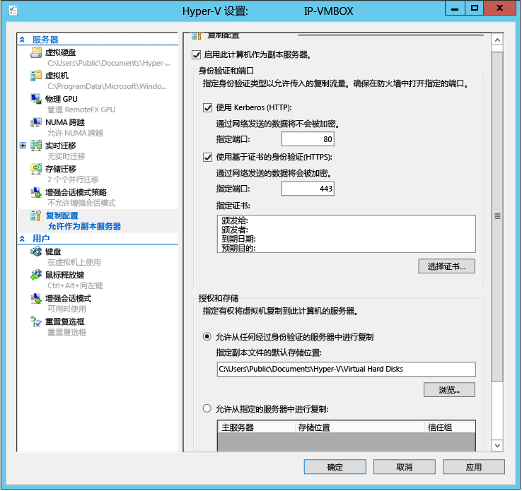
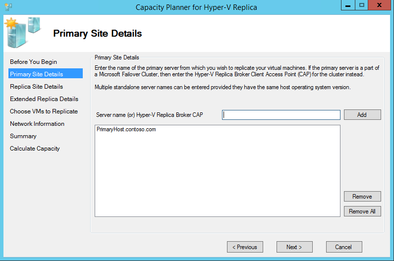
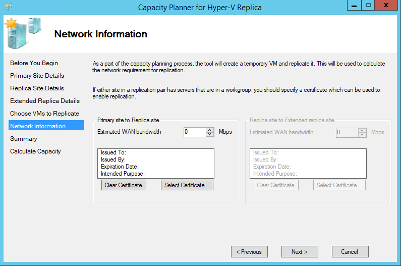
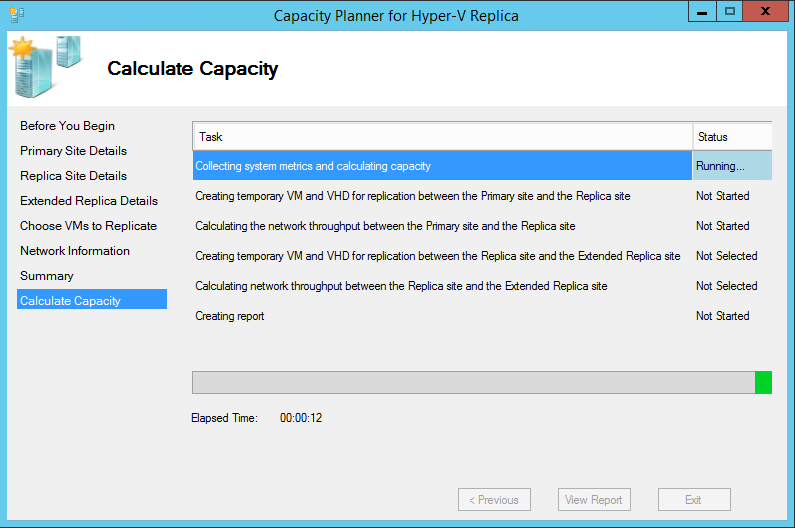

<properties
    pageTitle="为站点恢复运行 Hyper-V Capacity Planner 工具 | Azure"
    description="本文介绍如何运行 Azure Site Recovery 的 Hyper-V Capacity Planner 工具"
    services="site-recovery"
    documentationcenter="na"
    author="rayne-wiselman"
    manager="jwhit"
    editor="" />  

<tags
    ms.assetid="2bc3832f-4d6e-458d-bf0c-f00567200ca0"
    ms.service="site-recovery"
    ms.devlang="na"
    ms.topic="article"
    ms.tgt_pltfrm="na"
    ms.workload="storage-backup-recovery"
    ms.date="02/06/2017"
    wacn.date="03/10/2017"
    ms.author="nisoneji" />  

# 为站点恢复运行 Hyper-V Capacity Planner 工具

作为 Azure Site Recovery 部署的一部分，需要确定复制和带宽要求。站点恢复的 Hyper-V Capacity Planner 工具可帮助用户针对 Hyper-V 虚拟机复制执行此操作。

本文介绍如何运行 Hyper-V Capacity Planner 工具。此工具应与[站点恢复容量规划](/documentation/articles/site-recovery-capacity-planner/)中的信息一起使用。

## 准备阶段
在主站点中的 Hyper-V 服务器或群集节点上运行该工具。若要运行 Hyper-V 主机服务器所需的工具，需满足以下要求：

* 操作系统：Windows Server 2012 或 2012 R2
* 内存：20 MB（最低）
* CPU：5% 开销（最低）
* 磁盘空间：5 MB（最低）

运行该工具之前，必须准备好主站点。如果要在两个本地站点之间复制并希望检查带宽，则还需要准备好副本服务器。

## 步骤 1：准备主站点

1. 在主站点上生成要复制的所有 Hyper-V VM 及其所在 Hyper-V 主机/群集的列表。该工具可针对多个独立主机或单个群集运行，但不能同时对这两者运行。它还需要单独针对每个操作系统运行，因此用户应收集有关 Hyper-V 服务器的信息，如下所示：

   * Windows Server 2012 独立服务器
   * Windows Server 2012 群集
   * Windows Server 2012 R2 独立服务器
   * Windows Server 2012 R2 群集
2. 在所有 Hyper-V 主机和群集上启用 WMI 远程访问。在每个服务器/群集上运行以下命令，以确保设置防火墙规则和用户权限：

        netsh firewall set service RemoteAdmin enable
3. 在服务器和群集上启用性能监视，如下所示：

   * 使用“高级安全性”管理单元打开 Windows 防火墙，然后启用以下入站规则：“COM+ 网络访问(DCOM-IN)”，以及“远程事件日志管理组”中的所有规则。

## 步骤 2：准备副本服务器（本地到本地复制）
如果要复制到 Azure，则不需要执行此操作。

建议设置单个 Hyper-V 主机作为恢复服务器，以便可将虚构 VM 复制到该主机以检查带宽。可以跳过此步骤，但如果不执行此操作，将无法测量带宽。

1. 如果想要使用群集节点作为副本，请配置 Hyper-V 副本代理：

   * 在“服务器管理器”中，打开“故障转移群集管理器”。
   * 连接到群集，突出显示群集名称，然后单击“操作”>“配置角色”以打开“高可用性”向导。
   * 在“选择角色”中，选择“Hyper-V 副本代理”。在向导中提供“NetBIOS 名称”和“IP 地址”作为群集的连接点（称为客户端接入点）。将配置“Hyper-V 副本代理”，并生成一个客户端接入点名称，应记下该名称。
   * 验证 Hyper-V 副本代理角色是否已成功联机，并可以在群集的所有节点之间故障转移。为此，请右键单击该角色，指向“移动”，然后单击“选择节点”。选择节点 >“确定”。
   * 如果使用基于证书的身份验证，请确保每个群集节点和客户端访问点上都安装了证书。
2. 启用副本服务器：

   * 针对某个群集打开“故障群集管理器”，连接到该群集，然后单击“角色”> 选择角色 >“复制设置”>“启用此群集作为副本服务器”。如果使用群集作为副本，则主站点的群集上还需存在 Hyper-V 副本代理角色。
   * 对于独立服务器，请打开“Hyper-V 管理器”在“操作”窗格中，单击要启用的服务器的“Hyper-V 设置”，然后在“复制配置”中单击“启用这台计算机作为副本服务器”。
3. 设置身份验证：

   * 在“身份验证和端口”中选择对主服务器进行身份验证的方式以及身份验证端口。如果使用证书，请单击“选择证书”以选择一个证书。如果主服务器和恢复 Hyper-V 主机位于同一个域或受信任的域中，请使用 Kerberos。对于不同域或工作组部署使用证书。
   * 在“授权和存储”中，允许**任何**已经过身份验证的（主）服务器将复制数据发送到这个副本服务器。

	

   * 运行 **netsh http show servicestate** 以检查是否针对指定的协议/端口运行了侦听器：
4. 设置防火墙。在 Hyper-V 安装期间创建防火墙规则，以允许默认端口上的流量（443 上的 HTTPS 流量，80 上的 Kerberos 流量）。按如下所示启用这些规则：

  - 群集 (443) 上的证书身份验证：
  
            Get-ClusterNode | ForEach-Object {Invoke-command -computername \$\_.name -scriptblock {Enable-Netfirewallrule -displayname "Hyper-V Replica HTTPS Listener (TCP-In)"}}

  - 群集 (80) 上的 Kerberos 身份验证：
        
            Get-ClusterNode | ForEach-Object {Invoke-command -computername \$\_.name -scriptblock {Enable-Netfirewallrule -displayname "Hyper-V Replica HTTP Listener (TCP-In)"}}

  - 独立服务器上的证书身份验证：
    
            Enable-Netfirewallrule -displayname "Hyper-V Replica HTTPS Listener (TCP-In)"

  - 独立服务器上的 Kerberos 身份验证：
  
            Enable-Netfirewallrule -displayname "Hyper-V Replica HTTP Listener (TCP-In)"

## 步骤 3：运行 Capacity Planner 工具
在准备好主站点并设置恢复服务器之后，可以运行该工具。

1. 从 Microsoft 下载中心[下载](https://www.microsoft.com/en-us/download/details.aspx?id=39057)该工具。
2. 从某个主服务器（或主群集中的某个节点）运行该工具。右键单击 .exe 文件，然后选择“以管理员身份运行”。
3. 在“准备阶段”中指定收集数据的时间长度。建议在生产期间运行该工具，以确保数据具有代表性。如果只想要验证网络连接，可以只收集一分钟的数据。

	

4. 在“主站点详细信息”中，针对独立主机指定服务器名称或 FQDN，或针对群集指定客户端接受点的 FQDN、群集名称或群集中的任何节点，然后单击“下一步”。该工具将自动检测它所在的服务器的名称。该工具将选择可以在其中监视指定服务器的 VM。

	

5. 在“副本站点详细信息”中，如果要复制到 Azure 或辅助数据中心且尚未设置副本服务器，请选择“跳过涉及副本站点的测试”。如果要复制到辅助数据中心并且已设置副本类型，请在“服务器名称(或) Hyper-V 副本代理 CAP”中输入独立服务器的 FQDN，或群集的客户端接入点。

	

6. 在“扩展副本详细信息”中启用“跳过涉及扩展副本站点的测试”。Site Recovery 不支持这些测试。
7. 在“选择要复制的 VM”中，工具将根据在“主站点详细信息”页上指定的设置连接到服务器或群集，并显示主服务器上运行的 VM 和磁盘。将不会显示已针对复制启用或未在运行的 VM。选择要收集其度量值的 VM。选择 VHD 也会自动收集 VM 的数据。
8. 如果已配置副本服务器或群集，请在“网络信息”中指定要用于主站点和副本站点之间的近似 WAN 带宽；如果已配置证书身份验证，请选择证书。

	

9. 在“摘要”中检查设置，然后单击“下一步”开始收集度量值。工具的进度和状态将显示在“计算容量”页上。该工具完成运行时，请单击“查看报告”以查看输出。默认情况下，报告和日志存储在 **%systemdrive%\\Users\\Public\\Documents\\Capacity Planner** 中。

	

## 步骤 4：解释结果
以下是重要度量值。可以忽略未列在此处的度量值。它们与站点恢复无关。

### 本地到本地复制

* 复制对主要主机的计算资源和内存的影响
* 复制对主要主机和恢复主机的存储磁盘空间、IOPS 的影响
* 增量复制所需的总带宽 (Mbps)
* 在主要主机和恢复主机之间观测到的网络带宽 (Mbps)
* 两个主机/群集之间活动并行传输的理想数目建议

### 本地到 Azure 复制

* 复制对主要主机的计算资源和内存的影响
* 复制对主要主机的存储磁盘空间、IOPS 的影响
* 增量复制所需的总带宽 (Mbps)

## 更多资源
- 有关该工具的详细信息，请阅读随工具下载的文档。
- 观看 Keith Mayer 的 [TechNet 博客](http://blogs.technet.com/b/keithmayer/archive/2014/02/27/guided-hands-on-lab-capacity-planner-for-windows-server-2012-hyper-v-replica.aspx)中的工具演练。
- 获取本地到本地 Hyper-V 复制的性能测试[结果](/documentation/articles/site-recovery-performance-and-scaling-testing-on-premises-to-on-premises/)

## 后续步骤

完成容量计划之后，可以开始部署 Site Recovery：

- [将 VMM 云中的 Hyper-V VM 复制到 Azure](/documentation/articles/site-recovery-vmm-to-azure/)
- [将 Hyper-V VM（不带 VMM）复制到 Azure](/documentation/articles/site-recovery-hyper-v-site-to-azure/)
- [在 VMM 站点之间复制 Hyper-V VM](/documentation/articles/site-recovery-vmm-to-vmm/)

<!---HONumber=Mooncake_0306_2017-->
<!--Update_Description: wording update-->