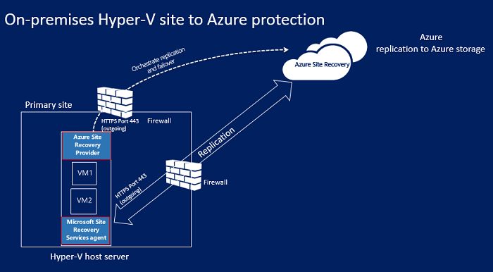
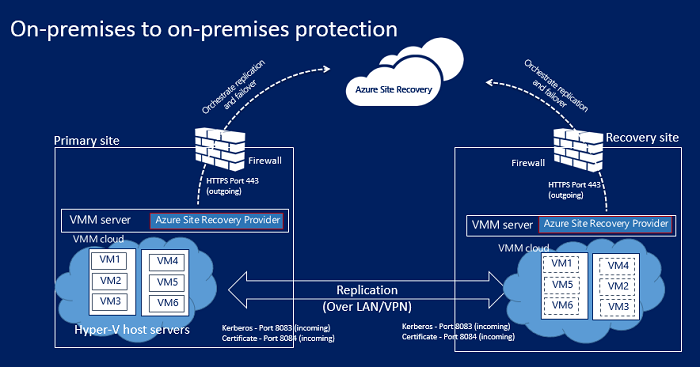

<properties
    pageTitle="Site Recovery 的工作原理 | Azure"
    description="本文概述了 Site Recovery 体系结构"
    services="site-recovery"
    documentationcenter=""
    author="rayne-wiselman"
    manager="jwhit"
    editor="" />
<tags
    ms.assetid="c413efcd-d750-4b22-b34b-15bcaa03934a"
    ms.service="site-recovery"
    ms.workload="backup-recovery"
    ms.tgt_pltfrm="na"
    ms.devlang="na"
    ms.topic="get-started-article"
    ms.date="03/14/2017"
    wacn.date="04/06/2017"
    ms.author="raynew" />

# Azure Site Recovery 的工作原理

本文介绍了 [Azure Site Recovery](/documentation/articles/site-recovery-overview/) 服务的基础体系结构以及它运行时使用的组件。

## 复制到 Azure

可以将以下各项复制到 Azure：

- **Hyper-V**：在[受支持的主机](/documentation/articles/site-recovery-support-matrix-to-azure/#support-for-datacenter-management-servers)上运行的本地 Hyper-V VM。
- **物理机**：在[受支持的操作系统](/documentation/articles/site-recovery-support-matrix-to-azure/#support-for-replicated-machine-os-versions)上运行 Windows 或 Linux 的本地物理服务器。你可以复制运行 [Hyper-V 和 Azure](https://technet.microsoft.com/zh-cn/windows-server-docs/compute/hyper-v/supported-windows-guest-operating-systems-for-hyper-v-on-windows) 支持的任何来宾操作系统的 Hyper-V VM。

## 物理机到 Azure

将物理本地服务器复制到 Azure 时，复制过程使用与从 VMware 到 Azure 相同的组件和进程，但请注意以下差异：

- 可以使用物理服务器（而非 VMware VM）作为配置服务器
- 你需要具有用于故障回复的本地 VMware 基础结构。无法故障回复到物理服务器。

## Hyper-V 到 Azure

下面是将 Hyper-V VM 复制到 Azure 时所需的项。

**区域** | **组件** | **详细信息**
--- | --- | ---
**Azure** | 在 Azure 中，你需要一个 Azure 帐户、Azure 存储帐户和 Azure 网络。 | 
存储和网络帐户可以是基于 Resource Manager 的帐户或经典帐户。

 复制的数据存储在存储帐户中；从本地站点故障转移时，将使用复制的数据创建 Azure VM。

 创建 Azure VM 后，它们将连接到 Azure 虚拟网络。

**VMM 服务器** | 位于 VMM 云中的 Hyper-V 主机 | 
如果 Hyper-V 主机托管在 VMM 云中，则你可以在恢复服务保管库中注册 VMM 服务器。

 你将在 VMM 服务器上安装 Site Recovery 提供程序来安排使用 Azure 进行的复制。

 你需要设置逻辑网络和 VM 网络来配置网络映射。VM 网络应该链接到与该云相关联的逻辑网络。

**Hyper-V 主机** | 部署 Hyper-V 服务器时可以使用也可以不使用 VMM 服务器。 | 
如果没有 VMM 服务器，则 Site Recovery 提供程序安装在主机上来安排使用 Site Recovery 通过 Internet 进行的复制。如果有 VMM 服务器，则提供程序将安装在该服务器上而非安装在主机上。

 恢复服务代理安装在主机上来处理数据复制。

 来自提供程序和代理的通信都是安全且经过加密的。Azure 存储空间中的复制数据也已加密。

**Hyper-V VM** | Hyper-V 主机服务器上需有一个或多个 VM。 | 不需要额外在 VM 上安装任何组件

### 复制过程

1. 设置 Azure 组件。建议在开始部署 Site Recovery 之前设置存储和网络帐户。
2. 为 Site Recovery 创建复制服务保管库，并配置保管库设置，包括：
    - 源和目标设置。如果不是在 VMM 云中管理 Hyper-V 主机，请为目标创建一个 Hyper-V 站点容器，并将 Hyper-V 主机添加到其中。如果是在 VMM 云中管理 Hyper-V 主机，则源是 VMM 云。目标是 Azure。
    - 安装 Azure Site Recovery 提供程序和 Azure 恢复服务代理。如果使用 VMM，将在其上安装提供程序，在每台 Hyper-V 主机上安装代理。如果未使用 VMM，提供程序和代理将安装在每台主机上。
    - 为 Hyper-V 站点或 VMM 云创建复制策略。策略将应用到站点或云中主机上的所有 VM。
    - 为 Hyper-V VM 启用复制。初始复制根据复制策略设置进行。
4. 数据更改将受到跟踪，完成初始复制后，开始将增量更改复制到 Azure。项的受跟踪更改保存在 .hrl 文件中。
5. 运行测试故障转移，确保一切正常运行。

### 故障转移和故障回复过程

1. 可以运行从本地 Hyper-V VM 到 Azure 的计划内或计划外[故障转移](/documentation/articles/site-recovery-failover/)。如果运行计划内故障转移，则源 VM 将关闭以确保不会丢失数据。
2. 可以故障转移单台计算机，或创建[恢复计划](/documentation/articles/site-recovery-create-recovery-plans/)来协调多台计算机的故障转移。
4. 运行故障转移后，应会在 Azure 中看到创建的副本 VM。如果需要，可向 VM 分配公共 IP 地址。
5. 然后提交故障转移，开始从副本 Azure VM 访问工作负荷。
6. 当本地主站点再次可用时，便可以执行[故障回复](/documentation/articles/site-recovery-failback-from-azure-to-hyper-v/)。启动从 Azure 到主站点的计划内故障转移。运行计划内故障转移时，可以选择故障回复到同一 VM 或备用位置，并同步 Azure 与本地之间的更改，确保不会丢失数据。在本地创建 VM 时，请提交故障转移。

**图 4：从 Hyper-V 站点到 Azure 的复制**

**图 5：从 VMM 云中的 Hyper-V 到 Azure 的复制**

## 复制到辅助站点

可以将以下各项复制到辅助站点：

- **物理机**：在[受支持的操作系统](/documentation/articles/site-recovery-support-matrix-to-sec-site/#support-for-replicated-machine-os-versions)上运行 Windows 或 Linux 的本地物理服务器。
- **Hyper-V**：在 VMM 云中托管的[受支持 Hyper-V 主机](/documentation/articles/site-recovery-support-matrix-to-sec-site/#on-premises-servers)上运行的本地 Hyper-V VM。[受支持的主机](/documentation/articles/site-recovery-support-matrix-to-azure/#support-for-datacenter-management-servers)。你可以复制运行 [Hyper-V 和 Azure](https://technet.microsoft.com/zh-cn/windows-server-docs/compute/hyper-v/supported-windows-guest-operating-systems-for-hyper-v-on-windows) 支持的任何来宾操作系统的 Hyper-V VM。

## 从物理服务器到辅助站点

可以使用 InMage Scout 将物理服务器复制到辅助站点。

### 组件

**区域** | **组件** | **详细信息**
--- | --- | ---
**Azure** | InMage Scout。 | 
若要获取 InMage Scout，需要具有一个 Azure 订阅。

 创建恢复服务保管库后，可以下载 InMage Scout 并安装最新的更新，以设置部署。

**进程服务器** | 位于主站点中 | 
你将部署进程服务器来处理缓存、压缩和数据优化操作。

 它还可以将安装的统一代理推送到你要保护的计算机。

**配置服务器** | 位于辅助站点中 | 配置服务器使用管理网站或 vContinuum 控制台来管理、配置和监视你的部署。
**vContinuum 服务器** | 可选。与配置服务器安装在同一位置。 | 它提供一个控制台用于管理和监视受保护的环境。
**主目标服务器** | 位于辅助站点中 | 
主目标服务器保存复制的数据。它从进程服务器接收数据，在辅助站点中创建副本地器，并保存数据保留点。

 需要的主目标服务器数目取决于要保护的计算机数目。

 如果想要故障回复到主站点，则也需要在那里有一个主目标服务器。在此服务器上安装统一代理。

**VMware ESX/ESXi 和 vCenter 服务器** | VM 托管在 ESX/ESXi 主机上。主机是通过 vCenter 服务器管理的 | 需要使用 VMware 基础结构来复制 VMware VM。
**VM/物理服务器** | 在你要复制的 VMware VM 和物理服务器上安装的统一代理。 | 该代理充当所有组件之间的通信提供程序。

### 复制过程

1. 在每个站点（配置、进程、主目标）中设置组件服务器，并在要复制的计算机上安装统一代理。
2. 初始复制之后，每台计算机上的代理将增量复制更改发送到进程服务器。
3. 进程服务器将优化这些数据，并将其传输到辅助站点上的主目标服务器。配置服务器将管理复制进程。

## 从 Hyper-V 到辅助站点

下面是将 Hyper-V VM 复制到辅助站点时所需的项。

**区域** | **组件** | **详细信息**
--- | --- | ---
**Azure** | 需要一个 Azure 帐户。 |
**VMM 服务器** | 我们建议在主站点和辅助站点中各部署一台 VMM 服务器 | 
每台 VMM 服务器都应当连接到 Internet。

 每台服务器应至少包含一个设置了 Hyper-V 功能配置文件的 VMM 私有云。

 在 VMM 服务器上安装 Azure Site Recovery 提供程序。提供程序通过 Internet 使用 Site Recovery 服务协调和安排复制。提供程序与 Azure 之间的通信是安全且经过加密的。

**Hyper-V 服务器** | 
主要和辅助 VMM 云中的一台或多台 Hyper-V 主机服务器。

 服务器应已连接到 Internet。

 使用 Kerberos 或证书身份验证通过 LAN 或 VPN 在主要和辅助 Hyper-V 主机服务器之间复制数据。
  
**Hyper-V VM** | 位于源 Hyper-V 主机服务器中。 | 源主机服务器应该至少有一个要复制的 VM。

### 复制过程

1. 设置 Azure 帐户。
2. 为 Site Recovery 创建复制服务保管库，并配置保管库设置，包括：

    - 复制源和目标（主站点和辅助站点）。
    - 安装 Azure Site Recovery 提供程序和 Azure 恢复服务代理。在 VMM 服务器上安装提供程序，在每台 Hyper-V 主机上安装代理。
    - 为源 VMM 云创建复制策略。策略将应用到云中主机上的所有 VM。
    - 为 Hyper-V VM 启用复制。初始复制根据复制策略设置进行。
4. 数据更改将受到跟踪，完成初始复制后，开始复制增量更改。项的受跟踪更改保存在 .hrl 文件中。
5. 运行测试故障转移，确保一切正常运行。

**图 7：VMM 到 VMM 的复制**

### 故障转移和故障回复

1. 本地到本地可以在本地站点之间运行计划内或计划外[故障转移](/documentation/articles/site-recovery-failover/)。如果运行计划的故障转移，则源 VM 将关闭以确保不会丢失数据。
2. 可以故障转移单台计算机，或创建[恢复计划](/documentation/articles/site-recovery-create-recovery-plans/)来协调多台计算机的故障转移。
4. 如果执行了到辅助站点的计划外故障转移，在故障转移后，将不会为辅助位置中的计算机启用保护或复制。如果运行了计划内故障转移，在故障转移后，辅助位置中的计算机将受保护。
5. 然后提交故障转移，开始从副本 VM 访问工作负荷。
6. 当主站点再次可用时，启动从辅助站点到主站点的反向复制。反向复制会使虚拟机进入受保护状态，但辅助数据中心仍是活动位置。
7. 若要使主站点再次成为活动位置，可以启动从辅助站点到主站点的计划内故障转移，然后再次启动反向复制。

## 后续步骤

- [检查先决条件](/documentation/articles/site-recovery-prereq/)

<!---HONumber=Mooncake_0327_2017-->
<!--Update_Description: content structure update, add details for "复制到辅助站点", "从 Hyper-V 到辅助站点" -->