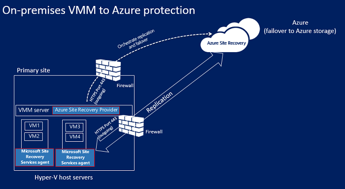

<properties
    pageTitle="站点恢复的工作原理 | Azure"
    description="本文提供站点恢复体系结构的概述"
    services="site-recovery"
    documentationcenter=""
    author="rayne-wiselman"
    manager="jwhit"
    editor="" />
<tags
    ms.assetid="c413efcd-d750-4b22-b34b-15bcaa03934a"
    ms.service="site-recovery"
    ms.workload="backup-recovery"
    ms.tgt_pltfrm="na"
    ms.devlang="na"
    ms.topic="get-started-article"
    ms.date="01/02/2017"
    wacn.date="02/10/2017"
    ms.author="raynew" />  

# Azure Site Recovery 的工作原理

阅读本文，了解 Azure Site Recovery 服务的基础架构以及它运行时使用的组件。

组织需要制定 BCDR 策略来确定应用、工作负荷和数据如何在计划和非计划的停机期间保持运行和可用，并尽快恢复正常运行情况。BCDR 策略应保持业务数据的安全性和可恢复性，并确保在发生灾难时工作负荷持续可用。

Site Recovery 是一项 Azure 服务，可通过协调从本地物理服务器和虚拟机到云 (Azure) 或辅助数据中心的的复制，为 BCDR 策略提供辅助。主要位置发生故障时，可故障转移到辅助位置，使应用和工作负荷保持可用。当主要位置恢复正常时，你可以故障回复到主要位置。有关详细信息，请参阅[什么是 Site Recovery？](/documentation/articles/site-recovery-overview/)

使用 [Azure 经典管理门户](https://manage.windowsazure.cn/)可以维护现有的 Site Recovery 保管库，但无法创建新保管库。

## 部署方案

部署站点恢复可在许多方案中协调复制：

- **复制 Hyper-V VM**：可将 Hyper-V VM 复制到 Azure 或辅助 VMM 站点。如果要将这些 VM 复制到辅助站点，它们必须在 System Center Virtual Machine Manager (VMM) 云中管理。
- **迁移 VM**：除了将本地 VM 和物理服务器复制（复制、故障转移和故障回复）到 Azure 以外，还可以将它们迁移到 Azure VM（复制、故障转移，但无法故障回复）。下面是可以迁移的项：
    - 迁移本地 Hyper-V VM 和物理服务器上运行的工作负荷，使其在 Azure VM 上运行。
    - 在 Azure 区域之间迁移 [Azure IaaS VM](/documentation/articles/site-recovery-migrate-azure-to-azure/)。目前只有此方案才支持迁移，这意味着，故障回复不受支持。
    - 将 [AWS Windows 实例](/documentation/articles/site-recovery-migrate-aws-to-azure/)迁移到 Azure IaaS VM。目前只有此方案才支持迁移，这意味着，故障回复不受支持。

Site Recovery 将复制受支持 VM 和物理服务器上运行的应用。有关受支持应用的完整摘要，请参阅 [Azure Site Recovery 可以保护哪些工作负荷？](/documentation/articles/site-recovery-workload/)（）

## 将 Hyper-V VM 复制到 Azure

### 组件

**组件** | **详细信息**
--- | ---
**Azure** | 在 Azure 中，需要创建 Azure 帐户、Azure 存储帐户和 Azure 网络。   存储和网络帐户可以是基于 Resource Manager 的帐户或经典帐户。   复制的数据存储在存储帐户中；从本地站点故障转移时，将使用复制的数据创建 Azure VM。   创建 Azure VM 后，它们将连接到 Azure 虚拟网络。
**VMM 服务器** | 如果 Hyper-V 主机位于 VMM 云中，需要设置逻辑和 VM 网络来配置[网络映射](/documentation/articles/site-recovery-network-mapping/)。VM 网络应该链接到与该云相关联的逻辑网络。
**Hyper-V 主机** | 需要一个或多个 Hyper-V 主机服务器。
**Hyper-V VM** | Hyper-V 主机服务器上需有一个或多个 VM。Hyper-V 主机上运行的提供程序通过 Internet 协调使用 Site Recovery 服务的复制。代理通过 HTTPS 443 处理数据复制。来自提供程序和代理的通信都是安全且经过加密的。Azure 存储空间中的复制数据也已加密。

## 复制过程

1. 设置 Azure 组件。建议在开始部署 Site Recovery 之前设置存储和网络帐户。
2. 为 Site Recovery 创建复制服务保管库，并配置保管库设置，包括：
    - 如果 Hyper-V 主机不是在 VMM 云中管理，请创建 Hyper-V 站点容器，并将 Hyper-V 主机添加到其中。
    - 复制源和目标。如果 Hyper-V 主机在 VMM 云中管理，则源是 VMM 云。否则，源是 Hyper-V 站点。
    - 安装 Azure Site Recovery 提供程序和 Azure 恢复服务代理。如果使用 VMM，将在其上安装提供程序，在每台 Hyper-V 主机上安装代理。如果未使用 VMM，提供程序和代理将安装在每台主机上。
    - 为 Hyper-V 站点或 VMM 云创建复制策略。策略将应用到站点或云中主机上的所有 VM。
    - 为 Hyper-V VM 启用复制。初始复制根据复制策略设置进行。
4. 数据更改将受到跟踪，完成初始复制后，开始将增量更改复制到 Azure。项的受跟踪更改保存在 .hrl 文件中。
5. 运行测试故障转移，确保一切正常运行。

### 故障转移和故障回复过程

1. 可以运行从本地 Hyper-V VM 到 Azure 的计划内或计划外[故障转移](/documentation/articles/site-recovery-failover/)。如果运行计划内故障转移，则源 VM 将关闭以确保不会丢失数据。
2. 可以故障转移单台计算机，或创建[恢复计划](/documentation/articles/site-recovery-create-recovery-plans/)来协调多台计算机的故障转移。
4. 运行故障转移后，应会在 Azure 中看到创建的副本 VM。如果需要，可向 VM 分配公共 IP 地址。
5. 然后提交故障转移，开始从副本 Azure VM 访问工作负荷。
6. 当本地主站点再次可用时，便可以故障回复。启动从 Azure 到主站点的计划内故障转移。运行计划内故障转移时，可以选择故障回复到同一 VM 或备用位置，并同步 Azure 与本地之间的更改，确保不会丢失数据。在本地创建 VM 时，请提交故障转移。

**图 5：Hyper-V 站点到 Azure 的复制**

  

**图 6：VMM 云中 Hyper-V 到 Azure 的复制**

  

## 将 Hyper-V VM 复制到辅助站点

### 组件

**组件** | **详细信息**
--- | ---
**Azure 帐户** | 需要一个 Azure 帐户。
**VMM 服务器** | 建议在主站点和辅助站点中各部署一台与 Internet 连接的 VMM 服务器。   每台服务器应至少包含一个设置了 Hyper-V 功能配置文件的 VMM 私有云。   在 VMM 服务器上安装 Azure Site Recovery 提供程序。提供程序通过 Internet 使用 Site Recovery 服务协调和安排复制。提供程序与 Azure 之间的通信是安全且经过加密的。
**Hyper-V 服务器** | 主要和辅助 VMM 云中需要一台或多台 Hyper-V 主机服务器。服务器应已连接到 Internet。   使用 Kerberos 或证书身份验证通过 LAN 或 VPN 在主要和辅助 Hyper-V 主机服务器之间复制数据。  
**源计算机** | 源 Hyper-V 主机服务器应该至少有一个要复制的 VM。

## 复制过程

1. 设置 Azure 帐户。
2. 为 Site Recovery 创建复制服务保管库，并配置保管库设置，包括：

    - 复制源和目标（主站点和辅助站点）。
    - 安装 Azure Site Recovery 提供程序和 Azure 恢复服务代理。在 VMM 服务器上安装提供程序，在每台 Hyper-V 主机上安装代理。
    - 为源 VMM 云创建复制策略。策略将应用到云中主机上的所有 VM。
    - 为 Hyper-V VM 启用复制。初始复制根据复制策略设置进行。
4. 数据更改将受到跟踪，完成初始复制后，开始复制增量更改。项的受跟踪更改保存在 .hrl 文件中。
5. 运行测试故障转移，确保一切正常运行。

**图 7：VMM 到 VMM 的复制**

  

### 故障转移和故障回复过程

1. 本地到本地可以在本地站点之间运行计划内或计划外[故障转移](/documentation/articles/site-recovery-failover/)。如果运行计划的故障转移，则源 VM 将关闭以确保不会丢失数据。
2. 可以故障转移单台计算机，或创建[恢复计划](/documentation/articles/site-recovery-create-recovery-plans/)来协调多台计算机的故障转移。
4. 如果执行了到辅助站点的计划外故障转移，在故障转移后，将不会为辅助位置中的计算机启用保护或复制。如果执行了计划内故障转移，在故障转移后，辅助位置中的计算机将受保护。
5. 然后提交故障转移，开始从副本 VM 访问工作负荷。
6. 当主站点再次可用时，启动从辅助站点到主站点的反向复制。反向复制会使虚拟机进入受保护状态，但辅助数据中心仍是活动位置。
7. 若要使主站点再次成为活动位置，可以启动从辅助站点到主站点的计划内故障转移，然后再次启动反向复制。

### Hyper-V 复制工作流

**工作流阶段** | **操作**
--- | ---
1\.**启用保护** | 为 Hyper-V VM 启用保护后，将启动“启用保护”作业，检查计算机是否符合先决条件。该作业将调用两个方法：  [CreateReplicationRelationship](https://msdn.microsoft.com/zh-cn/library/hh850036.aspx)：使用已配置的设置来设置复制。   [StartReplication](https://msdn.microsoft.com/zh-cn/library/hh850303.aspx)：初始化完整 VM 复制。
2\.**初始复制** | 创建虚拟机快照并逐个复制虚拟硬盘，直到它们已全部复制到辅助位置。   完成复制所需的时间取决于 VM 大小和网络带宽以及初始复制方法。   如果在初始复制期间发生磁盘更改，Hyper-V 副本复制跟踪器将跟踪这些更改，并将其记录在 Hyper-V 复制日志 (.hrl) 中，该文件位于与磁盘相同的文件夹中。   每个磁盘都有一个关联的 .hrl 文件，该文件将发送到辅助存储。   当初始复制正在进行时，快照和日志将占用磁盘资源。初始复制完成后，将删除 VM 快照，并同步和合并日志中的差异磁盘更改。
3\.**完成保护** | 初始复制完成后，“完成保护”作业将配置网络和其他复制后设置，使虚拟机受到保护。   如果要复制到 Azure，可能需要调整虚拟机的设置，使其随时可进行故障转移。   此时，你可以运行测试故障转移以检查一切是否按预期工作。
4\.**复制** | 在初始复制之后，将根据复制设置开始增量同步。   **复制失败**：如果增量复制失败且完整复制因为带宽或时间限制而需要大量开销，将会发生重新同步。例如，如果 .hrl 文件达到磁盘大小的 50%，系统会将 VM 标记为重新同步。重新同步通过计算源虚拟机和目标虚拟机的校验和并只发送差异来最大程度地减少发送的数据量。重新同步完成后，将会恢复增量复制。默认情况下，重新同步安排为在非工作时间自动运行，但你可以手动重新同步虚拟机。   **复制错误**：如果发生复制错误，将会进行内置重试。如果是无法恢复的错误，例如身份验证或授权错误，或者副本计算机处于无效状态，则不会重试。如果是可恢复的错误，例如网络错误，或磁盘空间/内存不足，则会发生重试。重试的间隔将会递增（依次为 1、2、4、8、10、30 分钟）。
5\.**计划内/计划外故障转移** | 如果需要，可以运行计划内或计划外故障转移。   如果运行计划的故障转移，源 VM 将关闭以确保不会丢失数据。   副本 VM 在创建后处于待提交状态。需要提交这些操作才能完成故障转移。   主站点启动并运行后，可以故障回复到主站点（如果可用）。

**图 8：Hyper-V 工作流**

  

## 后续步骤

[准备部署](/documentation/articles/site-recovery-best-practices/)。

<!---HONumber=Mooncake_0206_2017-->
<!--Update_Description: whole content update for "将 Hyper-V VM 复制到 Azure", "将 Hyper-V VM 复制到辅助站点", -->