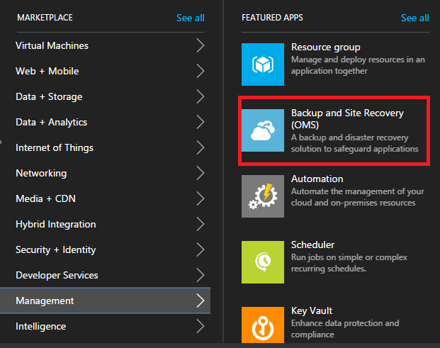
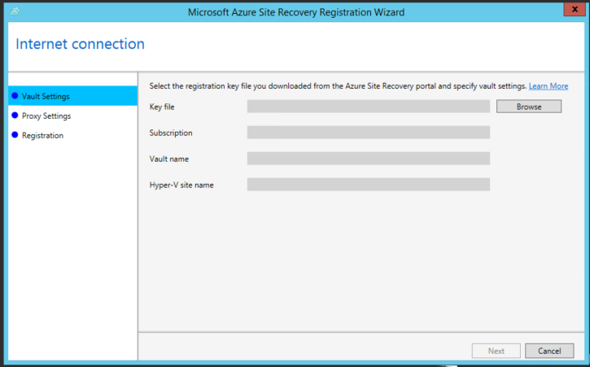
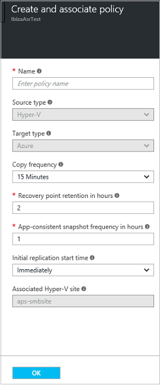
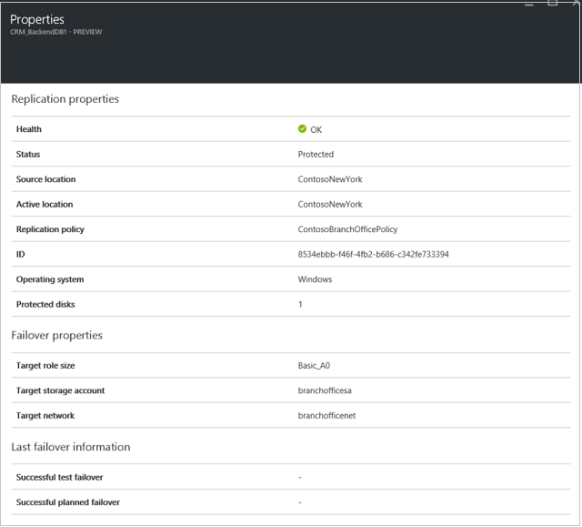
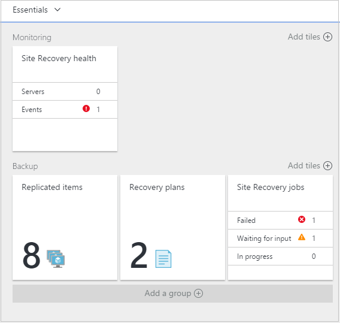

<properties
    pageTitle="将 Hyper-V VM 复制到 Azure  | Azure"
    description="说明如何通过协调将本地 Hyper-V VM 复制、故障转移和恢复到 Azure"
    services="site-recovery"
    documentationcenter=""
    author="rayne-wiselman"
    manager="jwhit"
    editor="" />
<tags
    ms.assetid="1777e0eb-accb-42b5-a747-11272e131a52"
    ms.service="site-recovery"
    ms.devlang="na"
    ms.topic="article"
    ms.tgt_pltfrm="na"
    ms.workload="storage-backup-recovery"
    ms.date="03/05/2017"
    wacn.date="03/31/2017"
    ms.author="raynew" />

# 结合使用 Azure Site Recovery 和 Azure 门户将 Hyper-V 虚拟机（不带 VMM）复制到 Azure

> [AZURE.SELECTOR]
- [Azure 门户](/documentation/articles/site-recovery-hyper-v-site-to-azure/)
- [Azure 经典](/documentation/articles/site-recovery-hyper-v-site-to-azure-classic/)
- [PowerShell - Resource Manager](/documentation/articles/site-recovery-deploy-with-powershell-resource-manager/)

本文介绍如何在 Azure 门户预览中使用 [Azure Site Recovery](/documentation/articles/site-recovery-overview/) 将本地 Hyper-V 虚拟机复制到 Azure。

可以将 Hyper-V VM 复制到 Azure 存储，将 VM 故障转移到 Azure（如果主站点不可用）。可以访问 Azure 中的工作负荷，并在本地恢复正常运行时故障回复到本地。也可根据本文的说明将 VM 迁移到 Azure。在迁移方案中，你需要复制并故障转移 VM，但不需要再次对其执行故障回复操作。

## 方案体系结构
方案组件如下：

- **Hyper-V 主机或群集**：本地 Hyper-V 主机服务器或群集。在 Site Recovery 部署期间，运行所要保护的 VM 的 Hyper-V 主机将聚集到逻辑 Hyper-V 站点中。
- **Azure Site Recovery 提供程序和恢复服务代理**：部署期间在 Hyper-V 主机服务器上安装 Azure Site Recovery 提供程序和 Azure 恢复服务代理。提供程序通过 HTTPS 443 与 Azure Site Recovery 通信，以复制协调过程。默认情况下，Hyper-V 主机服务器上的代理通过 HTTPS 443 将数据复制到 Azure 存储。
- **Azure**：需要 Azure 订阅、Azure 存储帐户来存储复制的数据，并需要 Azure 虚拟网络，使 Azure VM 能够在故障转移后连接到网络。

## Azure 先决条件

**先决条件** | **详细信息**
--- | ---
**Azure 帐户**| [Azure](http://azure.cn/) 帐户。你可以从[试用版](/pricing/1rmb-trial/)开始。[详细了解](/pricing/details/site-recovery/) Site Recovery 定价。 
**Azure 存储** | 标准存储帐户。可以使用 LRS 或 GRS 存储帐户。建议使用 GRS，以便在发生区域性故障或无法恢复主要区域时，能够复原数据。[了解详细信息](/documentation/articles/storage-redundancy/)。该帐户必须位于与恢复服务保管库相同的区域中。   不支持高级存储。   复制的数据存储在 Azure 存储空间，Azure VM 在发生故障转移时创建。   [详细了解](/documentation/articles/storage-introduction/) Azure 存储空间。
**Azure 网络** | 你需要一个 Azure 虚拟网络，以便发生故障转移时 Azure VM 能够连接到其中。Azure 虚拟网络必须位于与恢复服务保管库相同的区域中。 

## 本地先决条件

下面是本地部署所需做好的准备。

| **先决条件** | **详细信息** |
| --- | --- |
| **Hyper-V** |一台或多台本地服务器，运行已启用最新更新和 Hyper-V 角色的 **Windows Server 2012 R2**，或者运行 **Microsoft Hyper-V Server 2012 R2**。  Hyper-V 服务器应包含一个或多个虚拟机。  Hyper-V 服务器应直接或通过代理连接到 Internet。  Hyper-V 服务器应安装 [KB2961977](https://support.microsoft.com/zh-cn/kb/2961977 "KB2961977") 中提到的修补程序。 |
| **提供程序和代理** |在 Azure Site Recovery 部署期间，将安装 Azure Site Recovery 提供程序。安装提供程序还将在运行所要保护的虚拟机的每台 Hyper-V 服务器上安装 Azure 恢复服务代理。Site Recovery 保管库中的所有 Hyper-V 服务器都应当具有相同版本的提供程序和代理。  提供程序需要通过 Internet 连接到 Azure Site Recovery。流量可以直接发送或通过代理发送。请注意，不支持基于 HTTPS 的代理。代理服务器应该允许访问：   ``*.accesscontrol.chinacloudapi.cn``   ``*.backup.windowsazure.cn``   ``*.hypervrecoverymanager.windowsazure.cn``    ``*store.core.chinacloudapi.cn``   ``*.blob.core.chinacloudapi.cn``   ``https://www.msftncsi.com/ncsi.txt``   ``time.windows.cn``   ``time.nist.gov``   如果在服务器上设置了基于 IP 地址的防火墙规则，请确保这些规则允许与 Azure 通信。   允许 [Azure 数据中心 IP 范围](https://www.microsoft.com/download/confirmation.aspx?id=41653)和 HTTPS (443) 端口。 |

## 虚拟机先决条件
**先决条件** | **详细信息**
--- | ---
**受保护的 VM** | 在故障转移 VM 之前，需确保要分配到 Azure VM 的名称符合 [Azure 先决条件](/documentation/articles/site-recovery-support-matrix-to-azure/#failed-over-azure-vm-requirements)。可以在启用 VM 的复制后修改此名称。   受保护计算机上单个磁盘的容量不应超过 1023 GB。一台 VM 最多可以有 64 个磁盘（因此最大容量为 64 TB）。   不支持共享的磁盘来宾群集。   如果源 VM 有 NIC 组合，它在故障转移到 Azure 之后将转换成单个 NIC。  不保护带静态 IP 地址且运行 Linux 的 VM。

## 准备部署
若要准备部署，需要：

1. [设置 Azure 网络](#set-up-an-azure-network)，Azure VM 在故障转移后，将在该网络中创建。
2. 针对复制的数据[设置 Azure 存储帐户](#set-up-an-azure-storage-account)。
3. [准备 Hyper-V 主机](#prepare-the-hyper-v-hosts)，确保它们可以访问所需的 URL。

### 设置 Azure 网络

设置 Azure 网络。需要一个 Azure 网络，以便在故障转移后创建的 Azure VM 连接到网络。

- 此网络应与将部署恢复服务保管库的网络位于同一区域。
- 根据要用于故障转移 Azure VM 的资源模型，需在 [Resource Manager 模式](/documentation/articles/virtual-networks-create-vnet-arm-pportal/)或[经典模式](/documentation/articles/virtual-networks-create-vnet-classic-pportal/)下设置 Azure 网络。
- 建议在开始之前先设置网络。否则，需要在 Site Recovery 部署期间执行此操作。

> [AZURE.NOTE] [Migration of networks](/documentation/articles/resource-group-move-resources/)用于部署 Site Recovery 的网络不支持跨同一订阅的不同资源组或者跨订阅的 。
### 设置 Azure 存储帐户

- 需要使用标准 Azure 存储帐户来保存复制到 Azure 的数据。
- 根据要用于故障转移 Azure VM 的资源模型，请在 [Resource Manager 模式](/documentation/articles/storage-create-storage-account/)或[经典模式](/documentation/articles/storage-create-storage-account-classic-portal/)下设置一个帐户。
- 建议在开始之前先设置存储帐户。否则，需要在 Site Recovery 部署期间执行此操作。这些帐户需位于与恢复服务保管库相同的区域中。
- 无法跨资源组移动 Site Recovery 所使用的存储帐户，不管是在同一订阅内，还是跨不同的订阅。

###准备 Hyper-V 主机

- 确保 Hyper-V 主机符合[先决条件](#on-premises-prerequisites)。

### 创建恢复服务保管库

1. 登录到 [Azure 门户](https://portal.azure.cn)。
2. 单击“新建”>“管理”>“备份和 Site Recovery (OMS)”。或者，可以单击“浏览”>“恢复服务保管库”>“添加”。

	

3. 在“名称”中，指定一个友好名称以标识该保管库。如果拥有多个订阅，请选择其中一个。
4. [创建新资源组](/documentation/articles/resource-group-template-deploy-portal/)或选择现有的资源组，并指定 Azure 区域。计算机将复制到此区域。若要查看受支持的区域，请参阅 [Azure Site Recovery 价格详细信息](/pricing/details/site-recovery/)中的“地域可用性”。
4. 如果要从仪表板快速访问保管库，请单击“固定到仪表板”，然后单击“创建保管库”。

	  

新保管库将显示在“仪表板”>“所有资源”中，以及“恢复服务保管库”主边栏选项卡上。

## 入门
Site Recovery 提供的“入门”体验可帮助你尽快完成部署。“快速启动”将检查先决条件，并引导你以正确的顺序完成 Site Recovery 部署步骤。

在“入门”中，选择要复制的计算机类型，以及要复制到的位置。设置本地服务器、Azure 存储帐户和网络。创建复制策略并执行容量计划。设置好基础结构之后，可以启用 VM 复制。可对特定计算机运行故障转移，或创建恢复计划以故障转移多个计算机。

选择部署 Site Recovery 的方式，以开始“快速启动”。根据复制要求，“快速启动”流程会稍有不同。

## 步骤 1：选择保护目标
选择要复制的内容以及要复制到的位置。

1. 在“恢复服务保管库”中，选择保管库。
2. 在“快速启动”中，单击“Site Recovery”>“步骤 1: 准备基础结构”>“保护目标”。

	  

3. 在“保护目标”中选择“到 Azure”，然后选择“是，使用 Hyper-V”。选择“否”，确认未使用 VMM。然后，单击“确定”。

	  

## 步骤 2：设置源环境

设置 Hyper-V 站点、在 Hyper-V 主机上安装 Azure Site Recovery 提供程序和 Azure 恢复服务代理，并在保管库中注册主机。

1. 单击“步骤 2: 准备基础结构”>“源”。若要添加新的 Hyper-V 站点作为 Hyper-V 主机或群集的容器，请单击“+Hyper-V 站点”。

	  

2. 在“创建 Hyper-V 站点”边栏选项卡中指定站点的名称。然后，单击“确定”。选择刚创建的站点。

	  

3. 单击“+Hyper-V 服务器”向站点添加服务器。
4. 在“添加服务器”>“服务器类型”中，确保显示“Hyper-V 服务器”。确保要添加的 Hyper-V 服务器符合[先决条件](#on-premises-prerequisites)并且能够访问指定的 URL。
5. 下载 Azure Site Recovery 提供程序安装文件。你将运行此文件，以在每台 Hyper-V 主机上安装提供程序和恢复服务代理。
6. 下载注册密钥。运行安装程序时需要用到此密钥。生成的密钥有效期为 5 天。

      

7. 在添加到 Hyper-V 站点的每台主机上运行提供程序安装文件。如果要在 Hyper-V 群集上进行安装，则在每个群集节点上运行安装程序。通过安装并注册每个 Hyper-V 群集节点，可确保虚拟机即使在节点之间迁移也会受到保护。

### 安装提供程序和代理

1. 运行提供程序安装文件。
2. 在“Microsoft 更新”中，可以选择进行更新，以便根据 Microsoft 更新策略安装提供程序更新。
3. 在“安装”中接受或修改默认提供程序安装位置，然后单击“安装”。
4. 在“保管库设置”页上，单击“浏览”以选择所下载的保管库密钥文件。指定 Azure Site Recovery 订阅、保管库名称和 Hyper-V 服务器所属的 Hyper-V 站点。

	  

5\. 在“代理设置”中，指定将安装在服务器上的提供程序如何通过 Internet 连接到 Azure Site Recovery。

	* 如果希望提供程序直接进行连接，请选择“不使用代理直接连接”。
	* 如果希望使用当前已在服务器上设置的代理进行连接，请选择“使用现有代理设置进行连接”。
	* 如果现有代理要求身份验证，或者你希望使用自定义代理进行提供程序连接，请选择“使用自定义代理设置进行连接”。 
	* 如果使用自定义代理，则需指定地址、端口和凭据
	* 如果使用代理，请确保允许通过该代理访问[先决条件](#on-premises-prerequisites)中所述的 URL。

	  

6\. 安装完成后，单击“注册”，在保管库中注册服务器。

7. 完成注册后，Azure Site Recovery 将检索 Hyper-V 服务器中的元数据，该服务器将显示在“Site Recovery 基础结构”>“Hyper-V 主机”边栏选项卡上。

### 命令行安装

也可使用以下命令行安装 Azure Site Recovery 提供程序和代理。此方法可用来将提供程序安装在 Server Core for Windows Server 2012 R2 上。

1. 将提供程序安装文件和注册密钥下载到某个文件夹中。例如 C:\\ASR。
2. 从提升的命令提示符处，运行以下命令提取提供程序安装程序：

	    	C:\Windows\System32> CD C:\ASR
	    	C:\ASR> AzureSiteRecoveryProvider.exe /x:. /q
3. 运行此命令安装组件：

			C:\ASR> setupdr.exe /i
4. 然后运行以下命令在保管库中注册服务器：

            CD C:\Program Files\Microsoft Azure Site Recovery Provider\
            C:\Program Files\Microsoft Azure Site Recovery Provider> DRConfigurator.exe /r  /Friendlyname <friendly name of the server> /Credentials <path of the credentials file>

  
其中：

* **/Credentials**：用于指定注册密钥文件所在位置的必需参数
* **/FriendlyName**：在 Azure Site Recovery 门户中显示的 Hyper-V 主机服务器名称的必需参数。
* **/proxyAddress**：可选参数，用于指定代理服务器的地址。
* **/proxyport**：可选参数，用于指定代理服务器的端口。
* **/proxyUsername**：可选参数，用于指定代理服务器用户名（如果代理服务器要求身份验证）。
* **/proxyPassword**：可选参数，用于指定密码，以便通过代理服务器进行身份验证（如果代理服务器要求身份验证）。

## 步骤 3：设置目标环境

指定要用于复制的 Azure 存储帐户，以及 Azure VM 在故障转移后连接到的 Azure 网络。

1. 单击“准备基础结构”>“目标”> 选择订阅和资源组，以便在其中创建故障转移的虚拟机。为故障转移的虚拟机选择要在 Azure 中使用的部署模型（经典或资源管理）。

3. Site Recovery 将检查是否有一个或多个兼容的 Azure 存储帐户和网络。

  	  

4. 如果尚未创建存储帐户并想使用 Resource Manager 创建一个，请单击“+存储帐户”以内联方式执行该操作。在“创建存储帐户”边栏选项卡中，指定帐户名、类型、订阅和位置。该帐户应位于与恢复服务保管库相同的位置。

  	  

	如果想要使用经典模型创建存储帐户，请[在 Azure 门户中](/documentation/articles/storage-create-storage-account-classic-portal/)执行该操作。
	
如果尚未创建 Azure 网络并想使用 Resource Manager 创建一个，请单击“+网络”以内联方式执行该操作。在“创建虚拟网络”边栏选项卡上，指定网络名称、地址范围、子网详细信息、订阅和位置。该网络应位于与恢复服务保管库相同的位置。

	  

	如果想要使用经典模型创建网络，请[在 Azure 门户中](/documentation/articles/virtual-networks-create-vnet-classic-pportal/)执行该操作。
	

## 步骤 4：设置复制设置

1. 若要创建新的复制策略，请单击“准备基础结构”>“复制设置”>“+创建和关联”。

	

2. 在“创建和关联策略”中指定策略名称。
3. 在“复制频率”中，指定要在初始复制后复制增量数据的频率（每隔 30 秒、5 或 15 分钟）。
4. 在“恢复点保留期”中，针对每个恢复点指定保留期的时长（以小时为单位）。受保护的计算机可以恢复到某个时段内的任意时间点。
5. 在“应用一致性快照频率”中，指定创建包含应用程序一致性快照的恢复点的频率（1-12 小时）。Hyper-V 使用两种类型的快照 — 标准快照，它提供整个虚拟机的增量快照；应用程序一致性快照，它生成虚拟机内的应用程序数据的时间点快照。与应用程序一致的快照使用卷影复制服务 (VSS) 来确保应用程序在拍摄快照时处于一致状态。请注意，如果你启用了与应用程序一致的快照，它将影响在源虚拟机上运行的应用程序的性能。请确保你设置的值小于你配置的额外恢复点的数目。
6. 在“初始复制开始时间”中，指定开始初始复制的时间。复制通过 Internet 带宽进行，因此你可能需要将它安排在非繁忙时间。然后，单击“确定”。

	  

当创建新策略时，该策略自动与 Hyper-V 站点关联。单击“确定”。可以在“复制”> 策略名称 >“关联 Hyper-V 站点”中，将一个 Hyper-V 站点（以及其中的 VM）与多个复制策略关联。

## 步骤 5：容量规划
你已经设置了基本基础结构，现在可以考虑容量计划并确定是否需要额外的资源。

Site Recovery 提供 Capacity Planner，帮助你为源环境、站点恢复组件、网络和存储分配适当的资源。可以在快速模式下运行 Planner，以便根据 VM、磁盘和存储的平均数量进行估计；或者在详细模式下运行 Planner，以输入工作负荷级别的数据。开始之前，需要满足以下条件：

* 收集有关复制环境的信息，包括 VM 数、每个 VM 的磁盘数和每个磁盘的存储。
* 估计复制数据的每日更改（变动）率。可以使用 [Hyper-V 副本 Capacity Planner](https://www.microsoft.com/download/details.aspx?id=39057) 来帮助执行此操作。

1.	单击“下载”以下载该工具，然后开始运行。[阅读](/documentation/articles/site-recovery-capacity-planner/)该工具随附的文章。
2.	完成后，请在“是否已运行 Capacity Planner?”中选择“是”。

	  

### 网络带宽注意事项

可以使用 Capacity Planner 工具计算复制（初始复制，然后是增量复制）所需的带宽。若要控制复制所用的带宽量，可以使用几个选项：

* **限制带宽**：复制到 Azure 的 Hyper-V 流量经过特定的 Hyper-V 主机。可以在主机服务器上限制带宽。
* **调整带宽**：可以使用几个注册表项来控制用于复制的带宽。

#### 限制带宽
1. 在 Hyper-V 主机服务器上打开 Azure 备份 MMC 管理单元。默认情况下，Azure 备份的快捷方式位于桌面上或 C:\\Program Files\\Microsoft Azure Recovery Services Agent\\bin\\wabadmin 中。
2. 在管理单元中，单击“更改属性”。
3. 在“限制”选项卡上，选择“为备份操作启用 Internet 带宽使用限制”，然后设置工作时间和非工作时间的限制。有效范围为每秒 512 Kbps 到 102 Mbps。

	

也可以使用 [Set-OBMachineSetting](https://technet.microsoft.com/zh-cn/library/hh770409.aspx) cmdlet 来设置限制。下面是一个示例：

    $mon = [System.DayOfWeek]::Monday 
    $tue = [System.DayOfWeek]::Tuesday
    Set-OBMachineSetting -WorkDay $mon, $tue -StartWorkHour "9:00:00" -EndWorkHour "18:00:00" -WorkHourBandwidth  (512*1024) -NonWorkHourBandwidth (2048*1024)

**Set-OBMachineSetting -NoThrottle** 表示不需要限制。

#### 影响网络带宽
1. 在注册表中导航到 **HKEY\_LOCAL\_MACHINE\\SOFTWARE\\Microsoft\\Microsofte Azure Backup\\Replication**。
   * 若要影响复制磁盘上的带宽流量，请修改 **UploadThreadsPerVM** 值，或者创建该项（如果不存在）。
   * 若要影响用于从 Azure 故障回复流量的带宽，请修改 **DownloadThreadsPerVM** 值。
2. 默认值为 4。在“过度预配型”网络中，这些注册表项需要更改，不能使用默认值。最大值为 32。监视流量以优化值。

## 步骤 6：启用复制
现在，请按如下所述启用复制：

1. 单击“步骤 2: 复制应用程序”>“源”。首次启用复制后，请在保管库中单击“+复制”，对其他计算机启用复制。

      

2. 在“源”边栏选项卡中选择 Hyper-V 站点。然后，单击“确定”。
3. 在“目标”中，选择保管库订阅，以及故障转移后要在 Azure 中使用的故障转移模型（经典或资源管理）。
4. 选择要使用的存储帐户。如果要使用与现有存储帐户不同的存储帐户，可以[创建一个](#set-up-an-azure-storage-account)。若要使用 Resource Manager 模型创建存储帐户，请单击“新建”。如果想要使用经典模型创建存储帐户，请[在 Azure 门户中](/documentation/articles/storage-create-storage-account-classic-portal/)执行该操作。然后，单击“确定”。
5.  选择 Azure VM 在故障转移后启动时所要连接的 Azure 网络和子网。选择“立即为选定的计算机配置”，将网络设置应用到选择保护的所有计算机。选择“稍后配置”以选择每个计算机的 Azure 网络。如果要使用与现有不同的网络，可以[创建一个](#set-up-an-azure-network)。若要使用 Resource Manager 模型创建网络，请单击“新建”。若要使用经典模型创建网络，请[在 Azure 门户中](/documentation/articles/virtual-networks-create-vnet-classic-pportal/)执行此操作。选择适用的子网。然后，单击“确定”。

	  

6. 在“虚拟机”>“选择虚拟机”中，单击并选择要复制的每个计算机。只能选择可以启用复制的计算机。然后，单击“确定”。

      

7. 在“属性”>“配置属性”中，选择所选 VM 的操作系统和 OS 磁盘。默认选择 VM 的所有磁盘进行复制。可能需要从复制中排除磁盘，避免将不需要的数据复制到 Azure，从而减少带宽消耗。例如，可能不需要复制包含临时数据的磁盘，或者在重新启动计算机或应用程序时会刷新数据（例如 pagefile.sys 或 Microsoft SQL Server tempdb）的磁盘。取消选中磁盘即可将磁盘从复制中排除。验证 Azure VM 名称（目标名称）是否符合 [Azure 虚拟机要求](/documentation/articles/site-recovery-support-matrix-to-azure/#failed-over-azure-vm-requirements)并根据需要对其进行修改。然后，单击“确定”。可以稍后再设置其他属性。

 	  

	 > [AZURE.NOTE]
	 >
	 > * 只能从复制中排除基本磁盘。不能排除 OS 磁盘，并且不建议排除动态磁盘。Site Recovery 无法在来宾 VM 内识别 VHD 磁盘是基本磁盘还是动态磁盘。如果未排除所有相关动态卷磁盘，则受保护的动态磁盘会在故障转移 VM 时显示为故障磁盘，且无法访问该磁盘上的数据。
	> * 启用复制后，无法添加或删除要复制的磁盘。如果想要添加或排除磁盘，需要禁用 VM 保护，然后重新启用保护。
	> * 如果某个应用程序需要有排除的磁盘才能正常运行，则故障转移到 Azure 之后，需要在 Azure 中手动创建该磁盘，以便复制的应用程序可以运行。也可将 Azure
	> * 自动化集成到恢复计划中，以便在故障转移计算机期间创建磁盘。
	> * 在 Azure 中手动创建的磁盘不会执行故障回复。例如，如果直接在 Azure VM 中故障转移三个磁盘并创建两个，则只会将进行过故障转移的三个磁盘从 Azure 故障回复到 Hyper-V。不能包括在故障回复过程中或从 Hyper-V 到 Azure 的反向复制过程中手动创建的磁盘。
	>
	>   	

8. 在“复制设置”>“配置复制设置”中，选择要应用于受保护 VM 的复制策略。然后，单击“确定”。可以在“复制策略”> 策略名称 >“编辑设置”中修改复制策略。应用的更改将用于已在复制的计算机和新计算机。

	  

可以在“作业”>“Site Recovery 作业”中，跟踪“启用保护”作业的进度。在“完成保护”作业运行之后，计算机就可以进行故障转移了。

### 查看和管理 VM 属性

建议你验证源计算机的属性。

1. 在“受保护的项”中，单击“复制的项”，然后选择计算机。

	  

2. 在“属性”中，可以查看 VM 的复制和故障转移信息。

	

3. 在“计算和网络”>“计算属性”中，可以指定 Azure VM 名称和目标大小。根据需要修改名称，使其符合 Azure 要求。你还可以查看和修改目标网络、子网，以及要分配到 Azure VM 的 IP 地址的相关信息。注意以下事项：

   * 可以设置目标 IP 地址。如果未提供地址，故障转移的计算机将使用 DHCP。如果设置了无法用于故障转移的地址，故障转移将会失败。如果地址可用于测试故障转移网络，则同一个目标 IP 地址可用于测试故障转移。
   * 网络适配器数目根据你为目标虚拟机指定的大小来确定，如下所述：

     * 如果源计算机上的网络适配器数小于或等于目标计算机大小允许的适配器数，则目标的适配器数将与源相同。
     * 如果源虚拟机的适配器数大于目标大小允许的数目，则使用目标大小允许的最大数目。
     * 例如，如果源计算机有两个网络适配器，而目标计算机大小支持四个，则目标计算机将有两个适配器。如果源计算机有两个适配器，但支持的目标大小只支持一个，则目标计算机只有一个适配器。
     * 如果 VM 有多个网络适配器，它们将全部连接到同一个网络。
     * 如果虚拟机有多个网络适配器，列表中显示的第一个适配器将成为 Azure 虚拟机中的*默认*网络适配器。

	

4. 在“磁盘”中，可以看到 VM 上将要复制的操作系统和数据磁盘。

### 准备在故障转移后连接到 Azure VM
如果想要在故障转移后使用 RDP 连接到 Azure VM，请确保执行以下操作：

**故障转移之前在本地计算机上**：

- 对通过 Internet 进行的访问启用 RDP，确保已针对“公共”添加 TCP 和 UDP 规则，并确保在“Windows 防火墙”->“允许的应用和功能”中针对所有配置文件允许 RDP。
- 针对通过站点到站点连接进行的访问，在计算机上启用 RDP，并确保在“Windows 防火墙”->“允许的应用和功能”中针对“域”和“专用”网络允许 RDP。
- 在本地计算机上安装 [Azure VM 代理](http://go.microsoft.com/fwlink/?LinkID=394789&clcid=0x409)。
- 确保操作系统的 SAN 策略已设置为 OnlineAll。[了解详细信息](https://support.microsoft.com/kb/3031135)
- 在运行故障转移之前关闭 IPSec 服务。

**故障转移之后在 Azure VM 上**：

- 将公共 IP 地址添加到与 Azure VM 关联的 NIC，以允许使用 RDP。
- 确保没有任何域策略阻止你使用公共地址连接到虚拟机。
- 尝试连接。如果无法连接，请检查 VM 是否正在运行。有关更多故障排除提示，请阅读[此文](http://social.technet.microsoft.com/wiki/contents/articles/31666.troubleshooting-remote-desktop-connection-after-failover-using-asr.aspx)。

如果要在故障转移后使用安全外壳客户端 (ssh) 访问运行 Linux 的 Azure VM，请执行以下操作：

**故障转移之前在本地计算机上**：

- 确保 Azure VM 上的安全外壳服务已设置为在系统引导时自动启动。
- 确保防火墙规则允许 SSH 连接。

**故障转移之后在 Azure VM 上**：

- 已故障转移的 VM 及其连接到的 Azure 子网上的网络安全组规则需要允许与 SSH 端口建立传入连接。
- 应创建公共终结点，以允许 SSH 端口（默认为 TCP 端口 22）上的传入连接。
- 如果通过 VPN 连接（Express Route 或站点到站点 VPN）访问 VM，则可以使用客户端通过 SSH 直接连接到 VM。

## 步骤 7：运行测试故障转移
为了对部署进行测试，你可以针对单个虚拟机或单个恢复计划（其中包含一个或多个虚拟机）运行测试故障转移。

1. 若要故障转移单个计算机，请在“复制的项”中，单击“VM”>“+测试性故障转移”图标。
2. 若要故障转移某个恢复计划，请在“恢复计划”中，右键单击该计划 >“测试故障转移”。若要创建恢复计划，请[遵循这些说明](/documentation/articles/site-recovery-create-recovery-plans/)。
3. 在“测试性故障转移”中，选择 Azure VM 在故障转移之后要连接到的 Azure 网络。
4. 单击“确定”开始故障转移。若要跟踪进度，可以单击 VM 以打开其属性，或者在保管库名称 >“作业”>“Site Recovery 作业”中选择“测试性故障转移”作业。
5. 故障转移完成后，还应该能够看到副本 Azure 计算机显示在 Azure 门户的“虚拟机”中。应确保 VM 的大小适当、已连接到相应的网络，并且正在运行。
6. 如果[已准备好故障转移后的连接](#prepare-to-connect-to-azure-vms-after-failover)，应该能够连接到 Azure VM。
7. 完成后，单击恢复计划中的“清理测试故障转移”。在“说明”中，记录并保存与测试故障转移相关联的任何观测结果。这会删除测试故障转移期间创建的虚拟机。

有关详细信息，请参阅[到 Azure 的测试故障转移](/documentation/articles/site-recovery-test-failover-to-azure/)文档。

## 故障转移

完成你的计算机的初始复制后，可以根据需要调用故障转移。Site Recovery 支持各种类型的故障转移 - 测试故障转移、计划的故障转移和非计划的故障转移。[详细了解](/documentation/articles/site-recovery-failover/)不同类型的故障转移，以及有关何时和如何执行其中每种故障转移的详细说明。

> [AZURE.NOTE] 如果目的是将虚拟机迁移到 Azure，我们强烈建议使用[计划的故障转移操作](/documentation/articles/site-recovery-failover/)，将虚拟机迁移到 Azure。使用测试故障转移在 Azure 中验证已迁移的应用程序后，请使用[完成迁移](#Complete-migration-of-your-virtual-machines-to-Azure)中所述的步骤完成虚拟机迁移。不需要执行提交或删除。“完成迁移”可以完成迁移、去除对虚拟机的保护，并使虚拟机不再产生 Azure Site Recovery 费用。

### 运行计划的故障转移
应该根据法规遵从要求或者在计划的维护期间选择此方案，在出现已知的服务中断（例如预期的断电或者恶劣天气）时故障转移数据。本过程描述如何对恢复计划运行计划的故障转移。或者，也可以在“虚拟机”选项卡上对单个虚拟机运行故障转移。在开始之前，请确保要故障转移的所有虚拟机已完成初始复制。

1. 选择“恢复计划”>“recoveryplan\_name”。
2. 在“恢复计划”边栏选项卡中，单击“计划的故障转移”。
3. 在“确认计划的故障转移”页上，选择源和目标位置。
4. 当计划的故障转移开始时，第一步是关闭虚拟机以确保不会丢失数据。你可以在“作业”选项卡上跟踪故障转移进度。如果在故障转移中发生了错误（在虚拟机上或在恢复计划所包含的脚本中），则恢复计划的计划故障转移将停止。可以再次启动故障转移。
6. 副本虚拟机在创建后处于待提交状态。单击“提交”以提交故障转移。
7. 复制完成后，虚拟机将在辅助位置启动。

### 运行非计划的故障转移
由于意外事件（如断电或病毒攻击）而导致主站点不可访问时，应选择此操作。本过程描述如何对恢复计划运行“非计划的故障转移”。或者，也可以在“虚拟机”选项卡上对单个虚拟机运行故障转移。在开始之前，请确保要故障转移的所有虚拟机已完成初始复制。

1. 选择“恢复计划”>“recoveryplan\_name”。
2. 在“恢复计划”边栏选项卡中，单击“计划的故障转移”。
3. 在“非计划的故障转移”页上，选择源和目标位置。
4. 选择“关闭虚拟机并同步最新数据”，指定 Azure Site Recovery 应尝试关闭受保护的虚拟机并同步数据，以便对最新版的数据进行故障转移。
5. 故障转移后，虚拟机处于待提交状态。单击“提交”以提交故障转移。
  
[了解详细信息](/documentation/articles/site-recovery-failover/#run-an-unplanned-failover)

## 完成虚拟机到 Azure 的迁移

>[AZURE.NOTE] 以下步骤仅适用于将虚拟机迁移到 Azure

1. 按[此处](/documentation/articles/site-recovery-failover/)所述执行计划的故障转移
2. 在“复制的项”中，右键单击虚拟机并选择“完成迁移”

      

3. 单击“确定”完成迁移。若要跟踪进度，可以单击 VM 打开其属性，或者在“Site Recovery 作业”中使用“完成迁移”作业。

## 监视部署
下面是监视 Site Recovery 部署的配置设置、状态和运行状况的方式：

1. 单击保管库名称以访问“概要”仪表板。在此仪表板中，可以看到 Site Recovery 作业、复制状态、恢复计划、服务器运行状况和事件。可以自定义“概要”以显示最有用的磁贴和布局，包括其他 Site Recovery 和备份保管库的状态。

      

2. 在“运行状况”磁贴中，可以监视发生问题的站点服务器，以及 Site Recovery 在过去 24 小时内引发的事件。
3. 可以在“复制的项”、“恢复计划”和“Site Recovery 作业”磁贴中管理和监视复制。可通过“作业”>“Site Recovery 作业”钻取到不同的作业以获取更多详细信息。

<!---HONumber=Mooncake_0327_2017-->
<!--Update_Description: wording update-->