<properties
    pageTitle="使用软件部署工具为 Azure Site Recovery 自动安装移动服务 | Azure."
    description="本文帮助用户使用 System Center Configuration Manager 等软件部署工具自动安装移动服务"
    services="site-recovery"
    documentationcenter=""
    author="AnoopVasudavan"
    manager="gauravd"
    editor="" />
<tags
    ms.service="site-recovery"
    ms.workload="backup-recovery"
    ms.tgt_pltfrm="na"
    ms.devlang="na"
    ms.topic="article"
    ms.date="1/10/2017"
    wacn.date="02/10/2017"
    ms.author="anoopkv" />  

# 使用软件部署工具自动安装移动服务

本文举例说明如何使用 System Center Configuration Manager (SCCM) 在数据中心部署 Azure Site Recovery 移动服务。使用 SCCM 等软件部署工具可带来以下优势
* 计划在软件更新的计划维护时段内进行部署（全新安装和升级）。
* 同时大规模部署到数百台服务器

> [AZURE.NOTE]
本文使用 System Center Configuration Manager 2012 R2 来演示部署活动。也可以使用 [Azure 自动化和 Desired State Configuration](/documentation/articles/site-recovery-automate-mobility-service-install/) 自动安装移动服务。

## 先决条件
1. 已在环境中部署 System Center Configuration Manager(SCCM) 等软件部署工具。
  * 创建两个[设备集合](https://technet.microsoft.com/zh-cn/library/gg682169.aspx)，分别用于想要通过 Azure Site Recovery 保护的所有 **Windows Server** 和所有 **Linux Server**。
3. 已将一台配置服务器注册到 Azure Site Recovery。
4. 提供 SCCM 服务器可访问的安全网络文件共享（SMB 共享）。

## 在运行 Microsoft Windows 操作系统的计算机上部署移动服务
> [AZURE.NOTE]
本文的假设条件如下
> 1. 配置服务器的 IP 地址为 192.168.3.121
> 2. 安全网络文件共享为 \\\ContosoSecureFS\\MobilityServiceInstallers

### 步骤 1：准备部署
1. 在网络共享中创建一个文件夹并将其命名为 **MobSvcWindows**
2. 登录到配置服务器，然后打开管理命令提示符
3. 运行以下命令生成通行短语文件。

    `cd %ProgramData%\ASR\home\svsystems\bin`  

    `genpassphrase.exe -v > MobSvc.passphrase`  

6. 将 MobSvc.passphrase 文件复制到网络共享中的 MobSvcWindows 文件夹。
5. 接下来，运行以下命令浏览到配置服务器上的安装程序存储库。

  `cd %ProgramData%\ASR\home\svsystems\puhsinstallsvc\repository`  

6. 将 **Microsoft ASR\_UA\_*版本*\_Windows\_GA\_*日期*\_Release.exe** 复制到网络共享中的 **MobSvcWindows** 文件夹。
7. 复制下面列出的代码，将它作为 **install.bat** 文件保存到 **MobSvcWindows** 文件夹
> [AZURE.NOTE]
请记得将以下脚本中的 [CSIP] 占位符替换为配置服务器 IP 地址的实际值。

  [AZURE.INCLUDE [site-recovery-sccm-windows-script](../../includes/site-recovery-sccm-windows-script.md)]

### 步骤 2：创建包

1. 登录到 System Center Configuration Manager 控制台
2. 浏览到“软件库”>“应用程序管理”>“包”
3. 右键单击“包”并选择“创建包”
4. 提供“名称”、“说明”、“制造商”、“语言”和“版本”的值。
5. 勾选“此包包含源文件”复选框。
6. 单击“浏览”按钮，然后选择安装程序所存储到的网络共享 (\\\ContosoSecureFS\\MobilityServiceInstaller\\MobSvcWindows)

    

7. 在“选择要创建的程序的类型”页上，选择“标准程序”，然后单击“下一步”

  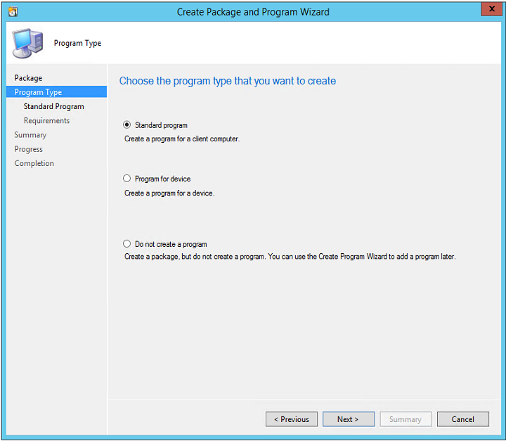  

8. 在“指定有关此标准程序的信息”页中提供以下输入，然后单击“下一步”。（其他输入可保留默认值）

  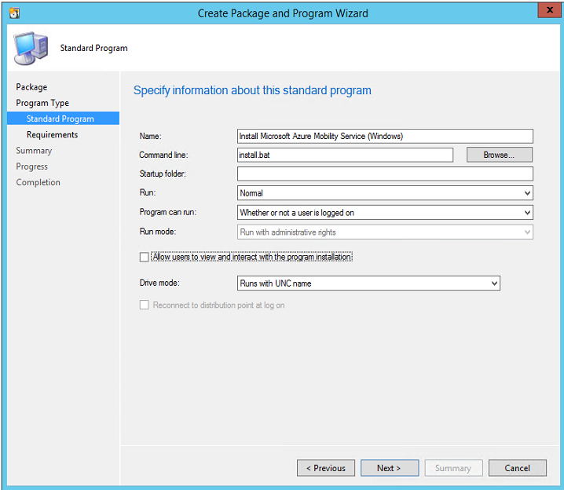  

| **参数名称** | **值** |
|--|--|
| 名称 | 安装 Azure 移动服务 (Windows) |
| 命令行 | install.bat |
| 程序可运行 | 用户是否已登录 |
9. 在下一页中，选择目标操作系统。只能在 Windows Server 2012 R2、Windows Server 2012、Windows Server 2008 R2 上安装移动服务。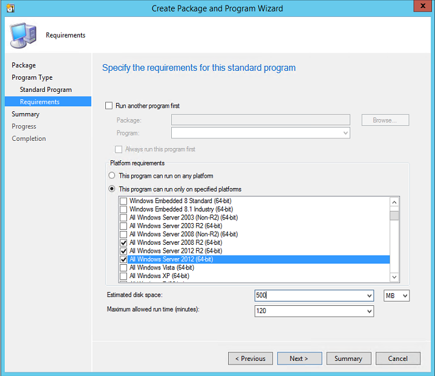
10. 单击“下一步”两次完成向导。
> [AZURE.NOTE]
脚本既支持全新安装移动服务代理安装，也支持升级/更新已安装的代理。

### 步骤 3：部署包
1. 在 SCCM 控制台中右键单击你的包，然后选择“分发内容”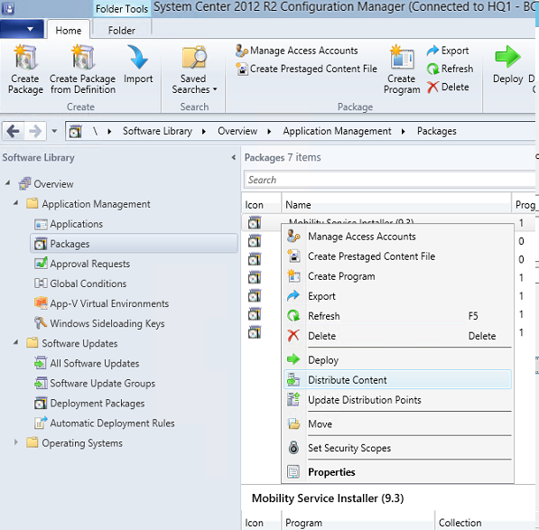
2. 选择该包应复制到的**[分发点](https://technet.microsoft.com/zh-cn/library/gg712321.aspx#BKMK_PlanForDistributionPoints)**。
3. 完成向导后，该包将开始复制到指定的分发点
4. 完成包的分发后，请右键单击该包，然后选择“部署”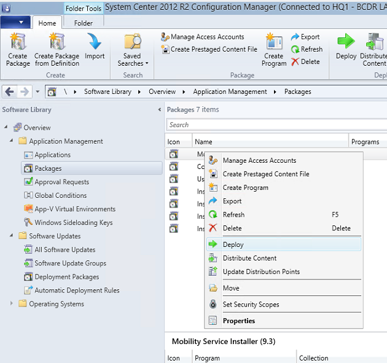
5. 选择在先决条件部分中创建的 Widows Server 设备集合作为部署的目标集合。

  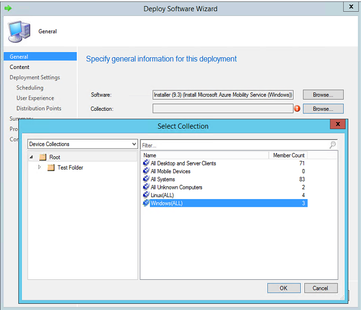  

6. 在“指定内容目标”页中，选择你的**分发点**
7. 在“指定用于控制此软件的部署方式的设置”页中，确保已根据需要选择了目的。

  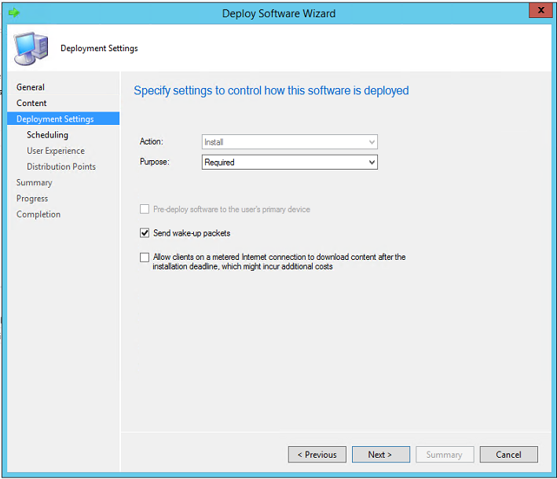  

8. 在“为此部署指定计划”中指定计划。阅读有关[计划包](https://technet.microsoft.com/zh-cn/library/gg682178.aspx)的详细信息
9. 在“分发点”页中根据数据中心的需要配置属性，然后完成向导。

> [AZURE.TIP]
为了避免不必要的重新启动，请计划在每月维护时段或软件更新时段运行包安装。

可以在 SCCM 控制台中转到“监视”>“部署”>“[你的包名称]”，来监视部署进度

## 在运行 Linux 操作系统的计算机上部署移动服务
> [AZURE.NOTE]
本文的假设条件如下
> 1. 配置服务器的 IP 地址为 192.168.3.121
> 2. 安全网络文件共享为 \\\ContosoSecureFS\\MobilityServiceInstallers

### 步骤 1：准备部署
1. 在网络共享中创建一个文件夹并将其命名为 **MobSvcLinux**
2. 登录到配置服务器，然后打开管理命令提示符
3. 运行以下命令生成通行短语文件。

    `cd %ProgramData%\ASR\home\svsystems\bin`  

    `genpassphrase.exe -v > MobSvc.passphrase`  

6. 将 MobSvc.passphrase 文件复制到网络共享中的 MobSvcWindows 文件夹。
5. 接下来，运行以下命令浏览到配置服务器上的安装程序存储库。

  `cd %ProgramData%\ASR\home\svsystems\puhsinstallsvc\repository`  

6. 将以下文件复制到网络共享中的 **MobSvcLinux** 文件夹
  * Microsoft-ASR\_UA\_*版本*\_OEL-64\_GA\_*日期*\_Release.tar.gz
  * Microsoft-ASR\_UA\_*版本*\_RHEL6-64\_GA\_*日期*\_Release.tar.gz
  * Microsoft-ASR\_UA\_*版本*\_RHEL7-64\_GA\_*日期*\_Release.tar.gz
  * Microsoft-ASR\_UA\_*版本*\_SLES11-SP3-64\_GA\_*日期*\_Release.tar.gz

7. 复制下面列出的代码，将它作为 **install\_linux.sh** 文件保存到 **MobSvcLinux** 文件夹
> [AZURE.NOTE]
请记得将以下脚本中的 [CSIP] 占位符替换为配置服务器 IP 地址的实际值。

  [AZURE.INCLUDE [site-recovery-sccm-linux-script](../../includes/site-recovery-sccm-linux-script.md)]

### 步骤 2：创建包

1. 登录到 System Center Configuration Manager 控制台
2. 浏览到“软件库”>“应用程序管理”>“包”
3. 右键单击“包”并选择“创建包”
4. 提供“名称”、“说明”、“制造商”、“语言”和“版本”的值。
5. 勾选“此包包含源文件”复选框。
6. 单击“浏览”按钮，然后选择安装程序所存储到的网络共享 (\\\ContosoSecureFS\\MobilityServiceInstaller\\MobSvcLinux)

  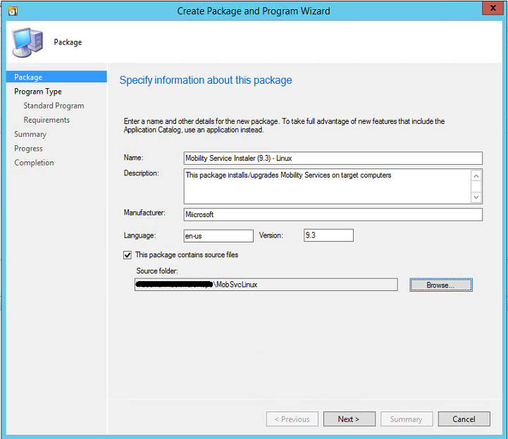  

7. 在“选择要创建的程序的类型”页上，选择“标准程序”，然后单击“下一步”

    

8. 在“指定有关此标准程序的信息”页中提供以下输入，然后单击“下一步”。（其他输入可保留默认值）

  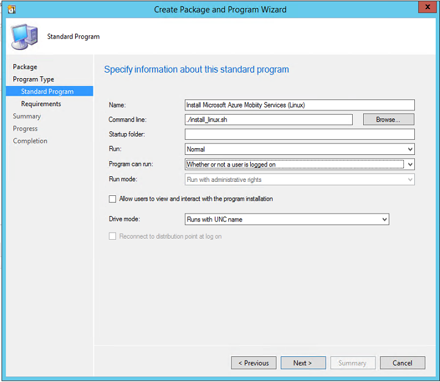  

| **参数名称** | **值** |
|--|--|
| 名称 | 安装 Azure 移动服务 (Linux) |
| 命令行 | ./install\_linux.sh |
| 程序可运行 | 用户是否已登录 |

9. 在下一页中，选择“此程序可在任何平台上运行”
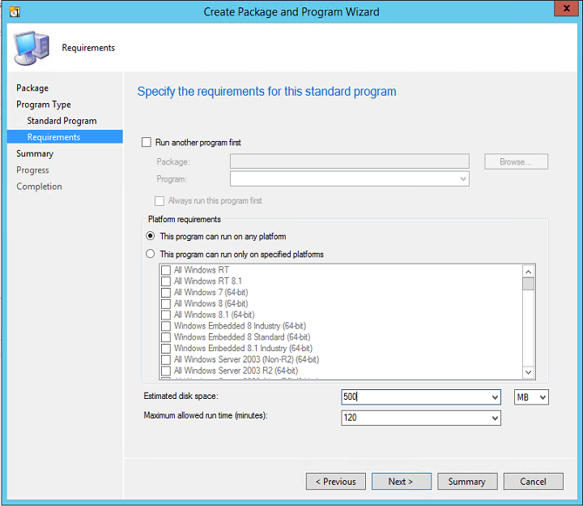

10. 单击“下一步”两次完成向导。
> [AZURE.NOTE]
脚本既支持全新安装移动服务代理安装，也支持升级/更新已安装的代理。

### 步骤 3：部署包
1. 在 SCCM 控制台中右键单击你的包，然后选择“分发内容”

2. 选择该包应复制到的**[分发点](https://technet.microsoft.com/zh-cn/library/gg712321.aspx#BKMK_PlanForDistributionPoints)**。
3. 完成向导后，该包将开始复制到指定的分发点。
4. 完成包的分发后，请右键单击该包，然后选择“部署”

5. 选择在先决条件部分中创建的 Linux Server 设备集合作为部署的目标集合。

  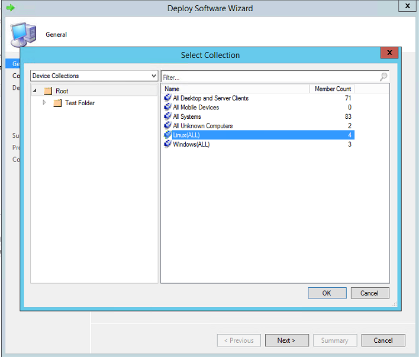  

6. 在“指定内容目标”页中，选择你的**分发点**
7. 在“指定用于控制此软件的部署方式的设置”页中，确保已根据需要选择了目的。

    

8. 在“为此部署指定计划”中指定计划。阅读有关[计划包](https://technet.microsoft.com/zh-cn/library/gg682178.aspx)的详细信息
9. 在“分发点”页中根据数据中心的需要配置属性，然后完成向导。

移动服务将根据配置的计划安装在 Linux Server 设备集合中。

## 移动服务的其他安装方法
请阅读有关移动服务的其他安装方法的详细信息。
* [使用 GUI 手动安装](/documentation/articles/site-recovery-vmware-to-azure/#install-the-mobility-service-manually)
* [使用命令行手动安装](/documentation/articles/site-recovery-vmware-to-azure/#install-mobility-service-on-a-windows-server-using-the-command-prompt)
* [使用配置服务器执行推送安装](/documentation/articles/site-recovery-vmware-to-azure/#install-the-mobility-service)
* [使用 Azure 自动化和 Desired State Configuration 自动安装](/documentation/articles/site-recovery-automate-mobility-service-install/)

## 后续步骤
现在，可为虚拟机[启用保护](/documentation/articles/site-recovery-vmware-to-azure#step-6-replicate-applications/)。

<!---HONumber=Mooncake_0206_2017-->