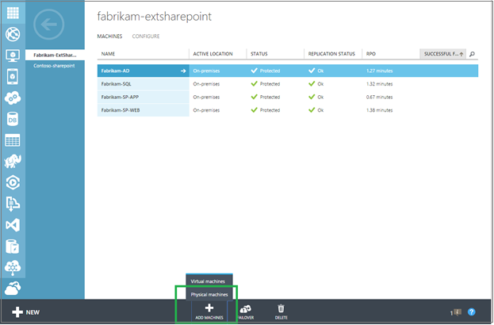
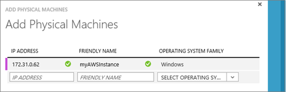

<properties
    pageTitle="使用 Site Recovery 将虚拟机从 Amazon Web Services 迁移到 Azure | Azure"
    description="本文介绍如何使用 Azure Site Recovery 将 Amazon Web Services (AWS) 中运行的虚拟机迁移到 Azure。"
    services="site-recovery"
    documentationcenter=""
    author="rayne-wiselman"
    manager="jwhit"
    editor="" />  

<tags
    ms.assetid="ddb412fd-32a8-4afa-9e39-738b11b91118"
    ms.service="site-recovery"
    ms.devlang="na"
    ms.topic="article"
    ms.tgt_pltfrm="na"
    ms.workload="backup-recovery"
    ms.date="11/01/2016"
    wacn.date="12/12/2016"
    ms.author="raynew" />  

# 使用 Azure Site Recovery 将 Amazon Web Services (AWS) 中的虚拟机迁移到 Azure
## 概述
欢迎使用 Azure Site Recovery。根据本文所述的方法，使用 Site Recovery 将 AWS 中运行的 EC2 实例迁移到 Azure。开始之前，请注意：

- **目前仅能从 AWS 迁移到 Azure。可以从 AWS 将 VM 故障转移到 Azure，但不能重新对其进行故障回复。没有任何正在进行的复制。**
- 本文中的迁移说明以将物理计算机复制到 Azure 的说明为基础。

请将任何评论或问题发布到本文底部，或者发布到 [Azure 恢复服务论坛](https://social.msdn.microsoft.com/Forums/zh-cn/home?forum=hypervrecovmgr)

## 支持的操作系统
可以使用 Site Recovery 来迁移运行以下任何操作系统的 EC2 实例

### Windows（仅 64 位）
* Windows Server 2008 R2 SP1+（仅限 Citrix PV 驱动程序或 AWS PV 驱动程序；**不支持运行 RedHat PV 驱动程序的实例**）
* Windows Server 2012
* Windows Server 2012 R2

## 先决条件
以下是执行此部署所需的组件

- **配置服务器**：运行 Windows Server 2012 R2 作为配置服务器的本地 VM。在此 VM 上也安装其他 Site Recovery 组件（包括进程服务器和主目标服务器）。
- **EC2 VM 实例**：要迁移的 EC2 实例。

## 部署步骤

1. 创建保管库
2. 部署管理服务器
3. 部署管理服务器之后，验证该服务器是否能够与要迁移的 EC2 实例通信。
4. 创建保护组。保护组包含共享相同复制设置的受保护计算机。指定组的复制设置，这些设置将被应用到添加到该组的所有计算机。 
5. 安装移动服务。你要保护的每个虚拟机需要安装移动服务。此服务将数据发送到进程服务器。可以手动安装移动服务，也可以在启用了虚拟机保护后由进程服务器自动推送并安装。要迁移的 EC2 实例上的防火墙规则应配置为允许此服务的推送安装。EC2 实例的安全组应具有以下规则：

	

6. 为计算机启用保护。将想要保护的计算机添加到复制组中。

	

7. 可以使用实例的专用 IP 地址发现你要迁移到 Azure 的 EC2 实例，该地址可以在 EC2 控制台中获取。在保护组中，可以添加每个实例的专用 IP 地址。

	

	向组添加计算机之后，系统将启用保护，并且依据保护组设置运行初始复制。

9. [运行非计划的故障转移](/documentation/articles/site-recovery-failover/#run-an-unplanned-failover)。初始复制完成后，可以为每个 VM 运行从 AWS 到 Azure 的非计划故障转移。（可选）你可以创建一个恢复计划并运行非计划的故障转移，从 AWS 向 Azure 迁移多个虚拟机。[详细了解](/documentation/articles/site-recovery-create-recovery-plans/)恢复计划。
		
## 后续步骤

若要详细了解其他复制方案，请参阅[什么是 Azure Site Recovery？](/documentation/articles/site-recovery-overview/)

<!---HONumber=Mooncake_1205_2016-->