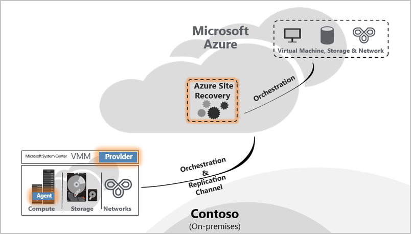
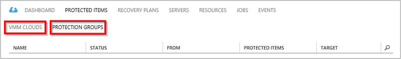
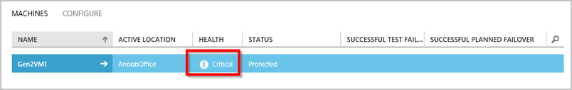
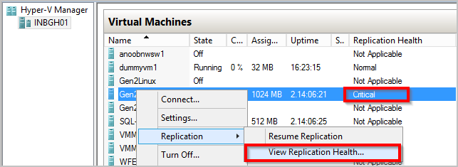
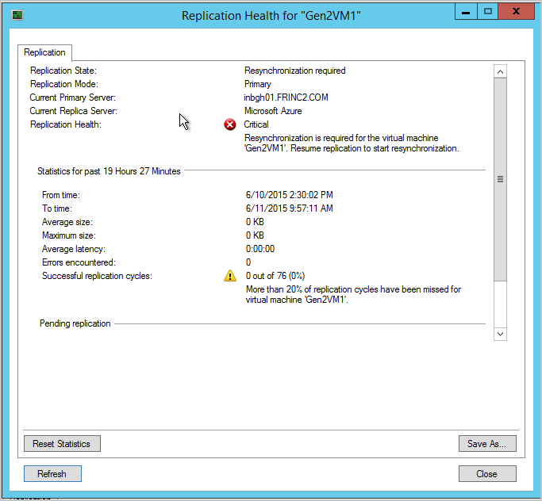
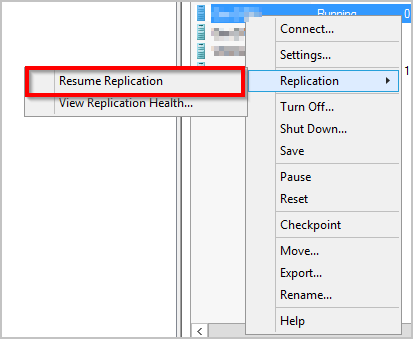
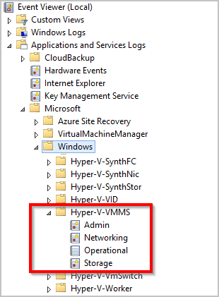
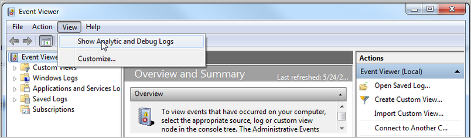
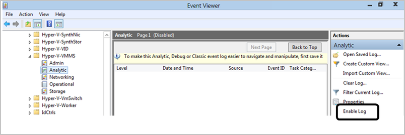
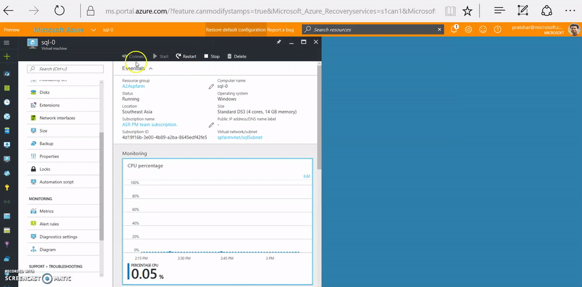

<properties
    pageTitle="监视虚拟机和物理服务器的保护及其故障排除 | Azure"
    description="Azure Site Recovery 可以协调位于本地服务器中的虚拟机到 Azure 或辅助数据中心的复制、故障转移和恢复。参考本文来监视 Virtual Machine Manager 或 Hyper-V 站点保护并对其进行故障排除。"
    services="site-recovery"
    documentationcenter=""
    author="ruturaj"
    manager="mkjain"
    editor="" />
<tags
    ms.assetid="0fc8e368-0c0e-4bb1-9d50-cffd5ad0853f"
    ms.service="site-recovery"
    ms.devlang="na"
    ms.topic="article"
    ms.tgt_pltfrm="na"
    ms.workload="storage-backup-recovery"
    ms.date="01/19/2017"
    wacn.date="03/10/2017"
    ms.author="rajanaki" />  

# 监视虚拟机和物理服务器的保护及其故障排除
本监视与故障排除指南可帮助你了解如何跟踪 Azure Site Recovery 的复制运行状况，并掌握相关的故障排除方法。

## 了解组件

### 用于在本地与 Azure 之间复制的物理服务器站点部署
若要设置本地物理服务器与 Azure 之间的数据库恢复，需要在虚拟机或服务器上设置配置服务器、主目标服务器和进程服务器组件。为源服务器启用保护时，Azure Site Recovery 将安装 Azure 应用服务的移动应用功能。在本地中断或源服务器故障转移到 Azure 后，客户需要在 Azure 中设置进程服务器，并在本地设置主目标服务器，以便在本地重新生成源服务器。

### 用于在本地站点之间复制的 Virtual Machine Manager 站点部署
若要在两个本地位置之间设置数据库恢复，需要下载 Azure Site Recovery 提供程序，并将其安装在 Virtual Machine Manager 服务器上。该提供程序需要连接到 Internet，确保从 Azure 门户触发的所有操作都转换成本地操作。

  

### 用于在本地位置与 Azure 之间复制的 Virtual Machine Manager 站点部署
在本地位置与 Azure 之间设置数据库恢复时，需要下载 Azure Site Recovery 提供程序，并将其安装在 Virtual Machine Manager 服务器上。此外，还需要在每个 Hyper-V 主机上安装 Azure 恢复服务代理。有关详细信息，请参阅[了解站点到 Azure 的保护](/documentation/articles/site-recovery-understanding-site-to-azure-protection/)。

  

### 用于在本地位置与 Azure 之间复制的 Hyper-V 站点部署
此过程与 Virtual Machine Manager 部署类似。唯一的区别在于，Azure Site Recovery 提供程序和 Azure 恢复服务代理将在 Hyper-V 主机上自行安装。有关详细信息，请参阅[了解站点到 Azure 的保护](/documentation/articles/site-recovery-understanding-site-to-azure-protection/)。

## 监视配置、保护和恢复操作
在“作业”选项卡下，Azure Site Recovery 中的每项操作都会经过审核和跟踪。若要查看任何配置、保护或恢复错误，请转到“作业”选项卡，然后查找故障。

  

如果在“作业”选项卡下发现故障，请单击相应的作业，然后单击该作业对应的“错误详细信息”。

  

可以借助错误详细信息识别可能的原因，获得解决问题的建议。

  

在上述示例中，另一个正在进行的操作可能导致保护配置失败。请根据建议解决此问题，然后单击“重新启动”再次启动操作。

  

“重新启动”选项并不适用于所有操作。如果操作没有对应的“重新启动”选项，请返回到对象，然后重做操作。可以使用“取消”按钮取消正在进行的任何作业。

  

## 监视虚拟机的复制运行状况
可以使用 Azure 门户远程监视每个受保护的实体的 Azure Site Recovery 提供程序。单击“受保护的项”，然后单击“VMM 云”或“保护组”。“VMM 云”选项卡只适用于基于 Virtual Machine Manager 的部署。对于其他方案，受保护的实体位于“保护组”选项卡下。

  

在相应的云或保护组下，单击受保护的实体，查看底部窗格中显示的所有可用操作。

  

如上面的屏幕截图所示，虚拟机运行状况为“关键”。可以单击底部的“错误详细信息”按钮查看错误。根据“可能的原因”和“建议”解决问题。

  

  

> [AZURE.NOTE]
如果任何可用操作正在进行或失败，请转到“作业”视图（如前所述），查看特定作业的错误。
> 
> 

## 排查本地 Hyper-V 问题
连接本地 Hyper-V 管理器控制台，选择虚拟机，然后查看复制运行状况。

  

在本例中，“复制运行状况”为“关键”。右键单击虚拟机，然后单击“复制”>“查看复制运行状况”查看详细信息。

  

如果虚拟机复制已暂停，请右键单击虚拟机，然后单击“复制”>“恢复复制”。

  

如果虚拟机迁移通过 Azure Site Recovery 配置的新 Hyper-V 主机（在群集或独立计算机中），虚拟机的复制不受影响。请确保新的 Hyper-V 主机符合所有先决条件，并已使用 Azure Site Recovery 进行配置。

### 事件日志

| 事件源 | 详细信息 |
| --- |:--- |
| **Applications and Service Logs/Microsoft/VirtualMachineManager/Server/Admin**（Virtual Machine Manager 服务器） |提供实用的日志记录，用于排查许多不同的 Virtual Machine Manager 问题。 |
| **Applications and Service Logs/MicrosoftAzureRecoveryServices/Replication**（Hyper-V 主机） |提供实用的日志记录，用于排查许多 Azure 恢复服务代理问题。   |
| **Applications and Service Logs/Microsoft/Azure Site Recovery/Provider/Operational**（Hyper-V 主机） |提供实用的日志记录，用于排查许多 Azure Site Recovery 服务问题。   |
| **Applications and Service Logs/Microsoft/Windows/Hyper-V-VMMS/Admin**（Hyper-V 主机） |提供实用的日志记录，用于排查许多 Hyper-V 虚拟机管理问题。   |

### Hyper-V 复制日志记录选项
与 Hyper-V 复制相关的所有事件都会记录在“Applications and Services Logs\\Microsoft\\Windows”下的 Hyper-V-VMMS\\Admin 日志中。此外，还可为 Hyper-V 虚拟机管理服务启用分析日志。若要启用此日志，请先在“事件查看器”中显示“分析”与“调试”日志。打开“事件查看器”，然后单击“视图”>“显示分析和调试日志”。

  

分析日志显示在“Hyper-V-VMMS”下。

  

在“操作”窗格中，单击“启用日志”。启用后，日志将作为“事件跟踪会话”显示在“性能监视器”中的“数据收集器集”下。

  

若要查看收集到的信息，请先禁用日志，从而停止跟踪会话。保存日志，然后再次在“事件查看器”中打开日志，或使用其他工具根据需要转换日志。

## 联系 Microsoft 技术

### 日志收集

对于 Virtual Machine Manager 站点保护，请参阅[使用支持诊断平台 (SDP) 工具收集 Azure Site Recovery 日志](http://social.technet.microsoft.com/wiki/contents/articles/28198.asr-data-collection-and-analysis-using-the-vmm-support-diagnostics-platform-sdp-tool.aspx)收集所需的日志。

对于 Hyper-V 站点保护，请下载[工具](https://dcupload.microsoft.com/tools/win7files/DIAG_ASRHyperV_global.DiagCab)，然后在 Hyper-V 主机上执行该工具以收集日志。

对于物理服务器方案，请参阅[针对物理站点保护收集 Azure Site Recovery 日志](http://social.technet.microsoft.com/wiki/contents/articles/30677.azure-site-recovery-log-collection-for-vmware-and-physical-site-protection.aspx)收集所需的日志。

工具在本地收集日志，这些日志位于 %LocalAppData%\\ElevatedDiagnostics 下随机命名的子文件夹中。

### 在线申请支持

若需要对应 ASR 的帮助，请[在线申请支持](/support/support-ticket-form/?l=zh-cn)创建工单

## 知识库文章
* [如何为已故障转移或迁移到 Azure 的受保护虚拟机保留驱动器号](http://support.microsoft.com/zh-cn/kb/3031135)
* [如何管理本地到 Azure 保护的网络带宽用量](https://support.microsoft.com/zh-cn/kb/3056159)
* [Azure Site Recovery：尝试为虚拟机启用保护时发生“找不到群集资源”错误](http://support.microsoft.com/zh-cn/kb/3010979)
* [Hyper-V 复制简介和故障排除指南](http://social.technet.microsoft.com/wiki/contents/articles/21948.hyper-v-replica-troubleshooting-guide.aspx)

## 常见 ASR 错误及其解决方法	

下面介绍了常见错误及其解决方法。每个错误均记录在单独的 wiki 网页中。

### 常规
-   新 [作业失败并发生错误“操作正在进行。” 错误 505、514、532](http://social.technet.microsoft.com/wiki/contents/articles/32190.azure-site-recovery-jobs-failing-with-error-an-operation-is-in-progress-error-505-514-532.aspx)
-   新 [作业失败并发生错误“服务器未连接到 Internet”。错误 25018](http://social.technet.microsoft.com/wiki/contents/articles/32192.azure-site-recovery-jobs-failing-with-error-server-isn-t-connected-to-the-internet-error-25018.aspx)

### 设置
-   [由于出现内部错误，无法注册 VMM 服务器。请参阅 Site Recovery 门户中的作业视图，了解有关错误的更多详细信息。再次运行安装程序以注册该服务器。](http://social.technet.microsoft.com/wiki/contents/articles/25570.the-vmm-server-cannot-be-registered-due-to-an-internal-error-please-refer-to-the-jobs-view-in-the-site-recovery-portal-for-more-details-on-the-error-run-setup-again-to-register-the-server.aspx)
-   [无法建立到 Hyper-V Recovery Manager 保管库的连接。请验证代理设置或稍后再试。](http://social.technet.microsoft.com/wiki/contents/articles/25571.a-connection-cant-be-established-to-the-hyper-v-recovery-manager-vault-verify-the-proxy-settings-or-try-again-later.aspx)

### 配置
-   [无法创建保护组: 检索服务器列表时出错。](http://blogs.technet.com/b/somaning/archive/2015/08/12/unable-to-create-the-protection-group-in-azure-site-recovery-portal.aspx)
-   [Hyper-V 主机群集包含至少一个静态网络适配器，或者将没有连接的适配器配置为使用 DHCP。](http://social.technet.microsoft.com/wiki/contents/articles/25498.hyper-v-host-cluster-contains-at-least-one-static-network-adapter-or-no-connected-adapters-are-configured-to-use-dhcp.aspx)
-   [VMM 不具有完成某项操作的权限](http://social.technet.microsoft.com/wiki/contents/articles/31110.vmm-does-not-have-permissions-to-complete-an-action.aspx)
-   [配置保护时无法选择订阅中的存储帐户](http://social.technet.microsoft.com/wiki/contents/articles/32027.can-t-select-the-storage-account-within-the-subscription-while-configuring-protection.aspx)

### 保护
- 新 [启用保护失败并发生错误“无法为虚拟机配置保护”。错误 60007、40003](http://social.technet.microsoft.com/wiki/contents/articles/32194.azure-site-recovery-enable-protection-failing-with-error-protection-couldn-t-be-configured-for-the-virtual-machine-error-60007-40003.aspx)
- 新 [启用保护失败并发生错误“无法为虚拟机启用保护。” 错误 70094](http://social.technet.microsoft.com/wiki/contents/articles/32195.azure-site-recovery-enable-protection-failing-with-error-protection-couldn-t-be-enabled-for-the-virtual-machine-error-70094.aspx)
- 新 [实时迁移错误 23848 - 将使用 Live 类型移动虚拟机。这可能会中断虚拟机的恢复保护状态。](http://social.technet.microsoft.com/wiki/contents/articles/32021.live-migration-error-23848-the-virtual-machine-is-going-to-be-moved-using-type-live-this-could-break-the-recovery-protection-status-of-the-virtual-machine.aspx)
- [启用保护失败，因为主机上未安装代理](http://social.technet.microsoft.com/wiki/contents/articles/31105.enable-protection-failed-since-agent-not-installed-on-host-machine.aspx)
- [找不到适合副本虚拟机的主机 - 因为计算资源较少](http://social.technet.microsoft.com/wiki/contents/articles/25501.a-suitable-host-for-the-replica-virtual-machine-can-t-be-found-due-to-low-compute-resources.aspx)
- [找不到适合副本虚拟机的主机 - 因为没有连接逻辑网络](http://social.technet.microsoft.com/wiki/contents/articles/25502.a-suitable-host-for-the-replica-virtual-machine-can-t-be-found-due-to-no-logical-network-attached.aspx)
- [无法连接到副本主机 - 不能建立连接](http://social.technet.microsoft.com/wiki/contents/articles/31106.cannot-connect-to-the-replica-host-machine-connection-could-not-be-established.aspx)

### 恢复
- Virtual Machine Manager 无法完成主机操作 -
    -   [故障转移到虚拟机的所选恢复点：常规拒绝访问错误。](http://social.technet.microsoft.com/wiki/contents/articles/25504.fail-over-to-the-selected-recovery-point-for-virtual-machine-general-access-denied-error.aspx)
    -   [Hyper-V 无法故障转移到虚拟机的所选恢复点：操作中止。请尝试使用较新的恢复点。(0x80004004)](http://social.technet.microsoft.com/wiki/contents/articles/25503.hyper-v-failed-to-fail-over-to-the-selected-recovery-point-for-virtual-machine-operation-aborted-try-a-more-recent-recovery-point-0x80004004.aspx)
    -   不能建立与服务器的连接 (0x00002EFD)
        -   [Hyper-v 无法启用虚拟机的反向复制](http://social.technet.microsoft.com/wiki/contents/articles/25505.a-connection-with-the-server-could-not-be-established-0x00002efd-hyper-v-failed-to-enable-reverse-replication-for-virtual-machine.aspx)
        -   [Hyper-v 无法启用虚拟机的复制](http://social.technet.microsoft.com/wiki/contents/articles/25506.a-connection-with-the-server-could-not-be-established-0x00002efd-hyper-v-failed-to-enable-replication-for-virtual-machine-virtual-machine.aspx)
    -   [无法提交虚拟机的故障转移](http://social.technet.microsoft.com/wiki/contents/articles/25508.could-not-commit-failover-for-virtual-machine.aspx)
-   [恢复计划包含的虚拟机未准备好进行计划的故障转移](http://social.technet.microsoft.com/wiki/contents/articles/25509.the-recovery-plan-contains-virtual-machines-which-are-not-ready-for-planned-failover.aspx)
-   [虚拟机未准备好进行计划的故障转移](http://social.technet.microsoft.com/wiki/contents/articles/25507.the-virtual-machine-isn-t-ready-for-planned-failover.aspx)
-   [虚拟机未运行且未关闭](http://social.technet.microsoft.com/wiki/contents/articles/25510.virtual-machine-is-not-running-and-is-not-powered-off.aspx)
-   [虚拟机发生带外操作且提交故障转移失败](http://social.technet.microsoft.com/wiki/contents/articles/25507.the-virtual-machine-isn-t-ready-for-planned-failover.aspx)
-   测试故障转移
    -   [无法启动故障转移，因为正在进行测试故障转移](http://social.technet.microsoft.com/wiki/contents/articles/31111.failover-could-not-be-initiated-since-test-failover-is-in-progress.aspx)
-   新 故障转移将超时，显示 'PreFailoverWorkflow 任务 WaitForScriptExecutionTask 超时'，这是与虚拟机或虚拟机所属的子网相关联的网络安全组的配置设置造成的。有关详细信息，请参阅['PreFailoverWorkflow 任务 WaitForScriptExecutionTask 超时’](http://social.technet.microsoft.com/wiki/contents/articles/34503.failover-operation-timed-out-due-to-prefailoverworkflow-task-waitforscriptexecutiontask-timed-out.aspx)。

### 配置服务器、进程服务器、主目标
* [PS/CS 作为虚拟机托管所在的 ESXi 主机发生故障，出现死机紫屏。](http://social.technet.microsoft.com/wiki/contents/articles/31107.vmware-esxi-host-experiences-a-purple-screen-of-death.aspx)

### 故障转移后进行远程桌面故障排除
* 许多客户在连接到 Azure 中已故障转移的虚拟机时会遇到问题。[参考故障排除文档通过 RDP 连接到虚拟机](http://social.technet.microsoft.com/wiki/contents/articles/31666.troubleshooting-remote-desktop-connection-after-failover-using-asr.aspx)。

#### 在 Resource Manager 虚拟机上添加公共 IP
如果门户中的“连接”按钮灰显，并且你未通过 Express Route 或站点到站点 VPN 连接连接 Azure，必须先为虚拟机创建并分配一个公共 IP 地址，然后才能使用远程桌面/共享 Shell。然后，可在虚拟机的网络接口上添加公共 IP。

  

<!---HONumber=Mooncake_0306_2017-->
<!--Update_Description: whole content wording refine-->